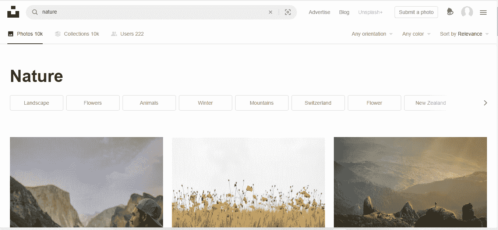

# 什么是 API，它是如何工作的？面向初学者的 API

> 原文：<https://www.freecodecamp.org/news/how-apis-work/>

当我开始学习编码时，术语 API 总是困扰着我。我无法理解它的实际含义，因为我会听到人们在不同的上下文中谈论 API。

最大的挑战是我找不到用简单的术语学习 API 的资源。

现在我知道了 API 是如何工作的，我决定为那些正在努力理解这个并不复杂但仍然令人困惑的 web 开发和软件工程主题的新手写这篇指南。

## 什么是 API？

API 代表应用程序编程接口。应用程序可以是执行特定任务的任何软件，接口是两个应用程序通信的点。

一个应用程序充当客户端，另一个充当服务器。一个客户端请求一些资源，比如说一张照片，服务器将照片发送给客户端。

这里的客户端可以是你的手机、台式机或笔记本电脑，或者任何你用来上网的设备。服务器是一台更大的计算机，存储你想要的数据(在我们的例子中是一张照片)。

假设我想上传一张自然照片到我的旅游博客。我可以去 Unsplash 网站，在搜索栏中输入“自然”,它会返回大量的自然照片。

这是一个在幕后工作的 API，使 Unsplash 和我之间的对话发生。

## API 是如何工作的？

计算机遵循一种协议相互通信。协议只不过是计算机通信时遵循的一组规则。任何不遵循该协议的计算机都会中断通信线程。

以前你可能会用蓝牙来分享数据。蓝牙只不过是移动设备在较短距离内相互通信的一种协议。

当你要求你的朋友给你发送他们最后一次旅行的照片时，你的设备充当客户端，你朋友的设备(发送照片的设备)是服务器。

这只是协议的一个例子。在计算机科学的世界里，我们有大量的协议——一个协议几乎适用于任何事情。

在网络上，我们使用 HTTP 协议(代表超文本传输协议)。web 上可用的 API 使用 HTTP 协议有很多原因——例如，它易于使用并且很受欢迎。

通过 **HTTP 协议**进行的通信也被称为请求-响应周期，因为这正是该协议的工作方式。客户端向服务器发送请求，服务器响应客户端的请求。

与人类不同，计算机必须严格地相互通信，否则它们会中断通信。因此，客户端(发出请求的计算机/设备)需要一组信息随请求一起发送，以便服务器做出相应的响应。这些信息包括:

1.  URL–您希望提出请求的网址
2.  方法——您是希望数据已经存储在某个地方，还是希望在数据库中保存新数据
3.  header–关于您的请求的所有相关信息，包括客户端设备预期接收数据的格式
4.  正文–正文包含实际的请求数据

在我们的 Unsplash 示例中，URL 是[https://unsplash.com/s/photos/nature](https://unsplash.com/s/photos/england)。方法是 GET，因为我们希望服务器取回自然图像。头部包括我们的计算机期望获得和接受的格式等信息，如语言含义、设备的语言、我们的操作系统等等。主体包括我们需要发送给服务器的数据，例如 nature 关键字。

对于 HTTP 请求，有四种类型的方法，我们一会儿再回来讨论。现在，只需要知道一个方法指示您想要对服务器上可用的数据做什么。例如，您是否希望该数据作为文档，或者您是否希望在某处保存的数据中保存一个新条目。

当客户端发出请求时，服务器会响应该请求。响应可能是客户端请求的数据或错误。

就像响应一样，请求的结构包括 URL、状态代码、标题和正文。在请求中，我们有一个方法，它有四种类型。在响应中，我们有一个状态代码，指示请求是被接受还是被拒绝。

### HTTP 方法

有四种可用的 HTTP 方法，每种方法都有其独特的功能。

1.  GET:正如已经讨论过的，这表明客户机正在请求从服务器发送数据。
2.  POST:这个方法告诉服务器，客户机想要在数据库中创建一个新条目。例如，在所有以前博客的数据库中保存一篇新的博客文章。
3.  删除:顾名思义，客户端希望从数据库中删除一个数据记录。
4.  PUT:当客户机想要更新或编辑数据记录时，使用这个方法。例如，更改您的脸书密码。

### HTTP 状态代码

HTTP 状态代码有一个庞大的列表，但是让我们来看几个最常见的:

1.  200 OK:这表示服务器成功地满足了请求
2.  201 已创建:您请求创建的数据条目已创建
3.  404 未找到:这表明服务器没有找到您请求的资源
4.  500 内部服务器错误:这意味着一个错误发生在服务器端，它不能满足您的请求

没有必要记住这些状态代码，因为列表很大，当您在开发过程中遇到它们时，您会下意识地学习它们。

尽管如此，仍有一系列状态代码表示一般响应，如下所示:

1.  100s:指示请求进度的信息性响应
2.  200s:成功，表示请求成功
3.  300s:重定向，表示请求必须重定向到其他地方
4.  400s:客户端错误，表示发生在客户端的错误
5.  500s:服务器错误，即服务器无法响应有效的客户端请求

## 原料药的类型

还记得我告诉过你，当人们在不同的上下文中谈论 API 时，我会感到困惑。这是因为我们也有不同类型的 API 可用。

我们在本文中讨论的是使用 HTTP 协议的 web APIs。开发人员可以使用它们为他们的用户创造更好的用户体验。

其他类型包括对外部用户隐藏的、只在公司内部使用的内部 API。

还有一些开放的 API，任何人都可以免费使用(比如开放的天气地图 API)。您可以拥有在业务合作伙伴之间共享的、仅用于执行其业务任务的合作伙伴 API，以及将多个 API 请求顺序组合成单个 API 调用的复合 API，以减少服务器负载并创建更快的体验。

### 了解 API 更多信息的资源:

如果你想了解更多关于如何设计 API 的知识，[这里有一整本书供你入门](https://www.freecodecamp.org/news/rest-api-design-best-practices-build-a-rest-api/)。

您可以在这里了解更多关于[类型的 API、测试工具和文档](https://www.freecodecamp.org/news/what-is-an-api-and-how-to-test-it/)。

这里有一个教程将会教你所有关于 REST APIs 的知识。

这里有一张 [Fetch API cheatsheet](https://www.freecodecamp.org/news/fetch-api-cheatsheet/) 让你开始学习 Fetch。

## 结论

API 是两台计算机进行通信的接口，以便在互联网上执行任务。

API 遵循 HTTP 协议进行通信，该协议具有特定的请求和响应结构。

存在不同的方法来执行不同的任务，并且有许多状态代码可用于指示请求是成功、被拒绝还是处于挂起状态。

有兴趣在 LinkedIn 上联系吗？在 Tooba Jamal 给我打电话。