# 网络设备–集线器和交换机的工作原理以及如何保护它们

> 原文：<https://www.freecodecamp.org/news/how-hub-switch-work-and-how-to-protect-them/>

在之前的一篇文章中，我描述了以太网协议的每一个比特和字节。在这篇文章中，你将了解两种网络设备，它们是如何工作的，以及黑客如何利用这些知识。

# 经典以太网的工作原理

在描述网络设备之前，先考虑一个没有特殊网络设备的网络。即使用传统以太网的网络，所有计算机都连接到一根电缆上。

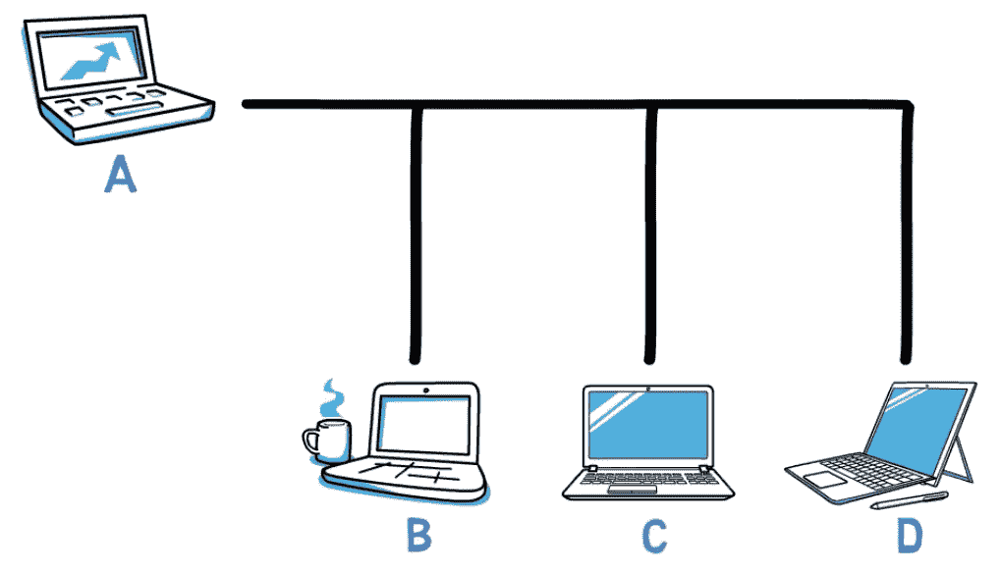

Four devices connected using classic Ethernet (Source: [Brief](https://www.youtube.com/watch?v=Youk8eUjkgQ&ab_channel=Brief))

在这种情况下，如果计算机 A 向另一台计算机(例如–B)发送消息，该消息将通过共享电缆发送，所有设备都会接收到该消息。

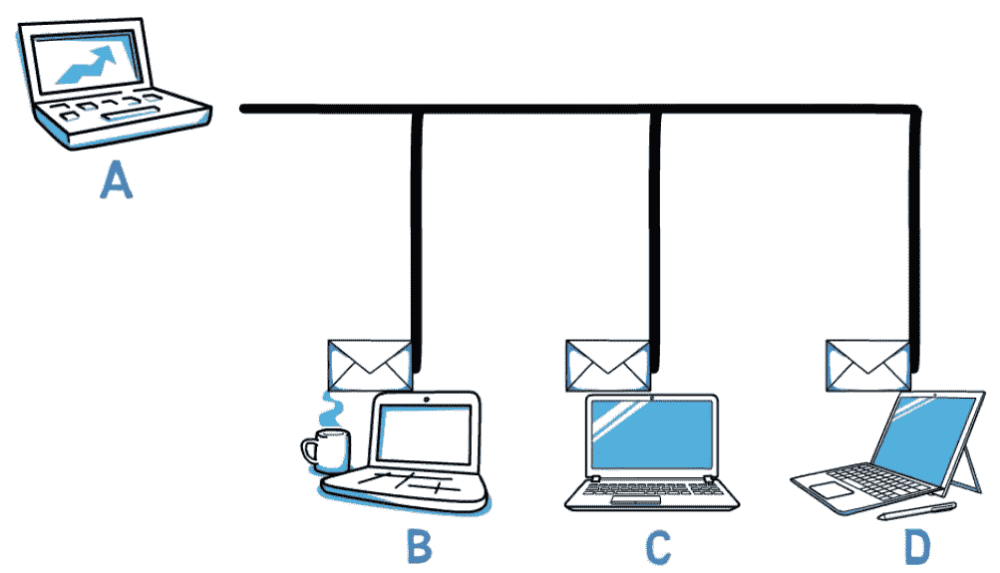

With classic Ethernet, If A sends a message to B - all devices (except for A) receive this message (Source: [Brief](https://www.youtube.com/watch?v=Youk8eUjkgQ&ab_channel=Brief))

你能想到这种网络结构的一些问题吗？

首先，**过载—**所有网络帧被所有计算机接收。假设 A 想发送一个帧给 b，C 也看到了这个帧，不得不意识到这个帧的目的地不是他的地址，从而丢弃它。这个过程需要时间和资源。当然，同样的过程也发生在机器 D 上。

第二，**隐私—**如果 C 看到了 A 发给 B 的每一条消息，反之亦然，这就意味着隐私被侵犯了。我们宁愿有一个只有 A 和 B 看到它们之间发送的消息的网络。

第三，**可扩展性—**这个网络并不是真正可扩展的。假设多达 10 台计算机可以连接到此电缆。当你需要增加一台电脑时会发生什么？你必须更换整条电缆。这又贵又不方便。

好吧，实际上必须更换电缆的人可能是 it 人员——你知道，那个确保你的网络中一切正常运行并且很少被注意到直到坏事发生的人(至少当你在一个足够大的有 it 人员的组织中工作时)。

明确一点，我们喜欢 it 人员。我们希望他们的生活是美好的，我们不希望他们总是跑来跑去买电缆。

第四，**冲突**——假设 A 想给 B 发送一条消息，C 想给 d 发送一条消息。同时，两者都可能开始传输，消息将*冲突*。

在这种情况下，我们会出现错误——就像两个人同时开始说话，你不可能理解他们中的任何一个。

第五，这种网络结构可能会导致**饥饿**——假设 A 正在传输一个帧。如果其它站希望避免冲突，它们将停止发送数据。但现在，机器 A 可以永远继续传输，从而将所有带宽都据为己有，不让任何其他站发言。这叫饿死。

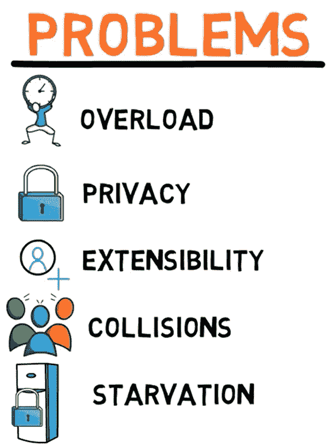

Five major problems with classic Ethernet networks (Source: [Brief](https://www.youtube.com/watch?v=Youk8eUjkgQ&ab_channel=Brief))

嗯，这似乎不是最好的网络，不是吗？

我们现在将了解有助于处理这些问题的网络设备。

# 网络设备如何解决这些问题

## 什么是枢纽？

一个只解决可扩展性问题的设备叫做 T2 集线器。集线器是有多个端口的设备，单根以太网电缆连接到这些端口:

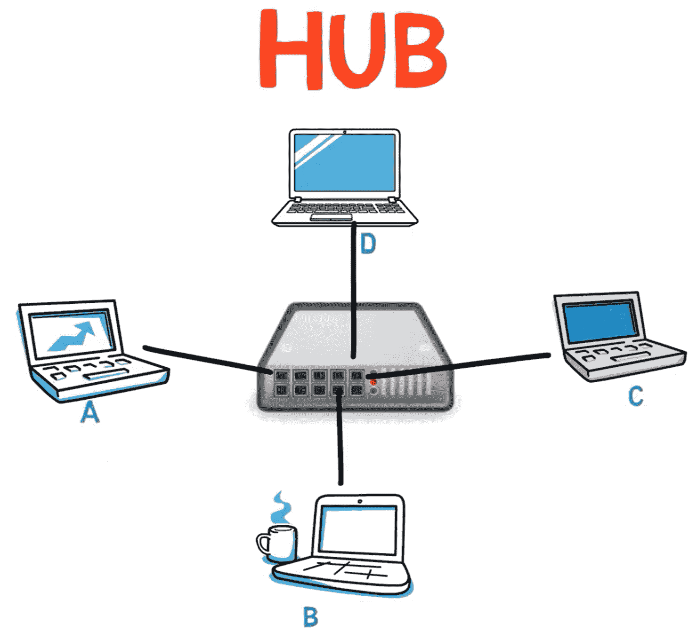

An Ethernet hub is a device with multiple ports, each connected to a single Ethernet cable (Source: [Brief](https://www.youtube.com/watch?v=Youk8eUjkgQ&ab_channel=Brief))

所以现在，我们有了一个集线器，每台计算机通过一根电缆连接，而不是一根电缆连接多台计算机。这使得 it 人员的生活更加轻松。

集线器只是接收脉冲，并将其相乘，也就是说，将其发送到所有其他端口。例如，如果 A 向 B 发送一个帧，集线器会将该帧发送到 B、C 和 D——除 A 的端口之外的所有端口。

集线器不理解以太网，也不知道任何关于 MAC 地址的信息。对于集线器来说，所有的位都只是通过线路传输的位，这些位应该到达所有其它的终端。

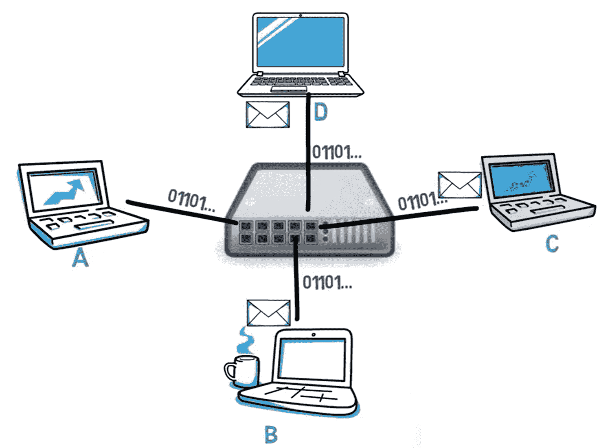

A hub simply takes a bitstream and multiplies it to all ports but the source port (Source: [Brief](https://www.youtube.com/watch?v=Youk8eUjkgQ&ab_channel=Brief))

现在，如果你需要添加一台新的计算机到网络上，你可以简单地把它连接到集线器上。

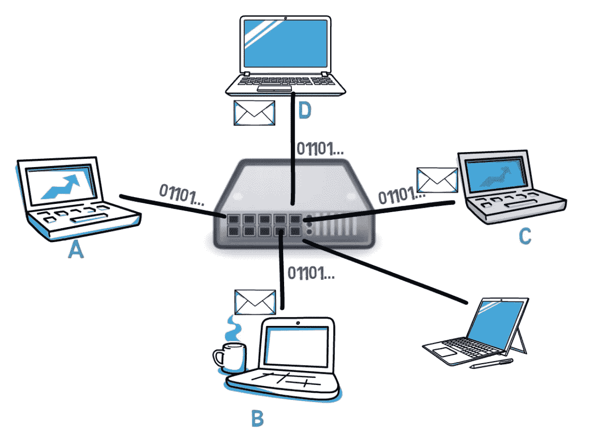

To add a new device to the network, we simply connect it to the Hub (Source: [Brief](https://www.youtube.com/watch?v=Youk8eUjkgQ&ab_channel=Brief))

如果集线器用完了端口，会发生什么情况？没问题，我们将它连接到另一个集线器，就像这样:

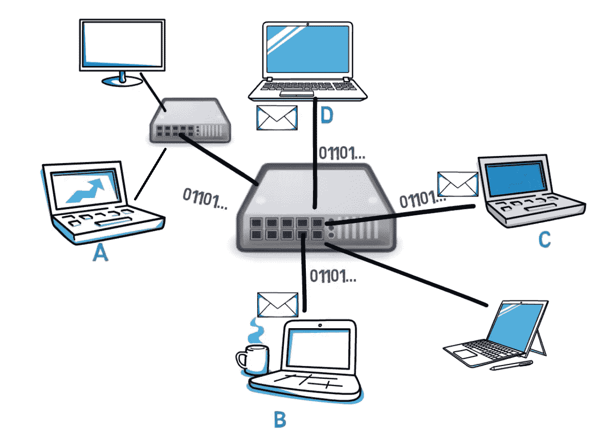

In case you run out of ports, you can add another Hub (Source: [Brief](https://www.youtube.com/watch?v=Youk8eUjkgQ&ab_channel=Brief))

不错！这比传统的以太网更容易维护。

然而，至少对于传统的中枢来说，所有其他的问题仍然存在。由于所有电脑都接收到 A 发给 B 的帧，没有**隐私**，网络**超载**，**碰撞**，网络容易出现**饥饿**。

我们真正想要的是一种设备，当 A 向 B 发送帧时，它会将该帧转发给 B，并且只转发给 B。这种设备被称为**交换机**。

## 什么是开关？

如果所有的站都通过一个**开关**连接，A 发送一个帧给 B，只有 B 接收。

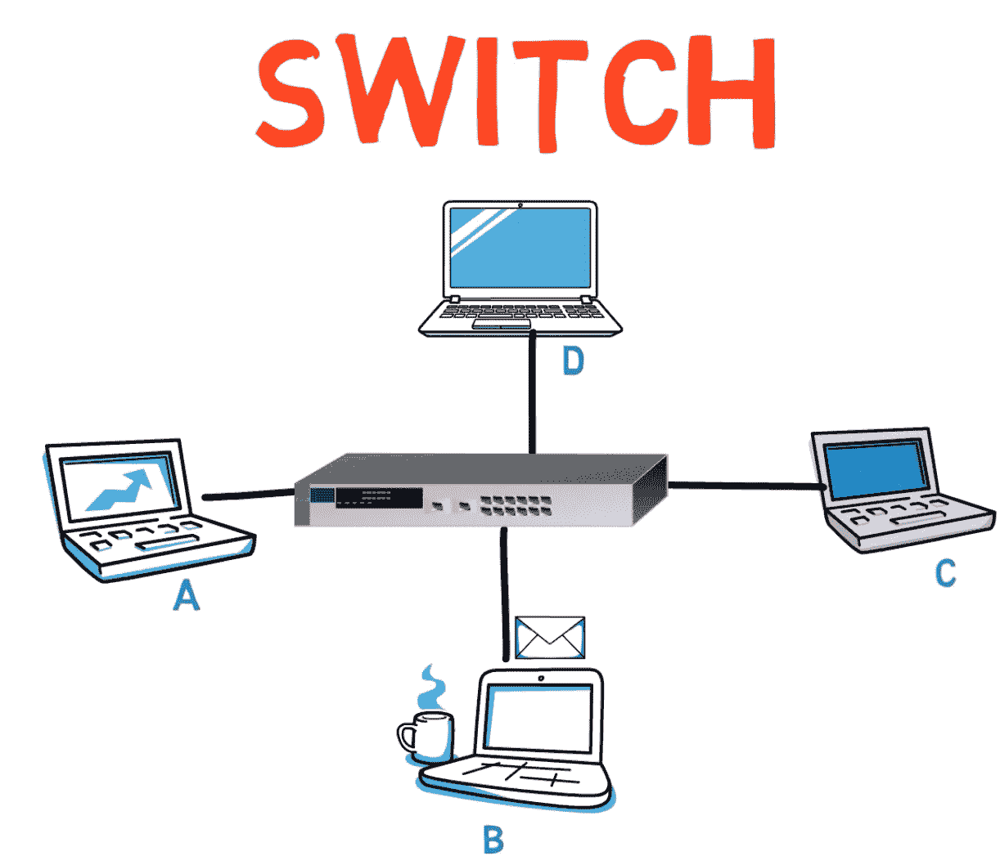

With a Switch, if A sends a message to B - only B will receive it (Source: [Brief](https://www.youtube.com/watch?v=Youk8eUjkgQ&ab_channel=Brief))

请注意，这意味着所有问题确实都已解决。设备不会过载，因为每一帧只会到达相关的接收者。不存在隐私问题，因为除了交换机之外，只有 A 和 B 可以看到该帧。如果需要，可以通过插入额外的交换机来轻松扩展网络。

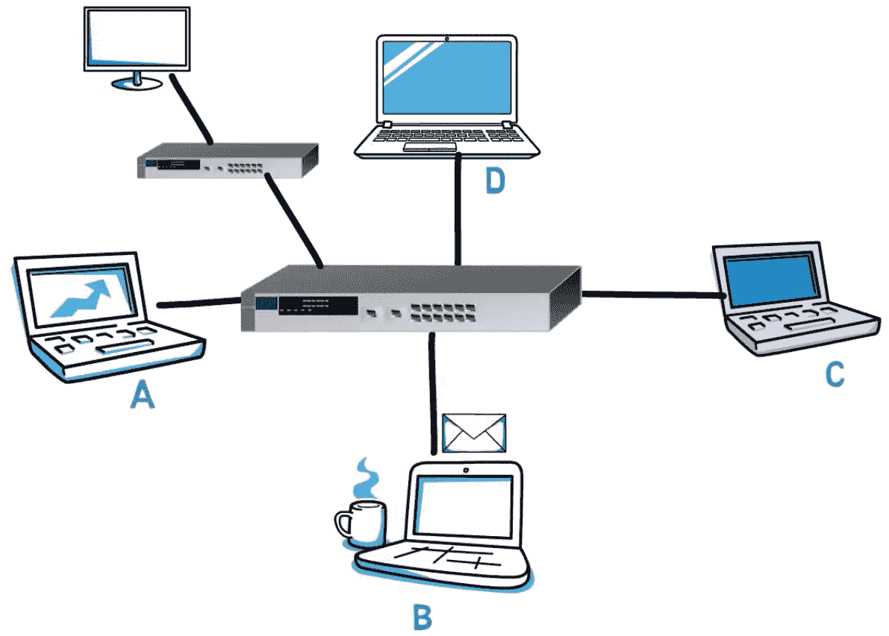

Similar to working with Hubs, the network is easily extensible by adding multiple Switches (Source: [Brief](https://www.youtube.com/watch?v=Youk8eUjkgQ&ab_channel=Brief))

交换机可以避免冲突，因为交换机和端点之间的每个连接都是单个**冲突域**，也就是说，交换机不会在同一时间在一条线上发送多个帧。

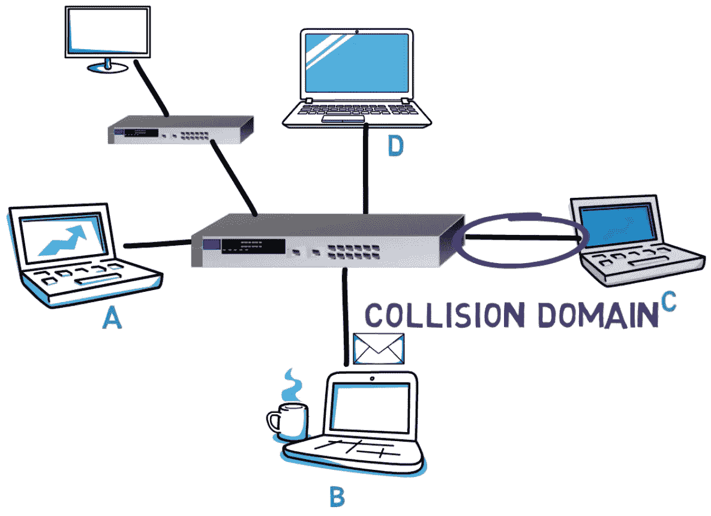

Every connection between the Switch and another device forms an independent collision domain (Source: [Brief](https://www.youtube.com/watch?v=Youk8eUjkgQ&ab_channel=Brief))

类似地，当 A 发送数据时，B 和 C 可以相互通信，因此不会出现饥饿。即使 A 一直向整个网络(即广播地址)发送帧，交换机也可以允许其它主机发送的消息在两者之间传输。

但是，这个神奇的开关怎么操作呢？

假设我们刚买了一台全新的交换机，并将其接入网络。a 向 B 发送一个帧，交换机如何知道计算机 B 的位置？

一种选择是手动配置交换机。也就是说，要有一个 MAC 地址和相关端口之间的映射表，并让人手动配置该表。

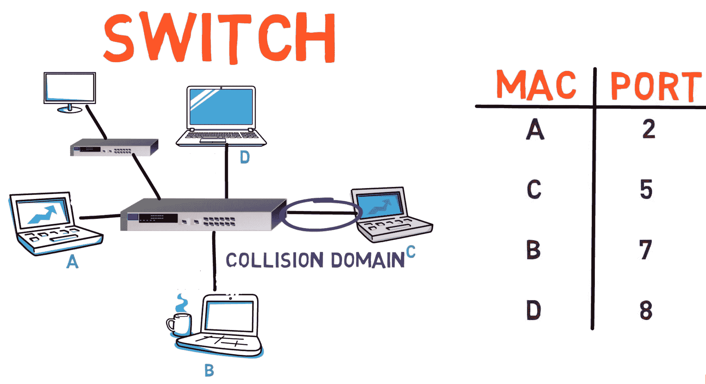

The Switch may hold a table mapping MAC addresses to physical ports (Source: [Brief](https://www.youtube.com/watch?v=Youk8eUjkgQ&ab_channel=Brief))

当我们说*某人*时，我们通常指的是 it 人员。我们喜欢 it 人员。我们不想每次都让他们做这种乏味的工作。

此外，我不知道你，但大多数人通常不会在每次将设备插入网络时都有一名 it 人员在家。

另一种选择是从交换机向每个端口发送一个特殊的消息，然后端点将回复它们的 MAC 地址。这里的主要缺点是，我们现在必须让所有设备都知道这个开关。我们需要改变设备的行为，使它们能够回复特殊的信息。

如果交换机仅仅是**透明的**就好得多了——没有端点需要知道它在那里，但它仍然可以完成工作。

显然，这确实是可以实现的！

考虑一下这个网络，它刚刚添加了一台全新的交换机。交换机存储一个表，将 MAC 地址映射到物理端口。这张桌子是空的。

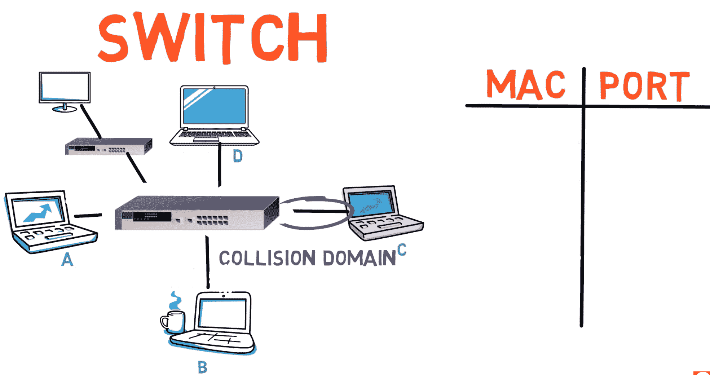

When a Switch joins a new network, the table mapping MAC addresses to physical ports is empty (Source: [Brief](https://www.youtube.com/watch?v=Youk8eUjkgQ&ab_channel=Brief))

现在，A 向 b 发送一个帧。

交换机理解以太网，可以查看帧头并读取源地址。由于该源地址映射到“A”，并且该消息是从物理端口号 2 发送的，因此交换机将 A 的 MAC 地址和端口号 2 的映射添加到其表中。

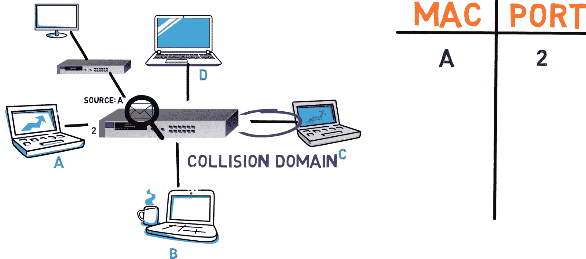

When machine A sends a frame, the Switch inspects the frame, reads the source address, and maps it with the corresponding physical port (Source: [Brief](https://www.youtube.com/watch?v=Youk8eUjkgQ&ab_channel=Brief))

但是交换机将对框架做什么呢？现在，交换机不知道 B 驻留在哪里，所以交换机只是将帧相乘，然后发送到所有端口，就像集线器一样。所以现在，B，C 和 D 都得到框架。

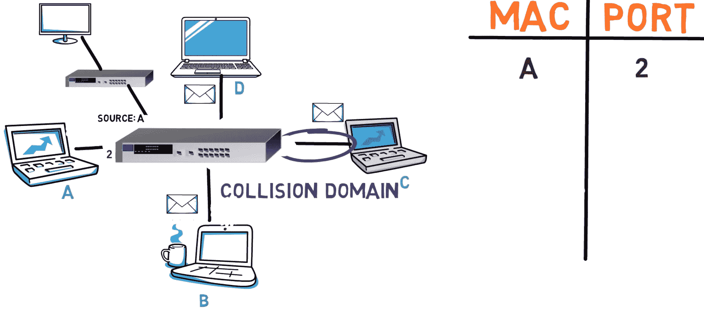

Since the Switch's table doesn't include a record for B, a frame destined to B is actually sent to all ports but the source port - the same as a Hub would do (Source: [Brief](https://www.youtube.com/watch?v=Youk8eUjkgQ&ab_channel=Brief))

接下来，A 向 b 发送另一条消息。交换机查看了这条消息，已经知道 A 的 MAC 地址插入了端口号 2。它仍然不知道 B，因此该帧也被发送到所有其它端口。

现在，C 向 a 发送一个帧。交换机查看**源地址**，并将 C 的 MAC 地址和端口号 5 之间的映射添加到它的表中。

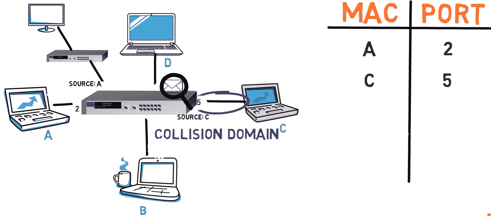

Upon receiving a frame from C, the Switch parses its header, extracts the source address, and associates it with the corresponding physical port - port number 5 (Source: [Brief](https://www.youtube.com/watch?v=Youk8eUjkgQ&ab_channel=Brief))

这一次，由于帧的目的地是 A 的 MAC 地址，并且交换机知道该地址，因此帧可以转发到 2 号端口，并且只能转发到 2 号端口。耶！👏🏻👏🏻👏🏻

现在，B 向 c 发送一条消息。交换机在端口号 7 和 B 的 MAC 地址之间创建一个映射，该映射出现在**源地址**字段。

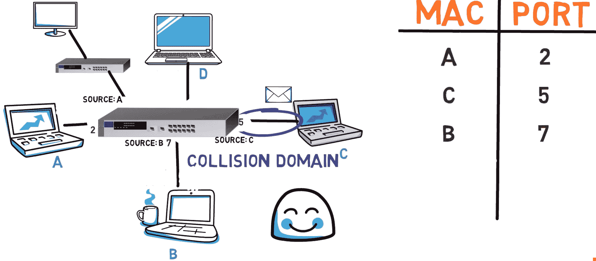

The Switch keeps on learning the addresses gradually, filling in its internal mappings (Source: [Brief](https://www.youtube.com/watch?v=Youk8eUjkgQ&ab_channel=Brief))

交换机也可以将消息转发给 C，因为它已经知道了 C 的地址。

因此，一般来说，交换机使用以太网帧的**源地址**字段来动态了解每个端口后面驻留的地址。

现在，问你一个问题:两个不同的地址有可能映射到一个端口吗？例如，让计算机 A 的地址映射到端口号 3，也让计算机 B 的地址映射到端口号 3？🤔

嗯，答案是肯定的。考虑以下网络:

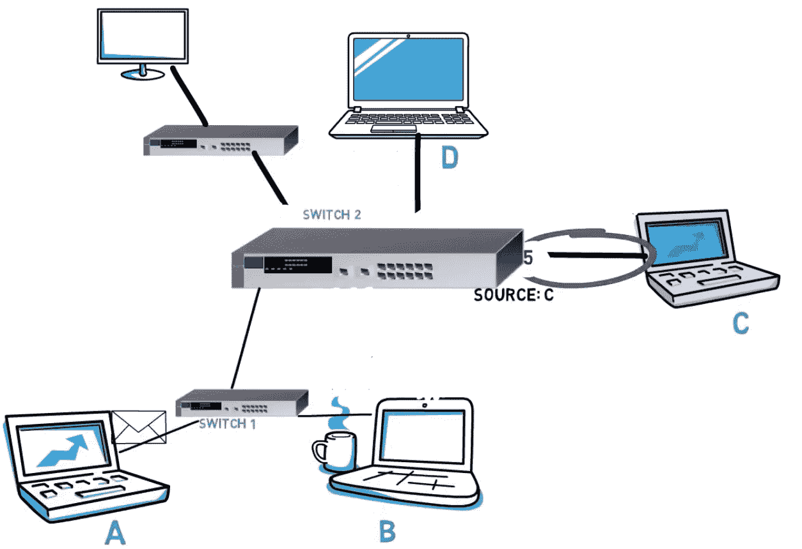

A network diagram with five endpoints and three Switches (Source: [Brief](https://www.youtube.com/watch?v=Youk8eUjkgQ&ab_channel=Brief))

现在，假设交换机知道网络，当 A 向 D 发送消息时，它将被发送到交换机 1，然后到交换机 2，最后由交换机 2 转发到 D，当交换机 2 看到帧时，它在**源地址**字段中看到什么地址？

当然是电脑 A 的地址。请注意，交换机是透明的，从不修改 MAC 地址。因此交换机 2 了解到计算机 A 的 MAC 地址位于端口号 3 之后。

接下来，当计算机 B 向计算机 C 发送帧时，该消息也将通过交换机 1 传输，然后通过交换机 2 传输。现在，交换机 2 了解到计算机 B 的 MAC 地址也位于端口号 3 之后。因此，在这种情况下，A 和 B 的 MAC 地址都位于端口号 3 之后。

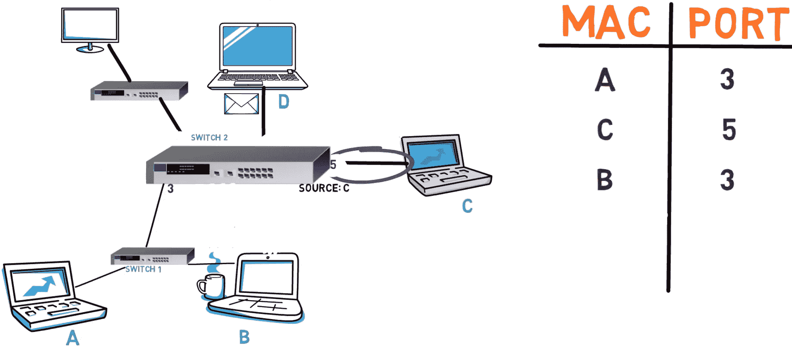

Given this network diagram, switch 2 registers both the MAC address of A as well as that of B - with port number 3 (Source: [Brief](https://www.youtube.com/watch?v=Youk8eUjkgQ&ab_channel=Brief))

注意，交换机是**而不是**一个额外的*跳*！我们在这里不是在讨论路由。正如我们前面说过的，交换机是一个**透明**设备。从端点的角度来看，没有开关——A“感觉”好像直接连接到 B、C 和 d。

通过一个**跳**连接的所有设备被称为在同一个**网段**中。因此，在这里，所有计算机和交换机——A、B、C、D、交换机 1 和交换机 2——都位于同一个网段内。

在下面的参考资料部分，我添加了一个关于集线器和交换机的练习的链接。欢迎大家来解决，以确保一切都很清楚。如果您有任何问题，请随时联系我们😊

## 中期总结

到目前为止，您已经了解了两种网络设备。首先是集线器，它基本上是第一层设备。也就是说，它只将比特从一个端口传输到其他端口，而不理解任何协议。

第二，你必须了解第二层网络设备，即交换机，它已经“理解”了以太网协议和 MAC 地址。它使用该知识，以便至少一旦它知道网络，就只将帧传送到相关端口。

# 安全扭曲😈

现在，您已经了解了集线器和交换机的工作原理，是时候考虑它们的安全含义了。

假设我连接到某个以太网网段，你在计算机 a 上运行，B 向 c 发送消息，你有可能看到那条消息吗？

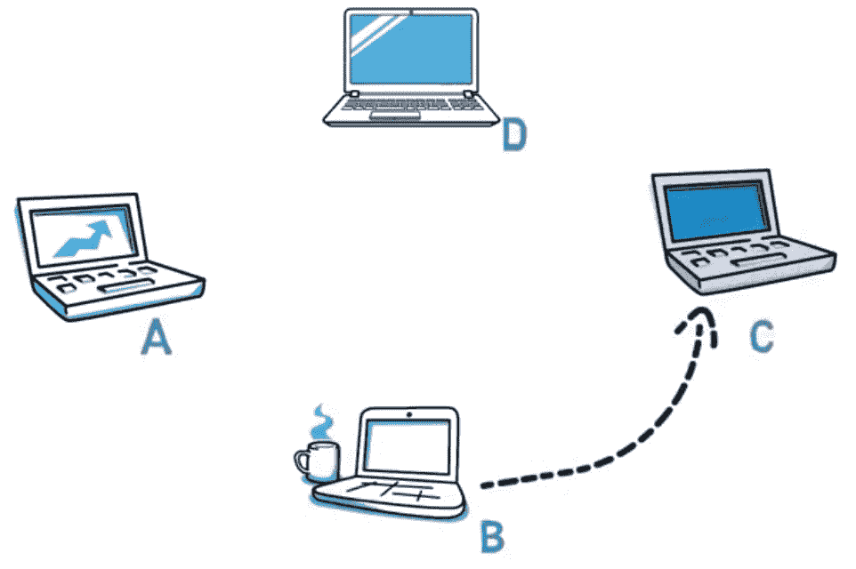

Four PCs, B is sending a frame to C (Source: [Brief](https://www.youtube.com/watch?v=YVcBShtWFmo&t=3s&ab_channel=Brief))

如果计算机通过集线器连接，您肯定会看到该消息，因为集线器只是将帧转发到所有端口(除了源端口),而不考虑目的地址。

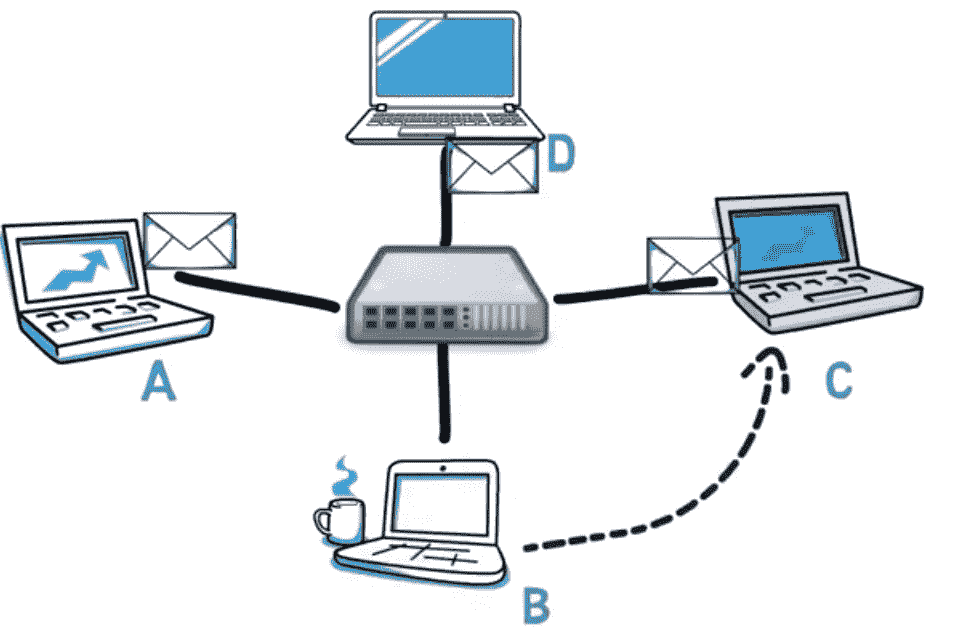

A hub would simply multiply the frame and send it to A, C and D (Source: [Brief](https://www.youtube.com/watch?v=YVcBShtWFmo&t=3s&ab_channel=Brief))

此外，如果计算机通过交换机连接，但交换机尚未获知目的地的地址，此消息也将被发送到您的端口——并且通常发送到除源端口之外的所有端口，就像集线器一样。

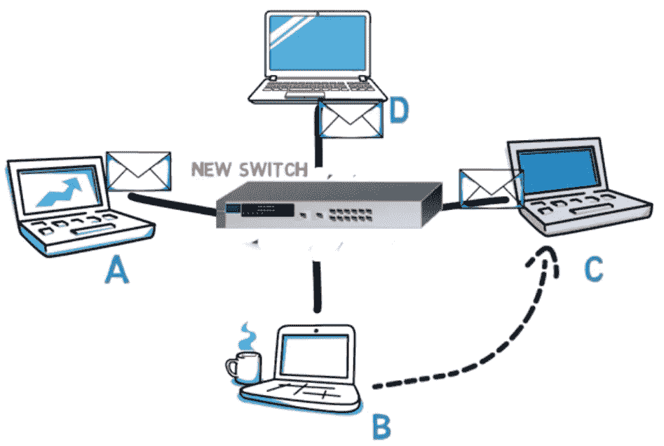

A new switch acts just like a hub until it learns the destination address (Source: [Brief](https://www.youtube.com/watch?v=YVcBShtWFmo&t=3s&ab_channel=Brief))

因此，在这些情况下，您的网卡将接收帧，但它能处理它们吗？

正如我在之前的教程中提到的，以太网帧的第一个字段是目的地址。默认情况下，网卡会丢弃不是发往其地址或其系统所属组(如广播地址)的帧。

Ethernet frame structure - the devices first consider the destination address (Source: [Brief](https://www.youtube.com/watch?v=YVcBShtWFmo&t=3s&ab_channel=Brief))

因此，默认情况下，如果您的网卡碰巧接收到了不是发往它的帧，该帧将被丢弃。这正是**混杂模式**派上用场的地方。当网卡处于混杂模式时，它不会根据帧的目的 MAC 地址丢弃帧。

现在，考虑一个带有交换机的网络，该交换机已经获取了网络的所有地址，从而实现了隐私保护。

假设一个恶意的人从计算机 C 工作，并希望看到发送到计算机 B 的通信，即使交换机只将这些帧转发给 B。

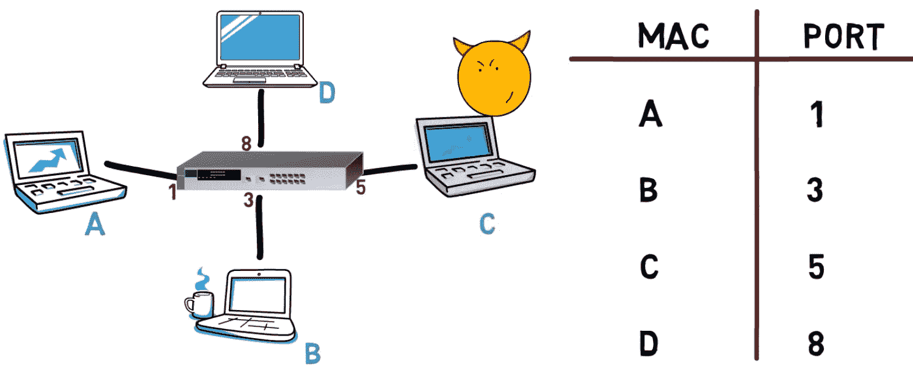

A network with a switch that has already learned the MAC addresses and their corresponding ports. Can a malicious person see private communication? (Source: [Brief](https://www.youtube.com/watch?v=YVcBShtWFmo&t=3s&ab_channel=Brief))

恶意的人会为了窃取数据而做些什么吗？

嗯，恶意的人可以假装他们有 B 的地址。也就是说，恶意用户将发送源地址为 b 的帧。该帧的目的地址是什么并不重要。

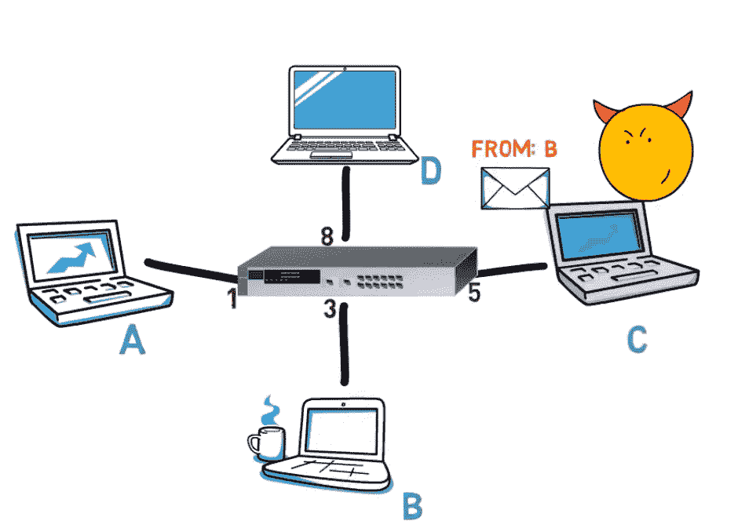

The malicious person sends a frame and impersonates B by specifying B's MAC address as the source address of the frame (Source: [Brief](https://www.youtube.com/watch?v=YVcBShtWFmo&t=3s&ab_channel=Brief))

现在，交换机看到一个帧从 B 的地址和 C 的端口(在我们的图中为端口 5)发送，并更改 B 的地址到端口 5 的映射。

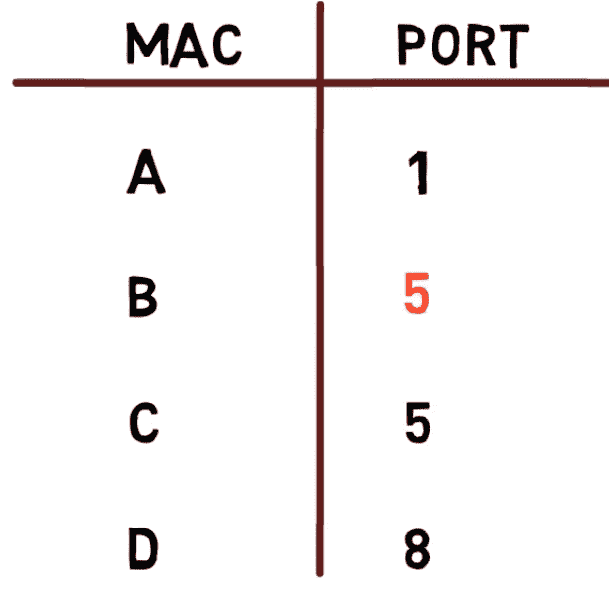

As a result, the Switch changes the port associated with B's address (Source: [Brief](https://www.youtube.com/watch?v=YVcBShtWFmo&t=3s&ab_channel=Brief))

正如我前面提到的，确实有可能将两个不同的 MAC 地址映射到同一个端口号(例如，在连接具有这些地址的设备的附加交换机的情况下)。但是不可能将 B 的地址映射到两个不同的端口。

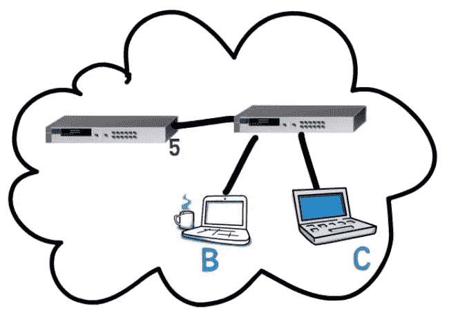

As far as the Switch is concerned, B and C may indeed both be attached to it via port 5, perhaps through another Switch (Source: [Brief](https://www.youtube.com/watch?v=YVcBShtWFmo&t=3s&ab_channel=Brief))

现在，如果 A 向 B 发送消息，它实际上会到达 C，但不会到达 B！😨

这种技术叫做 **MAC 欺骗**。据说这个恶意实体向**假冒** B 的 MAC 地址。

这个技术对攻击者很有用吗？🤔

不完全是。一旦 B 向网络发送*任何*帧，交换机就会将 B 的 MAC 地址条目替换为正确端口号的条目。因此，为了让攻击者继续接收数据，他们必须继续代表 B 发送更多的帧，从而导致交换机一次又一次地重写表条目。

这样，C 将使用 B 的地址发送一个帧，交换机将 B 的 MAC 地址映射到 C 的端口。然后，B 会发送一个帧，交换机会再次将 B 的 MAC 地址映射到 B 的端口。

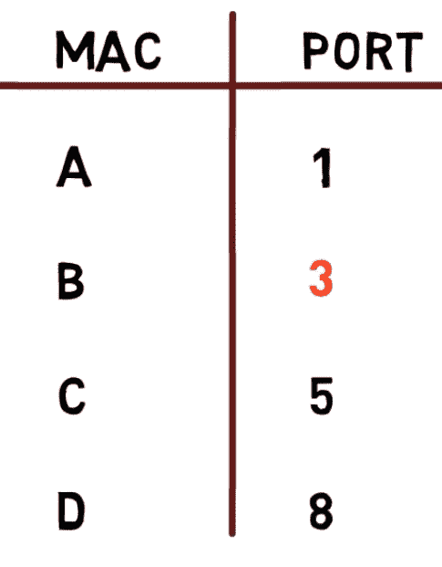

Once B send any frame, the Switch will overwrite its entry and the original value will be restored (Source: [Brief](https://www.youtube.com/watch?v=YVcBShtWFmo&t=3s&ab_channel=Brief))

因此，B 将接收一些流量，这种攻击很容易被注意到。

有许多方法可以保护交换机免受此类攻击。一种方法是为端口设置最大数量的 MAC 地址。例如，如果没有其他交换机应该连接到某个端口，则链接的 MAC 地址的最大数量可以设置为 1。

多酷啊。！通过了解交换机的工作方式，我们能够估计出源于其工作方式的安全问题，以及相关的对策。🤯

# 结论

在这篇文章中，你学习了两个重要的网络设备，一个集线器和一个交换机。

您了解了集线器只是将它收到的比特流复制到所有端口，而不是接收比特流的端口，而交换机只将帧转发到正确的端口(一旦它了解了网络)。您还了解了交换机是如何自动实现这一功能的。

最后，您了解了由交换机的工作方式引起的安全问题，以及如何缓解这一问题。

## 关于作者

奥马尔·罗森鲍姆是 [Swimm](https://swimm.io/) 的首席技术官。他是简介 [YouTube 频道](https://youtube.com/@BriefVid)的作者。他还是一名网络培训专家和 Checkpoint Security Academy 的创始人。他是[计算机网络(希伯来语)](https://data.cyber.org.il/networks/networks.pdf)的作者。你可以在推特上找到他。

## 额外资源

*   [计算机网络播放列表-在我的简短频道上](https://www.youtube.com/playlist?list=PL9lx0DXCC4BMS7dB7vsrKI5wzFyVIk2Kg)
*   [关于集线器和交换机的 DIY 练习](https://drive.google.com/file/d/1WeHTbRNph7mevNLwGeIkys1aP6_Z-Fbk/view)