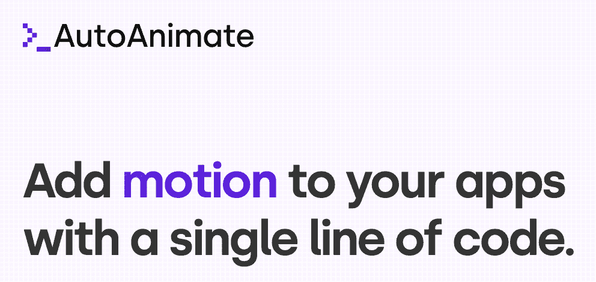

# 如何用一行代码制作 React 应用程序动画

> 原文：<https://www.freecodecamp.org/news/animate-react-apps/>

动画具有强大的能力，可以将枯燥、静态的应用程序转变为更加动态、令人难忘的用户体验。

一般来说，动画可能很难设置，尤其是如果你打算在你的应用程序中设置多个组件的动画。

在本教程中，我们将看到如何使用库**auto imate**用一行代码实现 React 应用程序中几乎所有常见的动画。

如果您正在寻找学习 React 的绝佳资源，您可以通过我的****[React boot camp](https://reactbootcamp.com/)****在每天 30 分钟内成为专业人士。

## 为什么应该使用 AutoAnimate

如果您正在构建 React 应用程序，有许多强大的动画库可供选择，如 Framer Motion。

大多数这些库(以及普通 CSS)的缺点是它们需要相当多的代码来使你的动画工作。传统上，您必须指定:

1.  要制作动画的 CSS 属性
2.  您希望动画执行的持续时间
3.  一种缓动功能，决定动画在每个循环的持续时间内如何进行

AutoAnimate 去掉了需要指定**这些东西的任何**。

AutoAnimate 的强大之处在于，它允许你使用一个名为`autoAnimate`的函数来制作整个应用程序的动画。



The AutoAnimate animation library

## AutoAnimate 如何工作

接受一个参数:一个对你想要动画的父元素的引用。

该库的工作方式是，父元素将与其任何直接子元素一起被“自动动画化”。

每当此父元素发生以下三个事件之一时，动画就会发生:

如果一个子元素被添加了、**删除了**，或者**移动了**。

我们将通过三个例子来看看如何使用 AutoAnimate:一个可扩展组件、一个列表组件和一个网格组件。

## 如何使用 AutoAnimate

开始使用自动动画有两个步骤:

1.  安装在您的项目中使用纱线或 NPM

```
npm install @formkit/auto-animate
```

1.  从库本身导入自动动画功能

```
import autoAnimate from '@formkit/auto-animate'
```

本教程介绍了如何在 React 应用程序中使用 AutoAnimate，但是您几乎可以在任何 JavaScript 项目中使用它(包括 Svelte、Vue 和 Vanilla JS)。

要制作任何父元素的动画，只需将元素的引用传递给函数。

```
import { useEffect, useRef } from 'react'

function Component() {
  const parentRef = useRef(null)

  useEffect(() => {
    if (parentRef.current) {
      autoAnimate(parentRef.current);   
    }
  }, [parent])

  return (
    <div ref={parentRef}>
    // ...
  )
}
```

我们可以看到这是如何在简单的可扩展组件上工作的，比如 FAQ(常见问题)组件。

假设我们希望我们的用户能够点击一个 div 并展开它来显示更多的文本。

首先，我们创建一个 div，其中包含一些在初始状态(`Show More`)下显示的文本，以及一些单击时显示的文本。

为了动画显示文本开头，我们使用`useRef`钩子来引用父元素，然后将该引用传递给自动动画功能。

[https://codesandbox.io/embed/epic-lamport-5y9uwk?fontsize=14&hidenavigation=1&theme=dark](https://codesandbox.io/embed/epic-lamport-5y9uwk?fontsize=14&hidenavigation=1&theme=dark)

很快，我们就有了一个更吸引人、更流畅的动画组件。

## 如何用自动动画显示列表

自动动画的另一个很好的用例是列表组件。

假设我们正在构建一个 todo 应用程序，并且我们希望将添加到列表中的新项目制作成动画。

```
import { useState } from "react"
import autoAnimate from "@formkit/auto-animate"

export default function App() {
  const [items, setItems] = useState(["Buy Gas", "Do Laundry"])

  function addItem() {
    const item = "Go To Store"
    setItems([...items, item])
  }

  return (
    <>
      <ul ref={parent}>
        {items.map((item) => (
          <li key={item}>{item}</li>
        ))}
      </ul>
      <button onClick={addItem}>Add Todo</button>
    </>
  )
}
```

在这个例子中，我们有一个待办事项列表，每当我们点击一个按钮，它就会向我们的列表添加一个新的项目。

如果我们想让它有动画效果，我们可以重复前面的步骤，但是我们要添加一个对父元素的引用(在这个例子中，是一个无序列表)。

[https://codesandbox.io/embed/unruffled-night-ugucy0?fontsize=14&hidenavigation=1&theme=dark](https://codesandbox.io/embed/unruffled-night-ugucy0?fontsize=14&hidenavigation=1&theme=dark)

每当我们点击按钮添加一个新项目到我们的列表中，现在每个待办事项都以一种平滑的方式插入到列表中，动画显示它的位置和不透明度。

## 如何自定义动画

AutoAnimate 旨在为不需要配置的动画提供一个一体化的解决方案，但它允许我们自定义值，如动画播放的持续时间和时间。

为了更好地控制我们的动画，我们可以使用`useAutoAnimate`，它可以通过以下方式导入:

```
import { useAutoAnimate } from "@formkit/auto-animate/react";
```

就像任何 React 挂钩一样，它在我们想要使用它的任何 React 组件的顶部被调用。

这个钩子的好处是我们不再需要使用`useRef`钩子。取而代之的是，钩子返回它和一个函数，这个函数允许我们控制是否要动画父元素。

```
import { useAutoAnimate } from "@formkit/auto-animate/react";

export default function App() {
  const [parent, enable] = useAutoAnimate({ duration: 500 });
  const [isEnabled, setIsEnabled] = useState(true);

  function toggleEnabled() {
    enable(!isEnabled);
    setIsEnabled(!isEnabled);
  }

   // ...
 }
```

假设我们正在使用一个表单向这个网格添加一个新项目，并且我们希望平稳地将所有其他项目推开。

AutoAnimate 再一次使这变得非常容易，但是在这种情况下，我们将使用`useAutoAnimate`钩子在半秒钟后执行动画。为此，我们可以使用 duration 属性。

```
 const [parent, enable] = useAutoAnimate({ duration: 500 }); 
```

如您所见，它既处理添加新卡的动画，也处理将所有其他卡推到一边的动画。

[https://codesandbox.io/embed/boring-haze-k7tdjr?fontsize=14&hidenavigation=1&theme=dark](https://codesandbox.io/embed/boring-haze-k7tdjr?fontsize=14&hidenavigation=1&theme=dark)

就是这样！现在，您可以使用这个有用的库轻松制作 React 应用程序的动画。

## 想成为一名工作就绪的 React 开发人员吗？

如果你喜欢这个 React 教程，看看我的 [React 训练营](https://reactbootcamp.com)。

它将为您提供所需的所有培训:

*   每天只需 30 分钟，就能从完全的初学者变成专业的反应者
*   从零开始到部署，构建 4 个全栈 React 项目
*   了解构建您喜欢的任何应用程序的强大技术堆栈

[](https://reactbootcamp.com) 
*点击加入 React 训练营*