# StackOverflow 上最常见的打字稿问题——为初学者解答

> 原文：<https://www.freecodecamp.org/news/the-top-stack-overflowed-typescript-questions-explained/>

**我讨厌栈溢出**—说从来没有开发者。

虽然在谷歌上搜索你的答案很有帮助，但更重要的是真正理解你偶然发现的解决方案。

在本文中，我将探讨七个最常见的*打字问题。*

*我花了几个小时研究这些。*

*我希望您对使用 TypeScript 可能面临的常见问题有更深入的了解。*

*如果您刚刚开始学习 TypeScript，这也是相关的——还有什么比熟悉您未来的挑战更好的方法呢！*

*让我们开始吧。*

## *目录*

1.  *[在 TypeScript 中，接口 vs 类型有什么区别？](#1-what-is-the-difference-between-interfaces-vs-types-in-typescript)*
2.  *[在打字稿中，什么是！(感叹号/ bang)运算符？](#2-in-typescript-what-is-the-exclamation-mark-bang-operator)*
3.  *[什么是 TypeScript 中的“. d.ts”文件？](#3-what-is-a-d-ts-file-in-typescript)*
4.  *如何在 TypeScript 中显式设置“窗口”的新属性？*
5.  *在 TypeScript 中，强类型函数可以作为参数吗？*
6.  *如何修复找不到模块的声明文件…？*
7.  *如何在 TypeScript 中动态地给一个对象分配属性？*

*****注:**** 你可以得到一份 [PDF 或 ePub](https://www.ohansemmanuel.com/cheatsheet/top-7-stack-overflowed-typescript-questions) 版本的这份备忘单，以便于参考或在你的 Kindle 或平板电脑上阅读。*

*

[PDF or Epub version of this cheatsheet available](https://www.ohansemmanuel.com/cheatsheet/top-7-stack-overflowed-typescript-questions)* 

# *1.TypeScript 中接口和类型的区别是什么？*

*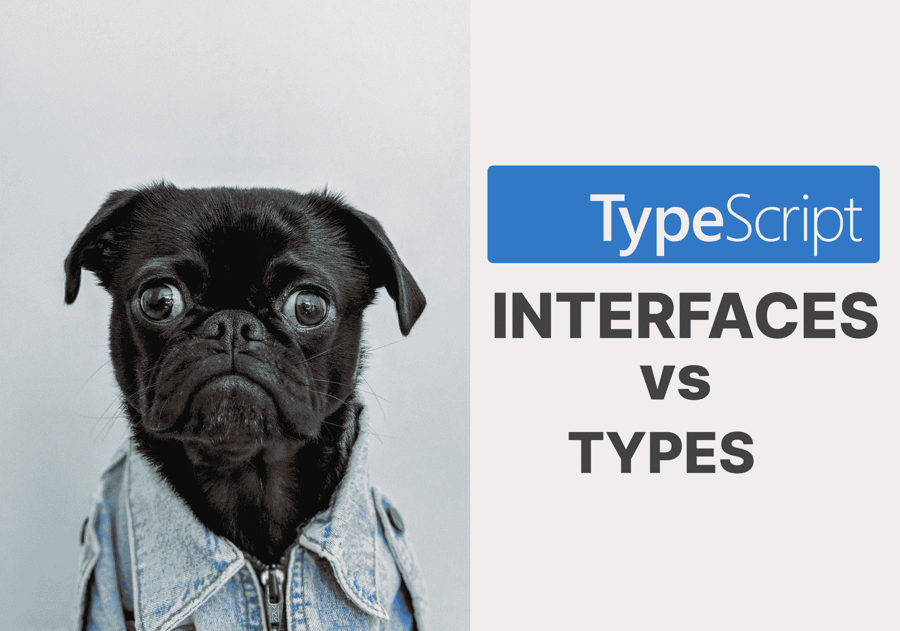

Interfaces vs Types in Typescript* 

*接口与类型(技术上，类型别名)的对话是一个很有争议的话题。*

*当开始打字时，你可能会发现很难做出选择。这篇文章澄清了困惑，帮助你选择适合你的。*

## *TL；速度三角形定位法(dead reckoning)*

*在许多情况下，您可以互换使用接口或类型别名。*

*接口的几乎所有功能都可以通过类型别名来使用，除非您不能通过重新声明来为类型添加新属性。您必须使用交集类型。*

## *为什么首先会混淆类型和接口？*

*每当我们面临多种选择时，大多数人都开始遭受选择悖论的折磨。*

*在这种情况下，只有两种选择。*

*这有什么好困惑的？*

*嗯，这里的主要困惑源于这样一个事实，即这两个选项在大多数方面都是势均力敌的**。***

***这使得很难做出明显的选择——尤其是如果您刚刚开始使用 Typescript。***

## ***类型别名与接口的基本示例***

***让我们用一个接口和类型别名的快速例子来说明这一点。***

***考虑下面一个`Human`类型的表示:***

```
***`// type 
type Human = {
  name: string 
  legs: number 
  head: number
}

// interface 
interface Human {
  name: string 
  legs: number 
  head: number
}`*** 
```

***这两种都是表示`Human`类型的正确方式——即通过类型别名或接口。***

## ***类型别名和接口之间的区别***

***下面是类型别名和接口之间的主要区别:***

### ***关键区别:接口只能描述对象形状。类型别名可用于其他类型，如基元、联合和元组。***

***类型别名在您可以表示的数据类型方面非常灵活。从基本的原语到复杂的并集和元组，如下所示:***

```
***`// primitives 
type Name = string 

// object 
type Male = {
  name: string
}

type Female = {
  name: string 
}

// union
type HumanSex = Male | Female

// tuple
type Children = [Female, Male, Female]`*** 
```

***与类型别名不同，您只能用接口表示对象类型。***

### ***关键区别:一个接口可以通过多次声明来扩展***

***考虑下面的例子:***

```
***`interface Human {
  name: string 
}

interface Human {
  legs: number 
}`*** 
```

***上面的两个声明将变成:***

```
***`interface Human {
  name: string 
  legs: number 
}`*** 
```

***将被视为一个单一的接口:两个声明的成员的组合。***

***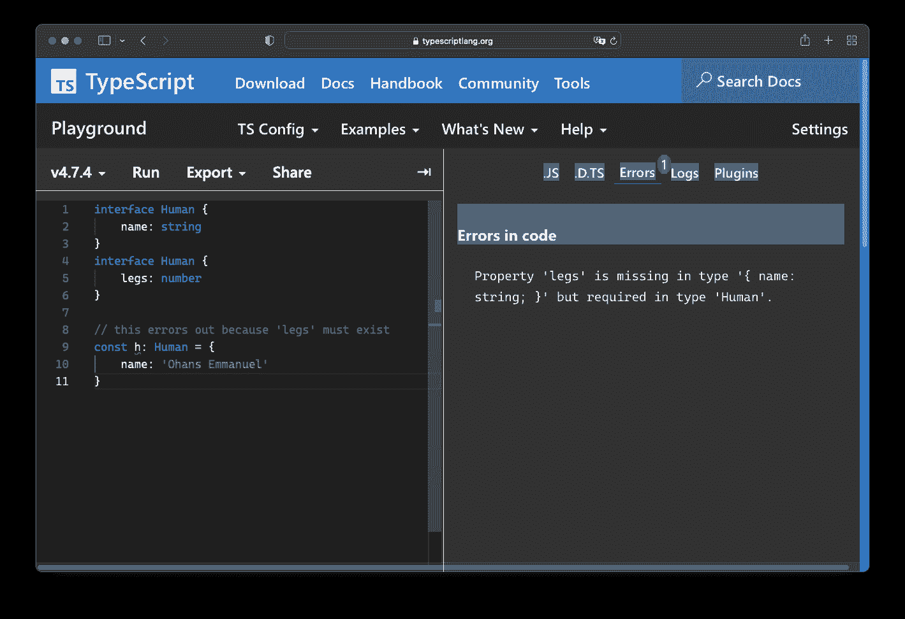

*Property 'legs' is required in type 'Humans'**** 

***参见[打字稿游乐场](https://www.typescriptlang.org/play?#code/JYOwLgpgTgZghgYwgAgBIFcC2cTIN4BQyxyIcmEAXMgM5hSgDmBAvgaJLIihtroSWQAbCIxrUQWAEbRWBAgHoFyMAAtgNZNCgB7KJp3owyGQjjoaKAOQixV5JgvGIADw3GCCHSDrJV1XhxkAF58IhIyCmorAHlVHE0AUUw+dAghK1YgA)。***

***类型别名则不是这种情况。***

***对于类型别名，以下情况将导致错误:***

```
***`type Human = {
    name: string 
}

type Human =  {
    legs: number 
}

const h: Human = {
   name: 'gg',
   legs: 5 
}`*** 
```

***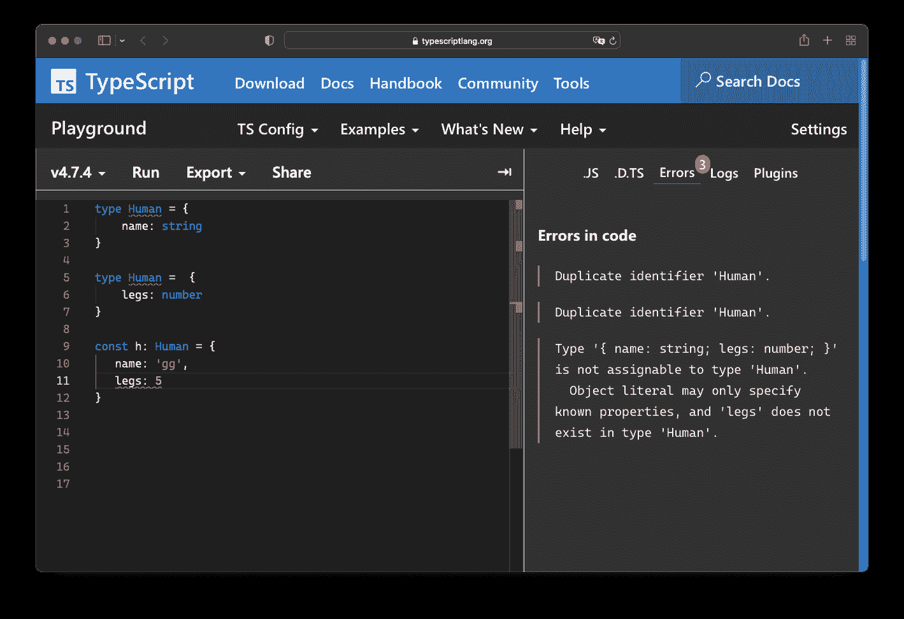

Duplicate identifier 'Human' error*** 

***见[打字稿操场](https://www.typescriptlang.org/play?#code/C4TwDgpgBAEgrgWwIYDsoF4oG8BQV9QpIIQBcUAzsAE4CWKA5lDgL57OiSyKob64EoAGwgMK5FIgBGEaszY4AxgHsUVKAAty8ZGkwD8REuQDkDBiYA07YaPFQArPPw5XroA)。***

***对于类型别名，您必须求助于交集类型:***

```
***`type HumanWithName = {
    name: string 
}

type HumanWithLegs =  {
    legs: number 
}

type Human  = HumanWithName & HumanWithLegs

const h: Human = {
   name: 'gg',
   legs: 5 
}`*** 
```

***见[打字稿操场](https://www.typescriptlang.org/play?#code/C4TwDgpgBAEgrgWwIYDsDqBLYALAckhaAXigG8AoKKqFAiALigGdgAnDFAcynIF9KeoSLESpMOADIROTKCTICqAG2lNGKRACMIrHv3JDo8ZCioljYrHjpQAZCJPjsUmeXIBjAPYoWUbIwtTEgpqWkJGAHJOTgiAGkUVGUYAVj0qNwygA)。***

### ***微小的区别:类型别名和接口都可以扩展，但是语法不同***

***对于接口，可以使用`extends`关键字。对于类型，必须使用交集。***

***考虑下面的例子:***

#### ***类型别名扩展了类型别名***

```
 ***`type HumanWithName = {
  name: string 
}

type Human = HumanWithName & {
   legs: number 
   eyes: number 
}`*** 
```

#### ***类型别名扩展了接口***

```
***`interface HumanWithName {
  name: string 
}

type Human = HumanWithName & {
   legs: number 
   eyes: number 
}`*** 
```

#### ***接口扩展接口***

```
***`interface HumanWithName {
  name: string 
}

interface Human extends HumanWithName {
  legs: number 
  eyes: number 
}`*** 
```

#### ***接口扩展了类型别名***

```
***`type HumanWithName = {
  name: string
}

interface Human extends HumanWithName {
  legs: number 
  eyes: number 
}`*** 
```

***如您所见，这并不是选择一个而不是另一个的特别理由。但是，语法不同。***

### ***微小的区别:类只能实现静态已知的成员***

***一个类可以实现两种接口或类型别名。但是，类不能实现或扩展联合类型。***

***考虑下面的例子:***

#### ***类实现一个接口***

```
***`interface Human {
  name: string
  legs: number 
  eyes: number 
}

class FourLeggedHuman implements Human {
  name = 'Krizuga'
  legs = 4
  eyes = 2
}`*** 
```

#### ***类实现类型别名***

```
***`type Human = {
  name: string
  legs: number 
  eyes: number 
}

class FourLeggedHuman implements Human {
  name = 'Krizuga'
  legs = 4
  eyes = 2
}`*** 
```

***这两者都没有任何错误。但是，以下操作会失败:***

#### ***类实现联合类型***

```
***`type Human = {
    name: string
} | {
    legs: number
    eyes: number
}

class FourLeggedHuman implements Human {
    name = 'Krizuga'
    legs = 4
    eyes = 2
}`*** 
```

***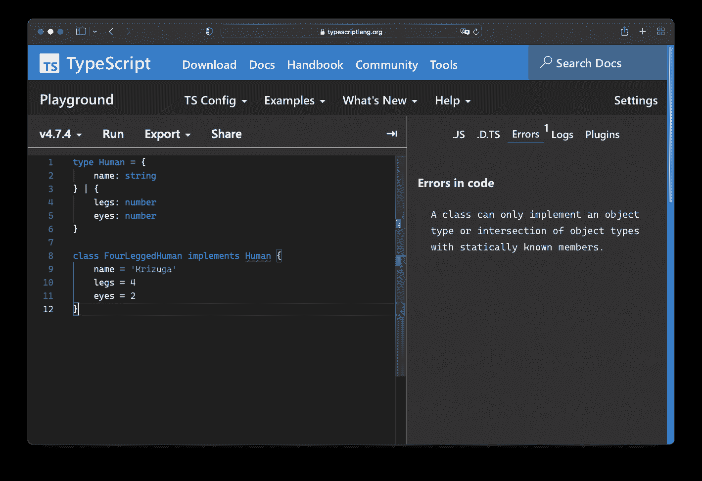

A class can only implement an object type or intersection of object types with statically known members.*** 

***见[打字稿操场](https://www.typescriptlang.org/play?#code/C4TwDgpgBAEgrgWwIYDsoF4oG8BQV9QpIIQBcUAzsAE4CWKA5jgL5QA+2eBANhAxeRSIARhGpd8EEBAGERYljhwBjbkgoUoAMQD2cagBk+DCABN4yNLQRheJFME0XUnAoWLRMAcgDSdAF5wDEheElC8-BhQACxhUjJRAEwsQA)。***

## ***类型别名与接口的概述***

***您的里程数可能不同，但只要有可能，我坚持使用类型别名，因为它们更灵活，语法更简单。也就是说，我选择类型别名，除非我特别需要某个接口的特性。***

***在很大程度上，你也可以根据你的个人偏好来决定，但是要和你的选择保持一致——至少在一个给定的项目中。***

***为了完整起见，我必须补充一点，在性能关键类型中，接口比较检查比类型别名更快。我还没有发现这是一个问题。***

# ***在 TypeScript 中，什么是！(感叹号/ Bang)运算符？***

***

What is the bang operator in TypeScript?*** 

## ***TL；速度三角形定位法(dead reckoning)***

***这个`!`在技术上叫做 ****非空断言操作符**** 。如果 TypeScript 编译器抱怨某个值是`null`或`undefined`，您可以使用`!`操作符来断言该值不是`null`或`undefined`。***

***个人观点:尽可能避免这样做。***

## ***什么是非空断言操作符？***

***`null`和`undefined`是有效的 JavaScript 值。***

***上面的陈述也适用于所有的 TypeScript 应用程序。***

***然而，TypeScript 更进一步。***

***`null`和`undefined`是同等有效的类型。例如，考虑以下情况:***

```
***`// explicit null
let a: null 

a = null
// the following assignments will yield errors
a= undefined 
a = {}

// explicit undefined
let b: undefined 
// the following assignments will yield errors
b = null 
b = {}`*** 
```

***

Error: values other than null and undefined not assignable*** 

***见[打字稿操场](https://www.typescriptlang.org/play?#code/DYUwLgBAhgXBB2BXYwICg1QgXgc4aA9IRGABYgQBmA9ijQO4CW8A5tAM4dOvwC2IeGA4RmKCAE8mIYABMIIAE6KaijplyJ4skFRYh5mHBADeAXwxpQkAEZwtOvfAPpipCtTrBGLdlC48-ILCokziUjLySipqaDbGSOJxxuZoQA)。***

***在某些情况下，TypeScript 编译器无法判断某个值是否已定义，即不是`null`或`undefined`。***

***例如，假设您有一个值`Foo`。***

***`Foo!`产生一个排除了`null`和`undefined`的`Foo`类型的值。***

***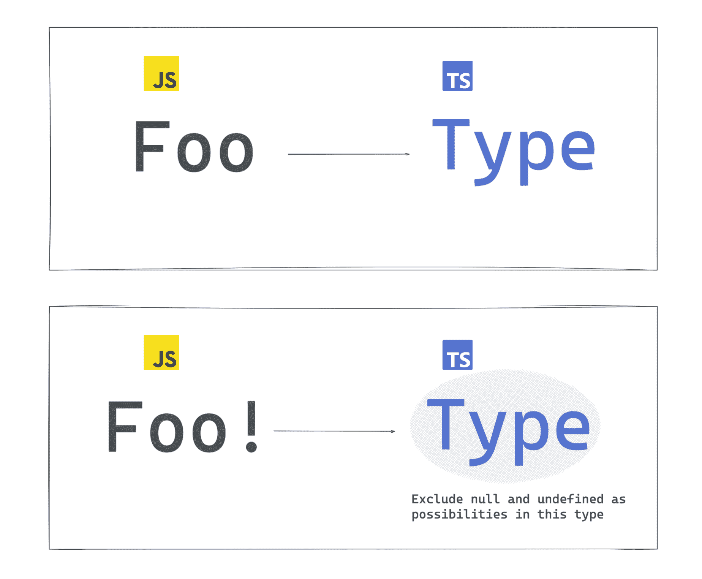

Foo! excludes null and undefined from the type of Foo*** 

***你本质上对打字稿编译器说， **我肯定`Foo`不会是`null`或者`undefined`* 。****

***让我们探索一个简单的例子。***

***在标准 JavaScript 中，您可以用`.concat`方法连接两个字符串:***

```
***`const str1 = "Hello" 
const str2 = "World"

const greeting = str1.concat(' ', str2)
// Hello World`*** 
```

***编写一个简单的重复字符串函数，以自身作为参数调用`.concat`:***

```
***`function duplicate(text: string | null) {
  return text.concat(text);
}`*** 
```

***请注意，参数`text`的类型为`string | null`。***

***在严格模式下，TypeScript 会在这里抱怨，因为用`null`调用`concat`会导致意想不到的结果。***

***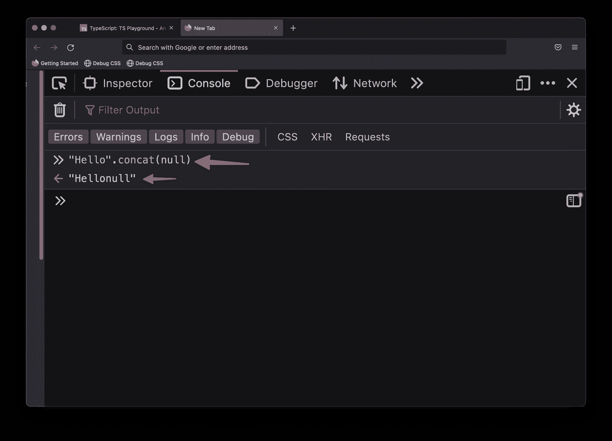

The result of calling concat with null*** 

***TypeScript 错误将显示为:`Object is possibly 'null'.(2531)`。***

***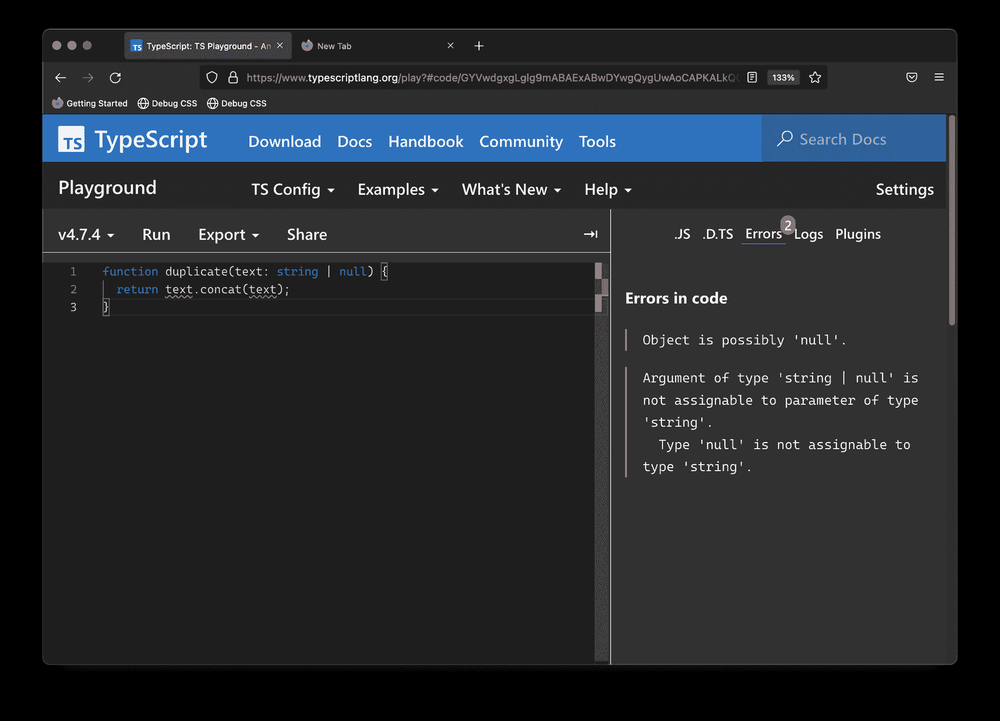

Typescript error: Object is possibly null*** 

***另一方面，消除编译器错误的一种相当懒惰的方法是使用非空断言操作符:***

```
***`function duplicate(text: string | null) {
  return text!.concat(text!);
}`*** 
```

***请注意`text`变量–`text!`后面的感叹号。***

***`text`型代表`string | null`。***

***`text!`仅代表`string`，即从变量类型中去掉了`null`或`undefined`。***

***结果呢？你已经消除了打字错误。***

***然而，这是一个愚蠢的修复。***

***`duplicate`确实可以用`null`调用，可能会导致意想不到的结果。***

***请注意，如果`text`是可选属性，以下示例也成立:***

```
***`// text could be "undefined"
function duplicate(text?: string) {
  return text!.concat(text!);
}`*** 
```

## ***`!`操作符的陷阱(以及该怎么做)***

***作为一名新用户使用 TypeScript 时，您可能会觉得自己在打一场败仗。***

***这些错误对你来说没有意义。***

***你的目标是尽快消除错误，继续你的生活。***

***但是，使用非空断言操作符时应该小心。***

***消除一个 TypeScript 错误并不意味着不存在潜在的问题——如果这个问题没有解决的话。***

***正如你在前面的例子中看到的，你失去了防止错误使用的所有相关的类型安全，其中`null`和`undefined`可能是不需要的。***

***那么，你应该怎么做呢？***

***如果您编写 React，请考虑一个您可能熟悉的示例:***

```
***`const MyComponent = () => {
   const ref = React.createRef<HTMLInputElement>();

   //compilation error: ref.current is possibly null
   const goToInput = () => ref.current.scrollIntoView(); 

    return (
       <div>
           <input ref={ref}/>
           <button onClick={goToInput}>Go to Input</button>
       </div>
   );
};`*** 
```

***在上面的例子中(对于那些没有写 React 的人来说)，在`React`心智模型中，`ref.current`在用户点击按钮时肯定是可用的。***

***在 UI 元素呈现后不久就设置了`ref`对象。***

***TypeScript 不知道这一点，您可能会被迫在这里使用非空断言运算符。***

***本质上，对 TypeScript 编译器说，我知道我在做什么，你不知道。***

```
***`const goToInput = () => ref.current!.scrollIntoView();`*** 
```

***注意感叹号`!`。***

***这“修复”了错误。***

***然而，如果将来有人从输入中删除了`ref`,并且没有自动测试来捕捉这一点，那么现在就有一个 bug 了。***

```
***`// before
<input ref={ref}/>

// after
<input />`*** 
```

***TypeScript 将无法发现以下行中的错误:***

```
***`const goToInput = () => ref.current!.scrollIntoView();`*** 
```

***通过使用非空断言操作符，TypeScript 编译器将表现得好像`null`和`undefined`对于所讨论的值是不可能的。在这种情况下，`ref.current`。***

### ***解决方案 1:找到一个替代解决方案***

***你应该采取的第一个行动是找到一个替代的解决方案。***

***例如，通常您可以像这样显式地检查`null`和`undefined`值:***

```
***`// before 
const goToInput = () => ref.current!.scrollIntoView();

// now 
const goToInput = () => {
  if (ref.current) {
   //Typescript will understand that ref.current is certianly 
   //avaialble in this branch
     ref.current.scrollIntoView()
  }
};

// alternatively (use the logical AND operator)
const goToInput = () => ref.current && ref.current.scrollIntoView();`*** 
```

***许多工程师会争论这样更冗长。***

***没错。***

***但是您应该选择冗长，而不是将可能会破坏的代码推向生产。***

***这是个人喜好。您的里程可能不同。***

### ***解决方案 2:显式抛出错误***

***在替代修复不能解决问题并且非空断言操作符似乎是唯一解决方案的情况下，我通常建议您在这样做之前抛出一个错误。***

***下面是一个例子(伪代码):***

```
***`function doSomething (value) {
   // for some reason TS thinks the value could be  
   // null or undefined but you disagree

  if(!value) {
    // explicilty assert this is the case 
    // throw an error or log this somewhere you can trace
    throw new Error('uexpected error: value not present')
  } 

  // go ahead and use the non-null assertion operator
  console.log(value)
}`*** 
```

***我发现自己有时这样做的一个实际例子是在使用`Formik`的时候。***

***除了事情已经改变，我确实认为`Formik`在很多情况下都是糟糕的类型。***

***如果您已经完成了 Formik 验证，并且确信您的值存在，那么示例可能会类似。***

***下面是一些伪代码:***

```
***`<Formik 
  validationSchema={...} 
  onSubmit={(values) => {
   // you are sure values.name should exist because you had 
   // validated in validationSchema but TypeScript doesn't know this

   if(!values.name) {
    throw new Error('Invalid form, name is required')		
   } 
   console.log(values.name!)
}}>

</Formik>`*** 
```

***在上面的伪代码中，`values`可以被键入为:***

```
***`type Values = {
  name?: string
}`*** 
```

***但是在点击`onSubmit`之前，您已经添加了一些验证来显示 UI 表单错误，以便用户在继续表单提交之前输入一个`name`。***

***还有其他方法可以解决这个问题。但是，如果您确定某个值存在，但是无法将其传递给 TypeScript 编译器，请使用非空断言运算符。而且还可以通过抛出一个可以跟踪的错误来添加自己的断言。***

## ***一个隐含的断言怎么样？***

***尽管操作符的名字读作非空断言操作符，但实际上并没有进行任何“断言”。***

***您主要是在断言(作为开发人员)价值的存在。***

***TypeScript 编译器不会断言该值存在。***

***因此，如果必须的话，您可以继续添加您的断言(例如在前面的部分中所讨论的)。***

***另外，请注意，使用非空断言操作符不会发出更多的 JavaScript 代码。***

***如前所述，这里没有 TypeScript 做的断言。***

***因此，TypeScript 不会发出一些检查该值是否存在的代码。***

***发出的 JavaScript 代码将表现为好像这个值一直存在。***

***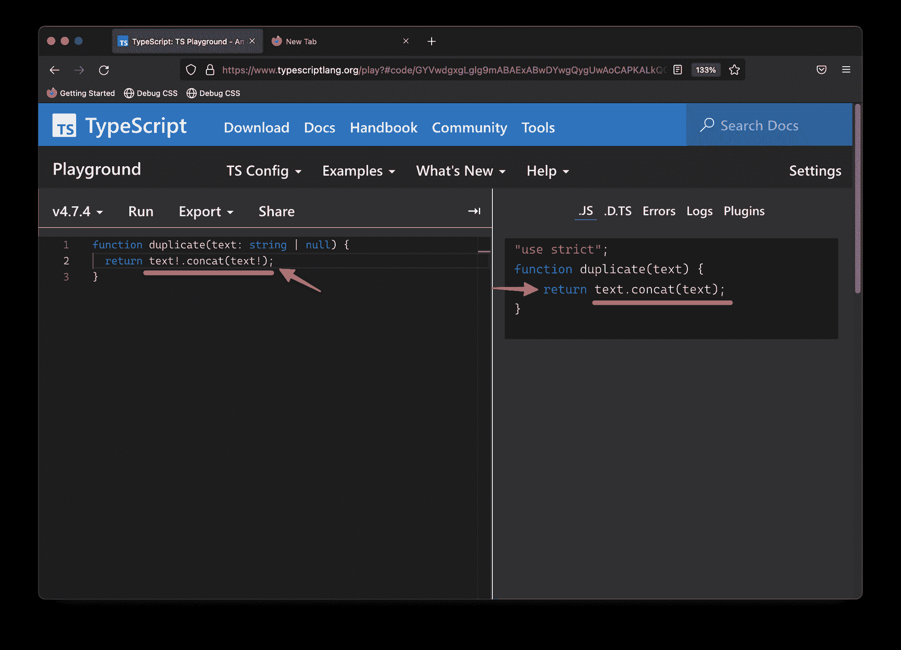

Emitted javascript code same as Javascript*** 

## ***结论***

***TypeScript 2.0 发布了 ****非空断言操作符**** 。是的，已经有一段时间了([2016 年发布](https://github.com/microsoft/TypeScript/releases/tag/v2.0.3))。在撰写本文时，TypeScript 的最新版本是`v4.7`。***

***如果 TypeScript 编译器抱怨某个值是`null`或`undefined`，您可以使用`!`操作符来断言该值不为空或未定义。***

***只有在你确定是这样的情况下才这样做。***

***更好的是，继续添加您自己的断言，或者尝试找到一个替代解决方案。***

***有些人可能会认为，如果您每次都需要使用非空断言操作符，这表明您没有通过 TypeScript 很好地表示应用程序的状态。***

***我同意这个学派的观点。***

# ***什么是 TypeScript 中的“. d.ts”文件？***

***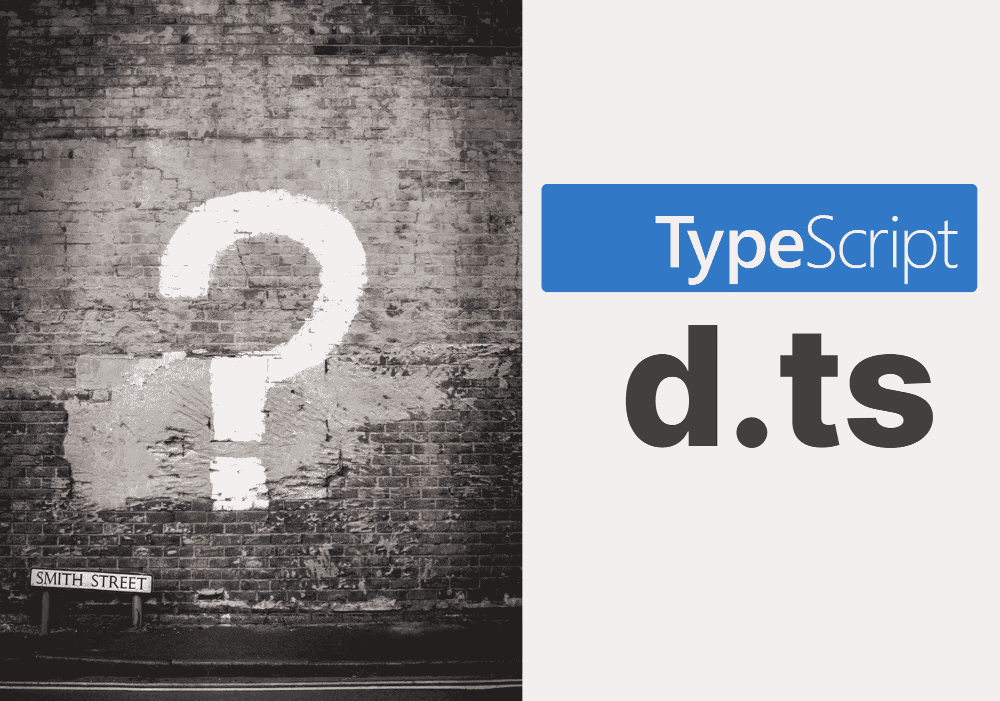

What is a d.ts file?*** 

## ***TL；速度三角形定位法(dead reckoning)***

***`.d.ts`文件被称为类型声明文件。它们的存在只有一个目的:描述现有模块的形状，它们只包含用于类型检查的类型信息。***

## ***TypeScript 中的`.d.ts`文件介绍***

***一旦学习了打字稿的基础知识，你就拥有了超能力。***

***至少我是这么觉得的。***

***您会自动获得关于潜在错误的警告，并在代码编辑器中自动完成。***

***虽然看起来很神奇，但计算机没有什么是真的。***

***那么，这里有什么诀窍呢，打字稿？***

***用更清楚的语言说，TypeScript 怎么知道这么多？它是如何决定什么 API 正确与否的？对于某个对象或类，哪些方法可用，哪些不可用？***

***答案没那么神奇。***

***TypeScript 依赖于类型。***

***偶尔，你不写这些类型，但它们存在。***

***它们存在于称为声明文件的文件中。***

***这些是以`.d.ts`结尾的文件。***

## ***`.d.ts`文件的简单例子***

***考虑以下类型脚本代码:***

```
***`// valid 
const amount = Math.ceil(14.99)

// error: Property 'ciil' does not exist on type 'Math'.(2339)
const otherAmount = Math.ciil(14.99)`*** 
```

***见[打字稿操场](https://www.TypeScriptlang.org/play?#code/MYewdgzgLgBAhgWxAVzLAvDAsnKALAOmAFMBLAGwAoBGAFgIE4GBKAKFdElhH2ICcAgklQZsuQsFIUa9Jm1ZA)。***

***第一行代码完全有效，但第二行代码不完全有效。***

***并且 TypeScript 很快发现了错误:`Property 'ciil' does not exist on type 'Math'.(2339)`。***

***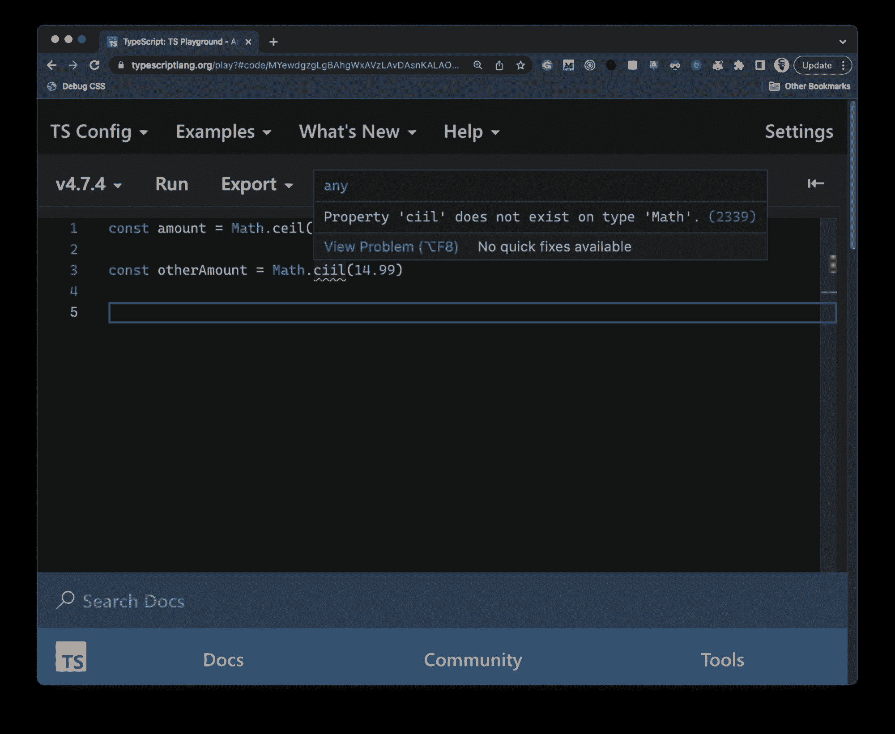

The Typescript error spotting the wrong property access "ciil"*** 

***TypeScript 怎么知道`Math`对象上不存在`ciil`？***

***对象不是我们实现的一部分。这是一个标准的内置对象。***

***那么，TypeScript 是怎么发现的呢？***

***答案是有 ****声明文件**** 描述这些内置对象。***

***可以把声明文件想象成包含了与某个模块相关的所有类型信息。它不包含实际的实现，只是类型信息。***

***这些文件有一个`.d.ts`结尾。***

***您的实现文件将使用`.ts`或`.js`结尾来表示类型脚本或 JavaScript 文件。***

***这些声明文件没有实现。它们只包含类型信息，并有一个`.d.ts`文件结尾。***

## ***内置类型定义***

***在实践中理解这一点的一个很好的方法是建立一个全新的 TypeScript 项目，并探索像`Math`这样的顶级对象的类型定义文件。***

***我们开始吧。***

***创建一个新目录，给它起一个合适的名字。***

***我叫我的`dts`。***

***将目录更改到这个新创建的文件夹:***

```
***`cd dts`*** 
```

***现在初始化一个新项目:***

```
***`npm init --yes`*** 
```

***安装 TypeScript:***

```
***`npm install TypeScript --save-dev`*** 
```

***

Installing TypeScript*** 

***这个目录应该包含两个文件和一个子目录:***

***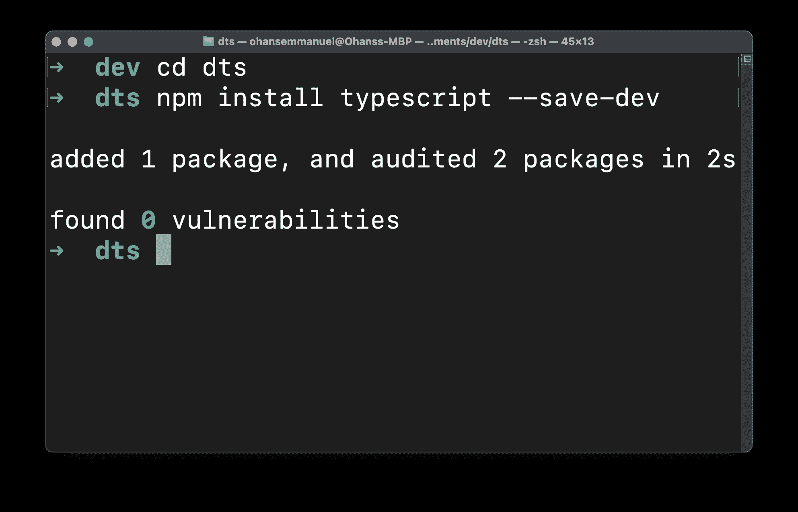

The files after installation*** 

***在您最喜欢的代码编辑器中打开文件夹。***

***如果您研究`node_modules`中的`TypeScript`目录，您会发现一堆现成的类型声明文件。***

***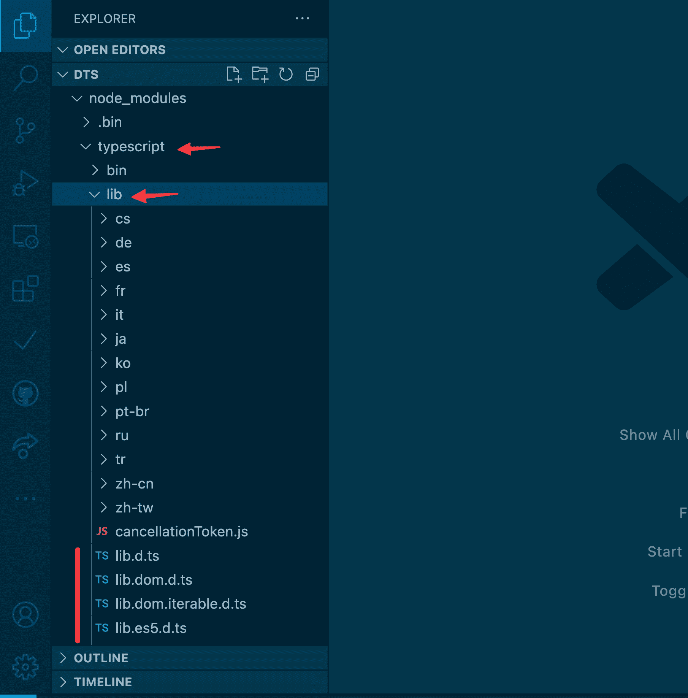

Type declaration files in the TypeScript directory*** 

***这些是由于安装了 TypeScript 而提供的。***

***默认情况下，TypeScript 将包含所有 DOM APIs 的类型定义，例如 think `window`和`document`。***

***当您检查这些类型声明文件时，您会注意到命名约定非常简单。***

***它遵循的模式:`lib.[something].d.ts`。***

***打开`lib.dom.d.ts`声明文件，查看所有与浏览器 DOM API 相关的声明。***

***

The dom declaration file*** 

***如您所见，这是一个相当大的文件。***

***但是 DOM 中所有可用的 API 也是如此。***

***厉害！***

***现在，如果你看一下`lib.es5.d.ts`文件，你会看到`Math`对象的声明，包含`ceil`属性。***

***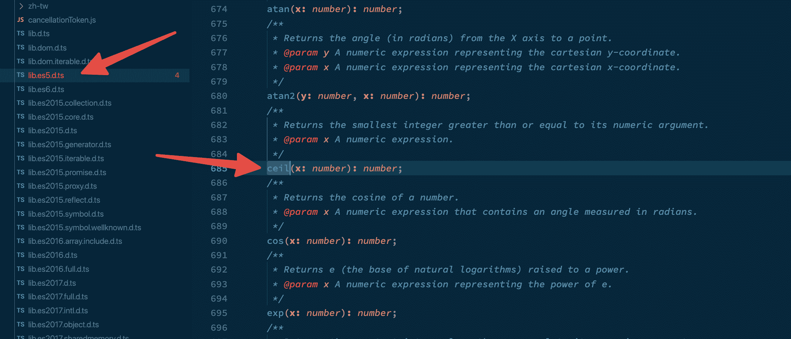

The Math object in the declaration file*** 

***下次你想，哇，TypeScript 太棒了。请记住，这种神奇很大一部分是由于鲜为人知的英雄:类型声明文件。***

***这不是魔法。只需键入声明文件。***

## ***TypeScript 中的外部类型定义***

***非内置的 API 呢？***

***有一大堆`npm`软件包可以做你想做的任何事情。***

***有没有办法让 TypeScript 也理解所述模块的相关类型关系？***

***嗯，答案是响亮的是。***

***一个库的作者通常有两种方法可以做到这一点。***

### ***捆绑类型***

***在这种情况下，库的作者已经将类型声明文件作为包分发的一部分捆绑在一起。***

***你通常不需要做任何事情。***

***您只需在项目中安装该库，从库中导入所需的模块，然后查看 TypeScript 是否会自动为您解析类型。***

***记住，这不是魔法。***

***库作者在包发行版中捆绑了类型声明文件。***

### ***明确类型化(@types)***

***想象一下，一个中央公共存储库为成千上万个库托管声明文件？***

***好吧，把那个画面带回家。***

***此存储库已经存在。***

***[definitely typed repository](https://github.com/DefinitelyTyped/DefinitelyTyped/)是一个集中的存储库，它存储了数千个库的声明文件。***

***老实说，绝大多数常用的库在**上都有声明文件。*****

*****这些类型定义文件被自动发布到`@types`范围下的`npm`。*****

*****例如，如果您想安装`react` npm 包的类型，您应该这样做:*****

```
*****`npm install --save-dev @types/react`***** 
```

*****如果您发现自己使用的模块的类型无法由 TypeScript 自动解析，请尝试直接从 DefinitelyTyped 安装这些类型。*****

*****查看那里是否存在这些类型。例如:*****

```
*****`npm install --save-dev @types/your-library`***** 
```

*****以这种方式添加的定义文件将被保存到`node_modules/@types`。*****

*****TypeScript 会自动找到这些。所以，你不需要采取额外的步骤。*****

## *****如何编写自己的声明文件*****

*****在不常见的情况下，如果一个库没有绑定它的类型，也没有定义类型的类型定义文件，你可以写你自己的声明文件。*****

*****深入编写声明文件超出了本文的范围，但是您可能遇到的一个用例是在没有声明文件的情况下消除关于特定模块的错误。*****

*****声明文件都有一个`.d.ts`结尾。*****

*****因此，要创建您的文件，请创建一个以`.d.ts`结尾的文件。*****

*****例如，假设我已经在项目中安装了库`untyped-module`。*****

*****`untyped-module`没有引用的类型定义文件，因此 TypeScript 在我的项目中抱怨了这一点。*****

*****为了消除这个警告，我可能会在我的项目中创建一个新的`untyped-module.d.ts`文件，其内容如下:*****

```
*****`declare module "some-untyped-module";`***** 
```

*****这将把模块声明为类型`any`。*****

*****我们不会得到该模块的任何 TypeScript 支持，但是您已经消除了 TypeScript 警告。*****

*****理想的下一步将包括在模块的公共存储库中打开一个问题，以包含一个 TypeScript 声明文件，或者自己写一个像样的文件。*****

## *****结论*****

*****下次你想，哇，TypeScript 真了不起。请记住，这种神奇很大一部分是由于鲜为人知的英雄:类型声明文件。*****

*****现在你明白它们是如何工作的了！*****

# *****如何在 Typescript 中对`window`显式设置新属性？*****

*****

Set a new property on the window object?***** 

## *****TL；速度三角形定位法(dead reckoning)*****

*****扩展`Window`对象的现有接口声明。*****

## *****TypeScript 中的`window`介绍*****

*****知识建立在知识之上。*****

*****说这话的人是对的。*****

*****在本节中，我们将基于上两节的知识:*****

*   *****[接口与类型脚本中的类型](https://blog.ohansemmanuel.com/interfaces-vs-types-in-typescript/)*****
*   *****[TypeScript](https://blog.ohansemmanuel.com/what-is-a-dts-file-in-typescript/)中的 d.t.s 文件是什么？*****

*****准备好了吗？*****

*****首先，我必须说，在我使用 TypeScript 的早期，这是一个我反复在 googled 上搜索的问题。*****

*****我从来没有得到它。我没有打扰，我只是谷歌了一下。*****

*****这绝不是掌握一门学科的正确心态。*****

*****我们来讨论一下这个问题的解决方案。*****

## *****理解问题*****

*****这里的问题实际上很容易推理。*****

*****考虑以下类型脚本代码:*****

```
*****`window.__MY_APPLICATION_NAME__ = "freecodecamp"

console.log(window.__MY_APPLICATION_NAME__)`***** 
```

*****TypeScript 很快让您知道在 type ' Window&type of global this '上不存在`__MY_APPLICATION_NAME__`。*****

*****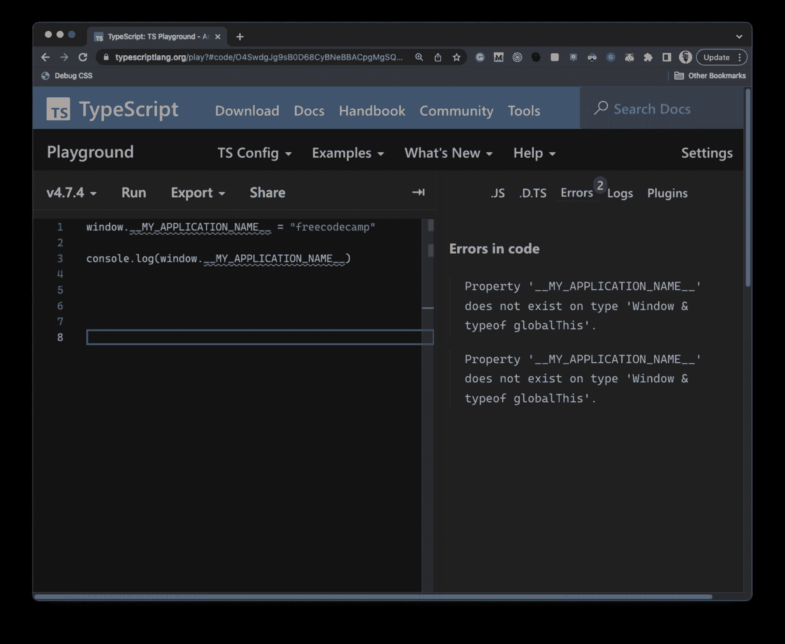

The property does not exist on Window error***** 

*****见[打字稿操场](https://www.freecodecamp.org/news/p/a31cc449-928c-4453-a83d-ce30ef79f986/%20https://www.typescriptlang.org/play?#code/O4SwdgJg9sB0D68CyBNeBBACpgMgSQGF0AVPAeQDl4L0kBRRAAgF5GAiAMwCcBTHgYygQBAQwC2ABzYAoaYLABnKABsesZVADmAClCQYCZGiy5CJclRr1EASln2gA)。*****

*****好吧，打字稿。*****

*****我们明白了。*****

*****仔细观察一下，记住上一节关于[声明文件](https://blog.ohansemmanuel.com/what-is-a-dts-file-in-typescript/)的内容，所有现有的浏览器 API 都有一个声明文件。这包括内置对象，如`window`。*****

*****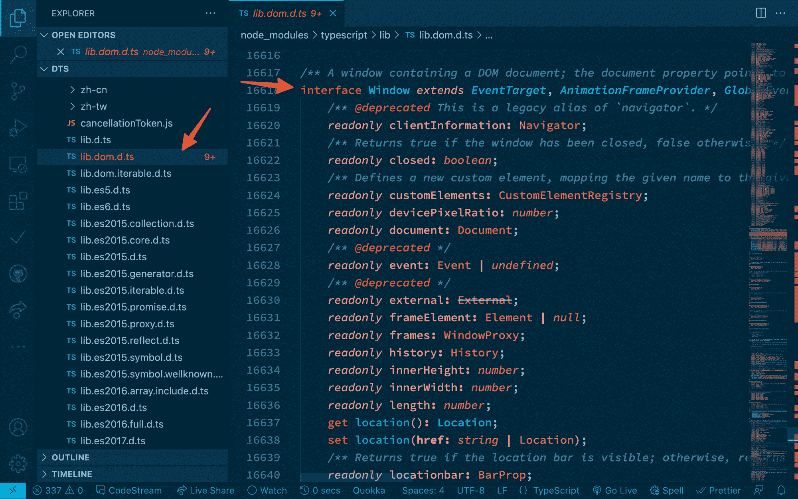

The default Window interface declaration***** 

*****如果您查看一下`lib.dom.d.ts`声明文件，您会发现描述的`Window`接口。*****

*****用外行人的话来说，这里的错误说的是`Window`接口描述了我如何理解`window`对象及其用法。该接口没有指定某个`__MY_APPLICATION_NAME__`属性。*****

## *****如何修复错误*****

*****在类型与接口部分，我解释了如何扩展接口。*****

*****让我们在这里应用这些知识。*****

*****我们可以扩展`Window`接口声明来了解`__MY_APPLICATION_NAME__`属性。*****

*****方法如下:*****

```
*****`// before
window.__MY_APPLICATION_NAME__ = "freecodecamp"

console.log(window.__MY_APPLICATION_NAME__)

// now 
interface Window {
  __MY_APPLICATION_NAME__: string
}

window.__MY_APPLICATION_NAME__ = "freecodecamp"

console.log(window.__MY_APPLICATION_NAME__)`***** 
```

*****消除错误！*****

*****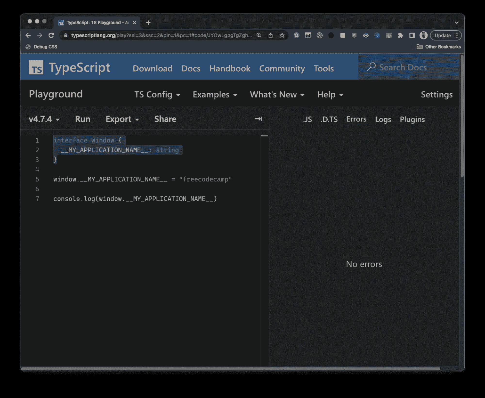

The resolved solution***** 

*****见[打字稿操场](https://www.typescriptlang.org/play?#code/JYOwLgpgTgZghgYwgAgOqgCYHsDuyDeAUMsgPqkCyAmqQIIAK9AMgJIDCtAKiwPIBypPrQoBRcgC5kAZzBRQAc0IBfQoRyZcAOnLU6jVh279BwsaWQBeZACIYUCBARYMjuAFsADtdVOQUrAA2EJoBWPIAFOog2DjalDQMzOxcvAJCouQAlEA)。*****

*****请记住，类型和接口之间的一个关键区别是，接口可以通过多次声明来扩展。*****

*****我们在这里所做的是再次声明了`Window`接口，因此扩展了接口声明。*****

### *****现实世界的解决方案*****

*****我已经在 TypeScript playground 中解决了这个问题，以最简单的形式向您展示解决方案，这就是症结所在。*****

*****然而，在现实世界中，您不会在代码中扩展接口。*****

*****那么，你应该怎么做呢？*****

*****或许，猜猜看？*****

*****是的，你很接近…或者也许是对的:*****

*****创建一个类型定义文件！*****

*****例如，创建一个包含以下内容的`window.d.ts`文件:*****

```
*****`interface Window {
  __MY_APPLICATION_NAME__: string
}`***** 
```

*****给你。*****

*****您已经成功扩展了`Window`接口并解决了问题。*****

*****如果您继续将错误的值类型赋给了`__MY_APPLICATION_NAME__`属性，那么现在您已经启用了强类型检查。*****

*****

A wrong assignment to the newly defined property caught***** 

*****见[打字稿操场](https://www.typescriptlang.org/play?#code/JYOwLgpgTgZghgYwgAgOqgCYHsDuyDeAUMsgPqkCyAmqQIIAK9AMgJIDCtAKiwPIBypPrQoBRcgC5kAZzBRQAc0IBfQoRyZcAOnLU6jVh279BwsaWQBeAsWQg4AWwiSARDCgQICLBk8OADs7Kql4gUlgANhCa4VjyABTqINg42pQ0DMzsXLwCQqLkAJSqxUA)。*****

******和*瞧。*******

## *****结论*****

*****在[旧的栈溢出帖子](https://stackoverflow.com/questions/12709074/how-do-you-explicitly-set-a-new-property-on-window-in-typescript)中，你会发现基于旧的 TypeScript 版本的更复杂的答案。*****

*****在现代类型脚本中，解决方案更容易推理。*****

*****现在你知道了。😉*****

# *****在 TypeScript 中，强类型函数可以作为参数吗？*****

## *****TL；速度三角形定位法(dead reckoning)*****

*****这个问题不需要过多解释。简单的回答是肯定的。*****

*****函数可以是强类型的，甚至可以作为其他函数的参数。*****

## *****介绍*****

*****我必须说，与本文的其他部分不同，在我早期打字的时候，我从未真正发现自己在搜索这个。*****

*****然而，这不是最重要的。*****

*****这是一个很好搜索的问题，所以让我们来回答它！*****

## *****如何在 TypeScript 中使用强类型函数参数*****

*****这个[堆栈溢出帖子](https://stackoverflow.com/questions/14638990/are-strongly-typed-functions-as-parameters-possible-in-typescript)的公认答案在某种程度上是正确的。*****

*****假设你有一个函数:*****

```
*****`function speak(callback) {
  const sentence = "Hello world"
  alert(callback(sentence))
}`***** 
```

*****它接收一个由`string`内部调用的`callback`。*****

*****要键入这个，继续用一个函数类型别名来表示`callback`:*****

```
*****`type Callback = (value: string) => void`***** 
```

*****并按如下方式键入`speak`函数:*****

```
*****`function speak(callback: Callback) {
  const sentence = "Hello world"
  alert(callback(sentence))
}`***** 
```

*****或者，您也可以保持类型内联:*****

```
*****`function speak(callback: (value: string) => void) {
  const sentence = "Hello world"

  alert(callback(sentence))
}`***** 
```

*****见[打字稿操场](https://www.typescriptlang.org/play?#code/GYVwdgxgLglg9mABAZwA4FMCGBrAFBTAG0ICNMJsAuRXANyJHWuSgCcYwBzASkQF4AfIlpwYAE14BvAFCJEEBCxTowUFRHT9EAIgAS6YnEQB3OK0Jjt02YiLpWUfEVLk8yFWsjpu3aQF9rQOkgA)。*****

*****就在那里！*****

*****您使用了一个强类型函数作为参数。*****

## *****如何处理没有返回值的函数*****

*****引用的堆栈溢出帖子中接受的答案例如说 **回调参数的类型必须是**函数，该函数接受一个数字并返回任意类型的*。******

******这部分是对的，但是返回类型不一定是`any`。******

******其实不用`any`。******

******如果您的函数返回一个值，继续并适当地键入它:******

```
******`// Callback returns an object
type Callback = (value: string) => { result: string }`****** 
```

******如果你的回调没有返回任何东西，使用`void`而不是`any`:******

```
******`// Callback returns nothing
type Callback = (value: string) => void`****** 
```

******请注意，函数类型的签名应该是:******

```
******`(arg1: Arg1type, arg2: Arg2type) => ReturnType`****** 
```

******其中`Arg1type`代表参数`arg1`的类型，`Arg2type`代表参数`arg2`的类型，`ReturnType`代表函数的返回类型。******

## ******结论******

******函数是 JavaScript 中传递数据的主要方式。******

******TypeScript 不仅允许您指定函数的输入和输出，还可以将函数类型化为其他函数的参数。******

******大胆使用它们吧。******

# ******如何解决找不到模块…的声明文件的问题？******

******对于 TypeScript 初学者来说，这是一个常见的挫折。******

******然而，你知道如何解决这个问题吗？******

******是的，你有！******

******我们在 **中看到了解决这个问题的办法什么是`d.ts`** 节 **。********

## *****TL；速度三角形定位法(dead reckoning)*****

*****创建一个声明文件，例如`untyped-module.d.ts`，内容如下:`declare module "some-untyped-module";`。注意，这将显式地将模块类型化为`any`。*****

## *****解释的解决方案*****

*****如果您不记得如何解决这个问题，您可以重新阅读编写声明文件部分。*****

*****本质上，您之所以有这个错误，是因为有问题的库没有捆绑它的类型，并且在[上没有明确类型化的](https://github.com/DefinitelyTyped/DefinitelyTyped/)类型定义文件。*****

*****这留给您一个解决方案:编写自己的声明文件。*****

*****例如，如果您已经在项目中安装了库`untyped-module`，`untyped-module`没有引用的类型定义文件，因此 TypeScript 会报错。*****

*****要消除此警告，请在您的项目中创建一个新的`untyped-module.d.ts`文件，其内容如下:*****

```
***`declare module "some-untyped-module";`*** 
```

*****这将把模块声明为类型`any`。*****

*****您将不会获得该模块的任何 TypeScript 支持，但是您将消除 TypeScript 警告。*****

*****理想的后续步骤包括在模块的公共存储库中打开一个问题，以包含一个 TypeScript 声明文件，或者自己写一个像样的声明文件(超出了本文的范围)。*****

# *****如何在 Typescript 中将属性动态分配给对象？*****

*****

Dynamically assigning properties to objects in Typescript***** 

## *****TL；速度三角形定位法(dead reckoning)*****

*****如果不能在声明时定义变量类型，使用`Record`实用程序类型或对象索引签名。*****

## *****介绍*****

*****考虑下面的例子:*****

```
***`const organization = {}

organization.name = "Freecodecamp"`*** 
```

*****这段看似无害的代码在将`name`动态分配给`organization`对象时抛出了一个 TypeScript 错误。*****

*****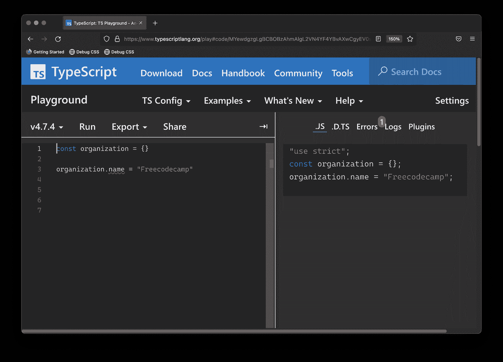

Typescript error when adding a new property dynamically***** 

*****见[打字稿操场](https://www.typescriptlang.org/play?#code/MYewdgzgLgBCBOBzAhmAlgL2VN4YF4YBvAXwCgyEV0sdwA6MZAWwFMCYAiAMXlddAATASwAOnCjCnSZsufIWKlylarXqZFIA)*****

*****困惑的来源是，看似简单的事情在打字稿中怎么会是一个问题？如果你是打字稿初学者，这种困惑可能是合理的。*****

## *****理解问题*****

*****一般来说，TypeScript 在声明变量时确定变量的类型，这种确定的类型不会改变——也就是说，它在整个应用程序中保持不变。*****

*****当考虑类型收缩或使用 any 类型时，此规则也有例外，但这是一个要记住的一般规则。*****

*****在前面的例子中，`organization`对象声明如下:*****

```
***`const organization = {}`*** 
```

*****没有给`organization`变量分配显式类型，因此 TypeScript 根据声明推断出`organization`的类型为`{}`，即文本空对象。*****

*****例如，如果您添加一个类型别名，您可以浏览`organization`的类型:*****

```
***`type Org = typeof organization`*** 
```

*****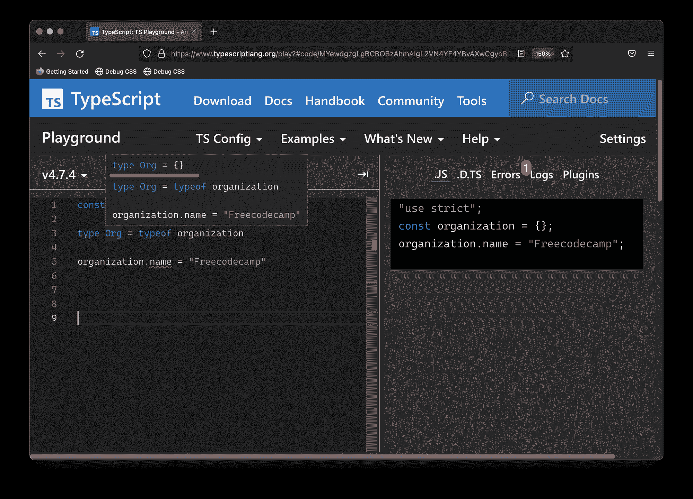

Exploring the literal object type***** 

*****见[打字稿操场](https://www.typescriptlang.org/play?#code/MYewdgzgLgBCBOBzAhmAlgL2VN4YF4YBvAXwCgyoBPABwFMYB5JAma+kAMziVU21xgKCFOiw5wAOjDIAtg0IAiAGLw6dUABMNcmoooxDR4ydNnzFy1es3bd4xSA)。*****

*****当您试图在这个空的对象文字上引用`name`属性时:*****

```
***`organization.name = ...`*** 
```

*****TypeScript 大叫。*****

> *****类型“`{}`”上不存在属性“name”。*****

*****当你理解了这个问题，这个错误看起来是合适的。*****

*****让我们解决这个问题。*****

## *****如何解决该错误*****

*****这里有许多方法可以解决 TypeScript 错误。让我们考虑这些:*****

### *****1.在声明时显式键入对象*****

*****这是最容易推理的解决方案。*****

*****在声明对象时，继续输入它。此外，给它分配所有相关的值。*****

```
***`type Org = {
    name: string
}

const organization: Org = {
    name: "Freecodecamp"
}`*** 
```

*****见[打字稿操场](https://www.typescriptlang.org/play?#code/C4TwDgpgBA8gTgcygXigbwFBW1AdgQwFsIAuKAZ2DgEtcEMBfDDAYwHtdKo3F9dqAXvmDUOZeElSYceIqSgAiAGJwIEdgBN1RMAsbMDQA)。*****

*****这消除了所有的惊讶。*****

*****在创建对象时，您清楚地说明了这个对象的类型，并正确地声明了所有相关的属性。*****

*****但是，如果必须动态添加对象属性，这并不总是可行的。*****

### *****2.使用对象索引签名*****

*****有时候，对象的属性确实需要在声明之后添加。*****

*****在这种情况下，您可以利用对象索引签名，如下所示:*****

```
***`type Org = {[key: string] : string}

const organization: Org = {}

organization.name = "Freecodecamp"`*** 
```

*****见[打字稿操场](https://www.typescriptlang.org/play?#code/C4TwDgpgBA8gTgcygXigbwNoGsIgFxQDOwcAlgHYIC6UBxZlAvgFDMDGA9ucVB4gIblSAL37BSXAvCSo0LZnwSCRYieQB05fgFtoqAEQAxOBAicAJmZ1h9rO0A)。*****

*****在声明`organization`变量的时候，您可以将它显式地输入到下面的`{[key: string] : string}`中。*****

*****为了进一步解释语法，您可能习惯于具有固定属性类型的对象类型:*****

```
***`type obj = {
  name: string
}`*** 
```

*****但是你也可以用`name`来代替“变量类型”。*****

*****例如，如果您想在`obj`上定义任何字符串属性:*****

```
***`type obj = {
 [key: string]: string
}`*** 
```

*****请注意，语法类似于在标准 JavaScript 中使用 variable object 属性的方式:*****

```
***`const variable = "name" 

const obj = {
   [variable]: "Freecodecamp"
}`*** 
```

*****等效的 TypeScript 称为对象索引签名。*****

*****另外，请注意，您可以使用其他原语键入`key`:*****

```
***`// number 
type Org = {[key: number] : string}

// string 
type Org = {[key: string] : string}

//boolean
type Org = {[key: boolean] : string}`*** 
```

### *****3.使用记录实用程序类型*****

*****这里的解决方案非常简洁:*****

```
***`type Org = Record<string, string>

const organization: Org = {}

organization.name = "Freecodecamp"`*** 
```

*****除了使用类型别名，您还可以内联类型:*****

```
***`const organization: Record<string, string> = {}`*** 
```

*****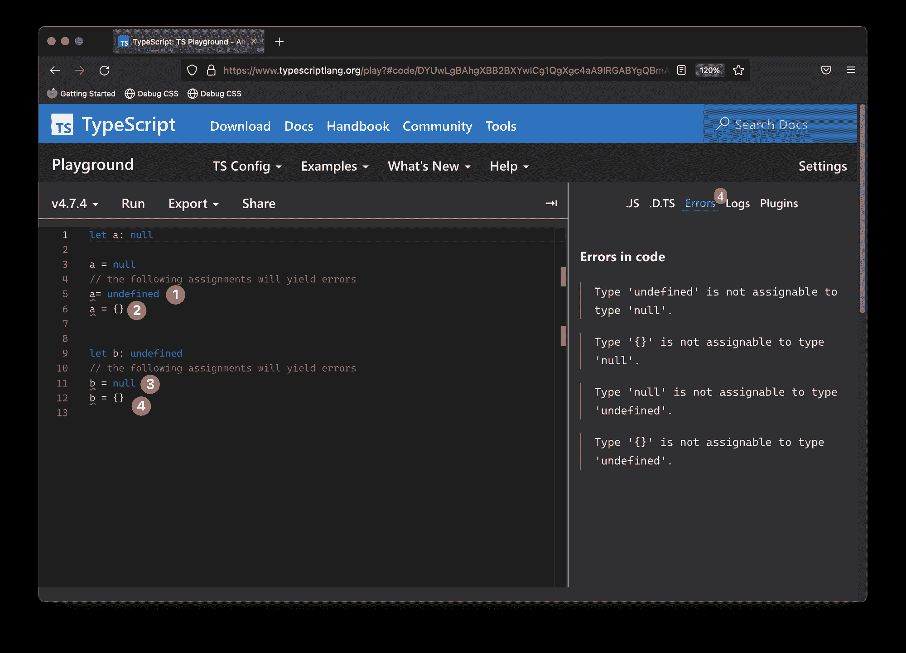

Using the Record utility type***** 

*****见[打字稿操场](https://www.typescriptlang.org/play?#code/C4TwDgpgBA8gTgcygXigJQgYwPZwCYA8AzsHAJYB2CANFCeVQHwBQzOFJUuCAhhWQC8ewMtgoAuWIhRQA3gF9Wzbn0HDRFAHQUeAW2ioARADE4ELNjxY9YQ0tZA)。*****

*****`Record`实用程序类型具有以下签名:`Record<Keys, Type>`。*****

*****它允许您限制属性为`Keys`且属性值为`Type`的对象类型。*****

*****在我们的例子中，`Keys`代表`string`和`Type`，`string`也是如此。*****

## *****结论*****

*****除了原语，您必须处理的最常见的类型可能是对象类型。*****

*****在需要动态构建对象的情况下，利用 Record 实用程序类型或使用对象索引签名来定义对象上允许的属性。*****

*****请注意，您可以获得一个 [PDF 或 ePub](https://www.ohansemmanuel.com/cheatsheet/top-7-stack-overflowed-typescript-questions) 版本的备忘单，以便于参考，或者在 Kindle 或平板电脑上阅读。*****

*****感谢您的阅读！*****

## *****想要一本免费的打字本吗？*****

*****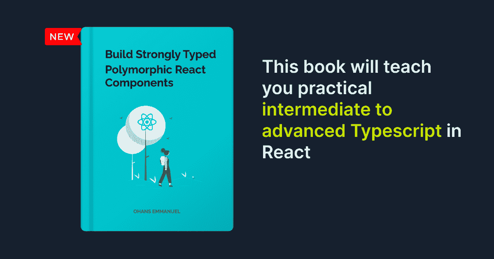

Build strongly typed Polymorphic React components book***** 

*****免费获得这本书。*****