# OpenStack 教程–运营您自己的私有云(完整课程)

> 原文：<https://www.freecodecamp.org/news/openstack-tutorial-operate-your-own-private-cloud/>

OpenStack 是一款开源软件，为虚拟机、裸机和容器提供云基础设施。

在本文中，您将了解如何使用 OpenStack 来运营您自己的私有云。

在本教程结束时，您将对什么是 OpenStack 有一个核心的了解，并了解使用 OpenMetal 平台设置和管理 OpenStack 的基础知识。还会了解一些常用的 OpenStack 服务。

除了创建这篇文章版本的教程，我还创建了一个视频版本。你可以在 freeCodeCamp.org YouTube 频道观看视频。

[https://www.youtube.com/embed/_gWfFEuert8?feature=oembed](https://www.youtube.com/embed/_gWfFEuert8?feature=oembed)

为了跟随本教程，对 Linux 命令行、网络和虚拟化有一个基本的了解会很有帮助。但是这些都不是必需的。

感谢 OpenMetal 赞助本教程。

## 什么是 OpenStack？

OpenStack 是一个开源云计算平台，组织使用它来管理和控制虚拟机的大规模部署，例如在云计算或虚拟专用服务器环境中。OpenStack 是组织的热门选择，因为它可扩展、可靠，并提供对底层基础架构的高度控制。

除了用于管理虚拟机的部署，OpenStack 还可以用于管理云环境中的存储和网络资源。

在某些方面，OpenStack 可以与 AWS 相提并论，但两者之间存在一些关键差异:

*   OpenStack 是开源平台，而 AWS 是专有平台。
*   OpenStack 比 AWS 提供了更多的灵活性和定制选项。
*   与 AWS 相比，OpenStack 通常需要更多的技术专业知识来设置和管理，因为您基本上必须自己设置一切。

让我们深入了解 OpenStack 提供的更多细节。

除了标准的基础架构即服务功能之外，其他组件还提供流程编排、故障和服务管理以及其他服务，以确保用户应用程序的高可用性。


OpenStack diagram.

OpenStack 被分解成多个服务，允许您根据需要即插即用组件。下面的 OpenStack 地图显示了常见的服务以及它们是如何组合在一起的。


OpenStack map.

我不会涵盖每一项服务，但下面是一些更常见的 OpenStack 服务的功能。

**对象存储** : OpenStack 对象存储(Swift)是一个高度可扩展的分布式对象存储系统。

**Compute**:open stack Compute(Nova)是一个云计算架构控制器，负责管理计算资源的分配。

**联网** : OpenStack 联网(Neutron)是一个管理网络和 IP 地址的系统。

**仪表盘**:OpenStack 仪表盘(Horizon)是一个基于网络的界面，用于管理 open stack 资源。

**身份** : OpenStack Identity (Keystone)是一个管理用户账户和访问控制的系统。

**Image**:open stack Image(Glance)是一个用于存储和检索虚拟机映像的服务。

**块存储** : OpenStack 块存储(Cinder)是一项管理块存储设备的服务。

**遥测** : OpenStack 遥测(云高仪)是一项收集和存储计量数据的服务。

**编排** : OpenStack 编排(Heat)是一项用于编排和云形成的服务。

**裸机** : OpenStack 裸机(Ironic)是一项用于供应和管理裸机服务器的服务。

**数据处理**:open stack Data Processing(Sahara)是一项用于配置和管理 Hadoop 和 Spark 集群的服务。

在本课程的后面，我们将展示一些更常见的 OpenStack 服务。

根据您的应用或组织的需求，有许多不同的方法来部署和配置 OpenStack。

在本课程中，我们将学习如何开始使用 OpenStack 并使用许多最常见的功能。

开始使用 OpenStack 的最简单方法之一是使用 OpenMetal 按需私有云。这使我们能够快速将 OpenStack 部署到云中，并简化设置过程。OpenMetal 提供了一笔赠款，使得本教程成为可能。

虽然我们将使用 OpenMetal 来了解 OpenStack，但本教程中涵盖的内容适用于任何 OpenStack 部署，而不仅仅是使用 OpenMetal 的部署。所以不管你想怎么用 OpenStack，这个教程都是为你准备的。

## 在 OpenMetal 上设置 OpenStack

要获得 OpenStack 设置，您需要在 OpenMetal 上供应和设置您的云。只需按照 OpenMetal 中央页面上的提示进行设置。

设置时，您必须

OpenMetal 私有云通过 OpenStack 部署到三台裸机服务器上。这三台服务器构成了私有云核心。对于 OpenStack，这三台服务器被视为控制平面。私有云与 Ceph 一起部署，为您的云提供共享存储。Ceph 是一款开源的软件定义存储解决方案。

让我们来看看在 OpenMetal 上创建的硬件资产。如果您刚刚创建了云，您可能已经在云管理页面上打开了。如果没有，请单击“管理”。现在，单击左侧菜单中的“资产”。

此页面包含私有云部署中包含的资产列表。这些包括您的硬件控制平面节点和用于清单和提供商 IP 地址的 IP 块。

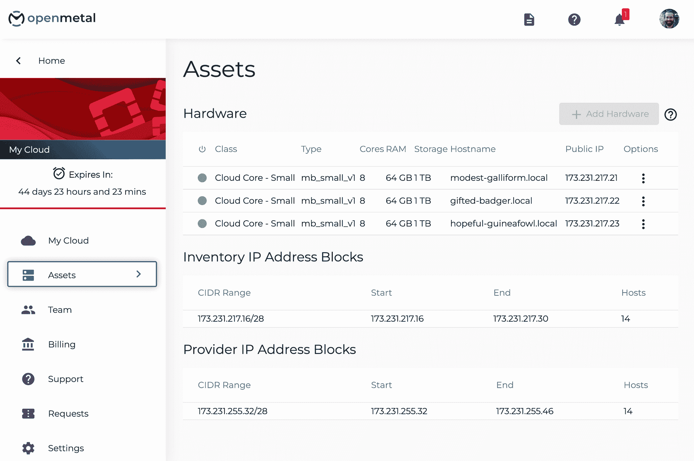

Assets Page of Cloud Management Dashboard for OpenMetal

上面的屏幕截图是演示专用云中的资产列表。根据您在部署中选择的选项，您的私有云可以有不同的硬件:

在本例中，您会注意到三个主要部分:

*   3 云核心 **mb_small_v1** 控制平面节点
*   库存 IP 地址块
*   提供商 IP 地址块

借助这些私有云，OpenStack 部署了三个超融合控制平面节点。

您可以作为 root 用户通过 SSH 直接访问这些控制平面节点。这种访问是通过您在私有云部署期间提供的 SSH 密钥来完成的。使用此命令连接(您必须更改密钥名和 IP 以匹配您的信息):

`ssh -i ~/.ssh/your_key_name root@173.231.217.21`

## OpenStack Horizon 入门

Horizon 是默认 OpenStack 仪表板的名称，它为 OpenStack 服务提供基于 web 的用户界面。它允许用户管理云。

要访问新云的 OpenStack 仪表盘(名为 Horizon ),您需要获得 Horizon 的管理员密码。用户名是“admin”。

首先，SSH 进入云的一个服务器(您可以使用“资产”页面中的任何 IP 地址)。例如:

`ssh -i ~/.ssh/your_key_name root@173.231.217.21`

登录到服务器后，运行以下命令:

`grep keystone_admin_password /etc/kolla/passwords.yml`

密码将显示在输出中，如下例所示:

`keystone_admin_password: aB0cD1eF2gH3iJ4kL5mN6oP7qR8sT9uV`

接下来，发射地平线。在 OpenMetal 上，您可以单击左侧菜单中的“Horizon”选项卡。

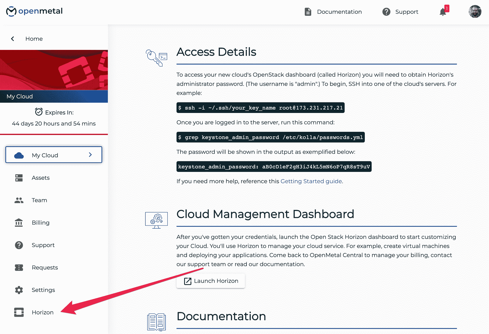

使用“admin”和您刚刚访问的密码登录。

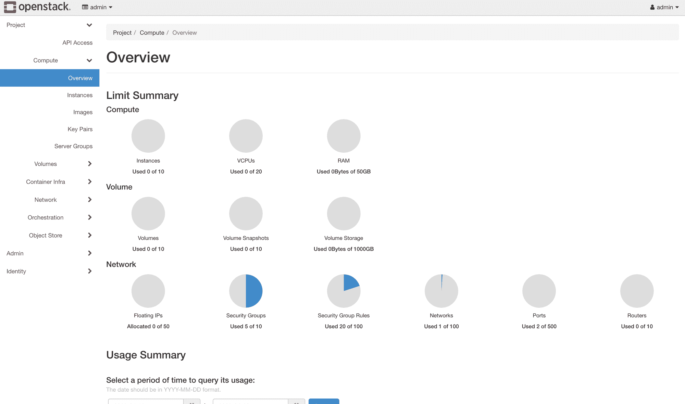

Horizon dashboard.

## 在 OpenStack Horizon 中创建项目

在 OpenStack 中，云是通过使用项目来划分的。项目与用户相关联，用户具有由角色定义的不同访问级别。管理员通过修改配额来定义每个项目的资源限制。

现在，我们将学习如何创建一个项目并将用户与它相关联。我们还将学习如何调整项目配额。无论您在哪里部署 OpenStack，Horizon 界面都是相似的。这不是 OpenMetal 特有的。

Horizon 左侧菜单中有三个根级选项卡:项目、管理和身份。只有具有管理权限的用户才能看到“管理”选项卡。

要创建您的第一个项目，请导航到 Identity -> Projects。

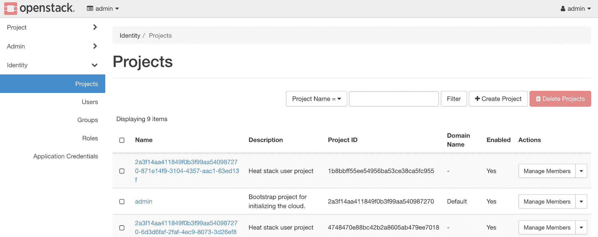

Projects.

已经存在几个项目，包括管理项目。这些项目是默认部署的，通常不应修改。

点击右上角附近的**创建项目**按钮，创建一个新项目。

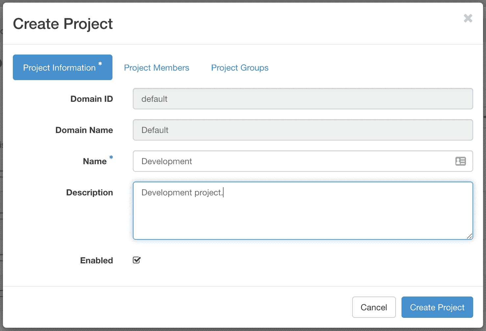

在**名称**字段下，指定项目的名称。这个示例项目被称为**开发**。您还可以添加项目成员和项目组，但是我们还不打算讨论这些。点击**创建项目**完成第一个项目的创建。

创建后，项目会出现在项目列表页面中。

在项目列表页面中，您可以作为**管理员**用户查看和调整该项目的配额。配额是对资源的限制，就像实例数量一样。

在 **Identity - > Projects** 选项卡中查看该项目的配额，找到右边的下拉菜单，第一个选项是**管理成员**。在该菜单中，点击**修改配额**查看默认配额值。


您将看到一个包含多个选项卡的表单，并看到计算服务的配额。容量和网络服务也有配额。

您可能希望根据您的工作量调整此表单中的参数。将值设置为`-1`意味着配额是无限的。

## 如何创建用户并与项目关联

现在您已经有了一个项目，您可以将一个用户与它相关联。已经有了默认的 **admin** 用户，但现在让我们看看如何创建一个新用户并使用新用户登录。

首先作为**管理员**导航到**身份- >用户**。默认情况下，已经列出了几个用户，这是意料之中的。这些是在云部署期间创建的，通常不应修改。

点击**创建用户**按钮。


Users tab.

在创建用户表单上为**用户名**、**密码**、**主项目**和**角色**设置值。**电子邮件**字段是可选的，但有助于密码重置。对于**项目**选择我们之前创建的项目。

对于**角色**,根据所需的访问级别，有几个选项。默认的 OpenStack 角色是**读者**、**成员**和**管理员**。下拉列表中还存在其他角色。**读者**是层级中权威最低的角色。对于本例，为角色选择**成员**。

按下**创建用户**创建用户。

接下来，以 **admin** 的身份从 Horizon 中注销，并使用您的新用户重新登录。重新登录后，默认情况下，您处于新创建的项目中。您可以在左上角看到您当前所在的项目，您的用户可以在 Horizon 的右上角看到。

## 管理和创建图像

现在，让我们学习如何将图像(不是图形图像，而是 Linux 安装的副本)上传到 OpenStack，以及从现有实例创建图像。

映像包含用于创建实例的可引导操作系统。在您的 OpenMetal 云中，有几种不同的映像可供使用，包括 CentOS、Debian、Fedora 和 Ubuntu。除此之外，您还可以选择从其他来源上传图像或创建自己的图像。

我们将学习如何通过 Horizon 上传图像，以及如何从实例快照创建图像。Glance 是用于管理映像的工具，允许用户发现、检索和注册 VM(虚拟机)映像和容器映像。Glance 使用 Ceph 存储图像，而不是本地文件系统。

要从 Horizon 仪表盘中访问图像，请导航至**项目**选项卡。在项目选项卡中，选择**计算**，然后选择**图像**。此选项卡包含 OpenStack 中所有图像的列表。


Images

点击**创建图像**按钮，可通过您的 Horizon 仪表盘上传图像。创建图像时，您必须选择图像的格式。根据我们的配置，推荐的图像格式是**qco w2–QEMU 模拟器**。QCOW2 是 Linux KVM 最常见的格式，可动态扩展，并支持写入时复制。

为了在 Horizon 上上传映像，您必须首先在本地计算机上安装映像。在本例中，我们将上传一个 CirrOS 映像。你可以在这里下载一张 CirrOS 图片。

现在点击右上角附近的**创建图像**按钮。

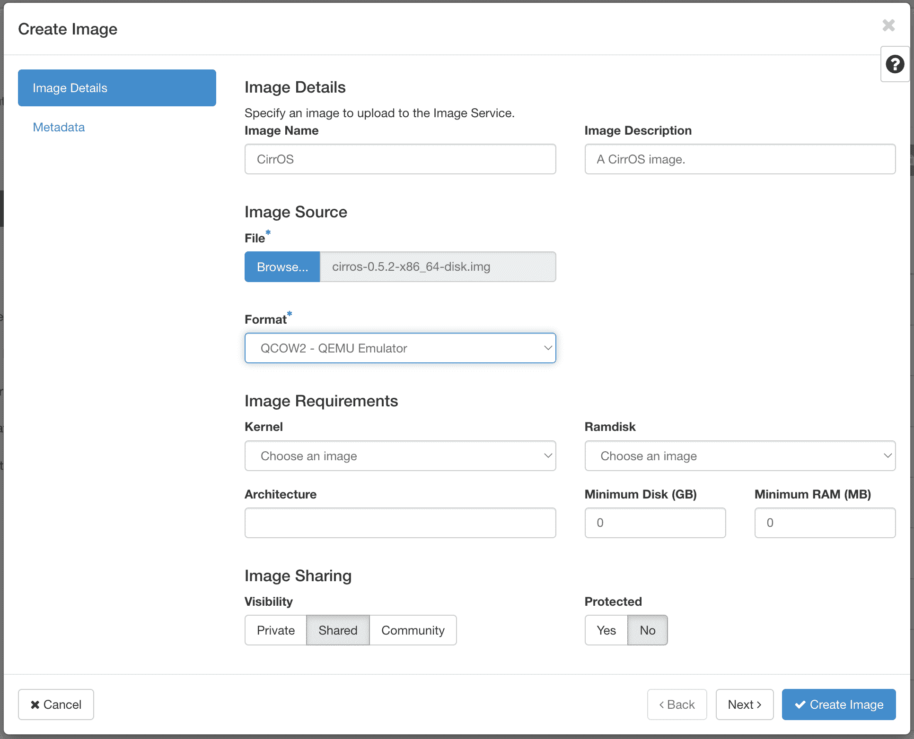

在本例中，我们将使用以下字段值:

*   **图像名称**:图像的名称
*   **图像描述**:图像的可选描述
*   **文件**:你机器上的源文件
*   **格式**:qco w2–QEMU 仿真器

根据需要填写详细信息并提交表单。完成上传图像可能需要一些时间。

## 在 OpenStack Horizon 中创建一个实例

借助 OpenStack，实例或虚拟机在云的工作负载中扮演着重要角色。OpenStack 提供了一种通过其名为 [Nova](https://docs.openstack.org/nova/latest/) 的计算服务来创建和管理实例的方法。

Nova 是 OpenStack 项目，它提供了一种配置计算实例(也称为虚拟服务器)的方法。Nova 支持创建虚拟机、裸机服务器，但对系统容器的支持有限。Nova 作为一组守护进程运行在现有的 Linux 服务器之上，提供这种服务。

现在让我们学习如何创建一个实例，包括设置一个私有网络和路由器，创建一个安全组，以及如何添加一个 SSH 密钥对。

### 创建一个专用网络

首先，让我们学习如何创建一个私有网络和路由器。稍后，我们将在这个专用网络上创建一个实例。创建路由器是为了让专用网络可以连接到云的公共网络，允许您为其分配一个浮动 IP 地址，从而使实例可以通过互联网访问。

要创建一个专用网络，首先导航到**项目- >网络- >网络**。然后点击**创建网络**。


Networks tab.

在本例中，我们将创建一个包含以下详细信息的网络:

*   **网络名称**:设置网络名称。这个例子叫做**私人**。
*   **启用管理状态**:保持选中以启用网络。
*   **创建子网**:保持选中以创建子网。
*   **可用性区域提示**:将此选项保留为默认选项。

接下来，转到该表单的**子网**选项卡，并使用这些详细信息:

*   **子网名称**:设置子网名称。这个示例子网被称为**私有子网**。
*   **网络地址**:选择一个私有网络范围。例如:`192.168.0.1/24`
*   **IP 版本**:保留为 IPv4。
*   **网关 IP** :这是可选的。如果未设置，将自动选择网关 IP。
*   **禁用网关**:不勾选此项。

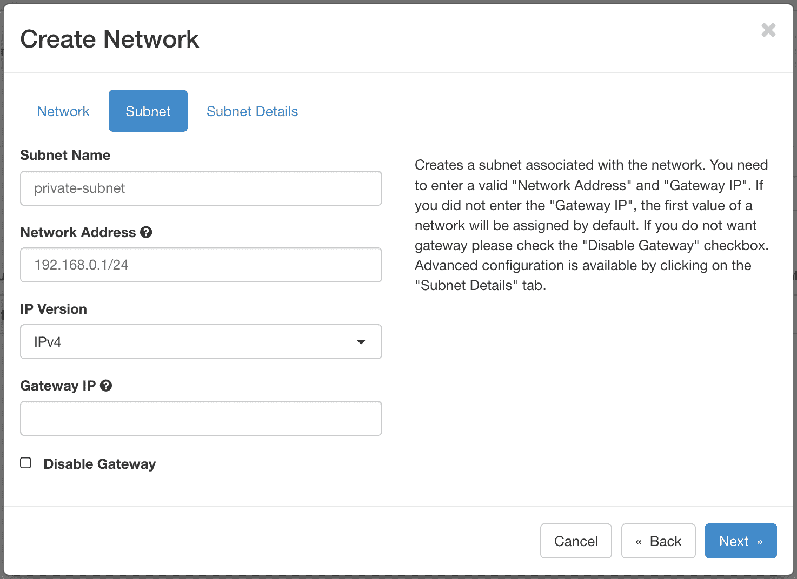

Create a network.

现在，我们将在**子网详细信息**选项卡中保留默认详细信息。

点击**创建**创建网络。创建后，它会出现在网络列表中。

### 创建路由器

接下来，您需要创建一个路由器来桥接私有网络和公共网络之间的连接。公网称为**外网**。

要创建路由器，首先导航到**项目- >网络- >路由器**。点击**创建路由器**。


Routers.

为此示例输入以下数据:

*   **路由器名称**:在此设置路由器名称。这个示例路由器被称为**路由器**。
*   **启用管理状态**:保持选中此项以启用路由器。
*   **外部网络**:选择网络**外部**。
*   **可用性区域提示**:保留默认值。

完成后，按下**创建路由器**创建路由器。

### 将路由器连接到专用网络

接下来，通过连接接口将路由器连接到专用网络。执行该步骤允许专用网络和外部网络之间的网络通信。

要将接口连接到路由器，首先导航到路由器列表并找到之前创建的接口。

单击路由器名称以访问其详细信息页面。这是接口连接的地方。共有三个选项卡:**总览**、**接口**和**静态路由**。要附加一个接口，导航到**接口**选项卡，然后点击右上角附近的**添加接口**来加载要附加接口的表单。

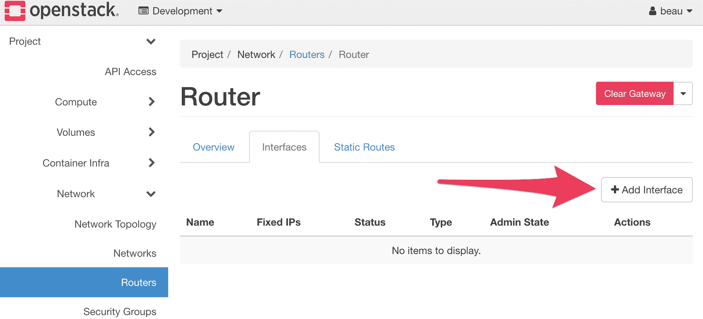

在新接口上，为**子网**选择私有子网。如果您没有设置 IP 地址，则会自动选择一个。按下**提交**将**私有**网络连接到该路由器。然后接口被连接，现在被列出。

您可以通过导航到**项目- >网络- >网络拓扑**来直观地查看您的云的网络拓扑。

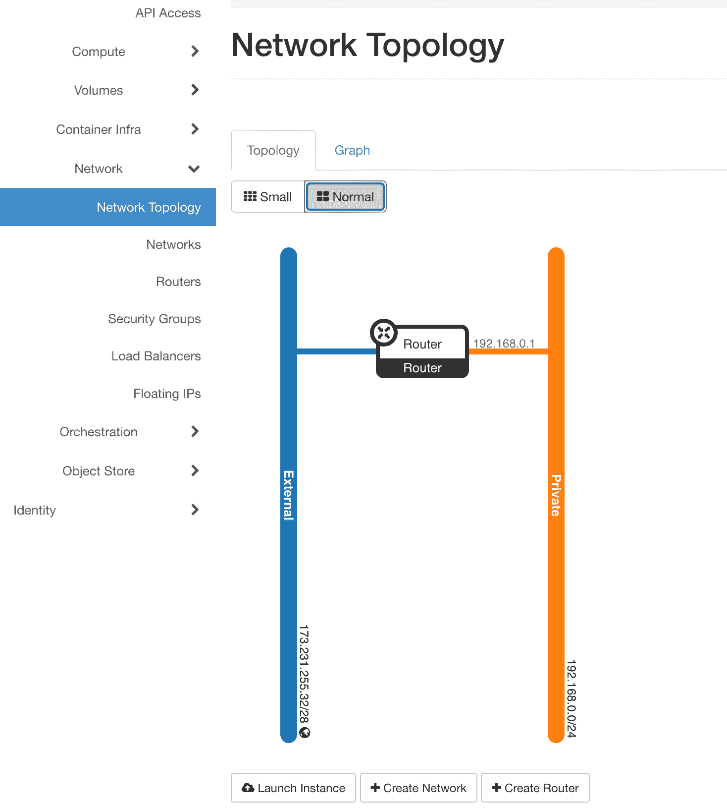

上面的例子表明**外部**网络通过名为**路由器**的路由器连接到**私有**网络。

### 安全组

安全组允许控制进出实例的网络流量。例如，可以为单个 IP 或一系列 IP 的 SSH 开放端口 22。

让我们看看如何为 SSH 访问创建一个安全组。稍后，我们将把我们创建的安全组应用到一个实例。

要查看和管理安全组，请导航至**项目- >网络- >安全组**。

您应该注意到一个名为 **default** 的安全组。该安全组限制所有传入(传入)网络流量，并允许所有传出(传出)网络流量。创建实例时，默认情况下会应用该安全组。要允许您的实例所需的网络流量，请仅根据需要将端口开放到所需的 IP 范围。

要为 SSH 创建安全组，点击右上角附近的**创建安全组**。

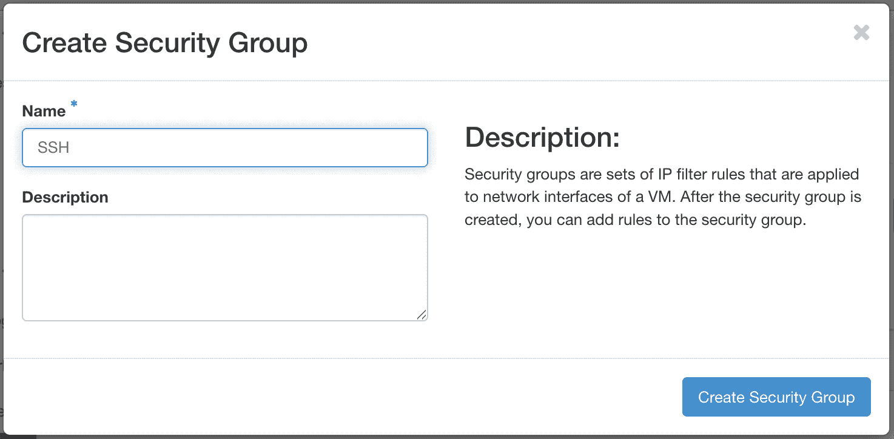

将该组命名为 **SSH** ，然后单击**创建安全组**

创建 SSH 安全组之后，我们需要添加一个允许 SSH 流量的规则。我们将允许 SSH 流量从这个云中的第一个硬件节点流向这个实例。

要添加规则，通过导航到右上角附近的**添加规则**来加载表单。

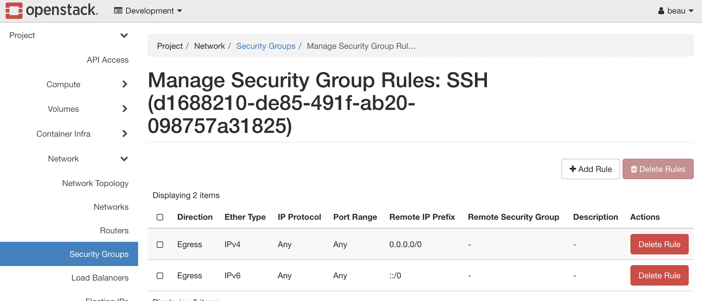

我们需要获得您的云的第一个硬件节点的 IP 地址。你可以使用云的[资产页面](https://central.openmetal.io/documentation/operators-manual/introduction-to-openmetal-central-and-your-private-cloud-core#how-to-view-your-hardware-assets)下的 [OpenMetal Central](https://central.openmetal.io/) 找到它。

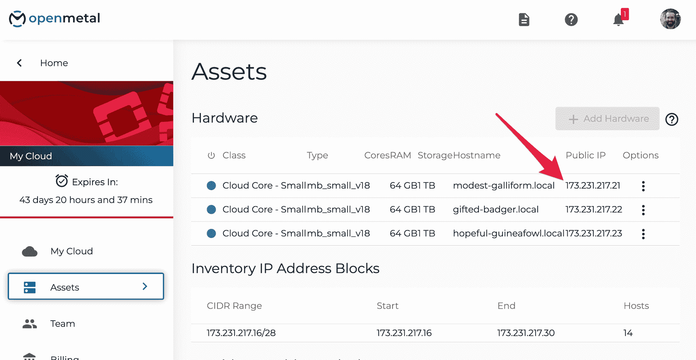

The IP address for the first hardware node.

在**添加规则**菜单中，添加以下信息:

*   **规则**:选择**宋承宪**。添加规则时，您可以从预定义的选项中进行选择。在这种情况下，我们从第一个下拉列表中选择 **SSH** 规则。
*   **描述**:可选。提供规则的描述。
*   **遥控**:选择 **CIDR** 。
*   **CIDR** :指定你的第一个硬件节点的 IP 地址。

按下**添加**将该规则添加到安全组。

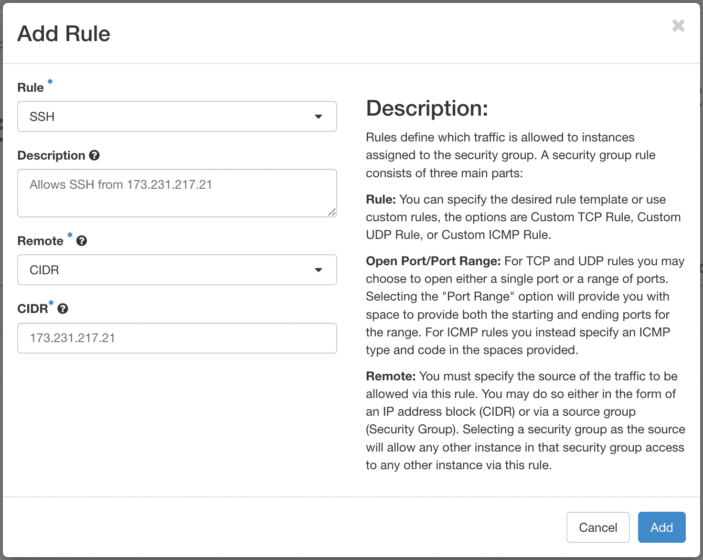

Adding a rule.

## 创建实例

我们现在几乎已经具备了创建实例的所有条件。

我们将需要一个 SSH 公钥。通过 SSH 访问实例需要 SSH 公钥。这个键在创建时注入到实例中。SSH 密钥不能添加到已经运行的实例中。

我们将创建一个实例，可以通过 SSH 从云的一个硬件节点访问该实例。因此，我们必须在其中一个硬件节点中创建一个 SSH 密钥对。该密钥对的公共部分与我们即将创建的实例相关联。

****要了解如何创建这个密钥对，请参见补充指南:[为 OpenStack 控制平面节点](https://central.openmetal.io/documentation/operators-manual/create-ssh-key-pair-for-an-openstack-control-plane-node/)创建 SSH 密钥对。**

要创建一个实例，首先导航到**项目- >计算- >实例**。然后点击**启动实例**按钮。


在“详细信息”选项卡上，填写以下详细信息:

*   **实例名称**:设置实例的名称。这个示例实例被称为 **Jumpstation** 。
*   **描述**:可选。如果适用，请设置描述。
*   **可用区**:默认为**新星**。
*   **Count** :控制产生的实例数量。只需创建 1。

接下来，转到 **Source** 选项卡，允许您指定操作系统映像。

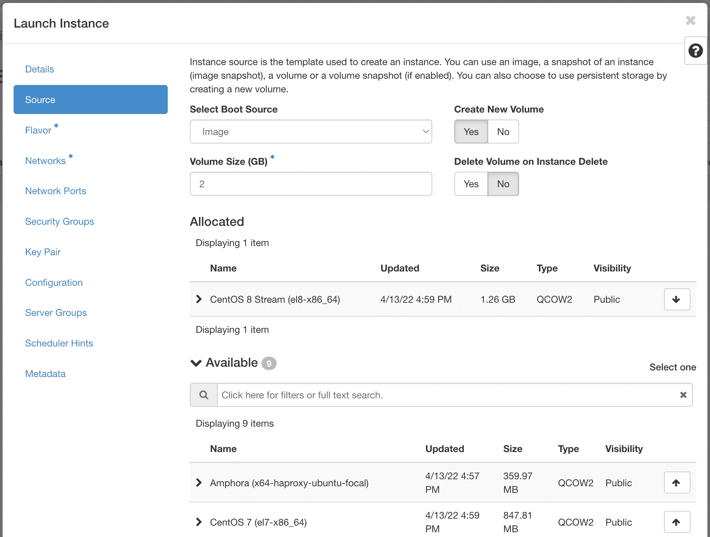

Source tab.

填写以下详细信息:

*   **选择引导源**:在这个例子中，我们使用**映像**作为引导源。
*   **创建新卷**:保持选中状态**是**。这将创建一个新的 Cinder 卷，指定的操作系统映像将复制到该卷中。该卷最终与 Ceph 集群一起存在于`vms`池中。
*   **卷大小**:让系统为你决定。
*   **实例删除时删除卷**:将此选项设为**否**。如果选中，当实例被删除时，卷也会被删除。
*   在**可用的**部分，选择合适的操作系统。这个例子使用了`CentOS 8 Stream (el8-x86_64)`。点击向上箭头会将其移动到**分配的**部分。

实例源的配置到此结束。接下来，移动到**风味**标签。

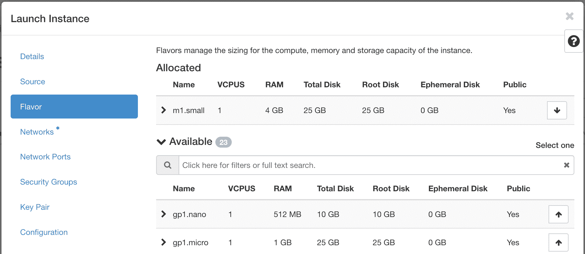

Flavor tab.

风格是定义实例使用的 VCPUs、RAM 和磁盘空间的一种方式。预制口味可供您选择。对于这一步，从可用标题下的选项中选择合适的口味。这个例子使用 m1.small 风格。点击向上箭头将其移动到**分配的**部分。

接下来，转到网络选项卡。

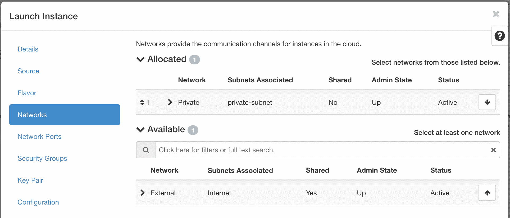

Network tab.

在此部分中，您将指定与实例相关联的网络。对于本例，选择之前创建的**专用**网络。您也可以选择**外部**网络，但是如果您的实例需要互联网连接，通常不推荐使用浮动 IP。

您应该只在必要时暴露网络的一部分。这减少了攻击面，提高了应用程序的安全性。如果未创建专用网络，但在默认云中创建了实例，则该实例与**外部**网络相关联。这意味着该实例使用公共 IP，并且可以通过互联网访问。

接下来，跳过**网络端口**选项卡，转到**安全组**。

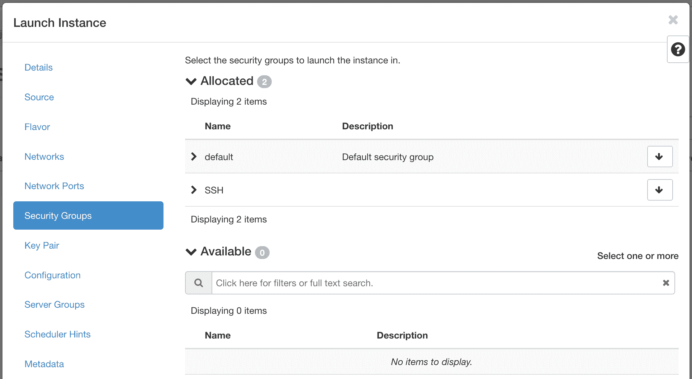

Security Groups tab.

这是为实例选择安全组的地方。这个例子使用了**可用**部分中的 **SSH** 安全组。单击向上箭头将 SSH 安全组移动到**分配的**部分。

最后一步，移动到**密钥对**选项卡。

在本节中，您将指定一个 SSH 公钥来注入到实例中。在此阶段，您可以使用此表单通过**导入密钥对**按钮上传您的密钥。您也可以在该选项卡上创建密钥对。

我们将从云中的第一个硬件节点创建一个密钥对，这样就可以通过 SSH 从该节点访问这个实例。

要从第一个硬件节点创建 SSH 密钥对，第一步是登录第一个硬件节点。您可以从 OpenMetal 上的 Assets 选项卡中获取硬件节点的 IP。我们已经在本教程的开头连接了这个节点，命令是相同的。它看起来会像这样:

`ssh -i ~/.ssh/your_key_name root@173.231.217.21`

登录到节点后，使用`ssh-keygen`生成一个 SSH 密钥对。

例如:

```
[root@modest-galliform ~]# ssh-keygen
Generating public/private rsa key pair.
Enter file in which to save the key (/root/.ssh/id_rsa): 
Enter passphrase (empty for no passphrase): 
Enter same passphrase again: 
Your identification has been saved in /root/.ssh/id_rsa.
Your public key has been saved in /root/.ssh/id_rsa.pub.
The key fingerprint is:
SHA256:BNIzHPcqCyjjZqWm88s0zqHrj8J8+gUnkF1cNOEDKZs root@modest-galliform.local
The key's randomart image is:
+---[RSA 3072]----+
|    o=**o        |
|  o..+Bo..       |
| o .+  =. .      |
|  .E   ...       |
|o .+... S        |
|.oo +. o         |
|o*+  ..          |
|BO.+.            |
|*B@+             |
+----[SHA256]-----+
```

私钥保存在默认位置`/root/.ssh/id_rsa`，并设置了一个密码以增加安全性。

要查看公钥的内容，请使用`cat /root/.ssh/id_rsa.pub`。

例如:

```
[root@modest-galliform ~]# cat /root/.ssh/id_rsa.pub
ssh-rsa AAAAB3NzaC1yc2EAAAADAQABAAABgQCv6YOgYbRmXCEFxZP+t+pzh/RRKzsgWpvcnmKwF+uwiKDuihHadScCkgd8dE6ymCjP/+UVdVLGEzXfHXG5EfbcPQYOGjqqOGqOVCHIrhFMG3GjSPao99KaDIAvXsWyTDI9FmrXTiC+0WkmOLNb0UeDic+lQ6KJumw12O1niZjC19jMpWR5amRWEJo6oKFylC8JLHsdfhqr7EBcBzvUJkqh/1zY3qcsABHBrBCWOKC5oNiDAzctQ5MeHq6tv6w6YxdZLLdupczteERN6roroySMtR2JZnOIcnq1aUgD/YDJDeg9zpvUN7stsndONYVOH42+bBu7xEWsm8zobgdfLlmhv+8ab7dKVlYvJUkITqCoKpp8m0f3dbLtQSevCJ9qaeQvmxkjU9OHVPkkTolw4aUHvUsutpVynNfmErf3RGMjQRiQ3ZE7xGKVV7iSFDK9l0mMWBHpYu2OnVKQlP823IC0YKD2dP3qDd/nnvGXVlxfRI+C08n9ehoHwZAIz4SM3dU= root@modest-galliform.local
```

复制整个密钥。从“ssh-rsa”开始，一直延续到最后。

现在回到**密钥对**选项卡。点击**导入密钥对。**

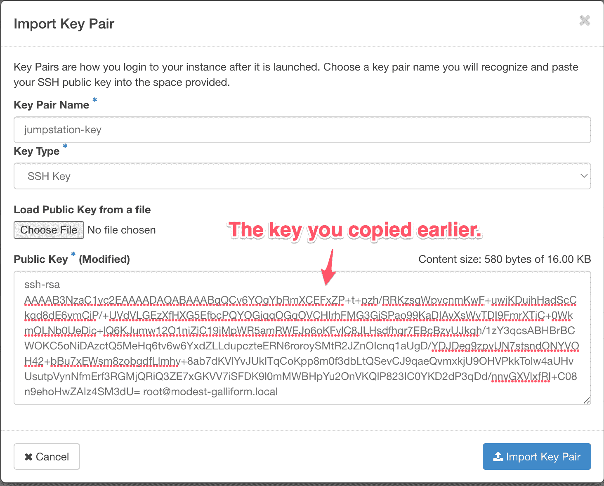

输入以下值:

*   **密钥对名称**:为 SSH 公钥设置一个名称。这个示例公钥被称为`jumpstation-key`，但是它实际上可以是您喜欢的任何东西。
*   **键类型**:这个例子使用了一个 **SSH 键**键类型。
*   **公钥**:粘贴刚刚复制的公钥。

点击**导入密钥对**。

一旦公钥被导入，通过按**启动实例**来创建实例。(其他选项卡超出了本演示的范围。)

实例经历一个构建过程。请等待几分钟。完成后，该实例出现在**实例列表**页面中。

### 分配和附加浮动 IP

先前创建的实例与专用网络相关联。目前，访问这个实例的唯一方法是通过云的硬件节点连接到它。另一种连接方式是使用浮动 IP。在本节中，我们将演示如何分配一个浮动 IP 并将其附加到该实例。

要分配浮动 IP，首先导航到**项目- >网络- >浮动 IP**。然后点击**分配 IP 给项目**。

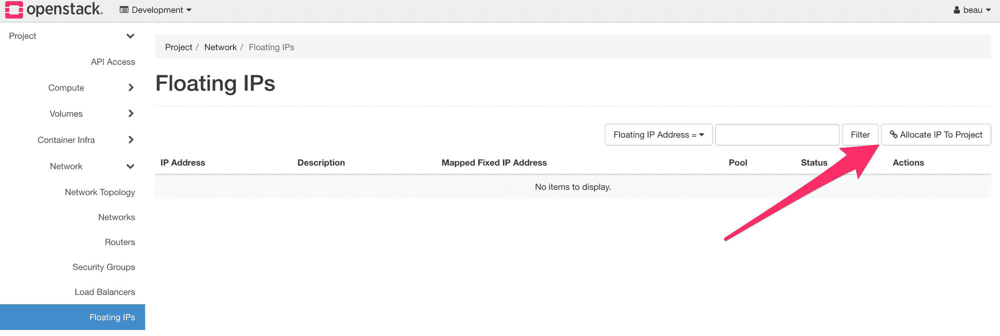

Floating IPs tab.

在弹出窗口中，确保将**池**设置为**外部**(并可选择添加描述)，然后点击**分配 IP** 以添加此浮动 IP 地址供使用。


在同一部分中，通过单击最右侧的**关联**按钮，将 IP 分配给 Jumpstation 实例。

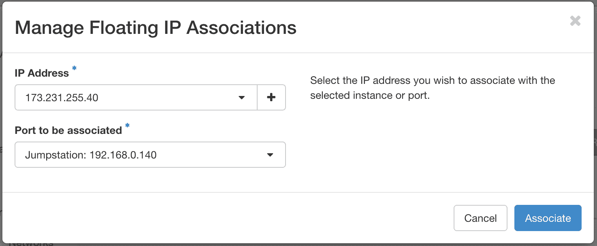

填写详细信息:

*   **IP 地址**:这个字段是预先选择的浮动 IP，所以这里不需要做任何改变。
*   **关联端口**:选择之前创建的实例。在这种情况下，我们使用 Jumpstation 实例。

点击**关联**。现在可以通过 SSH 从云的第一个硬件节点访问这个实例。

要登录到此实例，在登录到硬件节点后，运行以下命令[您必须将 IP 地址更改为您刚刚关联的地址]:

`ssh -i /root/.ssh/id_rsa centos@173.231.255.40`

在您的终端中应该是这样的:

```
[root@modest-galliform ~]# ssh -i /root/.ssh/id_rsa centos@173.231.255.40
The authenticity of host '173.231.255.40 (173.231.255.40)' can't be established.
ECDSA key fingerprint is SHA256:z45zzE8fPuKagtyrSGP9AWR4vIVpBppoaqkqj1Kx4SA.
Are you sure you want to continue connecting (yes/no/[fingerprint])? yes
Warning: Permanently added '173.231.255.40' (ECDSA) to the list of known hosts.
Enter passphrase for key '/root/.ssh/id_rsa': 
Activate the web console with: systemctl enable --now cockpit.socket

[centos@jumpstation ~]$ 
```

在下一部分中，您必须在登录到该机器时执行一些操作。

### 如何安装和使用 OpenStack 的 CLI

到目前为止，我们一直在学习如何通过 web 浏览器管理 OpenStack。但是也可以通过命令行使用 OpenStack 的 CLI OpenStack client 进行管理。

使用命令行管理您的云在自动化任务中引入了更多的灵活性，并且通常可以简化管理员的工作。让我们学习如何。

我们现在将 OpenStackClient 安装到我们刚刚创建的名为 Jumpstation 的实例上。

在安装 OpenStackClient 之前，您必须从 Horizon 获得两个文件，这是准备 shell 环境所必需的。这两个文件是`clouds.yaml`和 OpenStack RC 文件。

*   `clouds.yaml`:用作如何连接到云的配置源
*   OpenStack RC 文件:用作用户和项目的身份验证源


要收集这些文件，请以您的用户身份登录 Horizon。导航到**项目- > API 访问。**然后点击**下载 OpenStack RC 文件**，将 OpenStack `clouds.yaml`和`OpenStack RC`文件下载到你的机器上。这些文件与当前用户以及该用户所在的项目相关联。

#### 准备并安装 OpenStackClient

接下来，使用 SSH 登录到之前创建的实例。如果您一直在跟进，那么这个实例只能从您的一个控制平面节点访问。使用最近给出的说明登录到实例。

下面是登录后准备和安装 OpenStackClient 的步骤。

**第一步**:准备`clouds.yaml`和 OpenStack RC 文件

在这种情况下，必须准备先前获得的`clouds.yaml`文件。对于本演示，我们将把它保存到`~/.config/openstack/clouds.yaml`。我们必须复制从 Horizon 下载到我们机器上的`clouds.yaml`的内容，并将其存储为`~/.config/openstack/clouds.yaml`。

下面是如何创建目录，然后编辑文件。在命令行上运行`$`之后的命令。

```
# Create the following directory
$ mkdir -p ~/.config/openstack

# Create and open the clouds.yaml to edit
$ vi ~/.config/openstack/clouds.yaml 
```

要将本地计算机上的`clouds.yaml`中的内容放入实例中，首先必须在文本编辑器中打开本地版本。然后，您必须复制所有文本，然后将其粘贴到您刚刚在实例上创建的版本中。

将文件的文本粘贴到终端的 vi 编辑器中后，使用命令`:wq`保存并退出编辑器。

`clouds.yaml`文件实际上可以放在几个位置。更多信息请参见 OpenStack Victoria 文档的[配置文件](https://docs.openstack.org/python-openstackclient/victoria/configuration/index.html#configuration-files)标题。

接下来，将 OpenStack RC 文件的内容从本地机器复制到实例中。该文件可以放在任何地方，因此在本例中，我们将把它存储在用户的主目录中。完整路径将是`~/Development-openrc.sh`。

使用以下命令创建并开始编辑文件(在复制和粘贴命令时不要使用`$`)。

```
$ vi ~/Development-openrc.sh 
```

就像之前一样，您必须打开文件的本地版本，复制所有文本，然后将其粘贴到在您的终端中打开的文件的实例版本中。然后，使用命令`:wq`保存并退出编辑器。

现在你必须运行这个文件。首先更改权限:

`$ chmod +x Development-openrc.sh`

然后，运行该文件:

`$ ./Development-openrc.sh`

您必须输入您的 OpenStack 密码。

然后运行命令:

`$ source Development-openrc.sh`

**第二步**:创建一个 Python 虚拟环境

我们将创建一个虚拟环境，这样我们就不会干扰系统的 Python 版本。

在默认的 CentOS 8 Stream 安装中，系统的 Python 可执行文件是`/usr/libexec/platform-python`，它将用于创建虚拟环境。

使用`/usr/libexec/platform-python -m venv ~/venv`在路径`~/venv`中创建一个虚拟环境。

例如:

```
$ /usr/libexec/platform-python -m venv ~/venv 
```

**第三步**:激活 Python 虚拟环境

使用`source ~/venv/bin/activate`激活虚拟环境。

例如:

```
$ source ~/venv/bin/activate 
```

激活虚拟环境后，它的名称将出现在命令行的开头。所以它看起来会像这样:

```
[centos@jumpstation ~]$ /usr/libexec/platform-python -m venv ~/venv
[centos@jumpstation ~]$ source ~/venv/bin/activate
(venv) [centos@jumpstation ~]$ 
```

**第四步**:升级`pip`

在安装 OpenStackClient 之前，为了有助于顺利安装，请升级`pip`。使用`pip install --upgrade pip`升级`pip`。

例如:

```
$ pip install --upgrade pip 
```

**第五步**:安装 OpenStackClient

一切准备就绪，就可以安装 OpenStackClient 了。

**注意！**–有两个 OpenStackClient 包:`python-openstackclient`和`openstackclient`。我推荐使用`python-openstackclient`,因为它比以前的包维护得更频繁。

使用以下命令安装 OpenStackClient:

```
$ pip install python-openstackclient 
```

**步骤 6** :列出与您的项目相关的服务器

对于初始命令，通过运行`openstack server list`列出与您的项目相关联的服务器。

例如:

```
(venv) [centos@jumpstation ~]$ openstack server list
+--------------------------------------+-------------+--------+---------------------------------------+--------------------------+----------+
| ID                                   | Name        | Status | Networks                              | Image                    | Flavor   |
+--------------------------------------+-------------+--------+---------------------------------------+--------------------------+----------+
| 412fc87f-a4d9-40f1-ba07-fe3eee216c38 | Jumpstation | ACTIVE | Private=173.231.255.40, 192.168.0.140 | N/A (booted from volume) | m1.small |
+--------------------------------------+-------------+--------+---------------------------------------+--------------------------+----------+
```

在这里，我们可以看到之前创建的服务器。

## 指令结构

当使用 OpenStackClient 时，对于您想要完成的任务，通常有一个通用的命令模式。所有的`openstack`命令都以`openstack`开头。你可以单独执行`openstack`进入 shell，在 shell 中命令不再需要以`openstack`为前缀:

```
(venv) [centos@jumpstation ~]# openstack
(openstack) 
```

### 列出所有可用的子命令

使用`openstack --help`列出所有可用的子命令。您最初会看到可以传递的所有标志，但是滚动一点后，子命令列表会开始:

```
Commands:
  access rule delete  Delete access rule(s)
  access rule list  List access rules
  access rule show  Display access rule details
  access token create  Create an access token
  acl delete  Delete ACLs for a secret or container as identified by its href. (py
thon-barbicanclient)
[...output truncated...] 
```

### 了解有关子命令的更多信息

看到可用命令后，使用`openstack help <command>`了解更多关于命令的信息。

例如，要了解更多关于`openstack server`命令的信息，请使用`openstack help server`:

```
$ openstack help server
Command "server" matches:
  server add fixed ip
  server add floating ip
  server add network
  server add port
  server add security group
[...output truncated...] 
```

### 列出项目并显示详细信息

使用 OpenStackClient 列出项目时非常常见，命令形式通常是`openstack <subcommand> list`。例如，`openstack server list`，列出当前配置项目的所有服务器。

此外，通常通过运行`openstack <subcommand> show <item>`可以找到关于一个项目的更多信息。例如，`openstack server show Jumpstation`显示了名为 **Jumpstation** 的实例的详细信息。

## 私有云的部署方式

现在，我们将进一步了解您的私有云是如何部署的，并进一步了解环境。OpenStack 可以通过多种不同方式进行部署，本节重点介绍您的私有云的特征。我们还解释了这种部署的一些优势以及 OpenMetal 独有的领域。

在 OpenMetal 中，OpenStack 通过 Docker 使用 Kolla Ansible 进行容器化。这是通过名为 FM-Deploy 的初始部署容器完成的。FM-Deploy 在您的私有云配置过程中提供初始设置更改。FM-Deploy 容器是私有云当前架构的必要组成部分。FM-Deploy 容器应该继续在您的私有云中运行，因为当您想要在云中添加或删除节点时，我们的系统会使用它。

### OpenStack 的容器化

OpenMetal 使用 Kolla Ansible 为所有正在运行的服务设置 Docker 容器。如果您需要对节点进行任何配置更改，应该使用 Kolla Ansible 来推动这些更改。如果不使用 Kolla Ansible，则在任何系统更新期间，这些更改都有被还原的风险。

通过码头集装箱化的一些优势是:

*   容器创建了一个隔离的环境，减少了软件依赖性
*   容器可以扩展，并允许服务在集群中平衡
*   容器为测试发布、补丁和自动化提供了更大的灵活性
*   容器具有一致的、可重复的部署和较短的初始化时间

### 磁盘存储和 Ceph

在 OpenMetal 中，磁盘存储是通过 Ceph 提供的。Ceph 是一个对象存储接口，可以为单个集群上的多种不同存储类型提供接口。在 OpenMetal 中，Ceph 由两个元素组成:对象存储和块存储。

Ceph **对象存储**利用 Ceph 对象存储网关守护进程(RADOSGW)。通过 OpenMetal 云，Ceph 的 RGW 取代了 Swift，因此 Swift 没有 Docker 容器。相反，Swift 端点直接连接到 RGW。RGW 的认证通过`/etc/ceph/ceph.conf`中的 Keystone 处理。

Ceph **块存储**利用 Ceph 的 RADOS 块设备连接到 Cinder 服务。在您的云中，这些对象存储在 Ceph 池中。Ceph 提供了一个抽象层，允许将对象识别为块。

使用 ceph 的一些优点是:

*   数据可以自我修复，并在出现电源、硬件或连接问题时在整个集群中重新分配数据
*   数据被复制并且高度可用
*   Ceph 能够在商用硬件上运行，并且能够混合不同供应商的硬件

## Ceph 简介

Ceph 是一个开源的分布式存储系统，从单个集群提供对象、块和文件存储接口。

Ceph 被选为私有云核心 OpenStack 云的存储解决方案，因为它能够以复制的方式存储数据。存储在 Ceph 集群中的数据可以从任何云的控制平面节点访问。存储被认为是跨所有节点共享的，这使得恢复实例及其数据变得微不足道。

让我们学习如何使用命令行检查 Ceph 集群的状态并查看可用磁盘的使用情况。

### 检查 Ceph 状态

首先，确保您登录到云的一个控制平面节点(不是一个实例)。要检查 Ceph 集群的状态，请使用`ceph status`。

例如:

```
[root@modest-galliform ~]# ceph status
  cluster:
    id:     ac5c03ba-fcb8-4963-b235-e9020b5bfcc2
    health: HEALTH_OK

  services:
    mon: 3 daemons, quorum modest-galliform,gifted-badger,hopeful-guineafowl (age 7d)
    mgr: hopeful-guineafowl(active, since 7d), standbys: modest-galliform, gifted-badger
    osd: 3 osds: 3 up (since 7d), 3 in (since 7d)
    rgw: 3 daemons active (gifted-badger.rgw0, hopeful-guineafowl.rgw0, modest-galliform.rgw0)

  task status:

  data:
    pools:   12 pools, 329 pgs
    objects: 2.06k objects, 9.4 GiB
    usage:   31 GiB used, 2.6 TiB / 2.6 TiB avail
    pgs:     329 active+clean

  io:
    client:   2.2 KiB/s rd, 2 op/s rd, 0 op/s wr
```

### 检查 Ceph 磁盘使用情况

要检查 Ceph 集群中的可用磁盘空间，请使用`ceph df`。

例如:

```
[root@modest-galliform ~]# ceph df
--- RAW STORAGE ---
CLASS  SIZE     AVAIL    USED    RAW USED  %RAW USED
ssd    2.6 TiB  2.6 TiB  28 GiB    31 GiB       1.15
TOTAL  2.6 TiB  2.6 TiB  28 GiB    31 GiB       1.15

--- POOLS ---
POOL                   ID  PGS  STORED   OBJECTS  USED     %USED  MAX AVAIL
device_health_metrics   1    1  418 KiB        3  1.2 MiB      0    839 GiB
images                  2   32  6.8 GiB      921   20 GiB   0.81    839 GiB
volumes                 3   32  2.4 GiB      662  7.3 GiB   0.29    839 GiB
vms                     4   32  4.2 KiB        6   48 KiB      0    839 GiB
backups                 5   32      0 B        0      0 B      0    839 GiB
metrics                 6   32  2.1 MiB      242  8.4 MiB      0    839 GiB
manila_data             7   32      0 B        0      0 B      0    839 GiB
manila_metadata         8   32      0 B        0      0 B      0    839 GiB
.rgw.root               9   32  2.4 KiB        6   72 KiB      0    839 GiB
default.rgw.log        10   32  3.4 KiB      207  384 KiB      0    839 GiB
default.rgw.control    11   32      0 B        8      0 B      0    839 GiB
default.rgw.meta       12    8      0 B        0      0 B      0    839 GiB 
```

## 维护 OpenStack 软件更新

OpenStack 生态系统中的软件会随着时间的推移而发展，要么通过添加新功能、修复错误，要么通过修补漏洞。运营 OpenStack 云的一部分包括通过更新来维护其软件。在本节中，我们指出了 OpenMetal 云中发生软件更新的部分，并解释了执行更新时的最佳实践。

可以更新的 OpenMetal 云的软件包括每个硬件节点的包管理器和 Kolla Ansible Docker 映像。Ceph 更新是通过节点的包管理器处理的。

现在我们将具体介绍执行软件包管理器更新的步骤。

1.  **迁移工作负载**

需要服务器重启到 OpenMetal 控制平面节点的软件包管理器更新可能会中断其上运行的任何工作负载。在执行中断操作之前，可以将实例迁移到另一个运行计算服务的节点。有关如何迁移实例的信息，请参见 OpenStack Nova 的[文档](https://docs.openstack.org/nova/latest/admin/live-migration-usage.html)。

**2。一次更新一个节点**

执行程序包管理器更新时，请确保在更新一个硬件节点之前，先成功更新另一个节点。

**3。禁用 Docker**

在更新软件包管理器之前，请确保 SystemD 中的 Docker 套接字和服务已停止并禁用。例如:

```
systemctl disable docker.socket
systemctl stop docker.socket
systemctl disable docker.service
systemctl stop docker.service 
```

**4。升级主机操作系统包**

验证 Docker 套接字和服务已停止后，执行软件包管理器更新。：

```
dnf upgrade 
```

**5。确定重启需求**

软件包管理器完成后，使用 dnf-utils `needs-restarting`和重启提示标志(-r)检查是否需要重启:

```
$ needs-restarting -r
Core libraries or services have been updated since boot-up:
  * kernel
  * systemd
Reboot is required to fully utilize these updates.
More information: https://access.redhat.com/solutions/27943
$ 
```

**6。Ceph 维护**

*该步骤是可选的，仅当节点需要重启时才需要。*

在重新启动之前，如果该节点是 Ceph 群集的一部分，自动 OSD 删除和数据重新平衡应暂时挂起。为此，请执行:

```
ceph osd set noout
ceph osd set norebalance 
```

这将减少重建时间，并有助于确保节点自动重新加入群集
。

一旦节点重新启动并且确认了一个健康的 Ceph 集群，就必须取消设置这些参数。要取消设置此配置，请执行以下操作:

```
ceph osd unset noout
ceph osd unset norebalance 
```

### 如果需要，重新启动

如果需要，重新启动节点:

```
shutdown -r now 
```

您可能需要等待一两分钟才能重新登录到控制计划节点。

### 验证成功重启

当节点重新联机时，使用 SSH 验证 OpenStack Docker 容器是否已经启动。此外，如果此节点是 Ceph 群集的一部分，请检查 Ceph 的群集状态。

要验证 Docker 容器是否已经启动，请使用`docker ps`。您应该会看到许多 Docker 容器正在运行。在**状态**栏下，每个集装箱应反映状态`Up`。

例如:

```
[root@modest-galliform ~]# docker ps
CONTAINER ID   IMAGE                                                                        COMMAND                  CREATED        STATUS                          PORTS     NAMES
6f7590bc2191   harbor.imhadmin.net/kolla/centos-binary-telegraf:victoria                    "dumb-init --single-…"   20 hours ago   Restarting (1) 14 seconds ago             telegraf
67a4d47e8c78   harbor.imhadmin.net/kolla/centos-binary-watcher-api:victoria                 "dumb-init --single-…"   3 days ago     Up 6 minutes                              watcher_api
af815b1dcb5d   harbor.imhadmin.net/kolla/centos-binary-watcher-engine:victoria              "dumb-init --single-…"   3 days ago     Up 6 minutes                              watcher_engine
a52ab61933ac   harbor.imhadmin.net/kolla/centos-binary-watcher-applier:victoria             "dumb-init --single-…"   3 days ago     Up 6 minutes                              watcher_applier
[...output truncated...] 
```

接下来，如果这个节点是 Ceph 集群的一部分，使用`ceph status`检查 Ceph 的状态。

例如:

```
[root@modest-galliform ~]# ceph status
  cluster:
    id:     06bf4555-7c0c-4b96-a3b7-502bf8f6f213
    health: HEALTH_OK
[...output truncated...] 
```

上面的输出显示状态为`HEALTH_OK`，表明 Ceph 集群是健康的。Ceph 天生具有弹性，应该可以从重新启动的节点中恢复。

# 查看您的私有云资源使用情况

现在，我们来看看如何找到您的私有云的资源使用情况。我们将探讨如何利用 Horizon Dashboard 来确定项目的总内存和计算使用情况，以及如何查看存储在每个节点上的实例。接下来，我们将通过解释如何使用命令行与您的云的 Ceph 集群进行简单的交互来查看磁盘使用情况。最后，我们将讨论在 Ceph 集群中添加和删除节点。

目前私有云部署有三种变体:小型、标准和大型。所有私有云部署都有一个由三台超融合服务器组成的集群，但根据配置和硬件，内存、存储和 CPU 处理能力的分配会有所不同。此外，您可以选择向群集中添加额外的硬件节点。

### 在 Horizon 中查看内存和计算使用情况

要查看您的云使用的资源，您必须是管理员用户并被分配到管理项目。进入管理项目后，导航至**管理- >计算- >管理程序**。本节列出了以下项目:

*   cpu 使用率
*   内存使用
*   本地磁盘使用情况

### 跨集群查看实例状态

还有一个选项可以查看实例在集群中的位置。要查看此信息，请导航至**管理- >计算- >实例**。您可以选择查看项目、主机、IP 地址和状态。


Summary of Instances.

### 如何从 Ceph 访问资源信息

要访问关于 Ceph 集群的资源池的信息，您需要使用 Ceph 的 CLI。这些是一些有用的资源监控和健康命令的摘要。

*   `ceph -s`检查 Ceph 的状态
*   `ceph df`列出磁盘使用概述
*   `ceph health detail`提供现有健康问题的详细信息
*   `ceph osd pool ls`要列出池，请添加`detail`以了解有关复制和运行状况指标的更多详细信息

## 创建和恢复卷备份

借助私有云，您能够创建卷数据的备份和快照。如果卷中的数据损坏或被错误删除，拥有该数据的副本将是无价之宝。现在，我们将了解如何使用 Horizon 创建和恢复卷备份。

首先，我们来复习一下什么是卷。卷是附加到实例以实现持久存储的块存储设备。您可以随时将卷附加到正在运行的实例，或者分离卷并将其附加到另一个实例。您也可以从卷创建快照或删除卷。

### 创建卷备份

在展望期导航至项目->卷->卷。


Volumes List

从下拉菜单**创建备份**中选择，创建您的卷的备份。


Access Create Volume Backup Form

您需要填写以下字段。

*   **备份名称**:指定卷备份的名称
*   **描述**:必要时提供描述
*   **容器名**:留空，否则无法创建卷备份。Horizon 告诉您，如果该字段为空，备份将存储在名为`volumebackups`的容器中，但我们的配置并非如此。对于私有云，以这种方式创建的所有卷备份都存储在名为`backups`的 Ceph 池中。
*   **备份快照**:如果适用，指定从中创建备份的快照

提交表单后，您将导航到**项目- >卷- >卷备份**，在这里您可以看到您刚刚创建备份的卷。


Volume Backup List

### 测试卷备份

创建重要数据的备份副本只是可靠的备份和恢复计划的一部分。此外，考虑测试备份的数据，以确保如果发生意外情况，恢复备份实际上是有用的。要测试卷备份，您可以在 OpenStack 中还原原始卷旁边的卷备份，并比较其内容。

### 恢复卷备份

要恢复卷备份，请在 Horizon 中导航至**项目- >卷- >卷备份**。

接下来，找到您希望恢复的卷备份，并从右侧的下拉列表中选择**恢复备份**。


Restore Volume Backup

选择要还原到的卷，或者让系统将备份还原到新卷。

### Ceph、卷和数据持久性

当创建卷备份时，它们存储在云的 Ceph 集群中一个名为 backups 的池中。默认情况下，Ceph 集群配置了跨云的三个控制平面节点的主机级复制。使用这种配置，您的云可能会丢失除一个 Ceph 节点之外的所有节点，但仍然保留集群的所有数据。

## 结论

现在，您应该对 OpenStack 有了基本的了解，并且知道了一些可以用它做的事情。祝你建立自己的 OpenStack 系统好运。