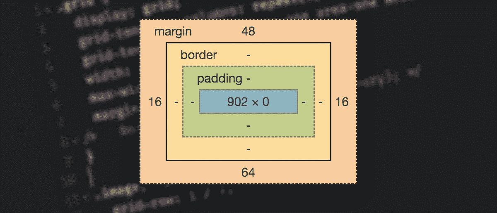

# CSS 边距与填充–有什么区别？[已解决]

> 原文：<https://www.freecodecamp.org/news/css-margin-vs-padding-what-is-the-difference/>

就 CSS 而言，有很多属性可以控制页面上元素的间距。两个最常见的属性是边距和填充。

边距和填充都控制元素周围的空间量，但它们以不同的方式实现。



This image comes from Kevin Powell's excellent freeCodeCamp tutorial on [the CSS Margins](https://www.freecodecamp.org/news/css-margins/).

边距是元素外部的空间。它是一个元素和它周围的元素之间的空间。

如果希望某个元素与其他元素相距较远，请增加 margin 属性。

填充是元素内部的空间。它是元素与其内容之间的空间。

### CSS 中的边距示例

下面是你如何在 CSS 中给一个元素一个边距:

```
.element {

  margin: 10px;

} 
```

### HTML 中的边距示例

下面是如何在 HTML 中使用内嵌来设置元素的样式，使其有一个边距。(请记住，在大多数情况下，这被视为一种懒惰的做法。)

```
<div style="margin-top:100px;">This is some text.</div>
```

### CSS 中的填充示例

下面是如何在 CSS 中填充元素:

```
.element {

  padding: 10px;

} 
```

当然，您也可以用 HTML 中的内嵌样式来做到这一点:

```
<div style="padding-top:20px;">This is some text.</div>
```

### 就是这样。继续前进，为你的元素设计风格。

我希望这对你有所帮助。如果你想学习更多的编程和技术知识，可以试试 [freeCodeCamp 的核心编码课程](https://www.freecodecamp.org/learn)。它是免费的。