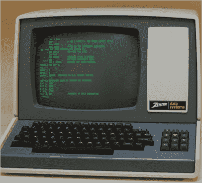
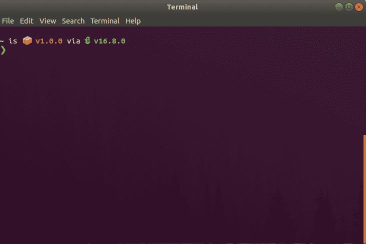
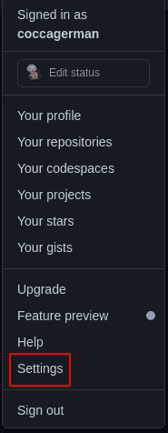
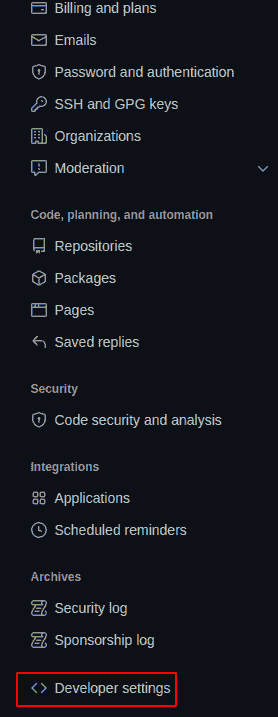
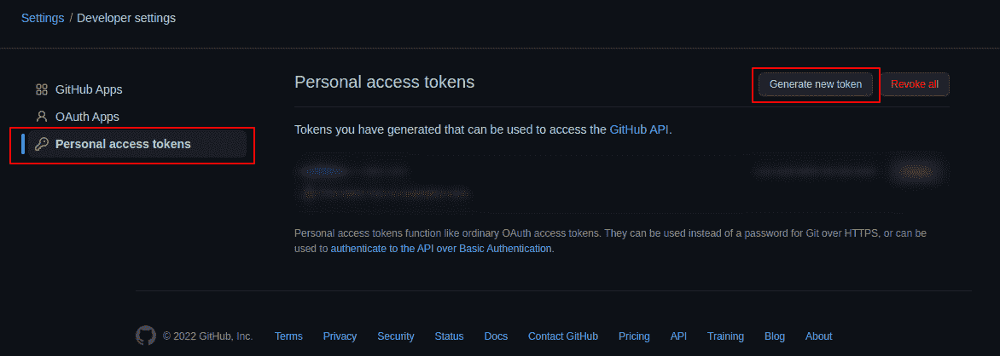

# 新手命令行——如何像专业人士一样使用终端[完整手册]

> 原文：<https://www.freecodecamp.org/news/command-line-for-beginners/>

大家好！在本文中，我们将仔细研究命令行(也称为 CLI、控制台、终端或 shell)。

命令行是我们作为开发人员和一般计算机用户拥有的最有用和最有效的工具之一。但是当你开始使用它的时候，你可能会觉得有点不知所措和复杂。

在本文中，我将尽力简单地解释命令行界面的组成部分，以及它的基本工作原理，这样您就可以开始在日常工作中使用它了。

我们走吧！=D

## 目录

*   [控制台、终端、命令行(CLI)和 Shell 的区别](#differencebetweenconsolecommandlinecliterminalandshell)
    *   [控制台](#console)
    *   [终端](#terminal)
    *   [外壳](#shell)
    *   [命令行(CLI)](#commandlineorclicommandlineinterface)
*   我为什么要关心终端的使用呢？
*   [不同种类的炮弹](#differentkindsofshells)
    *   [一点历史- Posix](#abitofhistoryposix)
    *   我如何知道我运行的是什么 shell？
    *   [什么壳比较好？](#whatshellisbetter)
        *   [关于定制的评论](#acommentaboutcustomization)
*   [最常用和最有用的命令](#mostcommonandusefulcommandstouse)
    *   [Git 命令](#gitcommands)
*   [我们的第一个剧本](#ourfirstscript)
*   [四舍五入](#roundup)

# 控制台、命令行(CLI)、终端和 Shell 之间的区别

我认为一个好的起点是确切地知道命令行是什么。

提到这一点时，您可能听说过终端、控制台、命令行、CLI 和 shell 等术语。人们经常互换使用这些词，但事实是它们实际上是不同的东西。

区分每一个并不一定是至关重要的知识，但它将有助于澄清事情。所以让我们简单解释一下每一个。

## 控制台:

控制台是让你与电脑互动的物理设备。

说白了，就是你的电脑屏幕、键盘和鼠标。作为用户，你通过控制台与你的电脑互动。



## 终端:

终端是一个文本输入和输出环境。它是一个**程序**，充当**包装器**，允许我们输入计算机处理的命令。

再次用简单的英语来说，它是一个“窗口”,你可以在其中输入你的计算机将要处理的实际命令。



请记住，终端是一个程序，就像任何其他程序一样。和任何程序一样，你可以随心所欲地安装和卸载它。也有可能在你的电脑上安装许多终端，并随时运行你想运行的任何终端。

所有操作系统都安装了默认的终端，但是有许多选项可供选择，每个选项都有自己的功能和特性。

## 外壳:

shell 是一个充当命令行解释器的**程序**。它**处理命令**，**输出结果**。它解释和处理用户输入的命令。

与终端一样，shell 是所有操作系统默认自带的程序，但也可以由用户安装和卸载。

不同的 shells 也有不同的语法和特性。也可以在您的计算机上安装许多 shellss，并随时运行每个 shell。

在大多数 Linux 和 Mac 操作系统中，默认的 shell 是 Bash。而在 Windows 上是 Powershell。其他一些常见的贝壳例子有 Zsh 和 Fish。

Shells 也可以作为编程语言来工作，用它们我们可以构建 T2 脚本来让我们的计算机执行特定的任务。脚本只不过是一系列的指令(命令),我们可以将它们保存在文件中，然后随时执行。

我们将在本文的后面看一下脚本。现在请记住，shell 是您的计算机用来“理解”和执行您的命令的程序，您也可以用它来编写任务。

还要记住，终端是 shell 将要运行的程序。但是两个程序都是独立的。这意味着，我可以在任何终端上运行任何 shell。从这个意义上说，两个程序之间没有依赖关系。

## 命令行或 CLI(命令行界面):

CLI 是我们输入命令供计算机处理的界面。再一次用简单的英语来说，它是你输入计算机将要处理的命令的地方。


这实际上与终端相同，在我看来，这些术语可以互换使用。

这里要提到的一件有趣的事情是，大多数操作系统都有两种不同类型的界面:

*   **CLI** ，它将命令作为输入，以便计算机执行任务。
*   另一个是 **GUI** (图形用户界面)，用户可以在屏幕上看到东西并点击它们，计算机将通过执行相应的任务来响应这些事件。

# 我为什么要关心终端的使用呢？

我们刚刚提到大多数操作系统都有 GUI。因此，如果我们可以在屏幕上看到东西，并点击周围做我们想做的任何事情，你可能会想为什么要学习这种复杂的终端/cli/shell 的东西？

第一个原因是，对于许多任务来说，它只是**更高效**。我们一会儿会看到一些例子，但是有很多任务的 GUI 需要在不同的窗口中多次点击。但是在 CLI 上，这些任务可以通过一个命令来执行。

从这个意义上说，熟悉命令行将帮助您节省时间，并且能够更快地执行任务。

第二个原因是，通过使用命令，你可以很容易地**自动化任务**。如前所述，我们可以用 shell 构建脚本，然后随时执行这些脚本。这在处理我们不想反复做的重复性任务时非常有用。

举几个例子，我们可以构建一个脚本，为我们创建一个新的在线回购，或者为我们在云提供商上创建一个特定的基础设施，或者执行一个更简单的任务，比如每小时更换一次屏幕壁纸。

编写脚本是节省重复任务时间的好方法。

第三个原因是，有时 CLI 将是我们能够与计算机交互的唯一方式。举个例子，当你需要与云平台服务器交互时。在大多数情况下，您没有可用的 GUI，只有一个 CLI 来运行命令。

因此，熟悉命令行界面将允许你在所有场合与计算机进行交互。

最后一个原因是它看起来很酷，很有趣。你没看到电影黑客在他们的电脑周围点击，对吗？；)

# 不同种类的贝壳

在深入研究您可以在终端中运行的实际命令之前，我认为识别不同类型的 shell 以及如何识别您当前运行的 shell 是非常重要的。

不同的 shell 具有不同的语法和不同的特性，所以要确切地知道输入什么命令，您首先需要知道您正在运行什么 shell。

## 一段历史——Posix

对于 shells，有一个通用的标准叫做**[【Posix】](https://en.wikipedia.org/wiki/POSIX)**。

Posix 为 shells 工作的方式与 ECMAScript 为 JavaScript 工作的方式非常相似。这是一个标准，规定了所有 shells 都应该遵守的某些特性和功能。

这个标准是在 20 世纪 80 年代建立的，并且大多数当前的炮弹是根据该标准开发的。这就是为什么大多数 shells 共享相似的语法和相似的特性。

## 我如何知道我运行的是什么 shell？

要知道您当前运行的是什么 shell，只需打开您的终端并输入`echo $0`。这将打印当前运行的程序名，在本例中是实际的 shell。


## 什么壳比较好？

大部分贝壳没太大区别。因为它们中的大多数都遵循相同的标准，所以您会发现它们中的大多数都以相似的方式工作。

不过，您可能想知道一些细微的区别:

*   如前所述， **Bash** 是使用最广泛的，默认安装在 Mac 和 Linux 上。
*   Zsh 非常类似于 Bash，但是它是在 Bash 之后创建的，并且对 Bash 做了一些很好的改进。如果你想更详细地了解它的不同，[这里有一篇关于它的很酷的文章](https://linuxhint.com/differences_between_bash_zsh/#:~:text=It%20has%20many%20features%20like,by%20default%20with%20Linux%20distribution.)。
*   Fish 是另一个常用的 shell，它有一些不错的内置特性和配置，比如自动补全和语法高亮。关于 Fish 的事情是它不是 Posix 的抱怨，而 Bash 和 Zsh 是。这意味着您能够在 Bash 和 Zsh 上运行的一些命令不能在 Fish 上运行，反之亦然。与 Bash 和 Zsh 相比，这使得 Fish 脚本与大多数计算机的兼容性较差。
*   还有其他类似于 **Ash** 或 **Dash** 的外壳(我知道，命名只会让一切更加混乱...)是 Posix shells 的精简版本。这意味着它们只提供 Posix 中需要的特性，其他什么都不提供。而 Bash 和 Zsh **添加了比 Posix 所需更多的特性**。

shells 添加了更多的特性，这使得它们更容易、更友好地交互，但是执行脚本和命令时会更慢。

因此，一种常见的做法是使用 Bash 或 Zsh 这样的“增强”shell 进行一般交互，使用 ash 或 Dash 这样的“剥离”shell 来执行脚本。

当我们稍后开始编写脚本时，我们将看到如何定义哪个 shell 将执行给定的脚本。

如果你对这些贝壳之间的更详细的比较感兴趣，[这里有一个视频很好地解释了这一点](https://www.youtube.com/watch?v=dRdGq8khTJc):

如果必须推荐一个 shell，我会推荐 bash，因为它是最标准和最常用的。这意味着你能够将你的知识应用到大多数环境中。

但是，事实是大多数贝壳之间没有太大的区别。所以无论如何你可以试几个，看看你最喜欢哪一个。；)

### 关于定制的评论

我刚刚提到，Fish 自带自动完成和语法高亮等内置配置。这是 Fish 内置特性，但是在 Bash 或 Zsh 中，您也可以配置这些特性。

关键是外壳是可定制的。您可以编辑程序的工作方式、可用的命令、提示显示的信息等等。

我们不会在这里看到定制选项的细节，但是知道当你在你的计算机上安装一个 shell 的时候，某些文件会在你的系统上被创建。稍后，您可以编辑这些文件来定制您的程序。

此外，网上有许多插件可以让你以更简单的方式定制你的外壳。你只需安装它们并获得插件提供的功能。一些例子是 [OhMyZsh](https://ohmyz.sh/) 和[星际飞船](https://starship.rs/)。

这些自定义选项也适用于终端。

因此，您不仅有许多外壳和终端选项可供选择，而且每个外壳和终端都有许多配置选项。

如果你刚开始，所有这些信息会让你感到有点不知所措。但是要知道有很多选项可用，而且每个选项都可以定制。就是这样。

# 最常用和最有用的命令

现在我们已经对 CLI 的工作原理有了一个基本的了解，让我们深入了解一下您可以在日常工作中使用的最有用的命令。

请记住，这些示例将基于我当前的配置(Linux 操作系统上的 Bash)。但是大多数命令应该适用于大多数配置。

*   无论我们传递什么参数，Echo 都会在终端中打印出来。

```
echo Hello freeCodeCamp! // Output: Hello freeCodeCamp! 
```

*   **pwd** 代表打印工作目录，它打印我们当前在计算机中的“位置”或目录。

```
pwd // Output: /home/German 
```

*   ls 显示你当前所在目录的内容。它将向您显示当前目录包含的文件和其他目录。

例如，这里是我最近在做的一个 React 项目目录:

```
ls // Output:
node_modules  package.json  package-lock.json  public  README.md  src 
```

如果你把这个命令传递给 flag 或 parenter`-a`,它也会显示隐藏的文件或目录。像`.git`或`.gitignore`文件

```
ls -a // Output:
.   .env  .gitignore    package.json       public     src
..  .git  node_modules  package-lock.json  README.md 
```

*   cd 是 Change directory 的缩写，它会把你从当前目录带到另一个目录。

在我的主目录上，我可以输入`cd Desktop`，它会把我带到桌面目录。

如果我想转到一个目录，也就是说转到包含当前目录的目录，我可以输入`cd ..`

如果你单独输入`cd`，它会直接带你到你的主目录。

*   mkdir 代表创建目录，它会为你创建一个新的目录。您必须向命令传递目录名参数。

如果我想创建一个名为“Test”的新目录，我可以输入`mkdir test`。

*   **rmdir** 代表删除目录，它就是这么做的。它需要目录名参数，就像`mkdir` : `rmdir test`一样。

*   **触摸**可以在当前目录下创建一个空文件。作为参数，它采用文件名，如`touch test.txt`。

*   **rm** 允许你删除文件，同样的方式`rmdir`允许你删除目录。
    

*   **cp** 允许你复制文件或目录。这个命令有两个参数:第一个是您想要复制的文件或目录，第二个是您的副本的目的地(您想要将您的文件/目录复制到哪里)。

如果我想在同一个目录中复制我的 txt 文件，我可以输入以下内容:

```
cp test.txt testCopy.txt 
```

确保目录不变，至于“目的地”,我输入文件的新名称。

如果我想将文件复制到不同的目录，但保持相同的文件名，我可以输入:

```
cp test.txt ./testFolder/ 
```

如果我想复制到不同的文件夹并更改字段名称，我当然可以输入:

```
cp test.txt ./testFolder/testCopy.txt 
```

*   mv 是 move 的缩写，让我们将文件或目录从一个地方移动到另一个地方。也就是说，在一个新目录中创建它，并在之前的目录中删除它(与您可以通过剪切和粘贴来完成的操作相同)。

同样，这个命令有两个参数，我们要移动的文件或目录和目的地。

```
mv test.txt ./testFolder/ 
```

如果需要，我们也可以在同一个命令中更改文件名:

```
mv test.txt ./testFolder/testCopy.txt 
```

*   **head** 允许您直接从终端查看文件或管道数据的开头。

```
head test.txt // Output:
this is the beginning of my test file 
```

*   尾的工作原理是一样的，但是它会显示文件的结尾。

```
tail test.txt // Output:

this is the end of my test file 
```

*   **- help** 标志可用于大多数命令，它将返回如何使用给定命令的信息。

```
cd --help // output:
cd: cd [-L|[-P [-e]] [-@]] [dir]
Change the shell working directory. 
```

将当前目录更改为 DIR。默认 DIR 是 HOME shell 变量的值。

变量 CDPATH 定义了包含 DIR 的目录的搜索路径。CDPATH 中的可选目录名由冒号`:`分隔。

如果 DIR 以`...`开头，则空目录名与当前目录相同。

*   以类似的方式， **man** 命令将返回关于任何特定命令的信息。

```
 man cp // output:

    CP(1)                            User Commands                           CP(1)

    NAME
           cp - copy files and directories

    SYNOPSIS
           cp [OPTION]... [-T] SOURCE DEST
           cp [OPTION]... SOURCE... DIRECTORY
           cp [OPTION]... -t DIRECTORY SOURCE...

    DESCRIPTION
           Copy SOURCE to DEST, or multiple SOURCE(s) to DIRECTORY.

           Mandatory  arguments  to  long  options are mandatory for short options
           too.

           -a, --archive
                  same as -dR --preserve=all

           --attributes-only
                  don't copy the file data, just the attributes
    ... 
```

你甚至可以输入`man bash`，这将返回一个巨大的手册，里面有关于这个 shell 的所有信息。；)

*   **代码**会打开你默认的代码编辑器。如果您单独输入该命令，它只会打开带有您最近打开的文件/目录的编辑器。

你也可以打开一个给定的文件，把它作为参数:`code test.txt`。

或者通过传递新文件名:`code thisIsAJsFile.js`打开一个新文件。

*   **edit** 将在你默认的命令行文本编辑器上打开文本文件(如果你在 Mac 或 Linux 上，可能是 Nano 或 Vim)。

如果你打开你的文件，然后不能退出你的编辑器，首先看看这个迷因:

```
 
```

然后键入`:q!`并回车。

这个迷因很有趣，因为每个人一开始都很难使用 CLI 文本编辑器，因为大多数操作(如退出编辑器)都是通过键盘快捷键完成的。使用这些编辑器是一个完全不同的话题，所以如果你有兴趣了解更多，可以去寻找教程。；)

*   **ctrl+c** 允许你退出终端正在运行的当前进程。例如，如果你正在用`npx create-react-app`创建一个 react 应用，并想在某个时候取消构建，只需按下 **ctrl+c** ，它就会停止。

*   从终端复制文本可以用 **ctrl+shift+c** 完成，粘贴可以用 **ctrl+shift+v** 完成

*   **清除**将从您的终端中清除所有以前的内容。

*   退出会关闭你的终端(这不是一个命令，但也很酷) **ctrl+alt+t** 会为你打开一个新的终端。

*   通过按下**向上和向下键**，您可以浏览之前输入的命令。

*   点击**标签**，你将获得基于你目前所写文本的自动完成功能。通过点击两次**标签**，你将获得基于你目前所写文本的建议。

例如，如果我写两次`edit test`和**标签**，我会得到`testFolder/ test.txt`。如果我写下`edit test.`并点击**标签**，我的文本自动完成到`edit test.txt`

## Git 命令

除了处理文件系统和安装/卸载之外，与 Git 和在线 repos 交互可能是开发人员使用终端最常见的事情。

从终端完成比点击要高效得多，所以让我们看看最有用的 git 命令。

*   git init 将为您创建一个新的本地存储库。

```
git init // output:
Initialized empty Git repository in /home/German/Desktop/testFolder/.git/ 
```

*   **git add** 将一个或多个文件添加到 staging。您可以通过键入`git add .`详细说明要添加到暂存的特定文件，或者添加所有已更改的文件

*   **git commit** 将您的更改提交到存储库。提交必须始终伴随有`-m`标志和提交消息。

```
git commit -m 'This is a test commit' // output:
[master (root-commit) 6101dfe] This is a test commit
 1 file changed, 0 insertions(+), 0 deletions(-)
 create mode 100644 test.js 
```

*   **git status** 告诉您当前在哪个分支上，以及您是否有要提交的更改。

```
git status  // output:
On branch master
nothing to commit, working tree clean 
```

*   **git clone** 允许您将存储库克隆(复制)到您当前所在的目录中。请记住，您可以克隆远程存储库(在 GitHub、GitLab 等中)和本地存储库(存储在您的计算机中)。

```
git clone https://github.com/coccagerman/MazeGenerator.git // output:
Cloning into 'MazeGenerator'...
remote: Enumerating objects: 15, done.
remote: Counting objects: 100% (15/15), done.
remote: Compressing objects: 100% (15/15), done.
remote: Total 15 (delta 1), reused 11 (delta 0), pack-reused 0
Unpacking objects: 100% (15/15), done. 
```

*   **git remote add origin** 用于详细说明您将用于项目的远程存储库的 URL。如果你想在某个时候改变它，你可以使用命令`git remote set-url origin`来完成。

```
git remote add origin https://github.com/coccagerman/testRepo.git 
```

> 请记住，您需要首先创建您的远程回购，以便获取其 URL。稍后，我们将看到如何通过一个小脚本从命令行实现这一点。；)

*   git remote -v 让您列出当前正在使用的远程存储库。

```
git remote -v // output:
origin	https://github.com/coccagerman/testRepo.git (fetch)
origin	https://github.com/coccagerman/testRepo.git (push) 
```

*   **git push** 将您提交的更改上传到您的远程 repo。

```
git push // output:
Counting objects: 2, done.
Delta compression using up to 8 threads.
Compressing objects: 100% (2/2), done.
Writing objects: 100% (2/2), 266 bytes | 266.00 KiB/s, done.
Total 2 (delta 0), reused 0 (delta 0) 
```

*   **git branch** 列出了你的回购协议上所有可用的分支，并告诉你你目前在哪个分支上。如果你想创建一个新的分支，你只需要像`git branch <branch name>`一样添加新的分支名称作为参数。

```
git branch // output:
* main 
```

*   **git checkout** 将你从一个分支转移到另一个分支。它以你的目的分行作为参数。

```
git checkout newBranch // output:
Switched to branch 'newBranch' 
```

*   **git pull** 从您的远程存储库中获取(下载)代码，并将其与您的本地存储库相结合。当许多开发人员在同一个代码库上工作时，这在团队工作时特别有用。在这种情况下，每个开发人员定期从远程 repo 中提取数据，以便在包含所有其他开发人员所做更改的代码库中工作。

如果您的远程 repo 中有新代码，该命令将返回在拉取中修改的实际文件。如果没有，我们得到`Already up to date`。

```
git pull // output:
Already up to date. 
```

*   git diff 允许你查看你当前所在的分支和另一个分支之间的差异。

```
git diff newBranch // output:
diff --git a/newFileInNewBranch.js b/newFileInNewBranch.js
deleted file mode 100644
index e69de29..0000000 
```

顺便提一下，在比较分支机构或回购之间的差异时，我们通常会使用可视化工具，如 [Meld](https://meldmerge.org/) 。这并不是说你不能在终端中直接可视化它，但是这个工具对于更清晰的可视化来说是很棒的。

*   将你当前所在的分支与另一个分支合并。请记住，这些更改只会合并到您当前所在的分支，而不会合并到另一个分支。

```
git merge newBranch // output:
Updating f15cf51..3a3d62f
Fast-forward
 newFileInNewBranch.js | 0
 1 file changed, 0 insertions(+), 0 deletions(-)
 create mode 100644 newFileInNewBranch.js 
```

*   **git log** 列出了你之前在回购中所做的所有提交。

```
git log // output:
commit 3a3d62fe7cea7c09403c048e971a5172459d0948 (HEAD -> main, tag: TestTag, origin/main, newBranch)
Author: German Cocca <german.cocca@avature.net>
Date:   Fri Apr 1 18:48:20 2022 -0300

    Added new file

commit f15cf515dd3ec398210108dce092debf26ff9e12
Author: German Cocca <german.cocca@avature.net>
    ... 
```

*   **- help** 标志将显示给定命令的信息，与 bash 的工作方式完全相同。

```
git diff --help // output:
GIT-DIFF(1)                       Git Manual                       GIT-DIFF(1)

NAME
       git-diff - Show changes between commits, commit and working tree, etc

SYNOPSIS
       git diff [options] [<commit>] [--] [<path>...]
       git diff [options] --cached [<commit>] [--] [<path>...]
       ... 
```

# 我们的第一个剧本

现在我们已经准备好进入命令行真正有趣和令人敬畏的部分，脚本！

正如我前面提到的，脚本只不过是我们可以在任何给定时间执行的一系列命令或指令。为了解释如何编写代码，我们将使用一个简单的例子，它允许我们通过运行一个命令来创建 github repo。；)

*   首先要做的是创建一个`.sh`文件。你可以把它放在任何你想放的地方。我把我的叫做`newGhRepo.sh`。

*   然后在你选择的文本/代码编辑器中打开它。

*   在我们的第一行，我们将写如下:`#! /bin/sh`

这被称为一个 **shebang** ，它的功能是声明哪个 shell 将要运行这个脚本。

还记得我们之前提到过，我们可以使用一个给定的 shell 进行一般的交互，而使用另一个给定的 shell 来执行脚本吗？shebang 是指示 shell 运行脚本的指令。

如前所述，我们使用一个“精简”的 shell(也称为 sh shells)来运行脚本，因为它们更高效(尽管老实说，这种差异可能不明显，这只是个人偏好)。在我的电脑里，我用 dash 作为我的外壳。

如果我们想让这个脚本和 bash 一起运行，那么 shebang 应该是`#! /bin/bash`

*   我们的下一行将是`repoName=$1`

这里我们声明了一个名为 repoName 的**变量**，并将它赋给脚本接收的第一个参数的值。

一个**参数**是在脚本/命令之后输入的一组字符。像使用`cd`命令一样，我们需要指定一个目录参数来改变目录(即:`cd testFolder`)。

我们在脚本中识别参数的一种方法是使用美元符号和参数的预期顺序。

如果我期望不止一个参数，我可以写:

```
paramOne=$1
paramTwo=$2
paramThree=$3
... 
```

*   因此，我们希望将存储库名称作为脚本的参数。但是如果用户忘记输入会发生什么呢？我们需要为此做好计划，因此接下来我们将编写一个**条件**，它会一直要求用户输入回购名称，直到收到该参数。

我们可以这样做:

```
while [ -z "$repoName" ]
do
   echo 'Provide a repository name'
   read -r -p $'Repository name:' repoName
done 
```

我们在这里做的是:

1.  而 repoName 变量没有赋值(`while [ -z "$repoName" ]`)
2.  将此消息写入控制台(`echo 'Provide a repository name'`)
3.  然后读取用户提供的任何输入，并将输入赋给 repoName 变量(`read -r -p $'Repository name:' repoName`)

*   现在我们已经有了自己的回购名称，我们可以像这样创建我们的本地 Git 回购:

```
echo "# $repoName" >> README.md
git init
git add .
git commit -m "First commit" 
```

这是创建一个 readme 文件，用 repo 名称(`echo "# $repoName" >> README.md`)写一行，然后初始化 git repo 并进行第一次提交。

*   然后是时候把我们的回购上传到 github 了。为此，我们将在下面的命令中利用 [github API](https://docs.github.com/en/rest/reference/repos) :

`curl -u coccagerman https://api.github.com/user/repos -d '{"name": "'"$repoName"'", "private":false}'`

**curl** 是一个使用多种受支持协议之一从服务器传输数据或向服务器传输数据的命令。

接下来，我们使用`-u`标志来声明我们正在为其创建 repo 的用户(`-u coccagerman`)。

接下来是 GitHub API 提供的端点(`https://api.github.com/user/repos`)

最后，我们使用`-d`标志向该命令传递参数。在本例中，我们指明了存储库名称(为此我们使用了我们的`repoName`变量)并将`private`选项设置为`false`，因为我们希望我们的回购是公开的。

API 中有很多其他的配置选项，所以[查看文档](https://docs.github.com/en/rest/reference/repos#create-a-repository-for-the-authenticated-user)了解更多信息。

*   运行这个命令后，GitHub 会提示我们输入我们的**私有令牌**进行认证。

如果你还没有私有令牌，你可以在 GitHub 的**设置>开发者设置>个人访问令牌**中生成







*   太好了，我们快完成了！我们现在需要的是新创建的 GitHub repo 的远程 URL。

为此，我们将再次使用 curl 和 GitHub API，如下所示:

```
GIT_URL=$(curl -H "Accept: application/vnd.github.v3+json" https://api.github.com/repos/coccagerman/"$repoName" | jq -r '.clone_url') 
```

这里我们声明了一个名为`GIT_URL`的变量，并将它赋给下面的命令返回的任何内容。

`-H`标志设置了我们请求的头部。

然后我们传递 GitHub API 端点，它应该包含我们的用户名和 repo 名(`https://api.github.com/repos/coccagerman/"$repoName"`)。

然后我们**通过管道**传递我们请求的返回值。管道只是意味着将一个进程的返回值作为另一个进程的输入值进行传递。我们可以用`<process1> | <process2>`这样的`|`符号来做。

最后，我们运行`jq`命令，这是一个用于处理 JSON 输入的工具。这里我们告诉它获取`.clone_url`的值，根据 GitHub API 提供的数据格式，这是我们的远程 git URL 所在的位置。

*   最后一步，我们将主分支重命名为 main，添加我们刚刚获得的远程源，并将代码推送到 GitHub！=D

```
git branch -M main
git remote add origin $GIT_URL
git push -u origin main 
```

我们的完整脚本应该是这样的:

```
#! /bin/sh
repoName=$1

while [ -z "$repoName" ]
do
    echo 'Provide a repository name'
    read -r -p $'Repository name:' repoName
done

echo "# $repoName" >> README.md
git init
git add .
git commit -m "First commit"

curl -u <yourUserName> https://api.github.com/user/repos -d '{"name": "'"$repoName"'", "private":false}'

GIT_URL=$(curl -H "Accept: application/vnd.github.v3+json" https://api.github.com/repos/<yourUserName>/"$repoName" | jq -r '.clone_url')

git branch -M main
git remote add origin $GIT_URL
git push -u origin main 
```

*   现在是时候测试我们的脚本了！要执行,我们可以做两件事。

一个选项是输入 shell 名称，并将文件作为参数传递，比如:`dash ../ger/code/projects/scripts/newGhRepo.sh`。

另一种是通过运行`chmod u+x ../ger/code/projects/scripts/newGhRepo.sh`使文件**可执行**。

然后你可以通过运行`../ger/code/projects/scripts/newGhRepo.sh`直接执行文件。

就是这样！我们已经准备好了剧本。每当我们需要一个新的回购协议时，我们可以从我们所在的任何目录执行这个脚本。

但是这有一点令人讨厌。我们需要记住脚本目录的确切路径。用一个命令来执行这个脚本不是很酷吗？不管我们在哪个目录下，这个命令总是相同的。

在 come **bash 别名**来解决我们的问题。

别名是 bash 为我们想要运行的命令命名的一种方式。

要创建新的别名，我们需要编辑系统中的 bash 配置文件。这些文件通常位于主目录中。别名可以在不同的文件中定义(主要是`.bashrc`或者`.bash_aliases`)。

我的系统上有一个`.bash_aliases`文件，让我们编辑它。

*   在我们的 CLI 中，我们输入`cd`查看主目录。

*   然后我们可以输入`ls -a`来列出所有文件(包括隐藏的文件),并检查我们的系统中是否有一个`.bashrc`或`.bash_aliases`文件。

*   我们用我们选择的文本/代码编辑器打开文件。

*   我们这样写我们的新别名:
    `alias newghrepo="dash /home/German/Desktop/ger/code/projects/scripts/newGhRepo.sh"`

这里我声明了别名，这是我将要输入的运行脚本的实际命令(`newghrepo`)。

在引号之间，定义别名将要做什么(`"dash /home/German/Desktop/ger/code/projects/scripts/newGhRepo.sh"`)

请注意，我正在传递脚本的[绝对路径](https://www.computerhope.com/issues/ch001708.htm),这样无论我当前的目录是什么，这个命令都一样工作。

如果你不知道你的脚本的绝对路径是什么，在你的终端上进入脚本目录，输入`readlink -f newGhRepo.sh`。这将为您返回完整的路径。；)

*   编辑完成后，我们保存文件，重启终端，瞧！现在我们只需输入`newghrepo`就可以运行我们的脚本，不管我们当前在什么目录下。比打开浏览器点击创建我们的回购要快得多！=D

我希望这能让您对脚本可能带来的优化有所了解。第一次编写、测试和设置脚本时，当然需要做更多的工作。但在那之后，您将再也不必手动执行该任务。；)

# 围捕

当你刚开始的时候，终点站会让你觉得是一个令人生畏的复杂的地方。但是花时间和精力去了解它的来龙去脉肯定是值得的。效率优势太好了，不容错过！

> 如果你有兴趣了解更多关于终端和 Bash 的知识，Zach Gollwitzer 在 youtube 上有一个很棒的速成系列课程。
> 他也有很多关于其他主题的教程，比如 Node 和 Javascript，所以我建议你关注他。；)

一如既往，我希望你喜欢这篇文章，并学到一些新东西。如果你愿意，你也可以在 [linkedin](https://www.linkedin.com/in/germancocca/) 或 [twitter](https://twitter.com/CoccaGerman) 上关注我。

干杯，下期再见！=D

