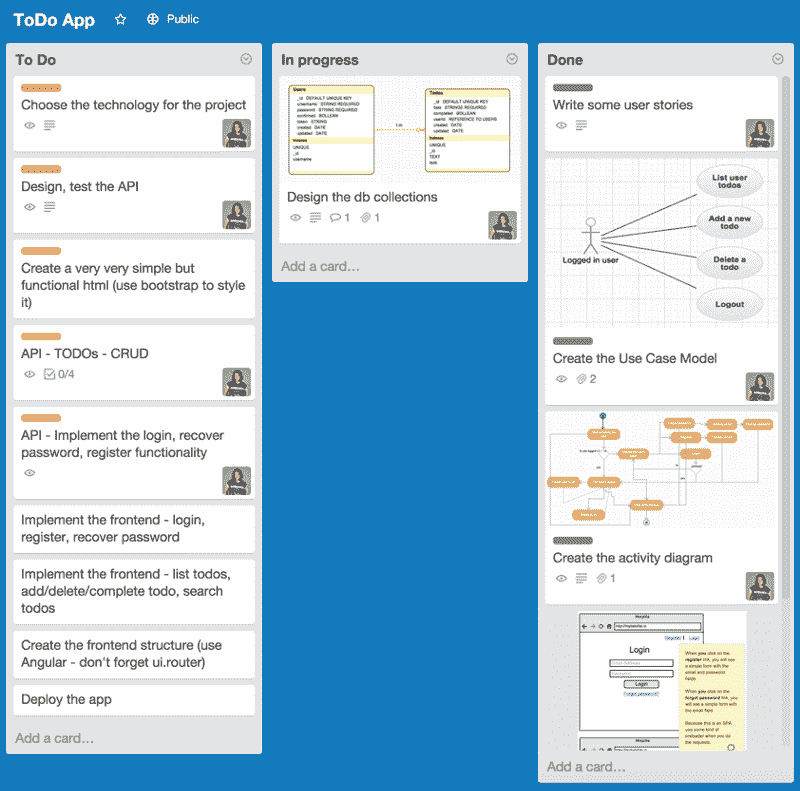
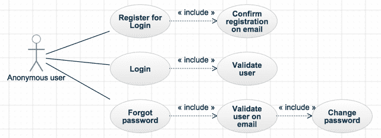
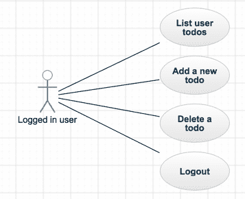
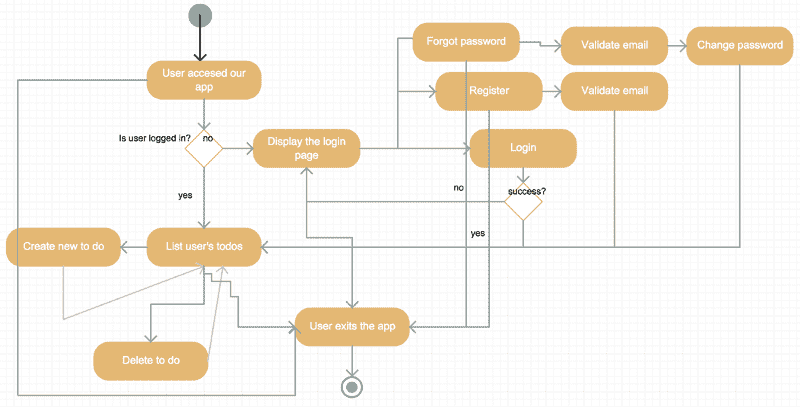
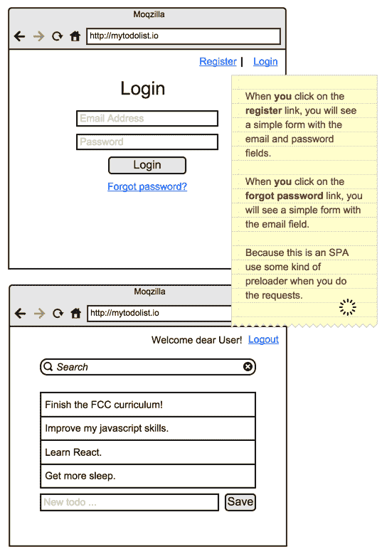
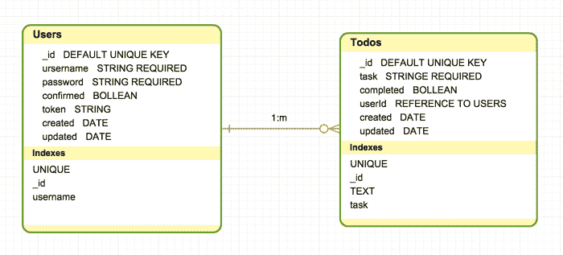
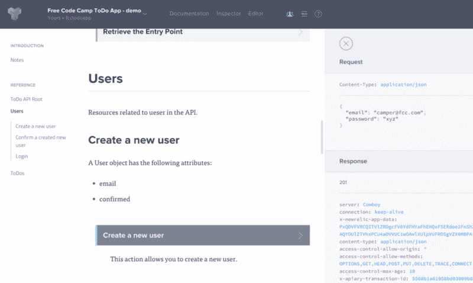

# 更好计划的 10 个步骤，这样你可以写更少的代码

> 原文：<https://www.freecodecamp.org/news/10-steps-to-plan-better-so-you-can-write-less-code-ece655e03608/>

由免费代码营

# 更好计划的 10 个步骤，这样你可以写更少的代码

一盎司的准备抵得上一磅的治疗。医学上是这样，软件开发上肯定也是这样。

这里有一个结构化的 10 步工作流程，它将指导你完成应用程序规划过程，目的是让你避免编写大量不必要的代码。

我们将一起设计一个简单的“待办事项”单页 web 应用程序。我们还将为未来的移动应用计划一个 API 后端。下面是我们在规划这个项目时要采取的步骤:

#### 1)创建我们的 Trello 板

Trello 是一种有趣、免费的方式，可以将你的计划和发展过程分解成可以追踪的小任务。

*   要做的事——还剩下什么要做
*   进行中——人们当前正在处理的任务
*   完成—已完成并准备好进行测试的任务

#### 2)创建我们的敏捷用户故事

以下是一些用户案例。这些将指导我们如何思考我们的应用程序的特性和功能。请注意，它们都遵循类似的结构:作为一个`<person>`我可以`<do something>`。

*   作为登录用户，我可以看到我的待办事项列表。
*   作为登录用户，我可以添加新的待办事项。
*   作为登录用户，我可以删除待办事项(只有我的待办事项，其他用户没有)。
*   作为登录用户，我可以完成一个待办事项(只有我的待办事项—其他用户没有)。
*   作为一名匿名用户，我可以注册一个新帐户，恢复我的密码，或者用现有帐户登录应用程序。

#### 3)创建我们的用例模型

我们的用例模型将可视化我们的用户故事，并为我们如何实现它们添加建议。

#### 4)创建我们的活动图

我们的活动图将展示用户通过我们的应用程序可以选择的不同路径。

*   用户访问我们的待办事项应用程序。
*   如果用户没有登录，她会看到我们的登录页面。
*   如果她已经有一个帐户，她可以登录。
*   如果她有一个帐户，但她忘记了密码，她可以恢复她的密码。
*   如果她没有帐户，她可以创建一个。
*   “创建帐户”和“恢复我的密码”都需要电子邮件验证。用户只有在确认了自己的电子邮件地址后才能登录我们的应用程序。
*   如果她登录，她将看到她的待办事项列表(如果她还没有添加任何待办事项，这可以是空的)。
*   能够看到她的任务列表
*   能够将列表中的任务标记为已完成
*   能够在她的任务列表中进行搜索
*   能够从她的列表中删除任务
*   用户可以随时退出应用程序。

#### 5)创建我们的模型

我们的样机显示我们的应用程序应该是什么样子。在模型上迭代比在工作代码上迭代要快得多。

#### 6)为我们的项目选择正确的技术

因为这是一个单页面应用程序，我们将严重依赖于——或者在这种情况下完全依赖于 JavaScript。让我们使用最流行的 JavaScript 栈之一:[表示](http://meanjs.org/)栈。MEAN stack 的一大好处是它的所有组件都是免费和开源的。还有大量资源可用于学习均值堆栈，以及在不可避免地遇到错误时对其进行调试。

你可以在不到一个小时的时间里，在云中免费建立并运行一个平均栈开发环境。

以下是我们将使用的组件:

1.  我们数据库的 MongoDB
2.  [Node.js](http://nodejs.org/) 和 [Express.js](http://expressjs.com/) 用于实现我们的 API
3.  为我们的客户端应用程序提供 HTML 和 CSS(以及 Bootstrap)
4.  将我们的应用程序连接到 MongoDB

#### 7)设计数据库模式

即使对于我们简单的应用程序，设计一个数据库模式也是值得的。

我们将有两个集合:我们的“Users”集合将存放我们的用户数据，我们的“ToDo”集合将存放我们需要完成的任务。一个用户可以在她的 todo 列表中有零个、一个或多个任务，所以我们的两个集合之间是一对多(1:m)的关系。

#### **8)定义我们的用例**

1.  与删除帐户的用户相关的待办事项会发生什么变化？当用户删除她的帐户时，与该用户相关的待办事项也应该被删除。
2.  如果没有附加到已确认的用户，则不能添加任何待办事项。
3.  todo 只能由其所有者删除。
4.  不能添加用户名或密码为空的用户。
5.  空任务不能添加待办事项。

要记住的事情:

1.  当用户删除帐户时，使用 Mongoose 中间件删除依赖文档，如 todos。
2.  在模型上使用 Mongoose 验证规则来防止空字段被添加到我们的数据库中。

#### 9)设计和测试我们的 API

我建议你创建一个帐户，并开始玩它。如果您将您的 [GitHub](http://github.com/) 帐户与 Apiary 关联，您可以确保您的文档始终保持最新。您还能够直观地测试您的数据，而不需要实际触及您的 API 端点。如果你喜欢从命令行测试你的 API，[这里有一个如何做的例子](http://docs.agendor.apiary.io/)。

稍后，一旦你用 Node.js 和 Express.js 实现了你的 API，你只需要在 Apiary 中设置你的 URL。然后你可以开始测试你的电话。我们当前的主机 url([http://fcctodoapp.apiblueprint.org/](http://fcctodoapp.apiblueprint.org/))将被您的 API 的 URL 所取代。

#### 10)开始写代码！

这是有趣的部分，它会占用你项目的大部分时间。如果你在这方面需要帮助，请加入我们并[学习编码](http://freecodecamp.com/)。

[*比安卡·米哈尔*](https://twitter.com/intent/user?screen_name=bubuslubu) *最初于 2015 年 6 月在我们现已停刊的博客上发表了这篇* *。*