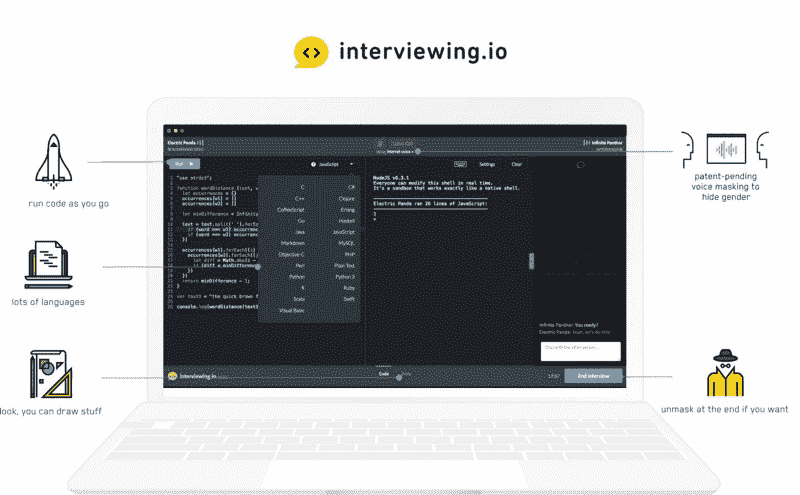

# 如何通过编码面试——帮助我从谷歌、Airbnb 和 Dropbox 获得工作机会的技巧

> 原文：<https://www.freecodecamp.org/news/coding-interviews-for-dummies-5e048933b82b/>

早在 2017 年，我经历了一些编码面试，得到了几家大型科技公司的邀请。所以在那时，我决定分享我在这篇文章中学到的东西。

我刚刚把它更新到 2022 年，所以如果你现在正在找工作，它会非常有用和相关。

尽管在大学里，我的 CS101 算法课程和数据结构课程都取得了不错的成绩，但一想到要参加以算法为重点的编码面试，我就不寒而栗。

因此，我在过去的三个月里一直在思考如何提高我的编码面试技巧，并最终收到了谷歌、脸书、Airbnb、Lyft、Dropbox 等大型科技公司的邀请。

在本帖中，我将分享我一路走来获得的见解和技巧。有经验的候选人也可能会遇到系统设计问题，但这超出了本文的范围。

编码面试中测试的很多算法概念都不是我平时工作中用的，我在工作中是前端工程师(web)。自然，我已经忘记了很多关于这些算法和数据结构的知识，这些知识大部分是我在大学一年级和二年级时学到的。

在面试中不得不编写(工作)代码，同时有人仔细检查你的每一次击键，这是很有压力的。更糟糕的是，作为一名受访者，你被鼓励大声向面试官表达你的想法。

我曾经认为能够同时思考、编码和交流是一个不可能的壮举，直到我意识到大多数人刚开始时不擅长编码面试。面试是一项你可以通过学习、准备和练习变得更好的技能。

我最近的求职让我踏上了提高编码面试技巧的旅程。前端工程师喜欢大声抱怨当前的招聘流程是如何被打破的，因为技术面试可能会包括与前端开发无关的技能。比如写一个迷宫求解算法，合并两个排序后的数字列表。作为一名前端工程师，我能理解他们。

前端是一个专门的领域，工程师必须关心许多与浏览器兼容性、文档对象模型、JavaScript 性能、CSS 布局等相关的问题。前端工程师实现面试中测试的一些复杂算法并不常见。

> 在脸书和谷歌这样的公司，人们首先是软件工程师，其次是领域专家。

不幸的是，规则是由公司制定的，而不是候选人。高度强调一般的计算机科学概念，如算法、设计模式、数据结构；优秀软件工程师应具备的核心技能。如果你想得到这份工作，你必须遵守游戏大师制定的规则——提高你的编码面试技巧！

这篇文章分为以下两个部分。请随意跳到您感兴趣的部分。

*   编码面试的分解，以及如何准备。
*   每个算法主题(数组、树、动态编程等)的有用提示和暗示。)，以及推荐的 LeetCode 练习题，以复习核心概念并改进这些主题。

这个帖子[的内容可以在这里](https://www.techinterviewhandbook.org/)找到。必要时我会在那里更新。

如果你对前端内容感兴趣，可以在这里查看我的[前端面试手册](https://www.frontendinterviewhandbook.com/)。

## 选择一种编程语言

首先，你需要为你的算法编码面试选择一种编程语言。

大多数公司会允许你用自己选择的语言编码。我知道的唯一例外是谷歌。他们只允许候选人从 Java、C++、Python、Go 或 JavaScript 中选择。

在大多数情况下，我建议使用你非常熟悉的语言，而不是你不熟悉但公司广泛使用的语言。

有些语言比其他语言更适合编写面试代码。还有一些是你绝对想避免的。

从我面试的经验来看，大部分应聘者都会选择 Python 或者 Java。其他常用的语言包括 JavaScript、Ruby 和 C++。我绝对会避免像 C 或 Go 这样的低级语言，因为它们缺乏标准的库函数和数据结构。

就我个人而言，Python 是我在面试时对编码算法事实上的选择。它很简洁，有一个巨大的函数库和数据结构。

我推荐 Python 的一个主要原因是，它使用一致的 API 来操作不同的数据结构，比如`len()`、`for ... in ...`和序列(字符串、列表和元组)上的切片符号。得到一个序列中的最后一个元素是`arr[-1]`，反过来就是简单的`arr[::-1]`。用 Python 中最少的语法可以完成很多事情。

Java 也是一个不错的选择。但是因为你必须不断地在你的代码中声明类型，这意味着输入额外的按键。这会降低你编码和打字的速度。当你在现场面试中不得不在白板上书写时，这个问题会更加明显。

选择或不选择 C++的原因和 Java 差不多。最终，Python、Java 和 C++是不错的选择。如果您已经使用 Java 有一段时间了，但没有时间熟悉另一种语言，我建议您坚持使用 Java，而不是从头开始学习 Python。这有助于你避免在工作中使用一种语言，而在面试中使用另一种语言。很多时候，瓶颈在思考而不是写作。

允许候选人“选择他们想要的任何编程语言”的惯例的一个例外是当面试是针对特定领域的职位时，例如前端、iOS 或 Android 工程师角色。您需要分别熟悉 JavaScript、Objective-C、Swift 和 Java 中的编码算法。

如果你需要使用一种语言不支持的数据结构，比如 JavaScript 中的队列或堆，问面试官你是否可以假设你有一种数据结构，它实现了特定时间复杂度的某些方法。如果数据结构的实现对解决问题并不重要，面试官通常会允许。

实际上，了解现有的数据结构并选择合适的数据结构来解决手头的问题比了解复杂的实现细节更重要。

## 回顾你的 CS101

如果你已经离开大学一段时间了，复习 CS 基础是非常可取的。我更喜欢边练习边复习。我浏览了我大学时的笔记，并在研究 LeetCode 和破解编码面试中的算法问题时修改了各种算法。

如果您对数据结构是如何实现的感兴趣，请查看一下 [Lago](https://github.com/yangshun/lago) ，这是一个 GitHub 存储库，包含 JavaScript 中的数据结构和算法示例。

[GitHub - yangshun/lago: 📕 Data Structures and Algorithms library in TypeScript📕 Data Structures and Algorithms library in TypeScript - GitHub - yangshun/lago: 📕 Data Structures and Algorithms library in TypeScriptyangshunGitHub](https://github.com/yangshun/lago)

## 通过实践掌握

接下来，熟悉并掌握你所选择的编程语言中的算法和数据结构。

用你选择的语言练习和解决算法问题。虽然破解编码面试是一个很好的资源，但我更喜欢通过键入代码、让代码运行并获得即时反馈来解决问题。

有各种在线评委，比如 [LeetCode](https://leetcode.com/) 、 [HackerRank](https://www.hackerrank.com/) 、 [CodeForces](http://codeforces.com/) 供你在线练习做题，习惯语言。从我的经验来看，LeetCode 问题和面试中问的问题最相似。HackerRank 和 CodeForces 问题更类似于竞争性编程中的问题。

如果你练习了足够多的 LeetCode 问题，很有可能你会看到或完成一个真实的面试问题(或它的一些变体)。

学习和理解你所选择的语言中常见操作的时间和空间复杂性。对于 Python 来说，这个[页面](https://wiki.python.org/moin/TimeComplexity)会派上用场。此外，了解该语言的`sort()`函数中使用的底层排序算法及其时间和空间复杂性(在 Python 中是 Timsort，这是一种混合)。

在 LeetCode 上完成一个问题后，我通常会在函数体上方添加所写代码的时间和空间复杂度作为注释。我用评论来提醒自己，在我完成实现之后，交流对算法的分析。

仔细阅读为你的语言推荐的编码风格，并坚持下去。如果选择 Python，参考 [PEP 8 风格指南](https://pep8.org/)。如果选择 Java，参考[谷歌的 Java 风格指南](https://google.github.io/styleguide/javaguide.html)。

了解并熟悉该语言的常见陷阱和警告。如果你在面试时指出它们，并避免陷入其中，你将获得加分，并给面试官留下深刻印象，不管面试官是否熟悉这种语言。

广泛接触不同主题的问题。在文章的后半部分，我提到了算法主题和每个主题练习的有用问题。做大约 100 到 200 个 LeetCode 问题，你应该会很好。

如果你喜欢学习更有条理的课程，这里有一些建议。为了通过面试，参加在线课程绝不是必须的。

*   [AlgoMonster](https://algo.monster/) 旨在帮助你在最短的时间内通过**的技术面试**。由谷歌工程师开发的 AlgoMonster 使用数据驱动的方法来教你最有用的关键问题模式，并有内容帮助你快速修改基本的数据结构和算法。最重要的是，AlgoMonster 不是基于订阅的——支付一次性费用，就可以获得**终身访问**。
*   Educative 的《探索编码面试:编码问题的模式》扩展了本文中推荐的练习问题，但从问题模式的角度来进行练习，这是一种我也同意的学习方法，我个人曾用它来更好地进行编码面试。本课程允许你用 Java、Python、C++、JavaScript 来练习选定的问题，并提供这些语言的示例解决方案。学习和理解模式，而不是背答案。

当然，练习，练习，再练习！

## 编码面试的各个阶段

恭喜你，你已经准备好将你的技能付诸实践了！在编码面试中，面试官会给你一个技术问题。您将在一个实时、协作的编辑器(电话屏幕)或白板(现场)上编写代码，并有 30 到 45 分钟的时间来解决问题。这才是真正有趣的地方！

你的面试官希望看到你符合这个职位的要求。这取决于你向他们展示你有技能。最初，边编码边说话可能会感觉怪怪的，因为大多数程序员在输入代码时没有大声解释自己想法的习惯。

然而，面试官很难仅仅通过看你的代码就知道你在想什么。如果你在开始编码之前就和面试官交流了你的方法，你可以和他们一起验证你的方法。通过这种方式，你们两个可以就一个可接受的方法达成一致。

## 准备远程面试

对于电话屏幕和远程采访，准备好纸和笔或铅笔，记下任何笔记或图表。如果你有一个关于树和图的问题，如果你画出数据结构的例子通常会有帮助。

使用耳机。确保你在一个安静的环境中。你不想一只手拿着电话，另一只手打字。尽量避免使用扬声器。如果反馈不好，沟通会变得更加困难。不得不重复自己只会导致宝贵时间的损失。

## 当你得到问题时该怎么做

很多考生一听到问题就开始编码。这通常是一个大错误。首先，花点时间向面试官重复这个问题，以确保你理解了这个问题。如果你误解了问题，那么面试官可以澄清。

听到问题时，即使你认为问题很清楚，也要寻求澄清。你可能会发现你错过了一些东西。这也让面试官知道你关注细节。

考虑问以下问题。

*   输入的大小是多少？
*   取值范围有多大？
*   有什么样的价值观？有负数吗？浮点？会有空输入吗？
*   输入中有重复吗？
*   输入的一些极端情况是什么？
*   输入是如何存储的？如果给你一本单词词典，它是字符串列表还是 trie？

在你充分阐明问题的范围和意图后，向面试官解释你的高层次方法，即使这是一个幼稚的解决方案。如果你陷入困境，考虑各种方法，大声解释为什么它可能或可能不工作。有时你的面试官可能会给你暗示，把你引向正确的方向。

从蛮力方法开始。把它传达给面试官。解释时间和空间的复杂性，阐明为什么它不好。暴力方法不太可能是您将要编码的方法。在这一点上，面试官通常会冒出一句可怕的话，“我们能做得更好吗？”问题。这意味着他们正在寻找一种更好的方法。

这通常是面试中最难的部分。一般来说，寻找重复的工作，并尝试通过在某个地方缓存计算结果来优化它们。以后引用它，而不是重新计算一遍。我在下面提供了一些解决特定主题问题的技巧。

只有在你和你的面试官已经就一种方法达成一致，并且你已经被允许的情况下，你才可以开始编码。

## 开始编码

使用好的风格来写你的代码。阅读他人编写的代码通常不是一件令人愉快的任务。阅读别人写的格式糟糕的代码更糟糕。你的目标是让你的面试官理解你的代码，这样他们就可以快速评估你的代码是否达到了预期的效果，是否解决了给定的问题。

使用清晰的变量名，避免使用单个字母的名字，除非是用于迭代。但是，如果您在白板上编码，请避免使用冗长的变量名。这减少了你必须要做的写作量。

一定要向面试官解释你正在写什么或打什么。这不是一字不差地向面试官朗读你正在编写的代码。从更高的层面谈论你正在实现的代码部分。解释为什么这样写，以及它试图达到什么目的。

当你复制粘贴代码时，考虑一下是否有必要。有时是，有时不是。如果您发现自己复制并粘贴了跨越多行的大块代码，这可能表明您可以通过将这些行提取到一个函数中来重构代码。如果只是你抄的单行，通常没问题。

但是，请记住在相关的地方更改您复制的代码行中的相应变量。复制和粘贴错误是 bug 的常见来源，即使在日常编码中也是如此！

## 编码后

当你完成编码后，不要马上向面试官宣布你完成了。在大多数情况下，您的代码通常并不完美。它可能包含错误或语法错误。你需要做的是检查你的代码。

首先，从头到尾检查你的代码。看着它，就好像它是别人写的，你是第一次看到它，并试图找出其中的错误。这正是你的面试官将要做的。检查并修复您可能发现的任何问题。

接下来，想出一些小的测试用例，并使用这些样本输入单步调试代码(不是你的算法)。

面试官喜欢你了解他们的想法。在你完成编码后，他们通常会让你写测试。如果你在他们提示你之前就为你的代码编写测试，这将是一个巨大的优势。逐句通过代码时，您应该模拟调试器。当你带着面试官浏览代码时，记下或告诉他们某些变量的值。

如果你的解决方案中有大量重复的代码，重组代码，向面试官展示你重视高质量的编码。此外，寻找可以进行[短路评估](https://en.wikipedia.org/wiki/Short-circuit_evaluation)的地方。

最后，给出代码的时间和空间复杂度，并解释为什么会这样。您可以用不同的时间和空间复杂性来注释代码块，以展示您对代码的理解。您甚至可以提供您选择的编程语言的 API。解释你当前的方法和其他方法之间的权衡，可能在时间和空间方面。

如果你的面试官对解决方案感到满意，面试通常到此结束。面试官会问你一些延伸性的问题，比如如果整个输入太大而不适合内存，或者输入是以流的形式到达，你会如何处理这个问题。在谷歌，这是一个常见的后续问题，他们非常关心规模。

答案通常是分治法——对数据执行分布式处理，只将特定的输入块从磁盘读入内存，将输出写回磁盘，稍后再进行组合。

## 模拟面试练习

上面提到的步骤可以一遍又一遍地练习，直到你完全内化它们，它们成为你的第二天性。练习的一个好方法是和一个朋友搭档，轮流采访对方。

准备编码面试的一个很好的资源是[interview . io](https://iio.sh/r/DMCa)。这个平台提供免费和匿名的谷歌和脸书工程师的实践面试，这可以导致真正的工作和实习。

由于在采访期间匿名，包容性采访过程是无偏见和低风险的。在采访结束时，采访者和被采访者可以互相提供反馈，以帮助对方提高。

在模拟面试中表现出色将为候选人打开工作页面，并允许他们预订像优步、Lyft、Quora、Asana 等顶级公司的面试(也是匿名的)。对于那些不熟悉编码面试的人来说，可以在[这个网站](https://start.interviewing.io/interview/9hV9r4HEONf9/replay)上观看演示面试。请注意，该网站要求用户登录。

无论是作为面试官还是被面试者，我都用过 interview . io。体验很棒。interviewing.io 的首席执行官兼联合创始人 Aline Lerner 和她的团队热衷于改革面试编码流程，帮助应聘者提高面试技巧。

她还在[intervaling . io 博客](http://blog.interviewing.io/)上发表了许多与编码面试相关的文章。我建议尽早注册 interviewing.io，即使它还在测试阶段，以增加收到邀请的可能性。



另一个可以让你练习编码面试的平台是 [Pramp](https://pramp.com/) 。interviewing.io 将潜在求职者与经验丰富的编码面试官匹配，Pramp 则采取了不同的方法。Pramp 让你和另一个同样是求职者的同伴配对。你们两个轮流扮演采访者和被采访者的角色。Pramp 还准备问题，并提供解决方案和提示来指导受访者。

## 勇往直前去征服

在 LeetCode 上做了相当多的问题，并做了足够多的模拟面试练习后，开始测试你新发现的面试技巧吧。

申请你最喜欢的公司，或者更好的是，从在这些公司工作的朋友那里获得推荐。推荐人往往比没有推荐人的申请更早得到关注，反应速度也更快。祝你好运！

## 编码问题的实用技巧

本节深入探讨了算法和数据结构的具体主题的实用技巧，这在编码问题中经常出现。许多算法问题涉及的技术可以应用于类似性质的问题。

你掌握的技巧越多，你通过面试的机会就越大。对于每一个题目，也有一个问题推荐列表，对于核心概念的掌握很有价值。有些问题只有付费订阅 LeetCode 才能回答，在我看来，如果它能让你找到工作，那绝对是物有所值。

## 一般提示

总是首先验证输入。检查无效、空、负或不同的输入。永远不要假设您得到了有效的参数。或者，向面试官澄清你是否可以假设有效的输入(通常是)，这样可以节省你编写输入验证代码的时间。

是否有任何时间和空间复杂性要求或限制？

检查一个接一个的错误。

在没有自动类型强制的语言中，检查值的连接是否属于同一类型:`int`、`str`和`list`。

完成代码后，使用一些示例输入来测试您的解决方案。

该算法是否应该运行多次，比如在 web 服务器上？如果是，输入可能会被预处理以提高每个 API 调用的效率。

混合使用函数式和命令式编程范例:

*   尽可能多地编写纯函数。
*   使用纯函数，因为它们更容易推理，有助于减少实现中的错误。
*   避免改变传递到函数中的参数，尤其是通过引用传递的参数，除非您对自己正在做的事情有把握。
*   实现准确性和效率的平衡。在适当的地方使用适量的功能性和命令性代码。由于非突变和新对象的重复分配，函数式编程在空间复杂性方面通常是昂贵的。另一方面，命令式代码更快，因为您操作的是现有对象。
*   避免依赖变异的全局变量。全局变量引入了状态。
*   确保不要意外地改变全局变量，尤其是当你必须依赖它们的时候。

一般来说，为了提高程序的速度，我们可以选择使用适当的数据结构或算法，或者使用更多的内存。这是经典的空间和时间权衡。

数据结构是你的武器。为正确的战斗选择正确的武器是胜利的关键。了解每种数据结构的优势及其各种操作的时间复杂度。

数据结构可以被扩充以实现跨不同操作的有效时间复杂度。例如，散列表可以与双向链表一起使用，以实现在 [LRU 缓存](https://leetcode.com/problems/lru-cache/)中的`get`和`put`操作的 O(1)时间复杂度。

HashMaps 可能是算法问题最常用的数据结构。如果你被困在一个问题上，你的最后一招可能是列举所有可能的数据结构(幸好没有那么多)，并考虑是否每一个都适用于这个问题。这有时对我有用。

如果你在代码中偷工减料，大声告诉你的面试官，并向他们解释在面试之外你会做什么(没有时间限制)。例如，说明您将编写一个正则表达式来解析一个字符串，而不是使用`split`，这并没有涵盖所有情况。

## 顺序

#### **注释**

数组和字符串被认为是序列(字符串是一个字符序列)。这里有处理数组和字符串的技巧，我们将在这里讨论。

序列中有重复的值吗？他们会影响答案吗？

检查序列是否超出界限。

请注意在代码中分割或连接序列。通常，切片和连接序列需要 O(n)时间。尽可能使用开始和结束索引来区分子数组或子字符串。

有时你从右侧而不是左侧遍历序列。

掌握适用于许多子串或子数组问题的[滑动窗口技术](https://discuss.leetcode.com/topic/30941/here-is-a-10-line-template-that-can-solve-most-substring-problems)。

当您有两个序列要处理时，通常每个序列有一个索引要遍历。例如，我们使用相同的方法来合并两个排序的数组。

#### **角落案例**

*   空序列
*   具有 1 或 2 个元素的序列
*   具有重复元素的序列

## 排列

#### **注释**

数组是排序的还是部分排序的？如果不是这样，某种形式的二分搜索法应该是可能的。这通常意味着面试官在寻找比 O(n)更快的解决方案。

你能给数组排序吗？有时，首先对数组进行排序可能会大大简化问题。在尝试对数组元素进行排序之前，请确保不需要保留数组元素的顺序。

对于涉及子数组的求和或乘法的问题，使用散列或前缀、后缀和或乘积的预计算可能是有用的。

如果给你一个序列，而面试官要求 O(1)空间，那么可以用这个数组本身作为哈希表。例如，如果数组只有从 1 到 N 的值，其中 N 是数组的长度，则对该索引处的值求反(减一)以指示该数字的存在。

#### **练习题**

*   [两笔总和](https://leetcode.com/problems/two-sum/)
*   [买卖股票的最佳时机](https://leetcode.com/problems/best-time-to-buy-and-sell-stock/)
*   [包含重复的](https://leetcode.com/problems/contains-duplicate/)
*   [除自身以外的数组乘积](https://leetcode.com/problems/product-of-array-except-self/)
*   [最大子阵列](https://leetcode.com/problems/maximum-subarray/)
*   [最大乘积子阵列](https://leetcode.com/problems/maximum-product-subarray/)
*   [在旋转排序数组中寻找最小值](https://leetcode.com/problems/find-minimum-in-rotated-sorted-array/)
*   [在旋转排序数组中搜索](https://leetcode.com/problems/search-in-rotated-sorted-array/)
*   [3 总和](https://leetcode.com/problems/3sum/)
*   [盛水最多的容器](https://leetcode.com/problems/container-with-most-water/)

## 二进制的

#### **学习链接**

*   [位、字节，用二进制构建](https://medium.com/basecs/bits-bytes-building-with-binary-13cb4289aafa)

#### **注释**

有时会问到涉及二进制表示和位运算的问题。在你选择的编程语言中，你必须知道如何将一个数从十进制形式转换成二进制形式，反之亦然。

一些有用的实用程序片段:

*   测试第 k 位被置位:`num & (1 << k) != 0`
*   设定 kth 位元:`num |= (1 << k)`
*   关闭第 k 位:`num &= ~(1 << k)`
*   切换第 k 位:`num ^= (1 << k)`
*   检查一个数是否是 2 的幂:`num & num - 1 == 0`。

#### **角落案例**

*   检查溢出/下溢
*   负数

#### **练习题**

*   [两个整数之和](https://leetcode.com/problems/sum-of-two-integers/)
*   [1 位数](https://leetcode.com/problems/number-of-1-bits/)
*   [计数位数](https://leetcode.com/problems/counting-bits/)
*   [缺少数字](https://leetcode.com/problems/missing-number/)
*   [反转位](https://leetcode.com/problems/reverse-bits/)

## 动态规划

#### **学习链接**

*   [揭开动态编程的神秘面纱](https://medium.freecodecamp.org/demystifying-dynamic-programming-3efafb8d4296)

#### **注释**

动态规划通常用于解决优化问题。Alaina Kafkes 写了一篇关于解决 DP 问题的[牛逼帖子](https://medium.freecodecamp.org/demystifying-dynamic-programming-3efafb8d4296)。你应该读一下。

提高 DP 的唯一方法就是练习。认识到一个问题可以通过动态规划来解决需要大量的实践。

为了优化空间，有时您不必将整个 DP 表存储在内存中。矩阵的最后两个值或最后两行就足够了。

#### **练习题**

*   [0/1 背包](http://www.geeksforgeeks.org/knapsack-problem/)
*   [爬楼梯](https://leetcode.com/problems/climbing-stairs/)
*   [硬币找零](https://leetcode.com/problems/coin-change/)
*   [最长递增子序列](https://leetcode.com/problems/longest-increasing-subsequence/)
*   [最长公共子序列](https://github.com/yangshun/tech-interview-handbook/blob/master/algorithms)
*   [断字问题](https://leetcode.com/problems/word-break/)
*   [组合和](https://leetcode.com/problems/combination-sum-iv/)
*   [入室抢劫](https://leetcode.com/problems/house-robber/)和[入室抢劫二](https://leetcode.com/problems/house-robber-ii/)
*   [解码方式](https://leetcode.com/problems/decode-ways/)
*   [独特的路径](https://leetcode.com/problems/unique-paths/)
*   [跳跃游戏](https://leetcode.com/problems/jump-game/)

## 几何学

#### ******音符******

当比较两对点之间的欧几里德距离时，使用 dx + dy 就足够了。没有必要对该值求平方根。

要找出两个圆是否重叠，请检查两个圆的圆心之间的距离是否小于它们的半径之和。

### **图形**

#### **学习链接**

*   [从理论到实践:表现图形](https://medium.com/basecs/from-theory-to-practice-representing-graphs-cfd782c5be38)
*   [深入研究图表:DFS 遍历](https://medium.com/basecs/deep-dive-through-a-graph-dfs-traversal-8177df5d0f13)
*   [在图中变宽:BFS 遍历](https://medium.com/basecs/going-broad-in-a-graph-bfs-traversal-959bd1a09255)

#### **注释**

熟悉各种图形表示和图形搜索算法，以及它们的时间和空间复杂性。

可以给你一个边的列表，让你从边中构建自己的图来执行遍历。常见的图形表示有

*   邻接矩阵
*   邻接表
*   散列表的散列表

有些输入看起来像树，但实际上是图。向你的面试官澄清这一点。在这种情况下，您必须处理循环，并在遍历时保留一组访问过的节点。

#### ******图搜索算法******

*   常见的:广度优先搜索(BFS)，深度优先搜索(DFS)
*   不常见:拓扑排序，Dijkstra 算法
*   罕见的:贝尔曼-福特算法、弗洛伊德-沃肖尔算法、普里姆算法、克鲁斯卡尔算法

在编码访谈中，图通常表示为二维矩阵，其中单元是节点，每个单元可以遍历其相邻的单元(上、下、左、右)。因此，熟悉二维矩阵的遍历是很重要的。

递归遍历矩阵时，一定要确保下一个位置在矩阵的边界内。在矩阵上做 DFS 的更多技巧可以在[这里](https://discuss.leetcode.com/topic/66065/python-dfs-bests-85-tips-for-all-dfs-in-matrix-question/)找到。对矩阵进行 DFS 的简单模板如下所示:

```
def traverse(matrix):
  rows, cols = len(matrix), len(matrix[0])
  visited = set()
  directions = ((0, 1), (0, -1), (1, 0), (-1, 0))
  def dfs(i, j):
    if (i, j) in visited:
      return
    visited.add((i, j))
    # Traverse neighbors
    for direction in directions:
      next_i, next_j = i + direction[0], j + direction[1]
      if 0 <= next_i < rows and 0 <= next_j < cols: # Check boundary
        # Add any other checking here ^
        dfs(next_i, next_j)
  for i in range(rows):
    for j in range(cols):
      dfs(i, j)
```

#### ******角宗******

*   空图
*   有一个或两个节点的图
*   不相交的图
*   带循环的图形

#### **练习题**

*   [克隆图形](https://leetcode.com/problems/clone-graph/)
*   [课程表](https://leetcode.com/problems/course-schedule/)
*   [外星人字典](https://leetcode.com/problems/alien-dictionary/)
*   [太平洋大西洋水流](https://leetcode.com/problems/pacific-atlantic-water-flow/)
*   [岛屿数量](https://leetcode.com/problems/number-of-islands/)
*   [图形有效树](https://leetcode.com/problems/graph-valid-tree/)
*   [无向图中连通分量的数量](https://leetcode.com/problems/number-of-connected-components-in-an-undirected-graph/)
*   [最长连续序列](https://leetcode.com/problems/longest-consecutive-sequence/)

## 间隔

#### **注释**

区间问题是给出一个二元数组的数组(一个区间)的问题。这两个值代表起始值和结束值。区间问题被认为是数组家族的一部分，但它们涉及一些常见的技巧。因此，他们有自己的特殊部分。

区间数组的例子:`[[1, 2], [4, 7]]`。

对于没有经验的人来说，区间问题可能很棘手。这是因为当区间数组重叠时，需要考虑大量的情况。

向面试官澄清`[1, 2]`和`[2, 3]`是否被认为是重叠区间，因为这会影响你如何写你的平等检查。

区间问题的一个常见例程是按照每个区间的起始值对区间数组进行排序。

熟悉编写代码来检查两个间隔是否重叠以及合并两个重叠的间隔:

```
def is_overlap(a, b):
  return a[0] < b[1] and b[0] < a[1]

def merge_overlapping_intervals(a, b):
  return [min(a[0], b[0]), max(a[1], b[1])]
```

#### ******角宗******

*   单一区间
*   非重叠区间
*   在另一个时间间隔内完全消耗的时间间隔
*   重复间隔

#### **练习题**

*   [插入间隔](https://leetcode.com/problems/insert-interval/)
*   [合并间隔](https://leetcode.com/problems/merge-intervals/)
*   [会议室](https://leetcode.com/problems/meeting-rooms/)和[第二会议室](https://leetcode.com/problems/meeting-rooms-ii/)
*   [非重叠区间](https://leetcode.com/problems/non-overlapping-intervals/)

## 链接列表

#### **注释**

像数组一样，链表也用来表示顺序数据。链表的好处是从链表中的任何地方插入和删除代码都是 O(1)，而在数组中，元素必须移位。

在头部和/或尾部添加虚拟节点可能有助于处理必须在头部或尾部执行操作的许多边缘情况。虚拟节点的存在确保了操作永远不会在头部或尾部执行。虚拟节点消除了编写条件检查来处理空指针的麻烦。确保在操作结束时移除它们。

有时候链表的问题不需要额外的存储就可以解决。试着借用中的思想来解决反向链表的问题。

对于链表中的删除，可以修改节点值或更改节点指针。您可能需要保留对前一个元素的引用。

对于分区链表，创建两个独立的链表，然后将它们重新连接在一起。

链表问题与数组问题有相似之处。想想你将如何解决一个数组问题，并将其应用于一个链表。

链表也有两种常见的指针方法:

*   从最后一个节点得到第 k 个:有两个指针，其中一个是在另一个前面的 **k** 节点。当前面的节点到达终点时，另一个节点是后面的 **k** 节点。
*   检测周期:有两个指针，其中一个指针的增量是另一个的两倍。如果两个指针相交，说明存在循环。
*   获取中间节点:有两个指针。一个指针的增量是另一个指针的两倍。当速度较快的节点到达列表末尾时，速度较慢的节点将位于中间。

熟悉以下例程，因为许多链表问题在其解决方案中使用了一个或多个这些例程。

*   计算链表中的节点数
*   就地反转链接列表
*   使用快速或慢速指针查找链表的中间节点
*   合并两个列表

#### **角落案例**

*   单一节点
*   两个音符
*   链表有循环。与面试官澄清列表中是否可以有循环。通常答案是否定的。

#### **练习题**

*   [反转链表](https://leetcode.com/problems/reverse-linked-list/)
*   [检测链表中的循环](https://leetcode.com/problems/linked-list-cycle/)
*   [合并两个排序列表](https://leetcode.com/problems/merge-two-sorted-lists/)
*   [合并 K 个排序列表](https://leetcode.com/problems/merge-k-sorted-lists/)
*   [从列表末尾删除第 n 个节点](https://leetcode.com/problems/remove-nth-node-from-end-of-list/)
*   [重新排序列表](https://leetcode.com/problems/reorder-list/)

## 数学

#### **注释**

如果代码涉及除法或模运算，记得检查除法或模 0 的情况。

当一个问题涉及“一个数的倍数”时，模可能是有用的。

如果您使用的是 Java 和 C++之类的类型化语言，请检查并处理溢出和下溢。至少，提及溢出或下溢是可能的，并询问你是否需要处理它。

考虑负数和浮点数。这听起来可能是显而易见的，但当你在面试中处于压力之下时，许多显而易见的点会被忽视。

如果问题要求实现一个操作符，比如乘方、平方根或除法，并且要比 O(n)快，二分搜索法通常是一种方法。

#### ******一些常用公式******

*   1 到 N 的和= (n+1) * n/2
*   GP 之和= 2⁰ + 2 + 2 + 2 + … 2^n = 2^(n+1)-1
*   N = N 的排列！/ (N-K)！
*   N = N 的组合！/ (K！* (N-K)！)

#### **角落案例**

*   被 0 除
*   整数溢出和下溢

#### **练习题**

*   [Pow(x，n)](https://leetcode.com/problems/powx-n/)
*   [Sqrt(x)](https://leetcode.com/problems/sqrtx/)
*   [整数到英文单词](https://leetcode.com/problems/integer-to-english-words/)

## [数]矩阵

#### **注释**

矩阵是一个二维数组。涉及矩阵的问题通常与动态规划或图遍历有关。

对于涉及遍历或动态编程的问题，用初始化为空值的相同维数制作矩阵的副本。使用这些值来存储访问过的状态或动态编程表。熟悉这个套路:

```
rows, cols = len(matrix), len(matrix[0])
copy = [[0 for _ in range(cols)] for _ in range(rows)
```

*   许多基于网格的游戏可以被建模为矩阵。比如井字游戏、数独、填字游戏、连接 4、战舰。被要求验证游戏获胜条件的情况并不少见。对于像井字游戏、连接 4 和纵横字谜这样的游戏，验证必须在垂直和水平方向上进行。一个技巧是编写代码来验证水平单元的矩阵。然后转置矩阵，重新使用用于水平验证的逻辑来验证最初垂直的单元(现在是水平的)。
*   在 Python 中转置矩阵很简单:

```
transposed_matrix = zip(*matrix)
```

#### **角落案例**

*   空矩阵。检查所有数组的长度都不是 0。
*   1 x 1 矩阵。
*   只有一行或一列的矩阵。

#### **练习题**

*   [设置矩阵零点](https://leetcode.com/problems/set-matrix-zeroes/)
*   [螺旋矩阵](https://leetcode.com/problems/spiral-matrix/)
*   [旋转图像](https://leetcode.com/problems/rotate-image/)
*   [单词搜索](https://leetcode.com/problems/word-search/)

## 递归

#### **注释**

递归对于排列很有用，因为它生成所有的组合和基于树的问题。你应该知道如何生成一个序列的所有排列，以及如何处理重复。

记住总是定义一个基本情况，这样你的递归就会结束。

递归隐式使用堆栈。因此，所有的递归方法都可以使用堆栈进行迭代重写。

当心递归层次太深导致堆栈溢出的情况(Python 中的默认限制是 1000)。向面试官指出这一点可能会给你加分。

递归永远不会是 O(1)空间复杂度，因为涉及到堆栈，除非有[尾调用优化](https://stackoverflow.com/questions/310974/what-is-tail-call-optimization) (TCO)。了解您选择的语言是否支持 TCO。

#### **练习题**

*   [子集](https://leetcode.com/problems/subsets/)和[子集 II](https://leetcode.com/problems/subsets-ii/)
*   [频闪信号编号 II](https://leetcode.com/problems/strobogrammatic-number-ii/)

## 线

#### **注释**

请阅读上面关于[序列](https://github.com/yangshun/tech-interview-handbook/tree/master/algorithms#sequence)的提示。它们也适用于字符串。

询问输入字符集和区分大小写。通常字符限于小写拉丁字符，例如 a 到 z。

当需要比较顺序不重要的字符串时(比如变位)，可以考虑使用 HashMap 作为计数器。如果你的语言像 Python 一样有内置的`Counter`类，那就要求使用它。

如果需要保存一个字符的计数器，一个常见的错误就是说计数器需要的空间复杂度是 O(n)。计数器所需的空间是 O(1)而不是 O(n)。这是因为上限是字符的范围，通常是 26 个固定常数。输入集只是小写拉丁字符。

高效查找字符串的常见数据结构有

*   [Trie/前缀树](https://www.wikiwand.com/en/Trie)
*   [后缀树](https://www.wikiwand.com/en/Suffix_tree)

常见的字符串算法有

*   [Rabin Karp](https://www.wikiwand.com/en/Rabin%E2%80%93Karp_algorithm) ，使用滚动哈希对子字符串进行高效搜索
*   [KMP](https://www.wikiwand.com/en/Knuth%E2%80%93Morris%E2%80%93Pratt_algorithm) ，它对子字符串进行有效的搜索

#### **不重复的字符**

使用 26 位位掩码来指示字符串中的小写拉丁字符。

```
mask = 0
for c in set(word):
  mask |= (1 << (ord(c) - ord('a')))
```

要确定两个字符串是否有共同的字符，对两个位掩码执行`&`。如果结果不为零，`mask_a & mask_b > 0`，那么这两个字符串有共同的字符。

#### **字谜**

变位词是单词转换或单词游戏。它是重新排列一个单词或短语的字母以产生一个新单词或短语的结果，而所有原始字母只使用一次。在面试中，通常我们只会被没有空格的单词困扰。

要确定两个字符串是否是变位词，有几种可行的方法:

*   对两个字符串进行排序应该会产生相同的结果字符串。这需要 O(nlgn)时间和 O(lgn)空间。
*   如果我们将每个字符映射到一个质数，并将每个映射的数相乘，字谜应该有相同的倍数(质因数分解)。这需要 O(n)时间和 O(1)空间。
*   字符的频率计数将有助于确定两个字符串是否是字谜。这也需要 O(n)的时间和 O(1)的空间。

#### **回文**

一个 ****回文**** 是一个单词、短语、[数字](https://en.wikipedia.org/wiki/Palindromic_number)，或者其他前后读起来一样的[字符](https://en.wikipedia.org/wiki/Character_(symbol))序列，比如 **夫人** 或者 **赛车** 。

以下是判断字符串是否为回文的几种方法:

*   把字符串反过来，它应该等于它自己。
*   在字符串的开头和结尾有两个指针。向内移动指针，直到它们相遇。在任何时间点，两个指针上的字符都应该匹配。

字符串中字符的顺序很重要，所以散列表通常没有帮助。

当一个问题是关于计算回文的数目时，一个常见的技巧是让两个指针向外移动，远离中间。注意回文长度可以是偶数也可以是奇数。对于每个中间枢纽位置，您需要检查两次:一次是包含字符的位置，一次是不包含字符的位置。

*   对于子字符串，一旦没有匹配项，就可以提前终止。
*   对于子问题，使用动态规划，因为有重叠的子问题。查看[这个问题](https://leetcode.com/problems/longest-palindromic-subsequence/)。

#### **角落案例**

*   空字符串
*   单字符字符串
*   只有一个不同字符的字符串

#### **练习题**

*   [没有重复字符的最长子串](https://leetcode.com/problems/longest-substring-without-repeating-characters/)
*   [最长重复字符替换](https://leetcode.com/problems/longest-repeating-character-replacement/)
*   [最小窗口子串](https://leetcode.com/problems/minimum-window-substring/description/)
*   [编码和解码字符串](https://leetcode.com/problems/encode-and-decode-strings/)
*   [有效的字谜](https://leetcode.com/problems/valid-anagram)
*   [分组字谜](https://leetcode.com/problems/group-anagrams/)
*   [有效括号](https://leetcode.com/problems/valid-parentheses)
*   [有效回文](https://leetcode.com/problems/valid-palindrome/)
*   [最长回文子串](https://leetcode.com/problems/longest-palindromic-substring/)
*   [回文子串](https://leetcode.com/problems/palindromic-substrings/)

## 树

#### **学习链接**

*   [叶到二叉树](https://medium.com/basecs/leaf-it-up-to-binary-trees-11001aaf746d)

#### **注释**

树是一种无向且连通的无环图。

递归是树的一种常见方法。当您注意到子树问题可以用来解决整个问题时，请尝试使用递归。

当使用递归时，总是记得检查基本情况，通常是节点是`null`的地方。

当要求您按级别遍历树时，请使用深度优先搜索。

有时你的递归函数可能需要返回两个值。

如果问题涉及沿途节点的求和，一定要检查节点是否可以是负数。

您应该非常熟悉递归地编写前序、按序和后序遍历。作为扩展，通过迭代地编写它们来挑战自己。有时面试官会问候选人迭代方法，尤其是当候选人太快写完递归方法的时候。

## 二叉树

二叉树的有序遍历不足以唯一地序列化一个树。还需要前序或后序遍历。

## 二叉查找树(夏令时)

对 BST 的有序遍历将使所有元素有序。

非常熟悉 BST 的特性。验证二叉树是 BST。这个问题出现的频率比预期的要高。

当问题涉及 BST 时，面试官通常会寻找比 O(n)运行速度更快的解决方案。

#### **角落案例**

*   空树
*   单一节点
*   两个音符
*   非常倾斜的树(像一个链表)

#### **练习题**

*   [二叉树的最大深度](https://leetcode.com/problems/maximum-depth-of-binary-tree/)
*   [同一棵树](https://leetcode.com/problems/same-tree/)
*   [反转或翻转二叉树](https://leetcode.com/problems/invert-binary-tree/)
*   [二叉树最大路径和](https://leetcode.com/problems/binary-tree-maximum-path-sum/)
*   [二叉树层次顺序遍历](https://leetcode.com/problems/binary-tree-level-order-traversal/)
*   [序列化和反序列化二叉树](https://leetcode.com/problems/serialize-and-deserialize-binary-tree/)
*   [另一棵树的子树](https://leetcode.com/problems/subtree-of-another-tree/)
*   [根据前序和中序遍历构建二叉树](https://leetcode.com/problems/construct-binary-tree-from-preorder-and-inorder-traversal/)
*   [验证二叉查找树](https://leetcode.com/problems/validate-binary-search-tree/)
*   [BST 中的第 k 个最小元素](https://leetcode.com/problems/kth-smallest-element-in-a-bst/)
*   [BST 的最低共同祖先](https://leetcode.com/problems/lowest-common-ancestor-of-a-binary-search-tree/)

## 努力

#### **学习链接**

*   [试图理解尝试](https://medium.com/basecs/trying-to-understand-tries-3ec6bede0014)
*   [实现 Trie(前缀树)](https://leetcode.com/articles/implement-trie-prefix-tree/)

#### **注释**

尝试是特殊的树(前缀树)，使搜索和存储字符串更有效。尝试有许多实际应用，比如进行搜索和提供自动完成。了解这些常见的应用程序是很有帮助的，这样您就可以很容易地确定何时可以使用 trie 有效地解决问题。

有时将单词字典(以列表形式给出)预处理成 trie，会提高在 **n** 单词中搜索长度为 **k、** 的单词的效率。搜索变成 O(k)而不是 O(n)。

熟悉从零开始实现一个`Trie`类及其`add`、`remove`和`search`方法。

#### **练习题**

*   [实现 Trie(前缀树)](https://leetcode.com/problems/implement-trie-prefix-tree)
*   [添加和搜索单词](https://leetcode.com/problems/add-and-search-word-data-structure-design)
*   [单词搜索二](https://leetcode.com/problems/word-search-ii/)

## 许多

#### **学习链接**

*   [学会爱堆](https://medium.com/basecs/learning-to-love-heaps-cef2b273a238)

#### **注释**

如果你看到问题中提到的一个 top 或者最低的 **k** ，通常是可以用堆来解决问题的标志，比如在 [Top K 频繁元素](https://leetcode.com/problems/top-k-frequent-elements/)。

如果你需要最上面的 **k** 元素，使用最小堆大小 **k** 。遍历每个元素，将其推入堆中。每当堆大小超过 **k** 时，移除最小元素。那将保证你拥有 **k** 最大的元素。

#### **练习题**

*   [合并 K 个排序列表](https://leetcode.com/problems/merge-k-sorted-lists/)
*   [前 K 个频繁元素](https://leetcode.com/problems/top-k-frequent-elements/)
*   [从数据流中找出中值](https://leetcode.com/problems/find-median-from-data-stream/)

## 结论

编码面试很难。但幸运的是，你可以通过为他们学习和练习，以及进行模拟面试来提高他们的水平。

概括地说，要在编码面试中做得好:

1.  决定编程语言
2.  学习计算机科学基础
3.  练习解决算法问题
4.  记住面试中的[该做的和不该做的](https://github.com/yangshun/tech-interview-handbook/blob/master/preparing/cheatsheet.md)
5.  通过模拟技术面试来练习
6.  面试成功获得工作

通过遵循这些步骤，你将提高你的编码面试技巧，并且离你的梦想工作更近一步(或者更远)。

万事如意！

这个帖子[的内容可以在这里](https://www.techinterviewhandbook.org/)找到。未来的更新将会发布在那里。欢迎提出建议和修正的请求。

如果你喜欢这篇文章，分享给你的朋友吧！

你也可以在 [GitHub](https://github.com/yangshun) 和 [Twitter](https://twitter.com/yangshunz) 上关注我。