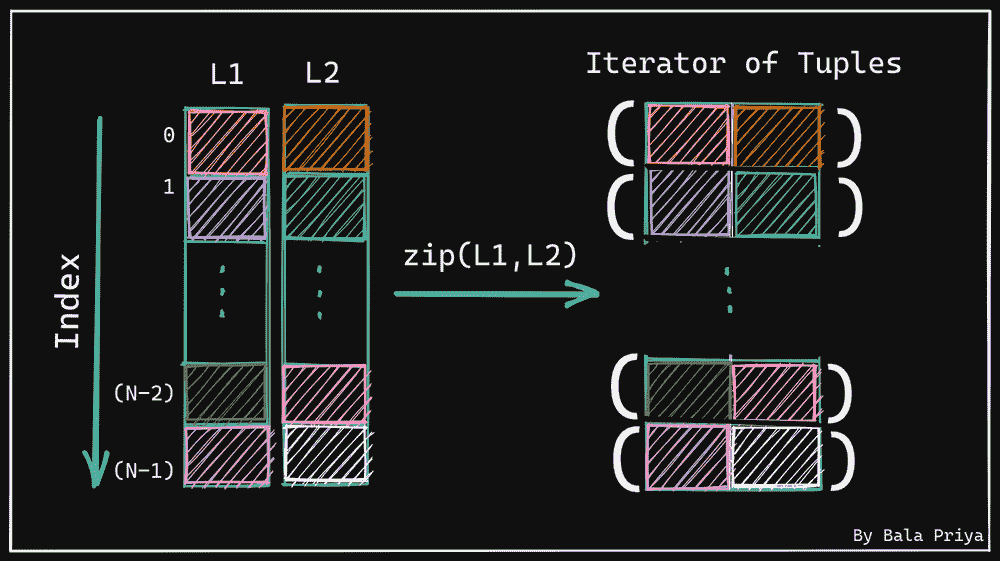

# Python 中的词典理解——用例子解释

> 原文：<https://www.freecodecamp.org/news/dictionary-comprehension-in-python-explained-with-examples/>

字典是 Python 中强大的内置数据结构，将数据存储为键值对。词典理解对于从现有的词典和条目中创建新的词典非常有帮助。

在本教程中，我们将通过编写一些简单的例子来学习 Python 中的字典理解是如何工作的。

## Python 中的字典是什么？

Python 中的字典允许我们存储两组值之间的一系列映射，即 T2 键和 T4 值。

*   字典中的所有条目都用一对花括号`{}`括起来。
*   字典中的每个条目都是一个键和值之间的映射——称为*键-值*对。
*   键值对通常被称为字典*条目*。
*   您可以使用相应的键来访问这些值。

这里有一个字典的一般例子:

```
my_dict = {"key1":<value1>,"key2":<value2>,"key3":<value3>,"key4":<value4>}
```

在上面的例子中，

*   字典`my_dict`包含 4 个键值对(条目)。
*   `"key1"`到`"key4"`是 4 个键。
*   可以用`my_dict["key1"]`访问`<value1>`，`my_dict["key2"]`访问`<value2>`，以此类推。

现在我们知道了什么是 Python 字典，让我们继续学习*字典理解*。

## 如何使用字典理解从 Iterable 创建 Python 字典

在本节中，让我们使用 dictionary comprehension 从一个 iterable(比如一个列表或一个元组)创建一个 Python 字典。

如果我们选择动态生成键或值，我们可以只使用一个 iterable 创建一个新的 Python 字典。

> 当我们选择动态生成值时，我们可以使用 iterable 中的项作为键，反之亦然。

一般语法如下所示。请注意，<>之间的名称是实际变量名的占位符。

```
<dict_name> = {<new_key>:<new_value> for <item> in <iterable>}
```

我们来解析一下上面的语法。

*   表示我们正在填充一个字典。
*   对于 iterable 中的每一项，我们在字典中生成一个键值对。

是时候举个简单的例子了。

## Python 字典理解-示例 1

假设我们有一个访问我们商店的客户列表，我们想为每个客户提供随机折扣。我们希望折扣值在 1 美元到 100 美元之间。

> 在 Python 中，`random.randint(i,j)`返回一个介于`i`和`j`之间的随机整数，其中两个端点都包含在内。

因此，我们可以使用 Python 随机模块中的`randint()`函数为我们列表中的每个客户生成 1 到 100 美元的折扣。

下面的代码片段展示了我们如何从客户列表中创建一个新的字典`discount_dict`。

```
import random
customers = ["Alex","Bob","Carol","Dave","Flow","Katie","Nate"]
discount_dict = {customer:random.randint(1,100) for customer in customers}
print(discount_dict)

#Output

{'Alex': 16, 'Bob': 26, 'Carol': 83, 'Dave': 21, 'Flow': 38, 'Katie': 47, 'Nate': 89}
```

上述示例执行以下操作:

*   遍历客户列表(`customers`)，
*   使用每个客户的姓名作为键，并且
*   生成一个介于 1 美元和 100 美元之间的随机折扣作为关键字的值。

## 如何使用字典理解从两个可重复项创建一个 Python 字典

如果我们已经有了包含键和值的预定义的 iterables 会怎么样？比方说，你有两个列表，`list_1`和`list_2`——`list_1`包含*键*，而`list_2`包含相应的*值*。

我们现在可以使用 Python 的`zip()`函数压缩这两个列表来生成键值对。

> 注意:`zip`函数接受一个可迭代序列作为参数，并返回一个元组迭代器，如下图所示。



所以，第一个元组是第一个键值对，第二个元组是第二个键值对，一般来说，第 I 个元组是第 I 个键值对。

在这种情况下，字典理解采取以下形式:

```
<dict_name> = {<new_key>:<new_value> for (key,value) in zip(list1,list2)}
```

解析上面的语法非常简单。

*   键和值以元组的形式提供，因为我们已经使用`zip()`函数将它们压缩在一起。
*   现在，我们遍历这个元组迭代器来获取字典的键值对。

是时候看另一个简单的例子了。

## Python 字典理解-示例 2

假设我们想要创建一个我们城市的周气温字典。天应该是键，与天相对应的温度(以摄氏度为单位)应该是值。

假设我们在如下所示的两个列表中有日期和温度。

```
days = ["Sunday", "Monday","Tuesday","Wednesday","Thursday","Friday","Saturday"]
temp_C = [30.5,32.6,31.8,33.4,29.8,30.2,29.9]
```

我们现在可以继续使用字典理解来创建一个每周温度的字典。

```
# Creating a dictionary of weekly tempertaures
# from the list of temperatures and days

weekly_temp = {day:temp for (day,temp) in zip(days,temp_C)}

print(weekly_temp)

# Output
{'Sunday': 30.5, 'Monday': 32.6, 'Tuesday': 31.8, 'Wednesday': 33.4, 'Thursday': 29.8, 'Friday': 30.2, 'Saturday': 29.9}
```

在上面的例子中，我们使用了`zip()`函数来压缩日期和温度的列表。我们现在可以通过使用任意一天作为关键字来进入字典，以获得当天的温度，如下所示:

```
weekly_temp["Thursday"]
# Output
29.8
```

## 如何在 Python 字典上使用 items()方法

到目前为止，我们已经看到了如何使用键来访问值。我们如何访问字典中所有的键值对？

为此，我们可以调用字典上的`items()`方法来获取所有的键值对，如下面的代码片段所示。

```
discount_dict.items()

# Output
dict_items([('Alex', 16), ('Bob', 26), ('Carol', 83), ('Dave', 21), ('Flow', 38), ('Katie', 47), ('Nate', 89)])
```

## 如何使用字典理解从现有字典创建 Python 字典

假设我们已经有了一个 Python 字典。📚

然而，我们想要创建一个新的*字典，它只包含字典中满足特定条件的条目。在这方面，字典理解真的很方便。*

```
<dict_name> = {<new_key>:<new_value> for (key,value) in <dict>.items() if <condition>}
```

我们来解析一下上面的语法。我们使用`items()`方法并在现有字典中获取所有的键值对。

*   我们访问第一个字典项，并检查`condition`的值是否等于`True`。
*   如果条件是`True`，我们将第一个条目添加到新字典中。
*   然后，我们对现有字典中的所有条目重复这些步骤。

让我们举个例子来看看这是如何工作的。

## Python 字典理解-示例 3

让我们以之前创建`discount_dict`字典的折扣示例为基础。再来看看我们的`discount_dict`字典。

```
{'Alex': 16, 'Bob': 26, 'Carol': 83, 'Dave': 21, 'Flow': 38, 'Katie': 47, 'Nate': 89} 
```

我们看到一些顾客很幸运地得到了比其他人更高的折扣。让我们解决这一差距，让我们所有的客户都满意。😀

我们现在想为低于 30 美元折扣的客户提供下次购买 10%的折扣。✨

在这种情况下，我们从我们的`discount_dict`字典创建一个新的字典`customer_10`。

```
customer_10 = {customer:discount for (customer, discount) in discount_dict.items() if discount<30}

print(customer_gifts)

# Output
{'Alex': 16, 'Bob': 26, 'Dave': 21}
```

上述代码执行以下操作:

*   对于我们的`discount_dict`中的每一件商品，它都利用了折扣的价值。
*   如果折扣少于 30 美元，它会将相应的`customer:discount`对添加到我们的新字典`customer_10`中。

注意得到不到 30 美元折扣的`Alex`、`Bob`和`Dave`是如何被添加到新词典中的。

## 结论

让我们总结一下我们在本教程中学到的内容。我们已经看到了如何使用字典理解从以下来源创建 Python 字典:

*   只有一个可迭代的，
*   两个可重复项，和
*   使用条件过滤项目的现有字典。

感谢您的阅读。快乐学习！🎉

### 相关职位

这里有一个帖子解释了 [Python 的 zip()函数](https://www.freecodecamp.org/news/the-zip-function-in-python-explained-with-examples/)的工作原理。