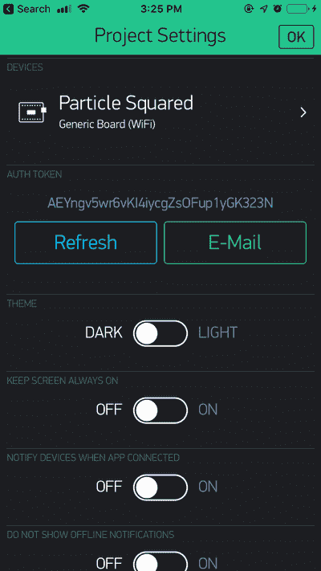
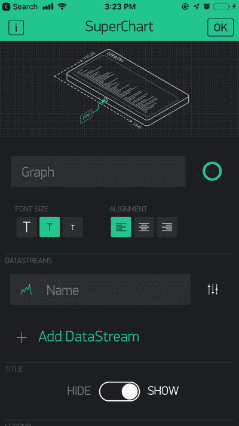
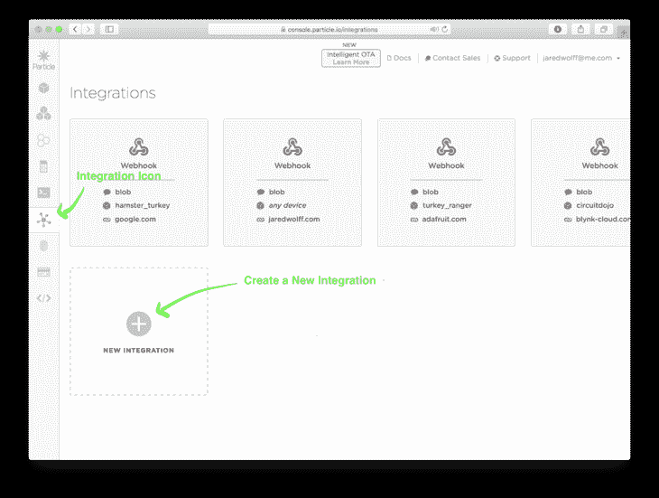
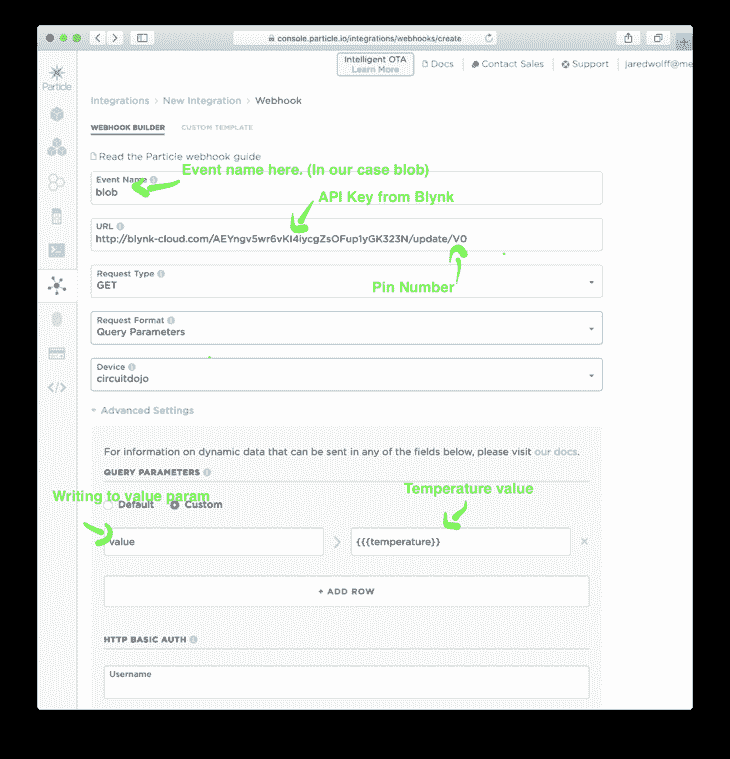
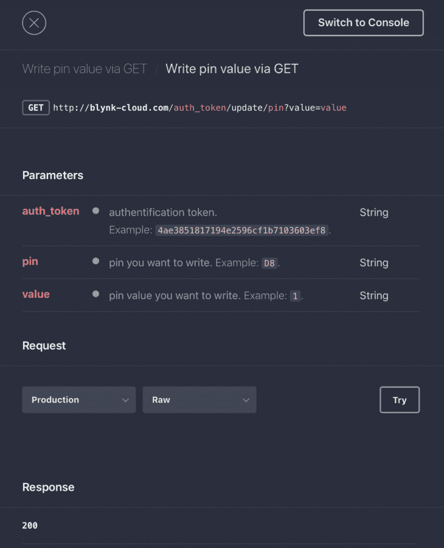
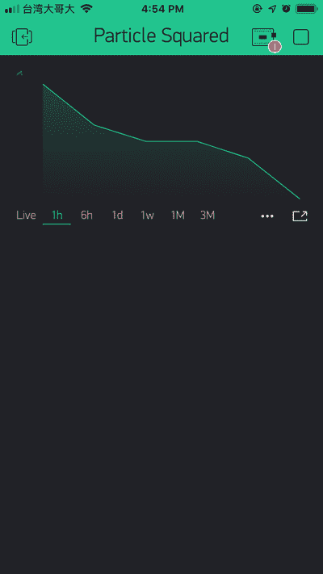
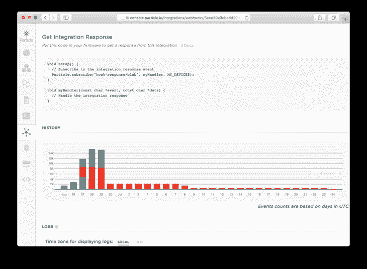
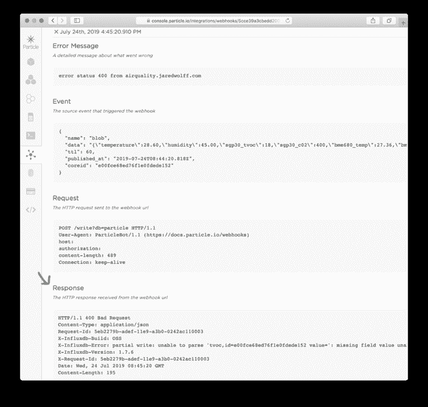
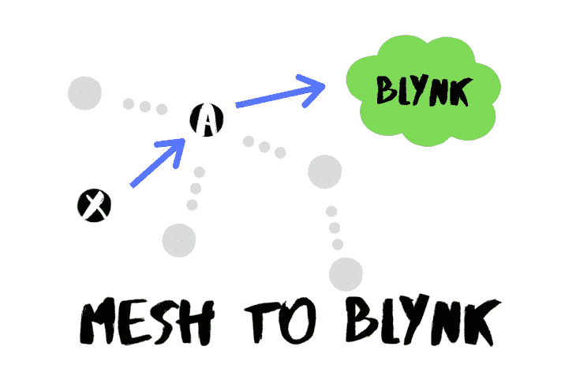
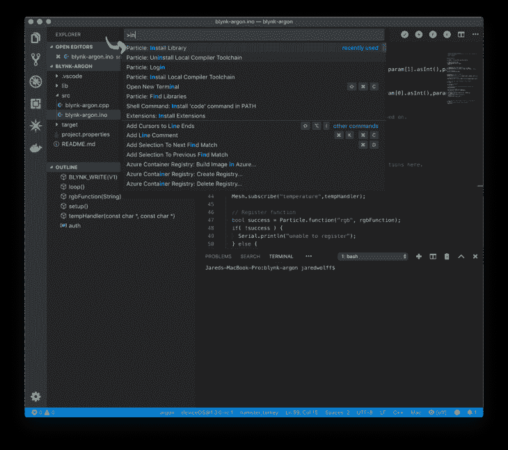

# 使用 Blynk 获得粒子网格的两种最佳方法

> 原文：<https://www.freecodecamp.org/news/2-best-ways-to-get-particle-mesh-working-with-blynk/>

**这篇文章最初来自我在[www.jaredwolff.com](https://www.jaredwolff.com/two-best-ways-to-get-particle-mesh-working-with-blynk/)的博客。**

写 app 需要时间。编写一个能在硬件上工作的程序甚至要花更多的时间。

幸运的是，这个问题有一个解决方案。

Enter [Blynk](http://blynk.io) .

这是一个连接到硬件的应用程序。它有一个带有预建部件的拖放界面。这意味着您可以在几秒钟内构建一个应用程序。然后在几分钟内上传您的设备传感器读数。

Blynk 可以使用氩气、硼或以太网连接的氙气。不幸的是，它不适用于粒子网格网络。在这篇文章中，你将学习一些解决方法来让你的基于网格的项目运行起来。

## 从粒子云到布林克

让我们从最简单的用例开始:从任何粒子设备获取数据到 Blynk。

来自[粒子平方](http://jaredwolff.com/homemade-indoor-air-quality-sensor/)的空气质量数据对于这个例子来说是完美的。所以，我要用这个。

首先让我们创建一个新的 Blynk 项目



获取**认证令牌**我们稍后会用到它。您可以**点击认证令牌**将其复制到您的剪贴板。

接下来，让我们为这个例子添加一个**超级图表**。



配置超级图表以使用虚拟引脚。我们无法访问设备上的实际硬件引脚。 **V0** 是个不错的选择。


要更新 Blynk 中的值，我们必须以某种方式进行连接。最好的方法是在**粒子控制台中使用一个**集成**。**

在粒子控制台中，单击终端图标下方的图标。然后点击**新建集成。**



看看下面的例子，看看我是如何填写所有内容的。



粒子平方使用**事件名称**作为**** `blob`。对于其他项目，这可能有所不同。**记住:**您的活动名称与`Particle.publish(eventName, data)`相同。

**URL** 被设置为使用`blink-cloud.com`地址。根据他们的 API，一个示例 URL 看起来像:



我还会在这里包括它，这样更容易复制

```
http://blynk-cloud.com/auth_token/update/pin?value=value 
```

用我们之前得到的**认证令牌**替换`auth_token`。

用我们想要修改的虚拟 pin 替换`pin`。在这种情况下 **V0**

用您想要使用的值替换`value`。

我们将引用粒子平方`blob`中的一个值。它是这样组织的:

```
{
  "temperature": 28.60,
  "humidity": 45.00,
  "sgp30_tvoc": 18,
  "sgp30_c02": 400,
  "bme680_temp": 27.36,
  "bme680_pres": 1012.43,
  "bme680_hum": 43.80,
  "bme680_iaq": 43.90,
  "bme680_temp_calc": 27.30,
  "bme680_hum_calc": 43.97
} 
```

粒子使用[小胡子模板](http://mustache.github.io/mustache.5.html)。从上面的截图可以看出，可以将`value`设置为`{{{temperature}}}`。

**注意:**如果你正在做自己的项目，用 JSON 发布是很重要的。作为参考，`Particle.publish`命令看起来像:

```
// Publish data
Particle.publish("blob", String::format("{\"temperature\":%.2f,\"humidity\":%.2f}",si7021_data.temperature, si7021_data.humidity) , PRIVATE, WITH_ACK); 
```

点击屏幕底部的**蓝色大保存按钮**。然后我们就可以进入下一步了！

### 测试

自从创建我们的 Particle Webhook 集成以来，它一直在向 Blynk 发布数据。我们去看看有没有用。

首先，让我们回到 Blynk 应用程序。**点击 Blynk 屏幕右上角的播放按钮**。



如果您的集成已经运行了一段时间，您应该会看到图表中填充了数据！如果你什么也没看见，让我们检查日志。

**回到你的积分**和**向底部滚动**。我们想看看是否有错误。

不确定那看起来像什么？这是一个有误差的积分的例子:



您可以进一步向下滚动，调查错误发生的原因。



底部一直显示来自服务器的响应。根据服务的不同，它们会给出 API 调用失败的原因。在我的例子中，我丢失了两个字段的值。

### 粒子呼叫布林克成功了！

现在，您有了在 Blynk 中发布虚拟 pin 的基本方法。不过也有缺点。最重要的是，您必须为每个信号虚拟引脚创建一个集成。如果你有八个读数，那意味着八个积分。

真扫兴。

在下一节中，您将学习配置 Blynk 的不同方法。我们走吧！

## 使用 Blynk 库的本地网格



与第一种方法不同，我们将只关注改变固件。

我们将使用氩、硼或以太网连接的氙和一个普通氙。在本教程的其余部分，我们将这些设备称为“边缘路由器”。

氙会运行粒子平方代码。我们将使用`Mesh.publish`而不是`Particle.publish`。这允许我们仅向本地网状网络发布。

同时，边缘路由器正在监听消息。它收集这些值，然后使用 Blynk API 发布到应用程序。

以下是步骤:

### 设置我们的边缘路由器

按下 **Cmd+Shift+P** 调出菜单。键入**安装库。**



然后输入 **blynk。**如果你还没有下载的话，这个库应该可以下载。

安装完成后，你可以将这个库包含在你的`.ino`文件的顶部，如下所示:

```
#include <blynk.h> 
```

在我们的`setup()`函数中，让我们初始化 Blynk 库:

```
// Put initialization like pinMode and begin functions here.
Blynk.begin(auth); 
```

在我们的`setup()`函数中，订阅`temperature`事件。连接的氙气会产生此事件。

```
// Subscribe to temperature events
Mesh.subscribe("temperature",tempHandler); 
```

现在这样定义`tempHandler`:

```
// Temperature event handler for mesh
void tempHandler(const char *event, const char *data){
} 
```

在`loop()`函数中，确保我们有`Blynk.run();`

```
// loop() runs over and over again, as quickly as it can execute.
void loop() {
  // The core of your code will likely live here.
  Blynk.run();
} 
```

最后，对于`tempHandler`,我们可以添加一个调试输出来监控事件。我用过这样的东西:

```
Serial.printlnf("event=%s data=%s", event, data ? data : "NULL"); 
```

粒子在他们的一些例子中使用了这一点。它也非常适合我们的目的！

**注意:**确保你已经在你的`Setup()`函数中调用了`Serial.begin()`！

所以现在我们有`tempHandler`来接收来自氙的数据。边缘路由器现在可以获取该数据并将其上传到 Blynk。让我们为此使用`Blynk.virtualWrite`函数:

```
// Write the data
Blynk.virtualWrite(V0, data); 
```

这将把温度值从氙写入`V0`引脚。如果您使用的不是 V0，请确保在这里更改该值。(这与之前的*粒子云到 Blynk* 的例子设置相同)


边缘路由器的最终代码应该如下所示。当你准备好的时候，编译一个 flash 到你的设备上！

```
/*
 * Project blynk-argon-forwarder
 * Description: Argon Blynk forwarder for Particle Mesh. Forwards data from mesh connected devices to Blynk.
 * Author: Jared Wolff
 * Date: 7/25/2019
 */

#include <blynk.h>

char auth[] = "<ENTER YOUR AUTH KEY>";

// Temperature event handler for mesh
void tempHandler(const char *event, const char *data){
  Serial.printlnf("event=%s data=%s", event, data ? data : "NULL");

  // Write the data
  Blynk.virtualWrite(V0, data);
}

// setup() runs once, when the device is first turned on.
void setup() {

  // Serial for debugging
  Serial.begin();

  // Put initialization like pinMode and begin functions here.
  Blynk.begin(auth);

  // Subscribe to temperature events
  Mesh.subscribe("temperature",tempHandler);

}

// loop() runs over and over again, as quickly as it can execute.
void loop() {
  // The core of your code will likely live here.
  Blynk.run();

} 
```

记得使用 Blynk 应用程序中的`AUTH TOKEN`设置`auth`！

### 设置氙


创建新项目。这一次是氙捕捉“温度数据”

让我们在文件的顶部添加一个名为`time_millis`的变量。类型是`system_tick_t`。我们将使用它为温度读数创建一个简单的延时计时器。

```
// Global variable to track time (used for temp sensor readings)
system_tick_t time_millis; 
```

对于间隔，让我们使用一个预处理器定义

```
#define INTERVAL_MS 2000 
```

现在让我们在`loop()`函数中将这些联系在一起。我们将使用一个`if`语句来比较我们当前的系统时间和上一个事件加上偏移量的时间。如果你需要一个简单的计时器，这是最好的方法之一！

```
// Check if our interval > 2000ms
  if( millis() - time_millis > INTERVAL_MS ) {
  } 
```

一旦我们进去了，确保你重置了`timer_millis`:

```
 //Set time to the 'current time' in millis
    time_millis = millis(); 
```

然后，我们将使用`random()`函数生成温度值。我们将使用双参数变量。这样我们可以设置最小值和最大值:

```
 // Create a random number
    int rand = random(20,30); 
```

最后，我们将`Mesh.publish`值:

```
 // Publish our "temperature" value
    Mesh.publish("temperature",String::format("%d",rand)); 
```

当这个例子运行时，温度被广播到网状网络。然后，边缘路由器接收它并将其转发给 Blynk！

你可以随时刷新这个固件。这是氙的完整代码，这样你就可以交叉比较了:

```
/*
 * Project blynk-xenon-rgb
 * Description: Recieve RGB level from connected Edge Router. Sends simiulated temperature values via mesh to the Blynk cloud.
 * Author: Jared Wolff
 * Date: 7/25/2019
 */

// How often we update the temperature
#define INTERVAL_MS 2000

// Global variable to track time (used for temp sensor readings)
system_tick_t time_millis;
// setup() runs once, when the device is first turned on.
void setup() {

  // Set time to 0
  time_millis = 0;

}

// loop() runs over and over again, as quickly as it can execute.
void loop() {

  // Check if our interval > 2000ms
  if( millis() - time_millis > INTERVAL_MS ) {
    //Set time to the 'current time' in millis
    time_millis = millis();

    // Create a random number
    int rand = random(20,30);

    // Publish our "temperature" value
    Mesh.publish("temperature",String::format("%d",rand));

  }

} 
```

### 测试一下吧！

既然我们已经对这两个设备进行了编程，让我们让它们相互通信。

我已经用名为 **8f-9 的网状网络建立了氩。**我将解释如何将氙气连接到命令行界面。你也可以使用粒子应用程序。

首先，让我们将 Xenon 连接到 USB，并让它进入监听模式。连接后，按住**模式按钮**直到**闪烁蓝色。**

 <https://www.jaredwolff.com/two-best-ways-to-get-particle-mesh-working-with-blynk/images/720p.mov> 

然后使用 CLI 设置网状网络。首先让我们获取设备 ID:

```
Jareds-MacBook-Pro:nrfjprog.sh jaredwolff$ particle identify
? Which device did you mean?
  /dev/tty.usbmodem146401 - Argon
❯ /dev/tty.usbmodem146101 - Xenon 
```

如果您有多个设备连接，请确保您选择了正确的一个！如果出现提示，请选择一个设备。您的输出应该类似于:

```
Your device id is e00fce682d9285fbf4412345
Your system firmware version is 1.3.0-rc.1 
```

下一步我们需要 id 为的**。现在，让我们运行`particle mesh`命令。**

```
particle mesh add <xenon id> <id of your argon, boron, etc> 
```

下面是一个例子:

```
particle mesh add e00fce682d9285fbf4412345 hamster_turkey
? Enter the network password [hidden]
▄ Adding the device to the network... 
```

结束时，你会看到:

```
Done! The device should now connect to the cloud. 
```

这个过程并不完美。在`Adding the device to the network...`阶段，我必须用`particle mesh remove`移除氙气。重置氩气后，重新运行`particle mesh add`命令。

现在到了终场。

使用`particle serial monitor --follow`将两个设备串行连接

如果您连接了两个设备，`particle serial monitor`将提示您选择:

```
Jareds-MacBook-Pro:blynk-xenon-rgb jaredwolff$ particle serial monitor --follow
Polling for available serial device...
? Which device did you mean? /dev/tty.usbmodem146101 - Xenon
Opening serial monitor for com port: "/dev/tty.usbmodem146101"
Serial monitor opened successfully: 
```

**记住:**你必须为每个你想连接的设备运行`particle serial monitor`。

如果一切正常，您可能会看到来自边缘路由器的一些输出！

```
Serial monitor opened successfully:
event=temperature data=21
event=temperature data=28
event=temperature data=21
event=temperature data=27
event=temperature data=28
event=temperature data=26
event=temperature data=23
event=temperature data=26
event=temperature data=21 
```

查看应用程序，**超级图表**应该会对这些新数据做出反应。

将命令行中的最后一个值与图表中的最后一个值进行比较？它们匹配吗？如果是这样，那么您已经完成了这个示例！

## 结论

在本教程中，您已经学习了如何将粒子云数据转发到 Blynk。你还学会了如何使用粒子氩、硼或以太网连接氙来做同样的事情。敬畏耶。？？

现在你已经有了工具来使你的粒子网格项目闪烁，是时候开始工作了！

**喜欢这个帖子？**

这篇文章摘自我即将发布的*粒子网格终极指南*。随着发布时间的临近，我会在邮件列表中分享更多独家内容。[你可以在这里注册更新。](https://jaredwolff.com/the-ultimate-guide-to-particle-mesh/)

**还有疑问？**

留下你的评论或者给我发一条短信。