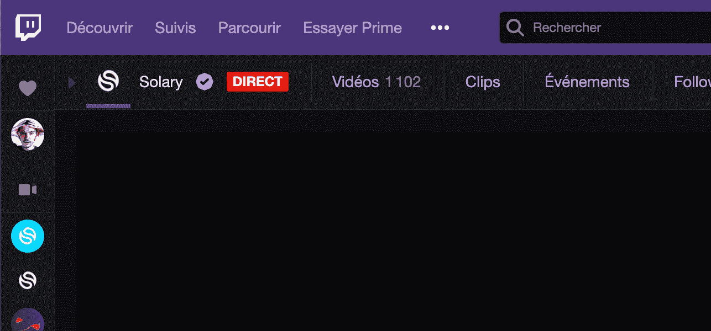
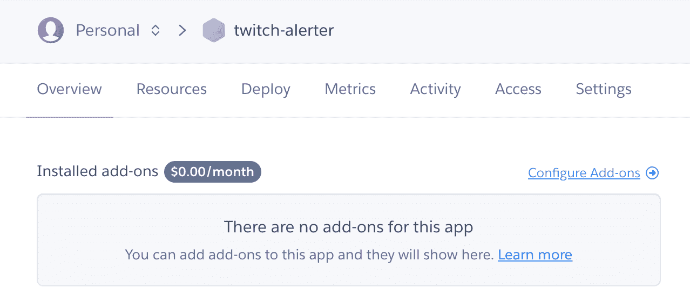
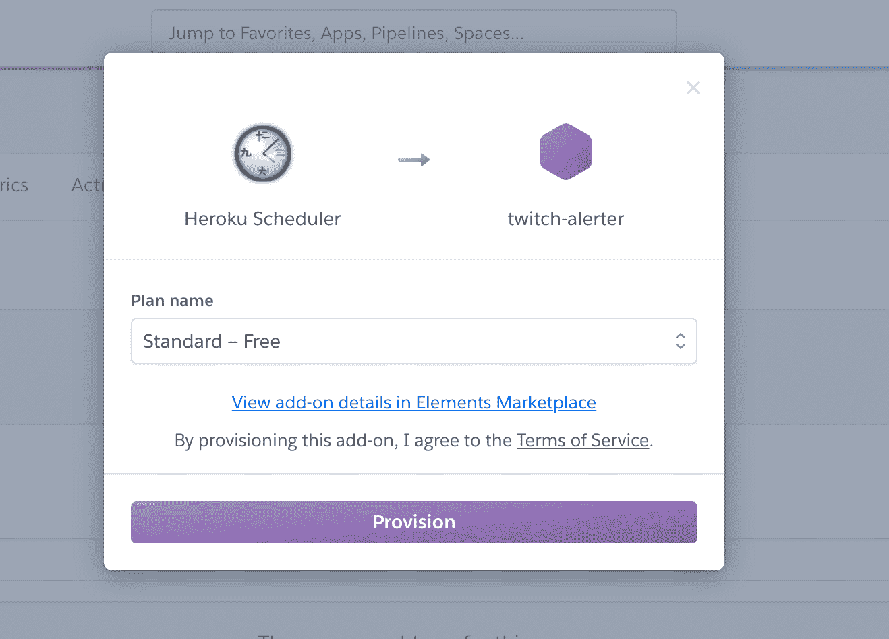
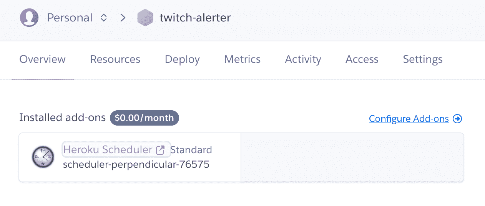

# 一个 30 行代码的 Python 项目:当你最喜欢的 Twitcher 正在播放时，如何设置短信通知

> 原文：<https://www.freecodecamp.org/news/20-lines-of-python-code-get-notified-by-sms-when-your-favorite-team-scores-a-goal/>

大家好:)今天，我将开始一个专门针对 Python 初学者的新系列帖子。这个概念相当简单:我将用尽可能少的代码做一个有趣的项目，并尝试尽可能多的新工具。

例如，今天我们将学习使用 Twilio API，Twitch API，我们将看到如何在 Heroku 上部署项目。我将向您展示如何拥有自己的“Twitch Live”短信通知程序，30 行代码，每月 12 美分。

**先决条件**:你只需要知道如何在你的机器上运行 Python，以及 git 中的一些基本命令(commit & push)。如果你需要这些方面的帮助，我可以向你推荐这两篇文章:

[Python 3 安装&安装指南](https://realpython.com/installing-python/)

[初学者的终极 Git 命令教程](https://www.freecodecamp.org/news/git-commands/)来自 [Adrian Hajdin](https://www.freecodecamp.org/news/author/adrianhajdin/) 。

**你将学到什么**:

*   Twitch API
*   Twilio API
*   在 Heroku 部署
*   在 Heroku 上设置调度程序

**您将构建什么:**

规范很简单:我们希望在某个特定的 Twitcher 正在直播时收到短信。我们想知道这个人什么时候上线，什么时候离开流媒体。我们想让这整个事情自己运行，一整天。

我们将把这个项目分为 3 个部分。首先，我们将看到如何以编程方式知道某个特定的 Twitcher 是否在线。然后，我们将看到当这种情况发生时，如何接收短信。最后，我们将看看如何让这段代码每 X 分钟运行一次，这样我们就不会错过我们最喜欢的 streamer 的另一个时刻。

# 这个 Twitcher 是直播的吗？

要知道 Twitcher 是否是实时的，我们可以做两件事:我们可以访问 Twitcher 的 URL 并尝试查看标记“实时”是否在那里。



Screenshot of a Twitcher live streaming.

这个过程涉及到抓取，在 Python 中不到 20 行代码是不容易做到的。Twitch 运行大量 JS 代码，一个简单的 request.get()是不够的。

对于抓取工作，在这种情况下，我们需要在 Chrome 中抓取该页面，以获得与您在截图中看到的内容相同的内容。这是可行的，但是需要的代码远不止 30 行。如果你想了解更多，不要犹豫，看看我最近的[网页抓取而不被屏蔽指南](https://www.daolf.com/posts/avoiding-being-blocked-while-scraping-ultimate-guide/)。(我最近推出了 ScrapingBee，这是一款[的网络抓取工具](https://www.scrapingbee.com/blog/web-scraping-tools/)，因此我对这个领域有所了解；))

因此，我们将使用他们的 API，而不是尝试使用 Twitch。对于那些不熟悉这个术语的人来说，API 是一个编程接口，它允许网站向任何人(主要是开发者)公开它们的特性和数据。在 Twitch 的例子中，他们的 API 是通过 HTTP 公开的，这意味着我们可以通过简单的 HTTP 请求获得大量信息并做很多事情。

## 获取您的 API 密钥

为此，您必须首先创建一个 Twitch API 键。许多服务对它们的 API 实施认证，以确保没有人滥用它们，或者限制某些人对某些特性的访问。

请按照以下步骤获取您的 API 密钥:

*   创建一个 Twitch 帐户
*   现在创建一个 Twitch [开发账户](https://dev.twitch.tv/) - >“注册 Twitch”右上角
*   登录后，转到您的“仪表板”
*   "注册您的应用程序"
*   名称->随便，Oauth 重定向 URL -> http://localhost，类别->随便

现在，您应该会在屏幕底部看到您的客户端 id。这个留着以后用。

## 那个 Twitcher 现在是流媒体吗？

有了 API 密匙，我们现在可以查询 Twitch API 以获得我们想要的信息，所以让我们开始编码。下面的代码片段使用正确的参数使用 Twitch API 并打印响应。

```
# requests is the go to package in python to make http request
# https://2.python-requests.org/en/master/
import requests

# This is one of the route where Twich expose data, 
# They have many more: https://dev.twitch.tv/docs
endpoint = "https://api.twitch.tv/helix/streams?"

# In order to authenticate we need to pass our api key through header
headers = {"Client-ID": "<YOUR-CLIENT-ID>"}

# The previously set endpoint needs some parameter, here, the Twitcher we want to follow
# Disclaimer, I don't even know who this is, but he was the first one on Twich to have a live stream so I could have nice examples
params = {"user_login": "Solary"}

# It is now time to make the actual request
response = request.get(endpoint, params=params, headers=headers)
print(response.json())
```

输出应该如下所示:

```
{
   'data':[
      {
         'id':'35289543872',
         'user_id':'174955366',
         'user_name':'Solary',
         'game_id':'21779',
         'type':'live',
         'title':"Wakz duoQ w/ Tioo - GM 400LP - On récupère le chall après les -250LP d'inactivité !",
         'viewer_count':4073,
         'started_at':'2019-08-14T07:01:59Z',
         'language':'fr',
         'thumbnail_url':'https://static-cdn.jtvnw.net/previews-ttv/live_user_solary-{width}x{height}.jpg',
         'tag_ids':[
            '6f655045-9989-4ef7-8f85-1edcec42d648'
         ]
      }
   ],
   'pagination':{
      'cursor':'eyJiIjpudWxsLCJhIjp7Ik9mZnNldCI6MX19'
   }
}
```

这种数据格式被称为 JSON，易于阅读。`data`对象是一个包含所有当前活动流的数组。键`type`确保流当前是`live`。否则，该键将为空(例如，在出错的情况下)。

因此，如果我们想在 Python 中创建一个布尔变量来存储当前用户是否正在流式传输，我们只需在代码中添加以下内容:

```
json_response = response.json()

# We get only streams
streams = json_response.get('data', [])

# We create a small function, (a lambda), that tests if a stream is live or not
is_active = lambda stream: stream.get('type') == 'live'
# We filter our array of streams with this function so we only keep streams that are active
streams_active = filter(is_active, streams)

# any returns True if streams_active has at least one element, else False
at_least_one_stream_active = any(streams_active)

print(at_least_one_stream_active)
```

此时，当您最喜欢的 Twitcher 是 live 时，`at_least_one_stream_active`为真。

现在让我们看看如何通过短信获得通知。

# 给我发短信，现在！

因此，要向我们自己发送文本，我们将使用 Twilio API。只需到[那里](https://www.twilio.com/try-twilio)去创建一个账户。当要求确认您的电话号码时，请使用您希望在此项目中使用的电话号码。这样你就可以使用 Twilio 提供给新用户的 15 美元免费信用。一条短信大约 1 美分，足够你的机器人运行一年了。

如果你去[控制台](https://www.twilio.com/console)，你会看到你的`Account SID`和你的`Auth Token`，留着以后用。也点击红色的大按钮“获取我的试用号”，按照步骤，并保存这个稍后。

用 Twilio Python API 发送文本非常容易，因为他们提供了一个包来帮你做这些烦人的事情。用`pip install Twilio`安装软件包，只需:

```
from twilio.rest import Client
client = Client(<Your Account SID>, <Your Auth Token>)
client.messages.create(
	body='Test MSG',from_=<Your Trial Number>,to=<Your Real Number>) 
```

这就是你给自己发一条短信所需要的，很棒吧？

# 把所有东西放在一起

我们现在将所有内容放在一起，并稍微缩短代码，这样我们就可以说 Python 代码不到 30 行。

```
import requests
from twilio.rest import Client
endpoint = "https://api.twitch.tv/helix/streams?"
headers = {"Client-ID": "<YOUR-CLIENT-ID>"}
params = {"user_login": "Solary"}
response = request.get(endpoint, params=params, headers=headers)
json_response = response.json()
streams = json_response.get('data', [])
is_active = lambda stream:stream.get('type') == 'live'
streams_active = filter(is_active, streams)
at_least_one_stream_active = any(streams_active)
if at_least_one_stream_active:
    client = Client(<Your Account SID>, <Your Auth Token>)
	client.messages.create(body='LIVE !!!',from_=<Your Trial Number>,to=<Your Real Number>)
```

Still have 16 lines left!

# 避免双重通知

这个片段工作得很好，但是如果这个片段每分钟都在服务器上运行，一旦我们最喜欢的 Twitcher 上线，我们就会每分钟收到一条短信。

我们需要一种方法来存储这样的事实，即我们已经被通知我们的 Twitcher 是活的，并且我们不再需要被通知。

Twilio API 的好处是，它提供了一种检索我们的消息历史的方法，所以我们只需检索我们发送的最后一条短信，看看我们是否已经发送了一条通知我们 twitcher 是活动的文本。

这里我们要用伪代码做的是:

```
if favorite_twitcher_live and last_sent_sms is not live_notification:
	send_live_notification()
if not favorite_twitcher_live and last_sent_sms is live_notification:
	send_live_is_over_notification()
```

这样，我们将在流开始时以及结束时收到文本。这样我们就不会收到垃圾邮件——很好，对吧？我们来编码一下:

```
# reusing our Twilio client
last_messages_sent = client.messages.list(limit=1)
last_message_id = last_messages_sent[0].sid
last_message_data = client.messages(last_message_id).fetch()
last_message_content = last_message_data.body
```

现在让我们把所有的东西重新放在一起:

```
import requests
from twilio.rest import Client
client = Client(<Your Account SID>, <Your Auth Token>)

endpoint = "https://api.twitch.tv/helix/streams?"
headers = {"Client-ID": "<YOUR-CLIENT-ID>"}
params = {"user_login": "Solary"}
response = request.get(endpoint, params=params, headers=headers)
json_response = response.json()
streams = json_response.get('data', [])
is_active = lambda stream:stream.get('type') == 'live'
streams_active = filter(is_active, streams)
at_least_one_stream_active = any(streams_active)

last_messages_sent = client.messages.list(limit=1)
if last_messages_sent:
	last_message_id = last_messages_sent[0].sid
	last_message_data = client.messages(last_message_id).fetch()
	last_message_content = last_message_data.body
    online_notified = "LIVE" in last_message_content
    offline_notified = not online_notified
else:
	online_notified, offline_notified = False, False

if at_least_one_stream_active and not online_notified:
	client.messages.create(body='LIVE !!!',from_=<Your Trial Number>,to=<Your Real Number>)
if not at_least_one_stream_active and not offline_notified:
	client.messages.create(body='OFFLINE !!!',from_=<Your Trial Number>,to=<Your Real Number>)
```

瞧！

现在你有了一段不到 30 行的 Python 代码，当你最喜欢的 Twitcher 上线/下线时，它会马上给你发一条短信，而不会给你发垃圾邮件。

我们现在只需要每隔 X 分钟运行一次这个代码片段。

# 寻找宿主

为了托管和运行这个片段，我们将使用 Heroku。老实说，Heroku 是在网络上托管应用程序最简单的方式之一。缺点是，与其他解决方案相比，它非常昂贵。对我们来说幸运的是，他们有一个慷慨的免费计划，可以让我们几乎免费做我们想做的事情。

如果你还没有，你需要创建一个 [Heroku 账户](https://www.heroku.com/)。你还需要[下载并安装 Heroku 客户端](https://devcenter.heroku.com/articles/heroku-cli#download-and-install)。

现在你必须将你的 Python 脚本移动到它自己的文件夹中，不要忘记在其中添加一个`requirements.txt`文件。后者的内容是这样开始的:

```
requests
twilio
```

This is to ensure that Heroku downloads the correct dependencies.

`cd`进入这个文件夹，然后做一个“heroku create - app < app name >”。

如果你打开你的[应用仪表板](https://dashboard.heroku.com/apps)，你会看到你的新应用。

我们现在需要初始化一个 git repo，并将代码推送到 Heroku 上:

```
git init
heroku git:remote -a <app name>
git add .
git commit -am 'Deploy breakthrough script'
git push heroku master
```

你的应用程序现在已在 Heroku 上，但没有任何作用。由于这个小脚本不能接受 HTTP 请求，所以去`<app name>.herokuapp.com`不会做任何事情。但这应该不是问题。

为了让这个脚本全天候运行，我们需要使用一个简单的 Heroku 插件“Heroku Scheduler”。若要安装此加载项，请单击应用仪表板上的“配置加载项”按钮。



然后，在搜索栏上，查找 Heroku Scheduler:


单击结果，然后单击“供应”



如果你回到你的应用仪表板，你会看到附加组件:



单击“Heroku Scheduler”链接来配置作业。然后点击“创建工单”。在此选择“10 分钟”,对于运行命令，选择“python <name_of_your_script>.py”。单击“保存作业”。</name_of_your_script>

虽然我们目前在 Heroku 上使用的所有东西都是免费的，但是 Heroku 调度程序将在$ 25/月的实例上运行该作业，但是按比例分配给第二个实例。因为这个脚本大约需要 3 秒钟运行，所以这个脚本每 10 分钟运行一次，你每个月只需要花 12 美分。

# 改进的想法

我希望你喜欢这个项目，你有乐趣把它放在适当的位置。在不到 30 行的代码中，我们做了很多，但这一切都远非完美。以下是一些改进它的想法:

*   向自己发送有关当前流媒体的更多信息(玩的游戏、观看人数...)
*   一旦 twitcher 离线，发送自己最后一个流的持续时间
*   不给你发短信，而是发邮件
*   同时监控多个抽搐者

如果你有更多的想法，请不要犹豫，在评论中告诉我。

# 结论

我希望你喜欢这篇文章，并且在阅读中有所收获。我真的相信这种项目是学习新工具和新概念的最好方式之一，我最近发布了一个[网络抓取 API](https://www.scrapingninja.co) ，在制作它的过程中我学到了很多。

请在评论中告诉我你是否喜欢这种形式，以及你是否想做更多。

我有很多其他的想法，希望你会喜欢。不要犹豫，分享你用这个片段构建的其他东西，可能性是无限的。

快乐编码。

皮尔

## 不想错过我的下一篇文章:

你可以在这里订阅我的时事通讯。