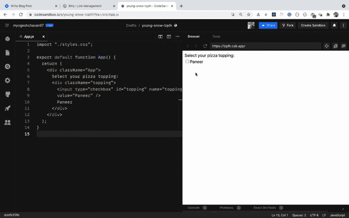
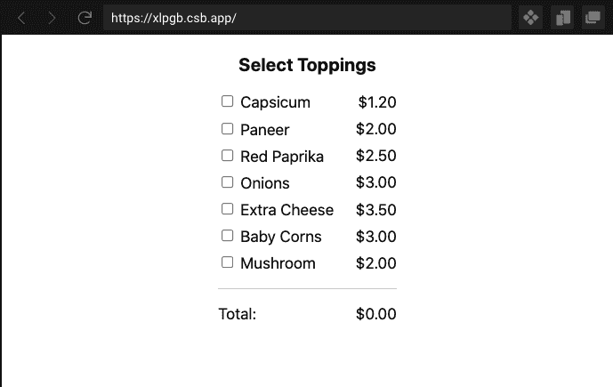
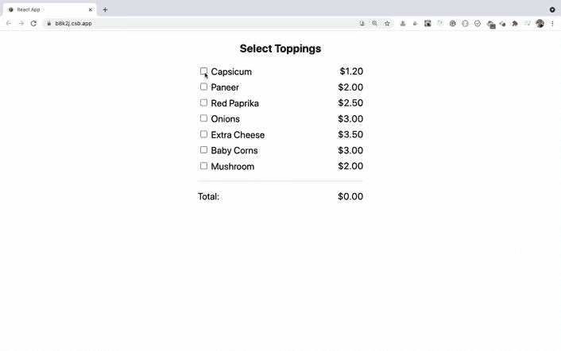

# React 教程–如何使用多个复选框

> 原文：<https://www.freecodecamp.org/news/how-to-work-with-multiple-checkboxes-in-react/>

在 React 中处理多个复选框与使用常规 HTML 复选框完全不同。

因此，在本文中，我们将了解如何在 React 中使用多个复选框。

您将了解到:

*   如何在 React 中将复选框用作受控输入
*   如何使用数组映射和 reduce 方法进行复杂计算
*   如何创建一个预先填充了特定值的特定长度的数组

还有更多。

这篇文章是我[掌握 Redux](https://master-redux.yogeshchavan.dev/) 课程的一部分。这是我们将在课程中构建的应用程序的[预览。](https://www.youtube.com/watch?v=izSw74H08Bc)

所以让我们开始吧。

## 如何使用单个复选框

让我们先从单个复选框功能开始，然后再讨论多个复选框。

在本文中，我将使用 React Hooks 语法来创建组件。因此，如果你不熟悉 React 钩子，可以看看我的[介绍 React 钩子](https://levelup.gitconnected.com/an-introduction-to-react-hooks-50281fd961fe?source=friends_link&sk=89baff89ec8bc637e7c13b7554904e54)的文章。

看看下面的代码:

```
<div className="App">
  Select your pizza topping:
  <div className="topping">
    <input type="checkbox" id="topping" name="topping" value="Paneer" />Paneer
  </div>
</div> 
```

这里有一个[代码沙盒演示](https://codesandbox.io/s/young-snow-lzplh?file=/src/App.js)。

在上面的代码中，我们只声明了一个复选框，类似于我们声明 HTML 复选框的方式。

因此，我们可以轻松选中和取消选中复选框，如下所示:



但是要在屏幕上显示它是否被选中，我们需要将其转换为受控输入。

在 React 中，受控输入由状态管理，因此只能通过更改与该输入相关的状态来更改输入值。

看看下面的代码:

```
export default function App() {
  const [isChecked, setIsChecked] = useState(false);

  const handleOnChange = () => {
    setIsChecked(!isChecked);
  };

  return (
    <div className="App">
      Select your pizza topping:
      <div className="topping">
        <input
          type="checkbox"
          id="topping"
          name="topping"
          value="Paneer"
          checked={isChecked}
          onChange={handleOnChange}
        />
        Paneer
      </div>
      <div className="result">
        Above checkbox is {isChecked ? "checked" : "un-checked"}.
      </div>
    </div>
  );
} 
```

这里有一个[代码沙盒演示](https://codesandbox.io/s/dazzling-oskar-qcil8?file=/src/App.js)。

在上面的代码中，我们已经使用`useState`钩子用初始值`false`声明了组件中的`isChecked`状态:

```
const [isChecked, setIsChecked] = useState(false); 
```

然后对于输入复选框，我们给了两个额外的道具`checked`和`onChange`，如下所示:

```
<input
  ...
  checked={isChecked}
  onChange={handleOnChange}
/> 
```

每当我们点击复选框时，就会调用`handleOnChange`处理函数，我们用它来设置`isChecked`状态的值。

```
const handleOnChange = () => {
  setIsChecked(!isChecked);
}; 
```

因此，如果复选框被选中，我们将把`isChecked`值设置为`false`。但是如果复选框未被选中，我们将使用`!isChecked`将值设置为`true`。然后，我们将该值传递给属性`checked`的输入复选框。

通过这种方式，输入复选框成为受控输入，其值由状态管理。

注意，在 React 中，即使代码看起来很复杂，也总是建议对输入字段使用受控输入。这保证了输入更改只发生在`onChange`处理程序内部。

输入的状态不会以任何其他方式改变，您将始终获得输入状态的正确和更新的值。

只有在极少数情况下，您可以使用 React ref 以不受控制的方式使用输入。

## 如何处理多个复选框

现在，让我们看看如何处理多个复选框。

看看[这个代码沙盒演示](https://codesandbox.io/s/mystifying-tu-xlpgb?file=/src/App.js)。



在这里，我们显示了浇头列表及其相应的价格。根据选择的浇头，我们需要显示总量。

以前，对于单个复选框，我们只有`isChecked`状态，并基于此更改复选框的状态。

但是现在我们有很多复选框，所以为每个复选框添加多个`useState`调用是不实际的。

所以让我们在 state 中声明一个数组，指示每个复选框的状态。

要创建一个长度等于复选框数量的数组，我们可以像这样使用 array `fill`方法:

```
const [checkedState, setCheckedState] = useState(
    new Array(toppings.length).fill(false)
); 
```

这里，我们声明了一个带有初始值的状态，作为一个填充了值`false`的数组。

因此，如果我们有 5 个顶层，那么`checkedState`状态数组将包含 5 个`false`值，如下所示:

```
[false, false, false, false, false] 
```

一旦我们选中/取消选中复选框，我们会将相应的`false`更改为`true`，将`true`更改为`false`。

这里是最后一个[代码沙盒演示](https://codesandbox.io/s/wild-silence-b8k2j?file=/src/App.js)。

完整的`App.js`代码如下所示:

```
import { useState } from "react";
import { toppings } from "./utils/toppings";
import "./styles.css";

const getFormattedPrice = (price) => `$${price.toFixed(2)}`;

export default function App() {
  const [checkedState, setCheckedState] = useState(
    new Array(toppings.length).fill(false)
  );

  const [total, setTotal] = useState(0);

  const handleOnChange = (position) => {
    const updatedCheckedState = checkedState.map((item, index) =>
      index === position ? !item : item
    );

    setCheckedState(updatedCheckedState);

    const totalPrice = updatedCheckedState.reduce(
      (sum, currentState, index) => {
        if (currentState === true) {
          return sum + toppings[index].price;
        }
        return sum;
      },
      0
    );

    setTotal(totalPrice);
  };

  return (
    <div className="App">
      <h3>Select Toppings</h3>
      <ul className="toppings-list">
        {toppings.map(({ name, price }, index) => {
          return (
            <li key={index}>
              <div className="toppings-list-item">
                <div className="left-section">
                  <input
                    type="checkbox"
                    id={`custom-checkbox-${index}`}
                    name={name}
                    value={name}
                    checked={checkedState[index]}
                    onChange={() => handleOnChange(index)}
                  />
                  <label htmlFor={`custom-checkbox-${index}`}>{name}</label>
                </div>
                <div className="right-section">{getFormattedPrice(price)}</div>
              </div>
            </li>
          );
        })}
        <li>
          <div className="toppings-list-item">
            <div className="left-section">Total:</div>
            <div className="right-section">{getFormattedPrice(total)}</div>
          </div>
        </li>
      </ul>
    </div>
  );
} 
```

让我们明白我们在这里做什么。

我们已经声明了 input 复选框，如下所示:

```
<input
  type="checkbox"
  id={`custom-checkbox-${index}`}
  name={name}
  value={name}
  checked={checkedState[index]}
  onChange={() => handleOnChange(index)}
/> 
```

这里，我们添加了一个`checked`属性，它具有来自`checkedState`状态的`true`或`false`的相应值。因此每个复选框都有正确的选中状态值。

我们还添加了一个`onChange`处理程序，并且我们将复选框的`index`传递给了`handleOnChange`方法。

`handleOnChange`处理程序方法如下所示:

```
const handleOnChange = (position) => {
  const updatedCheckedState = checkedState.map((item, index) =>
    index === position ? !item : item
  );

  setCheckedState(updatedCheckedState);

  const totalPrice = updatedCheckedState.reduce(
    (sum, currentState, index) => {
      if (currentState === true) {
        return sum + toppings[index].price;
      }
      return sum;
    },
    0
  );

  setTotal(totalPrice);
}; 
```

在这里，我们首先使用 array `map`方法遍历`checkedState`数组。如果传递的`position`参数的值与当前的`index`匹配，那么我们反转它的值。然后，如果值是`true`，它将使用`!item`转换为`false`，如果值是`false`，它将转换为`true`。

如果`index`与所提供的`position`参数不匹配，那么我们不会反转它的值，而只是按原样返回值。

```
const updatedCheckedState = checkedState.map((item, index) =>
  index === position ? !item : item
);

// the above code is the same as the below code

const updatedCheckedState = checkedState.map((item, index) => {
  if (index === position) {
    return !item;
  } else {
    return item;
  }
}); 
```

我使用三元运算符`?:`是因为它使代码更短，但是您可以使用任何数组方法。

如果你不熟悉像`map`或`reduce`这样的数组方法是如何工作的，那么看看[这篇我写的文章](https://www.freecodecamp.org/news/complete-introduction-to-the-most-useful-javascript-array-methods/)。

接下来，我们将把`checkedState`数组设置为`updatedCheckedState`数组。这很重要，因为如果您不更新`handleOnChange`处理程序中的`checkedState`状态，那么您将无法选中/取消选中复选框。

这是因为我们使用复选框的`checkedState`值来确定复选框是否被选中(因为它是一个受控输入，如下所示):

```
<input
  type="checkbox"
  ...
  checked={checkedState[index]}
  onChange={() => handleOnChange(index)}
/> 
```

注意，我们已经创建了一个单独的`updatedCheckedState`变量，并将该变量传递给`setCheckedState`函数。我们在`updatedCheckedState`上使用`reduce`方法，而不是在原来的`checkedState`阵列上。

这是因为，默认情况下，用于更新状态的`setCheckedState`函数是异步的。

仅仅因为你调用了`setCheckedState`函数并不能保证你会在下一行得到`checkedState`数组的更新值。

所以我们创建了一个单独的变量，并在`reduce`方法中使用它。

如果你不熟悉状态在 React 中的工作方式，你可以阅读这篇文章。

然后计算总价，我们使用数组`reduce`方法:

```
const totalPrice = updatedCheckedState.reduce(
  (sum, currentState, index) => {
    if (currentState === true) {
      return sum + toppings[index].price;
    }
    return sum;
  },
  0
); 
```

数组`reduce`方法接收四个参数，其中我们只使用了三个:`sum`、`currentState`和`index`。如果你愿意，你可以使用不同的名字，因为它们只是参数。

我们还将传递`0`作为初始值，它也被称为`sum`参数的`accumulator`值。

然后在 reduce 函数中，我们检查`checkedState`数组的当前值是否是`true`。

如果是`true`，这意味着复选框被选中，所以我们使用`sum + toppings[index].price`添加相应的`price`的值。

如果`checkedState`数组的值是`false`，那么我们不增加它的价格，而只是返回之前计算的`sum`的值。

然后我们使用`setTotal(totalPrice)`将`totalPrice`值设置为`total`状态

这样我们就能正确地计算出所选配料的总价，如下图所示。



下面是上面代码沙盒演示的[预览链接](https://b8k2j.csb.app/)自己试试。

### 感谢阅读！

大多数开发人员都很难理解 Redux 是如何工作的。但是每个 React 开发人员都应该知道如何使用 Redux，因为行业项目大多使用 Redux 来管理更大的项目。

所以为了让你轻松，我推出了[掌握 Redux](https://master-redux.yogeshchavan.dev/) 课程。

在本课程中，您将从头开始学习 Redux，还将使用 Redux 从头构建一个完整的[点餐应用](https://www.youtube.com/watch?v=izSw74H08Bc)。

点击下面的图片参加课程，获得限时优惠，还可以免费获得我的流行的掌握现代 JavaScript 书。

[](https://bit.ly/3w0DGum)

**想要了解关于 JavaScript、React、Node.js 的最新常规内容吗？[在 LinkedIn 上关注我](https://www.linkedin.com/in/yogesh-chavan97/)。**