# 如何在两个小时内构建一个全功能的无服务器应用程序

> 原文：<https://www.freecodecamp.org/news/how-to-build-a-serverless-app/>

如果你想深入研究无服务器全栈应用，你来对地方了。

这篇文章将指导你建立自己的链接缩短器。接下来，我们将使用 TypeScript，React。JS，还有 MongoDB。为了利用无服务器处理，我们将把它部署到 Vercel。

你可以在最后的总结里找到 ****代号**** 和 ****视频**** 。

## 你将从这篇文章中学到什么

这不是另一篇只展示如何引导 Next 的文章。JS 应用程序并添加两个简单的页面。我将向您展示如何构建一个合适的应用程序。

它将是全功能的链接缩短器——你可以自己使用它，甚至与你的朋友分享，这样他们也可以缩短他们的链接。

该应用程序将在数据库中存储链接，并遵循外部网站的重定向。这意味着您将学习将来构建其他无服务器应用程序所需的所有知识。

根据您的经验和先前的知识，您可能需要一两个小时来完成本教程。我录了一段 [YouTube 教程(9 段视频——每段 7-10 分钟)](https://www.youtube.com/watch?v=IkATIunl_wE&list=PLbI79WtxN-IpgA_HaJ5j1jR1Zt_EAVasZ)，所以我的估计就是这么来的。

如何处理这个过程取决于你自己。如果你想让它变得更快，你可以在我的 Github 上找到代码——只需分叉它，并部署它 Vercel。不会超过 15 分钟。

最终结果将如下所示:

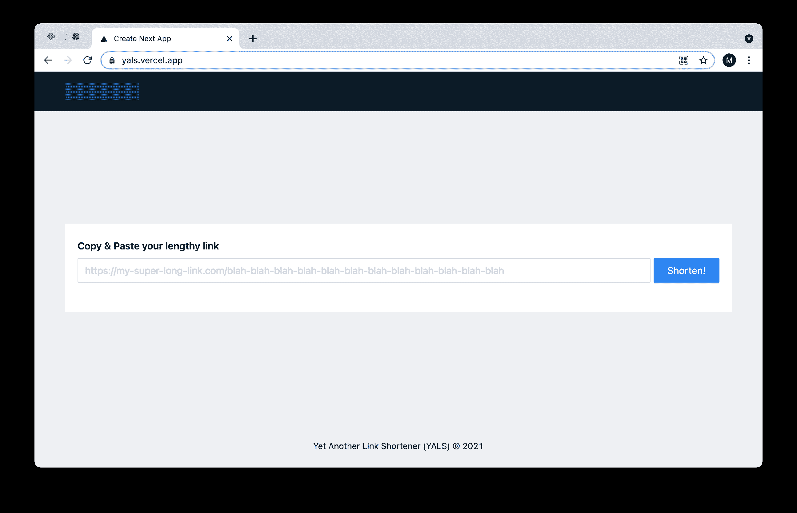

你可以在这里尝试一下。

## 先决条件

本教程需要一些节点基础知识，仅仅是基础知识。在遵循本文的说明之前，您还应该知道如何使用 Git 和 GitHub。

我跳过了关于创建 Git 存储库和将代码推到那里的部分，因为这是常识。如果你不知道如何做到这一点，没关系——只需查看 freeCodeCamp 上的以下教程(它们是免费的！)在您开始遵循本文中的说明之前:

*   [针对初学者的 Git 和 Github](https://www.youtube.com/watch?v=RGOj5yH7evk)。
*   [Learn Node.js -初学者全教程](https://www.youtube.com/watch?v=RLtyhwFtXQA)。

## 我们开始吧！

我们需要创造一个新的未来。JS 项目，我们可以通过在终端中键入以下命令来完成:

```
$ npx create-next-app yals
```

你可以用自己的名字代替 YALS 的缩写。我决定把我的项目叫做这个。首字母缩写代表*又一个链接缩写*。

现在我们将配置我们的项目以支持 TypeScript。当然可以用 Next。JS 没有 TypeScript，但我更喜欢尽可能使用它。

TypeScript 为 JavaScript 代码添加了类型检查，它为我打开了一个新的世界。我的开发速度提高了，因为我不再需要检查每个变量的类型。我犯的错误更少了，节省了以前花在调试上的大量时间。

配置很简单:我们需要创建一个`tsconfig.json`文件，安装 TypeScript，并运行开发服务器:

```
$ cd yals
$ touch tsconfig.json
$ npm install --save-dev typescript @types/react @types/node
$ npm run dev
```

接下来您应该会看到这样的通知。JS 检测到了 TypeScript，它为我们配置了它:

```
> yals@0.1.0 dev
> next dev

ready - started server on 0.0.0.0:3000, url: http://localhost:3000
We detected TypeScript in your project and created a tsconfig.json file for you.
```

可惜，接下来。JS 不会将现有的 JavaScript 文件转换成 TypeScript，所以我们需要自己修改它们。

别担心，只有三个文件。我们需要将所有 React 文件的扩展名改为`.tsx`，将所有其他文件的扩展名改为`.ts`:

```
$ mv pages/index.js pages/index.tsx
$ mv pages/_app.js pages/_app.tsx
$ mv pages/api/hello.js pages/api/hello.ts
```

这就是我们的项目树在变更后的样子:

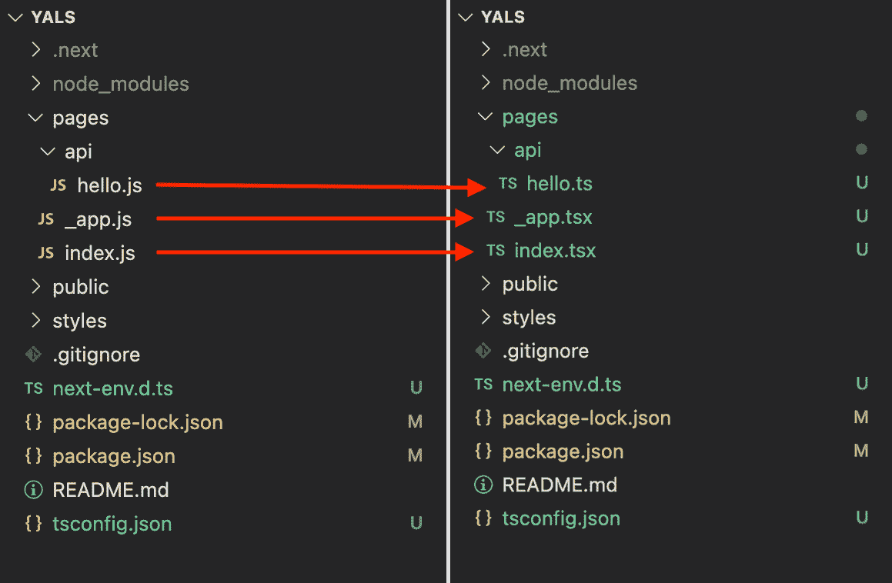

## 用设计系统安装 React UI 库

React 最大的优势之一就是它的社区很棒。该社区创建了大量有用的开源库。

当我开始一个新的 React 项目时，我希望快速进行，并且只关注于构建特定于项目的功能，而不是创建样板文件。我尽可能多地使用现有的库，而不是重新发明轮子。

我总是喜欢使用现有的组件库，而不是从头开始构建自己的组件——至少在原型阶段是这样。

如果你的公司有很多产品，你可以考虑雇佣一个设计师来创建你自己的设计系统。否则，您可以使用一个现有的，并自定义其主题。

最好的库允许你修改组件的外观，比如改变调色板、图标、字体等等。

在本教程中，我决定使用由阿里巴巴构建的免费 UI 库，名为 [Ant Design](https://ant.design/components/overview/) 。这些组件易于使用，并且非常灵活，因此我们可以轻松地根据自己的需求对其进行调整。我也用它来工作，所以学习它不是浪费时间。

要安装 Ant Design，您可以使用 npm 或 yarn。我在本教程中使用 npm:

```
$ npm install --save antd
```

现在，我们可以在主样式文件中导入一个新的设计系统，方法是用以下代码替换内容:

```
# file: https://github.com/mateuszsokola/yals/blob/main/styles/globals.css

@import '~antd/dist/antd.css';
```

您可能会注意到您的应用程序已经更改了样式并使用了另一种字体:

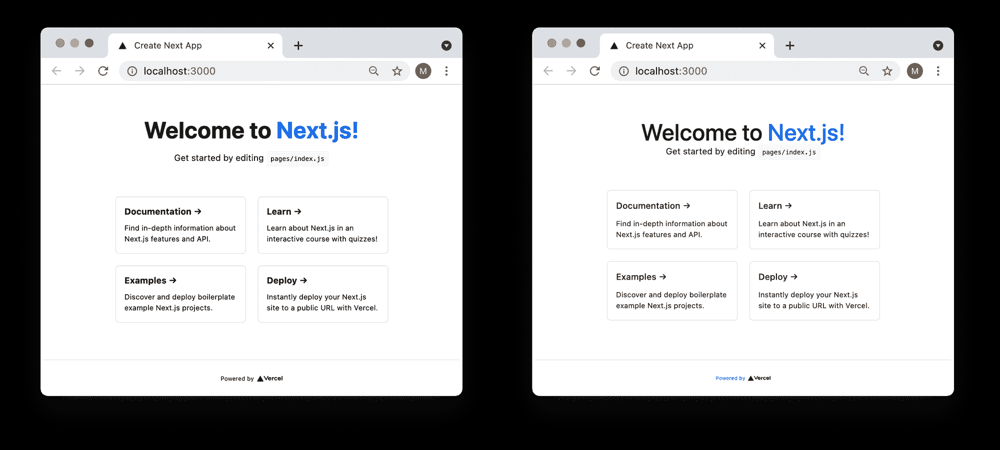

我们还需要安装`axios`。与`fetch`相比，它更像是一个高级的 HTTP 客户端。它支持错误处理和开箱即用的类型。我们不需要自己实现它，所以我们可以直接进入正题。

```
$ npm install --save axios
```

## 如何设计我们的 Web 应用程序

我们的应用程序已经可以开发了。我们将从创建 React 前端开始。我在这里走了一些弯路，因为我想更专注于构建一个无服务器的后端，而不是制作另一个 React 教程。

我将把前端部分的说明保持在最低限度。最后，本教程不是关于在 React 中使用 Ant 设计。

让我们打开`pages/index.tsx`文件，并将下面的代码粘贴到那里:

```
import Head from 'next/head'
import { useState } from 'react';
import axios, { AxiosError } from 'axios';
import { Alert, Button, Form, Input, Layout, Typography } from 'antd'
import styles from '../styles/Home.module.css'

const { Header, Content, Footer } = Layout;
const { Title } = Typography;

type ShortenLinkResponse = {
  short_link: string;
}

type ShortenLinkError = {
  error: string;
  error_description: string;
}

type FormValues = {
  link: string;
}

export default function Home() {
  const [status, setStatus] = useState<'initial' | 'error' | 'success'>('initial');
  const [message, setMessage] = useState('');
  const [form] = Form.useForm();

  const onFinish = async ({ link }: FormValues) => {
    try {
      const response = await axios.post<ShortenLinkResponse>('/api/shorten_link', { link });
      setStatus('success');
      setMessage(response.data?.short_link);
    }
    catch(e) {
      const error = e as AxiosError<ShortenLinkError>;
      setStatus('error');
      setMessage(error.response?.data?.error_description || 'Something went wrong!');
    }
  }

  const onFinishedFailed = () => {
    setStatus('error');
    const error = form.getFieldError('link').join(' ');
    setMessage(error);
  }

  return (
    <Layout>
      <Head>
        <title>Yet Another Link Shortner</title>
        <link rel="icon" href="/favicon.ico" />
      </Head>
      <Header>
        <div className={styles.logo} />
      </Header>
      <Content className={styles.content}>
        <div className={styles.shortner}>
          <Title level={5}>Copy &amp; Paste your lengthy link</Title>
          <Form
            form={form}
            onFinish={onFinish}
            onFinishFailed={onFinishedFailed}
          >
            <div className={styles.linkField}>
              <div className={styles.linkFieldInput}>
                <Form.Item name="link" noStyle rules={[{
                  required: true,
                  message: 'Please paste a correct link',
                  type: 'url',
                }]}>
                  <Input placeholder="https://my-super-long-link.com/blah-blah-blah-blah-blah-blah-blah-blah-blah-blah-blah-blah" size="large"/>
                </Form.Item>
              </div>
              <div className={styles.linkFieldButton}>
                <Form.Item>
                  <Button type="primary" htmlType="submit" style={{ width: '100%' }} size="large">
                    Shorten!
                  </Button>
                </Form.Item>
              </div>
            </div>
          </Form>
          {['error', 'success'].includes(status) && (<Alert showIcon message={message} type={status as 'error' | 'success'} />)}
        </div>
      </Content>
      <Footer className={styles.footer}>
        Yet Another Link Shortener (YALS) &copy; 2021
      </Footer>
    </Layout>
  )
}
```

让我们来看看代码的幕后是什么。该应用程序有三种状态:

*   `initial`–当应用程序被加载，而用户还没有采取任何行动时。
*   `success`——当用户复制粘贴链接后，点击“*缩短*，系统为他们生成一个链接。应用程序将在表单下方呈现一个链接。
*   如果出错，应用程序将在表单下方显示一个错误。例如，如果用户输入了不正确的链接。

我们公开了两种负责处理表单的方法。第一个是`onFinish`，请求我们的 API 生成一个链接。第二个是`onFinishedFailed`，负责显示表单验证错误。

我们不需要自己实现表单验证。Ant Design 附带了一个高级表单组件来为我们处理它。

我们的 web 应用程序的外观和感觉仍然可以改进，让我们给它添加一些样式。我们需要在`styles`目录中创建一个 CSS 文件。我准备叫它`Home.modules.css`。您可以在 IDE 中自己创建一个文件，也可以通过键入以下命令来创建:

```
$ touch styles/Home.module.css
```

现在我们需要添加一些样式:

```
// @file: https://github.com/mateuszsokola/yals/blob/main/styles/Home.module.css
.logo {
  float: left;
  width: 120px;
  height: 30px;
  margin: 16px 24px 16px 0;
  background: rgba(255,255,255,.3);
}

.content {
  display: flex;
  align-items:  center;
  padding: 0 50px;
  min-height: calc(100vh - 64px - 70px);
}

.shortner {
  width: 100%;
  background: #fff;
  padding: 24px 20px;
}

.linkField {
  display: flex;
  width: 100%;
}

.linkFieldInput {
  flex: 100%;
  margin-right: 5px;
}

.linkFieldButton {
  width: 120px;
}

.footer {
  text-align: center;
}
```

这就是你的 web 应用程序现在的样子:

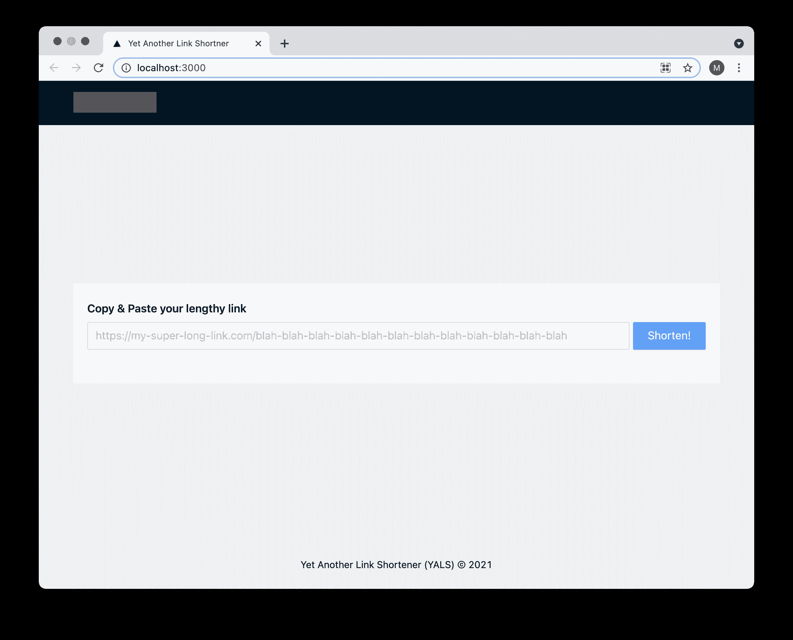

好了，我们的应用程序视图完成了。现在我们可以专注于它背后的业务逻辑。

## 如何创建 MongoDB 数据库

我们已经准备好开始开发我们的后端，但我们需要决定如何存储链接。

我们不能将它们存储在内存中，因为无服务器应用程序在执行后会关闭。这意味着我们的链接将在创建后立即消失。

选择之一是使用云数据库服务。在本教程中，我们将使用 MongoDB，因为它不会在开发人员端产生开销。我们需要创建一个数据库，我们可以立即存储数据。不需要定义表模式和复杂的配置。

我决定把我们的数据库放在 MongoDB Atlas 上，因为他们免费给了我们第一个数据库。

创建您的帐户的过程非常直观，所以我跳过了这一部分。在您登录到您的帐户后，说明开始，您可以看到一个空的数据库仪表板。它应该看起来像下面这样，您需要单击“*构建集群*按钮:

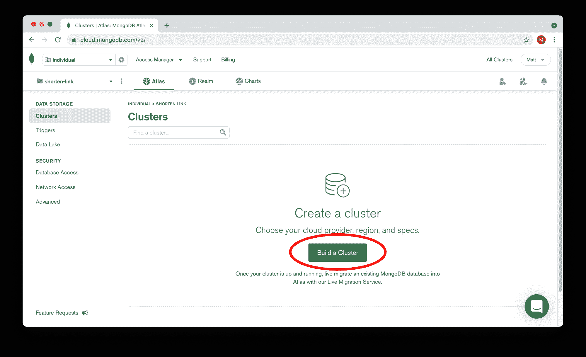

我们将创建一个免费的共享集群:

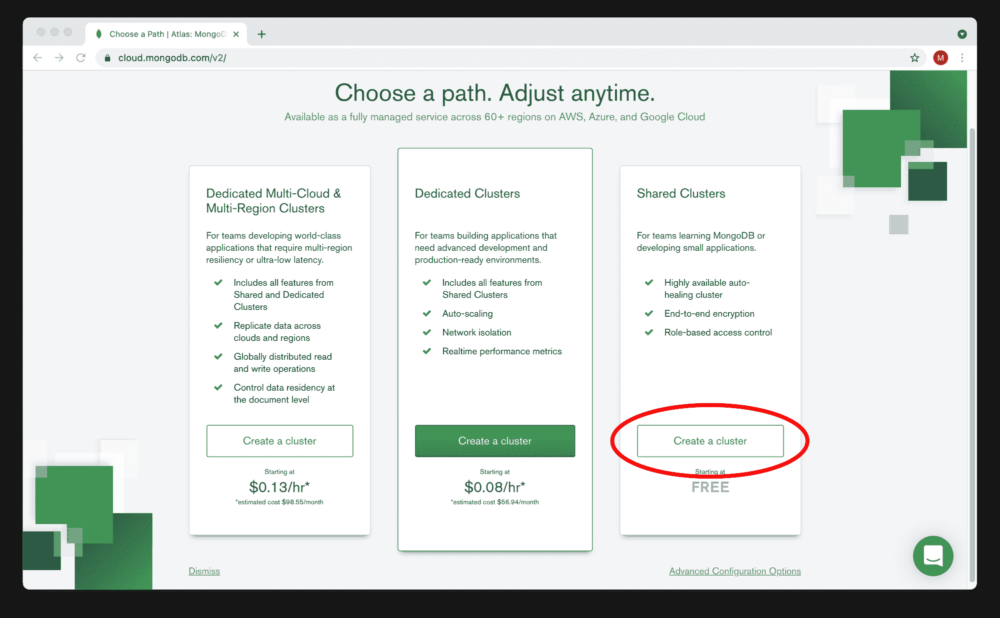

我们将在 Vercel 中托管我们的 web 应用程序。我做了一些快速调查，发现我的其他免费应用程序都在加州的 Vercel 上。所以我需要找到离那个位置最近的集群。我发现他们在加州的微软 Azure 上有一个集群。

这是我选择它们的主要原因，因为减少延迟很重要。如果你想把它放在别的地方，你应该选择离你的主机最近的集群位置。

现在你需要点击三个按钮。请遵循以下相同的顺序:

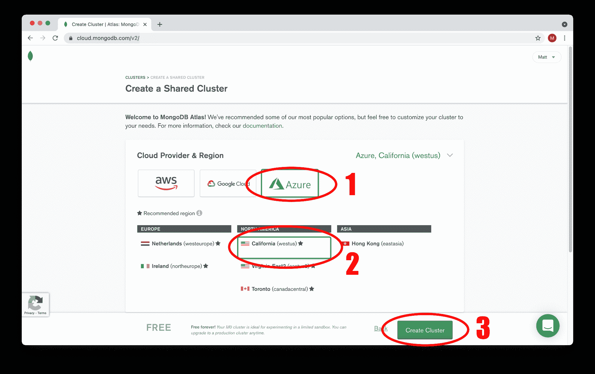

创建群集最多需要三分钟。同时，让我们创建一个数据库用户。只需点击右侧的“*数据库访问*链接:

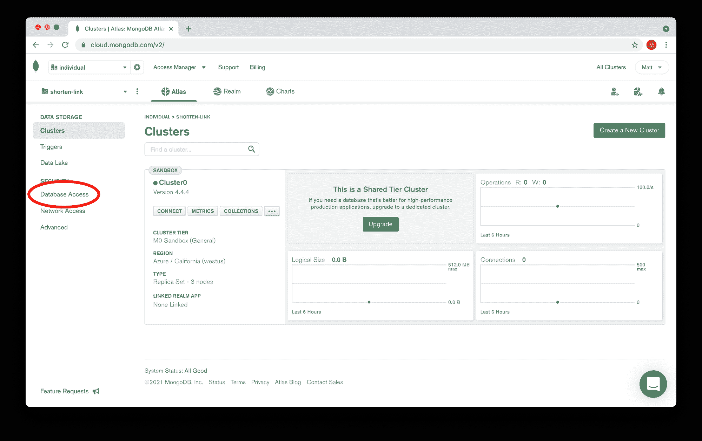

现在我们需要点击"*添加新的数据库用户*按钮:

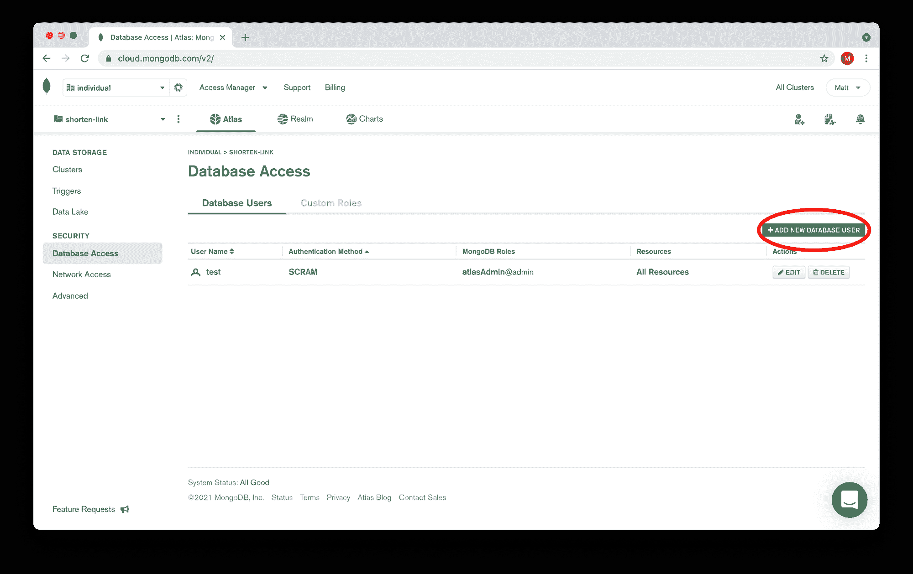

我们需要填写简单的表格。我们选择“*密码*作为认证方式。填写您的用户名和密码(我们稍后会用到，所以请记下来)。完成表格后，点击“*添加用户*按钮:

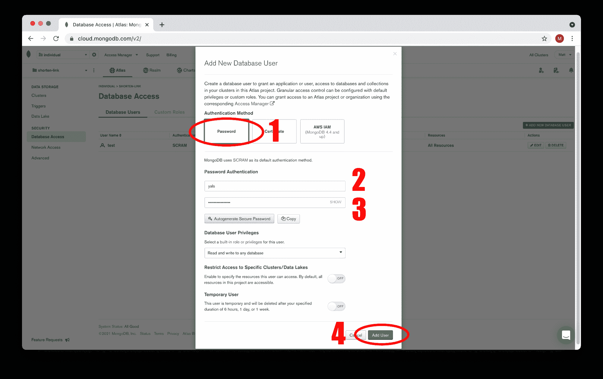

现在，我们可以将连接字符串复制到数据库中。我们需要点击“*连接*按钮。

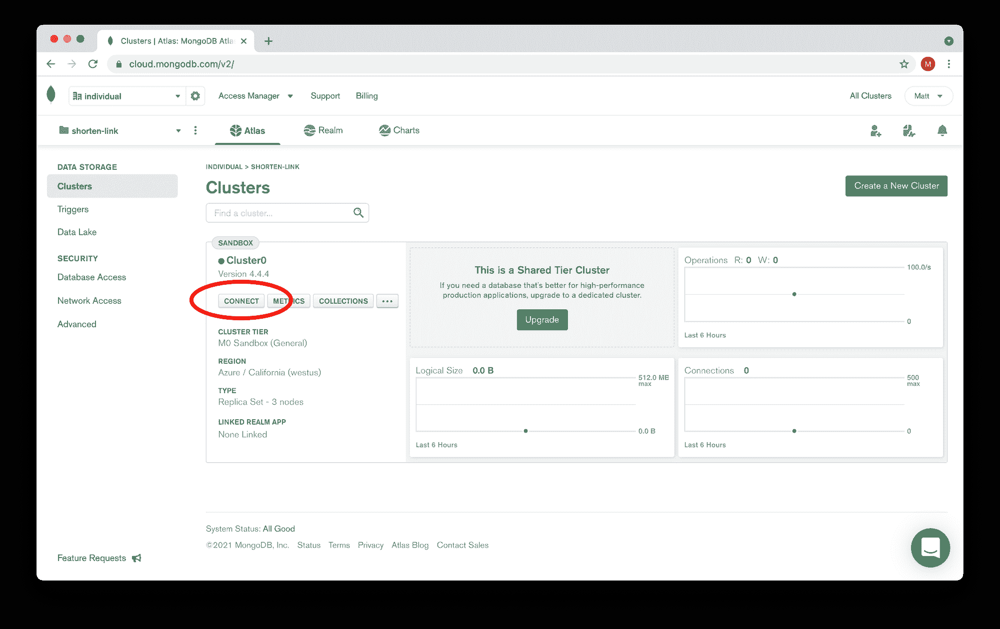

选择*连接您的应用程序*:

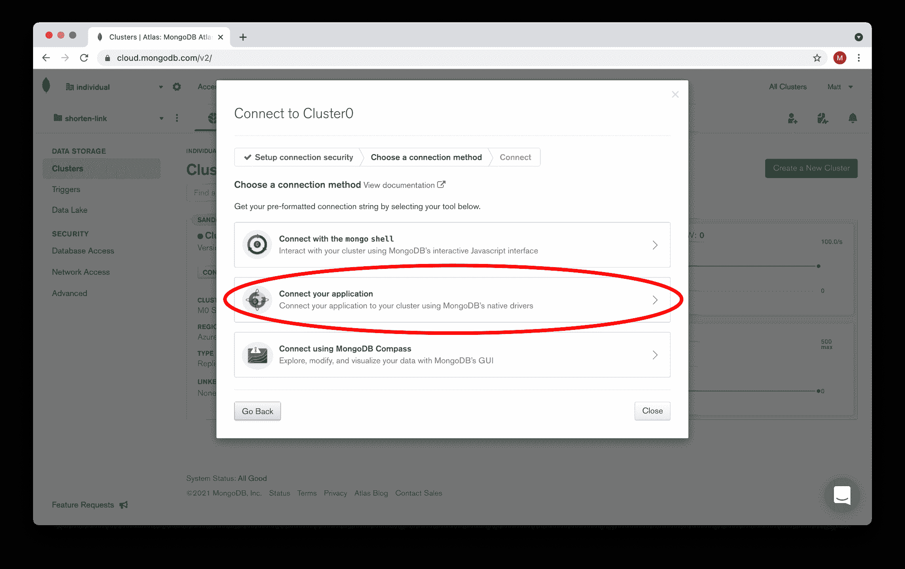

现在我们可以复制我们的连接字符串:

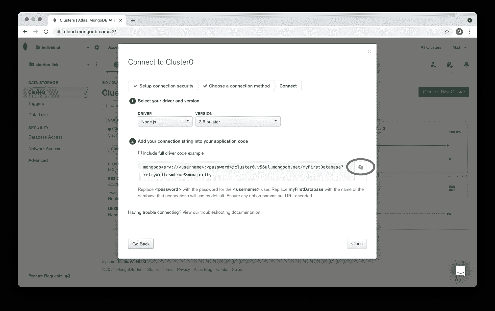

您的剪贴板上有连接字符串，所以现在我们需要在您的项目中创建`.env`文件。您可以通过在终端中运行以下命令来实现:

```
$ touch .env
$ touch .env.local
```

现在我们需要添加一个新变量:

```
# file: https://github.com/mateuszsokola/yals/blob/main/.env

MONGODB_URI=""
```

我们需要将相似的内容放入`.env.local`中，但有一点不同。这次我们将把我们的连接字符串粘贴到那里。**记得填写你之前创建的用户名和密码**。

```
# file: THIS FILE WILL NOT BE PUSHED INTO THE GITHUB REPOSITORY

MONGODB_URI="mongodb+srv://<username>:<password>@cluster0.v56ul.mongodb.net/myFirstDatabase?retryWrites=true&w=majority"
```

我创建了两个文件(`.env`和`.env.local`)，以防你想把代码放到一个公共的 GitHub 库中。`.env.local`被忽略，所以它不会被推入那里。这意味着我们不会向公众泄露您的用户名和密码。请记住这一点，千万不要将它们添加到`.env`文件中！

让我们重新启动开发服务器来检查下一步。JS 检测新变量。

```
Ctrl + C
$ npm run dev
```

如果您可以看到日志告诉您两个加载了变量的文件，那么它正在工作:

```
ready - started server on 0.0.0.0:3000, url: http://localhost:3000
info  - Loaded env from /Users/msokola/code/own/yals/.env.local
info  - Loaded env from /Users/msokola/code/own/yals/.env
event - compiled successfully
```

现在我们需要安装一个 MongoDB 适配器，这样我们就可以在数据库上执行命令。让我们安装两个新的软件包:

```
$ npm install --save mongodb
$ npm install --save-dev @types/mongodb
```

我们解决了所有的依赖性，并且可以将应用程序挂接到 MongoDB 中。让我们在`pages/api`目录中创建一个`_connector.ts`文件:

```
$ touch pages/api/_connector.ts
```

现在，我们需要在那里编写以下代码:

```
import { MongoClient } from 'mongodb';

let cachedDb;

export async function connectToDatabase() {
  if (cachedDb) {
    return cachedDb;
  }
  const client = new MongoClient(process.env.MONGODB_URI, { useNewUrlParser: true, useUnifiedTopology: true });

  cachedDb = client;
  return await client.connect();
}
```

让我们看看代码做了什么。它检查与数据库的连接是否存在，如果不存在，代码将建立连接。

密切注意`MONGODB_URI`变量。它的值来自您之前创建的`.env.local`文件。多亏了环境变量，我们避免了在代码中保存配置。

下一个。JS 创建了一个名为`hello`的示例 API。我们将把我们的连接器挂在那里，以验证我们是否可以建立到数据库的连接。

我们打开`pages/api/hello.ts`，调用回调里面的`connectToDatabase`。最终结果应该是这样的:

```
import { connectToDatabase } from "./_connector";

export default async (req, res) => {
  await connectToDatabase();

  res.status(200).json({ name: 'John Doe' })
} 
```

现在您可以启动您的开发服务器，并在浏览器中打开这个 URL:[http://localhost:3000/API/hello](http://localhost:3000/api/hello)。您应该会看到以下屏幕:

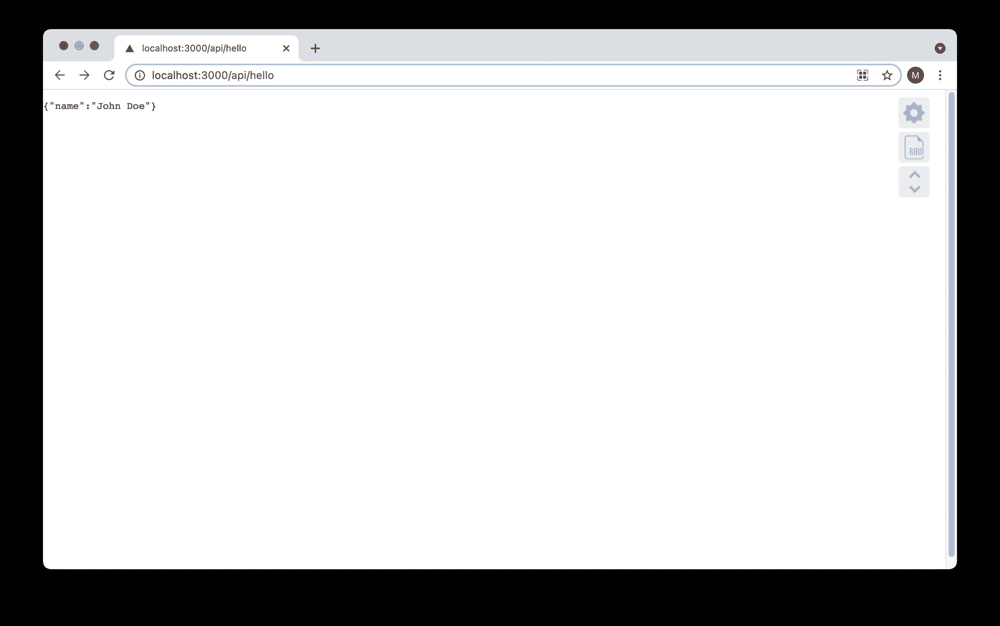

如果你看到一个`Internal Server Error`而不是上面的屏幕，这意味着你的应用程序无法连接到数据库。您可以在您的终端中找到更多信息。可能是您输入了错误的用户名或密码。

## 如何创建第一个 API

我们的数据库连接已经准备好，所以我们可以在我们的后端工作。每个链接缩短器都有两种行为:缩短链接和将它们重定向到正确的完整 URL。这意味着我们需要创建两个 API 端点，`shorten_link`和`redirect`。先说第一个。

我们需要在`pages/api`目录中创建一个`shorten_link.ts`文件。

```
$ touch pages/api/shorten_link.ts
```

现在我们需要添加以下代码:

```
import { connectToDatabase } from "./_connector";

export default async (req, res) => {
  const db = await connectToDatabase();

  if (req.body !== '' && req.body.link !== undefined && req.body.link !== '') {
    const entry = await db.db('links_db').collection('links_collection').insertOne({ link: req.body.link });

    res.statusCode = 201;
    return res.json({ short_link: `${process.env.VERCEL_URL}/r/${entry.insertedId}` });
  }

  res.statusCode = 409;
  res.json({ error: 'no_link_found', error_description: 'No link found'})
}
```

这里我们声明了一个 API 来缩短链接。如果提供了链接，系统将在数据库中创建一个新的链接。否则，它将返回代码`409` (Conflict ),表示没有找到任何要缩短的链接。

现在我要和 Postman 一起测试我们的新 API。如果你不知道如何使用 Postman，而你想学习它，你可以[观看来自 freeCodeCamp](https://www.freecodecamp.org/news/learn-how-to-use-postman-to-test-apis/) 的这个教程。否则，您可以跳过这一节，跳到下一个 API。没必要。

我们需要选择`POST`方法(1)，输入 URL (2)，点击*主体*标签(3)，传递`link` (4)并点击*发送*按钮(5)。我们应该得到以下响应:

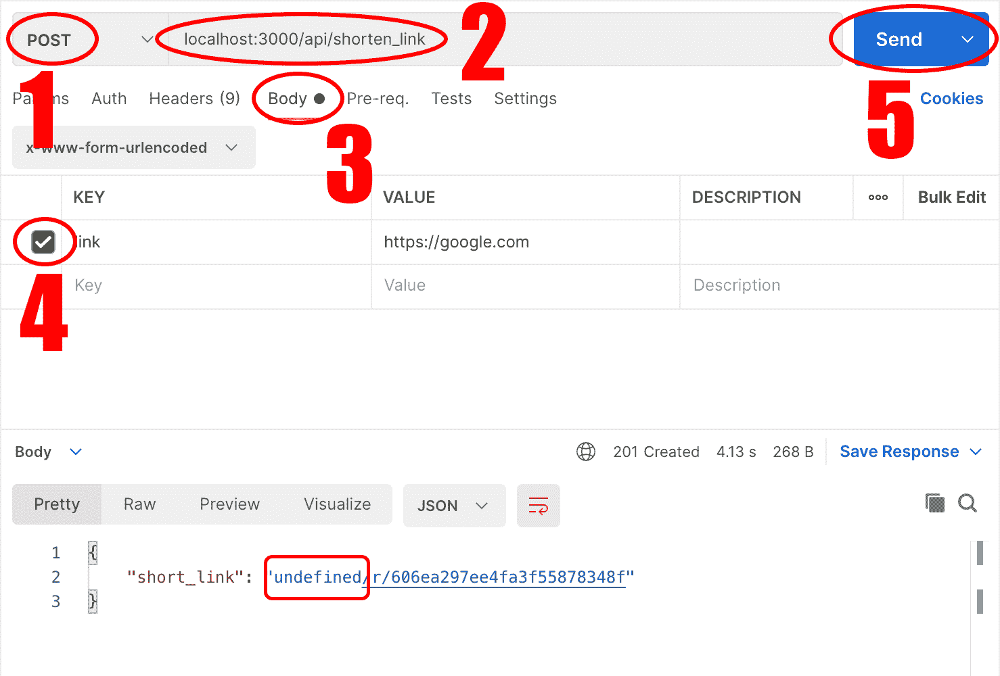

您可能已经注意到，我用红色划线标记了`short_link`属性中的`undefined`部分。正如您在代码中看到的，我们使用了下面的代码片段来生成这个短链接:

```
{ short_link: `${process.env.VERCEL_URL}/r/${entry.insertedId}` }
```

`VERCEL_URL`是一个仅在 Vercel 上可用的环境变量。这意味着我们需要在 Vercel 上部署我们的应用程序，然后它将替换正确的值。下一个。JS 默认不识别它，所以我们在 API 响应中看到`undefined`。这是目前预计的。

你也可以试试我们应用的前端——它也可以工作:

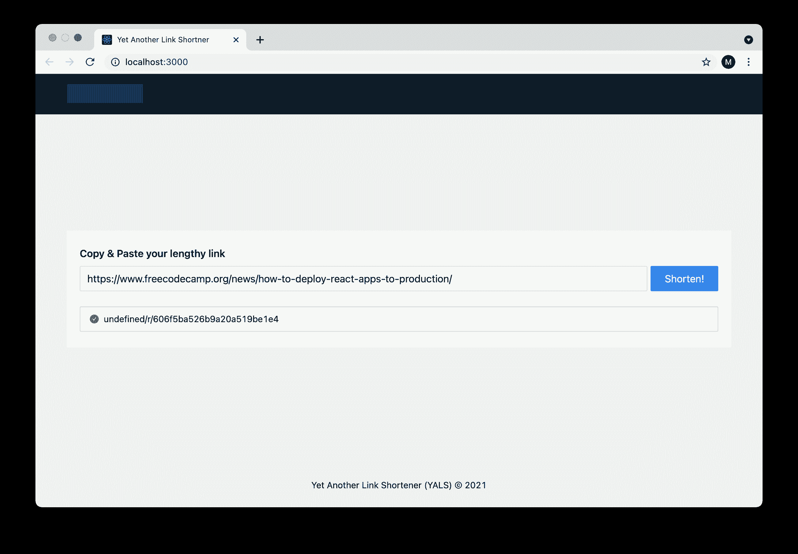

## 如何实现重定向

因为我们已经创建了第一个短链接，让我们准备从短链接到完整 URL 的重定向。

我们需要在`pages/api`目录中创建一个`redirect.ts`文件，并且我们需要将下面的代码粘贴到那里:

```
import { ObjectID } from 'mongodb';
import { connectToDatabase } from "./_connector";

export default async (req, res) => {
  const db = await connectToDatabase();

  const entry = await db.db('links_db').collection('links_collection').findOne({ _id: new ObjectID(req.query.id as string) });

    if (entry !== null) {
        return res.redirect(301, entry.link);
    }

    return res.redirect(301, '/');
}
```

正如你所看到的，我们试图在数据库中找到一个链接。如果找到了，我们会将用户重定向到正确的位置。如果系统找不到它，我们会将用户重定向到主页面。

我尝试用 Postman 测试这个端点。不幸的是，响应看起来不太好——我可以看到网站的 HTML 代码，而不是重定向，所以我决定跳过这一部分。无论如何，我们很快就会部署它，这样我们就可以在合适的环境中测试它。

## 如何重写我们的网址

在将应用程序部署到 Vercel 之前，我们需要对重定向链接做一些事情。目前，如果我们想重定向到完整的链接，我们的用户需要粘贴以下链接:

```
localhost:3000/api/redirect?id=606f512cbb6d7306eb5df189
```

这看起来不太好，而且它比我们的用户想要缩短的大多数链接都要长。我认为我们应该遵循这种模式:

```
localhost:3000/r/606f512cbb6d7306eb5df189
```

它更短，更干净。它仍然不完美，但对我们的例子来说已经足够好了。如果你愿意，你可以修改代码来支持别名或者任何其他生成短链接的方式。

我们需要创建一个`vercel.json`文件，并将下面的定义粘贴到那里:

```
{
    "rewrites": [{ "source": "/r/:id", "destination": "/api/redirect?id=:id" }]
}
```

这个配置告诉我们的主机提供商，服务器必须重写所有从`/r`到`/api/redirect?id=`开始的 URL。

现在，我们的应用程序的代码和配置已经完成。如果你想把它部署到 Vercel，你需要把它放入 GitHub 库。正如我在文章开头提到的，我在这里跳过了这一部分——只是确保在继续之前完成了这一部分。

## 如何将应用程序部署到 Vercel

一旦我们的应用程序准备就绪，我们需要发布它，以便用户可以使用我们的服务缩短他们的链接。我们将[将我们的应用部署到 Vercel](https://vercel.com/) 上，因为他们为无服务器应用提供免费托管，他们的开发人员体验非常棒。

像往常一样，我将跳过创建新帐户的过程。你可以使用你的 GitHub 或 Google 帐户一键创建一个。

注册后，您应该会看到这个屏幕。点击*新建项目*按钮:

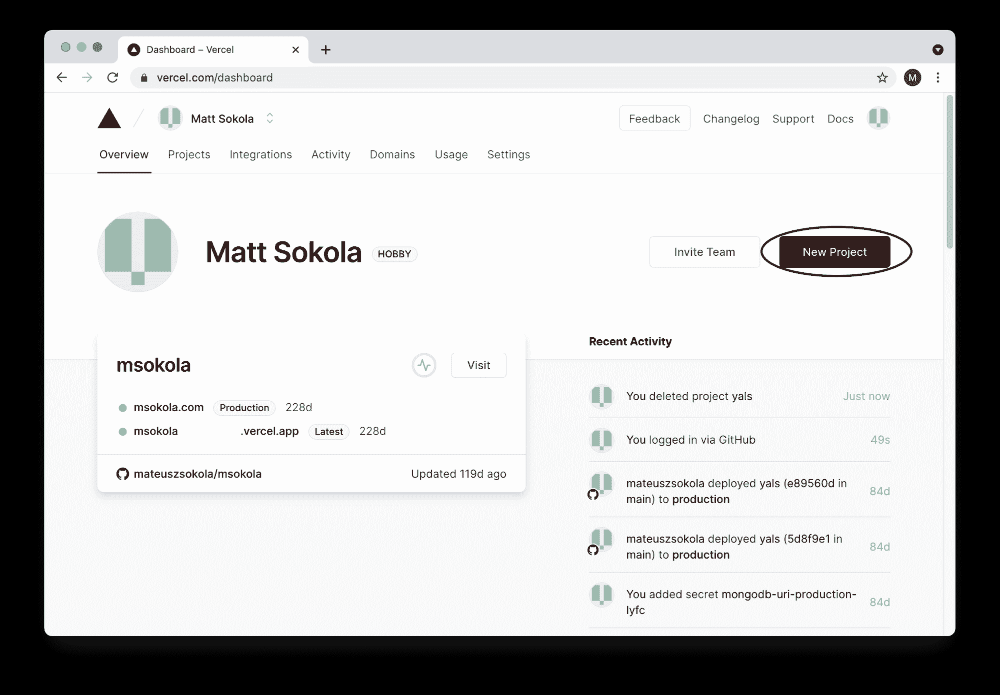

现在您需要选择想要导入的 GitHub 存储库。在我的例子中，它是“ *yals* ”，但你也可以用别的名字来称呼它。如果你没有看到你的资源库，你需要点击*调整 GitHub App 权限*(下面标有红色矩形的链接):

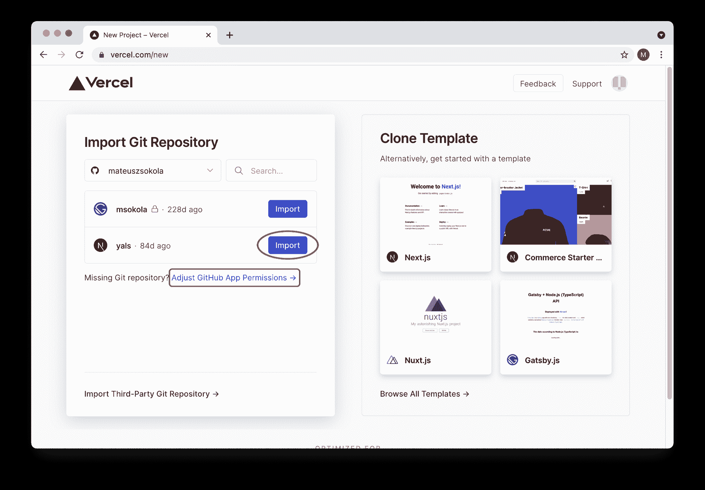

在下一步中，我们需要选择是使用团队存储库还是个人帐户。在我们的例子中，它是一个个人帐户:

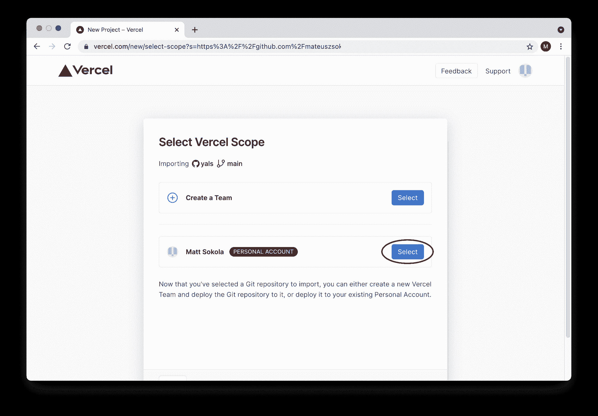

现在我们需要配置项目。让我们打开“*环境变量*，将你的连接字符串粘贴到`MONGODB_URI`，点击“*添加*按钮，点击“*部署*”:

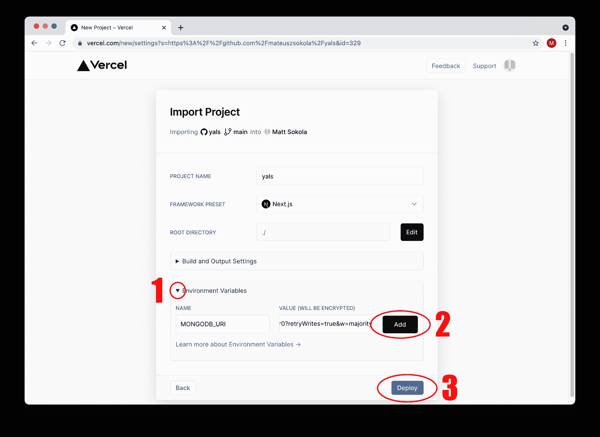

我们的应用程序现在正在部署。完成后，您应该会看到以下屏幕。只需点击*访问*按钮:

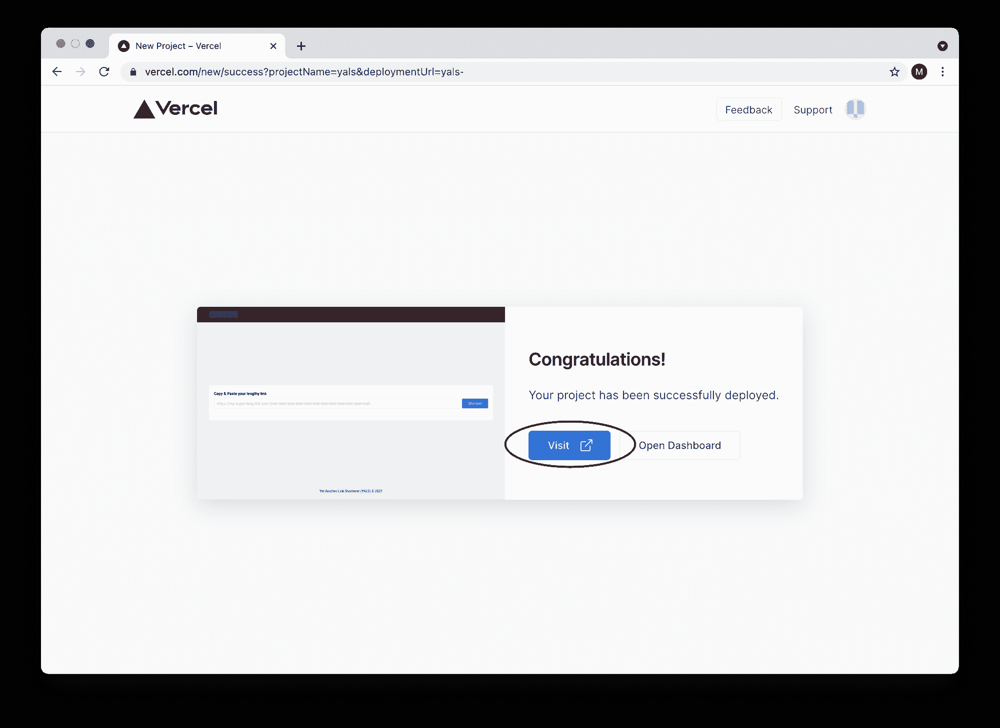

让我们通过将任何长链接粘贴到表单中来测试应用程序。我使用了前段时间为 freeCodeCamp 写的文章的链接，这是我收到的内容:

*   之前: [`https://www.freecodecamp.org/news/how-to-deploy-react-apps-to-production/`](https://www.freecodecamp.org/news/how-to-deploy-react-apps-to-production/) 。
*   之后:`https://yals.vercel.app/r/606f6723622f2c0008b64dc4`。

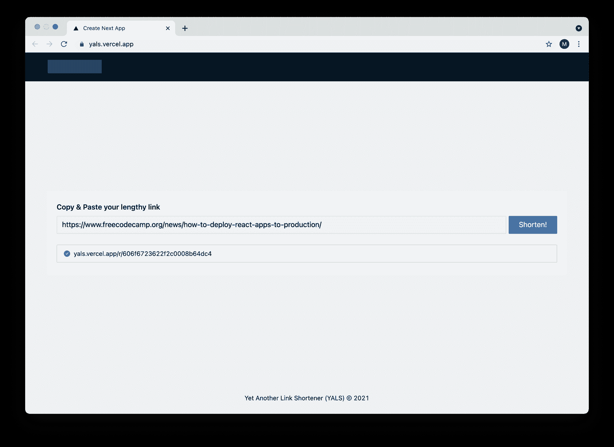

## 摘要

恭喜你！您已经构建了一个全功能的无服务器应用程序，并准备与您的朋友分享。

我知道链接别名不是最短和最易读的。因此，和往常一样，你可以自己改进这个项目，并向我们展示另一种方法。你可以在 freeCodeCamp 论坛或者下面 YouTube 视频的评论区分享。

我创建了一个 YouTube 教程，在那里你可以看到我写的每一行代码。看一遍大概需要 90 分钟。

请记住，这是我的第一个 YouTube 教程，它并不完美。我没有使用摄像机的经验，也没有录制电影的经验。我努力让每一个视频都比前一个更好。

如果你觉得这些视频有用，请点击“喜欢”按钮并订阅，我将不胜感激。我将发布一些关于如何保持 JavaScript 代码整洁的视频。

[https://www.youtube.com/embed/IkATIunl_wE?feature=oembed](https://www.youtube.com/embed/IkATIunl_wE?feature=oembed)

所有剧集:

1.  [配置下一步。JS + React + TypeScript。](https://youtu.be/IkATIunl_wE)
2.  [使用 Ant Design 为 React App 准备布局。](https://youtu.be/9oE7XwVv1Zo)
3.  让我们来设计表单的样式。
4.  [使用 Ant React 组件进行表单验证。](https://youtu.be/YB4OVbqFs-8)
5.  让我们编写第一个 API。
6.  [使用 Next.JS 在 MongoDB 中存储数据](https://youtu.be/hrZ_IbE0GFs)
7.  [将 API 与 React App 挂钩。](https://youtu.be/ILNpFkT0YNw)
8.  [使用 Next.JS 进行重定向](https://youtu.be/maPmxCJT9Jo)
9.  [将无服务器应用部署到 Vercel](https://youtu.be/0pS9VWy-YXI) 。

****你可以在这个 GitHub 库里面找到所有的代码****:[https://github.com/mateuszsokola/y](https://github.com/mateuszsokola/react-to-aws)als

可以在 Twitter 上给我发 DM:[@ MSO kola](https://twitter.com/msokola)

那都是乡亲们！我希望你喜欢它，并有一个伟大的一天:)