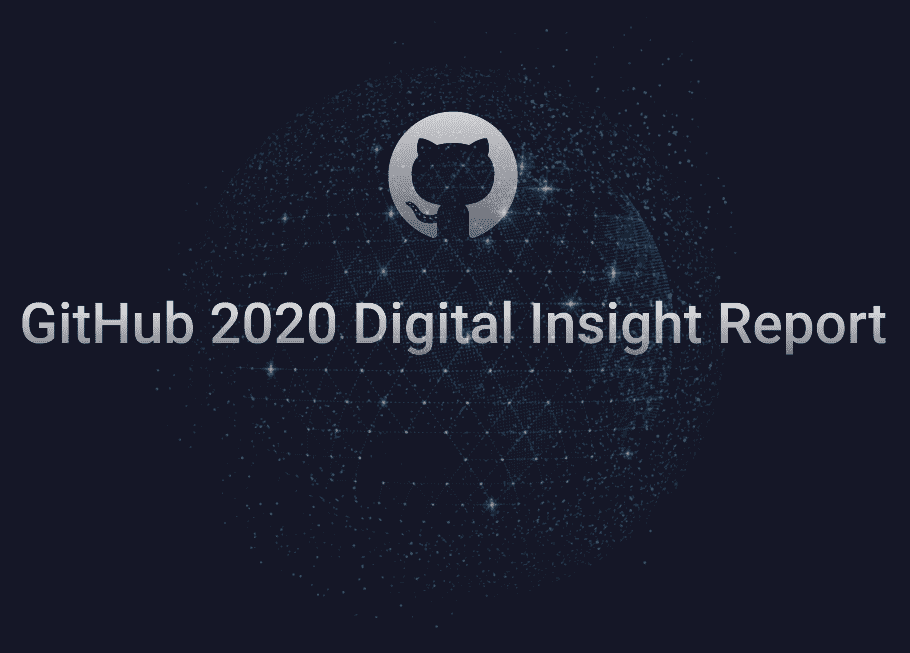

# 开源洞察——我们从 8.6 亿条 GitHub 事件日志中学到了什么

> 原文：<https://www.freecodecamp.org/news/open-source-insights-what-we-learned-from-860-million-github-event-logs/>

开源软件已经成为我们数字世界的基石。开放协作在人类数字文明的发展中发挥着巨大的作用。

全球最大的开源协作平台 GitHub 产生了海量的开发者行为数据。那么我们能用这些数据做什么呢？

## 问题是——如何衡量生产率

正如管理大师彼得·德鲁克的名言，“如果你不能衡量它，你就不能管理它，”因此，你就不能改进它。

软件业还没有找到一种能有效测量软件开发生产率的方法。这对整个开源生态系统来说尤其如此。如何衡量个人和社区，以及管理者如何使用这些指标来做出更好的决策，仍然是悬而未决的问题。

我们认为，这既是挑战也是机遇。当你管理一个开源项目时，很难回避度量的问题。但是 GitHub 事件日志提供了一个解决问题的绝佳机会。

度量也是一把双刃剑。鉴于其强大的指导性质，它促使您关注并改进可衡量的要素。

但是，度量也可能导致你忽略和恶化那些你无法度量的元素。在构建全球大规模开源社区和生态系统的过程中，如何找到正确的度量标准并明智地使用它们？

我们获得了 2020 年生成的 8.6 亿条 GitHub 事件日志，并分析了来自超过 1400 万活跃开发者和超过 5400 万活跃项目的数据。在这篇文章中，我们将分享我们的见解。

## GitHub 2020 数字洞察报告

在我们新发布的 [GitHub 2020 Digital Insight 报告](http://oss.x-lab.info/github-insight-report-2020-en.pdf)中，这也是 GitHub 上的一个开源[项目](https://github.com/X-lab2017/github-analysis-report)，我们探讨了开源的全球趋势状况。

该报告的目的是制作一个全球开源生态系统地图，促进开源社会创新，并促进开放合作。

该报告以对当今全球开源状况的总体分析开始。以下部分包括对深入的开发人员和项目分析、案例研究以及本月明星项目的讨论。

我们通过关注时间、多样性和协作网络维度的信息来定义指标和构建模型。我们还引入了两个重要的概念， **OpenGalaxy** 和**开源象限**。

## 报告中的关键要点

### 全球开源行业已经有了很大发展

2020 年 GitHub 全球事件日志总数约为 8.6 亿，较 2019 年的 6.1 亿增长约 42.6%。

我们还发现，2020 年 GitHub 上的全球活跃项目数约为 5421 万，而活跃开发者账号数约为 1454 万。这比 2019 年分别增长了 36.4%和 21.8%。

### 开发者是开源世界的核心

一个基于海量数据的活动模型，可以有效持续地反映开发者和社区的整体状态。

遵循 Apache 格言“社区重于代码”的精神，开发人员社区对开源的生命力至关重要。

我们试图从多个角度对 2020 年所有 GitHub 开发者进行全面分析，如开发者的活动水平、GitHub 应用的使用情况、典型工作时间、全球开发者时区分布和开发者语言分布。

我们引入了**开发者活跃度指标**，它反映了特定 GitHub 项目中特定 GitHub 账户在一段时间内的活跃度。

我们通过项目中的账户行为数据来确定开发者活动指标。此报告中详述的行为包括问题注释、打开问题、打开拉式请求、拉式请求审阅注释、合并拉式请求、观察和分叉，权重分别为 1、2、3、4、2、1、2。

其中，合并的拉请求数由分段函数决定:

统计数据表明，5445 名开发者的活动指标超过 2000，相当于 10000 名 Github 开发者中不到 6 名。

大多数开发者的活跃度指标落在[0，500]的范围内，占 Github 开发者总数的 99.45%，这表明大多数开发者的活跃度水平仍然较低。

在曲线的末端，活动存储库的数量显示出增加，这可能归因于一些未过滤的自动化协作账户的大量活动存储库，这远远超过了人类开发人员的数量。这导致曲线的 V 形尾端。

### 自动化是关键

开源软件管道的自动化程度提高了很多，多样化的数字协作机器人开始进入主流。

我们发现前 10 名最活跃的开发者中有 8 个是 GitHub 应用，另外两个是自动化协作的开发者账户。

自动化协作机器人可以同时为许多项目服务，因为它们运行在服务器端。这导致了极高的活动水平和大量的协作库。

如上表所示，GitHub 上大多数最活跃的开发者账户都是 GitHub 应用。这份报告分析了相关的 GitHub 应用程序数据。

例如，下图显示了 2015 年至 2020 年 GitHub 应用的活跃数量(总活跃账户)和 GitHub 应用生成的日志占所有 GitHub 事件日志的比例(日志比例)的趋势。

GitHub 应用自 2016 年推出以来，近年来发展迅速。就原木比例而言，2019 年的总数比 2018 年增加了 288%，2020 年比 2019 年增加了 141%，高达 12%以上。

我们在 GitHub 上开源了这个[报告项目](https://github.com/X-lab2017/github-analysis-report)。为了自动化这个项目的代码开发和数据分析，我们在 2020 年 8 月开发了 GitHub 协作机器人 analysis-report-bot[bot]。

值得一提的是，截至今日，analysis-report-bot[bot]在所有 GitHub 应用的活跃度排名中位列第 289 位。

受益于这种自动化协作机器人，我们相信基于 GitHub 应用的机器人将在未来更广泛地用于帮助更好地管理开源项目的大规模协作。

### 开源贡献通常与开发人员的工作时间一致

GitHub 社区主流开发者的工作时间呈现出清晰的模式，并逐渐与开发者在工作中的工作时间重叠。

企业开源已经成为绝对的主流，996 工时开源项目已经出现。

因为 GitHub 事件日志有详细的时间戳信息，所以我们可以通过时间维度的统计分析来收集见解。例如，在 UTC 标准时间中，全球工作时间分布如下图所示:

假设主流开发者的正常工作时间是每天 9 点到 21 点。从全球范围来看，通过日志量，我们可以看到 GitHub 平台上的开发者主要来自欧美。

还有，我们可以看到周末的活跃度明显低于平日。这与 [GitHub Octoverse 2020](https://octoverse.github.com/) 报告一致，该报告发现更多的开发者使用 GitHub 工作，而不是仅仅基于他们的兴趣进行开发。

### 使用 GitHub 我们可以了解到很多开发者的全球分布情况

美洲拥有最大的开发者分布。欧洲在一个时区内拥有最高比例的开发者，而亚洲开发者的数量仍然很少。与其他亚洲国家相比，中国拥有更高水平的开源活动。

开发者的地理分布一直是开源项目全球化指标的一个重要方面。

基于 GitHub 开发者活跃度排名前五万名开发者的统计，我们可以估算出所有 GitHub 开发者在各个时区的分布情况，如下图所示。

我们可以看到，美洲(美国、加拿大和南美洲)的开发人员在高度活跃的开发人员中分布最广。虽然单个时区的开发者比例不是最高的，但是这个区域的开发者整体比例高达 33%左右。

欧洲是单个时区开发者比例最高的地方。UTC+1 时区高达近 10%，三个时区的总比例约为 26%。

总的来说，亚洲的开发者数量仍然相对较少，但我们可以在 UTC+7 和 UTC+8 地区看到一个小高峰，这表明中国和俄罗斯的开发者在开源方面仍然比其他国家更活跃。

由于人口分布的原因，太平洋地区的开发者比例最低。

### JavaScript 和 Python 全球排名第一和第二

这并不奇怪——JS 和 Python 仍然分别占据语言排名的第一和第二位。HTML 和 CSS 在全球开发人员的环境中更受欢迎，而 TypeScript 和 Rust 则显著突出。

下图显示了 2020 年活跃开发者在所有 GitHub 项目中使用的语言分布，以及前 10 万活跃开发者使用的语言分布。对比项目语言的分布，可以看到排名的一些波动。

JavaScript 和 Python 在排名中一直是赢家和亚军，而 HTML 和 CSS 显然在所有 GitHub 开发者的背景下更受欢迎。

这是因为 GitHub 上有大量的博客网站和其他类似的存储库。这些项目通常是小型的、独立的，由个人开发者维护。

### 像谷歌和微软这样的大公司是开源的主要贡献者。

此外，总部位于中国的电子商务巨头阿里巴巴的活跃度在同行中排名第一，而 PingCAP 的表现令人印象深刻。

根据项目活跃度指标的定义(详见报告全文)，我们收集了 2020 年活跃项目的活跃度统计和排名。

以下是世界上最活跃的 20 个项目的列表。由于这是 2020 年的报告，本表中使用的数据都是 2020 年期间新生成的(不包括历史报告数据)。

我们还通过各种渠道收集了一份由中国人发起的项目清单，并对中国项目的活跃度进行了排名。

从上面的列表中，我们发现 PingCAP 在开源方面有着恒星级的表现。他们代表了前 20 名项目名单中的 6 个项目。阿里巴巴在开源方面的贡献令人印象深刻。他们有两个项目名列前十。

百度在人工智能领域表现突出。其深度学习平台 PaddlePaddle 的两个项目，即核心框架 Paddle 和相关工具库，榜上有名。

中国最活跃项目 20 强名单包括阿里巴巴的蚂蚁设计组件库，京东基于 React 前端框架的开发框架 taro，以及 Ele.me(被阿里巴巴收购)前端团队开源的 Vue UI 组件库 Element。

### 开放星系帮助我们获得了更完整的图像

由于 OpenGalaxy，我们第一次能够看到 GitHub 开源项目的更完整的图片。我们在报告中介绍过。

我们通过活动度量分析得到的结果会受到自动化协作行为的影响。此外，不同成熟度级别的项目的活动度量可能不具有可比性。

因此，在这份报告中，我们使用了 OpenGalaxy，这是一个面向全球项目的合作关系网络。

OpenGalaxy 基于开发者活动度量的定义，通过 GitHub 上所有开发者的协作行为，建立项目间的协作关系。它提供了一种通过图算法计算影响力和聚类的方法。

具体的计算方法可以从完整的报告中找到。

以上是 2020 年 GitHub 上最活跃的 22.1 万个开源项目组成的协作网络图。图中节点的大小表示项目的影响力，节点的颜色表示节点所属的协同聚类结果。

对 2020 年所有 GitHub 项目中影响力最大的前 20 个项目进行了协作网络影响力评估。它们如下表所示:

从表中我们可以看到，按影响力衡量，VS 代码已从按活跃度衡量的第五位跃升至第一位。凭借比排名第二的 Flutter 高出约 64.7%的影响力，VS Code 成为全球最具影响力的项目。

我们使用存储库的 2020 年事件日志为 VS 代码构建了一个开发者协作网络，如下图所示。

协作网络由 20，000 多名开发人员组成。节点是开发者的 GitHub 账号，边是协作关系，节点的大小反映了对应开发者账号的活跃度。

在这个协作网络中，网络核心的较大节点就是 VS 代码的核心团队成员。他们不仅有很高的活跃度，还和其他开发者有很高的协作关系。这个团队大约有一百名成员。

紧随其后的外部节点是 VS 代码的活跃用户或贡献者。他们可以随时提交问题或 PRs 进行讨论或发表意见。这个团体的成员数以千计。

最外层也是数量最多的开发人员是 VS 代码的一般用户和偶尔的贡献者，他们中的大部分人只是提问或者讨论他们关心的问题。

OpenGalaxy 有一个功能，可以链接从事这些项目的优秀开发人员的优秀项目。结果，影响指数不会由于自动化行为而虚高，而是具有更好的算法稳定性。

由于影响力的变化揭示了开发者社区的活动变化，影响力成为反映一个项目在所有 GitHub 项目中的影响力水平的更好指标。

### 9.开源象限更进了一步

在报告中，我们还引入了开源象限，可以进一步区分类似开源项目的不同开发阶段和成熟度。

开源象限分析由散点图表示。水平和垂直维度分别表示项目的影响力和项目的全球化。

我们使用两个指标的对数形式和圆点的大小来描述项目中积极参与者的数量，以及反映社区的规模。

你可以在完整的报告中找到影响力、全球化、参与人数的具体计算方法。

下面是 Linux Foundation AI 和 Data 项目的**开源象限**分析的一个例子:

### 开源社区是多样的和健壮的

开发者时区分布图和开发者协作网络已经成为反映开源社区多样性和健壮性的有效手段。他们可以帮助我们更好地管理开源社区。

我们将以 Linux Foundation AI 和 Data 项目为例。

我们可以看到该领域项目的开发者时区分布与所有 GitHub 项目相比变化很大。大约 16%的开发者是从 UTC+7 到 UTC+8。

在这些时区中，中国开发者参与最多，这反映出中国有更多的数据和人工智能从业者。

## 我们还学到了什么？

我们对云计算原生计算基金会(CNCF)、Linux 基金会(LF)和 Apache 软件基金会(ASF)等机构的特定项目中的开发人员协作网络进行了深入的案例研究。

### 本月之星

除了顶级项目，GitHub 上的一些项目也在短时间内获得了开发者的大量关注。这些项目可能是现象项目，也可能成为未来的顶级项目，或者与社会热点有关，比如新冠肺炎疫情。

发现并解释为什么他们在特定时期受到大量关注是有意义的。因此，每月之星部分列出了 2020 年每个月都受到大量关注的项目。

基于日志数据，首先筛选每月获得最多星级的项目，然后我们为每个月选择一个示例。

*   1 月:微软/剧作家
*   二月:武汉 2020/武汉 2020
*   3 月:CSSEGISandData/新冠肺炎
*   四月:labuladong/他妈的-算法
*   May:面向开发者的设计资源
*   六月:CnC _ 重制 _ 收藏
*   7 月:JaidedAI/EasyOCR
*   8 月:geekxh/hello-algorithm
*   9 月:cli/cli
*   十月:开发者路线图
*   11 月:ytdl-org/youtube-dl
*   12 月:旋转芯片/Depix

## 总结与展望

作为一个数据驱动的可视化工具，**GitHub 2020 Digital Insight Report**主要为您提供对当今开源世界的新视角，以及与行业经验交叉的见解。

从这份年度报告开始，我们还将保持该工作为开源项目，缩短发布周期，按需提供专业咨询服务。

你可以从这个链接获得完整的报告:[http://oss.x-lab.info/github-insight-report-2020-en.pdf](http://oss.x-lab.info/github-insight-report-2020-en.pdf)

如果您发现任何数据错误或遗漏，请向 GitHub 提交问题或 PR。本报告正文采用 CC-BY-4.0 许可协议，项目地址为:[https://github.com/X-lab2017/github-analysis-report](https://github.com/X-lab2017/github-analysis-report)

## 承认

GitHub 2020 Digital Insights 报告由 X-lab 发起，Allumos 开源技术媒体策划，与华东师范大学、开源社、上海开源信息技术协会，以及其他众多科研机构和开源社区研究所共同完成。

本报告的撰稿人包括:

赵(Frank)、魏(Will)王、、翁、王、夏、朱湘宁、、王泽新、林海明、王辅政、石景本、娄、(Xander)吴、贾(Kate)杨、司英(Mabel)李。

本报告英文版的撰稿人是:

薛()吴、蒲玉(保)王、夏、(保)赵、戴、(保)李、余(保)陈。特别感谢阿列克谢·扎依采夫(微信:vistal-media)对编辑工作的宝贵帮助。

我们欢迎更多开源爱好者的加入，共同推动开源在全球的发展。

