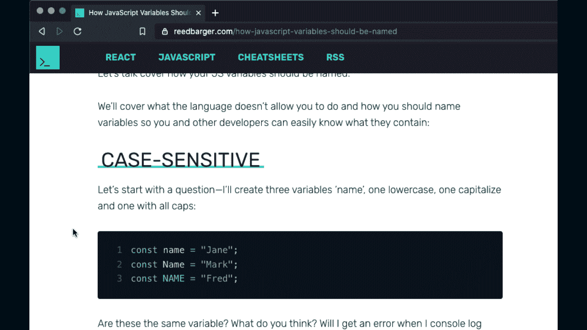
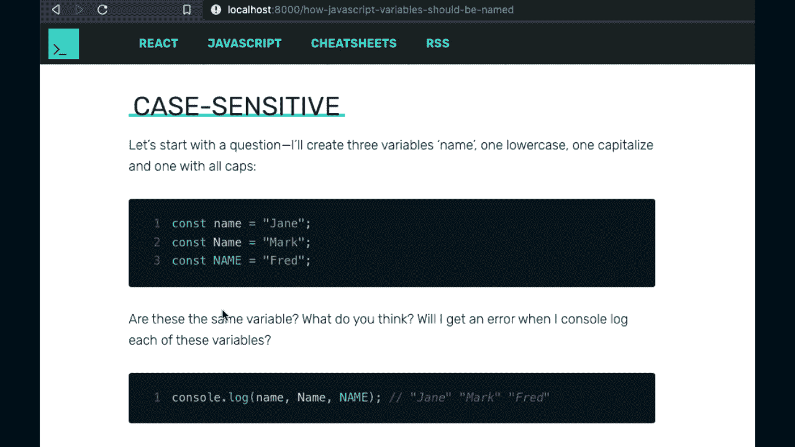

# 如何从头到尾创建你的第一个 React 钩子

> 原文：<https://www.freecodecamp.org/news/code-react-hooks/>

您可以使用自定义 React 挂钩来解决 React 项目中许多不同的现实问题。

因此，学习如何制作 React 钩子是成为顶尖 React 开发者的必要技能。

在本文中，让我们从头到尾看看如何创建我们自己的自定义 React 挂钩，让用户复制代码片段或我们应用程序中的任何其他文本。

> 想学习如何创建使用自定义 React 挂钩的真实应用程序吗？看看 React 训练营。

## 我们想添加什么功能？

在我的网站 reedbarger.com 上，我允许用户借助一个名为`react-copy-to-clipboard`的软件包从我的文章中复制代码。

用户只需将鼠标悬停在代码片段上，单击剪贴板按钮，代码就会添加到他们计算机的剪贴板中。这允许他们在任何他们喜欢的地方粘贴和使用代码。



## 如何重新创建反应-复制到剪贴板

然而，我没有使用第三方库，而是想用我自己定制的 React 钩子重新创建这个功能。

正如我创建的每个自定义 React 挂钩一样，我把它放在一个专用文件夹中，通常称为`utils`或`lib`，专门用于我可以在我的应用程序中重用的函数。

我们将把这个钩子放在一个名为`useCopyToClipboard.js`的文件中，我将创建一个同名的函数。还要确保在顶部导入 React。

有多种方法可以将一些文本复制到用户的剪贴板上。然而，我更喜欢为此使用一个库，它使过程更可靠，称为`copy-to-clipboard`。

它导出一个函数，我们称之为`copy`。

```
// utils/useCopyToClipboard.js
import React from "react";
import copy from "copy-to-clipboard";

export default function useCopyToClipboard() {} 
```

接下来，我们将创建一个函数，用于复制任何想要添加到用户剪贴板的文本。我们将这个函数称为`handleCopy`。

## 如何制作 handleCopy 函数

在函数中，我们首先需要确保它只接受字符串或数字类型的数据。

我们将设置一个 if-else，它将确保类型不是字符串就是数字。否则，我们将在控制台记录一个错误，告诉用户他们不能复制任何其他类型。

```
import React from "react";
import copy from "copy-to-clipboard";

export default function useCopyToClipboard() {
  const [isCopied, setCopied] = React.useState(false);

  function handleCopy(text) {
    if (typeof text === "string" || typeof text == "number") {
      // copy
    } else {
      // don't copy
      console.error(
        `Cannot copy typeof ${typeof text} to clipboard, must be a string or number.`
      );
    }
  }
} 
```

接下来，我们将获取文本并将其转换为字符串，然后将它传递给`copy`函数。从那里，我们想在应用程序中的任何地方从钩子返回句柄复制函数。一般来说，`handleCopy`功能会连接到一个按钮的`onClick`。

```
import React from "react";
import copy from "copy-to-clipboard";

export default function useCopyToClipboard() {
  function handleCopy(text) {
    if (typeof text === "string" || typeof text == "number") {
      copy(text.toString());
    } else {
      console.error(
        `Cannot copy typeof ${typeof text} to clipboard, must be a string or number.`
      );
    }
  }

  return handleCopy;
} 
```

此外，我们需要一些表示文本是否被复制的状态。为了创建它，我们将在钩子的顶部调用`useState`，并创建一个新的状态变量`isCopied`，其中 setter 将被称为`setCopy`。

最初，该值为假。如果文本复制成功。我们将设置`copy`为真。否则，我们将把它设置为 false。

最后，我们将从一个数组中的钩子返回`isCopied`和`handleCopy`。

```
import React from "react";
import copy from "copy-to-clipboard";

export default function useCopyToClipboard(resetInterval = null) {
  const [isCopied, setCopied] = React.useState(false);

  function handleCopy(text) {
    if (typeof text === "string" || typeof text == "number") {
      copy(text.toString());
      setCopied(true);
    } else {
      setCopied(false);
      console.error(
        `Cannot copy typeof ${typeof text} to clipboard, must be a string or number.`
      );
    }
  }

  return [isCopied, handleCopy];
} 
```

## 如何使用 useCopyToClipboard

我们现在可以在任何我们喜欢的组件中使用`useCopyToClipboard`。

在我的例子中，我将使用它和一个复制按钮组件，它接收我们的代码片段的代码。

为了使这个工作，我们需要做的就是添加一个点击按钮。并在一个名为 handle 的函数的返回中复制了要求它作为文本的代码。一旦被复制，它就是真的。我们可以显示一个不同的图标，表示复制成功。

```
import React from "react";
import ClipboardIcon from "../svg/ClipboardIcon";
import SuccessIcon from "../svg/SuccessIcon";
import useCopyToClipboard from "../utils/useCopyToClipboard";

function CopyButton({ code }) {
  const [isCopied, handleCopy] = useCopyToClipboard();

  return (
    <button onClick={() => handleCopy(code)}>
      {isCopied ? <SuccessIcon /> : <ClipboardIcon />}
    </button>
  );
} 
```

## 如何添加重置间隔

我们可以对代码做一个改进。正如我们当前编写的钩子一样，`isCopied`将始终为真，这意味着我们将始终看到成功图标:



如果我们想在几秒钟后重置我们的状态，我们可以通过一个时间间隔来使用 CopyToClipboard。让我们添加该功能。

回到我们的钩子中，我们可以创建一个名为`resetInterval`的参数，它的默认值是`null`，这将确保如果没有参数传递给它，状态不会重置。

然后，我们将添加`useEffect`来说明如果文本被复制，并且我们有一个重置间隔，我们将在该间隔之后使用`setTimeout`将`isCopied`设置回 false。

此外，如果我们的组件钩子正在被卸载(意味着我们的状态不再需要更新)，我们需要清除这个超时。

```
import React from "react";
import copy from "copy-to-clipboard";

export default function useCopyToClipboard(resetInterval = null) {
  const [isCopied, setCopied] = React.useState(false);

  const handleCopy = React.useCallback((text) => {
    if (typeof text === "string" || typeof text == "number") {
      copy(text.toString());
      setCopied(true);
    } else {
      setCopied(false);
      console.error(
        `Cannot copy typeof ${typeof text} to clipboard, must be a string or number.`
      );
    }
  }, []);

  React.useEffect(() => {
    let timeout;
    if (isCopied && resetInterval) {
      timeout = setTimeout(() => setCopied(false), resetInterval);
    }
    return () => {
      clearTimeout(timeout);
    };
  }, [isCopied, resetInterval]);

  return [isCopied, handleCopy];
} 
```

最后，我们可以做的最后一个改进是将`handleCopy`包装在`useCallback`钩子中，以确保每次重新呈现时不会重新创建它。

## 决赛成绩

这样，我们就有了最后一个钩子，它允许在给定的时间间隔后重置状态。如果我们传递一个给它，我们应该会看到如下的结果:

```
import React from "react";
import ClipboardIcon from "../svg/ClipboardIcon";
import SuccessIcon from "../svg/SuccessIcon";
import useCopyToClipboard from "../utils/useCopyToClipboard";

function CopyButton({ code }) {
  // isCopied is reset after 3 second timeout
  const [isCopied, handleCopy] = useCopyToClipboard(3000);

  return (
    <button onClick={() => handleCopy(code)}>
      {isCopied ? <SuccessIcon /> : <ClipboardIcon />}
    </button>
  );
} 
```


我希望您通过创建我们的钩子学到了一些东西，并且您可以在自己的个人项目中使用它将任何文本复制到剪贴板上。

## 喜欢这篇文章吗？加入 React 训练营

**[React 训练营](http://bit.ly/join-react-bootcamp)** 将你应该知道的关于学习 React 的一切打包成一个全面的包，包括视频、备忘单，外加特殊奖励。

获得数百名开发人员已经使用的内部信息，以掌握 React、找到他们梦想的工作并掌控他们的未来:

[](http://bit.ly/join-react-bootcamp) 
*打开时点击此处通知*