# Python 手册——初学者学习 Python

> 原文：<https://www.freecodecamp.org/news/the-python-handbook/>

Python 手册遵循 80/20 规则:用 20%的时间学习 80%的主题。

我发现这种方法给出了一个全面的概述。

本书并不试图涵盖世界上所有与 Python 相关的内容。它关注语言的核心，试图简化更复杂的主题。

希望这本书的内容能帮你实现你想要的:**学习 Python 的基础知识**。

> 注意:你可以[获得这本 Python 手册的 PDF、ePub 和 Mobi 版本](https://flaviocopes.com/page/python-handbook/)

尽情享受吧！

## 摘要

*   [Python 简介](#introductiontopython)
*   [如何安装 Python](#howtoinstallpython)
*   [如何运行 Python 程序](#howtorunpythonprograms)
*   [Python 2 vs Python 3](#python2vspython3)
*   [Python 基础知识](#pythonbasics)
*   [Python 中的数据类型](#datatypesinpython)
*   [Python 中的运算符](#operators)
*   [Python 中的三元运算符](#theternaryoperatorinpython)
*   [Python 中的字符串](#stringsinpython)
*   [Python 中的布尔值](#booleansinpython)
*   [Python 中的数字](#numbersinpython)
*   [Python 中的常量](#constantsinpython)
*   [Python 中的枚举](#enumsinpython)
*   [Python 中的用户输入](#userinputinpython)
*   [Python 中的控制语句](#controlstatementsinpython)
*   [Python 中的列表](#listsinpython)
*   [Python 中的元组](#tuplesinpython)
*   [Python 中的字典](#dictionariesinpython)
*   [在 Python 中设置](#setsinpython)
*   [Python 中的函数](#functionsinpython)
*   [Python 中的对象](#objectsinpython)
*   [Python 中的循环](#loopsinpython)
*   [Python 中的类](#classesinpython)
*   [Python 中的模块](#modulesinpython)
*   [Python 标准库](#thepythonstandardlibrary)
*   [pep 8 Python 风格指南](#thepep8pythonstyleguide)
*   [Python 中的调试](#debugginginpython)
*   [Python 中的变量作用域](#variablescopeinpython)
*   [如何在 Python 中接受来自命令行的参数](#howtoacceptargumentsfromthecommandlineinpython)
*   [Python 中的 Lambda 函数](#lambdafunctionsinpython)
*   [Python 中的递归](#recursioninpython)
*   [Python 中的嵌套函数](#nestedfunctionsinpython)
*   [Python 中的闭包](#closuresinpython)
*   [Python 中的装饰者](#decoratorsinpython)
*   [Python 中的文档字符串](#docstringsinpython)
*   [Python 中的自省](#introspectioninpython)
*   [Python 中的注释](#annotationsinpython)
*   [Python 中的异常](#exceptionsinpython)
*   [Python 中的 with 语句](#thewithstatementinpython)
*   [如何使用 pip 在 Python 中安装第三方包](#howtoinstall3rdpartypackagesinpythonusingpip)
*   [用 Python 列出理解](#listcomprehensionsinpython)
*   [Python 中的多态性](#polymorphisminpython)
*   [Python 中的运算符重载](#operatoroverloadinginpython)
*   [Python 中的虚拟环境](#virtualenvironmentsinpython)
*   [结论](#conclusion)

## Python 简介

Python 正在蚕食编程世界。它正以计算机历史上前所未有的方式越来越受欢迎和使用。

Python 擅长于各种各样的场景——**Shell 脚本**、**任务自动化**和 **Web 开发**只是一些基本的例子。

Python 是**数据分析**和**机器学习**的首选语言，但它也可以适应创建游戏和与嵌入式设备一起工作。

最重要的是，它是世界各地大学计算机科学入门课程的首选语言。

许多学生学习 Python 作为他们的第一编程语言。许多人现在正在学习，更多的人将在未来学习。对他们中的许多人来说，Python 将是他们需要的唯一编程语言。

由于这种独特的地位，Python 在未来很可能会有更大的发展。

这种语言简单、富于表现力，而且非常直观。

生态系统是巨大的。你能想象到的一切似乎都有一个图书馆。

Python 是一种适合初学者的高级编程语言，这得益于它直观的语法、庞大的社区和充满活力的生态系统。

它也受到许多不同领域的专业人士的赞赏。

从技术上讲，Python 是一种解释型语言，它不像编译型语言(如 C 或 Java)那样有中间编译阶段。

像许多解释语言一样，它是动态类型的。这意味着您不必指明您所使用的变量的类型，并且变量不依赖于特定的类型。

这有利有弊。特别是，你可以更快地编写程序，但另一方面，在防止可能出现的错误方面，工具的帮助却更少。这意味着你只能通过在运行时执行程序来发现某些问题。

Python 支持各种不同的编程范例，包括过程式编程、面向对象编程和函数式编程。它足够灵活，可以适应许多不同的需求。

由吉多·范·罗苏姆于 1991 年创建，它越来越受欢迎——尤其是在过去的 5 年里，正如这张谷歌趋势信息图所示:

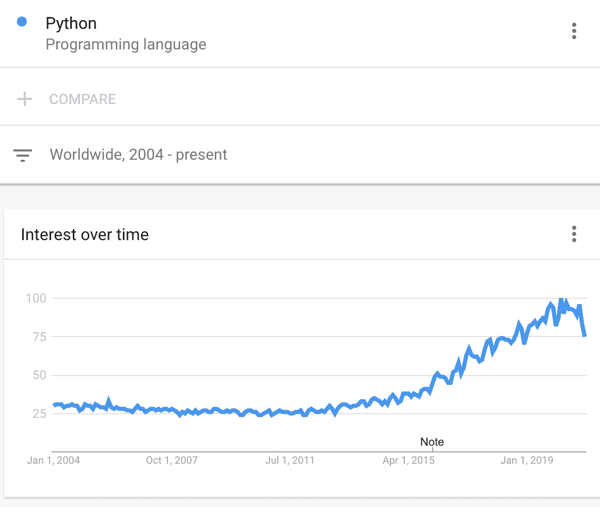

从 Python 开始非常容易。你所需要的就是安装 python.org 的官方软件包，适用于 Windows、macOS 或 Linux，然后你就可以开始了。

如果你是编程新手，在下面的文章中，我将指导你从零开始成为一名 Python 程序员。

即使你目前是一名专门研究另一种语言的程序员，Python 也是一门值得了解的语言，因为我认为它只会从这里继续发展。

像 C++和 Rust 这样的低级语言对专业程序员来说可能很棒，但它们一开始就令人望而生畏，而且需要很长时间才能掌握。

另一方面，Python 是一种面向所有人的编程语言——学生、日常使用 Excel 的人、科学家等等。

这是每个对编码感兴趣的人应该首先学习的语言。

## 如何安装 Python

进入[https://www.python.org](https://www.python.org)，选择下载菜单，选择你的操作系统，一个带有下载官方软件包链接的面板就会出现:

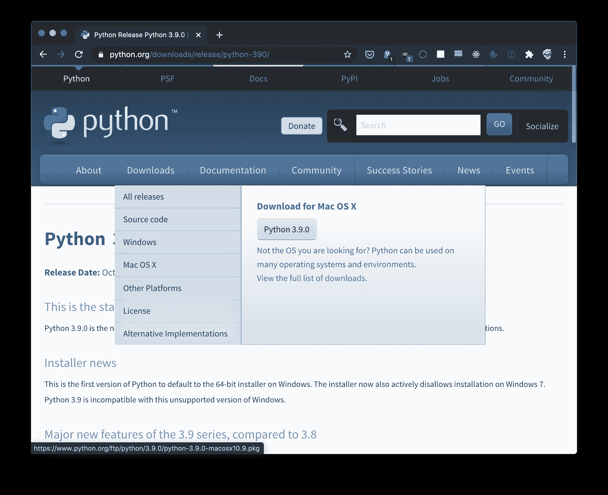

请确保遵循您的操作系统的特定说明。在 macOS 上，你可以找到关于 https://flaviocopes.com/python-installation-macos/的详细指南。

## 如何运行 Python 程序

有几种不同的方法来运行 Python 程序。

特别是，使用交互式提示和将 Python 程序保存到文件中并执行是有区别的，在交互式提示中，您键入 Python 代码并立即执行。

让我们从交互提示开始。

如果你打开你的终端并输入`python`，你会看到这样一个屏幕:

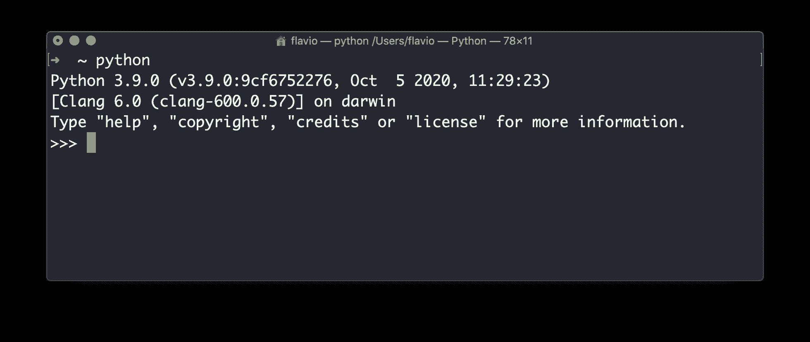

这就是 Python REPL(读取-评估-打印-循环)。

注意`>>>`符号，以及其后的光标。您可以在这里键入任何 Python 代码，并按下`enter`键来运行它。

例如，尝试使用以下方法定义一个新变量

```
name = "Flavio" 
```

然后使用`print()`打印其值:

```
print(name) 
```

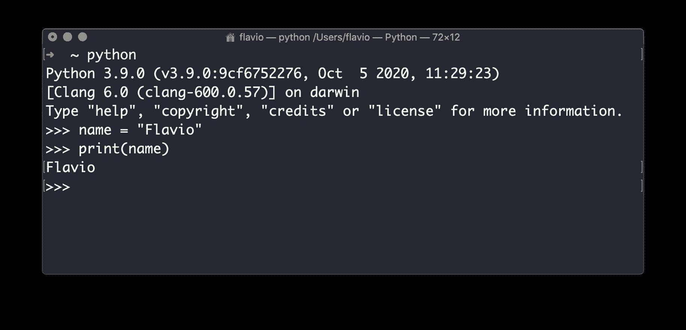

> 注意:在 REPL 中，你也可以只输入`name`，按下`enter`键，你将得到这个值。但是在一个程序中，如果你这样做，你将看不到任何输出——你需要使用`print()`来代替。

你在这里写的任何一行 Python 代码都会被立即执行。

键入`quit()`退出这个 Python REPL。

您可以使用 Python 自动安装的空闲应用程序来访问相同的交互式提示:

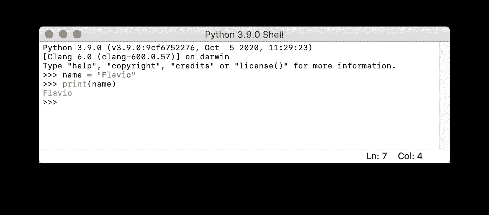

这对您来说可能更方便，因为使用鼠标您可以四处移动，并且比使用终端更容易复制/粘贴。

这些是 Python 默认提供的基础。然而，我建议你安装 IPython，这可能是你能找到的最好的命令行 REPL 应用程序。

安装它与

```
pip install ipython 
```

确保 pip 二进制文件在您的路径中，然后运行`ipython`:

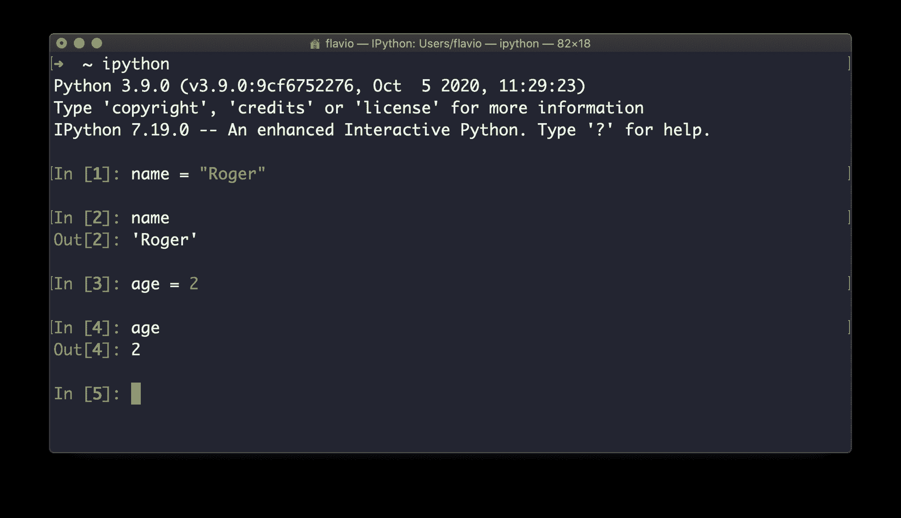

`ipython`是另一个让你使用 Python REPL 的接口，它提供了一些不错的特性，比如语法高亮、代码完成等等。

运行 Python 程序的第二种方法是将您的 Python 程序代码写入一个文件，例如`program.py`:

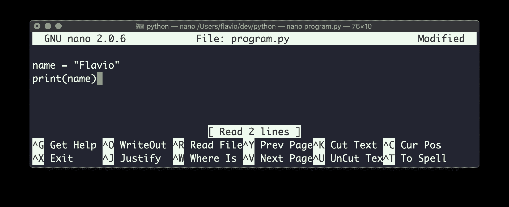

然后用`python program.py`运行它:

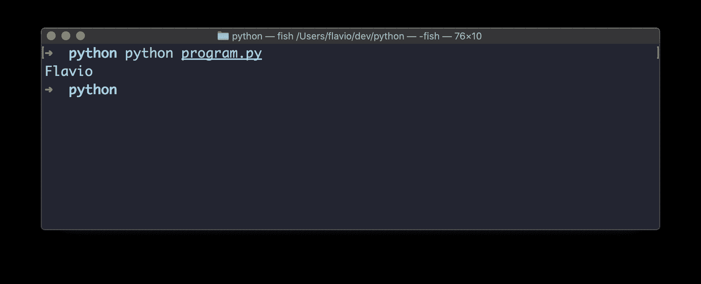

> 注意，我们保存 Python 程序时使用了`.py`扩展名——这是一个约定。

在这种情况下，程序是作为一个整体执行的，而不是一次执行一行。这是我们运行程序的典型方式。

我们使用 REPL 进行快速原型制作和学习。

在 Linux 和 macOS 上，Python 程序也可以被转换成 shell 脚本，方法是在它的所有内容前面加上一个特殊的行，指明使用哪个可执行文件来运行它。

在我的系统上，Python 可执行文件位于`/usr/bin/python3`中，所以我在第一行键入`#!/usr/bin/python3`:

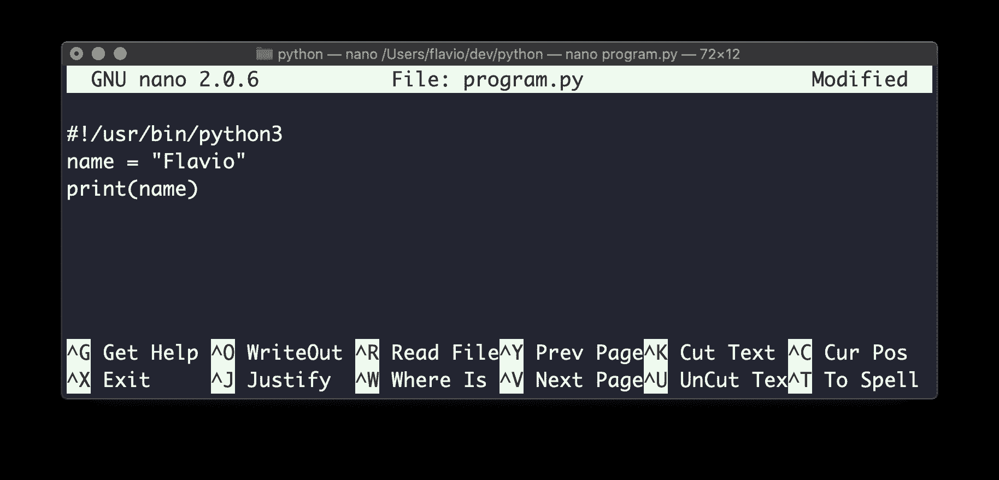

然后，我可以设置文件的执行权限:

```
chmod u+x program.py 
```

我可以运行这个程序

```
./program.py 
```

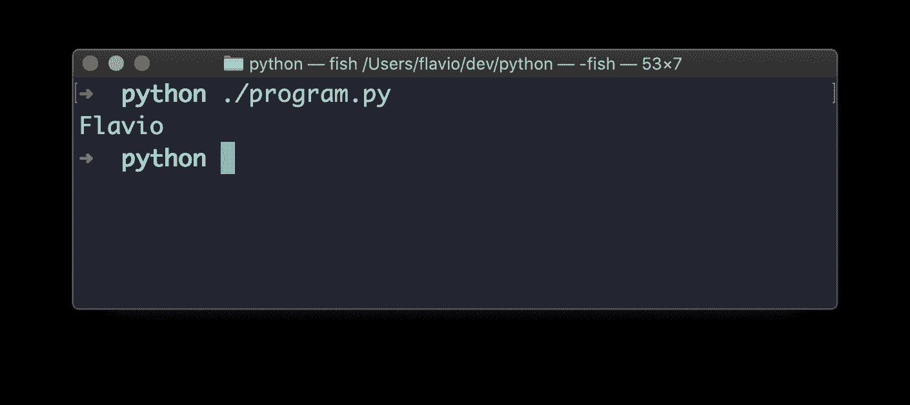

当您编写与终端交互的脚本时，这尤其有用。

我们有许多其他方法来运行 Python 程序。

其中之一是使用 VS 代码，特别是微软官方的 Python 扩展:

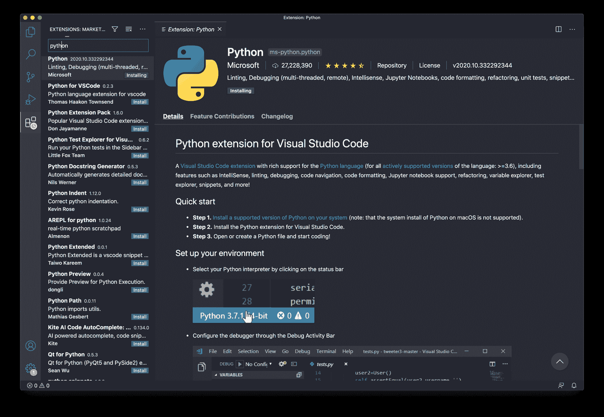

安装该扩展后，您将拥有 Python 代码自动补全和错误检查、自动格式化和使用`pylint`的代码林挺，以及一些特殊命令，包括:

**Python:启动 REPL** 在综合终端运行 REPL；

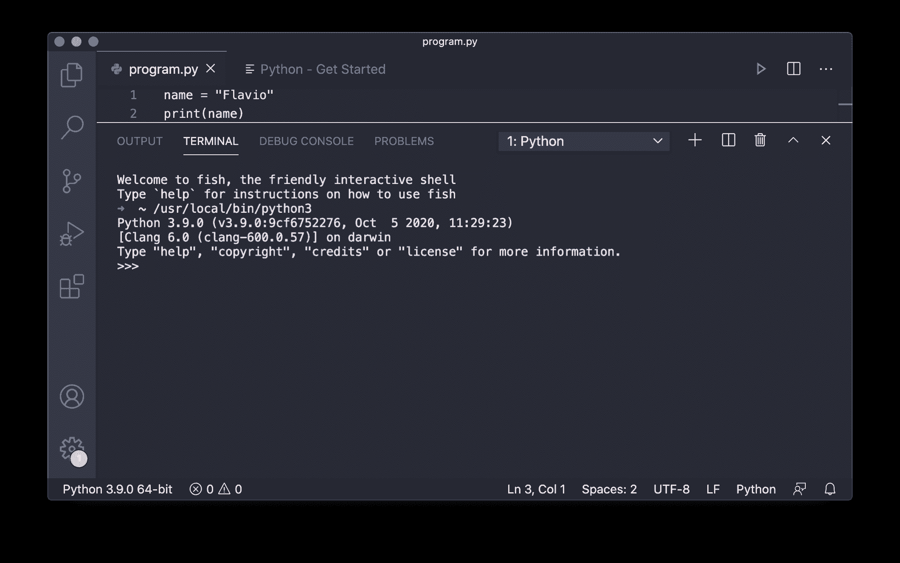

**Python:在终端运行 Python 文件**在终端运行当前文件:

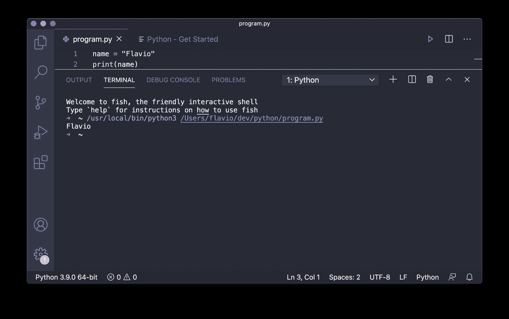

**Python:在 Python 交互窗口中运行当前文件**:

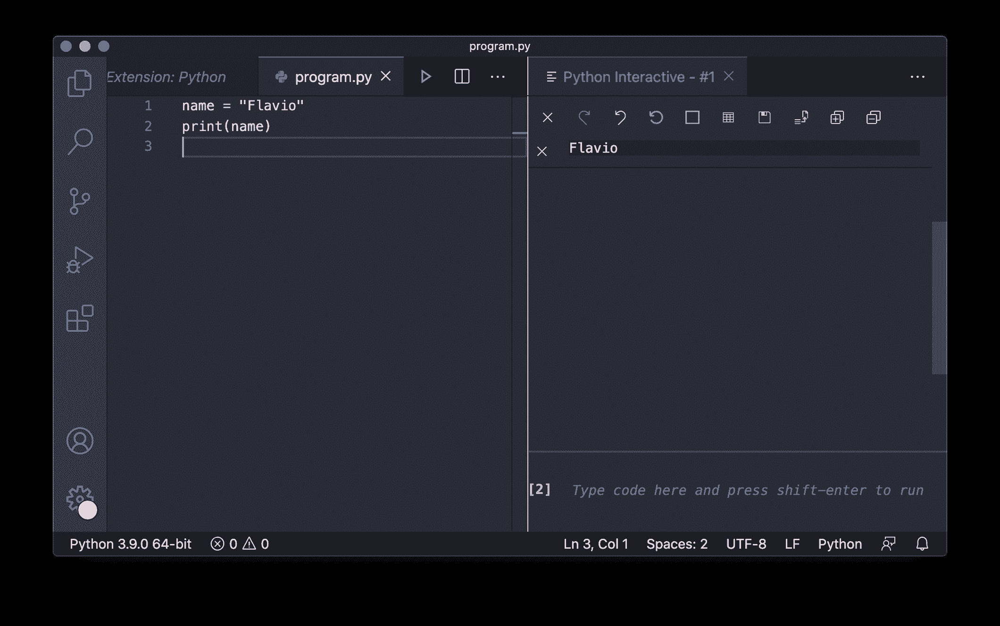

还有很多。只需打开命令面板(视图->命令面板，或 Cmd-Shift-P)并键入`python`即可查看所有与 Python 相关的命令:


另一种轻松运行 Python 代码的方法是使用 repl.it，这是一个非常好的网站，它提供了一个编码环境，您可以在上面创建和运行任何语言的应用程序，包括 Python:


注册(免费)，然后在“创建副本”下点击 Python:

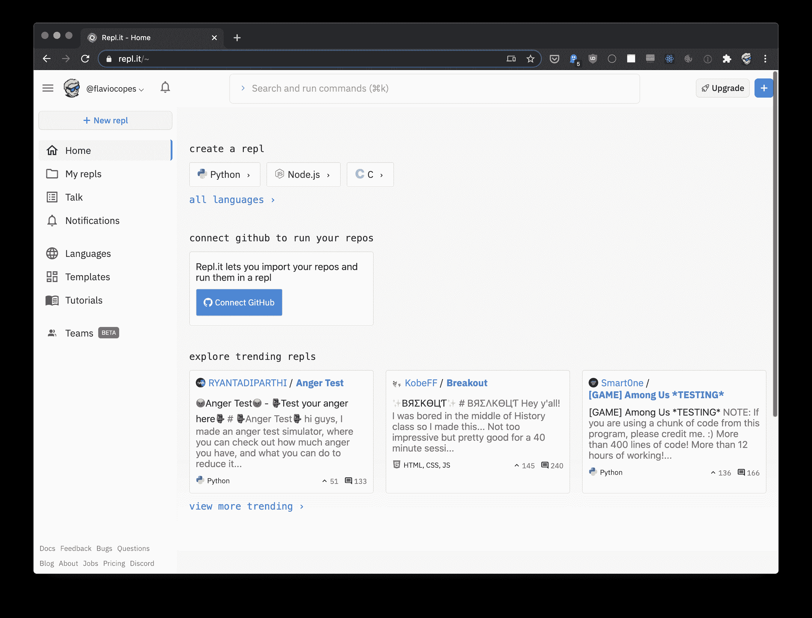

您将立即看到一个编辑器，其中有一个`main.py`文件，准备填充大量 Python 代码:

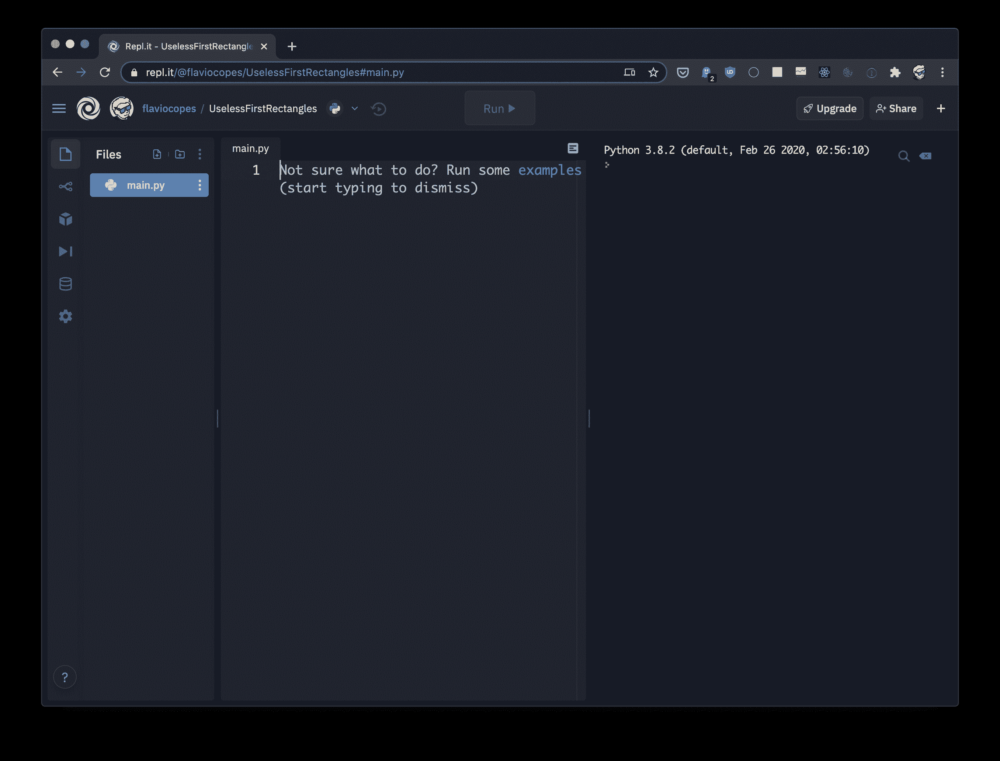

一旦你有了一些代码，点击“运行”在窗口的右边运行它:

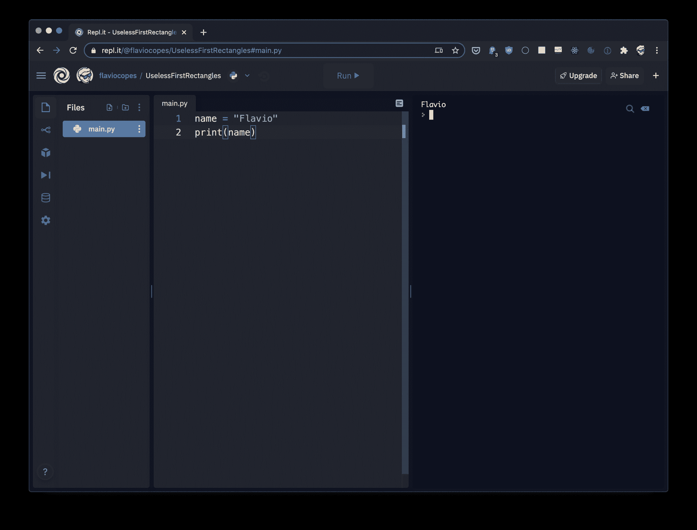

我认为 repl .它很方便，因为:

*   您可以通过共享链接来轻松共享代码
*   多人可以处理同一个代码
*   它可以托管长时间运行的程序
*   您可以安装软件包
*   它为更复杂的应用程序提供了一个键值数据库

## Python 2 对 Python 3

我们应该从一开始就解决的一个关键话题是 Python 2 与 Python 3 的讨论。

Python 3 于 2008 年推出，并作为主要的 Python 版本一直在开发中，而 Python 2 则继续通过错误修复和安全补丁进行维护，直到 2020 年初。

从那一天起，Python 2 的支持就停止了。

许多程序仍然是使用 Python 2 编写的，组织仍然在积极地开发这些程序，因为迁移到 Python 3 并不简单，升级这些程序需要大量的工作。而且大而重要的迁移总是会引入新的错误。

但是新代码，除非你必须遵守你的组织制定的强制使用 Python 2 的规则，应该总是用 Python 3 编写。

> 这本书主要关注 Python 3。

## Python 基础

### Python 中的变量

我们可以通过使用`=`赋值操作符给标签赋值来创建一个新的 Python 变量。

在本例中，我们将值为“Roger”的字符串分配给`name`标签:

```
name = "Roger" 
```

下面是一个带有数字的例子:

```
age = 8 
```

变量名可以由字符、数字和`_`下划线字符组成。它不能以数字开头。这些都是**有效的**变量名:

```
name1
AGE
aGE
a11111
my_name
_name 
```

这些是**无效的**变量名:

```
123
test!
name% 
```

除此之外，任何东西都是有效的，除非是 Python **关键字**。还有一些关键词，像`for`、`if`、`while`、`import`等等。

没有必要记住它们，因为如果您将它们中的一个用作变量，Python 会提醒您，并且您会逐渐认识到它们是 Python 编程语言语法的一部分。

### Python 中的表达式和语句

我们可以*表达式*任何一种返回值的代码。例如

```
1 + 1
"Roger" 
```

另一方面，语句是对值的操作。例如，这是两条语句:

```
name = "Roger"
print(name) 
```

一个程序是由一系列语句组成的。每条语句各占一行，但是您可以使用分号在一行中包含多条语句:

```
name = "Roger"; print(name) 
```

### 评论

在 Python 程序中，散列标记后的所有内容都被忽略，并被视为注释:

```
#this is a commented line

name = "Roger" # this is an inline comment 
```

### Python 中的缩进

Python 中的缩进是有意义的。

您不能像这样随机缩进:

```
name = "Flavio"
    print(name) 
```

其他一些语言没有有意义的空白，但是在 Python 中，缩进很重要。

在这种情况下，如果你试图运行这个程序，你会得到一个`IndentationError: unexpected indent`错误，因为缩进有特殊的含义。

缩进的所有内容都属于一个块，比如控制语句或条件块，或者函数或类体。稍后我们会看到更多关于这些的内容。

## Python 中的数据类型

Python 有几个内置类型。

如果你创建了`name`变量并给它赋值“Roger ”,这个变量现在自动表示一个**字符串**数据类型。

```
name = "Roger" 
```

您可以使用`type()`函数检查变量的类型，将变量作为参数传递，然后将结果与`str`进行比较:

```
name = "Roger"
type(name) == str #True 
```

或者使用`isinstance()`:

```
name = "Roger"
isinstance(name, str) #True 
```

> 注意，要在 REPL 之外查看 Python 中的`True`值，需要将这段代码包装在`print()`中，但是为了清楚起见，我避免使用它。

我们在这里使用了`str`类，但是这同样适用于其他数据类型。

首先，我们有数字。使用`int`类来表示整数。浮点数(分数)属于`float`类型:

```
age = 1
type(age) == int #True 
```

```
fraction = 0.1
type(fraction) == float #True 
```

您看到了如何从值文本创建类型，如下所示:

```
name = "Flavio"
age = 20 
```

Python 自动从值类型中检测类型。

还可以使用类构造函数创建特定类型的变量，传递值文本或变量名:

```
name = str("Flavio")
anotherName = str(name) 
```

还可以使用类构造函数从一种类型转换为另一种类型。Python 将尝试确定正确的值，例如从字符串中提取一个数字:

```
age = int("20")
print(age) #20

fraction = 0.1
intFraction = int(fraction)
print(intFraction) #0 
```

这叫做**铸造**。当然，根据传递的值，这种转换可能并不总是有效。如果你在上面的字符串中写`test`而不是`20`，你会得到一个`ValueError: invalid literal for int() with base 10: 'test'`错误。

这些只是基本的类型。Python 中有更多的类型:

*   `complex`对于复数
*   `bool`对于布尔型
*   `list`对于列表
*   `tuple`为元组
*   `range`对于范围
*   `dict`对于词典
*   `set`对于集合

还有更多！

我们将很快探索它们。

## Python 中的运算符

Python 运算符是我们用来对值和变量进行运算的符号。

我们可以根据操作员执行的操作类型来划分操作员:

*   赋值运算符
*   算术运算符
*   比较运算符
*   逻辑运算符
*   按位运算符

加上一些有趣的像`is`和`in`。

### Python 中的赋值运算符

赋值运算符用于为变量赋值:

```
age = 8 
```

或将一个变量值赋给另一个变量:

```
age = 8
anotherVariable = age 
```

从 Python 3.8 开始，`:=` *walrus 操作符*被用来为变量赋值，作为另一个操作的一部分。例如在`if`内部或者在循环的条件部分。稍后会详细介绍。

### Python 中的算术运算符

Python 有多个算术运算符:`+`、`-`、`*`、`/`(除法)、`%`(余数)、`**`(取幂)和`//`(除法):

```
1 + 1 #2
2 - 1 #1
2 * 2 #4
4 / 2 #2
4 % 3 #1
4 ** 2 #16
4 // 2 #2 
```

> 请注意，操作数之间不需要空格，但这有利于可读性。

`-`也用作一元减运算符:

```
print(-4) #-4 
```

`+`也用于连接字符串值:

```
"Roger" + " is a good dog"
#Roger is a good dog 
```

我们可以将赋值运算符与算术运算符结合起来:

*   `+=`
*   `-=`
*   `*=`
*   `/=`
*   `%=`
*   ..等等

示例:

```
age = 8
age += 1
# age is now 9 
```

### Python 中的比较运算符

Python 定义了一些比较运算符:

*   `==`
*   `!=`
*   `>`
*   `<`
*   `>=`
*   `<=`

根据结果，您可以使用这些运算符来获得一个布尔值(`True`或`False`):

```
a = 1
b = 2

a == b #False
a != b #True
a > b #False
a <= b #True 
```

### Python 中的布尔运算符

Python 为我们提供了以下布尔运算符:

*   `not`
*   `and`
*   `or`

当使用`True`或`False`属性时，它们类似于逻辑 AND、or 和 NOT，通常用于`if`条件表达式求值:

```
condition1 = True
condition2 = False

not condition1 #False
condition1 and condition2 #False
condition1 or condition2 #True 
```

否则，请注意一个可能的混淆来源:

表达式中使用的`or`返回第一个操作数的值，该值不是 falsy 值(`False`、`0`、`''`、`[]`)..).否则它返回最后一个操作数。

```
print(0 or 1) ## 1
print(False or 'hey') ## 'hey'
print('hi' or 'hey') ## 'hi'
print([] or False) ## 'False'
print(False or []) ## '[]' 
```

Python 文档将其描述为`if x is false, then y, else x`。

只有当第一个参数为真时，才计算第二个参数。所以如果第一个参数是福尔西(`False`，`0`，`''`，`[]`)..)，它返回那个参数。否则，它计算第二个参数:

```
print(0 and 1) ## 0
print(1 and 0) ## 0
print(False and 'hey') ## False
print('hi' and 'hey') ## 'hey'
print([] and False ) ## []
print(False and [] ) ## False 
```

Python 文档将其描述为`if x is false, then x, else y`。

### Python 中的按位运算符

一些运算符用于处理位和二进制数:

*   `&`执行二进制与
*   `|`执行二元或运算
*   `^`执行二进制异或运算
*   `~`执行二元非运算
*   `<<`左移操作
*   `>>`右移操作

按位运算符很少使用，只在非常特殊的情况下使用，但它们值得一提。

### Python 中的`is`和`in`

`is`被称为**身份符**。它用于比较两个对象，如果两者是同一个对象，则返回 true。稍后将详细介绍对象。

`in`被称为**隶属操作符**。用于判断一个值是包含在一个列表中，还是包含在另一个序列中。稍后会有更多关于列表和其他序列的内容。

## Python 中的三元运算符

Python 中的三元运算符允许您快速定义一个条件。

假设您有一个函数将一个`age`变量与`18`值进行比较，并根据结果返回 True 或 False。

而不是写:

```
def is_adult(age):
    if age > 18:
        return True
    else:
        return False 
```

您可以用三元运算符来实现它，方法如下:

```
def is_adult(age):
    return True if age > 18 else False 
```

首先，如果条件为真，则定义结果，然后评估条件，如果条件为假，则定义结果:

```
<result_if_true> if <condition> else <result_if_false> 
```

## Python 中的字符串

Python 中的字符串是用引号或双引号括起来的一系列字符:

```
"Roger"
'Roger' 
```

您可以将字符串值赋给变量:

```
name = "Roger" 
```

您可以使用`+`操作符连接两个字符串:

```
phrase = "Roger" + " is a good dog" 
```

您可以使用`+=`添加到字符串中:

```
name = "Roger"
name += " is a good dog"

print(name) #Roger is a good dog 
```

您可以使用`str`类构造函数将数字转换为字符串:

```
str(8) #"8" 
```

这对于将一个数字连接到一个字符串非常重要:

```
print("Roger is " + str(8) + " years old") #Roger is 8 years old 
```

当使用特殊语法定义时，字符串可以是多行的，用三个引号将字符串括起来:

```
print("""Roger is

    8

years old
""")

#double quotes, or single quotes

print('''
Roger is

    8

years old
''') 
```

字符串有一组内置方法，如:

*   `isalpha()`检查字符串是否只包含字符且不为空
*   `isalnum()`检查字符串是否包含字符或数字且不为空
*   `isdecimal()`检查字符串是否包含数字且不为空
*   `lower()`获取字符串的小写版本
*   `islower()`检查字符串是否小写
*   `upper()`获取字符串的大写版本
*   `isupper()`检查字符串是否大写
*   `title()`获取字符串的大写版本
*   `startsswith()`检查字符串是否以特定的子字符串开头
*   `endswith()`检查字符串是否以特定的子字符串结尾
*   `replace()`替换字符串的一部分
*   `split()`在特定的字符分隔符上拆分字符串
*   `strip()`修剪字符串中的空白
*   向字符串追加新字母
*   `find()`查找子串的位置

还有很多。

这些方法都不会改变原始字符串。它们返回一个新的修改过的字符串。例如:

```
name = "Roger"
print(name.lower()) #"roger"
print(name) #"Roger" 
```

你也可以使用一些全局函数来处理字符串。

我特别想到了`len()`，它给出了一个字符串的长度:

```
name = "Roger"
print(len(name)) #5 
```

`in`操作符允许您检查字符串是否包含子字符串:

```
name = "Roger"
print("ger" in name) #True 
```

转义是向字符串中添加特殊字符的一种方式。

例如，如何将双引号添加到一个用双引号括起来的字符串中？

```
name = "Roger" 
```

`"Ro"Ger"`不起作用，因为 Python 会认为字符串在`"Ro"`处结束。

方法是对字符串中的双引号进行转义，使用`\`反斜杠字符:

```
name = "Ro\"ger" 
```

这也适用于单引号`\'`，以及特殊格式的字符，如制表符的`\t`、换行符的`\n`和反斜杠的`\\`。

给定一个字符串，您可以使用方括号获取它的字符以获取特定的项，给定它的索引，从 0:

```
name = "Roger"
name[0] #'R'
name[1] #'o'
name[2] #'g' 
```

使用负数将从末尾开始计数:

```
name = "Roger"
name[-1] #"r" 
```

你也可以使用一个范围，使用我们所说的**切片**:

```
name = "Roger"
name[0:2] #"Ro"
name[:2] #"Ro"
name[2:] #"ger" 
```

## Python 中的布尔值

Python 提供了`bool`类型，可以有两个值:`True`和`False`(大写)。

```
done = False
done = True 
```

布尔对于像`if`语句这样的条件控制结构特别有用:

```
done = True

if done:
    # run some code here
else:
    # run some other code 
```

当评估`True`或`False`的值时，如果该值不是一个`bool`，我们有一些依赖于我们正在检查的类型的规则:

*   除了数字`0`之外，数字总是`True`
*   字符串只有在空的时候才是`False`
*   列表、元组、集合和字典只有在空的时候才`False`

您可以通过以下方式检查一个值是否为布尔值:

```
done = True
type(done) == bool #True 
```

或者使用`isinstance()`，传递两个参数:变量和`bool`类:

```
done = True
isinstance(done, bool) #True 
```

在处理布尔值时，全局`any()`函数也非常有用，因为如果作为参数传递的 iterable(例如 list)的任何值是`True`，它将返回`True`:

```
book_1_read = True
book_2_read = False

read_any_book = any([book_1_read, book_2_read]) 
```

全局`all()`函数是相同的，但是如果传递给它的所有值都是`True`，则返回`True`:

```
ingredients_purchased = True
meal_cooked = False

ready_to_serve = all([ingredients_purchased, meal_cooked]) 
```

## Python 中的数字

Python 中的数字可以有三种类型:`int`、`float`和`complex`。

### Python 中的整数

使用`int`类来表示整数。您可以使用文字值定义整数:

```
age = 8 
```

您也可以使用`int()`构造函数定义一个整数:

```
age = int(8) 
```

要检查变量是否属于`int`类型，可以使用`type()`全局函数:

```
type(age) == int #True 
```

### Python 中的浮点数

浮点数(分数)属于`float`类型。您可以使用文字值定义整数:

```
fraction = 0.1 
```

或者使用`float()`构造函数:

```
fraction = float(0.1) 
```

要检查变量是否属于`float`类型，可以使用`type()`全局函数:

```
type(fraction) == float #True 
```

### Python 中的复数

复数的类型是`complex`。

您可以使用文字值来定义它们:

```
complexNumber = 2+3j 
```

或者使用`complex()`构造函数:

```
complexNumber = complex(2, 3) 
```

一旦你有了一个复数，你就可以得到它的实部和虚部:

```
complexNumber.real #2.0
complexNumber.imag #3.0 
```

同样，要检查变量是否属于类型`complex`，可以使用`type()`全局函数:

```
type(complexNumber) == complex #True 
```

### Python 中数字的算术运算

您可以对数字执行算术运算，使用算术运算符:`+`、`-`、`*`、`/`(除法)、`%`(余数)、`**`(取幂)和`//`(除法):

```
1 + 1 #2
2 - 1 #1
2 * 2 #4
4 / 2 #2
4 % 3 #1
4 ** 2 #16
4 // 2 #2 
```

您可以使用复合赋值操作符

*   `+=`
*   `-=`
*   `*=`
*   `/=`
*   `%=`
*   ..等等

也可以对变量快速执行操作:

```
age = 8
age += 1 
```

### Python 中的内置函数

有两个内置函数可以帮助处理数字:

`abs()`返回一个数的绝对值。

`round()`给定一个数字，返回其舍入到最接近整数的值:

```
round(0.12) #0 
```

您可以指定第二个参数来设置小数点的精度:

```
round(0.12, 1) #0.1 
```

Python 标准库提供了其他几个数学工具函数和常数:

*   `math`包提供了一般的数学函数和常数
*   `cmath`包提供了处理复数的工具。
*   `decimal`包提供了处理小数和浮点数的工具。
*   `fractions`包提供了处理有理数的工具。

稍后我们将分别探讨其中的一些。

## Python 中的常数

Python 没有办法强制变量应该是常量。

最接近的方法是使用枚举:

```
class Constants(Enum):
    WIDTH = 1024
    HEIGHT = 256 
```

并使用例如`Constants.WIDTH.value`获得每个值。

没有人可以重新分配该值。

否则，如果您想依赖命名约定，您可以遵循这一条:声明不应该改变大写的变量:

```
WIDTH = 1024 
```

没有人会阻止你覆盖这个值，Python 也不会阻止。

这就是你将看到的大多数 Python 代码所做的。

## Python 中的枚举

枚举是绑定到常数值的可读名称。

要使用枚举，从`enum`标准库模块导入`Enum`:

```
from enum import Enum 
```

然后，您可以用这种方式初始化新的枚举:

```
class State(Enum):
    INACTIVE = 0
    ACTIVE = 1 
```

一旦你这样做了，你就可以引用`State.INACTIVE`和`State.ACTIVE`，它们作为常量。

现在如果你试着打印`State.ACTIVE`例如:

```
print(State.ACTIVE) 
```

它不会返回`1`，而是`State.ACTIVE`。

enum 中分配的数字可以达到相同的值:`print(State(1))`将返回`State.ACTIVE`。使用方括号符号`State['ACTIVE']`也是如此。

但是，您可以使用`State.ACTIVE.value`来获取该值。

您可以列出枚举的所有可能值:

```
list(State) # [<State.INACTIVE: 0>, <State.ACTIVE: 1>] 
```

你可以数一数:

```
len(State) # 2 
```

## Python 中的用户输入

在 Python 命令行应用程序中，您可以使用`print()`函数向用户显示信息:

```
name = "Roger"
print(name) 
```

我们也可以接受用户的输入，使用`input()`:

```
print('What is your age?')
age = input()
print('Your age is ' + age) 
```

这种方法在运行时获得输入，这意味着程序将停止执行，等待用户输入内容并按下`enter`键。

您还可以进行更复杂的输入处理，并在程序调用时接受输入，稍后我们将看到如何做到这一点。

这适用于命令行应用程序。其他类型的应用程序需要不同的输入方式。

## Python 中的控制语句

当您处理布尔值，尤其是返回布尔值的表达式时，我们可以根据它们的`True`或`False`值做出决定并采取不同的方式。

在 Python 中，我们使用了`if`语句:

```
condition = True

if condition == True:
    # do something 
```

当条件测试解析为`True`时，就像上面的例子一样，它的块被执行。

什么是街区？块是右边缩进一级(通常是 4 个空格)的部分:

```
condition = True

if condition == True:
    print("The condition")
    print("was true") 
```

该块可以由单行组成，也可以由多行组成，当您返回到上一个缩进级别时，该块结束:

```
condition = True

if condition == True:
    print("The condition")
    print("was true")

print("Outside of the if") 
```

与`if`结合，你可以有一个`else`块，如果`if`的条件测试结果为`False`，则执行该块:

```
condition = True

if condition == True:
    print("The condition")
    print("was True")
else:
    print("The condition")
    print("was False") 
```

如果前一个检查是`False`，您可以使用`elif`执行不同的链接`if`检查:

```
condition = True
name = "Roger"

if condition == True:
    print("The condition")
    print("was True")
elif name == "Roger":
    print("Hello Roger")
else:
    print("The condition")
    print("was False") 
```

如果`condition`为`False`，且`name`变量值为“罗杰”，则执行这种情况下的第二个程序块。

在一个`if`语句中，您可以只有一个`if`和`else`检查，但是可以有多个`elif`检查系列:

```
condition = True
name = "Roger"

if condition == True:
    print("The condition")
    print("was True")
elif name == "Roger":
    print("Hello Roger")
elif name == "Syd":
    print("Hello Syd")
elif name == "Flavio":
    print("Hello Flavio")
else:
    print("The condition")
    print("was False") 
```

`if`和`else`也可以用于内联格式，让我们根据条件返回一个或另一个值。

示例:

```
a = 2
result = 2 if a == 0 else 3
print(result) # 3 
```

## Python 中的列表

列表是一种基本的 Python 数据结构。

允许您将多个值组合在一起，并用一个通用名称引用它们。

例如:

```
dogs = ["Roger", "Syd"] 
```

列表可以包含不同类型的值:

```
items = ["Roger", 1, "Syd", True] 
```

您可以使用`in`操作符检查某个项目是否包含在列表中:

```
print("Roger" in items) # True 
```

列表也可以定义为空:

```
items = [] 
```

您可以通过索引引用列表中的项目，从零开始:

```
items[0] # "Roger"
items[1] # 1
items[3] # True 
```

使用相同的符号，您可以更改存储在特定索引处的值:

```
items[0] = "Roger" 
```

您也可以使用`index()`方法:

```
items.index(0) # "Roger"
items.index(1) # 1 
```

与字符串一样，使用负索引将从末尾开始搜索:

```
items[-1] # True 
```

您也可以使用切片提取列表的一部分:

```
items[0:2] # ["Roger", 1]
items[2:] # ["Syd", True] 
```

使用`len()`全局函数获取列表中包含的项目数，与我们用来获取字符串长度的方法相同:

```
len(items) #4 
```

您可以使用 list `append()`方法向列表中添加项目:

```
items.append("Test") 
```

或者 extend()方法:

```
items.extend(["Test"]) 
```

您也可以使用`+=`运算符:

```
items += ["Test"]

# items is ['Roger', 1, 'Syd', True, 'Test'] 
```

> 提示:使用`extend()`或`+=`时，不要忘记方括号。不要做`items += "Test"`或者`items.extend("Test")`或者 Python 会在列表中添加 4 个单独的字符，导致`['Roger', 1, 'Syd', True, 'T', 'e', 's', 't']`

使用`remove()`方法移除项目:

```
items.remove("Test") 
```

您可以使用添加多个元素

```
items += ["Test1", "Test2"]

#or

items.extend(["Test1", "Test2"]) 
```

这些将项目追加到列表的末尾。

要在列表中间的特定索引处添加一个项目，请使用`insert()`方法:

```
items.insert("Test", 1) # add "Test" at index 1 
```

要在特定索引处添加多个项目，您需要使用切片:

```
items[1:1] = ["Test1", "Test2"] 
```

使用`sort()`方法对列表进行排序:

```
items.sort() 
```

> 提示:sort()只有在列表包含可比较的值时才有效。例如，字符串和整数是不能比较的，如果你尝试的话，你会得到一个类似于`TypeError: '<' not supported between instances of 'int' and 'str'`的错误。

`sort()`方法首先排序大写字母，然后排序小写字母。要解决这个问题，请使用:

```
items.sort(key=str.lower) 
```

相反。

排序会修改原始列表内容。为了避免这种情况，您可以使用

```
itemscopy = items[:] 
```

或者使用`sorted()`全局功能:

```
print(sorted(items, key=str.lower)) 
```

这将返回一个新的列表，排序，而不是修改原来的列表。

## Python 中的元组

元组是另一种基本的 Python 数据结构。

它们允许你创建不可变的对象组。这意味着元组一旦被创建，就不能被修改。您不能添加或移除项目。

它们的创建方式类似于列表，但使用圆括号而不是方括号:

```
names = ("Roger", "Syd") 
```

元组是有序的，就像列表一样，因此您可以通过引用索引值来获取其值:

```
names[0] # "Roger"
names[1] # "Syd" 
```

您也可以使用`index()`方法:

```
names.index('Roger') # 0
names.index('Syd')   # 1 
```

与字符串和列表一样，使用负索引将从末尾开始搜索:

```
names[-1] # True 
```

您可以使用`len()`函数对元组中的项目进行计数:

```
len(names) # 2 
```

您可以使用`in`操作符检查一个条目是否包含在一个元组中:

```
print("Roger" in names) # True 
```

您也可以使用切片提取元组的一部分:

```
names[0:2] # ('Roger', 'Syd')
names[1:] # ('Syd',) 
```

使用`len()`全局函数获取元组中的项数，与我们用来获取字符串长度的方法相同:

```
len(names) #2 
```

您可以使用`sorted()`全局函数创建元组的排序版本:

```
sorted(names) 
```

您可以使用`+`操作符从现有元组创建一个新元组:

```
newTuple = names + ("Vanille", "Tina") 
```

## Python 中的字典

字典是一种非常重要的 Python 数据结构。

列表允许您创建值的集合，而字典允许您创建**键/值对**的集合。

下面是一个只有一个键/值对的字典示例:

```
dog = { 'name': 'Roger' } 
```

该键可以是任何不可变的值，如字符串、数字或元组。该值可以是您想要的任何值。

一个字典可以包含多个键/值对:

```
dog = { 'name': 'Roger', 'age': 8 } 
```

您可以使用以下符号访问单个键值:

```
dog['name'] # 'Roger'
dog['age']  # 8 
```

使用相同的符号，您可以更改存储在特定索引处的值:

```
dog['name'] = 'Syd' 
```

另一种方法是使用`get()`方法，它有一个添加默认值的选项:

```
dog.get('name') # 'Roger'
dog.get('test', 'default') # 'default' 
```

`pop()`方法检索一个键的值，然后从字典中删除该项:

```
dog.pop('name') # 'Roger' 
```

`popitem()`方法检索并删除插入字典的最后一个键/值对:

```
dog.popitem() 
```

您可以使用`in`操作符检查一个键是否包含在字典中:

```
'name' in dog # True 
```

使用`keys()`方法获取字典中的键列表，将其结果传递给`list()`构造函数:

```
list(dog.keys()) # ['name', 'age'] 
```

使用`values()`方法获取值，使用`items()`方法获取键/值对元组:

```
print(list(dog.values()))
# ['Roger', 8]

print(list(dog.items()))
# [('name', 'Roger'), ('age', 8)] 
```

使用`len()`全局函数获得一个字典的长度，与我们用来获得一个字符串或一个列表中的条目的长度一样:

```
len(dog) #2 
```

您可以通过以下方式向字典中添加新的键/值对:

```
dog['favorite food'] = 'Meat' 
```

您可以使用`del`语句从字典中删除一个键/值对:

```
del dog['favorite food'] 
```

若要复制字典，请使用 copy()方法:

```
dogCopy = dog.copy() 
```

## Python 中的集合

集合是另一种重要的 Python 数据结构。

我们可以说它们像元组一样工作，但它们不是有序的，它们是**可变的**。

或者我们可以说它们像字典一样工作，但是它们没有键。

他们还有一个不可变的版本，叫做`frozenset`。

您可以使用以下语法创建集合:

```
names = {"Roger", "Syd"} 
```

当你把集合想成数学集合时，它们很好用。

您可以相交两个集合:

```
set1 = {"Roger", "Syd"}
set2 = {"Roger"}

intersect = set1 & set2 #{'Roger'} 
```

您可以创建两个集合的并集:

```
set1 = {"Roger", "Syd"}
set2 = {"Luna"}

union = set1 | set2
#{'Syd', 'Luna', 'Roger'} 
```

你可以得到两组之间的区别:

```
set1 = {"Roger", "Syd"}
set2 = {"Roger"}

difference = set1 - set2 #{'Syd'} 
```

您可以检查一个集合是否是另一个集合的超集(当然也可以检查一个集合是否是另一个集合的子集):

```
set1 = {"Roger", "Syd"}
set2 = {"Roger"}

isSuperset = set1 > set2 # True 
```

您可以使用`len()`全局功能对器械包中的物品进行计数:

```
names = {"Roger", "Syd"}
len(names) # 2 
```

通过将集合传递给`list()`构造函数，可以从集合中的项目获得一个列表:

```
names = {"Roger", "Syd"}
list(names) #['Syd', 'Roger'] 
```

您可以使用`in`运算符检查器械包中是否包含某个物品:

```
print("Roger" in names) # True 
```

## Python 中的函数

函数让我们创建一组指令，我们可以在需要时运行。

在 Python 和许多其他编程语言中，函数是必不可少的。它们帮助我们创建有意义的程序，因为它们允许我们将程序分解成可管理的部分，并且它们促进可读性和代码重用。

下面是一个名为`hello`的示例函数，它打印“Hello！”：

```
def hello():
    print('Hello!') 
```

这是功能**定义**。有一个名称(`hello`)和一个主体，即指令集，它是冒号后面的部分。它右边缩进了一级。

要运行这个函数，我们必须调用它。调用该函数的语法如下:

```
hello() 
```

我们可以执行这个函数一次，或者多次。

函数的名字`hello`，非常重要。它应该是描述性的，所以任何调用它的人都可以想象这个函数是做什么的。

函数可以接受一个或多个参数:

```
def hello(name):
    print('Hello ' + name + '!') 
```

在这种情况下，我们通过传递参数来调用函数

```
hello('Roger') 
```

> 我们称*参数*为函数定义中函数接受的值，称*参数*为调用函数时传递给函数的值。对这种区别感到困惑是很常见的。

参数可以有默认值，如果未指定参数，则应用该默认值:

```
def hello(name='my friend'):
    print('Hello ' + name + '!')

hello()
#Hello my friend! 
```

下面是我们如何接受多个参数:

```
def hello(name, age):
    print('Hello ' + name + ', you are ' + str(age) + ' years old!') 
```

在这种情况下，我们调用传递一组参数的函数:

```
hello('Roger', 8) 
```

参数通过引用传递。Python 中的所有类型都是对象，但有些类型是不可变的，包括整数、布尔、浮点、字符串和元组。这意味着，如果您将它们作为参数传递，并在函数内部修改它们的值，则新值不会反映在函数外部:

```
def change(value):
    value = 2

val = 1
change(val)

print(val) #1 
```

如果你传递一个不是不可变的对象，并且你改变了它的一个属性，这个改变将会被反映到外部。

使用`return`语句，函数可以返回值。例如，在这种情况下，我们返回`name`参数名称:

```
def hello(name):
    print('Hello ' + name + '!')
    return name 
```

当函数满足`return`语句时，函数结束。

我们可以省略该值:

```
def hello(name):
    print('Hello ' + name + '!')
    return 
```

我们可以将 return 语句放在条件语句中，这是在不满足起始条件的情况下结束函数的常用方法:

```
def hello(name):
    if not name:
        return
    print('Hello ' + name + '!') 
```

如果我们调用函数传递一个计算结果为`False`的值，比如一个空字符串，函数在到达`print()`语句之前就被终止了。

您可以使用逗号分隔值返回多个值:

```
def hello(name):
    print('Hello ' + name + '!')
    return name, 'Roger', 8 
```

在本例中调用`hello('Syd')`，返回值是一个包含这 3 个值的元组:`('Syd', 'Roger', 8)`。

## Python 中的对象

Python 中的一切都是对象。

基本原始类型(整数、字符串、浮点)的偶数值..)都是对象。列表是对象，元组、字典等等都是对象。

对象有**属性**和**方法**，可以使用点语法访问它们。

例如，尝试定义一个类型为`int`的新变量:

```
age = 8 
```

`age`现在可以访问为所有`int`对象定义的属性和方法。

例如，这包括访问该数字的实部和虚部:

```
print(age.real) # 8
print(age.imag) # 0

print(age.bit_length()) #4

# the bit_length() method returns the number of bits necessary to represent this number in binary notation 
```

保存列表值的变量可以访问一组不同的方法:

```
items = [1, 2]
items.append(3)
items.pop() 
```

这些方法取决于值类型。

Python 提供的`id()`全局函数允许您检查特定对象在内存中的位置。

```
id(age) # 140170065725376 
```

> 你的记忆值会改变——我只是举个例子。

如果给变量赋一个不同的值，它的地址就会改变，因为变量的内容已经被存储在内存中另一个位置的另一个值所替换:

```
age = 8

print(id(age)) # 140535918671808

age = 9

print(id(age)) # 140535918671840 
```

但是如果使用对象的方法修改对象，地址保持不变:

```
items = [1, 2]

print(id(items)) # 140093713593920

items.append(3)

print(items) # [1, 2, 3]
print(id(items)) # 140093713593920 
```

只有将变量重新赋值给另一个值时，地址才会改变。

一些对象是*可变的*，而另一些是*不可变的*。这个要看对象本身。

如果对象提供了改变其内容的方法，那么它就是可变的。否则它是不可改变的。

Python 定义的大多数类型都是不可变的。例如，`int`是不可变的。没有方法可以改变它的值。如果使用以下方法增加该值

```
age = 8
age = age + 1

#or

age += 1 
```

而你用`id(age)`检查，你会发现`age`指向了不同的内存位置。原来的值没有变异，我们只是换成了另一个值。

## Python 中的循环

循环是编程的一个重要部分。

在 Python 中我们有两种循环: **while 循环**和 **for 循环**。

### `while`Python 中的循环

`while`循环是使用`while`关键字定义的，它们重复它们的块，直到条件被评估为`False`:

```
condition = True
while condition == True:
    print("The condition is True") 
```

这是一个**无限循环**。它永远不会结束。

让我们在第一次迭代后立即停止循环:

```
condition = True
while condition == True:
    print("The condition is True")
    condition = False

print("After the loop") 
```

在这种情况下，运行第一次迭代，因为条件测试被评估为`True`。在第二次迭代时，条件测试评估为`False`，因此控制转到循环后的下一条指令。

通常有一个计数器在一定数量的循环后停止迭代:

```
count = 0
while count < 10:
    print("The condition is True")
    count = count + 1

print("After the loop") 
```

### `for`Python 中的循环

使用`for`循环，我们可以预先告诉 Python 执行一个块预定的次数，并且不需要单独的变量和条件来检查它的值。

例如，我们可以迭代列表中的项目:

```
items = [1, 2, 3, 4]
for item in items:
    print(item) 
```

或者，您可以使用`range()`函数迭代特定的次数:

```
for item in range(04):
    print(item) 
```

`range(4)`创建一个序列，从 0 开始，包含 4 项:`[0, 1, 2, 3]`。

要获得索引，您应该将序列包装到`enumerate()`函数中:

```
items = [1, 2, 3, 4]
for index, item in enumerate(items):
    print(index, item) 
```

### Python 中的中断并继续

使用两个特殊的关键字:`break`和`continue`，可以在块内中断`while`和`for`循环。

停止当前的迭代，并告诉 Python 执行下一次迭代。

`break`完全停止循环，并在循环结束后继续下一条指令。

这里的第一个例子打印了`1, 3, 4`。第二个例子打印了`1`:

```
items = [1, 2, 3, 4]
for item in items:
    if item == 2:
        continue
    print(item) 
```

```
items = [1, 2, 3, 4]
for item in items:
    if item == 2:
        break
    print(item) 
```

## Python 中的类

除了使用 Python 提供的类型，我们还可以声明自己的类，并从类中实例化对象。

对象是一个类的实例。类是对象的类型。

我们可以这样定义一个类:

```
class <class_name>:
    # my class 
```

例如，让我们定义一个狗类

```
class Dog:
    # the Dog class 
```

一个类可以定义方法:

```
class Dog:
    # the Dog class
    def bark(self):
        print('WOF!') 
```

> `self`作为方法的自变量指向当前对象实例，并且在定义方法时必须指定。

我们使用以下语法创建一个类的实例，一个**对象**:

```
roger = Dog() 
```

现在`roger`是一个狗类型的新对象。

如果你跑了

```
print(type(roger)) 
```

你会得到`<class '__main__.Dog'>`

一种特殊类型的方法`__init__()`被称为构造函数，当我们从该类创建一个新对象时，我们可以用它来初始化一个或多个属性:

```
class Dog:
    # the Dog class
    def __init__(self, name, age):
        self.name = name
        self.age = age

    def bark(self):
        print('WOF!') 
```

我们是这样使用它的:

```
roger = Dog('Roger', 8)
print(roger.name) # 'Roger'
print(roger.age)  # 8

roger.bark() # 'WOF!' 
```

类的一个重要特征是继承。

我们可以用方法`walk()`创建一个动物类:

```
class Animal:
    def walk(self):
        print('Walking..') 
```

而狗类可以从动物中继承:

```
class Dog(Animal):
    def bark(self):
        print('WOF!') 
```

现在创建一个类`Dog`的新对象将拥有从`Animal`继承的`walk()`方法:

```
roger = Dog()
roger.walk() # 'Walking..'
roger.bark() # 'WOF!' 
```

## Python 中的模块

每个 Python 文件都是一个模块。

您可以从其他文件中导入一个模块，这是任何中等复杂度程序的基础，因为它促进了合理的组织和代码重用。

在典型的 Python 程序中，一个文件充当入口点。其他文件是模块，并公开我们可以从其他文件调用的函数。

文件`dog.py`包含以下代码:

```
def bark():
    print('WOF!') 
```

我们可以使用`import`从另一个文件导入这个函数。一旦我们这样做了，我们就可以使用点符号引用函数，`dog.bark()`:

```
import dog

dog.bark() 
```

或者，我们可以使用`from .. import`语法并直接调用函数:

```
from dog import bark

bark() 
```

第一种策略允许我们加载文件中定义的所有内容。

第二个策略让我们挑选我们需要的东西。

这些模块特定于您的程序，导入依赖于文件在文件系统中的位置。

假设您将`dog.py`放在一个`lib`子文件夹中。

在该文件夹中，您需要创建一个名为`__init__.py`的空文件。这告诉 Python 该文件夹包含模块。

现在你可以选择——你可以从`lib`导入`dog`:

```
from lib import dog

dog.bark() 
```

或者可以参考从`lib.dog`导入的`dog`模块特定函数:

```
from lib.dog import bark

bark() 
```

## Python 标准库

Python 通过其**标准库**公开了许多内置功能。

标准库是各种实用程序的巨大集合，从数学实用程序到调试，再到创建图形用户界面。

你可以在这里找到标准库模块的完整列表:[https://docs.python.org/3/library/index.html](https://docs.python.org/3/library/index.html)

一些重要的模块是:

*   `math`对于数学实用程序
*   `re`对于正则表达式
*   `json`与 JSON 合作
*   `datetime`处理日期
*   `sqlite3`使用 SQLite
*   `os`对于操作系统实用程序
*   `random`用于随机数生成
*   `statistics`对于统计实用程序
*   `requests`执行 HTTP 网络请求
*   `http`创建 HTTP 服务器
*   `urllib`管理网址

下面介绍一下*如何使用*标准库的一个模块。您已经知道如何使用您创建的模块，从程序文件夹中的其他文件导入。

标准库提供的模块也是如此:

```
import math

math.sqrt(4) # 2.0 
```

或者

```
from math import sqrt

sqrt(4) # 2.0 
```

我们将很快单独探索最重要的模块，以了解我们可以用它们做什么。

## PEP8 Python 风格指南

当你写代码时，你应该遵守你所使用的编程语言的惯例。

如果您从一开始就学习了正确的命名和格式约定，那么阅读其他人编写的代码会更容易，人们也会发现您的代码更容易阅读。

Python 在 PEP8 风格指南中定义了它的约定。PEP 代表 *Python 增强提议*，它是所有 Python 语言增强和讨论发生的地方。

有很多 PEP 提案，都可以在[https://www.python.org/dev/peps/](https://www.python.org/dev/peps/)获得。

PEP8 是第一批，也是最重要的一批。它定义了格式，以及如何以“Python 化”的方式编写 Python 的一些规则。

你可以在这里阅读它的完整内容:[https://www.python.org/dev/peps/pep-0008/](https://www.python.org/dev/peps/pep-0008/)但是这里有一个你可以开始的要点的快速总结:

*   使用空格缩进，而不是制表符
*   使用 4 个空格缩进。
*   Python 文件是用 UTF 8 编码的
*   代码最多使用 80 列
*   将每个陈述写在自己的行上
*   函数、变量名和文件名都是小写的，单词之间有下划线(snake_case)
*   类名是大写的，单独的单词也用大写字母书写(字母大写)
*   包名是小写的，单词之间没有下划线
*   不应该改变的变量(常量)用大写字母书写
*   变量名应该有意义
*   添加有用的注释，但避免明显的注释
*   在运算符周围添加空格
*   不要使用不必要的空白
*   在函数前添加一个空行
*   在类中的方法之间添加一个空行
*   在函数/方法内部，可以使用空行来分隔相关的代码块，以提高可读性

## Python 中的调试

调试是你能学到的最好的技能之一，因为它会在许多困难的情况下帮助你。

每种语言都有自己的调试器。Python 有`pdb`，可通过标准库获得。

通过在代码中添加一个断点来进行调试:

```
breakpoint() 
```

> 如果需要，可以添加更多断点。

当 Python 解释器在你的代码中遇到一个断点时，它会停止，并告诉你下一条指令是什么。

然后你可以做一些事情。

您可以键入任何变量的名称来检查其值。

您可以按`n`跳到当前功能的下一行。如果代码调用函数，调试器不会进入它们，并认为它们是“黑盒”。

您可以按`s`跳到当前功能的下一行。如果下一行是一个函数，调试器将进入该行，然后您可以一次运行该函数的一条指令。

可以按`c`继续正常执行程序，不需要一步一步来。

可以按`q`停止程序的执行。

调试对于评估指令的结果是有用的，当您有复杂的迭代或算法需要修复时，知道如何使用它尤其有用。

## Python 中的变量范围

当您声明一个变量时，该变量在程序的某些部分是可见的，这取决于您声明它的位置。

如果在任何函数外部声明该变量，则该变量对声明后运行的任何代码都是可见的，包括函数:

```
age = 8

def test():
    print(age)

print(age) # 8
test() # 8 
```

我们称之为全局变量。

如果你在一个函数中定义了一个变量，那么这个变量就是一个**局部变量**，并且它只在这个函数中可见。在函数之外，它是不可到达的:

```
def test():
    age = 8
    print(age)

test() # 8

print(age)
# NameError: name 'age' is not defined 
```

## 如何在 Python 中接受来自命令行的参数

Python 提供了几种方法来处理从命令行调用程序时传递的参数。

到目前为止，您已经从 REPL 或者使用

```
python <filename>.py 
```

这样做时，您可以传递附加参数和选项，如下所示:

```
python <filename>.py <argument1>
python <filename>.py <argument1> <argument2> 
```

处理这些参数的一个基本方法是使用标准库中的`sys`模块。

您可以获得在`sys.argv`列表中传递的参数:

```
import sys
print(len(sys.argv))
print(sys.argv) 
```

`sys.argv`列表的第一项包含已运行文件的名称，例如`['main.py']`。

这是一个简单的方法，但你必须做大量的工作。您需要验证参数，确保它们的类型是正确的，并且如果用户没有正确使用程序，您需要打印反馈给用户。

Python 在标准库中提供了另一个包来帮助你:`argparse`。

首先你导入`argparse`并调用`argparse.ArgumentParser()`，传递你程序的描述:

```
import argparse

parser = argparse.ArgumentParser(
    description='This program prints the name of my dogs'
) 
```

然后，您继续添加您想要接受的参数。
例如在这个程序中，我们接受一个`-c`选项来传递颜色，就像这样:`python program.py -c red`

```
import argparse

parser = argparse.ArgumentParser(
    description='This program prints a color HEX value'
)

parser.add_argument('-c', '--color', metavar='color', required=True, help='the color to search for')

args = parser.parse_args()

print(args.color) # 'red' 
```

如果未指定参数，程序将引发错误:

```
➜  python python program.py
usage: program.py [-h] -c color
program.py: error: the following arguments are required: -c 
```

您可以使用`choices`将选项设置为一组特定的值:

```
parser.add_argument('-c', '--color', metavar='color', required=True, choices={'red','yellow'}, help='the color to search for') 
```

```
➜  python python program.py -c blue
usage: program.py [-h] -c color
program.py: error: argument -c/--color: invalid choice: 'blue' (choose from 'yellow', 'red') 
```

还有更多选择，但这些都是基本的。

也有提供这种功能的社区包，比如 [Click](https://click.palletsprojects.com/en/7.x/) 和 [Python 提示工具包](https://python-prompt-toolkit.readthedocs.io/en/master/index.html)。

## Python 中的 Lambda 函数

Lambda 函数(也称为匿名函数)是微小的函数，没有名字，只有一个表达式作为体。

在 Python 中，它们是使用关键字`lambda`定义的:

```
lambda <arguments> : <expression> 
```

主体必须是一个表达式——一个表达式，而不是一个语句。

> 这种差异很重要。表达式返回值，而语句不返回值。

lambda 函数最简单的例子是将一个数字的值加倍的函数:

```
lambda num : num * 2 
```

Lambda 函数可以接受更多参数:

```
lambda a, b : a * b 
```

Lambda 函数不能直接调用，但可以将它们赋给变量:

```
multiply = lambda a, b : a * b

print(multiply(2, 2)) # 4 
```

lambda 函数在与其他 Python 功能结合使用时，例如与`map()`、`filter()`和`reduce()`结合使用时，就会派上用场。

## Python 中的递归

Python 中的函数可以调用自身。这就是递归。它在很多情况下都非常有用。

解释递归的常用方法是使用阶乘计算。

一个数的阶乘是数`n`乘以`n-1`，再乘以`n-2`...依此类推，直到达到数字`1`:

```
3! = 3 * 2 * 1 = 6
4! = 4 * 3 * 2 * 1 = 24
5! = 5 * 4 * 3 * 2 * 1 = 120 
```

使用递归，我们可以编写一个计算任意数的阶乘的函数:

```
def factorial(n):
    if n == 1: return 1
    return n * factorial(n-1)

print(factorial(3)) #   6
print(factorial(4)) #  24
print(factorial(5)) # 120 
```

如果在`factorial()`函数中你调用了`factorial(n)`而不是`factorial(n-1)`，你将导致一个无限递归。默认情况下，Python 将在 1000 次调用时停止递归，当达到这个限制时，您将得到一个`RecursionError`错误。

递归在很多地方都很有用，当没有其他最佳方法时，它可以帮助我们简化代码，所以了解这种技术是有好处的。

## Python 中的嵌套函数

Python 中的函数可以嵌套在其他函数中。

函数内部定义的函数只在该函数内部可见。

这对于创建对函数有用但在函数之外无用的实用程序很有用。

你可能会问:如果它没有害处，我为什么要“隐藏”这个函数呢？

第一，因为最好隐藏一个函数的局部功能，在其他地方没有用。

另外，因为我们可以利用闭包(稍后会详细介绍)。

这里有一个例子:

```
def talk(phrase):
    def say(word):
        print(word)

    words = phrase.split(' ')
    for word in words:
        say(word)

talk('I am going to buy the milk') 
```

如果想从内部函数访问外部函数中定义的变量，首先需要将其声明为`nonlocal`:

```
def count():
    count = 0

    def increment():
        nonlocal count
        count = count + 1
        print(count)

    increment()

count() 
```

这对于闭包尤其有用，我们接下来会看到。

## Python 中的闭包

如果你从一个函数中返回一个嵌套函数，这个嵌套函数可以访问在这个函数中定义的变量，即使这个函数不再活动。

这里有一个简单的反例。

```
def counter():
    count = 0

    def increment():
        nonlocal count
        count = count + 1
        return count

    return increment

increment = counter()

print(increment()) # 1
print(increment()) # 2
print(increment()) # 3 
```

我们返回`increment()`内部函数，即使`counter()`函数已经结束，它仍然可以访问`count`变量的状态。

## Python 中的装饰者

装饰器是一种以任何方式改变、增强或更改函数工作方式的方法。

装饰器是用符号`@`定义的，符号后面是装饰器名，就在函数定义之前。

示例:

```
@logtime
def hello():
    print('hello!') 
```

这个`hello`函数被分配了`logtime`装饰器。

每当我们调用`hello()`，装饰者将被调用。

装饰器是一个函数，它将一个函数作为参数，将该函数包装在一个执行它必须做的工作的内部函数中，并返回该内部函数。换句话说:

```
def logtime(func):
    def wrapper():
        # do something before
        val = func()
        # do something after
        return val
    return wrapper 
```

## Python 中的文档字符串

文档是非常重要的，不仅仅是为了和其他人交流一个函数/类/方法/模块的目标是什么，而且也是为了和你自己交流。

当你从现在起 6 个月或 12 个月后回到你的代码时，你可能记不起你头脑中所有的知识。在这一点上，阅读你的代码并理解它应该做什么将变得更加困难。

评论是帮助自己(和他人)摆脱困境的一种方式:

```
# this is a comment

num = 1 #this is another comment 
```

另一种方法是使用**文档字符串**。

docstrings 的用途是它们遵循惯例。因此，它们可以被自动处理。

这是为函数定义 docstring 的方法:

```
def increment(n):
    """Increment a number"""
    return n + 1 
```

这就是为类和方法定义 docstring 的方式:

```
class Dog:
    """A class representing a dog"""
    def __init__(self, name, age):
        """Initialize a new dog"""
        self.name = name
        self.age = age

    def bark(self):
        """Let the dog bark"""
        print('WOF!') 
```

通过在文件顶部放置一个 docstring 来记录一个模块，例如假设这是`dog.py`:

```
"""Dog module

This module does ... bla bla bla and provides the following classes:

- Dog
...
"""

class Dog:
    """A class representing a dog"""
    def __init__(self, name, age):
        """Initialize a new dog"""
        self.name = name
        self.age = age

    def bark(self):
        """Let the dog bark"""
        print('WOF!') 
```

文档字符串可以跨多行:

```
def increment(n):
    """Increment
    a number
    """
    return n + 1 
```

Python 将处理这些，您可以使用`help()`全局函数来获取类/方法/函数/模块的文档。

例如，调用`help(increment)`会得到这样的结果:

```
Help on function increment in module
__main__:

increment(n)
    Increment
    a number 
```

格式化 docstrings 有很多不同的标准，您可以选择坚持自己喜欢的标准。

我喜欢谷歌的标准:[https://github . com/Google/style guide/blob/GH-pages/py guide . MD # 38-comments-and-docstrings](https://github.com/google/styleguide/blob/gh-pages/pyguide.md#38-comments-and-docstrings)

标准允许使用工具来提取文档字符串，并为您的代码自动生成文档。

## Python 中的自省

可以使用**内省**来分析函数、变量和对象。

首先，使用`help()`全局函数，我们可以获得文档，如果以文档字符串的形式提供的话。

然后，您可以使用 print()获取关于函数的信息:

```
def increment(n):
    return n + 1

print(increment)

# <function increment at 0x7f420e2973a0> 
```

或者一个物体:

```
class Dog():
    def bark(self):
        print('WOF!')

roger = Dog()

print(roger)

# <__main__.Dog object at 0x7f42099d3340> 
```

`type()`函数给我们一个对象的类型:

```
print(type(increment))
# <class 'function'>

print(type(roger))
# <class '__main__.Dog'>

print(type(1))
# <class 'int'>

print(type('test'))
# <class 'str'> 
```

`dir()`全局函数让我们找出一个对象的所有方法和属性:

```
print(dir(roger))

# ['__class__', '__delattr__', '__dict__', '__dir__', '__doc__', '__eq__', '__format__', '__ge__', '__getattribute__', '__gt__', '__hash__', '__init__', '__init_subclass__', '__le__', '__lt__', '__module__', '__ne__', '__new__', '__reduce__', '__reduce_ex__', '__repr__', '__setattr__', '__sizeof__', '__str__', '__subclasshook__', '__weakref__', 'bark'] 
```

`id()`全局函数向我们显示任何对象在内存中的位置:

```
print(id(roger)) # 140227518093024
print(id(1))     # 140227521172384 
```

检查两个变量是否指向同一个对象是很有用的。

标准库模块给了我们更多的工具来获取关于物体的信息，你可以在这里查看:[https://docs.python.org/3/library/inspect.html](https://docs.python.org/3/library/inspect.html)

## Python 中的注释

Python 是动态类型的。我们不必指定变量、函数参数或函数返回值的类型。

注释允许我们(可选地)这样做。

这是一个没有注释的函数:

```
def increment(n):
    return n + 1 
```

这与注释的功能相同:

```
def increment(n: int) -> int:
    return n + 1 
```

您还可以注释变量:

```
count: int = 0 
```

Python 会忽略那些注释。一个名为 [`mypy`](http://mypy-lang.org/) 的独立工具可以独立运行，也可以像 VS Code 或 PyCharm 一样通过 IDE 集成，在您编码时自动静态检查类型错误。它还将帮助您在运行代码之前发现类型不匹配的错误。

这是一个很大的帮助，尤其是当你的软件变得很大，你需要重构代码的时候。

## Python 中的异常

有一种处理错误的方法很重要，Python 为我们提供了异常处理来做到这一点。

如果您将代码行打包到一个`try:`块中:

```
try:
    # some lines of code 
```

如果出现错误，Python 会向您发出警告，您可以使用`except`块来确定出现了哪种错误:

```
try:
    # some lines of code
except <ERROR1>:
    # handler <ERROR1>
except <ERROR2>:
    # handler <ERROR2> 
```

要捕捉所有异常，您可以使用`except`而不使用任何错误类型:

```
try:
    # some lines of code
except <ERROR1>:
    # handler <ERROR1>
except:
    # catch all other exceptions 
```

如果没有发现异常，则运行`else`块:

```
try:
    # some lines of code
except <ERROR1>:
    # handler <ERROR1>
except <ERROR2>:
    # handler <ERROR2>
else:
    # no exceptions were raised, the code ran successfully 
```

一个`finally`块允许您在任何情况下执行一些操作，不管是否发生了错误:

```
try:
    # some lines of code
except <ERROR1>:
    # handler <ERROR1>
except <ERROR2>:
    # handler <ERROR2>
else:
    # no exceptions were raised, the code ran successfully
finally:
    # do something in any case 
```

将要发生的具体错误取决于您正在执行的操作。

例如，如果您正在读取一个文件，您可能会得到一个`EOFError`。如果你将一个数除以零，你将得到一个`ZeroDivisionError`。如果你有类型转换问题，你可能会得到一个`TypeError`。

尝试以下代码:

```
result = 2 / 0
print(result) 
```

程序将因错误而终止:

```
Traceback (most recent call last):
  File "main.py", line 1, in <module>
    result = 2 / 0
ZeroDivisionError: division by zero 
```

并且错误之后的代码行将不会被执行。

在`try:`块中添加该操作让我们可以优雅地恢复并继续程序:

```
try:
    result = 2 / 0
except ZeroDivisionError:
    print('Cannot divide by zero!')
finally:
    result = 1

print(result) # 1 
```

您也可以在自己的代码中使用`raise`语句引发异常:

```
raise Exception('An error occurred!') 
```

这将引发一个常规异常，您可以使用以下方法拦截它:

```
try:
    raise Exception('An error occurred!')
except Exception as error:
    print(error) 
```

您还可以定义自己的异常类，从 exception:

```
class DogNotFoundException(Exception):
    pass 
```

> 这里的意思是“什么都没有”,当我们定义一个没有方法的类，或者一个没有代码的函数时，我们必须使用它。

```
try:
    raise DogNotFoundException()
except DogNotFoundException:
    print('Dog not found!') 
```

## Python 中的`with`语句

`with`语句对于简化异常处理非常有帮助。

例如，当处理文件时，每次我们打开一个文件，我们必须记得关闭它。

使这个过程透明。

而不是写:

```
filename = '/Users/flavio/test.txt'

try:
    file = open(filename, 'r')
    content = file.read()
    print(content)
finally:
    file.close() 
```

你可以写:

```
filename = '/Users/flavio/test.txt'

with open(filename, 'r') as file:
    content = file.read()
    print(content) 
```

换句话说，我们有内置的隐式异常处理，因为`close()`会自动为我们调用。

不仅仅是对处理文件有帮助。上面的例子只是为了介绍它的功能。

## 如何使用`pip`在 Python 中安装第三方包

Python 标准库包含大量简化我们 Python 开发需求的实用程序，但是没有什么能满足*一切*。

这就是为什么个人和公司创建软件包，并作为开源软件提供给整个社区。

这些模块都集中在一个地方，在[https://pypi.org](https://pypi.org)有 **Python 包索引**，它们可以用`pip`安装在你的系统上。

在撰写本文时，有超过 270，000 个软件包可供免费使用。

> 如果您遵循 Python 安装说明，那么您应该已经安装了`pip`。

使用命令`pip install`安装任何软件包:

```
pip install <package> 
```

或者，如果您确实有问题，也可以通过`python -m`运行它:

```
python -m pip install <package> 
```

例如你可以安装 [`requests`](https://pypi.org/project/requests/) 包，一个流行的 HTTP 库:

```
pip install requests 
```

一旦你这样做了，它将可用于你所有的 Python 脚本，因为包是全局安装的。

具体位置取决于您的操作系统。

在 macOS 上，运行 Python 3.9，位置是`/Library/Frameworks/Python.framework/Versions/3.9/lib/python3.9/site-packages`。

使用以下方法将软件包升级到其最新版本:

```
pip install –U <package> 
```

使用以下命令安装特定版本的软件包:

```
pip install <package>==<version> 
```

使用以下方法卸载软件包:

```
pip uninstall <package> 
```

显示已安装软件包的详细信息，包括版本、文档网站和作者信息，使用:

```
pip show <package> 
```

## Python 中的列表理解

列表理解是一种以非常简洁的方式创建列表的方法。

假设您有一个列表:

```
numbers = [1, 2, 3, 4, 5] 
```

您可以使用 list comprehension 创建一个新的列表，它由`numbers`列表元素 power 2:

```
numbers_power_2 = [n**2 for n in numbers]
# [1, 4, 9, 16, 25] 
```

列表理解是一种有时优于循环的语法，因为当操作可以写在一行中时，它更具可读性:

```
numbers_power_2 = []
for n in numbers:
    numbers_power_2.append(n**2) 
```

又过了`map()`:

```
numbers_power_2 = list(map(lambda n : n**2, numbers)) 
```

## Python 中的多态性

多态性概括了一个功能，因此它可以在不同的类型上工作。这是面向对象编程中的一个重要概念。

我们可以在不同的类上定义相同的方法:

```
class Dog:
    def eat():
        print('Eating dog food')

class Cat:
    def eat():
        print('Eating cat food') 
```

然后我们可以生成对象，不管对象属于哪个类，我们都可以调用`eat()`方法，我们会得到不同的结果:

```
animal1 = Dog()
animal2 = Cat()

animal1.eat()
animal2.eat() 
```

我们构建了一个通用接口，现在我们不需要知道动物是猫还是狗。

## Python 中的运算符重载

运算符重载是一种高级技术，我们可以用它来使类具有可比性，并使它们与 Python 运算符一起工作。

我们来举一个班狗:

```
class Dog:
    # the Dog class
    def __init__(self, name, age):
        self.name = name
        self.age = age 
```

让我们创建两个狗对象:

```
roger = Dog('Roger', 8)
syd = Dog('Syd', 7) 
```

我们可以使用操作符重载来添加一种方法，根据`age`属性来比较这两个对象:

```
class Dog:
    # the Dog class
    def __init__(self, name, age):
        self.name = name
        self.age = age
    def __gt__(self, other):
        return True if self.age > other.age else False 
```

现在，如果你尝试运行`print(roger > syd)`，你将得到结果`True`。

用我们定义`__gt__()`(意思是大于)的同样方法，我们可以定义以下方法:

*   检查是否相等
*   `__lt__()`用`<`操作符检查一个对象是否应被认为比另一个低
*   `__le__()`为更低或相等(`<=`)
*   `__ge__()`为大于或等于(`>=`)
*   `__ne__()`为不相等(`!=`)

然后，您就有了与算术运算互操作的方法:

*   `__add__()`响应`+`操作员
*   `__sub__()`响应`–`操作员
*   `__mul__()`响应`*`操作员
*   `__truediv__()`响应`/`操作员
*   `__floordiv__()`响应`//`操作员
*   `__mod__()`响应`%`操作员
*   `__pow__()`响应`**`操作员
*   `__rshift__()`响应`>>`操作员
*   `__lshift__()`响应`<<`操作员
*   `__and__()`响应`&`操作员
*   `__or__()`响应`|`操作员
*   `__xor__()`响应`^`操作员

还有一些方法可以与其他操作符一起工作，但是您已经明白了。

## Python 中的虚拟环境

在您的系统上运行多个 Python 应用程序是很常见的。

当应用程序需要相同的模块时，有时你会遇到一个棘手的情况，一个应用程序需要一个模块的版本，而另一个应用程序需要同一个模块的不同版本。

为了解决这个问题，你可以使用虚拟环境。

我们将使用`venv`。其他工具的工作方式类似，比如`pipenv`。

使用创建虚拟环境

```
python -m venv .venv 
```

在要启动项目的文件夹中，或者在已经有项目的文件夹中。

那就跑

```
source .venv/bin/activate 
```

> 在鱼壳上使用`source .venv/bin/activate.fish`

执行该程序将激活 Python 虚拟环境。根据您的配置，您可能还会看到终端提示符发生变化。

我的从

`➜ folder`

到

`(.venv) ➜ folder`

现在运行`pip`将使用这个虚拟环境，而不是全局环境。

## 结论

非常感谢你阅读这本书。

希望对你学习 Python 有所启发。

关于 Python 和编程教程的更多内容，请查看我的博客[flaviocopes.com](https://flaviocopes.com)。

在[mailto:flavio@flaviocopes.com](mailto:flavio@flaviocopes.com)发送任何反馈、勘误表或意见，你可以通过 Twitter [@flaviocopes](https://twitter.com/flaviocopes) 联系我。

> 注意:你可以[获得这本 Python 手册的 PDF、ePub 和 Mobi 版本](https://flaviocopes.com/page/python-handbook/)