# CSS 定位和 Flexbox 如何工作–用例子解释

> 原文：<https://www.freecodecamp.org/news/css-positioning-and-flexbox-explained/>

如果你曾经使用过 CSS，那么你就会知道定位元素有多难。但是在本教程结束时，你会对 CSS 定位和 Flexbox 有更多的了解，你将能够像老板一样在你的梦想项目中定位元素。

首先，让我们了解一些关于 CSS 定位的基础知识。

## CSS 位置属性

您可以根据需要使用 CSS position 属性在 CSS 中定位元素、div 和容器。position 属性的伟大之处在于，你可以使用它在任何你想要的地方排列你的应用程序的元素，并且它很容易学习和实现。

CSS 中有五种定位类型:

1.  静态定位
2.  相对定位
3.  绝对定位
4.  固定定位
5.  粘性定位

让我们一个一个地了解他们。

## CSS 中的静态定位

静态定位是 CSS 中使用的默认定位属性。它总是按照页面的正常流程进行。无论什么元素首先出现在文档中，都将首先显示。

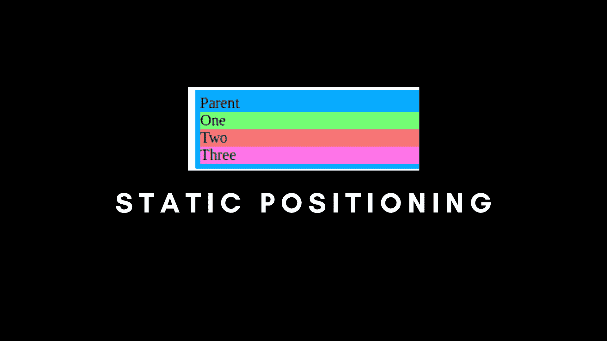

Output

下面是代码的样子:

```
/* Static Positioning */
.parent {
    padding: 5px;
    position: static;
    background-color: #00AAFF;
    width: 40%;
  }

  .child-one {
  	position: static;
    background-color: rgb(116, 255, 116);
  }

  .child-two {
  	position: static;
    background-color: rgb(248, 117, 117);
  }

  .child-three {
  	position: static;
    background-color: rgb(255, 116, 232);
  }
```

Static positioning in CSS

```
<!DOCTYPE html>
<html lang="en">
<head>
    <meta charset="UTF-8">
    <meta name="viewport" content="width=device-width, initial-scale=1.0">
    <title>CSS Position and Flexbox</title>
    <link rel="stylesheet" href="./index.css">
</head>
<body>
    <div class="parent">Parent
        <div class="child-one">One</div>
        <div class="child-two">Two</div>
        <div class="child-three">Three</div>
    </div>
</body>
</html>
```

在上面的例子中，我们有我们的父母，然后是孩子一，然后是孩子二，最后是孩子三。它们都是根据静态定位，即根据页面的正常流动来排列的。

## CSS 中的相对定位

相对定位的工作方式与静态定位完全一样，但是有一个问题。

在相对定位中，我们可以做四件静态无法做到的事情:我们可以将元素移动到左侧、右侧、底部和顶部。

让我们用一个例子来理解我的意思。

```
/* Relative Positioning */
.parent {
    padding: 5px;
    background-color: #00AAFF;
    width: 40%;
  }

  .child-one {
    position: relative;
    background-color: rgb(116, 255, 116);
  }

  .child-two {
    background-color: rgb(248, 117, 117);
  }

  .child-three {
    background-color: rgb(255, 116, 232);
  }
```

Relative Positioning

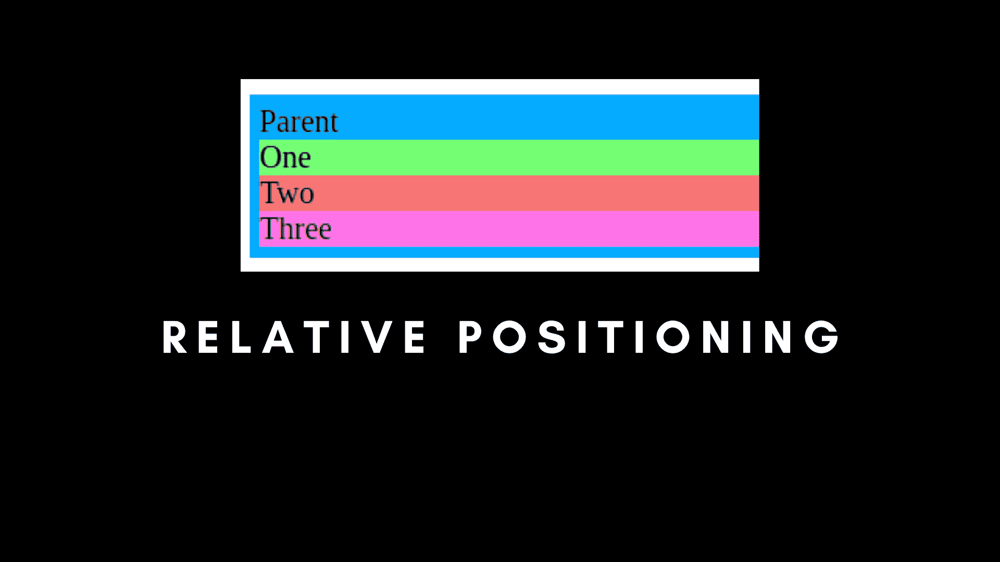

如果我们运行我们的应用程序，我们将看到输出没有任何差异。换句话说，静态定位和相对定位是一样的，除非我们使用顶部、底部、左侧和右侧的相对位置。

让我们尝试使用顶部、底部、左侧和右侧。

```
/* Relative Positioning with Top, Bottom, Left and Right */
.parent {
    padding: 5px;
    background-color: #00AAFF;
    width: 40%;
  }

  .child-one {
    position: relative;
    top: 10px;
    background-color: rgb(116, 255, 116);
  }

  .child-two {
    background-color: rgb(248, 117, 117);
  }

  .child-three {
    background-color: rgb(255, 116, 232);
  }
```

我们用**顶**与**中的**相对**。**

这将 **child-one** 从文档流中抛出，它将从顶部向底部移动 10px。

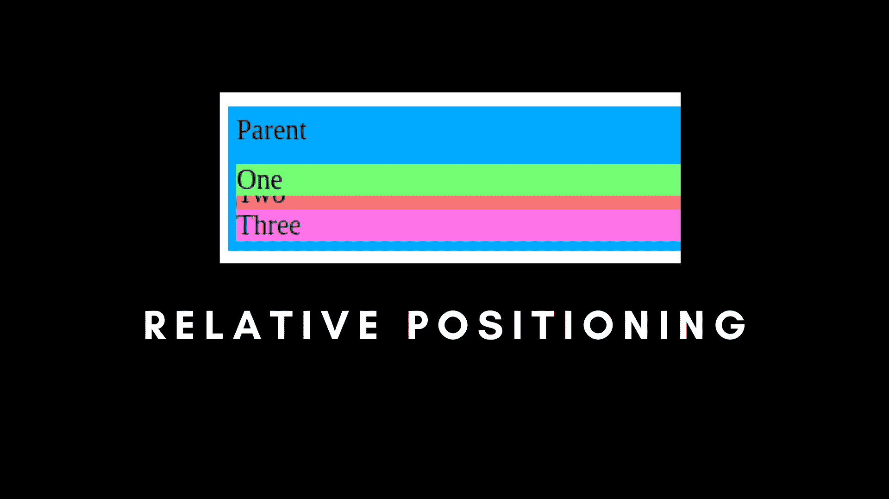

Relative positioning with Top

您可以看到它覆盖了**子元素-两个**元素。根据属性，如果您使用 left、right 或 bottom，情况也会类似。

**子-一**覆盖**子-二**的主要原因是**子-一**不再是正常文件流程的一部分，而**子-二**和**子-三**是。

## CSS 中的绝对定位

另一种定位元素的方法是绝对定位。这种定位将元素从文档流中完全移除。所有其他元素将忽略具有**绝对属性的元素。**

如果我们在 Absolute 中使用 Top、Bottom、Left 或 Right，它将根据父容器来排列元素，条件是父容器也必须是绝对定位的。

```
/* Absolute Positioning */
.parent {
    padding: 5px;
    background-color: #00AAFF;
    width: 40%;
    position: static;
  }

  .child-one {
    position: absolute;
    top: 0px;
    background-color: rgb(116, 255, 116);
  }

  .child-two {
    background-color: rgb(248, 117, 117);
  }

  .child-three {
    background-color: rgb(255, 116, 232);
  }
```

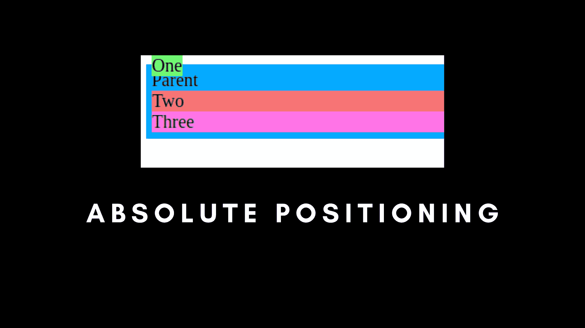

在这里，如果我们将 **Top 设置为 0px，那么 child one 在文档的正常流程之外。**

这是因为 child-one 是绝对的，而 parent 是静态的。

但是如果我们将父对象设为 **absolute，top 为 0px 呢？**

```
/* Absolute Positioning */
.parent {
    padding: 5px;
    background-color: #00AAFF;
    width: 40%;
    position: absolute;
    top: 0px;
  }

  .child-one {
    position: absolute;
    top: 0px;
    background-color: rgb(116, 255, 116);
  }

  .child-two {
    background-color: rgb(248, 117, 117);
  }

  .child-three {
    background-color: rgb(255, 116, 232);
  }
```

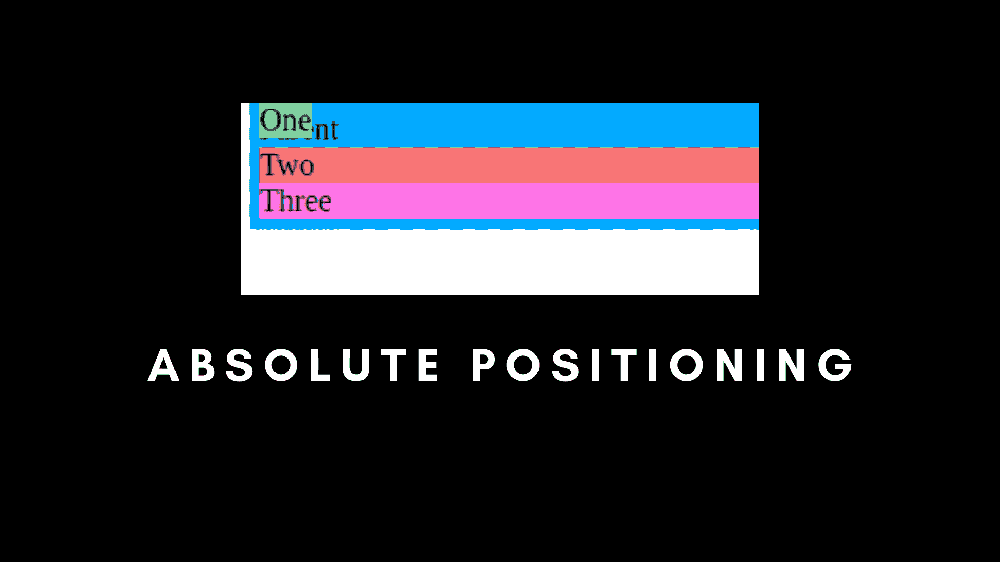

在这里，你可以看到第一个子元素与父元素重叠，两者都在 0px 的**顶部。**

还有第三个用例，我们可以将**父节点设置为相对节点**，将**第一个子节点设置为绝对节点。**

```
/* Absolute Positioning */
.parent {
    padding: 5px;
    background-color: #00AAFF;
    width: 40%;
    position: relative;
    top: 0px;
  }

  .child-one {
    position: absolute;
    top: 0px;
    background-color: rgb(116, 255, 116);
  }

  .child-two {
    background-color: rgb(248, 117, 117);
  }

  .child-three {
    background-color: rgb(255, 116, 232);
  }
```

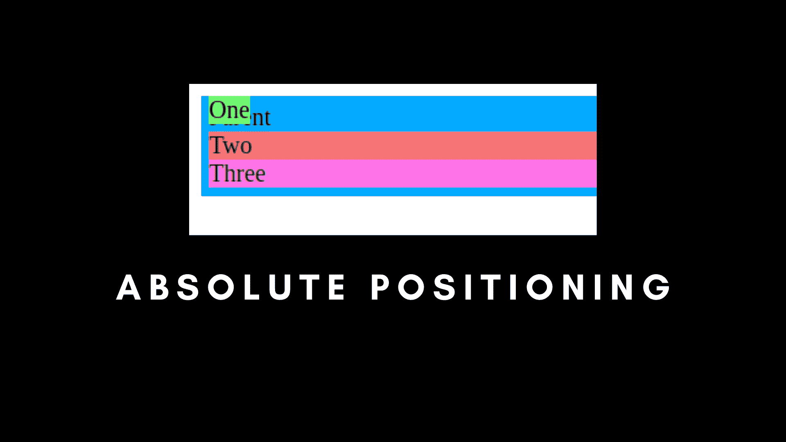

当我们使用相对和绝对时，这是最有用的用例。现在，你可以看到我们的**子元素**相对于**父元素**，而不是整个文档。

更简单地说，如果您将父项固定为相对项，将子项固定为绝对项，子项将跟随父项作为其容器。

## CSS 中的固定定位

用相对定位还记得绝对吗？有一个位置完全忽略了父元素，那就是固定定位。

固定定位是根据整个 HTML 文档固定的。它不会跟随任何其他父项，即使它设置为相对。

另一件事是，如果我们将某个东西设置为固定的，即使我们滚动，它也会保持在同一位置。

固定定位主要用于浮动项目和按钮。

```
/* Fixed Positioning */
.parent {
    padding: 5px;
    background-color: #00AAFF;
    width: 40%;
    position: relative;
    top: 0px;
    height: 1000px;
  }

  .child-one {
    position: fixed;
    top: 0px;
    background-color: rgb(116, 255, 116);
  }

  .child-two {
    background-color: rgb(248, 117, 117);
  }

  .child-three {
    background-color: rgb(255, 116, 232);
  }
```

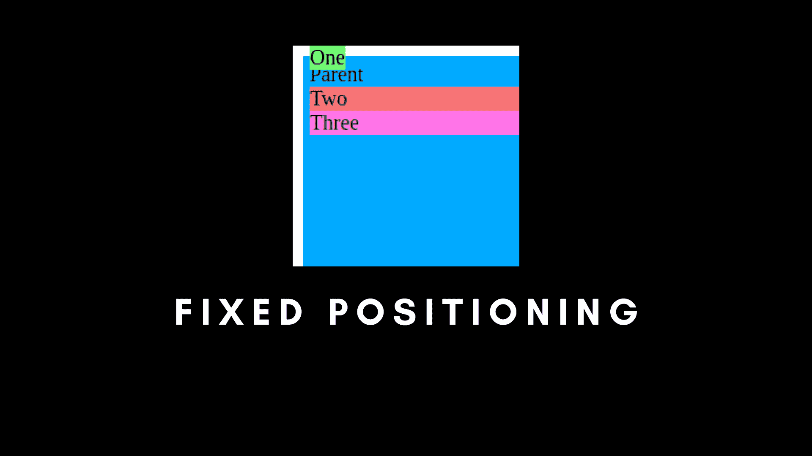

您可以看到第一个元素完全脱离了它的父组件，即使父组件被设置为相对的。

如果我们滚动，其余的子代将根据文档流动，但固定的将保持不变。

## CSS 中的粘性定位

粘性位置是相对和固定的结合。

```
/* Sticky Positioning */
.parent {
    padding: 5px;
    background-color: #00AAFF;
    width: 40%;
    position: relative;
    top: 0px;
    height: 1000px;
  }

  .child-one {
    position: sticky;
    top: 0px;
    background-color: rgb(116, 255, 116);
  }

  .child-two {
    background-color: rgb(248, 117, 117);
  }

  .child-three {
    background-color: rgb(255, 116, 232);
  }
```

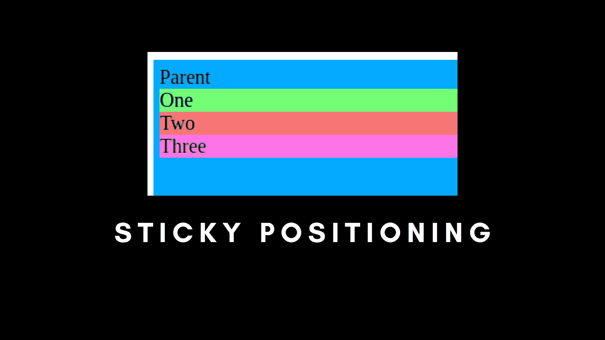

如果我们把一个孩子设置为粘性定位，它会看起来很正常，像相对的。但是一旦我们开始滚动，粘性子元素就会粘在顶部。它将成为一个固定的位置。

粘性位置主要用于创建导航栏。

现在我们已经解决了 CSS 问题，让我们把注意力集中在 Flexbox 上。

## 如何使用 Flexbox

您可以使用 CSS Flexbox 属性在不使用 float 的情况下排列项目。这使得在文档中排列项目更加容易。你可以用它来替换 CSS 中的网格。

如果没有 Flexbox，我们的输出将随文档流动，即子级 1，然后子级 2，然后子级 3。


但是，如果我们想让它们水平并排，如下图所示，会怎么样呢？


解决方案是 Flexbox。我们需要根据行或列均匀地放置它们，在它们之间或它们周围留有空间。

首先，让我们创建一个包含三个子 div 的父 div。

```
<!DOCTYPE html>
<html lang="en">
<head>
    <meta charset="UTF-8">
    <meta name="viewport" content="width=device-width, initial-scale=1.0">
    <title>CSS Position and Flexbox</title>
    <link rel="stylesheet" href="./index.css">
</head>
<body>
    <div class="parent">
        <div class="child-one"></div>
        <div class="child-two"></div>
        <div class="child-three"></div>
    </div>
</body>
</html>
```

大概是这样的:

```
/* Flexbox container */
.parent {
    background-color: #00AAFF;
    width: 300px;
    height: 300px;
    display: flex;
  }

  .child-one {
    background-color: rgb(116, 255, 116);
    width: 300px;
    height: 300px;
  }

  .child-two {
    background-color: rgb(248, 117, 117);
    width: 300px;
    height: 300px;
  }

  .child-three {
    background-color: rgb(255, 116, 232);
    width: 300px;
    height: 300px;
  }
```

我们可以看到父类已经被声明为 **flex。**

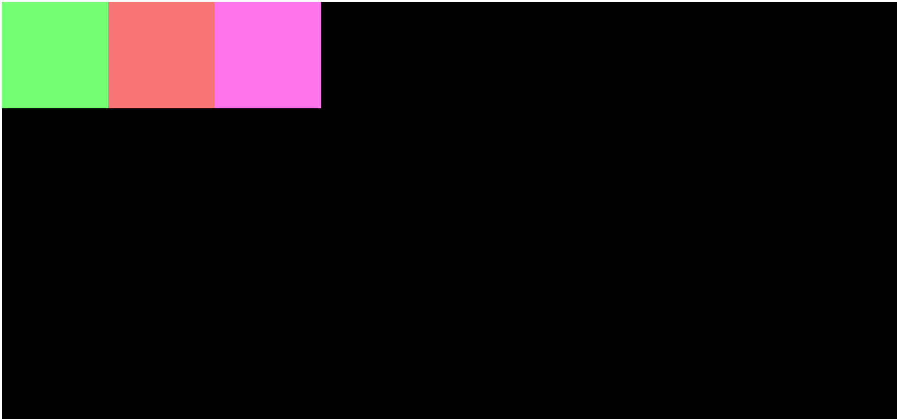

这里，我们有三个 div 框，每个都有不同的颜色。这是默认的 Flexbox 排列。

让我们看看 Flexbox 中不同类型的排列。

## 如何用 Flexbox 排列元素

### 弯曲方向

该属性定义了元素在屏幕上的显示方式，即垂直显示还是水平显示。

**行**用于水平排列项目。


正如你所看到的，我们有一个水平的排列。

**列**垂直排列项目，如下:

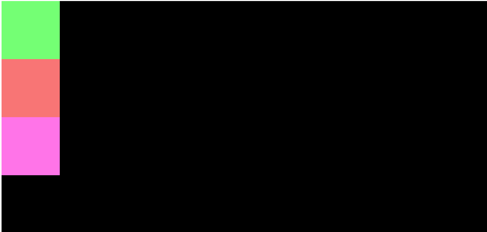

这些方块现在排列成一个垂直的列。

**行反转**与行完全一样，但是元素的位置将会反转。第一个元素将是最后一个，最后一个元素将移动到第一个。项目的排列将与 **flex-direction: row 相反。**

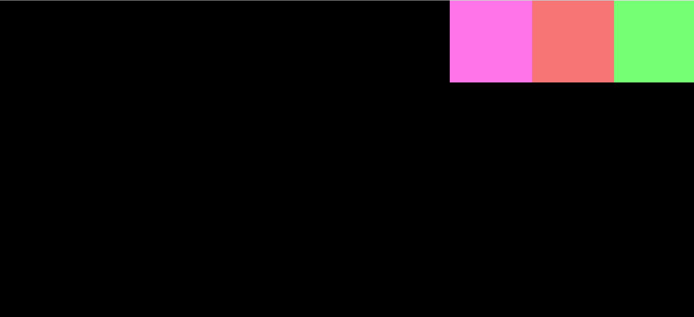

**列反转**的工作方式与列完全一样，但是元素会被反转。第一个元素将是最后一个，最后一个元素将移动到第一个。

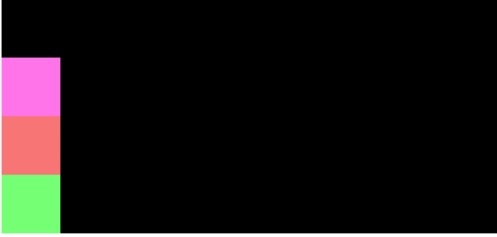

### 对齐内容

该属性确定元素的水平对齐方式。

**居中**将元素设置为页面的水平居中。

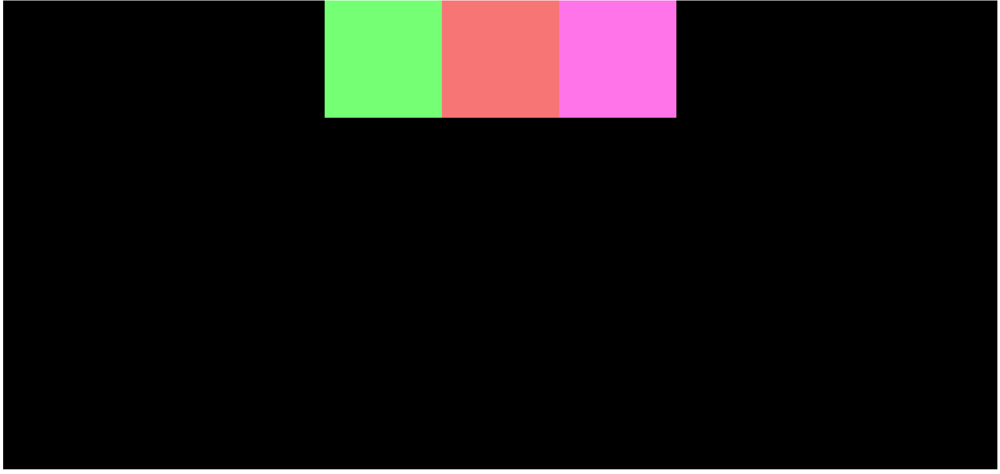

**Flex Start** 将元素定位在页面的开头。

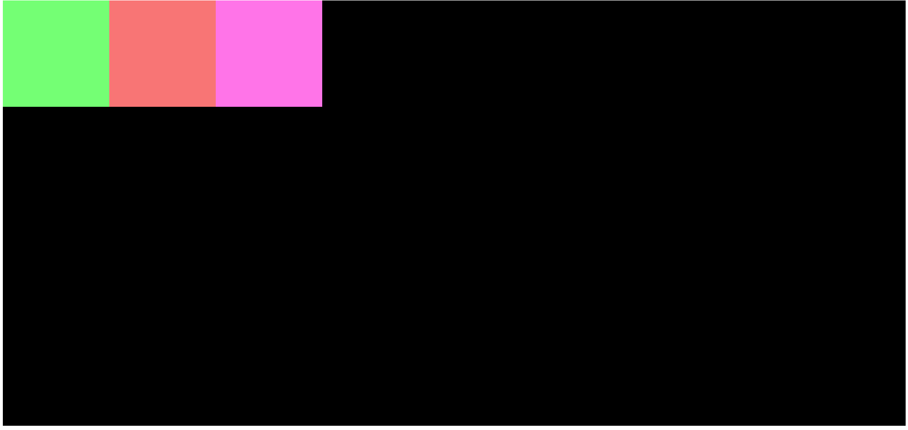

**Flex End** 将元素设置到页面的末尾。

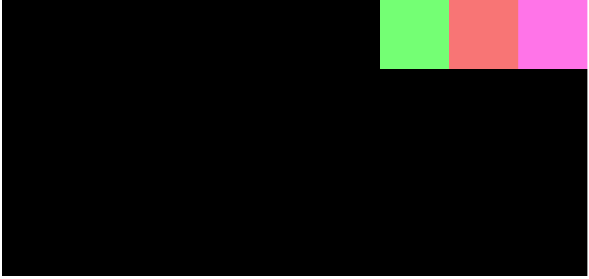

**周围的空间**均匀排列项目，但项目之间留有空间。flex-box 容器内的所有元素之间的间距是相等的，但在它们之外的元素之间的间距是不相等的。

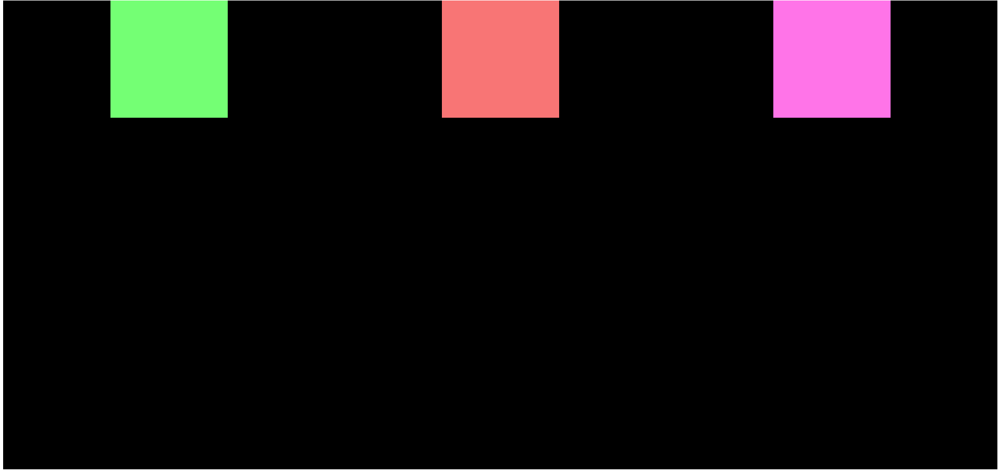

在这里，第一个孩子、第二个孩子和第三个孩子之间的空间是相等的，但在外面不是。

**Space Between** 最大化子元素之间的间距(这是一个 Justify Content 属性)。

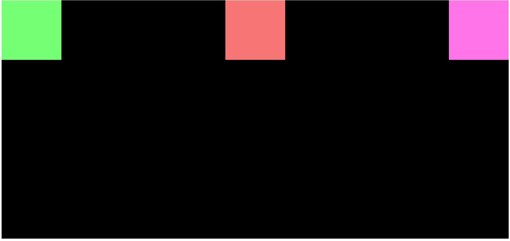

**均匀分布**在子元素和 FlexBox 容器外的空间之间分配相等的空间。

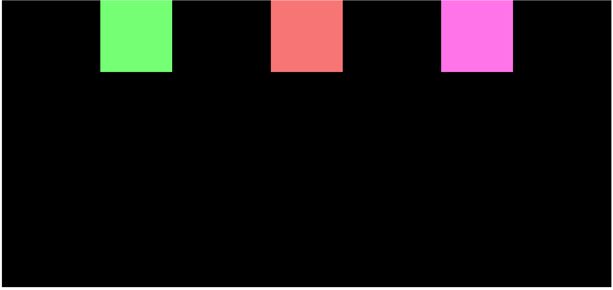

### 对齐项目

对齐项目用于在 flex 容器内垂直对齐项目。但这只有在有固定高度的情况下才有效。

**居中**将元素垂直设置在页面中央。

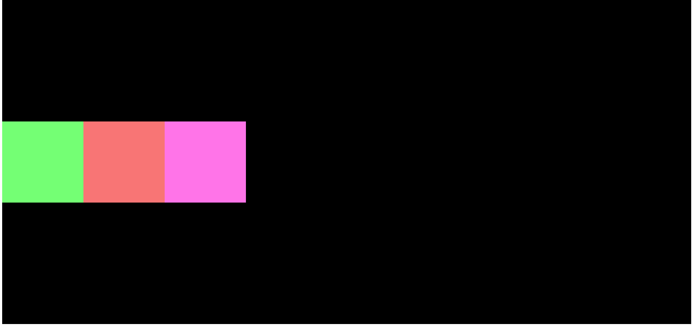

**Flex Start** 与将内容居中对齐相同，但它垂直排列元素。在我们的例子中，元素将在屏幕的左上角。

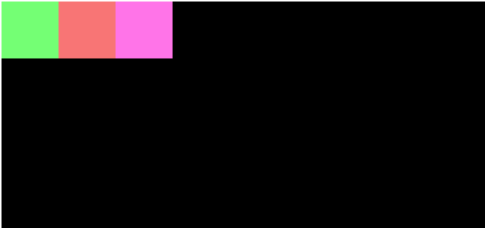

**Flex End** 与 Flex Start 相同，但这会将项目对齐到屏幕的左下角。

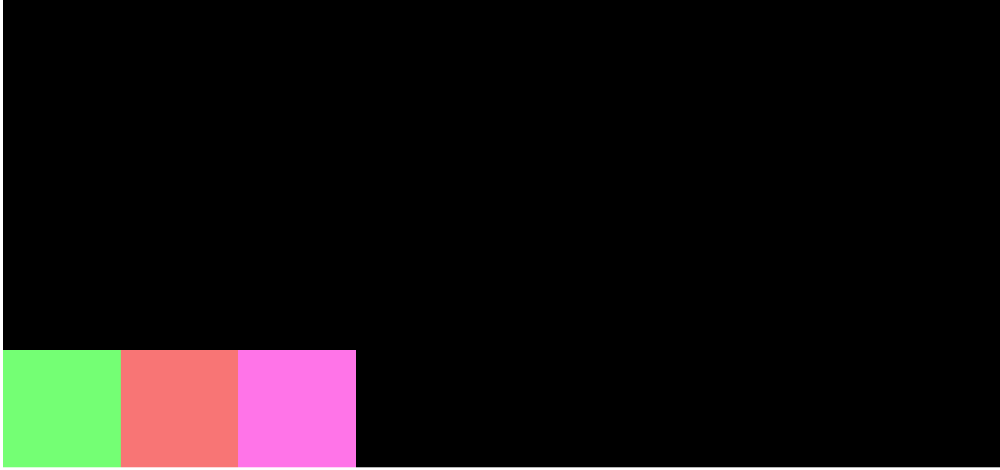

现在，您已经了解了 Flexbox 的一些基础知识。

## 如何在屏幕中央对齐项目。

这些 Flexbox 属性也可以一起使用。例如，如果我们想将项目排列在正中央，我们可以同时使用 **align-items: center** 和 **justify-content: center。**

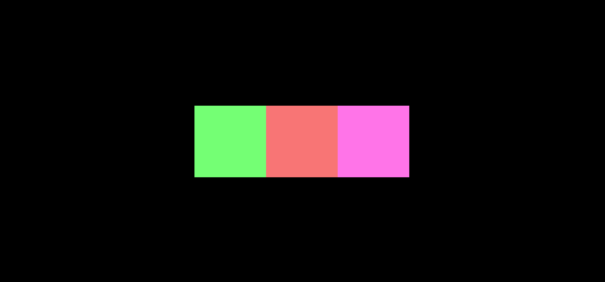

如果你想做更多的实验，你可以在 Github 上找到代码。

这就是所有的人——感谢阅读。

> 不断尝试。继续学习！