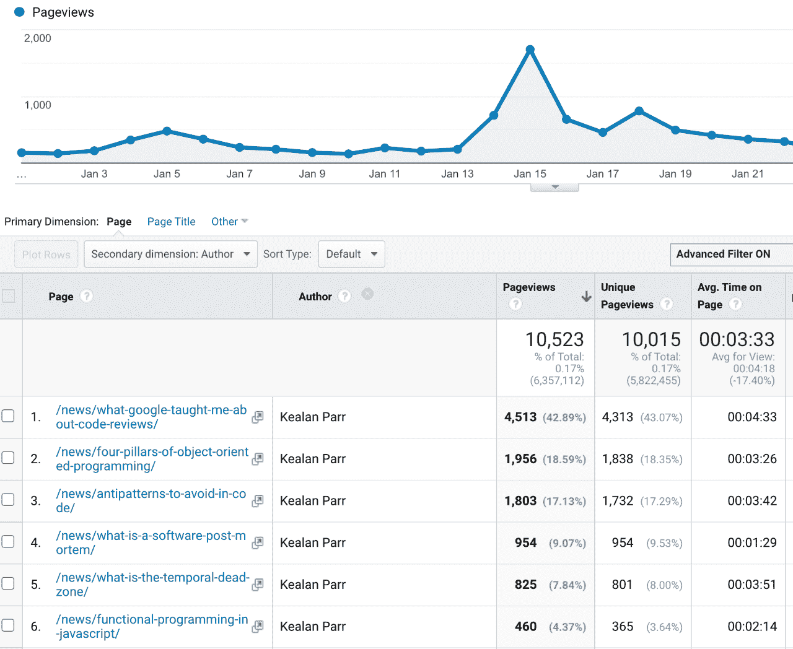

# 如何为 freeCodeCamp 新闻撰稿

> 原文：<https://www.freecodecamp.org/news/how-to-write-for-freecodecamp/>

写作是开发人员必须具备的一项重要技能。

这是你传达自己的想法、影响他人、宣传自己的技能和加薪，以及撰写评论和文档来帮助他人的方式。

> “许多人低估的是，作为一名优秀的作家，
> 无论是通过电子邮件还是通过文件，都会让你
> 更有影响力。我看到许多工程师忽略了这一技能。
> 
> 你可能会为自己的代码感到骄傲。你也应该同样为写作的手艺感到骄傲
> …写作对于工程师来说是一项被高度低估的技能
> ”–**乌尔斯·霍尔兹勒(谷歌首任工程副总裁)**

写作可以:

*   打动未来的雇主
*   帮助你巩固你最近学到的知识
*   与其他开发人员分享见解
*   让其他人免去数小时研究的痛苦

freeCodeCamp 真的可以帮助你提高写作技巧。他们可以根据人们搜索的内容给你出主意，他们会校对和编辑你的文章，确保每件事都解释清楚。然后他们帮助向广泛多样的受众发布。

所有这些都是由**编辑团队**完成的，他们都非常友好，而且(最重要的是)非常有用。随着你写的文章越来越多，你会更多地了解每个人是谁，以及他们如何能帮助你。

我将简单解释一下我是如何开始为 **freeCodeCamp** 写作的，以及我目前为止的体验。我们还会谈到 **freeCodeCamp** 的出版风格指南，你可以在这里找到[。](https://www.freecodecamp.org/news/developer-news-style-guide/)

# 谁为 freeCodeCamp 写稿？

有各种各样的人为 freeCodeCamp 写作。

有些是开设编程课程的专业教师，有些是独立开发者，有些还在学习编程，有些是全职受雇的软件工程师...这样的例子不胜枚举。

有来自世界各地的人说着许多不同的第一语言——在**自由代码营**上有许多声音。

成为 **freeCodeCamp News** 的投稿人没有硬性的先决条件。他们不会检查你是否有计算机科学学位(事实上，许多自学成才的程序员会写关于新闻的文章)，不会让你参加测试，也不会期望你在写作前完成他们的全部课程。

你只需要有一些以前的写作经验，这样你就可以在申请成为投稿人时提供你的作品样本。

但是有一些关于你贡献内容的指导方针(也许 **freeCodeCamp** 不是你做千层面食谱的地方)。

我是一名全职软件工程师。我写作是为了了解更多我感兴趣的话题。

freeCodeCamp 广泛分发他们的文章，仅上个月(2021 年 1 月)人们就花了 600 个小时阅读我写的文章。那很酷。

# freeCodeCamp 的风格指南涵盖了哪些内容？

[风格指南](https://www.freecodecamp.org/news/developer-news-style-guide/)是**自由代码营**标准化他们的期望和指导方针的方式，以便所有贡献者知道如何最好地研究、写作和展示他们的文章。这也有助于确保发布的内容是高质量的。

风格指南涵盖的主题包括文章长度、写作技巧、如何写好标题、如何选择封面图片、如何不抄袭他人的作品、关于交叉发布的一些规则等等。

我还发现参加谷歌技术写作课程很有用，你可以在这里找到。如果你不想上这门课，你可以在这里[阅读我的总结](https://www.freecodecamp.org/news/what-google-taught-me-about-technical-writting/)，如果你没有 4 个小时来完成所有课程的话。

这门课程帮助我学习了一些技术写作的常用技巧，但它不是免费代码营的必修课。

# freeCodeCamp 作者如何申请？

如果你想申请成为 freeCodeCamp News 的投稿人，你应该先[阅读风格指南](https://www.freecodecamp.org/news/developer-news-style-guide/)。在里面，你会找到申请表。

当你填写申请表时，会被要求链接到你过去写过的 3 篇文章。

如果你没有三个样本，或者你做过的工作是私人的，就在 [dev.to](https://dev.to/) 或者 [Hashnode](https://hashnode.com/) 上做个账号，写点文章。这有助于 freeCodeCamp **编辑团队**了解你的写作风格，你喜欢写什么，以及你是否适合出版。

我只是想强调一下，你应该读一下 **freeCodeCamp** 的[风格指南](https://www.freecodecamp.org/news/developer-news-style-guide/)。读两三遍，如果你不能 100%确定某事的意思，就发邮件给团队。

如果你按照 **freeCodeCamp** 的风格指南写这 3 篇文章，你将大大增加你被批准为贡献者的机会。

但是他们也确实“T0”只批准一小部分“T1”的贡献者申请人，所以如果你第一次没有成功也不要气馁。

我对获得批准的最好建议是，努力找到你正在阅读的文章中缺少的内容。你打算为完全初学者还是中间用户写文章？你打算说多少细节？你有最喜欢的编程语言吗？你有多幽默？没有，还是有很多笑话推荐？读者应该如何应用这些知识？

当我第一次开始写作时，我犯了几次体裁错误(我为一篇文章写了讽刺文章，我的一些文章想法不是很好)。但是通过一些实践和与团队的交谈，我开始提高和理解什么是 **freeCodeCamp** 的流派。

## 但是我写不好

那又怎样？提高的最好方法是通过写作！如果你觉得自己的写作能力很弱，试着给自己设定一个具体的目标——例如，一周写 50 个词，任何话题都可以。对你来说可以实现的事情，并且是你喜欢的话题。

给自己 6 个月的时间，看看自己是否有所进步。反思你不喜欢你的作品的地方，并努力解决它。

我的另外一个提高写作水平的建议是多阅读。我读得越多，随着时间的推移，通过观察别人是如何做的，我的写作变得越好。

## 我不知道该写些什么！

写一些你想了解的东西。你不必成为某方面的专家来写它。你通过写作、讨论和研究你感兴趣的话题来发展专业知识。

一旦你有了贡献者账户，如果你需要帮助，你也可以问编辑团队。

## 如果我错了呢？

这是团队阅读的证明，所以你不是一个人。他们提供了第二双眼睛，如果你在研究中误解了什么，你可以在发表后进行编辑。

这也是一种很好的学习方法。当你发表了错误的东西，人们会直接给你发信息来纠正你。我被告知一些人们认为不清楚的事情。我向他们表示感谢，并回顾了他们所说的话，这些话经常帮助我改进那篇文章。

不要害怕尝试失败！

## 我写得太慢了

**freeCodeCamp** 没有为您安排的日程。他们不会发邮件催你一周写一篇文章。

你只要想写就写，编辑团队会在你准备好的时候帮你校对和提供任何帮助。如果你只想一年发表一次，那就去吧！

## 英语不是我的第一语言

许多 freeCodeCamp 新闻投稿人就是这种情况。他们通过写作练习英语，并为免费代码营的观众做贡献。

如果你一直想尝试技术写作，我希望你会受到鼓励，而不是被胁迫去突破你的舒适区。

# 结论

你可以[在这里](https://www.freecodecamp.org/news/developer-news-style-guide/)申请向**自由代码营新闻**投稿。

我写作的一部分受到昆西在这里做的关于写技术文章的演讲的影响。如果你将来打算申请**免费代码营**，我会鼓励你观看。他还给出了一些有趣的案例，关于开始写作的人以及由此带来的好处。

我非常喜欢为 freeCodeCamp 写作，这对我来说是一次非常积极的经历。我鼓励任何人尝试写作。

即使你没有在 **freeCodeCamp** 完成这项工作，这也是一项值得投入时间的技能，它会让你成为一名全面发展的开发者。

如果你喜欢这篇文章并想看更多，我在 Twitter 上分享我的文章。