# 我如何重新设计硅谷最热门的应用程序 Clubhouse

> 原文：<https://www.freecodecamp.org/news/how-i-redesigned-clubhouse/>

我想通过改善 Clubhouse 的用户体验来测试我作为一名年轻设计师的极限，club house 是社交媒体领域最热门的新音频对话应用程序。

在与应用程序的高级用户和新手交谈后，我发现了应用程序中寻路和可发现性的一些具体痛点。这些成为指导我整个项目工作的主要设计挑战。

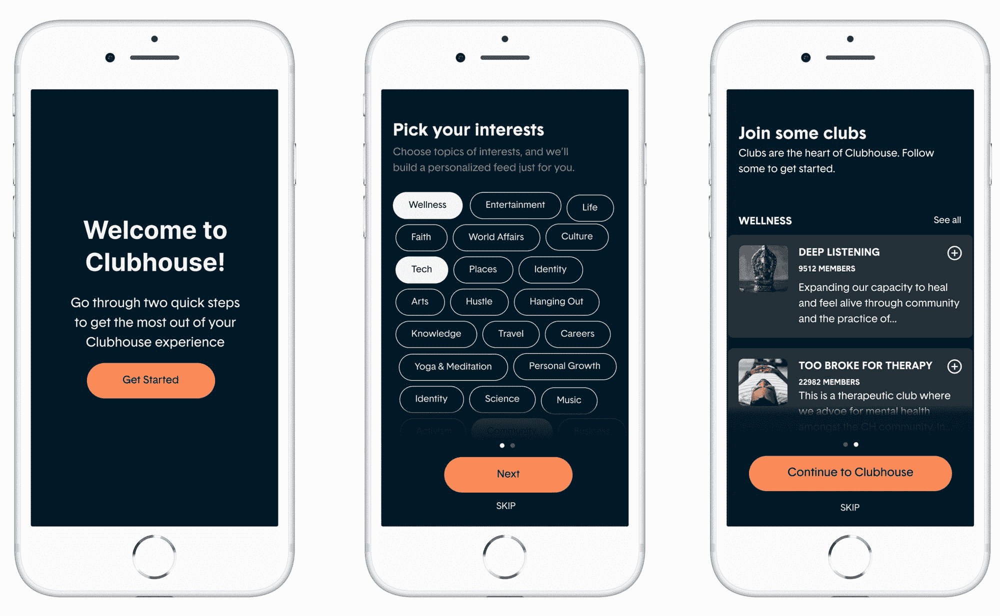

Onboarding Mockups

**免责声明**:我不为 Clubhouse 工作，本案例研究中的观点仅代表我个人。

作为一名崭露头角的设计师，我承认我对这个项目的愿景可能过于雄心勃勃，有时依赖于对业务目标和用户数据的假设。

在一个完美的世界里，我会和俱乐部团队一起工作，直接访问这些资源来指导我的工作。在此之前，这个案例研究是对我非常欣赏的产品的探索性学习体验。

## 案情摘要

很难低估人们对 **Clubhouse、**这款音频聊天应用的兴奋程度，会员可以在虚拟房间里讨论从文化到政治的各种话题。

该应用在测试版发布一个月后，仅用 1500 名用户就筹集了第一笔 1 亿美元的资金。在我写这篇文章的时候，这个硅谷最热门的应用刚刚被估价为[10 亿美元](https://fortune.com/2021/01/25/clubhouse-reaches-a-1-billion-after-taking-off-some-nine-months-ago/)，仅仅是在发布后 9 个月，甚至在向公众发布之前。

除了在投资者中的成功，Clubhouse 还积累了一个非常忠诚的用户群，他们的创造力从 24 小时不间断地为新用户提供房间到现场制作的[狮子王。](https://www.complex.com/pop-culture/2020/12/clubhouse-users-organize-live-production-the-lion-king)

作为邀请平台的早期测试用户，我有实时跟踪产品更新(和指数级成功)的独特视角。我试图用我最雄心勃勃的项目来挑战自己:重新设计硅谷近年来最令人兴奋的应用程序。 **没有压力。**

该项目的高层次目标是:

*   **提高俱乐部会所内的可发现性**，允许用户更容易地找到新的房间、人和俱乐部
*   **创造更加无缝的走廊体验，**用户可以在这里过滤并找到与他们最相关的房间

## UX 挑战:简化复杂的信息层次结构

我必须考虑的一个主要因素是用户可以在应用程序中与之交互的主要组件的层次结构:

*   **人**(应用程序的其他用户)
*   **房间**(用于音频对话的虚拟会议场所)，以及
*   **俱乐部**(可以托管房间的兴趣小组)。

除此之外，**我不得不考虑这些组成部分是如何相互联系的，**包括人与人之间和时间上的联系。

目前，一个俱乐部用户的走廊(主屏幕)显示与他们关注的人和俱乐部连接的*实时房间(在本案例研究中，我将其称为“网络内”)。这使得用户很难容易地跟踪他们网络中即将到来的房间，以及加入新的网络外房间。*

***这成了我整个工作中的一个主要二分法:**我需要找到一个平衡点，让俱乐部会所的每一个独立部分都容易被发现，同时维护并简化将它们编织在一起的网络。*

*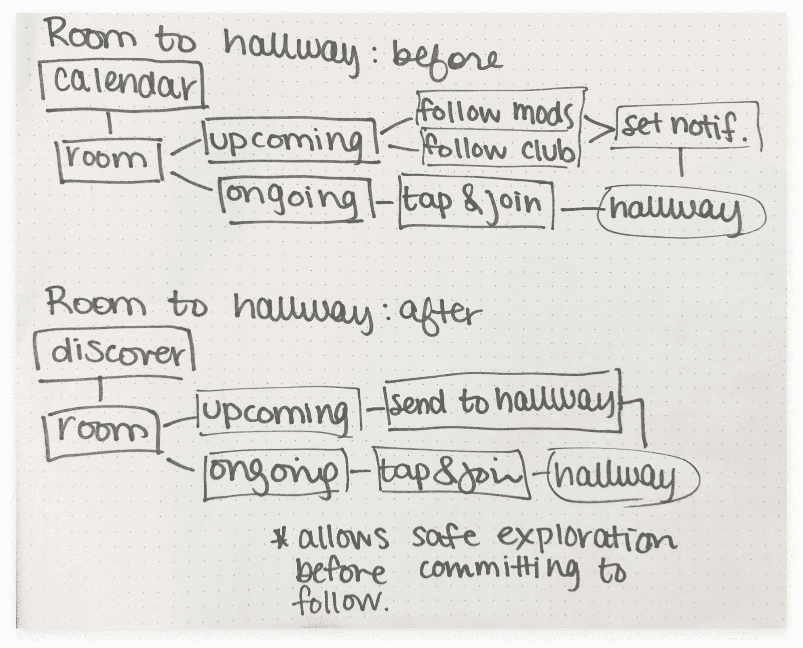

Discovery task flow* *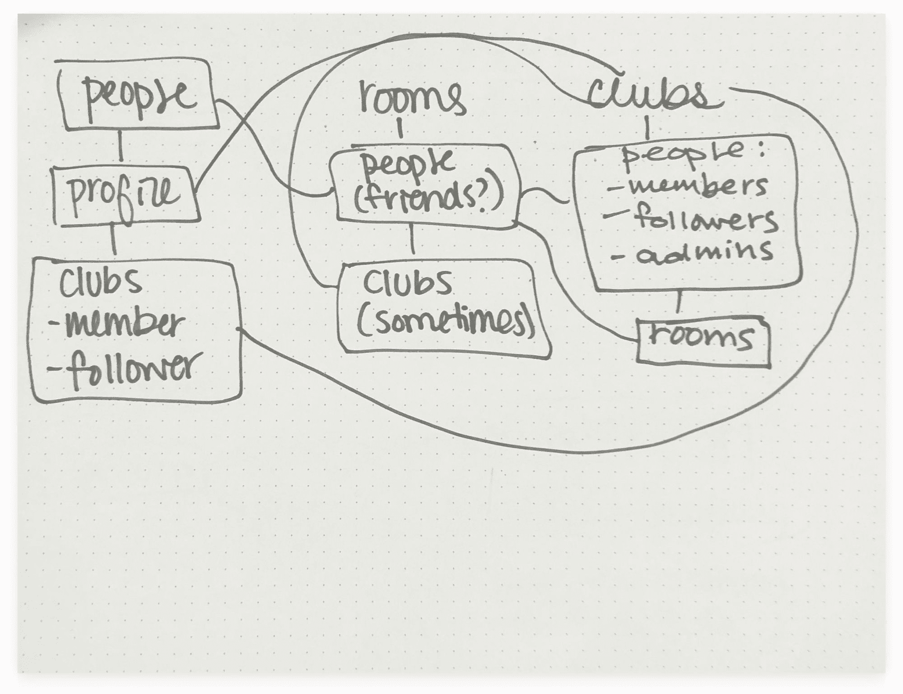

Mind map of the relationship between Clubhouse components* 

## *研究+规划:UX 研究者的梦想*

*这个项目的另一个独特之处是【beta 用户可以直接接触到俱乐部创始人 Paul Davison 和 Rohan Seth。每周日，两人都会举办 Clubhouse Townhall，这是一个开放的论坛，他们在这里分享一周的最新产品更新、即将推出的路线图、业务目标和首要任务，并为用户提交的问题&留出空间。*

*由于 Clubhouse 的热情用户群，官方市政厅之后通常会有市政厅回顾室(对社区俱乐部大喊)，超级用户可以在那里深入了解本周的更新以及他们最感兴趣的功能。*

*在俱乐部市政厅、总结室、官方和社区运营的新成员入职室(包括常见问题解答、问答和讨论)之间，**我平均每周花 5 个小时，持续 6 周，从我有限的有利位置获得尽可能多的商业见解和目标**。*

*

A compilation of some of the rooms that became a regular part of my UX Research* 

*通过这些讨论，俱乐部会所团队的总体目标是:*

*   ***让每个人都能使用俱乐部会所:** Paul 一直明确表示，团队的首要任务是在不牺牲质量的情况下尽快扩展俱乐部会所*
*   ***将创作者放在第一位:【Paul 一直强调的另一点是团队对平台创作者的优先排序，构建允许创作者货币化的工具***
*   ***提高可发现性和建议内容:**在进行该项目时，Clubhouse 正在积极构建他们的主题目录和算法，这将使找到相关房间变得越来越容易*

*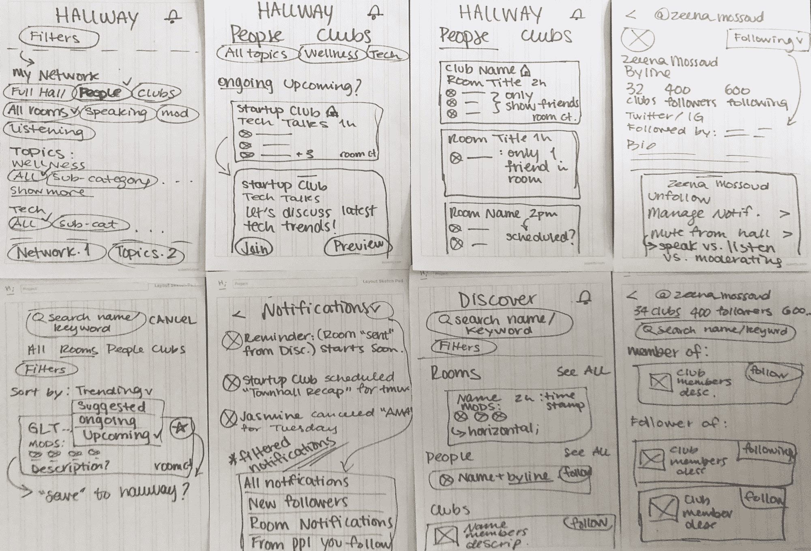

Early sketches of how different screens might behave* 

## *用户访谈，从超级用户到新手*

*我与俱乐部会所用户——包括高级用户和更随意的社区成员——进行了交谈，以发现他们目前与应用程序的发现体验之间的摩擦点。这些采访给了我以下的启示:*

*   ***保持轻便:**大多数用户更喜欢房间发现是一种自发的体验，不一定想要在他们的个人日历中安排即将到来的房间*
*   *杂乱的走廊:大多数用户对走廊目前是如何管理的，以及他们跟踪的人在任何给定的房间中都有谁感到困惑*
*   ***走廊作为发现的来源:**尽管有杂乱的走廊体验，大多数用户仍然依靠走廊来寻找新的房间，尽管有一个现有的(但尚不强大的)“探索”选项卡*
*   ***朋友优先:**当决定在走廊上加入哪些房间时，用户一致希望看到他们的哪些朋友在任何给定的房间里*

*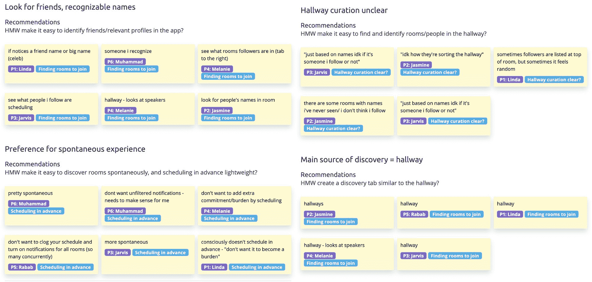

Affinity map of my user interviews (made using Evolve)* 

*那么，我们如何才能让走廊成为一个清晰简洁的自发互动场所，同时促进轻量级的网络外发现呢？*

## *UX 解决方案:简化从发现到走廊的流程*

*我开发了一个简单而强大的用户界面，让你在走廊和房间里更容易找到路。它还能让你轻而易举地将通过“发现”页面找到的房间带进你的走廊。*

*为了让这个解决方案看起来有凝聚力，而不是孤立的，**我需要对 Clubhouse 进行近乎全面的重新设计，**分成 5 个主要体验。*

***玩转最终原型** [**此处**](https://www.figma.com/proto/zZ7KUnIt9Hrw27IKiXJfEo/CH-wireframes?node-id=263%3A257&scaling=scale-down) **。***

*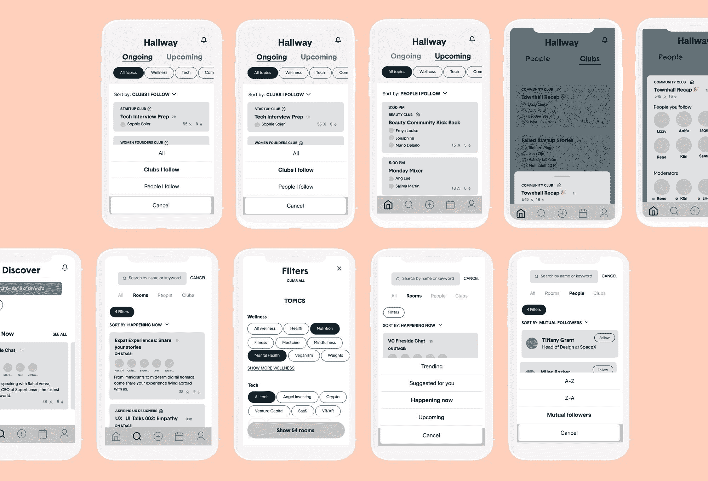

Early Wireframes* 

## *体验 1:走廊*

*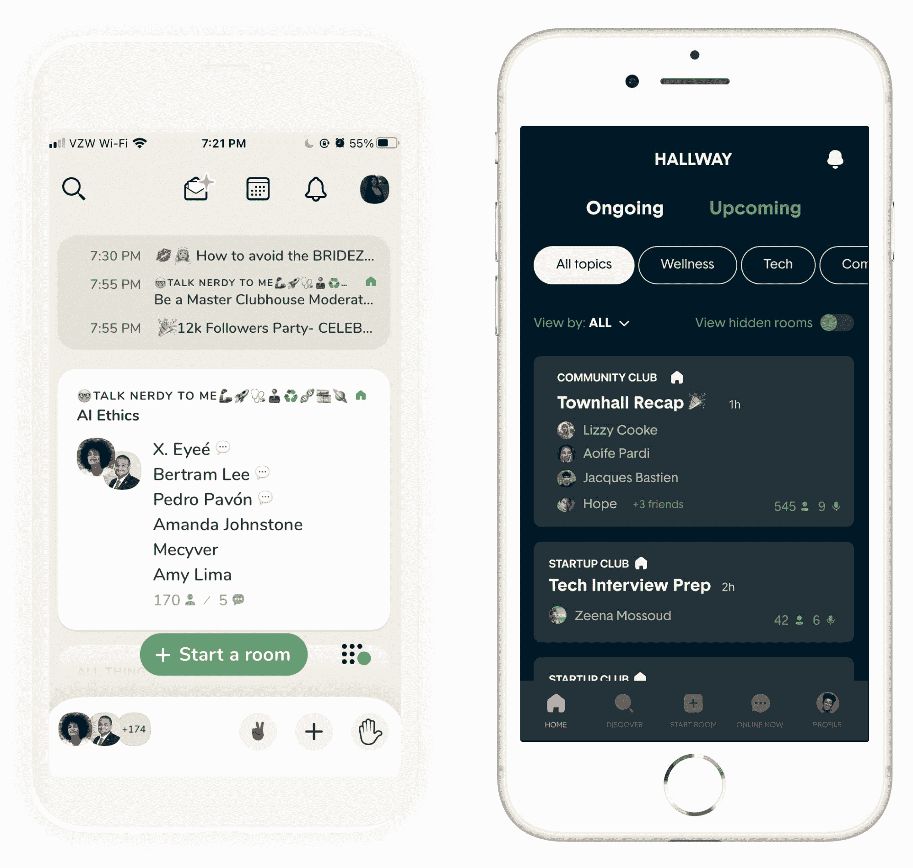

The Clubhouse Hallway currently (left), and reoptimized for more functionalities and access to controls (right)* 

*用户希望他们的走廊体验更有目的性，并在他们的控制之下。为此，我建立了一个顶级层次结构:*

*   ***正在进行的与即将进行的**，让用户不仅可以看到正在进行的房间，还可以快速浏览其网络内预定的房间*
*   ***按感兴趣的主题过滤，**由用户在入职时选择，以及*
*   ***在走廊上对房间进行分类**根据你关注的人和俱乐部进行分类*

*一个额外的 UI 决定是只显示你在走廊房间里跟随的人。这将缓解目前用户在走廊里看到的房卡上的名字模糊不清的问题。*

*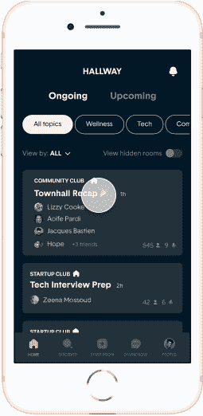

Navigating the reimagined Hallway* 

## *体验二:房间预览*

*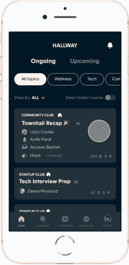

Room preview in action, where users can see a full list of which friends are inside any given room* 

*目前在 Clubhouse 中，点击走廊上的一个房间会立即让你进入那个房间的对话。*

*由于在任何给定的房间中识别朋友是用户加入房间的重要决定因素，所以我想设计一种方法让用户在加入房间之前看到他们认识的人。*

## *经验三:发现*

*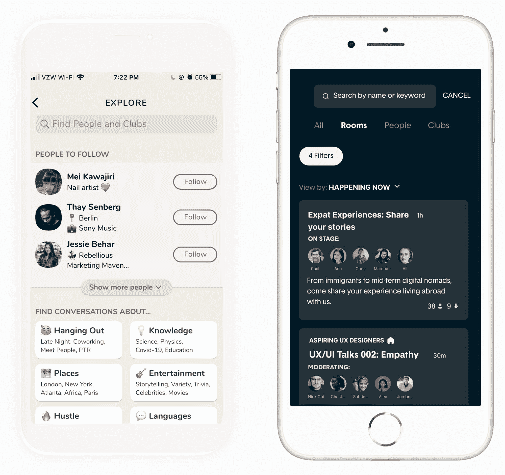

Clubhouse’s Explore tab currently (left), and redesigned as an immersive discovery experience (right)* 

 ***目前，在俱乐部会所中的发现是虹吸的:**用户进入探索选项卡，通过类别和关键字发现人和俱乐部，并且他们进入日历选项卡，在所有俱乐部会所中发现活动的和即将到来的房间。*

*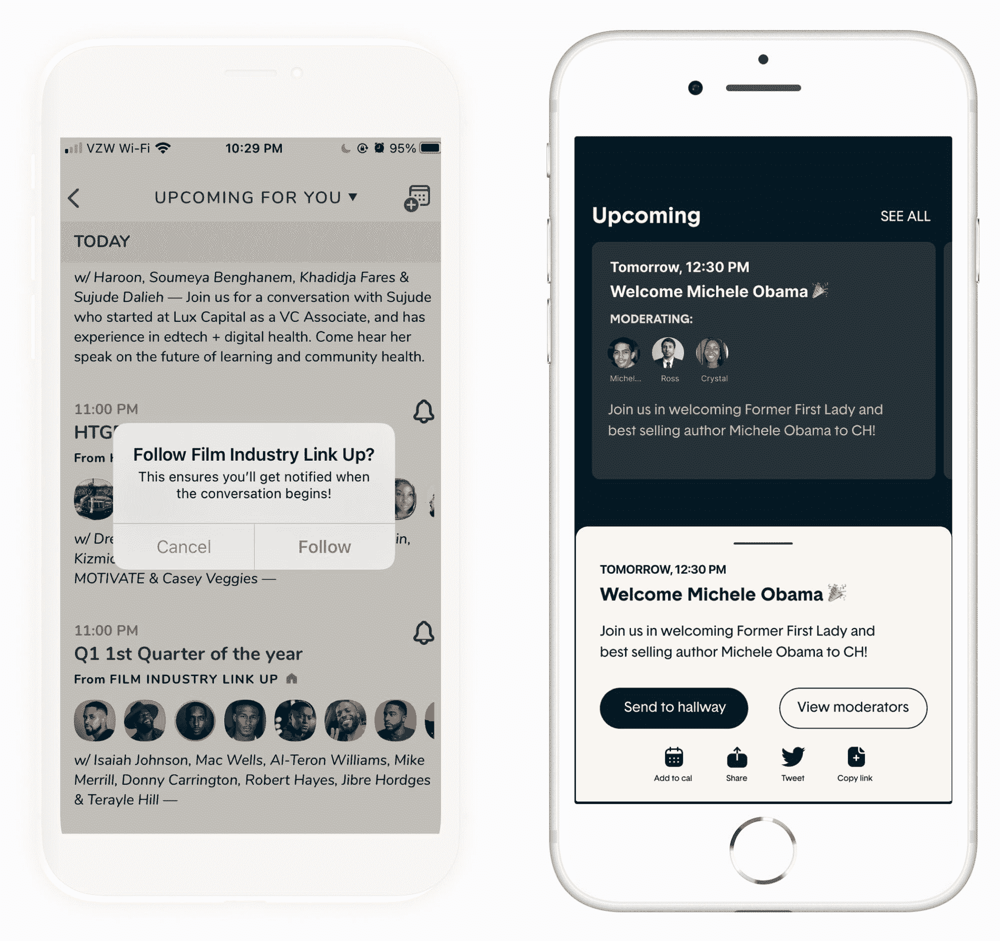

Bringing a room to your hallway via Clubhouse’s Calendar tab currently (left), and reimagined as a simple bottom sheet function (right)* 

*大多数参与者实际上并没有使用这些标签来实现他们的主要发现目标。相反，他们采用了变通办法，如通过用户资料发现俱乐部，通过房间发现人，以及主要通过走廊发现房间，限制他们接触的内容范围。*

*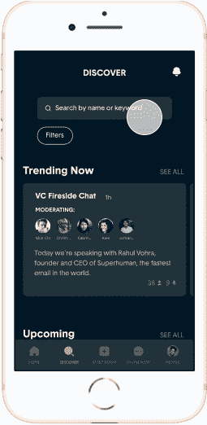

An immersive discovery experience with rich filter and sort options* 

*虽然我设计了 UI 解决方案来使这些解决方案更加无缝，但我希望 discover 页面成为适应所有这些用例的首选目的地，允许用户通过 Clubhouse 不断增长的主题目录以及关键字来搜索人员、俱乐部和房间。*

*我还集成了一个额外的排序功能，以进一步促进发现。*

*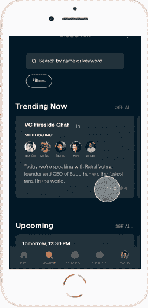

Sending an out-of-network room to your Hallway* 

 *用户还想要一个简单、轻量级的解决方案来发现和访问网络外的房间。*

*将一个房间从 discover feed 发送到您的走廊，而无需遵循该房间的主持人、相应的俱乐部或您个人日历中的日程安排，这是该项目的最大挑战，为了直观起见，需要多次迭代。*

## *体验 4:活跃用户*

*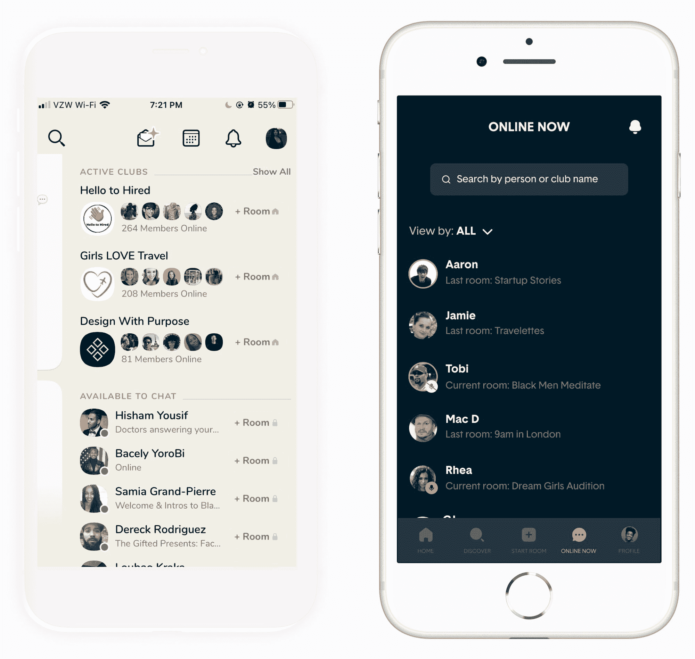

Clubhouse “Available to Chat” flyout currently (left), and reimagined as an “Online Now” tab (right)* 

*作为走廊的近亲，你的活跃用户界面是你所有俱乐部会员和俱乐部目前在线的地方。 **83%的受访用户提到扫描这个屏幕可以快速识别他们的朋友在哪个房间。***

*我添加了一个非常受欢迎的搜索栏，以进一步方便朋友的查找，还添加了一个排序下拉菜单，以达到一个更重要的区别:谁在房间里积极参与，而只是在听。*

*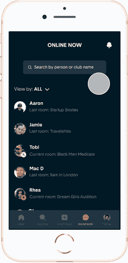

Discovering active users by different sort options* 

## *体验 5:用户和俱乐部简介*

*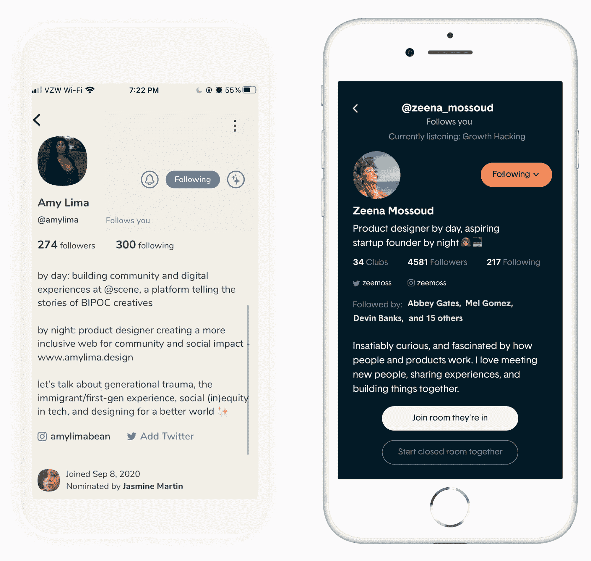

Clubhouse User Profiles currently (left), and after consolidating clubs as one metric (right)* 

 ***87%的用户直接通过用户档案发现合适的俱乐部。**俱乐部内部还有一个更深层次的结构:追随者(他们会收到通知，并在走廊上看到俱乐部品牌的房间)和会员(除上述人员外，他们也可以自己创建俱乐部品牌的房间)。*

*在 Clubhouse 的当前设计中，**用户关注的俱乐部和用户是其成员的俱乐部位于不同的位置:**分别在用户的关注列表中和他们的用户简档的底部。这对于想要扫描与特定人相关联的所有俱乐部的用户来说是令人困惑的。*

*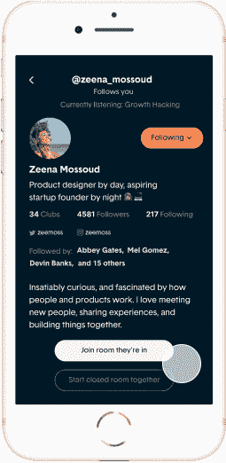

Navigating both User and Club Profiles* 

*通过使与用户相关的俱乐部成为一个统一的指标，访问该简档**的用户可以更容易地看到该人属于哪个俱乐部，**并立即跟进，而无需访问新的屏幕。*

*在俱乐部层面，**能够访问元数据**,如以前拥有的房间、即将到来的房间和俱乐部管理员，可以帮助用户更有效地了解俱乐部。*

## *UI 与品牌:黑暗 UI 的一个案例*

*在将这种体验的所有部分结合在一起时，很明显添加太多的视觉元素会破坏轻松浏览应用程序所需的视觉层次。*

*此外，Clubhouse 上的典型用户体验已经是如此身临其境和情绪化，经常跨越夜晚的所有时间——我想利用这个用例，实现一个优雅的 UI，和谐地强调 Clubhouse 的几个内容类型。*

*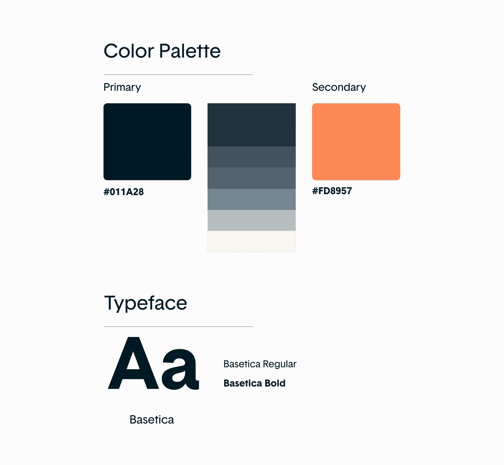

A snippet of the Style Guide that guided my work* 

## *可用性测试:整个应用程序的可发现性和可发现性有多有效？*

*在进行了可用性测试之后，我创建了一个亲和力地图，其中包含了测试过程中的见解、行为和发现。*

*大多数用户在使用该应用时几乎没有失误，但对于许多参与者来说，有一个主要的摩擦点破坏了重新设计的一个关键支柱:*

*仍然不清楚如何从发现页面进入您保存的房间。*

## *可用性测试洞察和优先级变化*

*最初，我设计了在 discover 选项卡中找到的即将到来的网络外房间，它由房间的主角用户显示在走廊上。然后，这些将通过算法出现在你的走廊上，通过“排序”下拉菜单进一步发现。这有几个问题:*

*   ***最初的设计基本上将这些房间视为保存物品，**这无意中(并且不正确地)将这些房间优先于走廊上的其他房间*
*   ***这种处理方式可能会产生更大的影响，不利于自发创建房间，**或不公平地优先考虑网络外房间*
*   *除此之外，**在排序下拉列表中嵌入一个保存的项目并不直观**,也不是找到这类内容的预期位置*

*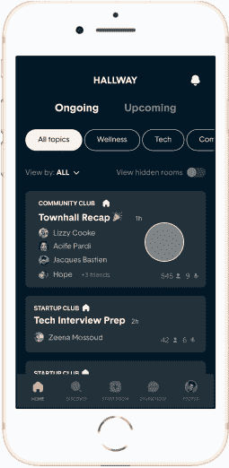

Setting notifications on the room, club, and user level* 

##  *结论:经验教训&我们何去何从*

*进入这个项目，我知道这对一个年轻的设计师来说是一个雄心勃勃的挑战。我不知道的是这个挑战会有多复杂和包罗万象。*

*我了解到**致力于一个高度宣传和高度喜爱的产品**伴随着很多外部压力和内部情绪，要**让(似乎)每个人都做对**。*

*有对现有结构有强烈依恋的高级用户，也有不能完全体验作为静态原型的音频应用程序的细微差别的新用户。*

*然后是小而强大的俱乐部团队，他们每周都在积极地迭代他们的产品，潜在地为我正在处理的同样的挑战推出富有想象力的解决方案。甚至还有其他我还没想到的。*

*面对公众对一个令人兴奋的产品的持续不断的讨论，我谦卑地承认，有时这种压力让我无法承受，我觉得自己像个骗子，贪多嚼不烂。*

*这个项目给我的最大教训是面对复杂挑战时的毅力、感知失败后的优雅，以及何时接受“足够好”(当然是针对这次迭代)之间的微妙平衡。*

*最后，在我设计之旅的这个阶段，我对我能够完成这个项目感到非常自豪。我经常提醒自己，我最喜欢的咒语让我开始了产品设计:*

> *“我想要的只是一份像书一样的工作，好到我可以用余生来完成它。”*

*产品设计是我的工作，我很自豪地说，虽然这个项目(和我所有的其他项目)永远不会完全完成，但我尽可能地为它注入了生命——我希望你喜欢它！*