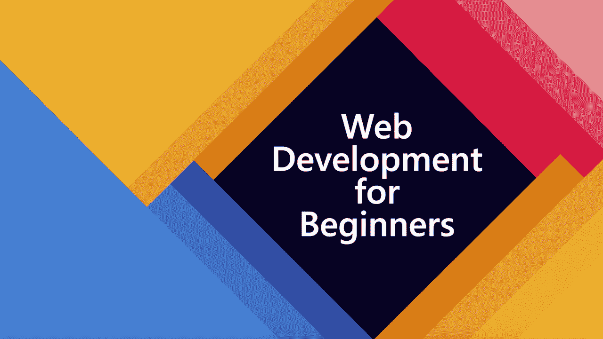

# 如何成为一名优秀的软件开发人员

> 原文：<https://www.freecodecamp.org/news/how-to-become-a-great-software-developer/>

在软件开发领域开始新的职业生涯既令人兴奋又令人恐惧。有很多东西要学，需要多年的练习才能真正精通，就像其他手艺一样。

为了让它变得简单一点，特别是对初学者来说，我想与你分享一些我多年来获得的知识，以可操作的技巧的形式。

## 找一个伟大的导师

要成为一名优秀的开发人员，你能做的最好的事情之一就是找到一位优秀的导师。一个好的导师会在从建筑到设计的所有方面提供合理的建议，甚至是如何改善你的职业道路。

一个不在同一个公司或地点的人可能是你最好的导师。你可以通过电话、电子邮件或网上与他们交谈并获得他们的建议。导师不一定要在你的公司工作，也不一定要成为专业的开发人员。

找一个懂软件开发，并且在他们的职业生涯中取得了你尊敬的成功的人。

## 学会良好的沟通

成为一名优秀的开发人员意味着你可以与用户和其他开发人员进行有效的沟通。事实上，成为一名优秀的程序员很大一部分是有效和高效地分享你的想法。

如果你能清晰简洁地表达你的想法，别人会想听你说些什么。

但是交流不仅仅是交谈。也是要听听别人怎么说。研究表明，好的倾听者比好的谈话者在事业上更成功。

所以你永远不要低估一个好的倾听者的力量，尤其是当你和客户或者你团队中的其他开发人员一起工作的时候。

学习如何倾听是非常宝贵的，尤其是如果你打算和别人一起工作的话。

## 学习如何有效地使用谷歌

当我开始做软件开发人员时，我记得我认为我的开发同事是某种超人，因为他们总能在解决问题或实现功能时给我指出正确的方向。

从那时起，我开始用谷歌搜索一切，一路学习新的工具和技术。

事实证明，知道如何有效地使用谷歌并不会降低你的程序员水平——它会让你在工作中更有效率。

花时间学习各种不同的工具，这样，如果出现了一个需要超出您经验范围的问题，您可以快速决定是否值得花时间学习。

## 开始每天写代码

一读完这篇文章，就写点代码吧！这听起来很明显，但是你必须开始每天写代码。

我知道你很忙，其他人也一样。相信我——我们一直告诉你每天写代码是有原因的。因为它有效。

每天写代码让你的技能保持敏锐，帮助你学习新的语言和技术，让你从事自己感兴趣的工作。

如果你对此不感兴趣，那就改变它——每月至少改变一次语言或项目。这将使事情保持有趣(并防止它们变得无聊)，并确保你不会连续几个月陷入一成不变的状态。

## 磨练你的手艺——定期练习你的艺术

这个说起来容易做起来难，因为找时间做这件事可能很棘手，除非你非常自律或者一周有很多空闲时间(我对此表示怀疑)。

无论哪种方式，如果你想成为一个伟大的软件开发人员，实践将有很大的帮助。

我发现做到这一点的最好方法是每周设定一些目标，集中在提高我目前正在努力提高的技能上(技能甚至可能完全不同！).这样做有两个主要好处:

1.  你会发现自己在积极地努力做得更好，而不是在这里或那里做些小小的改变。
2.  它给你一些容易衡量的具体目标和指标。这有助于你看到自己的进步，并让你很快知道你的工具箱里缺少什么样的技能/工具/技术。然后，当时间到了以后，当他们在现实世界的项目中变得相关时，他们就不会像他们周围的一切一样陌生了！

在 [freeCodeCamp](https://www.freecodecamp.org/) 上进行挑战是定期练习的完美方式。如果你需要更多的指导，微软有一个很好的资源来帮助新开发者:

[microsoft/Web-Dev-For-Beginners24 Lessons, 12 Weeks, Get Started as a Web Developer - microsoft/Web-Dev-For-BeginnersmicrosoftGitHub](https://github.com/microsoft/Web-Dev-For-Beginners)

## 不要害怕犯错误

没有人第一次就能做对，所以当你搞砸的时候不要难过。其他人也还在学！从你的错误中学习是很重要的，这样你就可以避免将来再犯同样的错误，这样你也可以帮助别人从错误中学习。

事实上，如果你犯了一个错误，然后在任何人注意到之前修复它，你学到了什么？如果有人指出你写的代码有问题，或者告诉你如何改进特定的设计选择，感谢他们发现了这个问题。他们通过指出一些需要改进或澄清的地方来帮你的忙。

即使他们对需要解决的问题判断错误，也要提出问题并与他们讨论，以澄清为什么他们认为这是一个问题。请记住，仅仅因为有人不同意你的解决方案并不意味着它是错误的——这只是意味着他们与你有不同的需求或期望。

这里主要的要点是:虚心学习！

## 工作之外的项目

成为一名优秀的开发人员并不意味着你知道编程和软件开发的所有知识。保持谦逊和愿意学习是伟大的程序员都具有的品质。

如果你对 JavaScript 感兴趣，我收集了一些很棒的 JavaScript 项目，你可以把它们添加到你的文件夹中。

兼职项目可以让你在工作之外应用你在工作中学到的东西，这将帮助你学到更多。你可以从做错事中学到很多，但是了解事情应该如何运作也是很重要的。因此，尝试学习他人的解决方案，防止自己在从事新项目时出错。

永远不要停止学习或改进是很重要的，因为技术世界总是在变化。对于软件开发来说，不存在“设置好就忘了”的心态。

## 追随行业领袖

通过博客、社交媒体、电子邮件通讯等方式关注行业领袖，并尝试阅读他们所写的内容。

许多开发人员在新技术发布后立即投入到新技术中，却没有真正理解这些新技术解决了什么问题，或者他们为什么需要它们——这是一个错误！

新技术并不总是比旧技术更好。在我们各自的行业中，特定的工具和技术的存在通常有一个很好的理由。如果你不理解这些原因，你很可能会落后于那些理解他们的组织或整个行业正在做出的个人决策的同行。

阅读有影响力的开发人员写的东西有助于正确看待事情，这样我们就可以避免陷入众所周知的“技术胡言乱语的黑洞”。

虽然我还不能称自己为行业领袖，但如果你决定在 Twitter 上关注我，我会感到谦卑。我会试着定期发布内容来支持开发者，尤其是新手。:)

## 参与开源项目

回馈给为您提供难以置信的工具和框架的社区会让您更加感激它们！

通过看别人的代码(在 GitHub 上)，修复 bug，写文档等等，可以学到很多东西。有时，如果其他人看到你的贡献，发现问题或提出拉动式请求会带来获得指导或就业的机会。

一个很好的入门方法是搜索带有标签“好的第一期”的 GitHub 项目。

我个人在从事开源项目时有很多很棒的经历:

*   我从审查其他人的代码中学到了行业最佳实践。
*   我学会了如何写更好的文档，因为其他人不知道一些东西是如何工作的。
*   我收到了很多对我的贡献的积极反馈，这让我对自己作为一名开发人员感觉良好
*   在这个过程中，我交了许多新朋友！

重要的是要记住，仅仅因为我们免费使用别人的软件并不意味着我们应该利用这一事实，除了抱怨问题而不提供解决方案。

如果我们不喜欢某样东西，我们应该试着修正它或者提供改进的想法。也许你的解决方案会由项目维护人员自己实现。

## 向同辈和导师学习，也教他们

虽然和导师一起工作很棒，但你不必等到自己有了 5 年以上的经验才成为导师。我们每天都可以教对方新东西。

当别人提出问题或需要建议时，你应该总是乐意帮助他们。教导他人让我们对特定的主题/情况有更大的视角，否则如果我们只通过文本/视频观察，这些主题/情况可能看起来陌生(或令人生畏)。

例如，我曾经写过一篇关于 Java 和 JavaScript 的文章，解释了这两种编程语言的区别。

随着我们的同龄人在职业道路上取得进步，成为高级开发人员，他们需要继续提问，以便在达到当前知识水平后继续学习。通过这种方式互相帮助，我们都可以加速提高，而不会因为错过了指导的机会而落后。

## 学习如何寻求帮助

如果有一项技能能让你成为一名程序员，那就是学习如何提问。如果你不知道什么，不要感到尴尬或羞愧。相反，把这些时刻作为成长和进步的机会。

向别人寻求帮助表明你重视他们的意见和专业知识。大多数人会对这样的提议感到受宠若惊，这使得他们在力所能及的时候更愿意伸出援手。

## 最后的想法

我希望这篇文章是有用的，并鼓励你成为一名伟大的软件开发人员。

不要忘记，学习新事物的最好方法是找到你感兴趣的东西——如果它感觉像是一种义务或琐事，而不是快乐和奖励的来源，什么都不会跟着你。学习应该是有趣的，所以想办法让它变得更有趣。

并且记住:不要害怕失败！我们尝试的方法越多，成功的可能性就越大。只有当你放弃学习某样东西的时候，你才会失败。所以走出去，开始学习吧！

**我是西蒙，智能编码器的创造者，这是一个让开发者探索新内容、寻找书籍、课程、播客&等的好地方。**