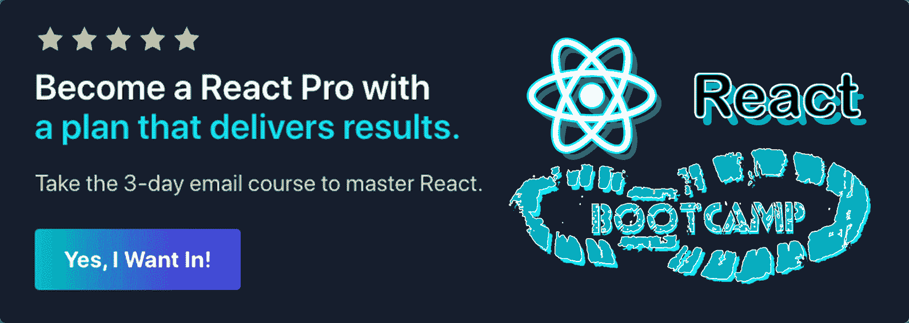

# 如何在 2021 年学习 React:你需要知道的 7 项技能

> 原文：<https://www.freecodecamp.org/news/how-to-learn-react-skills-you-need-to-know/>

你想学习 React *—* 世界上最受欢迎的 JavaScript 库。但是你需要采取什么步骤才能达到目的呢？让我们来看看成为一名专业 React 开发人员应该学习的七项技能。

当你在拼凑你的 React 学习路径时，很容易感到不知所措，并且说:“不可能全部学会。我需要学习的东西太多了！”

要想在 React 上取得成功，不要试图什么都学。专注于学习正确的东西。

让我们来分解一下构建令人印象深刻的应用程序并成为受欢迎的 React 开发人员所需的七项关键技能。

## 第一步:对 HTML、CSS 和 JavaScript 的核心基础知识充满信心

学习 React 的第一步实际上是一种倒退。

web 和每一个网页的构建模块都是 HTML、CSS 和 JavaScript。任何优秀的 React 开发人员都应该知道如何使用它们。React 以它们为基础，帮助你创建在网络上运行的应用程序。

如果你已经用 HTML、CSS 和 JavaScript 构建了一些东西，你就处于一个很好的位置。例如，如果你已经建立了一个完整的登陆页面或一个小网站。

在这三种技术中， **React 与 JavaScript** 联系最紧密。React *是* JavaScript，增加了一些特性。因此，您需要具备扎实的 JavaScript 技能。

### 对于 React，你应该知道哪些 JavaScript 概念？

*   基本数据结构:变量、对象和数组
*   数组方法和处理数组数据:`.map()`、`.filter()`和`.reduce()`
*   非常熟悉函数，对类有一点了解
*   异步 JavaScript: promises，用 Fetch API 发出 HTTP 请求，async/await 语法会有帮助
*   DOM:学习创建、选择和修改 HTML 元素及其属性
*   对象和数组析构有助于处理数据

很多开发者声称你应该了解“ES6/ES7/ES8/ESNext JavaScript”(换句话说，最新的 JavaScript 特性)，以便更好地学习 React。了解更多的 JavaScript 会有所帮助，但是新特性也会分散新手的注意力。

首先，通过构建一些需要 JavaScript 的小项目，对我上面列出的 JavaScript 概念有信心。之后，您可以看看该语言的一些新特性。

## 第二步:学习 React 基础和 React 挂钩

一旦您对 JavaScript 有了信心，您就准备好学习 React 及其核心概念了。

这些基础都是 React 特有的，它们的存在是为了帮助我们使用 React 构建应用程序，使用 JavaScript 本身没有的模式。

### 你需要知道哪些 React 基本原理？

*   如何构造 JSX 元素(以及它与普通 HTML 有何不同)
*   如何呈现(显示)JSX 元素，以及如何根据特定条件显示或隐藏元素
*   如何将 JSX 拆分成组件，以及如何重用和组织这些组件来制作我们的应用程序界面。
*   如何使用 props 将数据(+ JSX 元素和组件)传递给组件，以及何时这样做
*   如何使用状态在组件中存储和更新数据，以及如何将状态“提升”到其他组件
*   如何在 React 中使用事件数据并处理来自`onClick`、`onChange`和`onSubmit`事件的事件(即来自按钮、输入和表单的事件)

作为一个 7 岁的图书馆，React 的功能随着时间的推移已经发生了变化。我经常被问到的一个问题是**你应该先学什么:旧语法还是新语法？**2018 年底，React 收到了一个大的更新，其中包括了名为 React Hooks 的功能。

钩子是一个很大的改进。他们使 React 应用程序更简单、更强大，并允许我们编写更少的代码。重要的是，你要知道五个核心反应挂钩。

### 你最需要知道的五个反应钩子是什么？

*   `useState`:存储和管理单个组件中的数据
*   `useEffect`:执行 HTTP 请求或使用浏览器 API 等操作
*   `useRef`:引用 JSX 元素
*   `useContext`:从 React 上下文中访问数据，以便更容易地在组件之间共享数据[而不是传递属性]
*   `useReducer`:跨多个组件存储和管理数据

有比这 5 个更多的钩子，但是其他的不经常需要。所以是的，你应该学习最新的 React 特性。马上开始使用钩子。它们将是你制作的每个 React 应用的基础。

## 步骤 3:学习从 REST 和 GraphQL APIs 获取数据

React 应用程序是一个完整应用程序的前端。在每个应用程序中，你可能既有一个用户与之交互的 React 前端，也有一个 React 代码与之交互的后端。后端是我们获取数据和做其他事情的地方，比如验证我们的用户。

有两种方法可以处理来自后端的数据。获取数据的标准方式是从所谓的 REST API 中获取。REST API 是最常见的 API 形式。新的方法来自所谓的 **GraphQL API** 。

您将在工作中遇到这两种类型的 API，所以请熟悉使用 React 与这两种 API 进行交互。

## 步骤 4:学习使用组件库或实用类库来设计 React 应用程序

每个 React 应用程序都需要为其外观设计风格。一种选择是使用普通 CSS。您可以编写自己的样式，并将它们放在单独的样式表中。

但是除了 CSS 之外，许多 React 开发人员使用所谓的组件库来简化样式。组件库为我们提供了可重用的组件，它们有自己的预制风格。React 最流行的组件库是**材质 UI** 。但是还有很多其他的你可以选择。

开发人员还使用一些工具，这些工具提供称为实用类库的预制类名。与组件库不同的是，**实用类库**带有预制的类来设计你的元素。

您可以通过对每个元素应用类名来设计您的应用程序。这消除了自己编写任何样式的需要。最流行的实用类库是 **Tailwind CSS** 。

作为开发人员，您会遇到这两种情况，所以请熟悉组件库和实用类库。

## 步骤 5:用 React 上下文管理 React 中的状态

**什么是状态管理？**这是决定在哪里定位数据以及如何在我们的应用中使用数据的过程。要管理应用程序组件的状态，请使用 React 上下文。

**React Context** 是一个内置于核心 React 库中的工具，允许我们在不使用 props 的情况下跨应用组件传递数据。它帮助我们解决道具钻取的问题，这涉及到将道具(数据)向下传递到彼此嵌套很深的组件。

使用 React Context，我们在创建的上下文上放置一个值，然后使用`useContext()` React 钩子访问它。

【Redux 呢？ Redux 是一个在 React 应用中管理状态的流行库。这是一个远比你将要开发的大多数应用程序所需要的更复杂的工具。虽然 Redux 仍然是非常大的应用程序所依赖的，但 React Context 对于您制作的任何应用程序都足够了。

另外，通过结合 React 挂钩和 React 上下文，您可以获得 Redux 的许多好处。与学习额外的库相比，这是一个很大的优势。

## 第六步:学习 React 路由器。特别是 react-router-dom

**什么是路由器？**我们访问的任何网站都有许多页面，我们可以通过在浏览器历史中前进或后退来浏览。为了在 React 中创建这些不同的页面或路径，我们需要使用所谓的路由器。

React 本身没有自带路由器，所以我们需要使用第三方库，名为 react-router-dom。

**react-router-dom** 是在我们的应用程序中创建页面以及在每个页面中导航用户所必需的。它可以让我们创建应用程序不同页面的链接，并导航到它们，或者根据需要将它们重定向到其他页面。

### 你需要知道 react-router-dom 的哪些特性？

*   如何使用`<Route />`、`<Switch />`和`<BrowserRouter />`组件创建应用程序路线
*   如何使用`<Link />`组件和使用`useHistory()`钩子以编程方式将用户导航到不同的页面
*   如何使用 path prop(即`<Route path="/posts/:post-slug" component={Post} />`)创建动态路由，并使用`useParams()`钩子获取路径的值
*   如何使用`<Redirect />`组件将用户从受保护的内容中重定向出来(参见第 7 条)

## 步骤 7:学习 React 中身份验证模式

认证用户是已经登录使用我们的应用程序的人。我们想让这些用户访问不同的东西。因此，身份验证与路由密切相关。这是因为经过身份验证的用户应该能够看到某些未经身份验证的用户看不到的页面。

### 作为 React 开发人员，您需要了解身份验证的哪些内容？

有一件主要的事情。您应该学习如何向经过身份验证的用户显示某些内容，并向未经身份验证的用户隐藏这些内容。

回顾一下，这些都是作为一名 React 开发人员需要具备的核心技能，能够构建完整的应用程序并作为一名受雇的前端开发人员工作。

除了这 7 项技能之外，请注意，还有许多技能可以加深您作为开发人员的理解。例如，学习更多关于浏览器、HTTP 和 API 的知识，等等。但是如果您遵循所有这些步骤，您将对 React 有一个坚实的理解，并且能够构建任何规模的应用程序。

# 喜欢这篇文章吗？参加为期 3 天的 React 电子邮件课程

[**为期 3 天的 React 电子邮件课程**](https://bit.ly/react-bootcamp-email-course) 将您应该知道的关于学习 React 的所有知识打包成一个全面的包，包括备忘单、视频以及特殊奖励。

加入数百名开发人员的行列，学习如何在创纪录的时间内成为 React pro:

 
*点击加入课程*