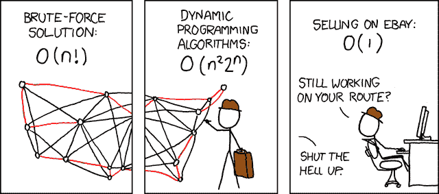

# 面向初学者的动态编程——如何用记忆和列表解决编码难题

> 原文：<https://www.freecodecamp.org/news/learn-dynamic-programing-to-solve-coding-challenges/>

动态编程是一种编码方式，在这种方式下，当算法运行时，将算法的结果存储在数据结构中。

了解动态编程可以帮助你更快地解决复杂的编程问题。

这些方法可以帮助你 ace 编程面试关于数据结构和算法的问题。他们也可以改善你的日常编码。

我们在 freeCodeCamp.org YouTube 频道上发布了一个 5 小时的动态编程课程。

阿尔文·扎布兰开发了这个课程。Alvin 是 Coderbyte 的一名经验丰富的编程教师，coder byte 是一个热门的技术面试准备和编码挑战网站。

在本课程中，您将学习使用动态编程策略来解决编程难题，例如:

*   计算斐波纳契数列的第 40 个数字。
*   计算通过 6x9 网格的不同方式的数量。
*   给定一套硬币，你如何用最少的硬币数做出 27 美分。

本课程使用图像和动画来帮助你将问题和重要概念形象化。从概念上理解问题后，您将学习如何使用动态编程在 JavaScript 中解决问题。

尽管本课程使用 JavaScript，但您将学到可以应用于其他编程语言(包括 Python)的概念和知识。

Dynamic Programming can really speed up your work. But common sense can speed things up even further. (Traveling Salesman problem webcomic by [XKCD](https://xkcd.com/399/))

## 本课程涵盖的动态编程方法

本课程的第一部分着重于记忆方法。这是使用递归和存储算法中间结果的地方。然后，您可以在以后的行程中通过您的循环访问这些结果。

以下是本课程涵盖的记忆策略:

*   纤维记忆化
*   网格旅行记忆
*   记忆配方
*   可以求和记忆
*   如何记忆
*   最佳和记忆
*   建筑记忆
*   计数结构记忆化
*   所有结构记忆化

第二部分着重于列表策略。这些包括反复建立数据表。

以下是本课程涵盖的制表策略:

*   纤维列表
*   gridTraveler 制表
*   制表配方
*   可以求和制表
*   howSum 制表
*   最佳总和制表
*   建筑制表
*   计数结构制表
*   所有构造制表

你可以在 freeCodeCamp.org YouTube 频道观看完整的课程(5 小时观看)。