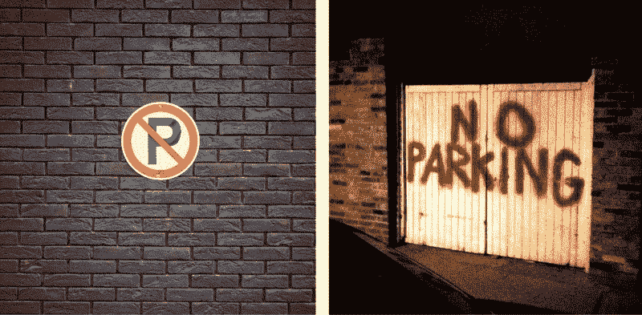

# 我从 100 次无聊的会议中学到的难忘的教训

> 原文：<https://www.freecodecamp.org/news/3-unforgettable-lessons-i-learned-from-100-boring-conferences-7a509261e617/>

丹尼尔·伯克

# 我从 100 次无聊的会议中学到的难忘的教训

Photo by [Tyler Callahan](https://unsplash.com/photos/pcGLNRCICnA?utm_source=unsplash&utm_medium=referral&utm_content=creditCopyText) on [Unsplash](https://unsplash.com/search/photos/speaker?utm_source=unsplash&utm_medium=referral&utm_content=creditCopyText)

在过去的二十年里，我参加了许多会议。大多数情况下，演讲者都在喋喋不休地谈论他们的话题，这些话题很容易被遗忘。回想起来，只有几个伟大的想法真正打动了我。这是我在职业生涯中反复提到的三个想法。

### **设计好的和*设计好的区别很大。***

平面设计传奇人物[戴维·卡森](http://www.davidcarsondesign.com/)在我参加的第一次会议上做了一个乏味的报告。然而，15 年后，我仍然清楚地记得他演讲中的一对幻灯片，大概是这样的:

(photo credits [STML](https://www.flickr.com/photos/stml/3947231477/in/photolist-71NAp8-wSwLaQ-BTHab-mjzdvc-57nyDQ-oU1YMo-7RewhE-6D7qMk-6kfL4o-69XaF-6j8Nkf-bKFqj8-65RPHK-s94ZWv-8z8pYS-6EqKew-6VsTUn-9zYac8-iaRSMQ-dHQqFh-dzKeKM-4zdjFS-6QbtXK-pv9icm-6MSt5M-6gaaae-59T7WL-7HG2uA-9zCa75-78mVco-ban3Wk-6KNV9h-cZFmQh-dpPcsC-VQzu4u-Vkbu3b-5RFCC1-AvRuS-dmLia3-ahdrAT-bQh6LR-SfygU9-9wfKvR-fEqwDw-dKRVsu-9qhz2x-26JPXgA-7GihBU-3KkkXa-HYHfEe) and [Bernard Hermant](https://unsplash.com/photos/aAEpfi8f59Y))

一个看起来专业的设计概念和一个真正传达你的信息的设计之间有一条鸿沟。

左边的标志写着:“请不要在这里停车，谢谢。”右边的牌子上写着:“小子，你敢在这里停车，我就把你的头从你的肩膀上拧下来。”第二个标志只用几笔就能说明很多。这样更有效。设计的更好。

问:你会遵守哪个*禁止停车*标志？
答:被挥舞斧头的精神病患者标记的那个。

### ***认真对待 PowerPoint 设计。***

是的，你没看错。十多年前，我听到一位来自 Adobe 的设计主管讲述她是如何起步的。她解释说，在她职业生涯的最初几年，她是如何无聊到为她的老板设计幻灯片。不管怎样，她以开放的心态接受了这项任务，并倾注了全部精力来设计最好的幻灯片。

在这个过程中，她发展了沟通技巧，这对她后来很有帮助…更重要的是，她有一种态度，即每一个设计挑战都值得她努力。阿门。

> PS:我希望我能记得她的名字或者至少记得我在哪里看过她演讲。如果你知道她可能是谁，请分享。我很想表扬她，并亲自说声谢谢。

### 不要在会议上听取发言者的建议。

客气地说，TechCrunch 创始人[迈克尔·阿灵顿](https://en.wikipedia.org/wiki/Michael_Arrington)声音很大。当他姗姗来迟五分钟登上讲台，发表题为“企业家的 15 条重要经验”的演讲时，无论他要说什么，我都准备置之不理。但令我惊讶的是，第一堂*重要课*蕴含了很多道理。

迈克对着人山人海的人群说:“如果你要开始下一件大事，不要听我将要说的任何事情。”断章取义，这听起来很极端。然而，我对迈克的评论的解释是:

会议发言人自信地根据对他们有效的方法来讲课。对他们有效的只有一条路，而不是唯一的路。你的方式可能根本不同，这很好。很少有人通过复制别人的成果来成就大事。

简而言之，用一把装满盐的大铲子把你在会议上听到的所有该死的东西都拿走。那就去找自己的路吧。

这些年来，演讲中的哪些教训让你记忆犹新？我很想在评论中听到你的故事…