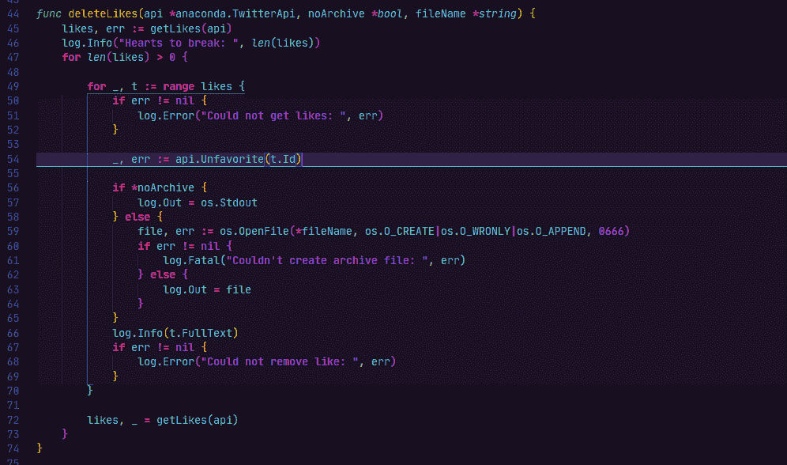

# 如何更有效地节省脑力和代码

> 原文：<https://www.freecodecamp.org/news/how-to-save-your-brainpower-and-code-more-efficiently/>

### 如果你知道这些工具的存在，你现在可能正在使用它们。

这篇文章不会告诉你如何用脚架保护你的脖子，或者用分离式键盘保护你的手腕。这篇文章是关于拯救你的大脑的——姑且称之为技术人体工程学。

当我第一次开始全职编程时，我发现自己经常因为脑力劳动而感到疲劳。编程很难！值得庆幸的是，你可以得到一些安慰，因为你知道通过练习和强大的演员阵容，事情会变得更容易。

在我们之前的一些非常好的人想出了一些工具，让我们可怜的人类肉脑与计算机交流的困难部分变得容易得多。

我邀请您探索这些超级有用的技术工具。它们将改善你的开发设置，减轻编程的精神压力。你很快就会不相信没有他们你会成功。

## 不是一般的语法高亮显示

如果您仍然在使用语法突出显示，它只是为您挑选变量和类名，这很可爱。是时候提高一个档次了。



A screenshot of [Kabukichō](https://github.com/victoriadrake/kabukicho-vscode) with syntax highlighting upgrades.

说真的，语法高亮显示可以让你更容易地在屏幕上找到你想要的东西:当前行，当前代码块开始和结束的地方，或者绝对改变游戏规则的 which-bracket-set-am-I-in 高亮显示。

我主要使用 Visual Studio 代码，但是在主要的文本编辑器中也可以找到类似的扩展。

以下是我的最爱:

*   [括号对上色器](https://marketplace.visualstudio.com/items?itemName=CoenraadS.bracket-pair-colorizer-2)以不同的匹配颜色突出显示连续的括号对，使在嵌套的括号和圆括号中挑选的痛苦成为过去。
*   [TODO Highlight](https://github.com/wayou/vscode-todo-highlight) 通过让`TODO`和`FIXME`的评论变得非常容易被看到，有效地消除了你无意中做出这些评论的任何借口。你甚至可以添加你自己定制的关键词来突出显示(我建议`wtf`，但是你不是从我这里听到的。)
*   [缩进代码块突出显示](https://github.com/byi8220/indented-block-highlighting)在你当前缩进的代码块后面突出显示一个容易识别但不显眼的部分，这样你就可以看到`if`结束的地方，以及为什么最后的`else`没有做任何事情。
*   [高亮线](https://github.com/cliffordfajardo/highlight-line-vscode)在你上一次离开光标的地方加一条(稍微太)亮的线。您可以定制线条的外观——我将我的`borderWidth`设置为`1px`。

上面 Visual Studio 代码中的主题是[歌舞伎座](https://github.com/victoriadrake/kabukicho-vscode)。我做到了。

## 使用 Git 挂钩

我之前给你带来了一个互动的预提交清单，这是一个电视购物的风格，既有趣又有助于提高你提交的质量。但这还不是全部！

Git 挂钩是在工作流中预先确定的点自动运行的脚本。好好利用它们，你可以节省大量的脑力。

一个`pre-commit`钩子记得做 lint 和格式化代码之类的事情，甚至在你不可避免地推出一些尴尬的东西之前为你运行本地测试。

共享钩子可能有点烦人(当你克隆或派生一个库时，`.git/hooks`目录不会被跟踪，因此会被忽略),但是有一个框架可以解决这个问题:令人困惑地命名为[的预提交框架](https://pre-commit.com/)，它允许你创建一个 Git 钩子插件的可共享配置文件，而不仅仅是针对`pre-commit`。

这些天我大部分时间都在用 Python 编程，所以下面是我目前最喜欢的`.pre-commit-config.yaml`:

```
fail_fast: true
repos:
  - repo: https://github.com/pre-commit/pre-commit-hooks
    rev: v3.1.0 # Use the ref you want to point at
    hooks:
      - id: detect-aws-credentials
      - id: end-of-file-fixer
      - id: trailing-whitespace
  - repo: https://github.com/psf/black
    rev: 19.3b0
    hooks:
      - id: black
  - repo: https://github.com/asottile/blacken-docs
    rev: v1.7.0
    hooks:
      - id: blacken-docs
        additional_dependencies: [black==19.3b0]
  - repo: https://github.com/pre-commit/mirrors-mypy
    rev: v0.780
    hooks:
      - id: mypy
  - repo: local
    hooks:
      - id: isort
        name: isort
        stages: [commit]
        language: system
        entry: isort
        types: [python]
      - id: black
        name: black
        stages: [commit]
        language: system
        entry: black
        types: [python] 
```

有大量的[支持的钩子](https://pre-commit.com/hooks.html)可以探索。

## 使用类型系统

如果你用 Python 和 JavaScript 之类的语言来写，那就早点给自己买份生日礼物，开始使用静态类型系统吧。这不仅有助于改进您思考代码的方式，还有助于在运行一行代码之前清除类型错误。

对于 Python，我喜欢使用 [mypy](https://github.com/python/mypy) 进行静态类型检查。你可以把它设置成一个`pre-commit`钩子(见上图),并且它在 Visual Studio 代码中也受到[的支持](https://code.visualstudio.com/docs/python/linting#_mypy)。

[TypeScript](https://www.typescriptlang.org/) 是我编写 JavaScript 的首选方式。你可以在命令行上使用 Node.js 运行编译器(参见报告中的[指令)，它在开箱即用的 Visual Studio 代码](https://github.com/Microsoft/TypeScript)中运行得非常好[，当然还有多个选项用于](https://code.visualstudio.com/Docs/languages/typescript)[扩展集成](https://code.visualstudio.com/Docs/languages/typescript#_typescript-extensions)。

## 不要无谓地敲打你的肉脑

我是说，你不会整天倒立着工作。一直颠倒着读东西会很不方便(至少在你的大脑调整过来之前是这样的)，而且无论如何，你很可能很快就会感到不舒服。

工作时不利用我今天给你的技术人机工程学工具有点像不必要的倒置——如果你不需要，为什么要这样做呢？