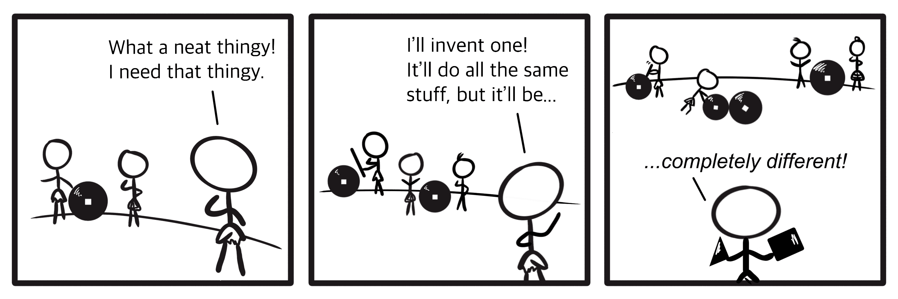

# 如何选择和关注一个安全的开源项目

> 原文：<https://www.freecodecamp.org/news/how-to-choose-and-care-for-a-secure-open-source-project/>

### 评估开源项目安全性的一些技巧。

软件开发界有一个相当进步的派别，叫做开源社区。

这个社区相信，如果大多数人停止建造别人已经建造的东西并提供免费使用，他们会更快乐，完成更多的工作。他们想让你拿走他们的东西。

除了不用动一根手指就能存在之外，开源工具和软件还有一些独特的优势。尤其是在已经建立的项目中，很有可能别人已经为你解决了所有最烦人的 bug。

由于用户可以方便地查看和修改源代码，随着时间的推移，程序更有可能被修补、改进和保护。

当许多开发人员做出贡献时，他们会带来自己独特的专业知识和经验。这可以产生比单个开发人员所能产生的产品更健壮、更有能力的产品。

当然，由于构建开源项目的人多种多样，因此并非所有的开源项目都是平等的，也不会保持同等的安全性。

有许多因素会影响项目对您的用例的适用性。这里有一些一般性的考虑，可以作为选择开源项目的良好起点。

## 如何选择一个开源项目

作为其最基本的要求，一个好的软件项目是可靠的，易于理解的，并且具有最新的组件和安全性。有几个指标可以帮助您对一个开源项目是否满足这些标准做出有根据的猜测。

### 谁在使用它

从上下文来看，已经使用一个开源项目的人数可能表明它有多好。

例如，如果一个项目有 100 个用户，那么在你找到它之前，有人已经尝试使用它至少 100 次了。因此按照“我不知道那个洞穴里有什么，你先走”的古老习俗，更有可能没事。

通过查看可用的统计数据，您可以得出关于项目用户群的结论。取决于你的平台，这些可能包括下载、评论、问题或门票、评论、贡献、分叉或“星星”的数量，无论它们是什么。

半信半疑地评价 GitHub 等平台上的社交统计。它们可以帮助你确定一个项目可能有多受欢迎，但就像餐馆评论应用程序可以帮助你确定是否应该在 Foo's Grill & Bar 吃饭一样。

取决于 Foo's Grill & Bar 在哪里，何时开业，以及当不变的牛排渴望召唤时，人们有多大可能靠近它，有 26 个评论可能是一个好兆头，也可能是一个糟糕的兆头。

虽然您不会期望一个解决非常模糊的用例或技术的项目有数百个用户，但在这种情况下，有几个活跃的用户同样会激发信心。

外部验证也很有用。例如，包含在 Linux 操作系统发行版(distro)中的软件包必须符合严格的标准并经过审查。选择包含在发行版默认软件库中的软件意味着它更有可能是安全的。

也许寻找的最好标志之一是项目的开发团队是否在使用他们自己的项目。寻找表明项目的创建者和维护者正在使用他们自己构建的东西的问题、讨论或博客帖子。通常被称为[“吃你自己的狗粮”，](https://en.wikipedia.org/wiki/Eating_your_own_dog_food)或“狗粮”，这是一个指标，表明该项目最有可能被其开发人员维护得很好。

### 谁在建造它

好的开源软件的主要敌人通常是缺乏兴趣。参与开源项目的各方可以在昙花一现的库和受人尊敬的长期实用程序之间做出区别。多个忠诚的维护者，甚至在他们的业余时间做出贡献，有更高的成功率来维持一个项目并产生兴趣。

有着健康兴趣的项目通常得到贡献者和用户社区的支持，并反过来培养他们。

新的贡献者可能会受到积极的欢迎，清晰的指南可以解释如何提供帮助，当人们有不可避免的问题时，项目维护人员是可用的和可接近的。

一些社区甚至有聊天室或论坛，人们可以在贡献之外进行互动。活跃的社区有助于保持项目的兴趣、相关性以及随之而来的质量。

以一种不那么有机的方式，一个项目也可以通过赞助它的组织来维持。有经济利益的政府和公司也是开源项目的赞助者，一个享受公共部门使用或财政支持的项目增加了保持相关性和有用性的动机。

### 它有多活跃

开源项目活动的近期性和频率可能是对其安全性关注程度的最佳指标。查看发布、提交历史、变更日志或文档修订，以确定项目是否处于活动状态。由于项目的规模和范围各不相同，这里有一些需要注意的一般事项。

维护安全性是一项持续的工作，需要定期监控和更新，尤其是对于包含第三方组件的项目。这些可能是库或者项目中依赖于外部事物的任何部分，比如支付网关集成。

一个不活跃的项目更有可能拥有过时的代码或者使用过时版本的组件。为了更具体地确定，您可以研究项目的第三方组件，并将它们的最新补丁或更新与项目的最新更新进行比较。

没有第三方组件的项目可能没有可应用的外部更新。在这些情况下，您可以使用最近的活动和发布说明来确定项目的维护者可能有多投入。

一般来说，活动项目应该显示最近几个月的更新，值得注意的是去年的发布。这可以很好地表明项目是否使用了其语言或框架的最新版本。

你也可以通过观察项目维护者本身来判断一个项目可能有多活跃。积极的维护者会迅速对反馈或新问题做出反应，即使只是说，“我们正在处理。”

如果项目有一个社区，它的维护者就是其中的一部分。他们可能有一个专门的网站或定期写博客。他们可能会提供直接和私下联系他们的方式，特别是提出安全问题。

### 你能理解吗

拥有文档是项目的基本要求，除了创建者之外，任何人都可以使用它。好的开源项目有易于理解、诚实和全面的文档。

拥有[写得很好的文档](https://victoria.dev/blog/word-bugs-in-software-documentation-and-how-to-fix-them/)是一个项目脱颖而出并展示其维护者的深思熟虑和奉献精神的一种方式。

“入门”部分可能会详细说明运行项目的所有要求和初始设置。文档中准确的主题列表使用户能够快速找到他们需要的信息。一份清晰的许可声明清楚地表明了项目可以如何使用，以及用于什么目的。

这些是为用户服务的文档的特征方面。

一个遵循良好编码实践的项目很可能拥有和它的文档一样可读的代码。易读的代码有助于理解。一般来说，它有明确定义和适当命名的函数和变量、逻辑流程和明显的目的。可读代码更容易修复、保护和构建。

### 兼容性如何

一些因素将决定一个项目与你的目标有多一致。这些都是客观的质量，可以通过查看项目的存储库文件来确定。它们包括:

*   代码语言
*   特定的技术或框架
*   许可证兼容性

兼容性不一定意味着直接匹配。不同的代码语言可以相互交互，各种技术和框架也是如此。您应该仔细阅读一个项目的许可证，以了解它是否允许用于您的目标，或者它是否与您想要使用的许可证兼容。

最终，满足所有这些标准的项目可能仍然不太适合您的用例。然而，开源软件的部分魅力在于，通过做出更适合你的用途的改变，你仍然可以从中受益。如果这些改变使项目对每个人都更好，你可以通过为项目贡献你的工作来回报和回报它。

## 对开源项目的适当关注和支持

一旦你采用了一个开源项目，就需要稍微注意一下，以确保它继续有利于你的目标。

虽然它的维护者会照看上游的项目文件，但是你独自对你自己的拷贝负责。像所有软件一样，您的开源项目必须得到良好的维护，以便尽可能地保持安全和有用。

拥有一个系统，当你的软件有更新时，它会通知你。及时更新软件，将每个补丁视为对安全至关重要——很可能如此。

请记住，在大多数情况下，开源项目的创建者和维护者只是出于他们内心的善良。如果你有一个特别棒的，它的开发者可能会定期发布更新和安全补丁。由您来决定是否跟踪更新并及时应用它们。

和软件中的大多数东西一样，保持开源软件的模块化会很方便。您可以使用 [git 子模块](https://git-scm.com/book/en/v2/Git-Tools-Submodules)、分支或者环境来隔离您的添加。这可以更容易地应用更新或查明出现的任何错误的来源。

因此，尽管一个开源项目可能不花钱，*买者自负，*意思是，“吉米，如果我们给你买了一只小狗，你有责任照顾它。”