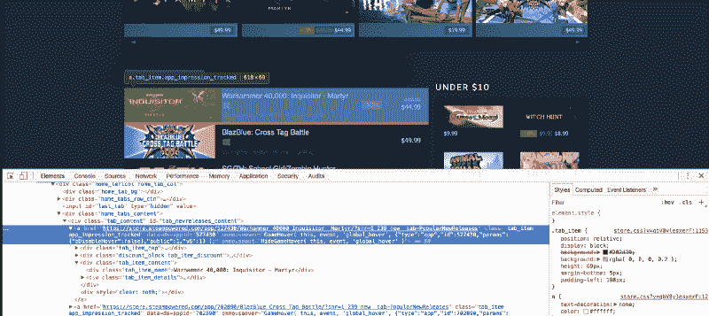

# 如何用 Python 3 抓取网站

> 原文：<https://www.freecodecamp.org/news/webscraping-in-python/>

网络抓取是从网站提取数据的过程。

在尝试抓取网站之前，您应该确保提供商在其服务条款中允许这样做。您还应该检查一下是否可以使用 API 来代替。

大量的抓取会使服务器承受很大的压力，从而导致拒绝服务。你不想那样。

## 谁应该读这个？

这篇文章是为高级读者准备的。它将假设您已经熟悉 Python 编程语言。

至少你应该理解列表理解、上下文管理器和函数。你还应该知道如何建立一个虚拟环境。

我们将在您的本地机器上运行代码来浏览一些网站。通过一些调整，你也可以让它在服务器上运行。

## 你将从这篇文章中学到什么

在本文结束时，您将知道如何下载网页，解析它以获取感兴趣的信息，并将其格式化为可用的格式以供进一步处理。这也被称为 [ETL](https://en.wikipedia.org/wiki/Extract,_transform,_load) 。

本文还将解释如果该网站使用 JavaScript 来呈现内容(如 React.js 或 Angular)该怎么办。

## 先决条件

在我开始之前，我想确定我们准备好了。请设置一个虚拟环境，并在其中安装以下软件包:

*   beautifulsoup4(撰写本文时版本为 4.9.0)
*   请求(撰写本文时版本为 2.23.0)
*   wordcloud(编写时版本为 1.17.0，可选)
*   selenium(撰写本文时版本为 3.141.0，可选)

您可以在 GitHub 上的这个 [git 存储库中找到该项目的代码。](https://github.com/Ryuno-Ki/fcc-web-scraping-example)

对于这个例子，我们将为德意志联邦共和国起草[基本法。(别担心，我查了他们的服务条款。他们为机器处理提供了一个 XML 版本，但是这个页面只是处理 HTML 的一个例子。所以应该没问题。)](https://www.gesetze-im-internet.de/gg/index.html)

## 步骤 1:下载源代码

首先:我创建了一个文件`urls.txt`,保存了所有我想下载的 URL:

```
https://www.gesetze-im-internet.de/gg/art_1.html
https://www.gesetze-im-internet.de/gg/art_2.html
https://www.gesetze-im-internet.de/gg/art_3.html
https://www.gesetze-im-internet.de/gg/art_4.html
https://www.gesetze-im-internet.de/gg/art_5.html
https://www.gesetze-im-internet.de/gg/art_6.html
https://www.gesetze-im-internet.de/gg/art_7.html
https://www.gesetze-im-internet.de/gg/art_8.html
https://www.gesetze-im-internet.de/gg/art_9.html
https://www.gesetze-im-internet.de/gg/art_10.html
https://www.gesetze-im-internet.de/gg/art_11.html
https://www.gesetze-im-internet.de/gg/art_12.html
https://www.gesetze-im-internet.de/gg/art_12a.html
https://www.gesetze-im-internet.de/gg/art_13.html
https://www.gesetze-im-internet.de/gg/art_14.html
https://www.gesetze-im-internet.de/gg/art_15.html
https://www.gesetze-im-internet.de/gg/art_16.html
https://www.gesetze-im-internet.de/gg/art_16a.html
https://www.gesetze-im-internet.de/gg/art_17.html
https://www.gesetze-im-internet.de/gg/art_17a.html
https://www.gesetze-im-internet.de/gg/art_18.html
https://www.gesetze-im-internet.de/gg/art_19.html
```

urls.txt

接下来，我在一个名为`scraper.py`的文件中写了一些 Python 代码来下载这个文件的 HTML。

在真实的场景中，这太昂贵了，您将使用数据库来代替。为了简单起见，我将文件下载到商店旁边的同一个目录中，并使用它们的名称作为文件名。

```
from os import path
from pathlib import PurePath

import requests

with open('urls.txt', 'r') as fh:
    urls = fh.readlines()
urls = [url.strip() for url in urls]  # strip `\n`

for url in urls:
    file_name = PurePath(url).name
    file_path = path.join('.', file_name)
    text = ''

    try:
        response = requests.get(url)
        if response.ok:
            text = response.text
    except requests.exceptions.ConnectionError as exc:
        print(exc)

    with open(file_path, 'w') as fh:
        fh.write(text)

    print('Written to', file_path)
```

scraper.py

通过下载文件，我可以在本地随心所欲地处理它们，而不需要依赖服务器。努力做一个好的网络公民，好吗？

## 步骤 2:解析源代码

现在我已经下载了文件，是时候提取它们有趣的特性了。因此，我转到我下载的一个页面，在网络浏览器中打开它，然后按 Ctrl-U 查看它的源代码。检查它会显示我的 HTML 结构。

在我的例子中，我想我需要没有任何标记的法律文本。包装它的元素有一个 id`container`。使用 BeautifulSoup，我可以看到 [`find`](https://www.crummy.com/software/BeautifulSoup/bs4/doc/#find) 和`[get_text](https://www.crummy.com/software/BeautifulSoup/bs4/doc/#get-text)`的组合将实现我想要的效果。

既然我现在有了第二步，我将通过将代码放入函数中并添加一个最小的 CLI 来重构代码。

```
from os import path
from pathlib import PurePath
import sys

from bs4 import BeautifulSoup
import requests

def download_urls(urls, dir):
    paths = []

    for url in urls:
        file_name = PurePath(url).name
        file_path = path.join(dir, file_name)
        text = ''

        try:
            response = requests.get(url)
            if response.ok:
                text = response.text
            else:
                print('Bad response for', url, response.status_code)
        except requests.exceptions.ConnectionError as exc:
            print(exc)

        with open(file_path, 'w') as fh:
            fh.write(text)

        paths.append(file_path)

    return paths

def parse_html(path):
    with open(path, 'r') as fh:
        content = fh.read()

    return BeautifulSoup(content, 'html.parser')

def download(urls):
    return download_urls(urls, '.')

def extract(path):
    return parse_html(path)

def transform(soup):
    container = soup.find(id='container')
    if container is not None:
        return container.get_text()

def load(key, value):
    d = {}
    d[key] = value
    return d

def run_single(path):
    soup = extract(path)
    content = transform(soup)
    unserialised = load(path, content.strip() if content is not None else '')
    return unserialised

def run_everything():
    l = []

    with open('urls.txt', 'r') as fh:
        urls = fh.readlines()
    urls = [url.strip() for url in urls]

    paths = download(urls)
    for path in paths:
        print('Written to', path)
        l.append(run_single(path))

    print(l)

if __name__ == "__main__":
    args = sys.argv

    if len(args) is 1:
      run_everything()
    else:
        if args[1] == 'download':
            download([args[2]])
            print('Done')
        if args[1] == 'parse':
            path = args[2]
            result = run_single(path)
            print(result) 
```

scraper.py

现在我可以用三种方式运行代码:

1.  没有任何参数来运行一切(即，下载所有的 URL 并提取它们，然后保存到磁盘)通过:`python scraper.py`
2.  带有一个参数`download`和一个下载 URL`python scraper.py download https://www.gesetze-im-internet.de/gg/art_1.html`。这不会处理文件。
3.  使用参数`parse`和要解析的文件路径:`python scraper.py art_1.html`。这将跳过下载步骤。

这样，就少了最后一样东西。

## 步骤 3:格式化源文件以便进一步处理

假设我想为每篇文章生成一个词云。这是一种快速了解文章内容的方法。为此，安装包`wordcloud`并像这样更新文件:

```
from os import path
from pathlib import Path, PurePath
import sys

from bs4 import BeautifulSoup
import requests
from wordcloud import WordCloud

STOPWORDS_ADDENDUM = [
    'Das',
    'Der',
    'Die',
    'Diese',
    'Eine',
    'In',
    'InhaltsverzeichnisGrundgesetz',
    'im',
    'Jede',
    'Jeder',
    'Kein',
    'Sie',
    'Soweit',
    'Über'
]
STOPWORDS_FILE_PATH = 'stopwords.txt'
STOPWORDS_URL = 'https://raw.githubusercontent.com/stopwords-iso/stopwords-de/master/stopwords-de.txt'

def download_urls(urls, dir):
    paths = []

    for url in urls:
        file_name = PurePath(url).name
        file_path = path.join(dir, file_name)
        text = ''

        try:
            response = requests.get(url)
            if response.ok:
                text = response.text
            else:
                print('Bad response for', url, response.status_code)
        except requests.exceptions.ConnectionError as exc:
            print(exc)

        with open(file_path, 'w') as fh:
            fh.write(text)

        paths.append(file_path)

    return paths

def parse_html(path):
    with open(path, 'r') as fh:
        content = fh.read()

    return BeautifulSoup(content, 'html.parser')

def download_stopwords():
    stopwords = ''

    try:
        response = requests.get(STOPWORDS_URL)
        if response.ok:
            stopwords = response.text
        else:
            print('Bad response for', url, response.status_code)
    except requests.exceptions.ConnectionError as exc:
        print(exc)

    with open(STOPWORDS_FILE_PATH, 'w') as fh:
        fh.write(stopwords)

    return stopwords

def download(urls):
    return download_urls(urls, '.')

def extract(path):
    return parse_html(path)

def transform(soup):
    container = soup.find(id='container')
    if container is not None:
        return container.get_text()

def load(filename, text):
    if Path(STOPWORDS_FILE_PATH).exists():
        with open(STOPWORDS_FILE_PATH, 'r') as fh:
            stopwords = fh.readlines()
    else:
        stopwords = download_stopwords()

    # Strip whitespace around
    stopwords = [stopword.strip() for stopword in stopwords]
    # Extend stopwords with own ones, which were determined after first run
    stopwords = stopwords + STOPWORDS_ADDENDUM

    try:
        cloud = WordCloud(stopwords=stopwords).generate(text)
        cloud.to_file(filename.replace('.html', '.png'))
    except ValueError:
        print('Could not generate word cloud for', key)

def run_single(path):
    soup = extract(path)
    content = transform(soup)
    load(path, content.strip() if content is not None else '')

def run_everything():
    with open('urls.txt', 'r') as fh:
        urls = fh.readlines()
    urls = [url.strip() for url in urls]

    paths = download(urls)
    for path in paths:
        print('Written to', path)
        run_single(path)
    print('Done')

if __name__ == "__main__":
    args = sys.argv

    if len(args) is 1:
      run_everything()
    else:
        if args[1] == 'download':
            download([args[2]])
            print('Done')
        if args[1] == 'parse':
            path = args[2]
            run_single(path)
            print('Done')
```

scraper.py

什么变了？首先，我从 GitHub 下载了一个德语停用词列表。这样，我可以从下载的法律文本中删除最常见的单词。

然后，我用下载的停用词列表和法律文本实例化一个 WordCloud 实例。它将被转换成具有相同基本名称的图像。

第一次运行后，我发现停用词列表不完整。所以我添加了我想从结果图像中排除的额外单词。

至此，web 抓取的主要部分就完成了。

## 额外收获:水疗呢？

SPAs——或单页应用程序——是 web 应用程序，其中整个体验由 JavaScript 控制，JavaScript 在浏览器中执行。因此，下载 HTML 文件并没有给我们带来什么。我们应该做什么？

我们将使用浏览器。含硒。确保[也安装一个驱动](https://selenium-python.readthedocs.io/installation.html#drivers)。下载. tar.gz 归档文件，并将其解压缩到虚拟环境的`bin`文件夹中，以便 Selenium 可以找到它。这是您可以找到`activate`脚本的目录(在 GNU/Linux 系统上)。

举个例子，我在这里使用 [Angular 网站](https://angular.io/)。Angular 是一个很受欢迎的用 JavaScript 编写的 SPA-Framework，暂时保证由它来控制。

由于代码会变慢，我为它创建了一个名为`crawler.py`的新文件。内容是这样的:

```
from selenium import webdriver
from selenium.webdriver.common.by import By
from selenium.webdriver.support.ui import WebDriverWait
from selenium.webdriver.support import expected_conditions as EC
from wordcloud import WordCloud

def extract(url):
    elem = None
    driver = webdriver.Firefox()
    driver.get(url)

    try:
        found = WebDriverWait(driver, 10).until(
            EC.visibility_of(
                driver.find_element(By.TAG_NAME, "article")
            )
        )
        # Make a copy of relevant data, because Selenium will throw if
        # you try to access the properties after the driver quit
        elem = {
          "text": found.text
        }
    finally:
        driver.close()

    return elem

def transform(elem):
    return elem["text"]

def load(text, filepath):
    cloud = WordCloud().generate(text)
    cloud.to_file(filepath)

if __name__ == "__main__":
    url = "https://angular.io/"
    filepath = "angular.png"

    elem = extract(url)
    if elem is not None:
        text = transform(elem)
        load(text, filepath)
    else:
        print("Sorry, could not extract data")
```

crawler.py

这里，Python 正在打开一个 Firefox 实例，浏览网站并寻找一个`<article>`元素。它将文本复制到词典中，在`transform`步骤中被读出，并在`load`过程中变成一个词云。

当处理大量使用 JavaScript 的网站时，使用[等待](https://selenium-python.readthedocs.io/waits.html)甚至运行`[execute_script](https://selenium-python.readthedocs.io/api.html#selenium.webdriver.remote.webdriver.WebDriver.execute_script)`来遵从 JavaScript 通常是有用的。

## 摘要

感谢您读到这里！现在让我们总结一下我们所学的内容:

1.  如何用 Python 的`requests`包刮一个网站？
2.  如何用`beautifulsoup`翻译成有意义的结构。
3.  如何将这种结构进一步加工成你能使用的东西。
4.  如果目标页面依赖于 JavaScript 该怎么办。

## 进一步阅读

如果你想了解更多关于我的信息，你可以在 Twitter 上关注我，或者访问 T2 我的网站。

我不是第一个在 freeCodeCamp 上写关于网络抓取的人。Yasoob Khalid 和 Dave Gray 过去也这样做过:

[An Intro to Web Scraping with lxml and Pythonby Timber.io An Intro to Web Scraping with lxml and PythonPhoto by Fabian Grohs[https://unsplash.com/photos/dC6Pb2JdAqs?utm_source=unsplash&utm_medium=referral&utm_content=creditCopyText] on Unsplash[https://unsplash.com/search/photos/web?utm_source=unsplash&utm_medium=referral&utm_content=creditCopyText…freeCodeCamp.orgfreeCodeCamp.org](https://www.freecodecamp.org/news/an-intro-to-web-scraping-with-lxml-and-python-b02b7a3f3098/)[Better web scraping in Python with Selenium, Beautiful Soup, and pandasby Dave Gray Web ScrapingUsing the Python programming language, it is possible to “scrape” data from theweb in a quick and efficient manner. Web scraping is defined as: &gt; a tool for turning the unstructured data on the web into machine readable,structured data which is ready for analysis. (sou…freeCodeCamp.orgfreeCodeCamp.org](https://www.freecodecamp.org/news/better-web-scraping-in-python-with-selenium-beautiful-soup-and-pandas-d6390592e251/)