# Deno 手册:包含代码示例的 TypeScript 运行时教程

> 原文：<https://www.freecodecamp.org/news/the-deno-handbook/>

我每周都在探索新的项目，很少有一个项目像 [Deno](https://deno.land/) 这样吸引我的注意力。

在这篇文章中，我想让你快速了解 Deno。我们将把它与 Node.js 进行比较，并用它构建您的第一个 REST API。

## 目录

*   [什么是 Deno？](#what-is-deno)
*   [为什么是 Deno？为什么是现在？](#why-deno-why-now)
*   [该不该学 Deno？](#should-you-learn-deno)
*   [会取代 Node.js 吗？](#will-it-replace-node-js)
*   [一流的打字稿支持](#first-class-typescript-support)
*   [与 Node.js 的异同](#similarities-and-differences-with-node-js)
*   [没有包管理器](#no-package-manager)
*   [安装 Deno](#install-deno)
*   [Deno 命令](#the-deno-commands)
*   [你的第一个 Deno 应用](#your-first-deno-app)
*   [Deno 代码示例](#deno-code-examples)
*   [你的第一个 Deno 应用(真的)](#your-first-deno-app-for-real-)
*   [Deno 沙盒](#the-deno-sandbox)
*   [格式化代码](#formatting-code)
*   [标准库](#the-standard-library)
*   [另一个 Deno 例子](#another-deno-example)
*   有去德诺的快车/哈比神/Koa/*吗？
*   [示例:使用 Oak 构建 REST API](#example-use-oak-to-build-a-rest-api)
*   [了解更多信息](#find-out-more)
*   [更多随机花絮](#a-few-more-random-tidbits)

并且注意:[你可以在这里](https://flaviocopes.com/page/deno-handbook/)获得这本 Deno 手册的 PDF/ePub/Mobi 版本。

## 什么是德诺？

如果你熟悉流行的服务器端 JavaScript 生态系统 Node.js，那么 Deno 就和 Node 一样。除了在许多方面有了很大的改进。

让我们从一个我最喜欢 Deno 的功能列表开始:

*   它基于 JavaScript 语言的现代特性
*   它有一个广泛的标准库
*   它的核心是 TypeScript，这在许多不同的方面带来了巨大的优势，包括一流的 TypeScript 支持(您不必单独编译 TypeScript，它由 Deno 自动完成)
*   它包含了 [ES 模块](https://flaviocopes.com/es-modules/)
*   它没有包管理器
*   它有一流的`await`
*   它有内置的测试设备
*   它的目标是尽可能地兼容浏览器，例如通过提供内置的`fetch`和全局的`window`对象

我们将在本指南中探索所有这些特性。

在你使用 Deno 并学会欣赏它的特性之后，Node.js 看起来就会像是旧的东西。

尤其是因为 Node.js API 是基于回调的，因为它是在 promises 和 async/await 之前编写的。对于 in 节点没有任何改变，因为这样的改变将是巨大的。所以我们被困在回调或者承诺 API 调用中。

Node.js 非常棒，并将继续成为 JavaScript 世界事实上的标准。但是我认为我们会逐渐看到 Deno 越来越多地被采用，因为它有一流的类型脚本支持和现代标准库。

Deno 可以负担得起用现代技术编写的所有东西，因为不需要维护向后兼容性。当然，谁也不能保证十年后 Deno 会发生同样的事情，新技术会出现，但这是目前的现实。

## 为什么是德诺？为什么是现在？

Deno 是由 Node.js 的创始人 Ryan Dahl 在 JSConf EU 上于大约两年前宣布的。观看 YouTube 上的演讲视频，非常有趣，如果你对 Node.js 和 JavaScript 有所了解，这是必看的视频。

每个项目经理都必须做出决策。Ryan 对 Node 的一些早期决策感到后悔。此外，技术在发展，今天的 JavaScript 与 2009 年 Node 成立时完全不同。想想现代 ES6/2016/2017 的特点，等等。

因此，他开始了一个新项目，以创建某种基于 JavaScript 的第二波服务器端应用程序。

我现在而不是那时写这个指南的原因是因为技术需要很多时间来成熟。而我们也终于到了 **Deno 1.0** (1.0 应该是 2020 年 5 月 13 日发布)，Deno 正式宣布稳定的第一个版本。

这可能看起来只是一个数字，但 1.0 意味着在 Deno 2.0 之前不会有重大的突破性变化。当你投入到一项新技术中时，这是一件大事——你不想学习一些东西，然后让它变化得太快。

## 该不该学德诺？

这是个大问题。

学习像 Deno 这样的新东西是很大的努力。我的建议是，如果您现在开始使用服务器端 JS，并且您还不了解 Node，并且从未编写过任何 TypeScript，我会从 Node 开始。

没有人因为选择 Node.js 而被解雇(套用一句名言)。

但是如果你喜欢 TypeScript，不要依赖你项目中的大量 npm 包，并且你想在任何地方使用`await`,嘿 Deno 可能是你正在寻找的。

## 会取代 Node.js 吗？

不。Node.js 是一个巨大的、成熟的、得到良好支持的技术，将会存在几十年。

## 一流的类型脚本支持

Deno 是用 Rust 和 TypeScript 编写的，这两种语言目前发展很快。

特别是，用 TypeScript 编写意味着我们可以获得 TypeScript 的许多好处，即使我们可能选择用普通的 JavaScript 编写代码。

用 Deno 运行 TypeScript 代码不需要编译步骤——Deno 会自动为您完成。

你不一定要用 TypeScript 写，但是 Deno 的核心是用 TypeScript 写的，这一点很重要。

首先，越来越多的 JavaScript 程序员喜欢 TypeScript。

第二，你用的工具可以推断出很多用 TypeScript 写的软件的信息，像 Deno。

这意味着，例如，当我们用 VS 代码编码时(这当然与 TypeScript 紧密集成，因为两者都是在微软开发的)，我们可以在编写代码时获得类似类型检查的好处，以及高级的 [IntelliSense](https://code.visualstudio.com/docs/editor/intellisense) 特性。换句话说，编辑器能以一种非常有用的方式帮助我们。

## 与 Node.js 的异同

由于 Deno 基本上是 Node.js 的替代，所以直接比较两者很有用。

相似之处:

*   两者都是基于 [V8 铬发动机](https://flaviocopes.com/v8/)开发的
*   两者都非常适合用 JavaScript 开发服务器端

差异:

*   Node 是用 C++和 JavaScript 写的。Deno 是用 Rust 和 TypeScript 写的。
*   Node 有一个官方的包管理器叫做`npm`。Deno 没有，而是让您从 URL 导入任何 es 模块。
*   节点使用 CommonJS 语法导入包。Deno 用的是 es 模块，官方途径。
*   Deno 在其所有 API 和标准库中使用现代 ECMAScript 特性，而 Node.js 使用基于回调的标准库，并且没有升级它的计划。
*   Deno 通过权限提供了一个沙盒安全层。程序只能访问用户设置为可执行文件标志的权限。Node.js 程序可以访问用户可以访问的任何内容。
*   Deno 长期以来一直设想将程序编译成可执行文件的可能性，你可以在没有外部依赖的情况下运行，如 Go，但[它仍然不是一个东西](https://github.com/denoland/deno/issues/986)。这将会改变游戏规则。

## 没有包管理器

没有包管理器并且必须依赖 URL 来托管和导入包有好处也有坏处。我真的很喜欢它的优点:它非常灵活，我们可以创建包，而不用在像 npm 这样的存储库上发布它们。

我认为某种形式的软件包管理器将会出现，但还没有正式的。

Deno 网站向第三方软件包提供代码托管(并通过 URL 分发):[https://deno.land/x/](https://deno.land/x/)

## 安装 Deno

说够了！让我们安装 Deno。

最简单的方法是使用[自制](https://flaviocopes.com/homebrew/):

```
brew install deno
```

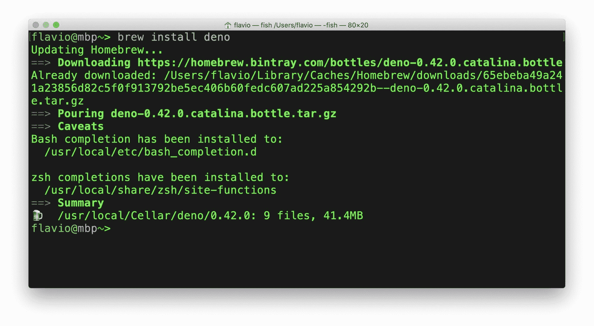

完成后，您将可以访问`deno`命令。以下是您可以使用`deno --help`获得的帮助:

```
flavio@mbp~> deno --help
deno 0.42.0
A secure JavaScript and TypeScript runtime

Docs: https://deno.land/std/manual.md
Modules: https://deno.land/std/ https://deno.land/x/
Bugs: https://github.com/denoland/deno/issues

To start the REPL, supply no arguments:
  deno

To execute a script:
  deno run https://deno.land/std/examples/welcome.ts
  deno https://deno.land/std/examples/welcome.ts

To evaluate code in the shell:
  deno eval "console.log(30933 + 404)"

Run 'deno help run' for 'run'-specific flags.

USAGE:
    deno [OPTIONS] [SUBCOMMAND]

OPTIONS:
    -h, --help
            Prints help information

    -L, --log-level <log-level>
            Set log level [possible values: debug, info]

    -q, --quiet
            Suppress diagnostic output
            By default, subcommands print human-readable diagnostic messages to stderr.
            If the flag is set, restrict these messages to errors.
    -V, --version
            Prints version information

SUBCOMMANDS:
    bundle         Bundle module and dependencies into single file
    cache          Cache the dependencies
    completions    Generate shell completions
    doc            Show documentation for a module
    eval           Eval script
    fmt            Format source files
    help           Prints this message or the help of the given subcommand(s)
    info           Show info about cache or info related to source file
    install        Install script as an executable
    repl           Read Eval Print Loop
    run            Run a program given a filename or url to the module
    test           Run tests
    types          Print runtime TypeScript declarations
    upgrade        Upgrade deno executable to newest version

ENVIRONMENT VARIABLES:
    DENO_DIR             Set deno's base directory (defaults to $HOME/.deno)
    DENO_INSTALL_ROOT    Set deno install's output directory
                         (defaults to $HOME/.deno/bin)
    NO_COLOR             Set to disable color
    HTTP_PROXY           Proxy address for HTTP requests
                         (module downloads, fetch)
    HTTPS_PROXY          Same but for HTTPS
```

## 演示命令

请注意帮助中的`SUBCOMMANDS`部分，它列出了我们可以运行的所有命令。我们有哪些子命令？

*   `bundle`将项目的模块和依赖项捆绑到单个文件中
*   `cache`缓存依赖关系
*   `completions`生成外壳完成
*   显示模块的文档
*   `eval`评估一段代码，例如`deno eval "console.log(1 + 2)"`
*   `fmt`内置代码格式化程序(类似于 Go 中的`gofmt`)
*   打印该消息或给定子命令的帮助
*   `info`显示缓存信息或源文件相关信息
*   `install`将脚本安装为可执行文件
*   `repl`读取-评估-打印-循环(默认)
*   给定模块的文件名或 url，运行程序
*   `test`运行测试
*   `types`打印运行时类型脚本声明
*   `upgrade`将`deno`升级到最新版本

您可以运行`deno <subcommand> help`来获取该命令的特定附加文档，例如`deno run --help`。

正如帮助所说，我们可以使用这个命令来启动一个 REPL(读-执行-打印-循环),使用`deno`没有任何其他选项。

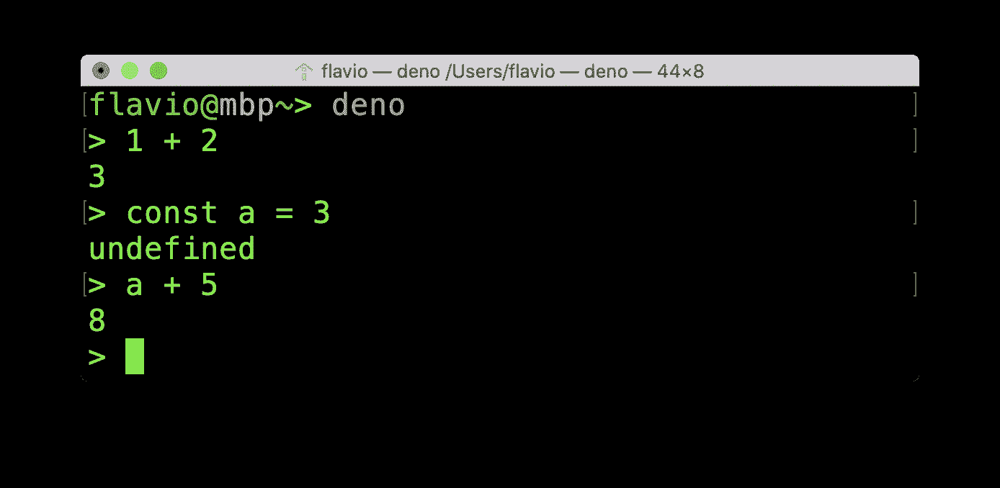

这和跑`deno repl`是一样的。

使用该命令的一种更常见的方式是执行包含在 TypeScript 文件中的 Deno 应用程序。

您可以运行 TypeScript ( `.ts`)文件或 JavaScript ( `.js`)文件。

如果您不熟悉 TypeScript，不要担心:Deno 是用 TypeScript 编写的，但是您可以用 JavaScript 编写您的“客户端”应用程序。

**我的[打字教程](https://flaviocopes.com/typescript/)会帮你快速上手打字。**

## 你的第一个 Deno 应用

第一次运行一个 Deno app 吧。

我发现非常令人惊奇的是，你甚至不必写一行字——你可以从任何 URL 运行命令。

Deno 下载程序，编译，然后运行:


**当然，从互联网上运行任意代码不是一种实践*我一般会*推荐。在这种情况下，我们从 Deno 官方网站运行它，加上 Deno 有一个沙箱，防止程序做任何你不想允许的事情。稍后将详细介绍。**

这个程序很简单，只是一个`console.log()`调用:

```
console.log('Welcome to Deno ?') 
```

如果你用浏览器打开[https://deno.land/std/examples/welcome.ts](https://deno.land/std/examples/welcome.ts)网址，你会看到这个页面:

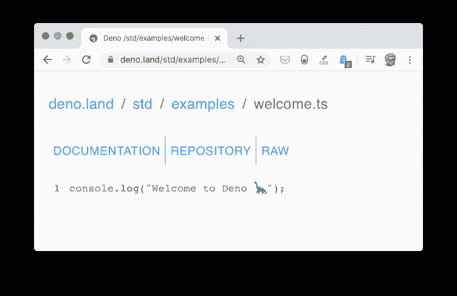

很奇怪，对吧？你可能会期待一个类型脚本文件，但我们有一个网页。原因是 Deno 网站的网络服务器知道你在使用浏览器，并为你提供一个更加用户友好的页面。

使用`wget`下载相同的 UR，例如，请求它的`text/plain`版本而不是`text/html`:

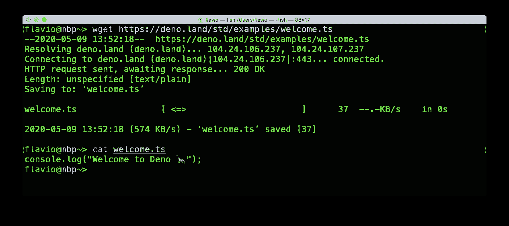

如果您想再次运行该程序，它现在已被 Deno 缓存，无需再次下载:

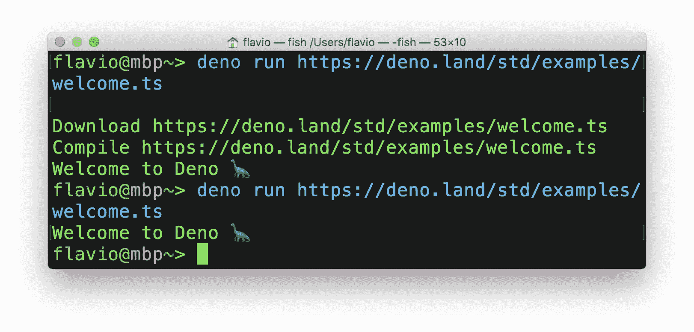

您可以使用`--reload`标志强制重新加载原始源文件:

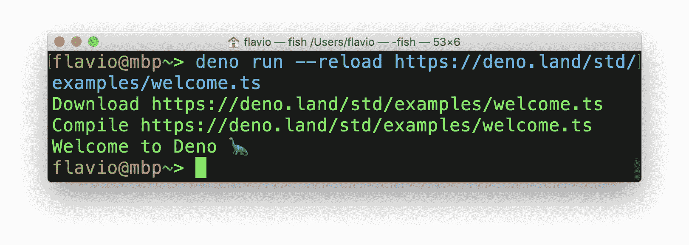

`deno run`有许多未在`deno --help`中列出的不同选项。相反，你需要运行`deno run --help`来揭示它们:

```
flavio@mbp~> deno run --help
deno-run
Run a program given a filename or url to the module.

By default all programs are run in sandbox without access to disk, network or
ability to spawn subprocesses.
  deno run https://deno.land/std/examples/welcome.ts

Grant all permissions:
  deno run -A https://deno.land/std/http/file_server.ts

Grant permission to read from disk and listen to network:
  deno run --allow-read --allow-net https://deno.land/std/http/file_server.ts

Grant permission to read whitelisted files from disk:
  deno run --allow-read=/etc https://deno.land/std/http/file_server.ts

USAGE:
    deno run [OPTIONS] <SCRIPT_ARG>...

OPTIONS:
    -A, --allow-all
            Allow all permissions

        --allow-env
            Allow environment access

        --allow-hrtime
            Allow high resolution time measurement

        --allow-net=<allow-net>
            Allow network access

        --allow-plugin
            Allow loading plugins

        --allow-read=<allow-read>
            Allow file system read access

        --allow-run
            Allow running subprocesses

        --allow-write=<allow-write>
            Allow file system write access

        --cached-only
            Require that remote dependencies are already cached

        --cert <FILE>
            Load certificate authority from PEM encoded file

    -c, --config <FILE>
            Load tsconfig.json configuration file

    -h, --help
            Prints help information

        --importmap <FILE>
            UNSTABLE:
            Load import map file
            Docs: https://deno.land/std/manual.md#import-maps
            Specification: https://wicg.github.io/import-maps/
            Examples: https://github.com/WICG/import-maps#the-import-map
        --inspect=<HOST:PORT>
            activate inspector on host:port (default: 127.0.0.1:9229)

        --inspect-brk=<HOST:PORT>
            activate inspector on host:port and break at start of user script

        --lock <FILE>
            Check the specified lock file

        --lock-write
            Write lock file. Use with --lock.

    -L, --log-level <log-level>
            Set log level [possible values: debug, info]

        --no-remote
            Do not resolve remote modules

    -q, --quiet
            Suppress diagnostic output
            By default, subcommands print human-readable diagnostic messages to stderr.
            If the flag is set, restrict these messages to errors.
    -r, --reload=<CACHE_BLACKLIST>
            Reload source code cache (recompile TypeScript)
            --reload
              Reload everything
            --reload=https://deno.land/std
              Reload only standard modules
            --reload=https://deno.land/std/fs/utils.ts,https://deno.land/std/fmt/colors.ts
              Reloads specific modules
        --seed <NUMBER>
            Seed Math.random()

        --unstable
            Enable unstable APIs

        --v8-flags=<v8-flags>
            Set V8 command line options. For help: --v8-flags=--help

ARGS:
    <SCRIPT_ARG>...
            script args
```

## Deno 代码示例

除了我们上面的例子，Deno 网站还提供了其他一些例子，你可以看看:[https://deno.land/std/examples/](https://deno.land/std/examples/)。

在写的时候我们可以发现:

*   打印作为参数提供的文件列表的内容
*   打印作为参数提供的文件列表的内容
*   `chat/`聊天的实现
*   `colors.ts`的例子
*   `curl.ts`一个简单的`curl`实现，它打印作为参数指定的 URL 的内容
*   `echo_server.ts`一个 TCP 回送服务器
*   向 gist.github.com 发送文件的程序
*   `test.ts`一个样本测试套件
*   一个简单的 console.log 语句(我们上面运行的第一个程序)
*   `xeval.ts`允许您为接收到的任何一行标准输入运行任何类型的脚本代码。[曾经被称为`deno xeval`](https://youtu.be/HjdJzNoT_qg?t=1932) 但是自从被调离官方指挥。

## 你的第一个 Deno 应用程序(真的)

让我们写一些代码。

你用`deno run https://deno.land/std/examples/welcome.ts`运行的第一个 Deno 应用是别人写的，所以你看不到任何关于 Deno 代码的东西。

我们先从 Deno 官网列出的默认示例 app 说起:

```
import { serve } from 'https://deno.land/std/http/server.ts'
const s = serve({ port: 8000 })
console.log('http://localhost:8000/')
for await (const req of s) {
  req.respond({ body: 'Hello World\n' })
} 
```

这段代码从`http/server`模块导入`serve`函数。看到了吗？我们不必先安装它，它也不会像节点模块那样存储在您的本地机器上。这是为什么 Deno 安装如此之快的一个原因。

从`https://deno.land/std/http/server.ts`导入模块的最新版本。您可以使用`@VERSION`导入特定版本，如下所示:

```
import { serve } from 'https://deno.land/std@v0.42.0/http/server.ts' 
```

`serve`函数在这个文件中是这样定义的:

```
/**
 * Create a HTTP server
 *
 *     import { serve } from "https://deno.land/std/http/server.ts";
 *     const body = "Hello World\n";
 *     const s = serve({ port: 8000 });
 *     for await (const req of s) {
 *       req.respond({ body });
 *     }
 */
export function serve(addr: string | HTTPOptions): Server {
  if (typeof addr === 'string') {
    const [hostname, port] = addr.split(':')
    addr = { hostname, port: Number(port) }
  }

  const listener = listen(addr)
  return new Server(listener)
} 
```

我们继续实例化一个调用`serve()`函数的服务器，传递一个带有`port`属性的对象。

然后我们运行这个循环来响应来自服务器的每个请求。

```
for await (const req of s) {
  req.respond({ body: 'Hello World\n' })
} 
```

注意，我们使用了`await`关键字，而不必将其包装到`async`函数中，因为 Deno 实现了[顶级 await](https://flaviocopes.com/javascript-await-top-level/) 。

让我们在本地运行这个程序。我假设你使用 [VS 代码](https://flaviocopes.com/vscode/)，但是你可以使用任何你喜欢的编辑器。

我推荐安装来自`justjavac`的 Deno 扩展(当我尝试的时候有另一个同名的，但是被否决了——将来可能会消失)

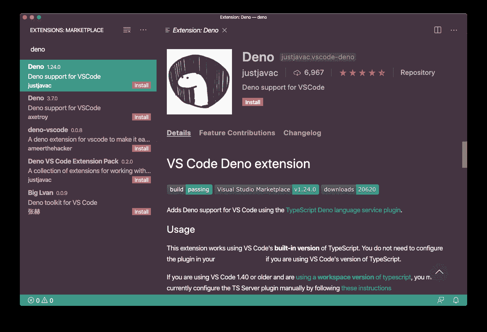

该扩展将为 VS 代码提供几个实用工具和好东西来帮助你编写应用程序。

现在在一个文件夹中创建一个`app.ts`文件，并粘贴上面的代码:

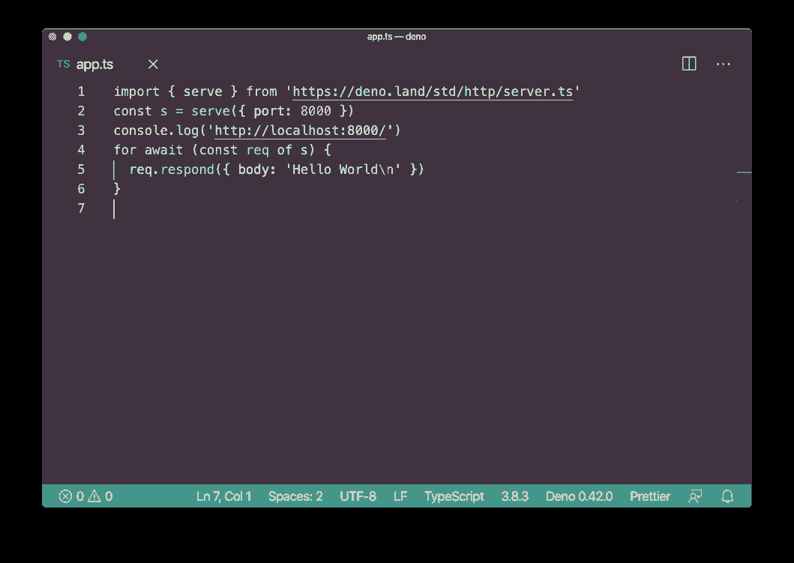

现在使用`deno run app.ts`运行它:

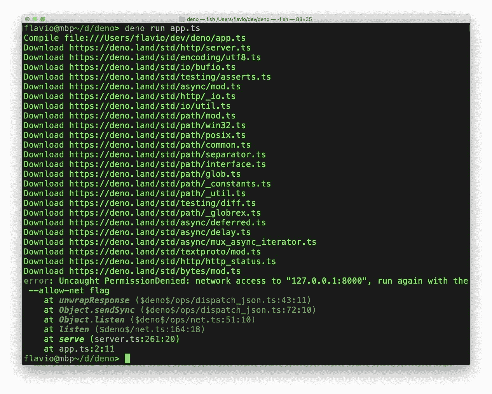

Deno 下载它需要的所有依赖项，首先下载我们导入的那个。

[https://deno.land/std/http/server.ts](https://deno.land/std/http/server.ts)文件本身有几个依赖项:

```
import { encode } from '../encoding/utf8.ts'
import { BufReader, BufWriter } from '../io/bufio.ts'
import { assert } from '../testing/asserts.ts'
import { deferred, Deferred, MuxAsyncIterator } from '../async/mod.ts'
import {
  bodyReader,
  chunkedBodyReader,
  emptyReader,
  writeResponse,
  readRequest,
} from './_io.ts'
import Listener = Deno.Listener
import Conn = Deno.Conn
import Reader = Deno.Reader 
```

这些是自动导入的。

尽管最后我们有一个问题:


发生了什么事？我们有一个拒绝许可的问题。

再来说说沙盒。

## 德诺沙盒

我之前提到过 Deno 有一个沙箱，可以防止程序做任何你不想允许的事情。

这是什么意思？

Ryan 在 Deno 介绍演讲中提到的一件事是，有时您希望在 Web 浏览器之外运行一个 JavaScript 程序，但又不想让它访问您系统上的任何内容。或者使用网络与外部世界对话。

没有什么可以阻止 Node.js 应用程序获取您的 SSH 密钥或系统上的任何其他东西，并将其发送到服务器。这就是为什么我们通常只安装来自可信来源的节点包。但是，我们如何知道我们使用的项目之一是否被黑客攻击，而其他所有人又会被攻击呢？

Deno 试图复制浏览器实现的相同权限模型。除非您明确允许，否则浏览器中运行的 JavaScript 不能在您的系统上做可疑的事情。

回到 Deno，如果一个程序想像前面的例子一样访问网络，那么我们需要给它许可。

我们可以通过在运行命令时传递一个标志来做到这一点，在本例中是`--allow-net`:

```
deno run --allow-net app.ts
```


该应用程序现在正在端口 8000 上运行 HTTP 服务器:

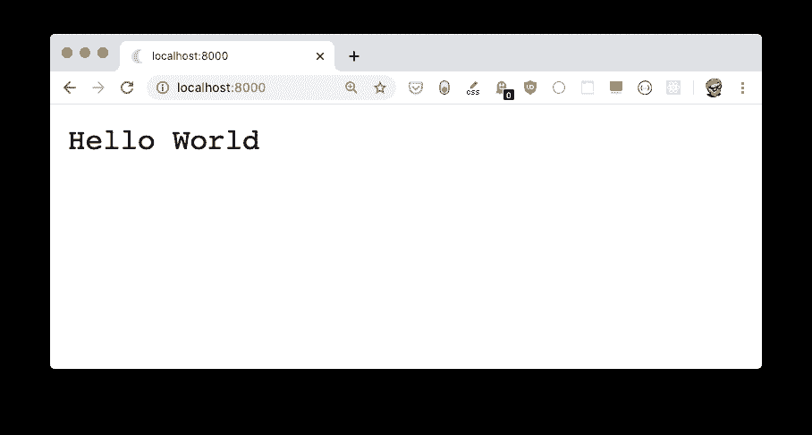

其他标志允许 Deno 解锁其他功能:

*   `--allow-env`允许环境访问
*   `--allow-hrtime`允许高分辨率时间测量
*   `--allow-net=<allow-net>`允许网络访问
*   `--allow-plugin`允许加载插件
*   `--allow-read=<allow-read>`允许文件系统读取访问
*   `--allow-run`允许运行子流程
*   `--allow-write=<allow-write>`允许文件系统写访问
*   `--allow-all`允许所有权限(与`-A`相同)

对于`net`、`read`和`write`的许可可以是细粒度的。例如，您可以使用`--allow-read=/dev`允许读取特定文件夹

## 格式化代码

我非常喜欢 Go 的一点是 Go 编译器附带的`gofmt`命令。所有 Go 代码看起来都一样。大家都用`gofmt`。

JavaScript 程序员习惯于运行更漂亮的 T2，而实际上 T0 是在引擎盖下运行的。

假设您有一个格式错误的文件，如下所示:

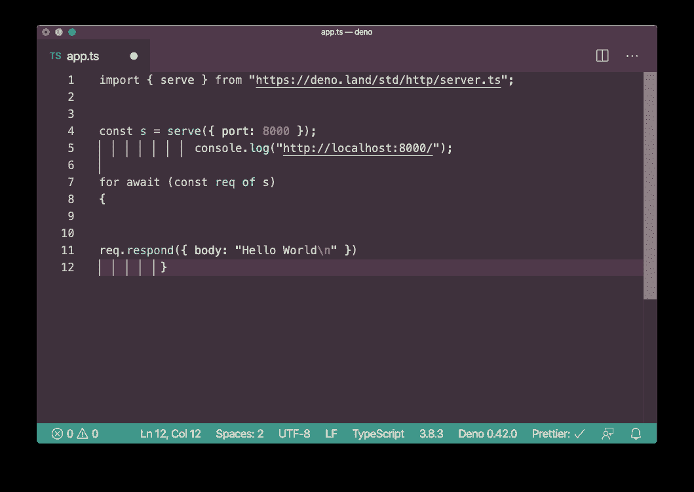

运行`deno fmt app.ts`，它会自动正确格式化，还会在缺少分号的地方添加分号:

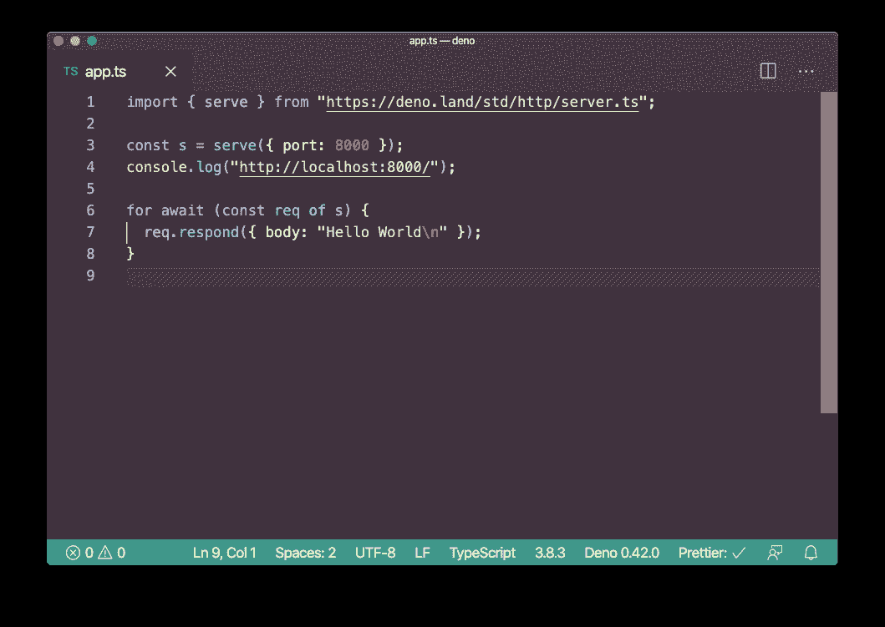

## 标准图书馆

尽管这个项目还很年轻，Deno 标准库还是很广泛的。

它包括:

*   `archive` tar 存档实用程序
*   `async`异步实用程序
*   `bytes`操纵字节片的助手
*   `datetime`日期/时间解析
*   `encoding`各种格式的编码/解码
*   `flags`解析命令行标志
*   `fmt`格式化和打印
*   `fs`文件系统 API
*   `hash`加密库
*   `http` HTTP 服务器
*   输入输出函数库
*   `log`日志记录实用程序
*   `mime`支持多部分数据
*   `node` Node.js 兼容层
*   `path`路径操纵
*   websockets

## 另一个 Deno 例子

再来看一个 Deno app 的例子，来自 Deno 的例子: [`cat`](https://deno.land/std/examples/cat.ts) :

```
const filenames = Deno.args
for (const filename of filenames) {
  const file = await Deno.open(filename)
  await Deno.copy(file, Deno.stdout)
  file.close()
} 
```

这将把`Deno.args`的内容分配给`filenames`变量，T1 是一个包含发送给命令的所有参数的变量。

我们遍历它们，对于每一个，我们使用`Deno.open()`打开文件，使用`Deno.copy()`将文件内容打印到`Deno.stdout`。最后我们关闭文件。

如果您使用

```
deno run https://deno.land/std/examples/cat.ts
```

程序被下载并编译，什么也没发生，因为我们没有指定任何参数。

立即尝试

```
deno run https://deno.land/std/examples/cat.ts app.ts
```

假设您在同一个文件夹中有来自上一个项目的`app.ts`。

您将得到一个权限错误:

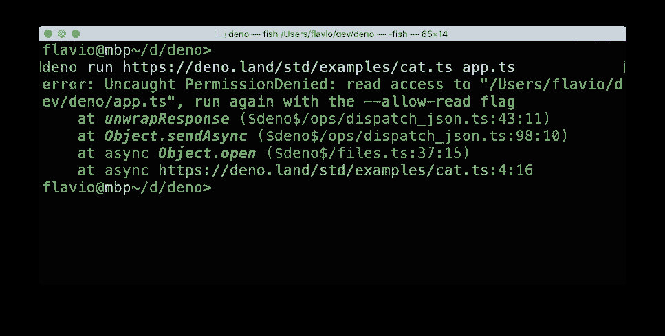

因为 Deno 默认情况下不允许访问文件系统。使用`--allow-read=./`授予对当前文件夹的访问权限:

```
deno run --allow-read=./ https://deno.land/std/examples/cat.ts app.ts
```

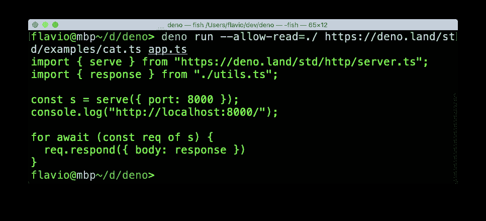

## 有去德诺的快车/哈比神/Koa/*吗？

是的，肯定的。查看项目，如

*   [德诺-德拉什](https://github.com/drashland/deno-drash)
*   [deno-express](https://github.com/NMathar/deno-express)
*   [橡树](https://github.com/oakserver/oak)
*   [pogo](https://github.com/sholladay/pogo)
*   [servest](https://github.com/keroxp/servest)

## 示例:使用 Oak 构建一个 REST API

我想用一个简单的例子来说明如何使用 Oak 构建 REST API。Oak 之所以有趣，是因为它受到了流行的 Node.js 中间件 [Koa](https://github.com/koajs/koa) 的启发，因此如果你以前使用过它，你会非常熟悉它。

我们将要构建的 API 非常简单。

我们的服务器会在内存中存储一份带有名字和年龄的狗的名单。

我们希望:

*   添加新狗
*   列出狗
*   获取特定狗的详细信息
*   从列表中删除一只狗
*   更新狗的年龄

我们将在 TypeScript 中这样做，但是没有什么可以阻止您用 JavaScript 编写 API 您只需删除类型。

创建一个`app.ts`文件。

让我们从从 Oak 导入`Application`和`Router`对象开始:

```
import { Application, Router } from 'https://deno.land/x/oak/mod.ts' 
```

然后我们得到环境变量 PORT 和 HOST:

```
const env = Deno.env.toObject()
const PORT = env.PORT || 4000
const HOST = env.HOST || '127.0.0.1' 
```

默认情况下，我们的应用程序将在 localhost:4000 上运行。

现在我们创建 Oak 应用程序并启动它:

```
const router = new Router()

const app = new Application()

app.use(router.routes())
app.use(router.allowedMethods())

console.log(`Listening on port ${PORT}...`)

await app.listen(`${HOST}:${PORT}`) 
```

现在应用程序应该可以编译好了。

奔跑

```
deno run --allow-env --allow-net app.ts
```

Deno 将下载依赖项:

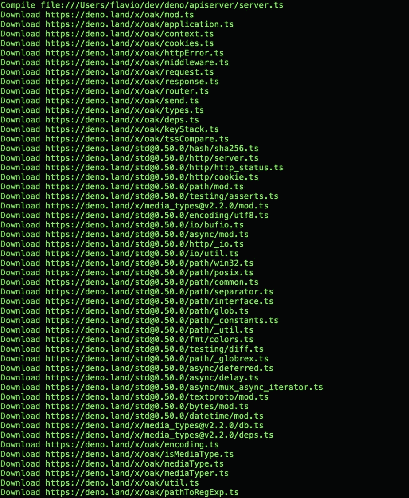

然后监听端口 4000。

下次运行该命令时，Deno 将跳过安装部分，因为这些包已经被缓存:


在文件的顶部，让我们为一只狗定义一个接口，然后我们声明一个狗对象的初始`dogs`数组:

```
interface Dog {
  name: string
  age: number
}

let dogs: Array<Dog> = [
  {
    name: 'Roger',
    age: 8,
  },
  {
    name: 'Syd',
    age: 7,
  },
] 
```

现在让我们实际实现 API。

我们一切就绪。创建路由器后，让我们添加一些函数，这些函数将在其中一个端点被点击时被调用:

```
const router = new Router()

router
  .get('/dogs', getDogs)
  .get('/dogs/:name', getDog)
  .post('/dogs', addDog)
  .put('/dogs/:name', updateDog)
  .delete('/dogs/:name', removeDog) 
```

看到了吗？我们定义

*   `GET /dogs`
*   `GET /dogs/:name`
*   `POST /dogs`
*   `PUT /dogs/:name`
*   `DELETE /dogs/:name`

让我们一个一个地实现它们。

从`GET /dogs`开始，返回所有狗的列表:

```
export const getDogs = ({ response }: { response: any }) => {
  response.body = dogs
} 
```


接下来，我们可以通过名字来检索一只狗:

```
export const getDog = ({
  params,
  response,
}: {
  params: {
    name: string
  }
  response: any
}) => {
  const dog = dogs.filter((dog) => dog.name === params.name)
  if (dog.length) {
    response.status = 200
    response.body = dog[0]
    return
  }

  response.status = 400
  response.body = { msg: `Cannot find dog ${params.name}` }
} 
```

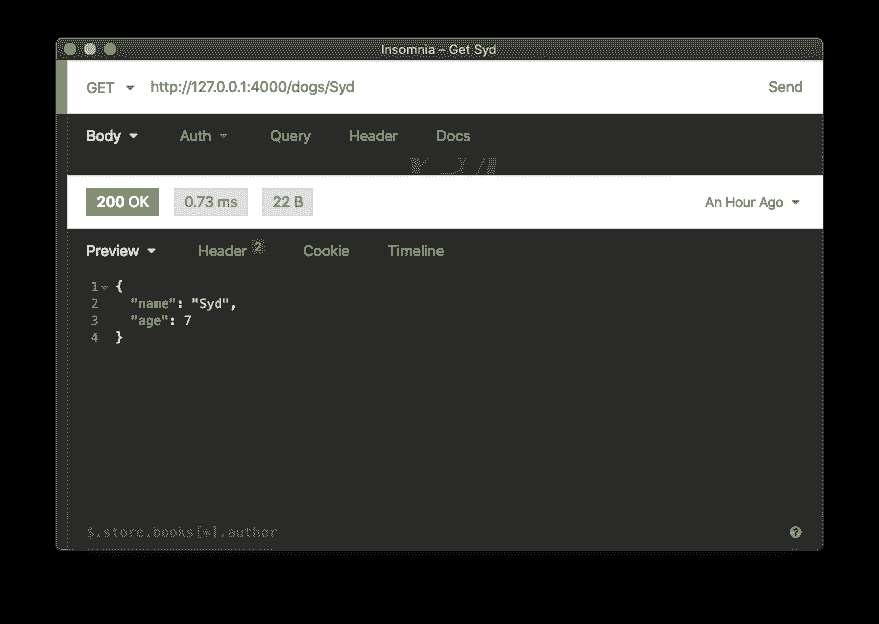

下面是我们添加新狗的方法:

```
export const addDog = async ({
  request,
  response,
}: {
  request: any
  response: any
}) => {
  const body = await request.body()
  const dog: Dog = body.value
  dogs.push(dog)

  response.body = { msg: 'OK' }
  response.status = 200
} 
```

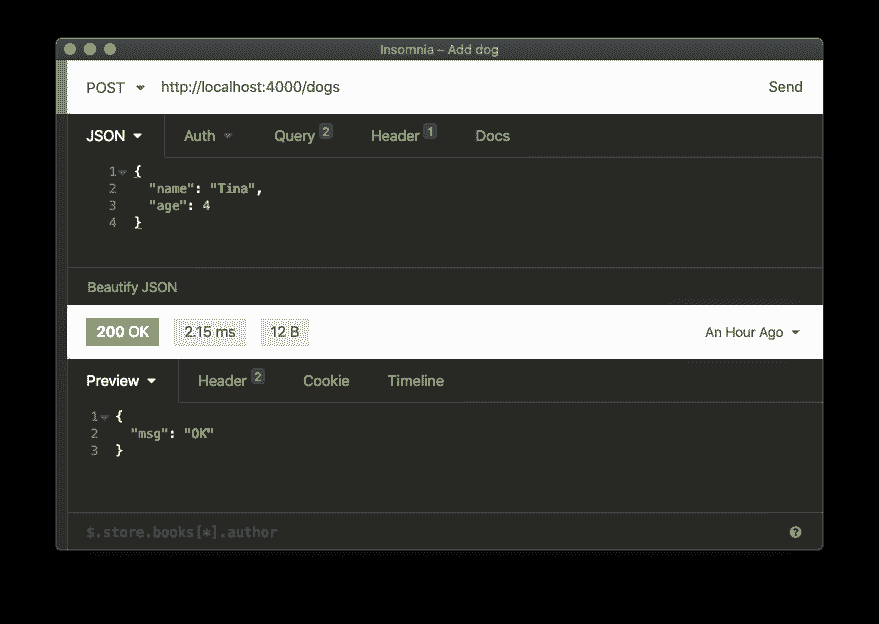

注意，我现在使用了`const body = await request.body()`来获取正文的内容，因为`name`和`age`值是作为 JSON 传递的。

下面是我们更新狗的年龄的方法:

```
export const updateDog = async ({
  params,
  request,
  response,
}: {
  params: {
    name: string
  }
  request: any
  response: any
}) => {
  const temp = dogs.filter((existingDog) => existingDog.name === params.name)
  const body = await request.body()
  const { age }: { age: number } = body.value

  if (temp.length) {
    temp[0].age = age
    response.status = 200
    response.body = { msg: 'OK' }
    return
  }

  response.status = 400
  response.body = { msg: `Cannot find dog ${params.name}` }
} 
```

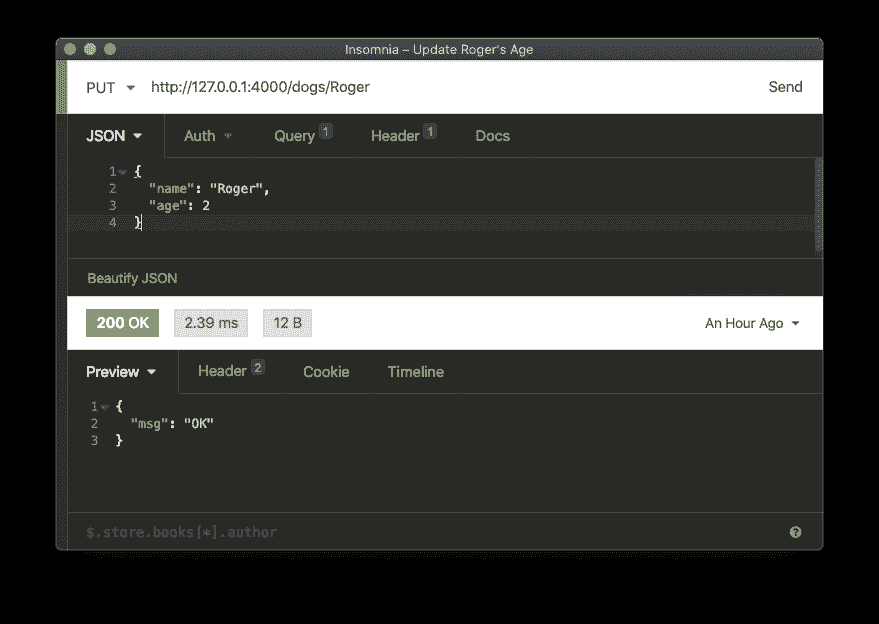

下面是我们如何从列表中删除一只狗:

```
export const removeDog = ({
  params,
  response,
}: {
  params: {
    name: string
  }
  response: any
}) => {
  const lengthBefore = dogs.length
  dogs = dogs.filter((dog) => dog.name !== params.name)

  if (dogs.length === lengthBefore) {
    response.status = 400
    response.body = { msg: `Cannot find dog ${params.name}` }
    return
  }

  response.body = { msg: 'OK' }
  response.status = 200
} 
```

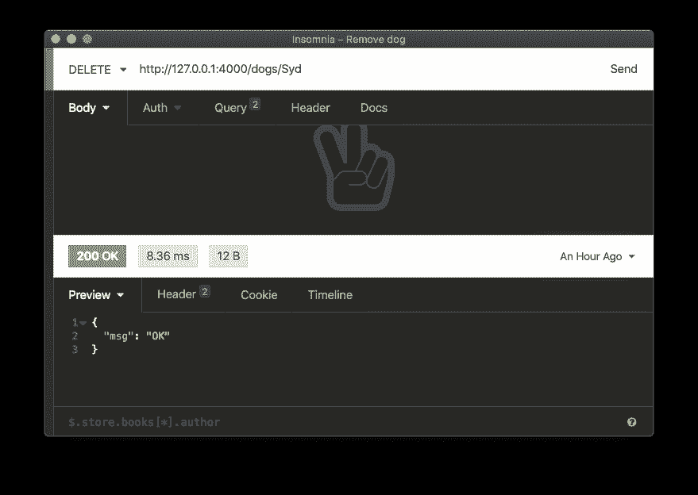

下面是完整的示例代码:

```
import { Application, Router } from 'https://deno.land/x/oak/mod.ts'

const env = Deno.env.toObject()
const PORT = env.PORT || 4000
const HOST = env.HOST || '127.0.0.1'

interface Dog {
  name: string
  age: number
}

let dogs: Array<Dog> = [
  {
    name: 'Roger',
    age: 8,
  },
  {
    name: 'Syd',
    age: 7,
  },
]

export const getDogs = ({ response }: { response: any }) => {
  response.body = dogs
}

export const getDog = ({
  params,
  response,
}: {
  params: {
    name: string
  }
  response: any
}) => {
  const dog = dogs.filter((dog) => dog.name === params.name)
  if (dog.length) {
    response.status = 200
    response.body = dog[0]
    return
  }

  response.status = 400
  response.body = { msg: `Cannot find dog ${params.name}` }
}

export const addDog = async ({
  request,
  response,
}: {
  request: any
  response: any
}) => {
  const body = await request.body()
  const { name, age }: { name: string; age: number } = body.value
  dogs.push({
    name: name,
    age: age,
  })

  response.body = { msg: 'OK' }
  response.status = 200
}

export const updateDog = async ({
  params,
  request,
  response,
}: {
  params: {
    name: string
  }
  request: any
  response: any
}) => {
  const temp = dogs.filter((existingDog) => existingDog.name === params.name)
  const body = await request.body()
  const { age }: { age: number } = body.value

  if (temp.length) {
    temp[0].age = age
    response.status = 200
    response.body = { msg: 'OK' }
    return
  }

  response.status = 400
  response.body = { msg: `Cannot find dog ${params.name}` }
}

export const removeDog = ({
  params,
  response,
}: {
  params: {
    name: string
  }
  response: any
}) => {
  const lengthBefore = dogs.length
  dogs = dogs.filter((dog) => dog.name !== params.name)

  if (dogs.length === lengthBefore) {
    response.status = 400
    response.body = { msg: `Cannot find dog ${params.name}` }
    return
  }

  response.body = { msg: 'OK' }
  response.status = 200
}

const router = new Router()
router
  .get('/dogs', getDogs)
  .get('/dogs/:name', getDog)
  .post('/dogs', addDog)
  .put('/dogs/:name', updateDog)
  .delete('/dogs/:name', removeDog)

const app = new Application()

app.use(router.routes())
app.use(router.allowedMethods())

console.log(`Listening on port ${PORT}...`)

await app.listen(`${HOST}:${PORT}`) 
```

## 了解更多信息

Deno 官网是 [https://deno.land](https://deno.land/)

API 文档可以在 [https://doc.deno.land](https://doc.deno.land/) 和【https://deno.land/typedoc/index.html 获得

真棒-德诺[https://github.com/denolib/awesome-deno](https://github.com/denolib/awesome-deno)

## 更多的随机花絮

*   Deno 提供了一个内置的`fetch`实现，与浏览器中可用的实现相匹配
*   Deno 有一个与 Node.js 标准库[兼容的层正在进行](https://github.com/denoland/deno/tree/master/std/node)

## 最后的话

我希望你喜欢这个 Deno 教程！

提醒:[你可以在这里](https://flaviocopes.com/page/deno-handbook/)获得这本 Deno 手册的 PDF/ePub/Mobi 版本。