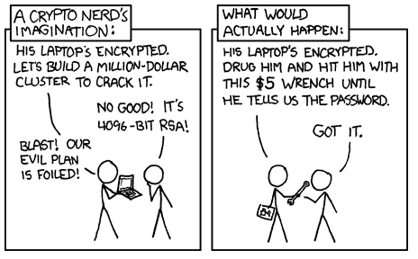

# 如何破解密码

> 原文：<https://www.freecodecamp.org/news/an-intro-to-password-cracking/>

简要说明——这篇文章是关于如何破解密码的理论。了解网络罪犯如何实施攻击对于了解如何保护系统免受这些类型的攻击极其重要。

试图入侵一个不属于你的系统在你的司法管辖区可能是非法的(此外，入侵你自己的系统可能[而且经常]违反该产品的任何担保)。

## 让我们从基础开始。什么是暴力攻击？

这种类型的攻击包括反复尝试以用户身份登录，尝试所有可能的字母、数字和字符组合(使用自动化工具)。

这可以在线完成(因此是实时的，通过在社交媒体或银行网站等账户上不断尝试不同的用户名/密码组合)，也可以离线完成(例如，如果你已经获得了一组散列密码，并试图离线破解它们)。

离线并不总是可能的(很难获得一组散列密码)，但它的噪音要小得多。这是因为安全团队可能会注意到来自同一个帐户的许多许多失败的登录帐户，但是如果您可以离线破解密码，您将不会有失败登录尝试的记录。

使用短密码，这相对容易。密码越长，难度就越大，因为可能性太多了。

例如，如果您知道某人正在使用 5 个字符长的密码，仅由小写字母组成，则可能的密码总数为 26^5(第一个字母有 26 个可能的字母可供选择，第二个字母有 26 个可能的选项，依此类推)。)，或 11，881，376 种可能的组合。

但是，如果有人使用 11 个字符的密码，只有小写字母，可能的密码总数是 26 ^11，或 3670344486987776 个可能的密码。

当您添加大写字母、特殊字符和数字时，这将变得更加困难和耗时。可能的密码越多，有人就越难通过暴力攻击成功登录。

### 如何保护自己

这种类型的攻击可以用几种不同的方法来防御。首先，您可以使用足够长的复杂密码(至少 15 个字符)。您还可以为每个帐户使用唯一的密码(使用密码管理器！)来降低数据泄露带来的危险。

安全团队可以在一定次数的失败登录尝试后锁定帐户。他们还可以强制使用第二种验证方法，如验证码，或者使用需要第二个代码(短信或电子邮件、基于应用程序或基于硬件密钥)的双因素身份验证(2FA)。

这里有一篇关于如何实施暴力攻击的文章。

## 如何能更快破解密码？

字典攻击包括通过尝试预编译“字典”或组合列表中包含的许多组合来尝试重复登录。

这通常比暴力攻击更快，因为字母和数字的组合已经被计算过了，节省了您的时间和计算能力。

但是如果密码足够复杂(例如 1098324ukjbfnsdfsnej)并且没有出现在“字典”(您正在使用的组合的预编译列表)中，攻击就不会起作用。

它经常成功，因为当人们选择密码时，他们通常会选择常见的单词或这些单词的变体(例如，“password”或“p@SSword”)。

当黑客知道或猜出密码的一部分(例如，狗的名字、孩子的生日或周年纪念——黑客可以在社交媒体页面或其他开源资源上找到的信息)时，他们也可能使用这种类型的攻击。

类似于上述针对暴力攻击的保护措施可以防止这些类型的攻击成功。

## 如果您已经有了一个哈希密码列表，该怎么办？

对于 Linux，密码存储在/etc/shadow 文件中；对于 Windows，密码存储在 C:\Windows\System32\config 文件中(这些文件在操作系统启动时不可用)。

如果你已经设法得到了这个文件，或者如果你已经以不同的方式获得了一个密码散列，比如嗅探网络上的流量，你可以尝试“离线”密码破解。

尽管上述攻击需要重复尝试登录，但是如果您有一个散列密码列表，您可以尝试在您的机器上破解它们，而不会触发由重复失败的登录尝试生成的警报。然后，您只需在成功破解密码后尝试登录一次(因此不会有失败的登录尝试)。

您可以对哈希文件使用暴力攻击或字典攻击，成功与否取决于哈希的强度。

### 等一下，发生什么事了？

35d 4 ffef 6 ef 231d 998 c 6046764 bb 935d

认得这条信息吗？上面写着“嗨，我叫梅根”

7 dbda 24 a2 d 10 daf 98 f 23 b 95 cf af1 d 3 ab

这是本文的第一段。是的，看起来像废话，其实是‘杂凑’。

哈希函数允许计算机输入一个字符串(字母、数字和符号的某种组合)，获取该字符串，将其混合，并输出固定长度的字符串。这就是为什么上面的两个字符串长度相同，即使字符串的输入长度非常不同。

几乎任何数字内容都可以创建散列。基本上所有的数字内容都可以简化为二进制，或者一系列的 0 和 1。因此，所有数字内容(图像、文档等。)可以被散列。

有许多不同的散列函数，其中一些比另一些更安全。上面的散列是用 MD5 生成的(MD 代表“消息摘要”)。不同的函数产生的散列长度也不同。

相同散列函数中的相同内容将总是产生相同的散列。然而，即使很小的改变也会完全改变散列。举个例子，

2 ff 5 e 24 f 6735 b 7564 CAE 7020 b41c 80 f 1

“嗨，我的名字是梅根”的散列值仅仅是将“梅根”中的 M 大写就完全改变了上面的散列值。

哈希也是单向函数(意味着它们不能反转)。这意味着散列(唯一的和单向的)可以用作内容的一种数字指纹。

### 如何使用散列的例子是什么？

哈希可以用来验证消息没有被更改。

例如，当您发送一封电子邮件时，您可以对整封电子邮件进行哈希处理并发送哈希。然后，接收方可以通过相同的哈希函数运行接收到的消息，以检查消息是否在传输过程中被篡改。如果两个哈希值匹配，则消息没有被更改。如果它们不匹配，则消息已被更改。

此外，存储密码时通常会进行哈希处理。当用户输入密码时，计算机会计算哈希值，并将其与存储的哈希值进行比较。这样电脑就不用明文存储密码了(这样一些爱管闲事的黑客就偷不到了！).

如果有人能够窃取密码文件，这些数据就没有用了，因为函数是不可逆的(尽管有一些方法，比如彩虹表，可以计算出是什么明文创建了已知散列)。

### 哈希有什么问题？

如果散列可以接受任何长度或内容的数据，那么可以被散列的数据就有无限的可能性。

由于哈希将文本转换为固定长度的内容(例如，32 个字符)，因此哈希的组合数量是有限的。这是非常非常多的可能性，但不是无限的。

最终，两组不同的数据将产生相同的哈希值。这叫做碰撞。

如果你有一个散列，你试图遍历每一个可能的明文值来找到与你的散列匹配的明文，这将是一个非常漫长，非常困难的过程。

### 但是，如果你不在乎哪两个哈希碰撞了呢？

这在数学上叫做'[生日问题](https://en.wikipedia.org/wiki/Birthday_problem)。在一个有 23 名学生的班级中，有人在特定日期过生日的可能性约为 7%，但任何两个人同一天过生日的可能性约为 50%。

可以对散列函数应用相同类型的分析，以便找到任何两个匹配的散列(而不是与另一个匹配的特定散列)。

为了避免这种情况，您可以使用更长的哈希函数，比如 SHA3，这样发生冲突的可能性更低。

你可以试着为 SHA3 [这里](https://www.browserling.com/tools/sha3-hash)和 MD5 [这里](http://onlinemd5.com/)生成你自己的散列函数。

你可以尝试暴力破解散列，但这需要很长时间。更快的方法是使用预先计算的[彩虹表](https://www.freecodecamp.org/news/p/ee82d358-9d43-49a8-84a6-8ffca9a3ee1f/www.freecodecamp.org/news/why-a-little-salt-can-be-great-for-your-passwords)(类似于字典攻击)。

## 好像真的很容易被黑。我应该担心吗？

关于黑客，要记住的最重要的一点是，没有人想做比他们必须做的更多的工作。例如，强力散列可能非常耗时和困难。如果有更简单的方法来获取你的密码，那可能是一个邪恶的演员首先会尝试的。

这意味着启用基本的网络安全最佳实践可能是防止被黑客攻击的最简单的方法。事实上，微软[最近报告](https://www.zdnet.com/article/microsoft-using-multi-factor-authentication-blocks-99-9-of-account-hacks/)说，仅仅启用 2FA 就可以阻止 99.9%的自动攻击。

[https://xkcd.com/538/](https://xkcd.com/538/)

**补充阅读:**

[流行的密码破解工具](https://resources.infosecinstitute.com/10-popular-password-cracking-tools/#gref)