# 我最喜欢的 Chrome 开发工具提示和技巧

> 原文：<https://www.freecodecamp.org/news/awesome-chrome-dev-tools-tips-and-tricks/>

Chrome Developer Tools 是一套用于开发 web 应用程序的超级强大的工具。它们可以做很多事情，从像遍历 DOM 这样非常基本的操作，到检查网络请求，甚至分析应用程序的性能。

如果你看得足够深入，在它们所带来的巨大的日常功能中，有相当多的宝石可以被发现。可能让您节省一两次点击的功能，这不正是我们在这里的目的吗？

## 控制台中的 jQuery 样式 DOM 查询

jQuery 很牛逼。它统治网络已经超过十年了，一些统计数据表明，超过 70%的世界上最流行的网页运行某种版本的 jQuery。对于一个可以追溯到 2006 年的图书馆来说，这太疯狂了。

jQuery 提供的最流行的 API 是`$`，用于选择 DOM 元素。Chrome 开发工具控制台允许你使用那个`$`选择器，等等。在引擎盖下，`$`是`document.querySelector()`的别名。

例如，如果您想模拟单击某个元素，您可以:

Using the $ selector to click a button

类似地，`$$`是`document.querySelectorAll()`的别名:

Using the $$ selector to print class names

还有一些锦囊妙计。有时，选择器可能太复杂而无法记住，或者您只是不知道足够具体的选择器。如果您在 Elements 选项卡中选择一个元素，您可以在控制台中用`$0`变量检索它:

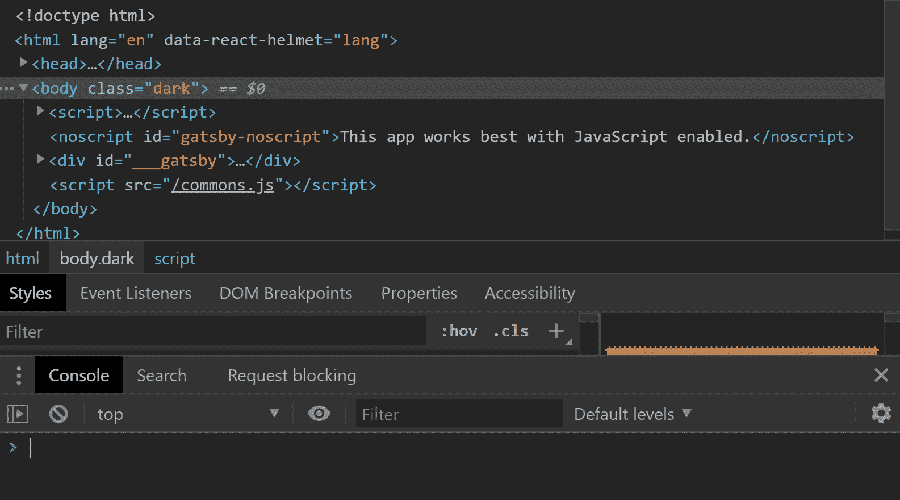

A gif showing usage of the $0 selector in console

控制台甚至更进一步，允许我们不仅访问最后一个选项，还可以按顺序访问最后 5 个选项。选择通过`$0` - `$4`变量显示:

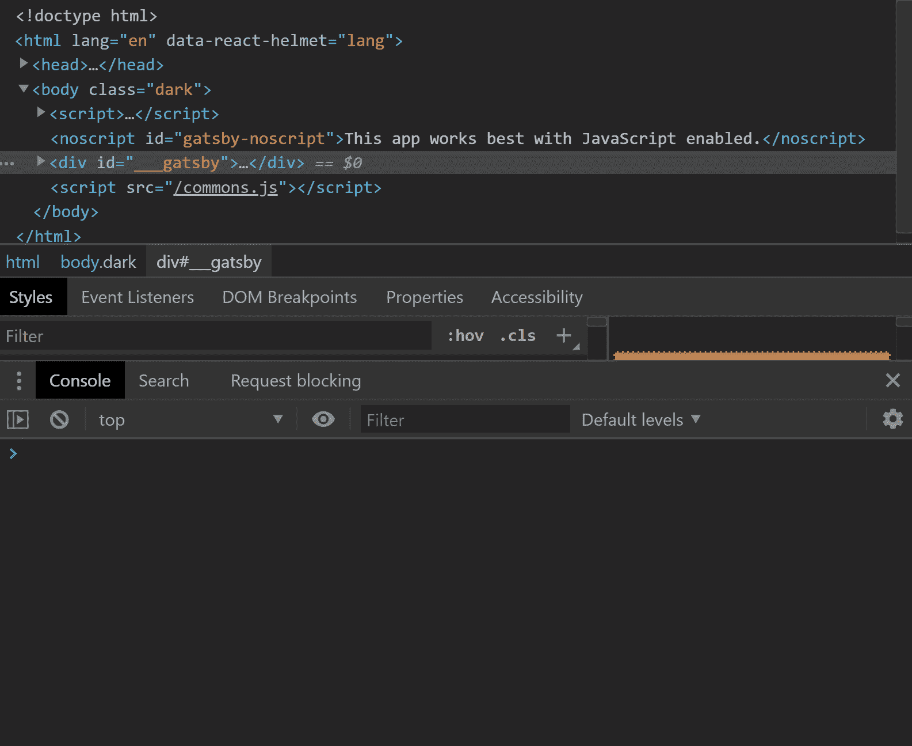

A gif showing usage of the $0 - $4 selector in console

## 复制元素的属性

元素选项卡是一个非常有用的选项卡。它存储我们的网站 DOM 树，它允许我们看到应用于每个元素的 CSS，我们可以从它对元素进行动态更改。

我发现的一个非常酷的技巧是能够从上下文菜单中复制元素的属性(不仅仅是属性)。

例如，您可以复制元素的选择器:

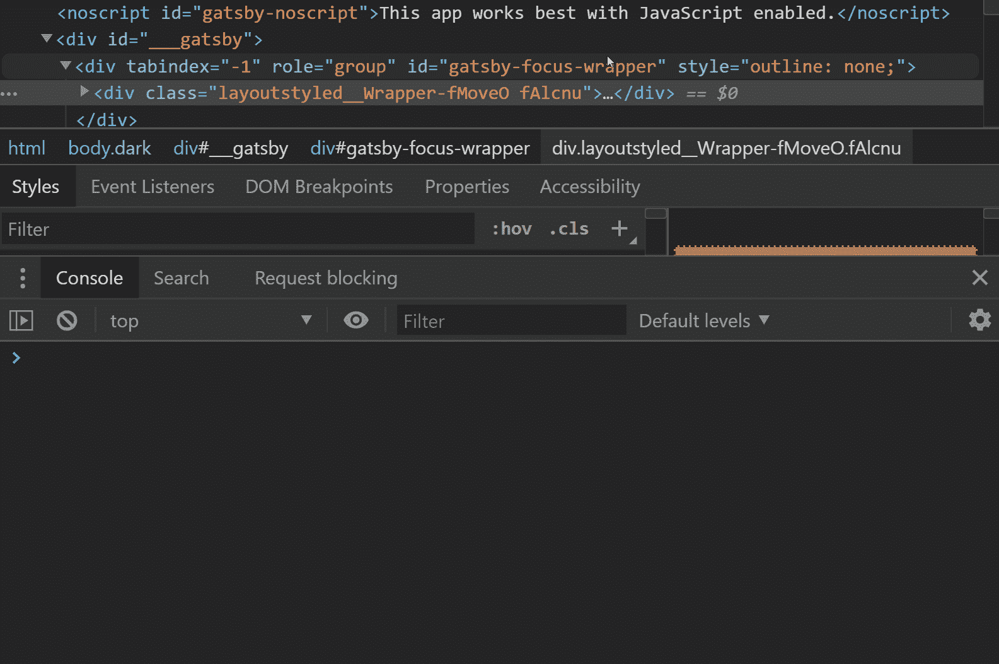

A gif showing how to copy an element's selector

这个选择器可能不够具体，或者对于生产来说太具体了，但是在调试时应该会让您的生活稍微轻松一些。

正如你在前面的 gif 中看到的，复制上下文菜单隐藏了一些你可以复制的更漂亮的东西。您可以复制元素的样式、JS 路径(`document.querySelector(SELECTOR)`)或 XPath。

## 过滤网络请求

有时候，你在一个有很多请求的页面上工作。我是说，很多。

Scrolling through very long list of network requests

当你寻找特定的东西时，处理所有这些请求会很困难。幸运的是，您可以非常容易地过滤请求。

过滤器工具栏可以快速切换各种请求类型，如 XHR/提取、样式表、JS 脚本、图像等:

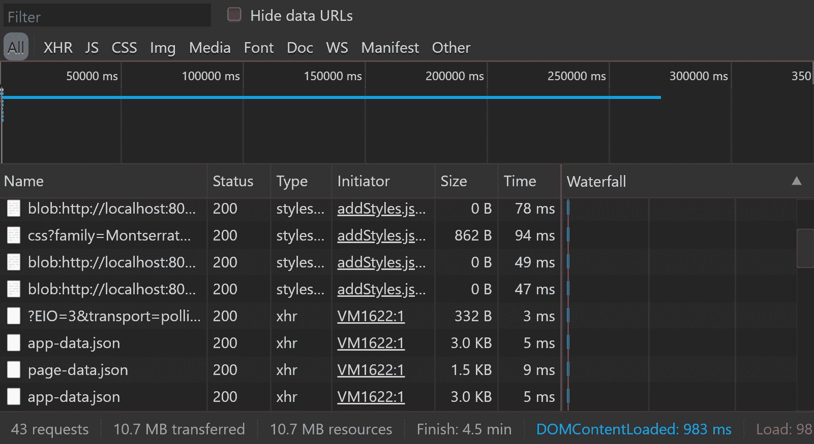

Using toolbar filters to filter network requests

如果您需要更加具体，或者您可能会更快地找到它，您可以在工具栏正上方的`filter`输入中编写一个过滤标准，以便在请求名称中进行搜索:

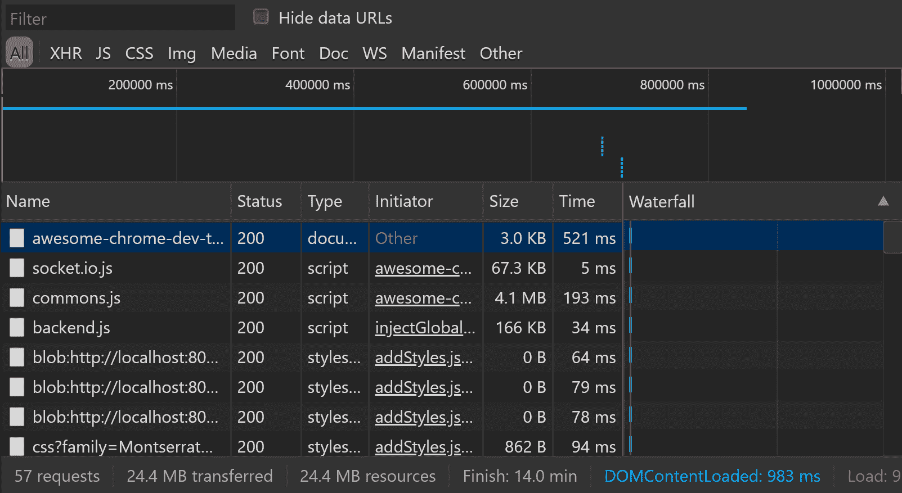

Filtering network requests by name

## 模拟不同的网络速度

再次使用`Network`选项卡，我们可以在不同的网速下测试我们的网站。默认预设是`online`，您将享受互联网连接的全部带宽。

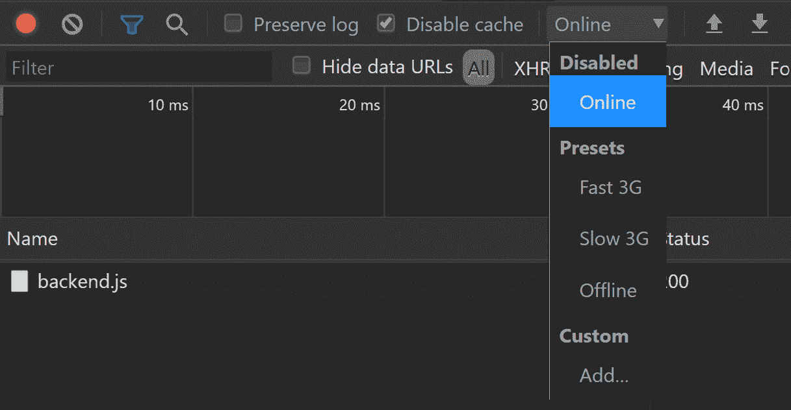

A menu allowing selection of various internet speeds

除了`online`，还有几个预置可用:`Fast 3G`、`Slow 3G`、`offline`，上传速度、下载速度、延迟各不相同。如果你需要模仿一种不同的、更奇特的速度，你可以通过`Add...`按钮添加你自己的个人资料:

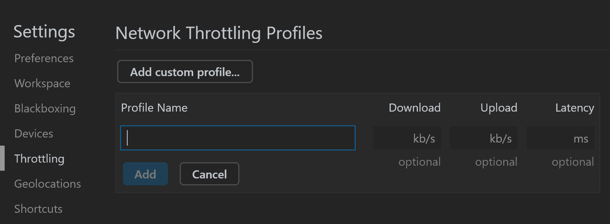

Adding a custom throttling profile

## 在控制台中使用实时表达式

什么是`Live Expressions`？

是在你的控制台顶部不断计算的表达式。比方说，您想要跟踪一段时间内的变量值。你可以一遍又一遍地记录它:

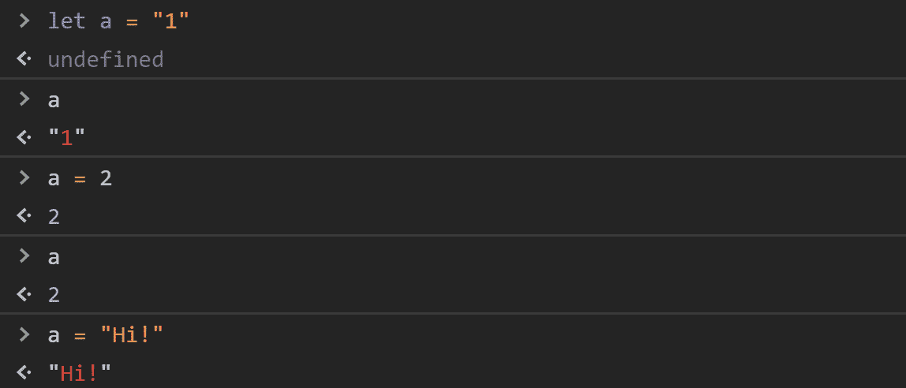

Printing a variable over and over again

有了`Live Expressions`，你可以专注于你的代码，让 Chrome 来监控:

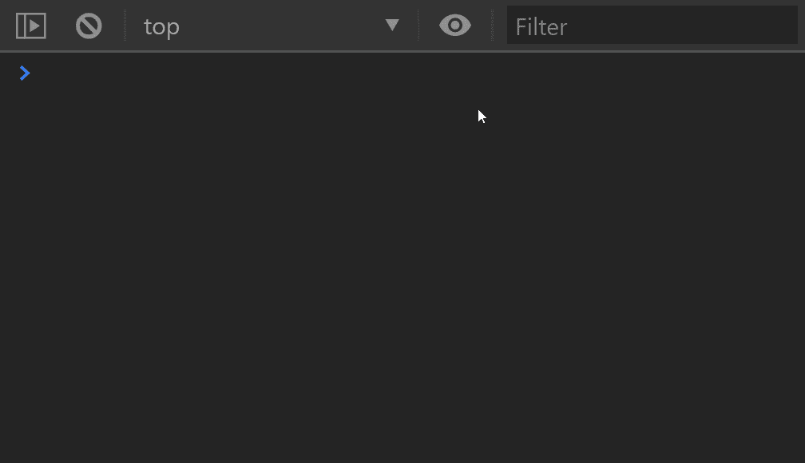

Storing a variable in a live expression

这适用于在控制台和脚本中定义的变量。

## 模拟不同的设备

我们这些开发响应式应用程序的人知道这种感觉:你非常努力地做了一个漂亮的布局，却看到它在不同分辨率的设备上表现不佳。

我在这里不是告诉你关于媒体查询，而是一个方便的方法来测试他们的工作。

A button to toggle device view

当你点击看起来像平板电脑和手机的按钮时，你会看到浏览器的视窗发生变化，以反映不同设备的尺寸。

您可以从包含各种流行设备的预置列表中选取设备，如 iPhone X、iPad Pro、Pixel 2、Pixel 2 XL 等。不可否认，这个列表有点过时，但我认为对于大多数情况来说已经足够了。

如果找不到符合您需求的设备，您可以设定自定分辨率。正如你所看到的，我已经设置了一个自定义分辨率来模拟 OnePlus 6(这是我的日常驱动程序)。

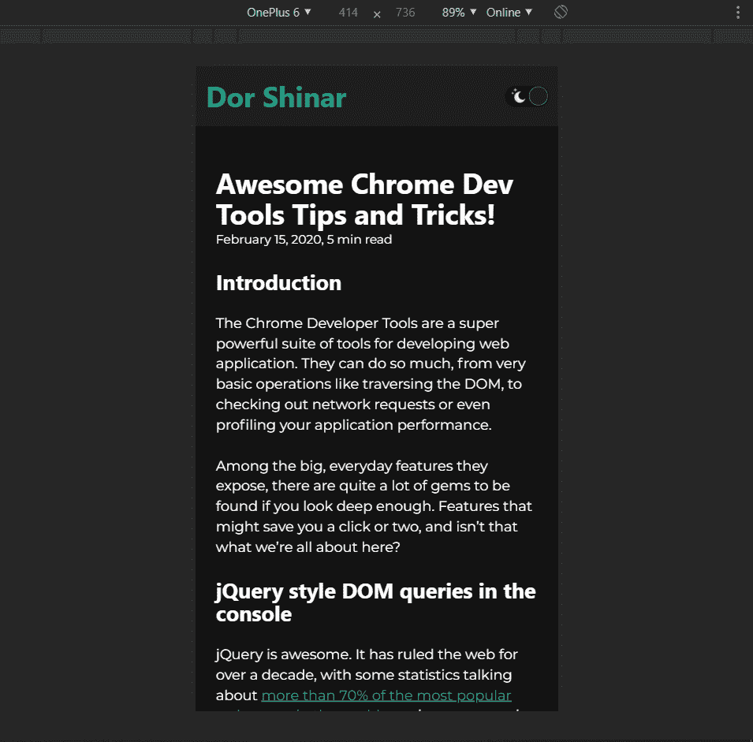

OnePlus 6 simulated device

## 强制元素的状态

你有没有遇到过这样的情况:你想玩一个特定于元素的 CSS，但是每次你把鼠标移动到 dev 工具的 styles 部分，元素就不再悬停了？

Chrome dev tools 公开了一种锁定元素状态的好方法，因此您可以平静地摆弄它的属性。这样，您可以快速切换元素的`:active`、`:hover`、`:focus`、`:focus-within`和`:visited`属性:

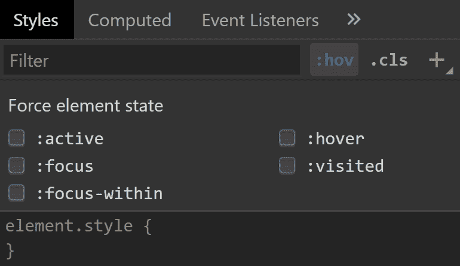

A menu for toggling an element's state

这些是我的建议和窍门，我想每个人都能从中受益。感谢您的阅读！

这篇文章之前发表在我的博客: [dorshinar.me](https://dorshinar.me/themes-using-css-variables-and-react-context) 。如果你想阅读更多的内容，你可以看看我的博客，因为它对我来说意义重大。

If you want to support me, you can 