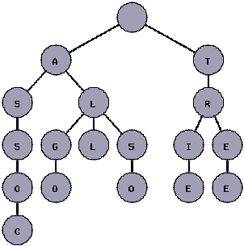

# 数据结构实现

> 原文：<https://www.freecodecamp.org/news/trie-data-structure-implementation/>

## **简介**

单词 trie 是单词“re ****trie**** val”的一个 inflix，因为 trie 可以在字典中找到只有单词前缀的单个单词。

Trie 是一种高效的数据检索数据结构。使用 trie，搜索复杂性可以达到最佳极限，即字符串的长度。

当我们存储字符串时，它是一个多向树结构，对存储字母表上的字符串很有用。它被用来存储大型英语词典，比如拼写检查程序中的单词。然而，尝试的代价是存储需求。

## 什么是 trie？

trie 是一种类似树的数据结构，它存储字符串，并使用字符串的前缀帮助您找到与该字符串相关的数据。

例如，假设您计划构建一个字典来存储字符串及其含义。您一定想知道为什么我不能简单地使用散列表来获取信息。

是的，您可以使用哈希表获取信息，但是只能找到字符串与我们添加的字符串完全匹配的数据。但是与散列表相比，trie 将使我们能够在更短的时间内找到具有共同前缀的字符串、丢失的字符等。

trie 通常看起来像这样，



这是一个 Trie 的图像，它存储了单词{assoc，algo，all，also，tree，trie}。

## **如何实现一个 trie**

让我们用 python 实现一个 trie，用于存储英语词典中的单词及其含义。

```
ALPHABET_SIZE = 26 # For English

class TrieNode:
	def __init__(self):
		self.edges = [None]*(ALPHABET_SIZE) # Each index respective to each character.
		self.meaning = None # Meaning of the word.
		self.ends_here = False # Tells us if the word ends here.
```

正如你所看到的，边的长度是 26，每个索引指的是字母表中的每个字符。' a '对应于 0，' B '对应于 1，' C '对应于 2 … 'Z '对应于第 25 个索引。如果您正在寻找的字符指向`None`，这意味着该单词不在 trie 中。

典型的 Trie 应该至少实现这两个功能:

*   `add_word(word,meaning)`
*   `search_word(word)`
*   `delete_word(word)`

此外，还可以添加类似

*   `get_all_words()`
*   `get_all_words_with_prefix(prefix)`

## 向 trie 添加单词

```
 def add_word(self,word,meaning):
		if len(word)==0:
			self.ends_here = True # Because we have reached the end of the word
			self.meaning = meaning # Adding the meaning to that node
			return
		ch = word[0] # First character
		# ASCII value of the first character (minus) the ASCII value of 'a'-> the first character of our ALPHABET gives us the index of the edge we have to look up.
		index = ord(ch) - ord('a')
		if self.edges[index] == None:
			# This implies that there's no prefix with this character yet.
			new_node = TrieNode()
			self.edges[index] = new_node

		self.edges[index].add(word[1:],meaning) #Adding the remaining word
```

## 检索数据

```
 def search_word(self,word):
		if len(word)==0:
			if self.ends_here:
				return True
			else:
				return "Word doesn't exist in the Trie"
		ch = word[0]
		index = ord(ch)-ord('a')
		if self.edge[index]== None:
			return False
		else:
			return self.edge[index].search_word(word[1:])
```

`search_word`函数会告诉我们这个单词是否存在于树中。因为我们的是一个字典，我们也需要获取意思，现在让我们声明一个函数来做这件事。

```
 def get_meaning(self,word):
		if len(word)==0 :
			if self.ends_here:
				return self.meaning
			else:
				return "Word doesn't exist in the Trie"
		ch = word[0]
		index = ord(ch) - ord('a')
		if self.edges[index] == None:
			return "Word doesn't exist in the Trie"
		else:
			return self.edges[index].get_meaning(word[1:])
```

## 删除数据

通过删除数据，只需要将变量`ends_here`改为`False`即可。这样做不会改变前缀，但仍然会从 trie 中删除单词的含义和存在。

```
 def delete_word(self,word):
		if len(word)==0:
			if self.ends_here:
				self.ends_here = False
				self.meaning = None
				return "Deleted"
			else:
				return "Word doesn't exist in the Trie"
		ch = word[0]
		index = ord(ch) - ord('a')
		if self.edges[index] == None:
			return "Word doesn't exist in the Trie"
		else:
			return self.edges[index].delete_word(word[1:])
```


[运行代码](https://repl.it/CWbr)