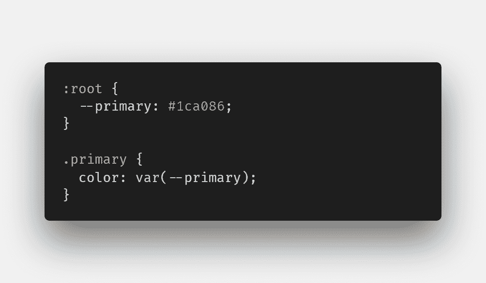

# 如何使用 CSS 变量和 React 上下文创建主题引擎

> 原文：<https://www.freecodecamp.org/news/themes-using-css-variables-and-react-context/>

CSS 变量真的很酷。您可以使用它们做很多事情，比如轻松地在应用程序中应用主题。

在本教程中，我将向您展示如何将它们与 React 集成以创建一个`ThemeComponent`(带上下文！).

## 要点中的 CSS 变量

所以首先，我想简单解释一下什么是 CSS 变量(或者用它们的正式名称——CSS 自定义属性)，以及如何使用它们。

CSS 变量是我们定义变量的一种方式，这些变量将在整个应用程序中应用。语法如下:



这里发生了什么？
使用`--{varName}`符号，我们可以告诉浏览器存储一个名为`varName`(或者上例中的`primary`)的唯一变量，然后我们可以在`.css`文件的任何地方使用`var(--{varName})`符号。

看起来真的很简单吗？那是因为它是。没什么大不了的。据 caniuse.com 称，全球超过 92%的用户使用支持 CSS 变量的浏览器(除非你真的需要 IE 支持，在这种情况下你就不走运了)。所以在很大程度上，它们完全可以安全使用。

如果你想了解更多，你可以在 [MDN 页面](https://developer.mozilla.org/en-US/docs/Web/CSS/Using_CSS_custom_properties)找到更多信息。

## 从 JavaScript 设置 CSS 变量

从 JavaScript 中设置和使用 CSS 变量就像在 CSS 中设置和使用它们一样简单。要获取元素上定义的值，请执行以下操作:

```
const primary = getComputedStyle(element).getPropertyValue("--primary"); 
```

将为我们提供为`element`定义的`primary`自定义 CSS 属性的值。

设置自定义 CSS 属性的工作方式如下:

```
element.style.setProperty("--light", "#5cd2b6"); 
```

或者，如果我们想为整个应用程序设置属性，我们可以这样做:

```
document.documentElement.style.setProperty("--light", "#5cd2b6"); 
```

现在所有代码都可以访问`light`属性了。

## 在要点中反应上下文

`React Context API`是 React 提供的将属性从一个组件间接传递到派生组件的唯一方法。

在本指南中，我将使用`useContext`钩子，你可以在这里阅读更多关于[的内容。但是对于类组件，原理是一样的。](https://reactjs.org/docs/hooks-reference.html#usecontext)

首先，我们必须初始化一个上下文对象:

```
import React from "react";

export const ThemeSelectorContext = React.createContext({
  themeName: "dark"
}); 
```

传递给`React.createContext`函数的参数是上下文的默认参数。现在我们有了一个上下文对象，我们可以用它向我们的间接后代“注入”道具:

```
export default ({ children }) => (
  <ThemeSelectorContext.Provider value={{ themeName: "dark" }}>
    {children}
  </ThemeSelectorContext.Provider>
); 
```

现在，任何想了解我们的价值观的人都可以做到:

```
import React, { useContext } from "react";

import { ThemeSelectorContext } from "./themer";

export default () => {
  const { themeName } = useContext(ThemeSelectorContext);

  return <div>My theme is {themeName}</div>;
}; 
```

瞧！无论我们的组件位于组件层次结构的哪个位置，它都可以访问`themeName`变量。如果我们想允许在我们的上下文中编辑该值，我们可以像这样传递一个函数:

```
export default ({ children }) => {
  const [themeName, setThemeName] = useState("dark");

  const toggleTheme = () => {
    themeName === "dark" ? setThemeName("light") : setThemeName("dark");
  };

  return (
    <ThemeSelectorContext.Provider value={{ themeName, toggleTheme }}>
      {children}
    </ThemeSelectorContext.Provider>
  );
}; 
```

要使用它:

```
import React, { useContext } from "react";

import { ThemeSelectorContext } from "./themer";

export default () => {
  const { themeName, toggleTheme } = useContext(ThemeSelectorContext);

  return (
    <>
      <div>My theme is {themeName}</div>
      <button onClick={toggleTheme}>Change Theme!</button>
    </>
  );
}; 
```

这足以满足我们的需求，但是如果你愿意，你可以进一步阅读官方的 React 上下文文档。

## 把所有东西放在一起

既然我们知道了如何从 JavaScript 设置 CSS 自定义属性，并且我们可以沿着组件树向下传递 props，那么我们就可以为我们的应用程序创建一个非常好且简单的“主题引擎”。首先，我们将定义我们的主题:

```
const themes = {
  dark: {
    primary: "#1ca086",
    separatorColor: "rgba(255,255,255,0.20)",
    textColor: "white",
    backgroundColor: "#121212",
    headerBackgroundColor: "rgba(255,255,255,0.05)",
    blockquoteColor: "rgba(255,255,255,0.20)",
    icon: "white"
  },
  light: {
    primary: "#1ca086",
    separatorColor: "rgba(0,0,0,0.08)",
    textColor: "black",
    backgroundColor: "white",
    headerBackgroundColor: "#f6f6f6",
    blockquoteColor: "rgba(0,0,0,0.80)",
    icon: "#121212"
  }
}; 
```

这恰好是我在博客中使用的调色板，但说到主题，天空真的是一个极限，所以请随意尝试。

现在我们创建我们的`ThemeSelectorContext`:

```
export const ThemeSelectorContext = React.createContext({
  themeName: "dark",
  toggleTheme: () => {}
}); 
```

我们的主题部分:

```
export default ({ children }) => {
  const [themeName, setThemeName] = useState("dark");
  const [theme, setTheme] = useState(themes[themeName]);

  const toggleTheme = () => {
    if (theme === themes.dark) {
      setTheme(themes.light);
      setThemeName("light");
    } else {
      setTheme(themes.dark);
      setThemeName("dark");
    }
  };

  return (
    <ThemeSelectorContext.Provider value={{ toggleTheme, themeName }}>
      {children}
    </ThemeSelectorContext.Provider>
  );
}; 
```

在这个组件中，我们存储了我们选择的主题对象和主题名称，并且定义了一个函数来切换我们选择的主题。

剩下的最后一点实际上是从我们的主题中设置 CSS 自定义属性。我们可以使用`.style.setProperty` API 轻松地做到这一点:

```
const setCSSVariables = theme => {
  for (const value in theme) {
    document.documentElement.style.setProperty(`--${value}`, theme[value]);
  }
}; 
```

现在，对于我们的`theme`对象中的每个值，我们可以访问一个同名的 CSS 属性(当然以`--`为前缀)。我们需要做的最后一件事是每次切换主题时运行`setCSSVariables`功能。所以在我们的`Theme`组件中，我们可以像这样使用`useEffect`钩子:

```
export default ({ children }) => {
  // code...

  useEffect(() => {
    setCSSVariables(theme);
  });

  // code...
}; 
```

完整的源代码可以在 github 上找到[。](https://github.com/dorshinar/blog/blob/master/src/components/themer/themer.jsx)

使用我们的主题非常方便:

```
.title {
  color: var(--primary);
} 
```

更新我们的主题也同样简单:

```
import Toggle from "react-toggle";

export default () => {
  const { toggleTheme, themeName } = useContext(ThemeSelectorContext);

  return <Toggle defaultChecked={themeName === "dark"} onClick={toggleTheme} />;
}; 
```

对于这个例子，我使用来自`react-toggle`的`Toggle`组件，但是任何切换/按钮组件都可以。点击`Toggle`将调用`toggleTheme`功能，并将为整个应用程序更新我们的主题，无需更多配置。

就是这样！这就是为你的应用程序创建一个超级简单、超级干净的主题引擎所需要做的一切。如果你想看一个真实的例子，你可以看看我博客的源代码。

感谢您的阅读！

这篇文章之前发表在我的博客: [dorshinar.me](https://dorshinar.me/themes-using-css-variables-and-react-context) 。如果你想阅读更多的内容，你可以看看我的博客，因为它对我来说意义重大。

If you want to support me, you can [](https://ko-fi.com/L3L116P44)