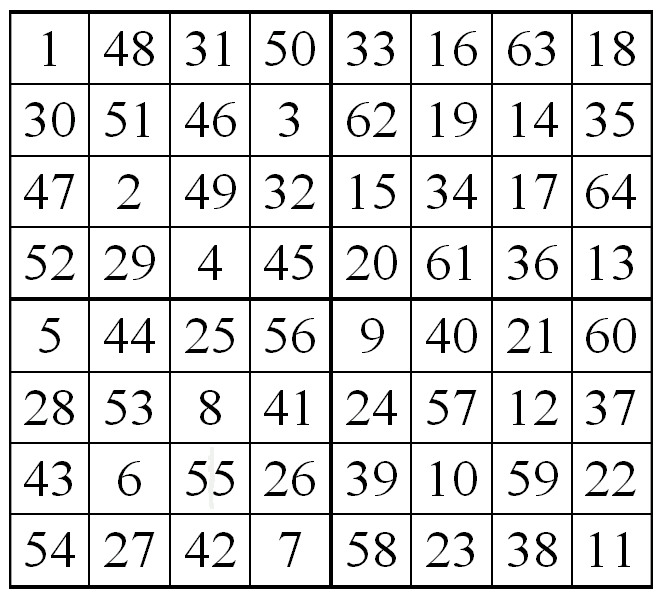

# 回溯算法解释

> 原文：<https://www.freecodecamp.org/news/backtracking-algorithms-explained/>

# **回溯算法**

回溯是一种通用算法，用于寻找一些计算问题的全部(或部分)解，特别是约束满足问题。它递增地构建候选解，并且一旦确定候选解不可能完成为有效解，就放弃每个部分候选解*(“回溯”)*。

### **例题(骑士之旅题)**

骑士被放在一个空棋盘的第一个方块上，按照国际象棋的规则移动，他必须恰好访问每个方格一次。

### **骑士覆盖所有细胞所遵循的路径**

以下是 8×8 格的棋盘。单元格中的数字表示骑士的移动次数。



### **骑士之旅的朴素算法**

朴素的算法是一个接一个地生成所有的游览，并检查生成的游览是否满足约束。

```
while there are untried tours
{ 
   generate the next tour 
   if this tour covers all squares 
   { 
      print this path;
   }
}
```

### **骑士之旅的回溯算法**

下面是骑士之旅问题的回溯算法。

```
If all squares are visited 
    print the solution
Else
   a) Add one of the next moves to solution vector and recursively 
   check if this move leads to a solution. (A Knight can make maximum 
   eight moves. We choose one of the 8 moves in this step).
   b) If the move chosen in the above step doesn't lead to a solution
   then remove this move from the solution vector and try other 
   alternative moves.
   c) If none of the alternatives work then return false (Returning false 
   will remove the previously added item in recursion and if false is 
   returned by the initial call of recursion then "no solution exists" )
```