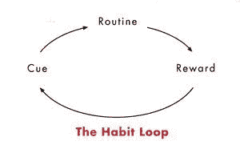

# 如何让编程成为日常习惯

> 原文：<https://www.freecodecamp.org/news/how-to-make-programming-a-daily-habit/>

在过去的几年中，编码一直是一个热门话题。很多人想开始编程，成为一名开发人员。那么如何才能养成一个编码习惯呢？

几天前，我开始阅读查尔斯·杜希格的《习惯的力量》。这本书让我思考了很多为什么有些人每天都在与编程作斗争。我觉得是因为习惯过程。大多数人不知道习惯是如何起作用的，需要具体的例子。

在这篇文章中，我将解释什么是习惯，并给你一些建议，以帮助你建立一个日常的编程习惯。

## 什么是习惯？

在开始之前，有必要定义什么是习惯以及如何养成习惯。

如果我们在谷歌上查看“习惯”这个词的定义，我们会发现:

> “习惯是定期重复的行为惯例，并且倾向于下意识地发生”――维基百科

> “通过频繁重复或生理暴露获得的一种行为模式，表现出规律性或增强的表现能力”― [梅里亚姆韦伯斯特词典](https://www.merriam-webster.com/dictionary/habits)

> “通过频繁重复获得的一种循环的、经常是无意识的行为模式”――免费字典

> “你经常或有规律地做的事情，经常不去想它”――麦克米伦词典

如你所见，习惯是你生活中的一个自动过程。以刷牙为例。

定义一个习惯的组成部分来理解它是如何工作的是很有趣的。

每个习惯包括三个组成部分:一个线索，一个惯例，和一个奖励。

[The Habit Loop](https://charlesduhigg.com/keep-your-resolutions-this-year/)

### 暗示是什么？

线索是你生活中触发一种习惯的事件。每次你自动做一件事，它都是由一个提示开始的。

大多数时候，线索是由时间、情绪状态、位置或动作来定义的。

举个例子，如果我正在工作，突然闻到同事方向传来咖啡的味道，我“喝咖啡休息”的习惯就被触发了。

### 套路是什么？

常规是你在习惯过程运行时正在做的事情。你可以在这部分定义任何你想要的东西。如我之前所说，它可以是，“我要去喝杯咖啡休息一下。”

### 奖励是什么？

奖励是这个过程的最后一个要素。换句话说，这个程序为你做了什么。对于喝咖啡休息的例子，奖励是“感谢咖啡因，我感觉不那么累了，我更有活力了。”

对自己的奖励越积极愉快，你的大脑就越会保存这个习惯。

> “我们大脑中的这个过程是一个三步循环。首先，有一个提示，一个触发器，告诉你的大脑进入自动模式，使用哪个习惯。然后是例行公事，可以是身体上的，也可以是精神上的，也可以是情感上的。最后，有一个奖励，它帮助你的大脑弄清楚这个特定的循环是否值得在未来记住。随着时间的推移，这个循环——线索、常规、奖励；暗示、惯例、奖励——变得越来越自动化。线索和奖励交织在一起，直到一种强烈的期待感和渴望感出现。最终，不管是在寒冷的麻省理工学院实验室，还是在你的车道上，一种习惯就这样诞生了。――查尔斯·杜希格,《习惯的力量:为什么我们在生活和商业中会这样做》

### 一点运动

以下是你可以做的事情:选择你的一个日常习惯，试着定义暗示、常规和奖励。一旦你做到了，你就准备好阅读下一部分关于如何建立你的日常编程习惯了。

## 如何让编程成为日常习惯

要让编程成为日常活动，你所要做的就是创建一个例程。

你可以自由定义这个练习的每一部分，但是我会给你一些提示来帮助你。

对于提示，您可以尝试根据时间来定义一些东西:

*   每天早上我醒来后
*   当我下班回来的时候
*   在我午休的时候
*   [插入基于时间的提示]

常规将是我们定义的最直接的元素。你可以直接说，“我想用 30 分钟写代码”，“我要用 30 分钟学习[插入一项技能]”，或者更多。

最后，最关键的部分之一将是奖励。正如我在我的第一篇关于效率的文章的第一部分中所建议的，你需要为自己建立目标。这会帮助你定义奖励。你每练习一次习惯，就离你的目标更近了一步。

试着确定一个长期目标，在这个目标里面，有很多小目标。

例如，你可以说:

*   我正在接近本周的目标。
*   我离我的最终目标越来越近了。
*   如果我醒来后马上编码，我会给自己做早餐作为奖励。
*   [插入奖励]

### 一个可以帮助你的挑战

养成习惯的最好方法之一就是参加[100 天挑战](https://www.100daysofx.com/)。这个挑战旨在通过在 Twitter、Instagram 或你的博客上分享你所做的事情，帮助你创建一个模式，并每天坚持下去。

我告诉你这个挑战的原因是它在 Twitter 上因 [100DaysOfCode](https://www.100daysofcode.com/) 而出名。

我强烈建议您阅读网站上的规则并开始使用。你会发现，起初，它可能看起来很大而且不可能，但是你会发现做起来很有趣。

此外，你肯定会在 Twitter 上获得支持，这会激励你。

> “你对自我提升充满热情吗？渴望改变你的习惯，已经尝试过很多次，但是很难改变？生活似乎总是碍手碍脚，没有足够的支撑，你觉得自己一个人在里面？发现自己在想，“如果我似乎总是回到我开始的地方，那么所有这些自我完善有什么用？"― [100DaysOfX](https://www.100daysofx.com/)

如果我向你推荐这个挑战，那是因为我正在做。我对结果感到兴奋，而我才刚刚开始。

对我来说，我正在做 100 天阅读挑战。我总是想开始阅读，但我从来没有花时间去做。多亏了这个挑战，我已经在第 17 天了，并且已经完成了一本半的书。

我的习惯循环:

*   每天午饭前或睡觉前(提示)。
*   我阅读 20 页或更多(常规)。
*   我正在接近我每天阅读的长期目标。我已经接近完成这本书的短期目标了。这让我很高兴，因为我一直想每天阅读(奖励)。
*   我在我的 Twitter (承诺)上发布了我正在阅读的书中的一段话，并附有一些解释和激励性的文字[。](https://twitter.com/gaelgthomas/)

这里有一些技巧可以帮助你养成编程习惯。

### 计划你的任务

为了每天工作，实现每月的目标，我会在前一天晚上计划好所有的任务。我把我想做的东西写在纸上，每次做的时候，我都会把它从我的清单上划掉。我建议你在日常编程习惯中这样做，因为当你完成所有目标时，这会激励你，让你非常满意。

如果你的工作需要更多的结构，明确你要做什么，如何做，何时做，为什么做。

例如，我将为我的网站创建一个登录页面(我将做什么)。我会用 Vue。JS 来构建它(如何)。我将在上午 8 点到 10 点之间做这件事。这会帮助我更好地理解 Vue。JS 并帮助我开始获取我的访问者的电子邮件地址。

### 编写你梦想的项目

有什么比在做你梦想的项目时每天编码更好的呢？如果你需要动力，每天编程是一个极好的方法。不要害怕采取主动。每天做一点点会给你更大的动力，并在短时间内给你带来效果。

### 找到你想从事的领域

编程的世界是广阔的——网络、软件、人工智能、嵌入式等等。

最大的困难之一是定义作为程序员你想做什么。

这对每个人来说都不容易，但选择一个主题并坚持下去可以成为日常练习的一个很好的动力因素。

比如你选 web 编程，就专注那个。尽管它仍然是一个大话题，但你删除了软件、人工智能、嵌入式和其他所有东西。这是一个好的开始。

更进一步，你可以在前端和后端之间选择。

我告诉你这些是因为通常，当你开始时，你会很快失去动力，因为有太多的事情，你不能专注于一个特定的主题。

### 良好的环境

在日常编程习惯中能激励你的是一个愉快的工作环境。我不建议在你的床上工作。你会很容易累的。

试着在书桌或桌子前工作，做任何你需要的事情，在那个空间里感到舒服。它会让你想要更有效率地工作。

## 进一步阅读

如果你有兴趣了解更多关于习惯过程的知识，我邀请你阅读查尔斯·杜希格的《习惯的力量》。在写这篇文章时，这本书给了我很大的帮助，我给你的很多例子都是受它的启发。

我也听说过詹姆斯·克利尔的《原子习惯:一个简单的&证明的建立好习惯的方法&打破坏习惯的方法。这本书提供了一个改善你日常习惯的框架。作者试图就如何做出改变提供实际指导。

## 结论

你打算让编程成为日常习惯吗？你要承诺 100 天代码吗？

如果你喜欢这篇文章，请随意分享。

如果你想要更多这样的内容，你可以[在 Twitter](https://twitter.com/gaelgthomas/) 上关注我，在那里我会发关于 web 开发、自我完善和我作为一个全栈开发人员的旅程的推文！