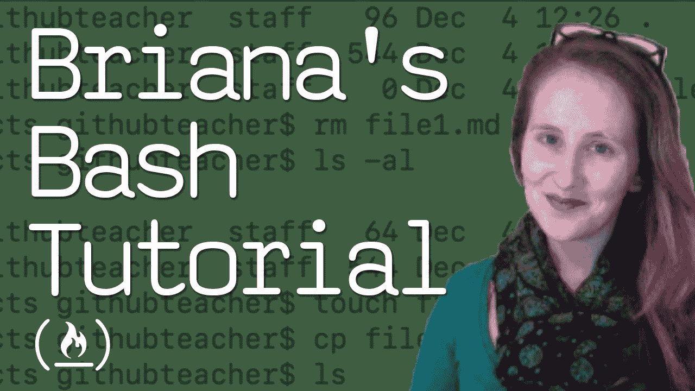

# 最好的 Linux 教程

> 原文：<https://www.freecodecamp.org/news/the-best-linux-tutorials/>

Linux 是一个名称，泛指围绕 Linux 内核构建的一系列免费和开源软件操作系统发行版。

Linux 内核是所有 Linux 发行版都使用的操作系统内核，由 Linux Torvalds 于 1991 年 9 月 17 日首次发布。

许多 Linux 发行版在其名称中使用了“Linux”一词。自由软件基金会使用 GNU/Linux 这个名称来指代操作系统家族以及特定的发行版，以强调大多数 Linux 发行版不仅仅是 Linux 内核，它们的共同点不仅是内核，还有许多实用程序和库，其中很大一部分来自 GNU 项目。

Linux 的发展是自由和开源软件合作最突出的例子之一。任何人都可以根据其各自的许可条款(如 GNU 通用公共许可证)以商业或非商业方式使用、修改和分发底层源代码。

Linux 最初是作为 MINIX 操作系统的克隆而启动的。开源贡献者添加到内核中，扩展了它的硬件兼容性。Linux 的硬件支持和免费许可使得 Linux 在 90 年代中期成为桌面和服务器计算的流行选择。今天，Linux 是世界上最流行的操作系统。它为全球 90%的服务器提供动力，也是谷歌广受欢迎的安卓操作系统的基础。

也有许多版本的 Linux 被设计成可以在个人电脑上运行，比如 Debian 或 Ubuntu。更重要的是，这些不同版本的 Linux(称为发行版)允许用户对操作系统进行不同程度的个性化和控制。这意味着用户可以根据自己的需求选择 Linux 发行版。

还有 Kali Linux，用于高级渗透测试和审计。它有超过 700 个工具，为了能够有效地使用它，你需要知道如何使用命令行。不建议初学者使用。

流行的 Linux 发行版包括:

*   人的本质
*   Linux 作为
*   CentOS
*   RHEL
*   Arch Linux

包类型在更高层次的发行版之间被分开，用 Debian(.deb)和红帽(。rpm)是最常用的两种。不过还有其他的包括 Pacman(用于 Arch Linux)和 PetGet(小狗 Linux)。

Linux 发行版也有各种形状和大小，大多数(如果不是全部的话)都提供了在所谓的“Live CD”环境中直接通过 CD / DVD 运行的能力，如果您的主板支持从 USB 启动，甚至可以直接通过 USB 运行。

关于 Linux 的更多事实，请阅读 freeCodeCamp 创始人昆西·拉森的文章 [Linux 是 25。耶！让我们用 25 个关于 Linux 的惊人事实来庆祝一下](https://www.freecodecamp.org/news/linux-is-25-yay-lets-celebrate-with-25-rad-facts-about-linux-c8d8ac30076d/)。

### 一些最好的 Linux 教程

你可以观看这个[命令行速成班](https://www.youtube.com/watch?v=yz7nYlnXLfE)，它涵盖了许多最常见的命令。


或者 [Briana 的 Bash 教程](https://www.youtube.com/watch?v=BFMyUgF6I8Y)，它涵盖了各种命令行工具和命令。



## Linux 的一些优势

### 持续有效的改进。

Linux 的更新是通过全球开发者的合作进行的。有了这种类型的支持，错误可以更快地得到记录和解决。此外，由于开发人员也是最终用户，他们有适当的动机来确保它满足用户的需求，并且它被设计为运行良好。

### 风险更小。

软件的好坏取决于对它的支持。想象一下:一个软件是由 XYZ 公司开发的，后来他们破产了，或者被另一家决定停止支持的公司收购了。软件将永远看不到改进或修复，因此它的有用性将不可避免地被侵蚀和消亡。

Linux 不是由任何一个实体或公司拥有和操作的，所以这种情况不可能发生。更重要的是，任何人都可以自由地捡起它并做出贡献。由于 Linux 的广泛流行和使用，失去对它的支持的风险不大。

### 轻量级。

Linux 对在一个系统上运行的要求比 Windows 或 Mac 低很多。有了正确的 Linux 发行版，用户可以进行适度的设置，Linux 将赋予系统价值。磁盘空间和内存占用也可以更低。有些发行版适用于 Pentium 系列的 CPU，其他发行版只需要 128MB 的内存和大约相同的磁盘空间！

### 为初学者和高级用户提供了大量文档。

Linux 有一个活跃的社区，人们愿意分享他们的知识和帮助(很像 FreeCodeCamp！).Linux 内置了命令行实用程序，提供关于命令、库、标准等的文档。([手册页](https://en.wikipedia.org/wiki/Man_page)和[信息页](https://en.wikipedia.org/wiki/Info_(Unix))，互联网上还有各种格式的文档，包括[Linux 文档项目](http://www.tldp.org/)、[Linux 问题](http://www.linuxquestions.org/)、[服务器故障](http://serverfault.com/)和[Arch Wiki](https://wiki.archlinux.org/)。

除了文档之外，还有很多有用的、受欢迎的社区供新手提问，比如 [Ask Ubuntu](https://askubuntu.com/) 和 [Reddit 的 r/linuxquestions](https://www.reddit.com/r/linuxquestions/) 。

可以参加 IT 行业认可的自定进度认证( [CompTIA 的 Linux+](https://certification.comptia.org/certifications/linux) 和 [LPI 的 LPIC 测试](https://www.lpi.org/))。尽管不是必需的，学习 [C](https://en.wikipedia.org/wiki/C_(programming_language) 让用户能够回顾 Linux 代码，看看他们在运行什么。

### 商业支持。

世界依赖于支持关键系统的 Linux，因此这种需求不会消失。这不仅对那些为 Linux 做出贡献的人很重要，对那些支持它的人也很重要(乔布斯！).Linux 支持在 IT 中变得越来越重要，但作为一名开发人员，拥有这方面的知识将使他们更加全面和有用(即[全栈开发人员](https://medium.com/chris-messina/the-full-stack-employee-ed0db089f0a1#.ubttrv255))。

### 与其他操作系统的互操作性。

Linux 有对 NTFS 和 HFS+文件系统(Windows 和 MAC 使用)的驱动支持，也有对 Windows 机器上的文件/打印服务支持的 [Samba](https://www.samba.org/) 。

### 更好的硬件支持。

对于其他操作系统，用户通常需要访问制造商的网站来获得不同类型硬件的驱动程序支持。Linux 内核通过即插即用自动支持大多数硬件(很大程度上是因为开源社区)。一些制造商还开发他们专有驱动程序的 Linux 版本，这些驱动程序可以通过发行版的软件库或通过手动安装提供的二进制文件来轻松安装。

### 软件可用性/兼容性。

Linux 有一组丰富的可用应用程序。它有[办公应用](https://www.libreoffice.org/discover/libreoffice/)，网页浏览器([谷歌 Chrome](https://www.google.com/chrome/browser/desktop/) 和 [Mozilla Firefox](https://www.mozilla.org/en-US/firefox/new/) )，[媒体播放器](http://www.videolan.org/vlc/)，[图片](https://www.gimp.org/) / [视频处理](http://www.openshot.org/)等。对于视频游戏来说， [Steam](http://store.steampowered.com/about/) 运行在 Linux 上，Linux 支持很多游戏。Windows 应用程序也可以在 Linux 中运行(详见 [Wine](https://www.winehq.org/) )。

### 为发展而建。

由于 Linux 最初是由开发人员为开发人员开发的，他们已经花费了大量的时间和精力来完善他们将要使用的工具。

它有一个强大的 [shell](https://en.wikipedia.org/wiki/Unix_shell) ,可以用于各种编程和管理任务( [Bash](https://en.wikipedia.org/wiki/Bash_(Unix_shell) 是 Linux 最流行和默认的选择)。

虽然 Linux 在 [gedit](https://en.wikipedia.org/wiki/Gedit) 中有一个“记事本”等价物，但它也提供了更强大和可定制的基于文本的编辑器，如 [Vim](https://en.wikipedia.org/wiki/Vim_(text_editor)) 和 [Emacs](https://en.wikipedia.org/wiki/Emacs) (建议 Linux 用户至少知道这些编辑器中的一个)。

也有可用于 web 开发的 IDE，例如 [Atom](https://atom.io/) 、 [Aptana](http://www.aptana.com/) / [Eclipse](https://eclipse.org/) 、 [Sublime](https://www.sublimetext.com/) 、 [KomodoIDE](http://komodoide.com/) 等等。Linux 还可以利用诸如 [Apache](https://httpd.apache.org/) 之类的软件来设置本地 web 服务器进行测试，利用 [Git](https://git-scm.com/) 进行版本控制，以及其他工具/语言，例如[node . js](https://nodejs.org/en/)/[Ruby](https://www.ruby-lang.org/en/)/[SaSS](http://sass-lang.com/)/[Heroku](https://www.heroku.com/)都支持 Linux，并且拥有可以代替 GUI 使用的命令行工具。

### 可定制。

Linux 允许用户改变桌面设计和主题，添加小部件等等。这些变化可以在桌面环境中完成。不同的环境有不同的选择。一些受欢迎的有:KDE，侏儒，XFCE，万神殿。

### 它是免费的。

很难打破这个记录！

## Linux 入门

### 选择发行版

现在有各种类型的 Linux 发行版可供选择，选择一个是 Linux 世界中的一个主要问题。考虑到操作系统的易用性，这一类别中的佼佼者是:

*   Ubuntu——稳定的 Debian 系统的衍生物，Ubuntu 在易于使用和最新的环境中茁壮成长。
*   mint——基于 Ubuntu 和 Debian，这个操作系统有很好的特性，比如 Ubuntu 的 PPA 兼容性，apt 包管理器。基础 mint 发行版会让您想起 Windows，这对于来自 Windows 的用户来说是一个很好的特性。
*   trisquel——一个来自 Ubuntu 的发行版，专注于只使用完全自由的软件，避免专有软件。Trisquel 得到了自由软件基金会(FSF)的支持。

### 安装

大多数 Linux 发行版非常容易安装，因为在安装的每个步骤之间都会显示所有信息。

需要注意的一个重要步骤是决定在哪里安装新的 Linux 发行版。对于第一次使用的用户，最好选择“引导”选项，因为它会为你做所有的工作。

记得仔细阅读所有步骤，并在硬盘中为新发行版留些空间——我认为至少 30Gb 是不错的选择。

### 可怕的终点站

Linux 的终端并不可怕，实际上通过一些练习它很容易使用，它可以使你的日常任务大大自动化。

在 Debian/Ubuntu 及衍生产品中，打开 CLI (Comman Line Interface)的快捷方式是“Ctrl + Alt + T”。让我们打开终端，尝试一些命令。

cd(更改目录)——CD 命令是在 linux 命令行中使用最多的命令之一。它允许你改变你的工作目录。您可以使用它在文件系统的层次结构中移动。

```
cd
```

单独使用 cd 命令会将当前目录更改为您的用户主目录，该目录位于“/home/username”中，就像“/home/mark”中一样。

ls (List) -这个命令列出了当前目录中的内容。它也可以用来列出文件信息。

```
ls
```

现在我们可以在家里看到我们的目录。

# **10 个简单有用的 Linux 命令**

这里列出的命令是基本的，可以帮助您快速入门。但是它们也很强大，并且随着您的 Linux 专业知识的扩展，它们将继续有用。

1.  `man`向您展示跟随它的命令的手册。当试图弄清楚一个不熟悉的命令是如何工作的时候，这非常有帮助。例如，键入`man ls`获得您需要了解的关于`ls`命令的所有信息。键入`q`退出。
2.  它接收你给它的文本，并把它发送到某个地方——返回到屏幕、文件或另一个命令。示例:`echo "hello!"`
3.  要显示文本文件的内容，只需输入`cat myfile`。
4.  它言出必行，而且很擅长。使用它来查找文件的路径，大小，日期，所有者和一堆其他有用的过滤器。例子:`find . -type f -mtime -1h # List files in this directory modified in the past hour`。
5.  当你想知道时间时，只需键入日期。例子:`date "+It's %l:%m%p on %A"`。在脚本中使用它根据当前日期命名文件。
6.  这个目录里有什么？将`ls`与一些有用的标志结合起来，按照日期和大小显示和排序目录内容。它还为您提供了许多格式化输出的选项。
7.  我在哪里？Linux 是不宽容的，尤其是当你删除一些东西的时候。在你发布命令之前，确保你知道你在哪里。
8.  这个命令删除文件，而不是目录。`rm file.txt`将删除名为“file.txt”的文件，只要它存在并且在当前目录中。
9.  使用此命令，通过命令行移动文件。您也可以使用`mv`命令来重命名文件。例如，如果你想将文件“文本”重命名为“新建”，只需运行`mv text new`。
10.  Linux 的邮件程序看起来不怎么样，但它真的很有用。您可以在一个命令中创建邮件并添加文本、收件人和附件。示例:`echo "We're having a great time." | mail -s "Wish you were here!" -A postcard.png -t mom@example.com`
11.  `cut`当字符串中有分隔符时，使用`cut`过滤掉某些字段。例子:`echo "this, that, and the other" | cut -d, -f2 # "that"`
12.  要查找包含特定字符串的文本行，请使用 grep。示例:`grep 'root' /etc/passwd # root:x:0:0:root:/root:/bin/bash`
13.  `sed`使用`sed`在一段文本中查找并改变一个子串。例子:`echo "this, that, and the other" | sed 's/that/those/' # "this, those, and the other"`
14.  `shutdown`使用关闭系统并关闭电源。示例:`shutdown -h now`立即关闭系统。`shutdown -h +5`五分钟后关闭系统。
15.  `less`使用`less [filename]`查看文件内容并浏览。默认情况下，`less`会逐页浏览文件。

在脚本中和命令行中使用这些命令。它们都是非常强大的命令，Linux 的主页上有关于每一个命令的更多信息。

* * *

此外，用于系统管理员的重要命令如下:

1.  `uptime`:显示您的系统已经运行了多长时间，以及当前登录的用户数量。它还显示 1、5 和 15 分钟间隔的平均负载。
2.  `w`:显示当前登录的用户及其进程以及平均负载。还显示登录名、tty 名称、远程主机、登录时间、空闲时间、JCPU、PCPU、命令和进程。
3.  `users`:显示当前登录的用户。除了帮助和版本，此命令没有其他参数。
4.  `who`:简单返回用户名、日期、时间和主机信息。who 命令类似于 w 命令。不像 w，不打印用户在做什么。
5.  `whoami`:打印当前用户的姓名。您也可以使用“我是谁”来显示当前用户。如果您以 root 用户身份登录，使用 sudo 命令“whoami”将返回作为当前用户的 root 用户。如果您想知道登录的确切用户，请使用“我是谁”。
6.  `ls`:以人类可读的格式显示文件列表。
7.  `crontab`:使用 crontab 命令和-l 选项列出当前用户的计划作业。
8.  `less`:允许您快速查看文件。你可以上下翻页。按“q”退出 less 窗口。
9.  `more`:允许您快速查看文件，并以百分比显示详细信息。你可以上下翻页。按“q”退出更多窗口。
10.  `cp`:将文件从源复制到目标，保留相同的模式。

这些是 adiminstrator 经常使用的命令列表。这不是一个完整的列表，但它是一个精简的命令列表，需要时可以参考。

# 每个 Linux 用户都应该知道的常用术语。

*   ****Distro:**** 是‘分销’的简称；发行版是特定品牌的 GNU/Linux 操作系统——如 Redhat、Fedora、Ubuntu 和 Debian。
*   ****Shell:**** 这是读取你的命令输入并运行指定命令的程序。光标前面的美元符号(` $ ')称为 shell 提示符；它告诉你系统已经准备好了，正在等待命令形式的输入。
*   ****CLI:**** 代表*命令行界面*。它是一个简单的用户界面，提供用户使用文本命令与 Linux 操作系统交互所需的服务。它使用户不必知道复杂的硬件细节。
*   ****GUI:**** 代表图形用户界面。它是 Linux 系统的一部分，由窗口、图标、图片(一般是图形)组成，使点击成为可能。
*   ****终端:**** 是用于访问 Linux shell 的应用程序。
*   ****内核:**** 这是 Linux 系统的核心——你可以称之为“大脑”。内核控制计算机的资源，并通过直接与计算机硬件交互来决定如何使用它们。
*   ****Tux:****Linux 的官方吉祥物。这是通常与 Linux 联系在一起的企鹅——如果你在网上看过黄色和黑色的企鹅，那么你就看过 tux。
*   ****Root:**** 也称为超级用户，是 linux 机器管理员的“默认”用户名。通常在 linux 终端上用****“#”****符号表示。
*   ****命令:**** 是给 linux 机器的文本输入或指令(通过在终端键入它们)告诉它做什么(即，一个要求的结果)。
*   ****储存库:**** 储存库(或简称“repo”)是通常在线托管的发行版的软件包集合。当软件程序被添加到软件包管理器时，可以从发行版提供的默认软件库和第三方软件库中安装。
*   ****软件包管理器:**** 是一个软件程序，使您能够搜索、安装、更新和删除应用程序以及其他应用程序管理功能。每个发行版都有来自终端包管理器(如 Ubuntu 软件中心)的图形和命令行包管理工具，如“apt-get”。
*   ****依赖:**** 依赖是你要安装的程序需要运行的软件程序。当一个程序被安装时，它给默认的包管理器一个依赖列表，检查它们是否已经被安装，如果没有，就从一个库下载它们。