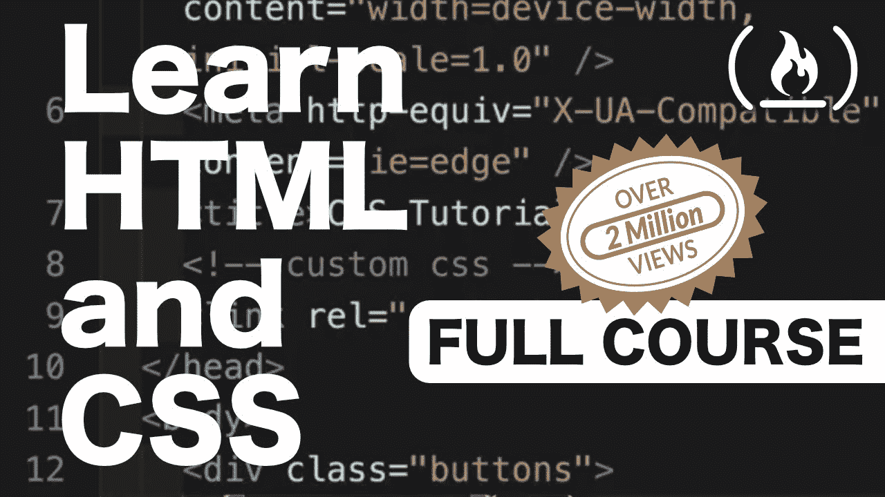

# 最好的 HTML 和 HTML5 教程

> 原文：<https://www.freecodecamp.org/news/best-html-html5-tutorial/>

超文本标记语言(HTML)是一种用于构建在线文档的标记语言，是当今大多数网站的基础。像 HTML 这样的标记语言允许我们

*   创建到其他文档的链接，
*   构建我们文档中的内容，以及
*   为我们文档的内容赋予上下文和含义。

HTML 文档有两个方面。它包含结构化信息(标记)和指向其他文档的文本链接(超文本)。我们使用 [HTML 元素](https://guide.freecodecamp.org/html#)来构建页面。它们是语言的构造，在我们的文档中为浏览器提供了[结构](https://guide.freecodecamp.org/html#)和[含义](https://guide.freecodecamp.org/html#)，以及到互联网上其他文档的元素链接。

互联网最初是为了存储和呈现静态(不变)文档而创建的。上面讨论的 HTML 的各个方面在这些缺少所有设计和样式的文档中表现得非常完美。他们展示了包含其他文档链接的结构化信息。

HTML5 是 HTML 的最新版本或规范。万维网联盟(W3C)是负责开发万维网标准(包括 HTML 标准)的组织。随着网页和 web 应用程序变得越来越复杂，W3C 更新了 HTML 的标准。

HTML5 引入了大量语义元素。虽然我们讨论了 HTML 如何帮助我们的文档提供意义，但直到 HTML5s 引入了[语义元素](https://guide.freecodecamp.org/html#)，它的潜力才被意识到。

## **HTML 文档的简单例子**

```
<!DOCTYPE html>
<html>
<head>
  <title>Page Title</title>
</head>
<body>

  <h1>My First Heading</h1>
  <p>My first paragraph.</p>

</body>
</html>
```

！DOCTYPE html:将这个文档定义为 HTML5

HTML:HTML 页面的根元素

head:元素包含关于文档的元信息

title:元素指定了文档的标题

body:元素包含可见的页面内容

h1:元素定义了一个大标题

元素定义了一个段落

# HTML 和 HTML5 入门教程

学习 HTML 的最佳起点是 freeCodeCamp 的 [2 小时 HTML 入门教程](https://www.youtube.com/watch?v=pQN-pnXPaVg)。

然后，如果你感觉更有冒险精神，我们有完整的 [12 小时课程，详细涵盖 HTML、HTML5 和 CSS](https://www.youtube.com/watch?v=mU6anWqZJcc)。



## **页面结构**

要在`HTML`中创建页面，你需要知道如何在`HTML`中构建页面。基本上，页面的结构遵循以下顺序:

```
<!DOCTYPE html>
<html>
  <head>
    <title>Title of the Page</title>
  </head>
  <body>
    <!-- Content -->
  </body>
</html>
```

1-`<!DOCTYPE html>`语句必须总是第一个出现在`HTML`页面上，并告诉浏览器正在使用的语言版本。在这种情况下，我们正在与`HTML5`合作。

2-`<html>`和`</html>`标签告诉网络浏览器`HTML`代码在哪里开始和结束。

3-`<head>`和`</head>`标签包含关于网站的信息，例如:风格、元标签、脚本等等

4-`<title>`和`</title>`标签告诉浏览器页面标题是什么。通过在您的互联网浏览器中识别标签可以看到标题。这些标签之间定义的文本也是搜索引擎在搜索结果中显示页面时用作标题的文本。

5 -在`<body>`和`</ body>`标签之间放置页面内容，这就是浏览器中显示的内容。

## HTML5 中的变化

#### **语义标签介绍**

不是每隔一个容器使用`<div>`，而是有几个语义标签(这些标签帮助视障人士使用的屏幕阅读器)，比如`<header>` `<footer>`。所以建议使用这些标签，而不是通用的`<div>`。

# **HTML 元素**

元素是 HTML 的构建块，描述网页的结构和内容。它们是超文本标记语言(HTML)的“标记”部分。

HTML 语法使用尖括号(“”)来保存 HTML 元素的名称。元素通常有一个开始标签和一个结束标签，并给出关于它们包含的内容的信息。两者的区别在于结束标记有一个正斜杠。

下面是一个使用 [p 元素](https://guide.freecodecamp.org/html/elements#) ( `<p>`)告诉浏览器一组文本是一个段落的例子:

```
<p>This is a paragraph.</p>
```

开始和结束标记应该匹配，否则浏览器可能会以意外的方式显示内容。


## **自动关闭元件**

一些 HTML 元素是自结束的，这意味着它们没有单独的结束标记。自结束元素通常会在文档中插入一些内容。

一个例子是 [br 元素](https://guide.freecodecamp.org/html/elements#) ( `<br>`)，它在文本中插入一个换行符。以前，自结束标签内部有正斜杠(`<br />`)，然而，HTML5 规范不再要求这样。

## **HTML 元素功能**

有许多可用的 HTML 元素。以下是它们执行的一些功能的列表:

*   给出关于网页本身的信息(元数据)
*   将页面内容组织成几个部分
*   嵌入图像、视频、音频剪辑或其他多媒体
*   创建列表、表格和表单
*   提供关于某些文本内容的更多信息
*   链接到包含浏览器如何显示页面的规则的样式表
*   添加脚本以使页面更具交互性和动态性

## **嵌套 HTML 元素**

您可以在 HTML 文档中的其他元素中嵌套元素。这有助于定义页面的结构。只要确保标签从最里面的元素开始关闭。

正确:`<p>This is a paragraph that contains a <span>span element.</span></p>`

不正确:`<p>This is a paragraph that contains a <span>span element.</p></span>`

## **块级和内联元素**

元素分为两大类，块级和内联。块级元素自动从新行开始，而内联元素位于周围的内容中。

帮助将页面组织成多个部分的元素，如导航栏、标题和段落，通常是块级元素。插入或给出更多内容信息的元素通常是内联的，比如[链接](https://guide.freecodecamp.org/html/elements#)或[图片](https://guide.freecodecamp.org/html/elements#)。

## **HTML 元素**

有一个`<html>`元素用于包含 HTML 文档的其他标记。它也被称为“根”元素，因为它是其他 HTML 元素和页面内容的父元素。

下面是一个页面的例子，它有一个[头部元素](https://guide.freecodecamp.org/html/elements#the-head-element)，一个[主体元素](https://guide.freecodecamp.org/html/elements#the-body-element)，和一个[段落](https://guide.freecodecamp.org/html/elements#the-p-element):

```
<!DOCTYPE html>
<html>
  <head>
  </head>
  <body>
    <p>I'm a paragraph</p>
  </body>
</html>
```

## **头部元素**

这是为 HTML 文档处理信息和元数据的容器。

```
<head>
  <meta charset="utf-8">
</head>
```

## **身体元素**

这是一个 HTML 文档可显示内容的容器。

```
<body>...</body>
```

## **P 元素**

创建一个段落，这可能是最常见的块级别元素。

```
<p>...</p>
```

## **A(链接)元素**

创建超链接，将访问者导向另一个网页或资源。

```
<a href="#">...</a>
```

# HTML 中的图像

您可以使用``标签定义图像。它没有结束标记，因为它只能包含属性。要插入图像，您需要定义源和图像无法渲染时显示的替代文本。

`src` -此属性提供了您的电脑/笔记本电脑上显示的图像的 url，或者是其他网站上包含的图像的 URL。请记住，所提供的链接不应断开，否则图像将不会出现在您的网页上。

`alt` -该属性用于克服图像破碎或浏览器无法在网页上生成图像的问题。顾名思义，这个属性为图像提供了一个“替代物”,即描述图像的一些“文本”。

## **例子**

```

```

### **要定义图像的高度和宽度，您可以使用高度和宽度属性:**

```

```

### **您还可以定义边框粗细(0 表示无边框):**

```

```

### **对齐图像:**

```

```

### **您也可以在样式属性中使用样式:**

```

```

# 如何在 HTML 中使用链接

在 HTML 中，你可以使用`<a>`标签来创建一个链接。例如，你可以写`<a href="https://www.freecodecamp.org/">freeCodeCamp</a>`来创建一个到 freeCodeCamp 网站的链接。

几乎所有的网页都有链接。链接允许用户从一页点击到另一页。

HTML 链接是超链接。你可以点击一个链接，跳转到另一个文件。

当您将鼠标移动到链接上时，鼠标箭头会变成一只小手。

注意:链接不一定是文本。它可以是图像或任何其他 HTML 元素。

在 HTML 中，链接是用

```
<a href="url">link text</a>
```

例子

```
<a href="https://www.freecodecamp.org/">Visit our site for tutorials</a>
```

【https://www.freecodecamp.org】T2)。

链接文本是可见的部分(访问我们的网站获取教程)。

点击链接文本会把你带到指定的地址。

# 如何在 HTML 中使用列表

列表用于以良好的形式和语义方式指定一组连续的项目或相关信息，例如成分列表或程序步骤列表。

HTML 标记有三种不同类型的列表- ****有序**** ， ****无序** e **红色**** 和 ****描述**** 列表。

### **有序列表**

有序列表用于按照特定顺序对一组相关项目进行分组。这个列表是用`<ol>`标签创建的。每个列表项都用`<li>`标签括起来。

##### **代码**

```
<ol>
    <li>Mix ingredients</li>
    <li>Bake in oven for an hour</li>
    <li>Allow to stand for ten minutes</li>
</ol>
```

##### **例子**

1.  混合配料
2.  在烤箱里烤一个小时
3.  静置十分钟

### **无序列表**

无序列表用于对一组相关的项目进行分组，没有特定的顺序。这个列表是用`<ul>`标签创建的。每个列表项都用`<li>`标签括起来。

##### **代码**

```
<ul>
    <li>Chocolate Cake</li>
    <li>Black Forest Cake</li>
    <li>Pineapple Cake</li>
</ul>
```

#### **例子**

*   巧克力蛋糕
*   黑森林蛋糕
*   凤梨酥

### **描述列表**

描述列表用于指定术语及其描述的列表。这个列表是用`<dl>`标签创建的。每个列表项都用`<dd>`标签括起来。

##### **代码**

```
<dl>
    <dt>Bread</dt>
    <dd>A baked food made of flour.</dd>
    <dt>Coffee</dt>
    <dd>A drink made from roasted coffee beans.</dd>
</dl>
```

##### **输出**

面包由面粉制成的烘焙食品。**咖啡**烘焙咖啡豆制成的饮料。

#### **造型列表**

您还可以控制列表的样式。您可以使用列表的`list-style`属性。你的列表可以是项目符号、方块、罗马数字，如果你愿意也可以是图片。

`list-style`属性是`list-style-type`、`list-style-position`、`list-style-image`的简写。