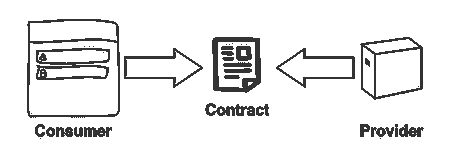
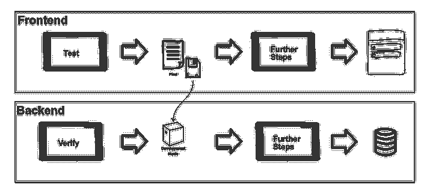

# 如何借助消费者驱动的合同测试来拆分前端和后端的部署

> 原文：<https://www.freecodecamp.org/news/split-frontend-backend-deployment-with-cdcs/>

[消费者驱动的合同测试](https://www.thoughtworks.com/de/radar/techniques/consumer-driven-contract-testing)是提高互联系统可靠性的一个好方法。集成测试变得更加容易，更加独立。它为独立部署打开了大门，并导致更快的迭代和更精细的反馈。不像你的保险，它没有任何细则。这篇文章是关于在交付管道中设置它，在做[连续交付](https://continuousdelivery.com/)的背景下。

我想展示一下*契约测试*如何帮助分割一个小型应用程序的前端和后端的部署。我有一个 React 客户端和一个用 Kotlin 编写的 Spring Boot 后端。

## 什么是合同测试？

我说的不是智能合约。这篇文章里根本没有区块链。很抱歉(尽管智能合同的合同测试听起来像是这个世界急需的会议讨论！).

简而言之，契约测试是消费者和提供者之间交互的规范。在我们的例子中，通信是使用 REST 进行的。消费者定义发送给提供者的动作和将返回的响应。在我们的例子中，前端是消费者，后端是提供者。生成一个*合同*。双方都反对这份合同。

它实际上并不涉及任何特定的技术。有很多不同的框架，但是一些简单的脚本就可以做到。



### 为什么要将它作为交付管道的一部分？

首先，持续运行这些测试可以确保它们一直在工作。然而，最大的好处是我们可以将前端和后端的部署分开。如果双方都在履行合同，很可能他们一起工作是正确的。因此，我们可以考虑避免昂贵的集成测试。不管怎么说，它们往往工作得很糟糕。

## 建立一些合同

需要设置两个方面，消费者和提供者。测试将分别在构建前端和后端的管道中运行。在我们的例子中，我们将使用 [Pact 框架](https://docs.pact.io/)，这是我最熟悉的工具。因此，我倾向于交替使用契约和合同。我们的管道是为 [CircleCI](https://circleci.com/) 编写的，但是它们应该很容易移植到其他 CI 工具。

### 消费者方面

如前所述，消费者主导合同的创建。让客户驱动这听起来可能违反直觉。通常，API 是在使用它们的客户端之前创建的。翻转它是一个很好的习惯。它迫使你真正考虑客户实际会做什么，而不是放弃一个超级通用的 API，它永远不会需要它的大部分特性。你应该试一试！

契约是通过单元测试中指定的交互来定义的。我们指定我们期望发送到后端的内容，然后使用客户端代码来触发请求。为什么？我们可以将期望与实际请求进行比较，如果不匹配，测试就会失败。

让我们看一个例子。我们使用 [Jest](https://jestjs.io/) 来运行测试。我们将从一些初始化代码开始:

```
import path from 'path'
import Pact from 'pact'

const provider = () =>
  Pact({
    port: 8990,
    log: path.resolve(process.cwd(), 'logs', 'pact.log'),
    dir: path.resolve(process.cwd(), 'pacts'),
    spec: 2,
    consumer: 'frontend',
    provider: 'backend'
  })

export default provider 
```

然后我们有了实际测试的代码。测试由两部分组成。首先，我们定义预期的交互。这与用类似于 [axios](https://github.com/ctimmerm/axios-mock-adapter) 的东西模仿 http 库没有太大区别。它指定了我们将发送的请求(URL、标题、正文等等)，以及我们将得到的响应。

```
const interaction: InteractionObject = {
  state: 'i have a list of recipes',
  uponReceiving: 'a request to get recipes',
  withRequest: {
    method: 'GET',
    path: '/rest/recipes',
    headers: {
      Accept: 'application/json',
      'X-Requested-With': 'XMLHttpRequest'
    }
  },
  willRespondWith: {
    status: 200,
    headers: { 'Content-Type': 'application/json; charset=utf-8' },
    body: [
      {
        id: 1,
        name: 'pasta carbonara',
        servings: 4,
        duration: 35
      }
    ]
  }
} 
```

然后我们有测试本身，我们调用实际的客户端代码来触发请求。我喜欢将这些请求封装在服务中，这些服务将原始响应转换成应用程序其余部分将使用的域模型。通过一些断言，我们确保我们从服务交付的数据正是我们所期望的。

```
it('works', async () => {
  const response = await recipeList()

  expect(response.data.length).toBeGreaterThan(0)
  expect(response.data[0]).toEqual({
    id: 1,
    name: 'pasta carbonara',
    servings: 4,
    duration: 35
  })
}) 
```

请注意，即使`recipeList`与`TypeScript`正确输入，在这里也帮不了我们。类型在运行时消失，所以如果方法返回一个无效的`Recipe`，我们不会意识到这一点，除非我们明确地测试它。

最后，我们需要定义一些额外的方法来确保交互得到验证。如果缺少交互，或者它们看起来不像应该的，测试将会失败。之后，剩下的工作就是将协议写入磁盘。

```
beforeAll(() => provider.setup())
afterEach(() => provider.verify())
afterAll(() => provider.finalize()) 
```

最后，契约被生成为一个 JSON 文件，反映了我们在所有测试中定义的所有交互。

#### 灵活匹配

到目前为止，我们的约定是指定它将从后端获得的确切值。从长远来看，这是不可持续的。某些东西天生就很难确定精确的值(例如，日期)。

一个经常被打破的约定会导致挫败感。我们正在经历这整个过程，以使我们的生活更容易，而不是更难。我们将通过使用[匹配器](https://docs.pact.io/getting_started/matching)来避免这种情况。我们可以更加灵活地定义事物的样子，而不必提供确切的值。让我们重写我们以前的身体:

```
willRespondWith: {
  status: 200,
  headers: { 'Content-Type': 'application/json; charset=utf-8' },
  body: Matchers.eachLike({
    id: Matchers.somethingLike(1),
    name: Matchers.somethingLike('pasta carbonara'),
    servings: Matchers.somethingLike(4),
    duration: Matchers.somethingLike(35)
  })
} 
```

你可以说得更具体些。你可以设置列表的预期长度，使用正则表达式和其他一些东西。

#### 将它集成到管道中

pact 测试依赖于一个外部过程，多个测试同时进行会导致不确定的行为。一种解决方案是按顺序运行所有测试:

```
npm test --coverage --runInBand 
```

如果您想要独立运行 pact 测试，我们可以构建自己的任务来分别运行它们:

```
"scripts": {
  "pact": "jest --transform '{\"^.+\\\\.ts$\": \"ts-jest\"}' --testRegex '.test.pact.ts$' --runInBand"
} 
```

这将成为我们的一个额外步骤:

```
jobs:
  check:
    working_directory: ~/app

    docker:
      - image: circleci/node:12.4

    steps:
      - checkout
      - run: npm
      - run: npm run linter:js
      - run: npm test --coverage --runInBand
      - run: npm pact 
```

#### 储存契约

我们的 pact 是一个 json 文件，在本地运行测试之后，我们将直接提交到前端存储库中。我发现这种方式已经足够好了。让管道本身将协议提交给`git`似乎没有必要。
我们马上就要开始延长协议。

### 提供方

在这一点上，我们有一个工作协议，这是由消费者验证。但这只是等式的一半。没有来自提供方的验证，我们什么也没有完成。也许甚至更少，因为我们可能会得到一个错误的安全感！

为此，我们将启动后端作为开发服务器，并针对它运行 pact。有一个`gradle`提供者会处理这件事。我们需要对它进行配置，并提供一种找到契约的方法(它存储在前端存储库中)。您可以从互联网或本地文件中获取该协议，无论哪个更方便。

```
buildscript {
    dependencies {
        classpath 'au.com.dius:pact-jvm-provider-gradle_2.12:3.6.14'
    }
}

apply plugin: 'au.com.dius.pact'

pact {
    serviceProviders {
        api {
            port = 4003

            hasPactWith('frontend') {
                pactSource = url('https://path-to-the-pact/frontend-backend.json')
                stateChangeUrl = url("http://localhost:$port/pact")
            }
        }
    }
} 
```

剩下的工作是启动服务器，并针对它运行 pact，我们用一个小脚本来完成:

```
goal_test-pact() {
  trap "stop_server" EXIT

  goal_build
  start_server

  ./gradlew pactVerify
}

start_server() {
  artifact=app.jar
  port=4003

  if lsof -i -P -n | grep LISTEN | grep :$port > /dev/null ; then
    echo "Port[${port}] is busy. Server won't be able to start"
    exit 1
  fi

  nohup java -Dspring.profiles.active=pact -jar ./build/libs/${artifact} >/dev/null 2>&1 &

  # Wait for server to answer requests
  until curl --output /dev/null --silent --fail http://localhost:$port/actuator/health; do
    printf '.'
    sleep 3
  done
}

stop_server() {
  pkill -f 'java -Dspring.profiles.active=pact -jar'
} 
```

#### 固定装置

如果您在开发模式下运行您的后端，它将必须交付一些数据，以便履行合同。即使我们没有使用精确匹配，我们也必须返回一些东西，否则就不可能验证它。

你可以使用模拟，但是我发现尽可能避免它们会导致更可信的结果。你的应用更接近生产中会发生的事情。那么还有什么其他选择呢？记得当我们定义交互时，我们有一个`state`。这是对供应商的暗示。使用它的一种方式是`stateChangeUrl`。我们可以提供一个特殊的控制器来初始化我们基于`state`的后端:

```
private const val PATH = "/pact"

data class Pact(val state: String)

@RestController
@RequestMapping(PATH, consumes = [MediaType.APPLICATION_JSON_VALUE])
@ConditionalOnExpression("\${pact.enabled:true}")
class PactController(val repository: RecipeRepository) {
    @PostMapping
    fun setup(@RequestBody body: Pact): ResponseEntity<Map<String,String>> {
        when(body.state) {
            "i have a list of recipes" -> initialRecipes()
            else -> doNothing()
        }

        return ResponseEntity.ok(mapOf())
    }
} 
```

请注意，该控制器仅对特定的配置文件有效，不会存在于该配置文件之外。

#### 将它集成到管道中

与提供者一样，我们将检查作为管道的一部分来运行

```
version: 2
jobs:
  build:

    working_directory: ~/app

    docker:
      - image: circleci/openjdk:8-jdk

    steps:

      - checkout
      - run: ./go linter-kt
      - run: ./go test-unit
      - run: ./go test-pact 
```

不过，还是有一点小小的不同。我们的合同由消费者生成。这意味着前端的更改可能会导致无法正确验证的约定，即使后端没有更改任何代码。因此，理想情况下，协议的变化也应该触发后端管道。我还没有找到一种方式在 *CircleCI* 中优雅地表现这一点，不像在 [ConcourseCI](https://concourse-ci.org/) 中那样。

## 合同如何影响前端和后端之间的关系

很高兴我们有了这样的安排。[千万不要碰正在运行的系统](https://en.wiktionary.org/wiki/never_change_a_running_system)，对吧？嗯，我们可能会！毕竟，快速变化是我们投资所有这些工具的原因。你如何引入一个需要扩展 API 的变化？

1.  我们从客户开始。我们想定义客户将会得到什么，但现在还没有。正如我们所了解的，我们通过前端测试来实现，该测试定义了对新路由或新字段的预期。这将创造一个新版本的协议。
2.  注意，在这一点上，后端*没有*履行约定。后端的新部署将会失败。而且，*现有的*后端现在也不能履行协议。你引入的改变必须是向后兼容的。前端也不应该依赖这些变化。
3.  现在是从后端履行新契约的时候了。如果这需要很长时间，您将阻塞您的部署过程，这是不好的。在这种情况下，考虑做较小的增量。无论如何，你必须实现新的功能。pact 测试将验证您的更改实际上是所期望的。
4.  既然后端已经提供了新的功能，您可以自由地将它集成到您的前端。

这个流程在开始时可能会有点尴尬。使用最少量的功能非常重要。您不想阻碍您的部署过程。

## 后续步骤

对于您自己的前端和后端之间的集成，我发现这种设置在实践中已经足够了。然而，随着复杂性的增长，版本控制将变得非常重要。您将希望帮助多个团队更轻松地协作。为此，我们可以使用一个[代理](https://docs.pact.io/pact_broker)。这很难实现，所以你应该问问自己是否真的需要它。不要解决你还没有的问题。

## 结论

总而言之，这是我们达成的设置:



想想你花在编写测试上的所有时间，以检查你的后端是否发送了正确的数据。有了合同，这就方便多了。此外，独立发布前端和后端意味着更快，发布更小的功能。一开始可能会感到害怕，但是你会意识到你实际上更清楚地意识到发生了什么。

一旦您为一个服务采用了这种方法，就没有理由不为所有服务采用这种方法。我真的不怀念运行昂贵的端到端测试套件只是为了验证我的后端工作正常。这是我在示例中为前端[和后端](https://github.com/sirech/cookery2-frontend)[使用的代码。这是一个完整的运行(虽然很小)的应用程序。祝你合同顺利！](https://github.com/sirech/cookery2-backend)