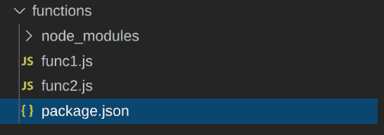
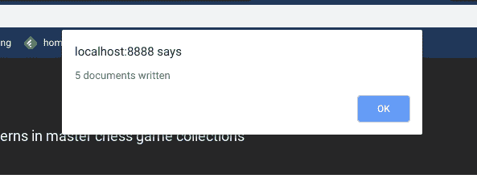
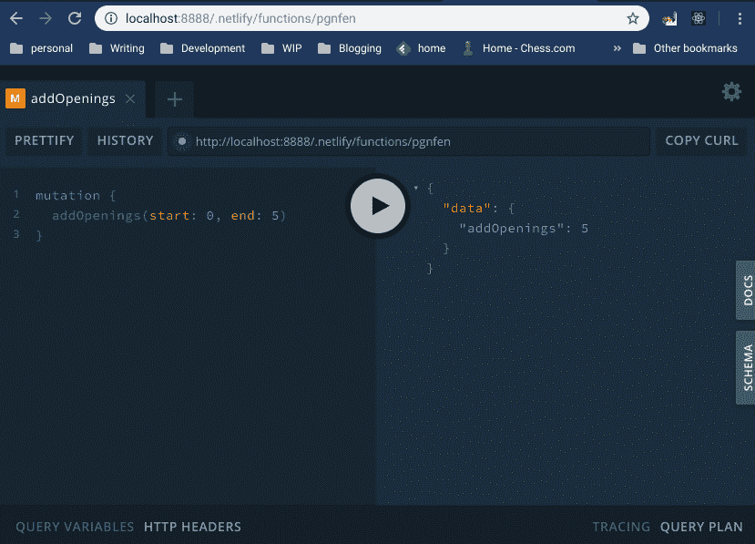

# 我如何让 Netlify 函数、Firebase 和 GraphQL 最终一起工作

> 原文：<https://www.freecodecamp.org/news/netlify-functions-firebase-and-graphql-working-together-at-last/>

在之前的一篇文章中，我承认了试图让一个 T2 AWS Lambda graph QL 服务器连接到 T4 Firebase T5 服务器的失败。不过，我没有马上放弃，不久之后我找到了一个[不同的节点包](https://www.npmjs.com/package/firebase-admin)来实现我以前无法实现的目标。

为什么使用 AWS Lambda 托管 GraphQL 服务器？可伸缩性可能是显而易见的原因，但我这样做是为了学习。

# 我学到了很多

尤其是在部署的时候。我使用 Netlify 函数来管理 AWS Lambda 函数和调用它们的 React 客户端的部署。事情比我最初想象的要复杂。

使用 Netlify 部署项目有几种方法:

## 拉上拉链，然后走人

这是[一个实用程序](https://github.com/netlify/zip-it-and-ship-it)，它的工作方式很像 [webpack](https://webpack.js.org/) :对于每个函数，它都创建一个归档文件，将函数及其依赖项捆绑在一起。像 webpack 一样，它只拉入函数实际需要的依赖项。

按照惯例，Netlify 期望/functions 文件夹。当编写新函数时，它的源代码与它需要作为依赖项的任何 NodeJS 模块处于同一级别。如果您添加一个具有新模块依赖关系的新函数，那么它们将进入 node_modules 文件夹(使用`yarn add`或 npm `install --save`)。

下面显示了两个 lambda 函数以及一个 node_modules 文件夹:



要使用 zip-it-and-ship-it，您需要编写一个简单的 JavaScript 程序，由 package.json 构建脚本调用。

**zipIt.js**

```
const { zipFunctions } = require('@netlify/zip-it-and-ship-it')zipFunctions('functions', 'functions-dist')
```

这可能会被这样调用:

**package.json**

```
"build": "npm-run-all build:*","build:app": "react-scripts build","build:functions": "node ./zipFuncs.js",
```

一旦建成，几个。会生成 zip 文件。这些档案包含函数代码以及 node_modules 文件夹，该文件夹不是原始文件夹，而是仅包含每个函数所需的依赖项:


## netlify-λ

这个部署机制和上面的类似，但是使用 **babel** 和 **webpack** 来执行它的职责。如果您熟悉 webpack，这可能是您的部署选项。

## 持续部署

如果您正在使用一个受支持的存储库(GitHub、GitLab 或 Bitbucket ),那么连续部署选项是可用的。一旦您将更改推送到您的存储库，Netlify 会收到通知并运行您的构建流程，这可能涉及 zip-it-and-ship-it 或 Netlify-lambda…但您也可以选择将非捆绑功能部署到您的存储库，并且 [Netlify 将在幕后使用 zip-it-and-ship-it](https://github.com/netlify/netlify-lambda/issues/142#issuecomment-483880089) 。

## Netlify CLI

Netlify CLI 提供了另一种部署方式，没有太多的麻烦或神秘之处。有两种主要的部署选项:

*   `netlify deploy`将把[本地项目推送到网络服务器。](https://docs.netlify.com/cli/get-started/#manual-deploys)不过，您首先必须在本地调用构建步骤。
*   `netlify dev` [创建本地服务器](https://github.com/netlify/cli/blob/master/docs/netlify-dev.md)，以及 lambda 函数的代理，并启动应用程序。它不**不**需要一个构建步骤。

还有一个脚本可以帮助你创建 lambda 函数:`netlify function:create`。如果使用这种方法，您将得到一个不同于前面所示的文件夹结构:


在这种情况下，每个函数都有自己的文件夹，以及 node_modules 和 package.json 文件(加上其他未显示的文件，如。锁定文件)。类似于。zip 存档 zip-it-and-ship-it 创建的文件。

现在，如果您以这种方式生成 lambdas，连续部署将会中断，因为 **zip-it-and-ship-it** 不会自己处理这个文件夹结构。您可以在构建脚本中加入类似这样的内容来修复持续部署:

```
"build": "npm-run-all build:*",
"build:app": "react-scripts build",
"build:functions": "yarn --cwd functions/func1 install",
"build:functions": "yarn --cwd functions/func2 install",
```

这些构建步骤将安装每个 lambda 所需的依赖项。

# 这个例子

你的家庭作业是建立一个[网络账户](https://www.netlify.com/)和一个[防火墙账户](https://firebase.google.com/)。该应用程序将使用 [Netlify 身份](https://docs.netlify.com/visitor-access/identity/#enable-identity-in-the-ui)登录 Netlify 服务。您还需要获取一个 [Firebase credentials JSON 文件](https://firebase.google.com/docs/admin/setup#add_firebase_to_your_app)，并将其放在您的项目中的某个位置(该示例使用 fake-creds.json，它是 **FAKE** ，因此不起作用)。

## 关于申请

作为一名极客，我正在建立一个象棋开局数据库。我在一个 JSON 文件中有一个 openings book，我将从其中加载数据库。在这个有点做作的例子中，书实际上是用 lambda 函数存储在/functions/pgnfen 文件夹(`netlify function:create pgnfen`)中的，但是加载是由 React 客户端通过一个 GraphQL 突变调用触发的。

## 创建 lambda 函数

我用 [apollo-server-lambda](https://github.com/apollographql/apollo-server/tree/master/packages/apollo-server-lambda) 给 Firestore 数据库添加了一个 GraphQL API 前端。为了与 Firestore 交流，我使用 [firebase-admin](https://www.npmjs.com/package/firebase-admin) 。用`netlify function:create`创建你的函数时，它会问用什么模板；在这种情况下，正确的选择是蓝色的:


此外，我还添加了一些实用函数和支持 GraphQL 模式和解析器。

### λ函数

整个操作的核心在`/functions/pgnfen.js`。它创建服务器，登录 firebase，进行必要的 GraphQL 声明，最后调用处理函数，该函数接收来自客户端的请求，并通过 GraphQL 解析器将它们传递给数据库:

```
/* eslint-disable no-unused-vars */
const apolloLambda = require('apollo-server-lambda');
const admin = require('firebase-admin');
const typeDefs = require('./schema.gql');
const { fetchGames, addOpenings } = require('./resolvers');

const {
  ApolloServer,
} = apolloLambda;

const credential = require('./fake-creds.json');

admin.initializeApp({
  credential: admin.credential.cert(credential),
});

const resolvers = {
  Query: {
    allGames: (root, args, context) => [], //TBD
  },
  Mutation: {
    addOpenings: async (root, args, context) => addOpenings(root, args, { ...context, admin }),
  },
};

const server = new ApolloServer({
  typeDefs,
  resolvers,
});

exports.handler = server.createHandler(
  {
    cors: {
      origin: '*',
      credentials: true,
    },
  },
);
```

### 该模式

该模式定义了 GraphQL API。努夫说。

```
const typeDefs = `

type Mutation {
  addOpenings(start: Int!, end: Int!) : Int! 
}
`

module.exports = typeDefs;
```

### 解析器

这将 GraphQL addOpenings 突变分解为 Firestore 查询(在本例中是批处理的)，然后发送回一个已提交文档的计数(如果成功):

```
const openings = require('./scid.js');

const addOpenings = async (_, { start, end }, { admin }) => {
  const db = admin.firestore();
  const batch = db.batch();
  const fens = db.collection('chess/openings/fen');
  const data = openings.slice(start, end);

  data.forEach((opening) => {
    const id = opening.fen.replace(/\//g, '$');
    const doc = fens.doc(id);
    batch.set(doc, opening);
  });

  await batch.commit();

  return data.length;
};

module.exports = {  addOpenings };
```

### 开幕书

JSON 版本的开本由 SCID(基于 [ECO](https://www.365chess.com/eco.php) 的开本标识符)以及开本名称及其[分](https://en.wikipedia.org/wiki/Forsyth%E2%80%93Edwards_Notation)组成。每一个都成为数据库中的一个文档。

```
/* eslint-disable comma-dangle */
module.exports = [
  {
    SCID: 'A00b',
    desc: '"Barnes Opening"',
    fen: 'rnbqkbnr/pppppppp/8/8/8/5P2/PPPPP1PP/RNBQKBNR b KQkq - 0 1'
  },
  {
    SCID: 'A00b',
    desc: '"Fried fox"',
    fen: 'rnbqkbnr/pppp1ppp/8/4p3/8/5P2/PPPPPKPP/RNBQ1BNR b kq - 1 2'
  },
  {
    SCID: 'A00c',
    desc: '"Kadas Opening"',
    fen: 'rnbqkbnr/pppppppp/8/8/7P/8/PPPPPPP1/RNBQKBNR b KQkq h3 0 1'
  },
  ...
];
```

## 创建客户端

我在 React 应用程序中使用 apollo-client。最简单的方法是 create-react-app，然后加入[apollo-boost]来快速启动和运行一个框架客户机。然后创建一个 React 组件来触发对 lambda 的调用，使用它提供的 GraphQL API。

该组件将提供要加载的打开书籍的开始/结束索引，以及一个提交按钮。


以下是组件代码的精简版本:

```
/* eslint-disable no-alert */
import React, { useState } from 'react';
import fetch from 'node-fetch';
import ApolloClient, { gql } from 'apollo-boost';

const styles = {
//...
};

const client = new ApolloClient({
  uri: '/.netlify/functions/pgnfen',  //the lambda URL
  fetch,
});

export default () => {
  const [start, setStart] = useState(0);
  const [end, setEnd] = useState(5);

  const clickHandler = async () => {
    const mutation = gql`mutation {
      addOpenings(start: ${start}, end: ${end})
    }`;

    // eslint-disable-next-line no-console
    const count = await client.mutate({ mutation })
      .catch((e) => { window.alert(e); });
    // console.dir(count);
    window.alert(`${count.data.addOpenings} documents written`);
  };

  const startEndHandler = (evt) => {
    if (evt.target.name === 'start') {
      setStart(evt.target.value);
    } else {
      setEnd(evt.target.value);
    }
  };

  return (
//...
    <input type="button" onClick={clickHandler} value="Load Scids" />  Row start:&nbsp;&nbsp;
    <input name="start" type="number" step="5" style={styles.numInput} onChange={startEndHandler} value={start} />
Row end:&nbsp;&nbsp;
     <input name="end" type="number" step="5" style={styles.numInput} onChange={startEndHandler} value={end} />
//...
  );
};
```

并且突变响应将显示在窗口警告框中:



## 加分！

因为我使用了 apollo-server-lambda 作为 Netlify 函数的基础，所以我可以通过 URL 直接访问服务端点，它将显示 GraphQL Playground:



在这里，我可以在将查询和变异嵌入我的 React 客户机代码之前对它们进行测试。

**还有**，调用“netlify dev”通过 create-react-app 给了我一个热服务器，所以我可以“实时”看到代码更改的结果。

就是这样！这里有一个到[源](https://github.com/JeffML/firebase-lambda2)的链接。