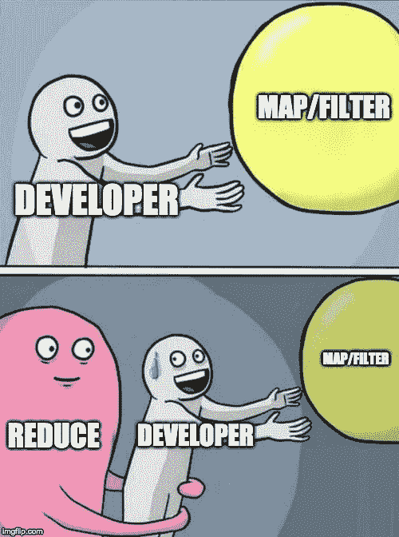

# 在 10 分钟内学会减少

> 原文：<https://www.freecodecamp.org/news/learn-reduce-in-10-minutes/>

希望这能减少困惑。

在我学习和教授 JavaScript 的经验中，`reduce`是最难攻克的概念之一。在这篇文章中，我将尝试解决一个核心问题...

> 什么是`reduce`，为什么这么叫？

## Reduce 有很多名字

根据维基百科的说法，其中一些人是

*   减少
*   折叠
*   积聚
*   总计
*   压缩

都在暗示核心思想。这都是关于**把一个结构分解成一个单一的值**。

> reduce——将列表折叠成任意数据类型的函数。

就像叠盒子一样！用`reduce`你可以把一个数组`[1,2,3,4,5]`加起来变成数字`15`。


### 老式的方法

通常你需要一个循环来将一个列表“折叠”成一个数字。

```
const add = (x, y) => x + y;
const numbers = [1, 2, 3, 4, 5];
let total = 0;

for (let i = 0; i < numbers.length; i++) {
    total = add(total, numbers[i]);
}

console.log(total); // 15 
```

### 酷小孩的方式

但是用`reduce`你可以插入你的`add`函数，循环就为你处理了！

```
const add = (x, y) => x + y;
const numbers = [1, 2, 3, 4, 5];

numbers.reduce(add);
// 15 
```

你实际上是把 1-5 折起来得到 15。


## 三巨头

在深入研究之前，我认为有必要分析一下`reduce`和它著名的同伴——`map`和`filter`。它们大大盖过了`reduce`，让它看起来像是一群人中的怪人。



尽管它们各自都很受欢迎，但是将这三个巨头结合起来，你就可以随心所欲地操纵列表了！


暂时迁就我一下，假装 JavaScript 不能使用循环、递归或数组方法，如`forEach`、`some`、`find`等。剩下的只有三个`map`、`filter`和`reduce`。

然而，我们作为程序员的工作并没有改变。我们的应用程序仍然需要三种类型的功能。

1.  转换列表
2.  过滤列表
3.  将列表转换成其他数据类型(数字、字符串、布尔值、对象等)。

让我们看看我们仅有的工具——`map`、`filter`、`reduce`——如何应对这一挑战。

### ✅数组. map 转换列表

简而言之，将列表转换成其他列表是前端开发。因此`map`涵盖了你清单上的大部分工作。

假设我们的应用程序调用一个 API 来获取用户列表，我们需要在屏幕上显示每个用户的名字。简单地创建一个函数，返回一个用户名。

```
const getUserName = (user) => user.name; 
```

并将其插入到`map`中，对整个用户列表运行。

```
users.map(getUserName)
// ['Marie', 'Ken', 'Sara', 'Geoff', ...] 
```

### ✅数组.过滤评委名单

如果您想要一个删除了某些项目的新列表，比如当用户搜索他们的联系人列表时，该怎么办？简单地创建一个基于其输入返回`true`或`false`的函数(一个谓词)。

```
const isEven = (x) => x % 2 === 0; 
```

并将其插入到`filter`中以应用于整个列表。

```
const numbers = [1, 2, 3, 4, 5];
numbers.filter(isEven);
// [2, 4] 
```

### ✅ Array.reduce 实现了所有这些功能，甚至更多

当`map`和`filter`还不够的时候，你就引入大人物。`reduce`方法可以做`map` / `filter`所做的事情，以及任何涉及数组循环的事情。


例如，你如何计算用户的总年龄？我们用户的年龄是 25、22、29 和 30 岁。

```
const users = [
  { name: 'Marie', age: 25 },
  { name: 'Ken', age: 22 },
  { name: 'Sara', age: 29 },
  { name: 'Geoff', age: 30 },
]; 
```

`map`和`filter`只能返回数组，但是我们需要一个`number`！

```
users.map(?);
users.filter(?);

// Nope! I need a number, not arrays. 
```

如果我们有循环，我们只需遍历`users`并在计数器中记录它们的年龄！如果我告诉你用`reduce`会更容易呢？

```
users.reduce((total, currentUser) => total + currentUser.age, 0);
// 106 
```


## 注销它

我认为最简单的消化方法是每一步都要`console.log`。

```
const users = [
  { name: 'Marie', age: 25 },
  { name: 'Ken', age: 22 },
  { name: 'Sara', age: 29 },
  { name: 'Geoff', age: 30 },
];

const reducer = (total, currentUser) => {
    console.log('current total:', total);
    console.log('currentUser:', currentUser);

    // just for spacing
    console.log('\n');

    return total + currentUser.age;
}

users.reduce(reducer, 0); 
```

下面是 Chrome DevTools 的截图。


## 将它分解

正如您刚才看到的，`Array.reduce`有两个参数。

1.  该减速器
2.  初始值(可选)

减速器是做所有功的函数。当`reduce`遍历你的列表时，它向你的 reducer 提供两个参数。

1.  累加器
2.  当前值

当前值是不言自明的，就像在常规循环中使用`array[i]`一样。然而，累加器是一个听起来很恐怖的计算机科学术语，实际上很简单。

### 累加器是最终的返回值

当你循环浏览`users`时，你是如何记录他们的总年龄的？你需要一些*计数器*变量来保存它。**那是累加器。**这是最终值`reduce`完成后会吐出来。

在循环中的每一步，它都会将最后一个累加器和当前项输入到缩减器中。缩减器返回的内容将成为下一个累加器。当列表完成时，循环结束，并且您有一个减少的值。


### 初始值是可选的

`reduce`的第二个参数是初始值。如果不提供它，`reduce`默认为列表的第一个元素。

如果你对简单的数字求和，这是没问题的。

```
[1, 2, 3].reduce((total, current) => total + current);
// 6 
```

但是如果你使用一个对象或者数组，它就坏了，因为你不应该把这些东西加起来。

```
[{ age: 1 }, { age: 2 }, { age: 3 }]
    .reduce((total, obj) => total + obj.age);

// [object Object]23
// Broken result, use an initial value. 
```

在这种情况下，你应该给出`0`的初始值。

```
[{ age: 1 }, { age: 2 }, { age: 3 }]
    .reduce((total, obj) => total + obj.age, 0);

// 6
// Initial value fixes it.
// 0 + 1 + 2 + 3 = 6 
```

## 让我们重新创建 Reduce

> 我不能创造的东西，我不理解——理查德·费曼

希望到目前为止我已经帮到你了。现在是时候写自己的`reduce`函数来真正锤这个家了。

这个函数有三个参数。

1.  减速器
2.  初始值
3.  要操作的数组

对于本演示，初始值不是可选的。

```
const reduce = (reducer, initialValue, array) => {
    let accumulator = initialValue;

    for (let i = 0; i < array.length; i++) {
        const currentItem = array[i];
        accumulator = reducer(accumulator, currentItem);
    }

    return accumulator;
} 
```

令人惊讶的仅仅 10 行代码，6 个关键步骤。我一个一个去。

1.  定义`reduce`及其三个参数。
2.  使用提供的`initialValue`初始化`accumulator`。这个变量将改变每个循环。
3.  开始遍历数组。
4.  为该周期捕获数组的`currentItem`。
5.  用`accumulator`和`currentItem`调用`reducer`，保存为新的`accumulator`。
6.  当循环结束并且`accumulator`完成改变时，返回它。

## 杂项历史

我想谈论更多关于`reduce`和减速器的历史，但不太确定在哪里适合它。尽管如此，它非常有趣！

### 减速器是古老的


Redux 让 reducers 对 JavaScript 开发者来说很酷，但它并没有发明它们。实际上不清楚是谁创造了这个术语，但我找到了一些参考资料。

### 递归理论(1952 年)

【1952 年的这本书从元数学的角度讨论了`reduce`，称其为`fold`。

### Lisp 程序员手册(1960 年)

1960 年的 [Lisp 程序员手册](https://kyber.io/rawvids/LISP_I_Programmers_Manual_LISP_I_Programmers_Manual.pdf)中有一节是关于`reduce`函数的。

### 函数式编程导论(1988)

【1988 年的这本书谈到使用`reduce`将列表转换成其他值。

底线——这是一个老话题。你对计算机科学研究得越多，你就越会意识到我们大多是在重新包装几十年前发现的概念。

> 你对计算机科学研究得越多，你就越会意识到我们大多是在重新包装几十年前发现的概念。
> 
> — Yazeed Bzadough (@yazeedBee) [October 13, 2019](https://twitter.com/yazeedBee/status/1183510524438437890?ref_src=twsrc%5Etfw)