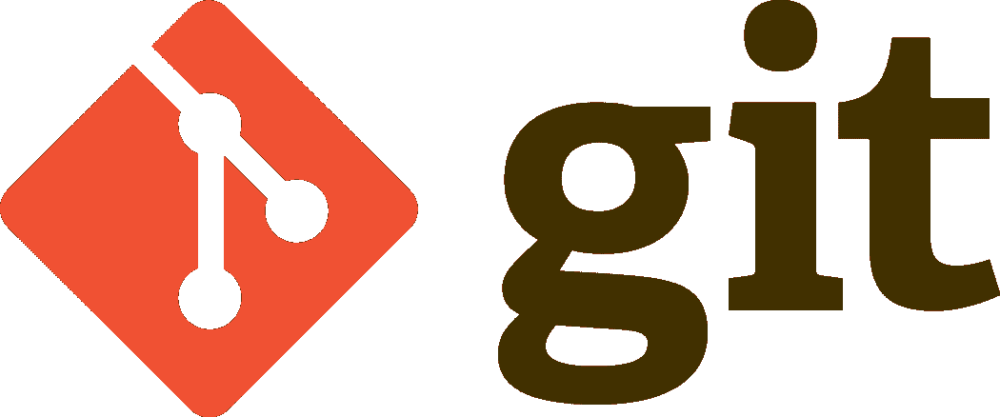

# 如何理解 Git:基本命令、技巧和窍门介绍

> 原文：<https://www.freecodecamp.org/news/understanding-git-basics-commands-tips-tricks/>

最近，我成了一位同事的导师。我的学员已经多次问我关于 Git 的问题。这是给你同事的！附:我应该在我们开始的时候写这篇文章，但我希望它现在能有所帮助！

记住:学习任何东西的最好方法就是自己动手！正如我的导师经常对我说的:乌达拉杰！

## 基础



### 那么为什么 Git 如此重要呢？

让我们首先引用 Git 的维基百科页面上的第一行:

> "***git****(*[](https://en.wikipedia.org/wiki/Help:IPA/English)**)是一个* [*版本控制*](https://en.wikipedia.org/wiki/Version-control) *系统，用于跟踪* [*计算机文件*](https://en.wikipedia.org/wiki/Computer_file) *中的变化，并协调多人对这些文件的工作。*”*

*所以这意味着 Git 最基本也是最重要的功能是允许团队同时向同一个项目添加(和合并)代码。通过将这种能力添加到项目中，它使团队更有效率，并使他们有能力从事更大的项目和更复杂的问题。*

*Git 还做了很多其他的事情:它允许我们恢复更改，创建新的分支来添加新的特性，解决合并冲突，等等。*

### *Git 如何工作*

*Git 将项目存储在**仓库**中。**对项目进行提交**，它们告诉 Git 您对您创建的新代码或更改后的代码感到满意。*

*新代码/变更在分支上提交。大部分工作在其他分支上提交，然后与主分支合并。所有这些都存储在与项目相同的目录中，但是在一个名为**的子文件夹中。git** 。*

*为了与你的同事共享代码，你**将变更推**到存储库中。为了从你的同事那里得到新的代码，你**从库中拉出**变更。*

**

### *那 GitHub，GitLab，Bitbucket 是什么？*

*嗯，我很高兴你问了！这些类型的应用程序被称为存储库管理服务。它们在现代软件开发中起着至关重要的作用。*

*即使 Git 和 GitHub 是大多数公司的首选版本控制解决方案，GitHub 也有一些强大的竞争对手，如 GitLab 和 Bitbucket。但是，如果你知道如何使用 GitHub，那么使用 GitLab 或 Bitbucket 就不会有任何问题。*

**所以，明确一点:Git 是工具，GitHub 是为使用 Git 的项目提供的服务。**

#### *在哪里可以发现有趣的项目，并与其他开发人员建立联系？*

*GitHub、GitLab 和 Bitbucket 都有公共存储库搜索选项，并且能够轻松关注其他用户。*

*你现在明白为什么了解 Git 和 Github (GitLab/Bitbucket)很重要了吧？在讨论命令之前，唯一要做的是告诉您一些在使用 Git 时要遵循的简单规则:*

*   *规则 1: 为每个新项目创建一个 Git 存储库*
*   *规则 2: 为每个新特性创建一个新的分支*

## *命令*

*要开始使用 Git，您的计算机上必须有它。如果你还没有，你可以点击[这里](https://git-scm.com/)并按照说明进行操作。*

### *初始化一个新的 Git 存储库:Git init*

*您编写的所有代码都会在存储库中被跟踪。要初始化 git 存储库，请在项目文件夹中使用该命令。这将创建一个. git 文件夹。*

```
*`git init`*
```

### *去把它给我*

*此命令将一个或所有已更改的文件添加到临时区域。*

*要仅将特定文件添加到登台，请执行以下操作:*

```
*`git add filename.py`*
```

*要暂存新的、修改的或删除的文件:*

```
*`git add -A`*
```

*要暂存新的和修改过的文件:*

```
*`git add .`*
```

*要转移修改和删除的文件:*

```
*`git add -u`*
```

### *去吧，Committee*

*该命令将文件记录在版本历史中。m 表示提交消息跟在后面。这条消息是自定义的，您应该使用它让您的同事或您未来的自己知道该提交中添加了什么。*

```
*`git commit -m "your text"`*
```

### *Git status*

*该命令将以绿色或红色列出文件。绿色文件已添加到阶段，但尚未提交。标记为红色的文件是尚未添加到舞台的文件。*

```
*`git status`*
```

## *使用分支*

### *Git 分支 branch_name*

*这将创建一个新的分支:*

```
*`git branch branch_name`*
```

### *Git 签出分支机构名称*

*要从一个分支切换到另一个分支:*

```
*`git checkout branch_name`*
```

#### *Git checkout -b branch_name*

*要创建新分支并自动切换到该分支:*

```
*`git checkout -b branch_name`*
```

*这是以下内容的简称:*

```
*`git branch branch_name
git checkout branch_name`*
```

### *Git 分支*

*要列出所有分支并查看您当前所在的分支:*

```
*`git branch`*
```

### *Git log*

*该命令将列出当前分支的版本历史:*

```
*`git log`*
```

* * *

## *推拉式*

### *Git push*

*该命令将提交的更改发送到远程存储库:*

```
*`git push`*
```

### *Git pull*

*要将更改从远程服务器提取到您的本地计算机:*

```
*`git pull`*
```

*要获得更多的命令和对所列命令的详细解释，我建议您查看官方的 [Git 文档](https://git-scm.com/docs/)。*

## *提示和技巧*

### *扔掉所有未提交的更改*

*正如它所说，这个命令将丢弃所有未提交的更改:*

```
*`git reset --hard`*
```

### *从 git 中移除文件，但不从计算机中移除*

*有时，当使用“git add”命令时，您可能会添加不想添加的文件。*

*如果在“git 添加”过程中不小心，您可能会添加不想提交的文件。您应该删除该文件的暂存版本，然后将该文件添加到。gitignore 避免第二次犯同样的错误:*

```
*`git reset file_name
echo filename >> .gitignore`*
```

### *编辑提交消息*

*修复提交消息非常容易:*

```
*`git commit --amend -m "New message"`*
```

*感谢您的阅读！在我的 freeCodeCamp 个人资料上查看更多类似的文章:[https://www.freecodecamp.org/news/author/goran/](https://www.freecodecamp.org/news/author/goran/)和我在 GitHub 页面上创建的其他有趣的东西:[https://github.com/GoranAviani](https://github.com/GoranAviani)*