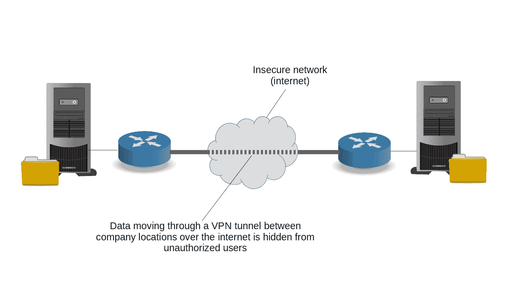

# 如何使用 OpenVPN 保护您的网络连接

> 原文：<https://www.freecodecamp.org/news/securing-your-network-connections-using-openvpn/>

他们告诉我们，我们生活在一个超移动的世界。我不知道:我很少离开我的家庭办公室。但是当然，我只能享受家庭办公室的舒适，因为我可能需要的所有服务器资源都可以远程获得。

显然我不是一个人。几乎每个工作涉及 IT 的人都会不时地从远程位置访问他们的专业工具。鉴于您访问这些远程位置所通过的公共网络本质上是不安全的，您将需要小心控制这些连接。

网站加密是为了确保您的远程客户端使用的数据能够可靠地传输，并且不会被潜伏在连接网络上的任何人看到。与此形成鲜明对比的是，VPN 侧重于确保远程客户端使用的数据能够可靠地传输，并且不会被潜伏在连接网络上的任何人看到。你看出区别了吗？我也不知道。

事实上，有各种各样的技术致力于保护网络通信，深度防御的原则告诉我们，你不应该只依赖一种技术。在这里，您将了解如何为您的远程活动添加新的保护层。具体来说，使用加密来构建虚拟专用网络(VPN)隧道，以允许安全和不可见的远程连接。

## 构建 OpenVPN 隧道

我的[Linux in Action book](https://www.manning.com/books/linux-in-action?a_aid=bootstrap-it&a_bid=4ca15fc9)——本文摘自该书——谈了很多关于加密的内容。SSH 和 SCP 可以保护通过远程连接传输的数据(第 3 章)，文件加密可以保护静态数据(第 8 章)，TLS/SSL 证书可以保护在网站和客户端浏览器之间传输的数据(第 9 章)。但是有时您的需求要求保护更广泛的连接，因为有时您有不同种类的工作要做。

F'rinstance？您团队中的一些成员需要在路上使用公共 WiFi 热点工作。假设随机的 WiFi 接入点是安全的，这肯定是不明智的，但您的员工确实需要一种连接公司资源的方法。虚拟专用网拯救世界。

正确设计的 VPN 隧道可以在远程客户端和服务器之间提供直接连接，在不安全的网络中传输数据时隐藏数据。但那又怎样？您已经看到了许多使用加密实现这一功能的工具。VPN 的真正价值在于，一旦你打开了隧道，就有可能连接远程网络，就好像它们都在本地一样。在某种程度上，你在避开那个危险的咖啡店热点。

使用这样一个扩展的网络，管理员可以在他们的服务器上完成他们的工作，无论他们可能碰巧在哪里。但更重要的是，正如您在图中所看到的，一个资源分布在多个分支机构的公司可以让所有需要它们的团队都可以看到和访问它们……无论他们在哪里。



Tunnel connecting remote private connections through a public network

仅仅是隧道的存在并不能保证安全。但是许多加密标准中的一个可以被整合到设计中，使事情变得更好。使用开源 OpenVPN 包构建的隧道使用了您已经在其他地方看到的相同的 TLS/SSL 加密。OpenVPN 不是隧道传输的唯一选择，但它是最著名的选择之一，人们普遍认为它比使用 IPsec 加密的第二层隧道协议更快，也更安全。

为了让您的团队能够在旅途中或多个校园之间安全地相互连接，您将构建一个 OpenVPN 服务器，以允许共享应用程序和访问服务器的本地网络环境。要使其工作，启动两个虚拟机或容器就足够了。一个扮演服务器/主机的角色，另一个扮演客户端的角色。

建立一个 VPN 需要很多步骤，所以花一些时间来思考一下它是如何工作的大概是值得的。

## 配置 OpenVPN 服务器

在开始之前，这里有一个有用的提示。如果您打算自己完成这个过程——我强烈建议您这样做——您可能会发现自己在桌面上打开了多个终端窗口，每个窗口都登录到不同的机器。请相信我:在某些时候，您会在错误的窗口中输入命令，从而完全搞乱您的环境。

您可以使用 hostname 命令将命令行上显示的计算机名称更改为可以直观地提醒您所处位置的名称。完成后，您需要退出服务器并再次登录以使新设置生效。

```
ubuntu@ubuntu:~# hostname OpenVPN-Server
ubuntu@ubuntu:~$ exit 
<Host Workstation>$ ssh ubuntu@10.0.3.134
ubuntu@OpenVPN-Server:~# 
```

按照这种方法为您正在使用的每台机器分配适当的名称，应该有助于您跟踪您的位置。

## 为 OpenVPN 准备您的服务器

在您的服务器上安装 openvpn 需要两个包:OpenVPN 和管理加密密钥生成过程的 easy-rsa。如有必要，CentOS 用户应该首先按照第 2 章中的方法安装 epel-release 存储库。为了提供一种简单的方法来测试对服务器应用程序的访问，您还可以安装 Apache web server(Apache 2 for Ubuntu and httpd on CentOS)。

当你设置你的服务器时，你最好做正确的事情，激活一个防火墙来阻止除了 22 (SSH)和 1194(默认的 OpenVPN 端口)之外的所有端口。这个例子说明了在 Ubuntu 的 ufw 上的工作方式，但是我相信你还记得第九章 CentOS 的 firewalld。

```
ufw enable
ufw allow 22
ufw allow 1194
```

要允许服务器上网络接口之间的内部路由，您需要在/etc/sysctl.conf 文件中取消对单行(net.ipv4.ip_forward=1)的注释。这将允许远程客户端在连接后根据需要进行重定向。要加载新设置，请运行 sysctl -p。

```
nano /etc/sysctl.conf
sysctl -p
```

服务器环境现在已经设置好了，但是在您准备好打开开关之前还有一段路要走。

## 生成加密密钥

当你安装 OpenVPN 时，会自动创建一个/etc/openvpn/目录，但是现在还没有全部完成。然而，openvpn 和 easy-rsa 包都附带了样本模板文件，您可以将其用作配置的基础。要启动认证过程，请将 easy-rsa 模板目录从/usr/share/复制到/etc/openvpn/中，然后切换到新的 easy-rsa/目录。

```
cp -r /usr/share/easy-rsa/ /etc/openvpn
cd /etc/openvpn/easy-rsa
```

您将使用的第一个文件简单地称为 vars，它包含 easy-rsa 在生成其密钥时将使用的环境变量。您将需要编辑该文件，用您自己的值替换已经存在的示例默认值。下面是我的文件的样子:

```
export KEY_COUNTRY=”CA”
export KEY_PROVINCE=”ON”
export KEY_CITY=”Toronto”
export KEY_ORG=”Bootstrap IT”
export KEY_EMAIL=”info@bootstrap-it.com”
export KEY_OU=”IT”
```

Key excerpts from the /etc/openvpn/easy-rsa/vars file

运行 vars 文件将把它的值传递给 shell 环境，在那里它们将被合并到新键的内容中。完成后，该脚本将鼓励您运行 clean-all 脚本来删除/etc/openvpn/easy-rsa/keys/目录中的任何现有内容。

```
cd /etc/openvpn/easy-rsa/
. ./vars 
NOTE: If you run ./clean-all, I will be doing a rm -rf on /etc/openvpn/easy-rsa/keys
```

很自然，您的下一步将是运行 clean-all 脚本…然后是 build-ca，它将使用 pkitool 脚本来创建您的根证书。您将被要求确认由 var 提供的识别设置。

```
./clean-all
./build-ca
Generating a 2048 bit RSA private key
```

接下来，build-key-server 脚本将询问您相同的确认问题来生成密钥对，因为它使用相同的 pkitool 脚本和新的根证书。这些键将根据您传递的参数来命名，除非您在这台机器上运行多个 VPN，否则通常是 server，如本例所示。

```
./build-key-server server
[…]
Certificate is to be certified until Aug 15 23:52:34 2027 GMT (3650 days)
Sign the certificate? [y/n]:y
1 out of 1 certificate requests certified, commit? [y/n]y
Write out database with 1 new entries
Data Base Updated
```

OpenVPN 将使用 Diffie-Hellman 算法(通过运行 build-dh)生成的参数来协商新连接的身份验证。这里将要创建的文件不需要保密，但必须是使用 build-dh 脚本针对当前活动的 RSA 密钥生成的。如果您将来创建新的 RSA 密钥，您还需要更新 Diffie-Hellman 文件。

```
build-dh
```

您的服务器端密钥现在将被写入/etc/openvpn/easy-rsa/keys/目录，但是 openvpn 不知道这一点。默认情况下，OpenVPN 会在/etc/openvpn/中查找它们，所以复制它们。

```
cp /etc/openvpn/easy-rsa/keys/server* /etc/openvpn
cp /etc/openvpn/easy-rsa/keys/dh2048.pem /etc/openvpn
cp /etc/openvpn/easy-rsa/keys/ca.crt /etc/openvpn
```

## 准备客户端加密密钥

正如您已经看到的，TLS 加密使用匹配的密钥对，一个安装在服务器上，另一个安装在远程客户端上。这意味着您将需要客户端密钥，而我们的老朋友 pkitool 正好可以做一些。这个示例仍然在/etc/openvpn/easy-rsa/目录中运行，它将 client 作为参数传递，以生成名为 client.crt 和 client.key 的文件。

```
./pkitool client
```

这两个客户机文件，以及仍然在 keys/目录中的原始 ca.crt 文件，现在必须安全地传输到您的客户机。由于他们的所有权和权限，这可能有点复杂。最简单的方法是在 PC 桌面上运行的终端中手动复制源文件的内容(只复制这些内容)(突出显示文本，右键单击文本，然后从菜单中选择复制)，然后将其粘贴到在登录到客户端的第二个终端中创建的同名新文件中。

但是任何人都可以剪切和粘贴。相反，要像管理员一样思考——特别是因为你并不总是能够访问可以剪切和粘贴的 GUI。相反，将文件复制到用户的主目录(以便远程 scp 操作可以访问它们),然后使用 chown 将文件的所有权从超级用户更改为普通的非超级用户，以便远程 scp 操作可以工作。确保你的文件现在都已经整理好了，并且很舒适…稍后你会把它们移到客户那里。

```
cp /etc/openvpn/easy-rsa/keys/client.key /home/ubuntu/
cp /etc/openvpn/easy-rsa/keys/ca.crt /home/ubuntu/
cp /etc/openvpn/easy-rsa/keys/client.crt /home/ubuntu/
chown ubuntu:ubuntu /home/ubuntu/client.key
chown ubuntu:ubuntu /home/ubuntu/client.crt
chown ubuntu:ubuntu /home/ubuntu/ca.crt
```

准备好全套加密密钥后，您需要告诉您的服务器您想要如何构建 VPN。这是使用 server.conf 文件完成的。

## 配置 server.conf 文件

您怎么知道 server.conf 文件应该是什么样子的呢？嗯，还记得您从/usr/share/复制的 easy-rsa 目录模板吗？嗯，有更多的好东西从那里来。OpenVPN 安装留下了一个压缩的模板配置文件，您可以将它复制到/etc/openvpn/中。

我将利用模板被压缩的事实向您介绍一个有用的工具:zcat。您已经知道如何用 cat 将文件的文本内容打印到屏幕上，但是如果文件是用 gzip 压缩的呢？当然，您总是可以解压缩文件，然后 cat 会很乐意打印它，但是这需要一两步。相反，正如您可能已经猜到的那样，您可以使用 zcat 将解压缩后的文本一次性加载到内存中。在我们的例子中，不是将它打印到屏幕上，而是将文本重定向到一个名为 server.conf 的新文件中。

```
zcat \
 /usr/share/doc/openvpn/examples/sample-config-files/server.conf.gz
 > /etc/openvpn/server.conf
cd /etc/openvpn
```

抛开文件附带的大量有用的文档，下面是完成编辑后的样子。注意，分号(；)告诉 OpenVPN _not_ 读取并执行后面的行。

```
port 1194
# TCP or UDP server?
proto tcp
;proto udp
;dev tap
dev tun
ca ca.crt
cert server.crt
key server.key # This file should be kept secret
dh dh2048.pem
server 10.8.0.0 255.255.255.0
ifconfig-pool-persist ipp.txt
push “route 10.0.3.0 255.255.255.0”
keepalive 10 120
comp-lzo
port-share localhost 80 
user nobody 
group nogroup
persist-key
persist-tun
status openvpn-status.log
log openvpn.log 
;log-append openvpn.log
verb 3 
```

The active settings from a /etc/openvpn/server.conf file

让我们一次解决其中的一些问题。

*   默认情况下，OpenVPN 通过端口 1194 工作。你可以改变这一点——也许是为了进一步模糊你的活动，或者避免与其他活动隧道的冲突。但是，因为它要求客户端之间的协调最少，所以 1194 通常是您的最佳选择。
*   OpenVPN 可以使用传输控制协议(TCP)或用户数据报协议(UDP)进行数据传输。TCP 可能会慢一点，但它更可靠，更容易与运行在隧道两端的应用程序相处。
*   当您想要创建一个更简单、更高效的 IP 隧道来传输数据内容而不是其他内容时，您可以指定 dev tun。另一方面，如果您需要通过创建一个以太网桥来连接多个网络接口(以及它们所代表的网络),那么您必须选择 dev tap。如果你不知道这是什么意思，就去找 tun。
*   接下来的四行向 OpenVPN 传递您之前创建的三个服务器认证文件和 dh2048 参数文件的名称。
*   服务器线路设置子网范围和网络掩码，当客户端登录时，将使用这些子网范围和网络掩码为客户端分配 IP 地址。
*   可选的推送“路由 10.0.3.0 255.255.255.0”设置将允许远程客户端访问服务器“后面”的私有子网。要做到这一点，还需要对服务器本身进行网络配置，以确保私有子网知道 OpenVPN 子网(10.8.0.0)。
*   端口共享 localhost 80 允许从端口 1194 进入的客户端流量被重新路由到侦听端口 80 的本地 web 服务器。这在我们的例子中很有用，因为我们将使用一个 web 服务器来测试我们的 VPN。这仅在 proto 设置为 tcp 时有效。
*   应该通过删除分号来启用用户 nobody 和组 nogroup 行。强制远程客户端以 nobody 和 nogroup 的身份工作可以确保它们在服务器上的会话没有特权。
*   log 将当前日志条目设置为每次 OpenVPN 启动时覆盖旧条目，而 log-append 将新条目追加到现有日志文件中。openvpn.log 本身将被写入/etc/openvpn/目录。

此外，将客户端到客户端添加到配置文件中也是非常常见的，这样除了 OpenVPN 服务器之外，多个客户端将能够看到彼此。

一旦您对自己的配置感到满意，就可以启动 OpenVPN 服务器了。

```
systemctl start openvpn
```

运行 ip addr 来列出您的服务器的网络接口，现在应该包括对名为 tun0 的新接口的引用。这将由 OpenVPN 创建，供传入客户端使用。

```
ip addr
[…]
4: tun0: <POINTOPOINT,MULTICAST,NOARP,UP,LOWER_UP> mtu 1500 qdisc […]
 link/none 
 inet 10.8.0.1 peer 10.8.0.2/32 scope global tun0
 valid_lft forever preferred_lft forever
```

您可能需要重新启动服务器，然后一切才能正常运行。下一站:客户端计算机。

## 配置 OpenVPN 客户端

传统上，隧道至少有两端(否则我们更喜欢称之为洞穴)。在服务器上正确配置 OpenVPN 可以引导流量在该端进出隧道。但是你也需要一些运行在客户端的软件。

> 在这一节中，我将重点介绍如何手动配置一台 Linux 计算机作为 OpenVPN 客户端。但这并不是您想要使用服务的唯一方式。OpenVPN 本身维护可以在 Windows 或 Mac 台式机/笔记本电脑，或者 Android 和 iOS 智能手机和平板电脑上安装和使用的客户端应用程序。详情见[https://openvpn.net](https://openvpn.net/)网站。

OpenVPN 包需要安装在客户机上，就像它安装在服务器上一样——尽管这里不需要 easy-rsa，因为您将使用的密钥已经存在。您需要将 client.conf 模板文件复制到安装刚刚创建的/etc/openvpn/目录中。这一次，由于某种原因，文件不会被压缩，所以一个普通的 cp 就可以很好地完成这项工作。

```
apt install openvpn
cp /usr/share/doc/openvpn/examples/sample-config-files/client.conf \
 /etc/openvpn/
```

client.conf 文件中的大多数设置非常明显:它们需要与服务器使用的值相匹配。正如您在下面的示例文件中看到的，一个独特的地址是 remote 192.168.1.23 1194，它将客户端指向服务器的 IP 地址。同样，确保您使用您的服务器的实际地址。您还应该强制您的客户端验证服务器证书的真实性，以防止可能的中间人攻击。一种方法是添加 remote-cert-tls 服务器行。

```
client 
;dev tap
dev tun
proto tcp
remote 192.168.1.23 1194 
resolv-retry infinite
nobind
user nobody
group nogroup
persist-key
persist-tun
ca ca.crt
cert client.crt
key client.key
comp-lzo
verb 3
remote-cert-tls server 
```

The active settings in a VPN client’s /etc/openvpn/client.conf file

现在，您可以移动到/etc/openvpn/目录，并从服务器获取这些认证密钥。显然，您将使用服务器的实际 IP 地址或域名来代替示例中的地址或域名。

```
cd /etc/openvpn
scp ubuntu@192.168.1.23:/home/ubuntu/ca.crt . 
scp ubuntu@192.168.1.23:/home/ubuntu/client.crt .
scp ubuntu@192.168.1.23:/home/ubuntu/client.key .
```

在客户机上启动 OpenVPN 之前，不会有什么令人兴奋的事情发生。因为您需要传递几个参数，所以您将从命令行触发。— tls-client 告诉 OpenVPN，当— config 指向您的配置文件时，您将充当客户端并通过 tls 加密进行连接。

```
openvpn — tls-client — config /etc/openvpn/client.conf
```

仔细阅读命令输出，确保连接正确。如果第一次出现问题，可能是由于服务器和客户机配置文件之间的设置不匹配，或者可能是网络连接/防火墙问题。以下是一些故障排除步骤:

*   仔细阅读客户机上 OpenVPN 操作的输出——它通常会包含有价值的提示，告诉你它不能做什么以及为什么不能做。
*   检查服务器上/etc/openvpn/目录下的 openvpn.log 和 openvpn-status.log 文件中是否有与错误相关的消息。
*   在服务器和客户端的系统日志中检查 OpenVPN 相关的和及时的消息(journalctl -ce 将打印出满屏的最新条目)。
*   确认你在服务器和客户端之间有一个活动的网络连接(详见第 14 章)。

*本文摘自我的* [*曼宁《Linux 在行动》一书*](https://www.manning.com/books/linux-in-action?a_aid=bootstrap-it&a_bid=4ca15fc9) *。还有更多有趣的东西* [*这来自*](https://bootstrap-it.com/index.php/books/) *，*包括一个叫做 [Linux in Motion](https://www.manning.com/livevideo/linux-in-motion?a_aid=bootstrap-it&a_bid=0c56986f&chan=motion1) 的混合课程，它由两个多小时的视频和大约 40%的 Linux in Action 文本组成。*谁知道呢……你可能也会喜欢我的* [*在一个月的午餐中学习亚马逊网络服务*](https://www.manning.com/books/learn-amazon-web-services-in-a-month-of-lunches?a_aid=bootstrap-it&amp;a_bid=1c1b5e27) *。*