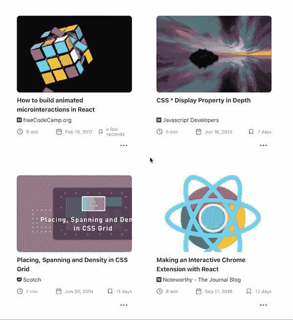
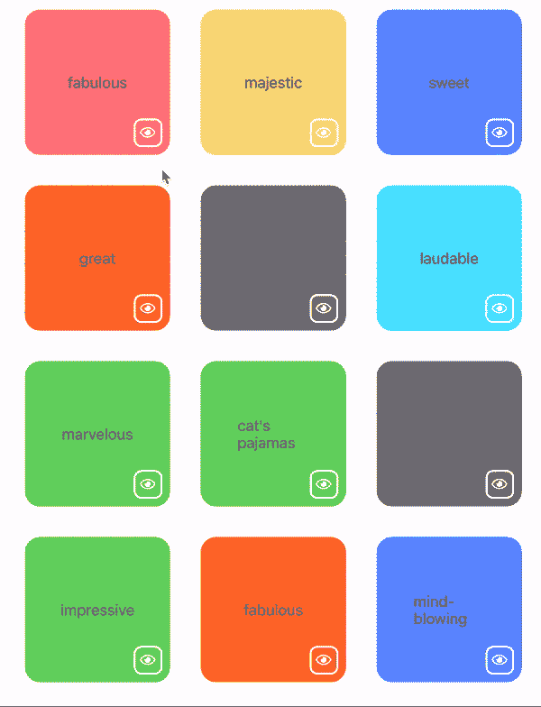
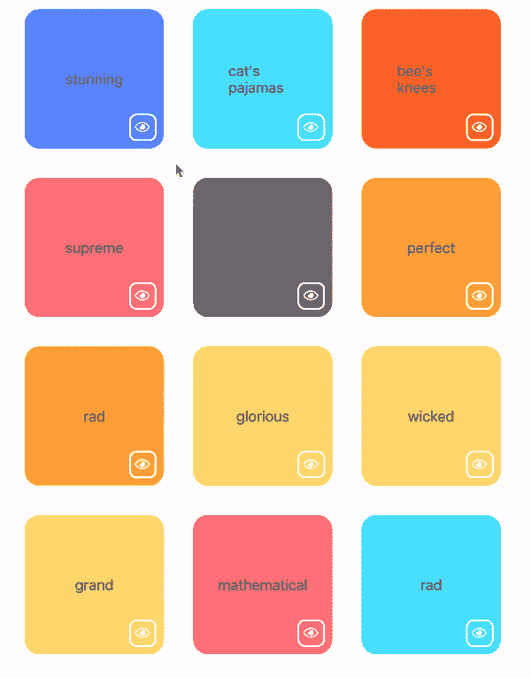
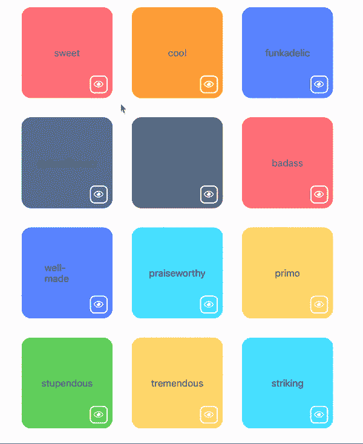
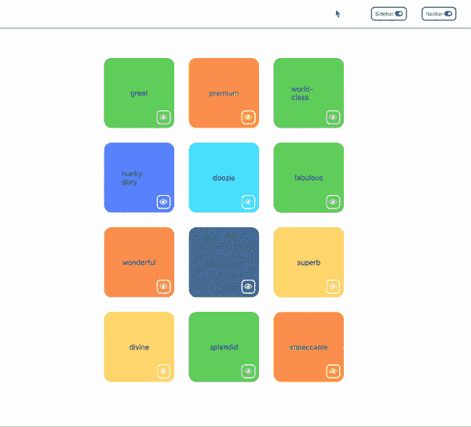

# 如何使用 React 钩子构建一个可重用的动画组件

> 原文：<https://www.freecodecamp.org/news/animating-visibility-with-css-an-example-of-react-hooks/>

动画让用户开心。从大量的文章来看，你可能会认为 React Hooks 让开发人员很开心。但对我来说，疲劳开始渗入我对钩子的看法。

但是机缘巧合救了我。我发现了一个与 React 钩子很匹配的例子，而不仅仅是“新方法”正如您可能已经从本文的标题中猜到的，这个例子是一个动画。

我当时正在开发一个 React 应用程序，在一个网格中使用卡片。当一个项目被删除，我想动画它的退出，就像这样。



my goal

不幸的是，要做到这一点是有细微差别的。我的解决方案让我很好地使用了 React 钩子。

## 我们要做什么？

*   从基线示例应用程序开始
*   递增动画元素的消失，突出一些挑战
*   一旦我们获得了想要的动画，我们将重构一个可重用的动画组件
*   我们将使用这个组件来制作侧边栏和导航栏的动画
*   还有…(需要阅读/跳到最后)

对于没有耐心的人来说，这里是这个项目中代码的 GitHub repo。每一步都有标签。(请参阅自述文件，了解每个标签的链接和说明。)

## 基线

我已经创建了一个简单的应用程序，使用[*create-react-app*](https://facebook.github.io/create-react-app/)*。它有一个由简单卡片组成的网格。您可以隐藏单张卡片。*



no animation — items disappear to fast

这种方法的代码很简单，结果也没什么意思。当用户点击*眼睛*图标按钮时，我们改变该项目的`display`属性。

```
function Box({ word }) {
  const color = colors[Math.floor(Math.random() * 9)];
  const [visible, setVisible] = useState(true);
  function hideMe() {
    setVisible(false);
  }
  let style = { borderColor: color, backgroundColor: color };
  if (!visible) style.display = "none";
  return (
    <div className="box" style={style}>
      {" "}
      <div className="center">{word}</div>{" "}
      <button className="button bottom-corner" onClick={hideMe}>
        {" "}
        <i className="center far fa-eye fa-lg" />{" "}
      </button>{" "}
    </div>
  );
}
```

(是的，我在上面使用了钩子，但这不是钩子的有趣用法。)

## 添加动画

我没有建立自己的动画库，而是寻找了一个类似于 [*animate.css*](https://daneden.github.io/animate.css/) *的动画库。*[*react-animated-CSS*](https://github.com/digital-flowers/react-animated-css)*是一个很好的库，它提供了对 *animate.css.* 的包装*

*`npm install --save react-animated-css`*

*将 *animate.css* 添加到`index.html`*

```
*`<link rel="stylesheet" href="https://cdnjs.cloudflare.com/ajax/libs/animate.css/3.7.2/animate.css" />`*
```

*在上面的`Box`组件中，我们将其渲染改为*

```
*`return (
  <Animated animationIn="zoomIn" animationOut="zoomOut" isVisible={visible}>
    <div className="box" style={style}>
      <div className="center">{word}</div>
      <button className="button bottom-corner" onClick={hideMe}>
        <i className="center far fa-eye fa-lg" />
      </button>
    </div>
  </Animated>
);`*
```

### *不完全是我们想要的*

*但是 *animate.css* 动画`opacity`等 css 属性；您不能在`display`属性上进行 CSS 转换。因此，一个不可见的对象仍然存在，它占据了文档流中的空间。*

**

*如果你稍微谷歌一下，你会发现一些建议在动画结束时使用定时器来设置`display: none`的解决方案。*

*所以我们可以补充说，*

```
*`function Box({ word }) {
  const color = colors[Math.floor(Math.random() * 9)];
  const [visible, setVisible] = useState(true);
  const [fading, setFading] = useState(false);

  function hideMe() {
    setFading(true);
    setTimeout(() => setVisible(false), 650);
  }

  let style = { borderColor: color, backgroundColor: color };

  return (
    <Animated
      animationIn="zoomIn"
      animationOut="zoomOut"
      isVisible={!fading}
      style={visible ? null : { display: "none" }}
    >
      <div className="box" style={style}>
        <div className="center">{word}</div>
        <button className="button bottom-corner" onClick={hideMe}>
          <i className="center far fa-eye fa-lg" />
        </button>
      </div>
    </Animated>
  );
}`*
```

*(注意:默认动画时长为 1000 毫秒。我使用 650 毫秒作为超时时间，以减少设置`display`属性之前的停顿。这是一个偏好问题。)*

*那会给我们想要的效果。*

*

Yay!* 

## *创建可重用组件*

*我们可以就此打住，但有两个问题(对我来说):*

1.  *我不想复制/粘贴`Animated`块、样式和功能来重现这种效果*
2.  *`Box`组件混合了不同种类的逻辑，即违反了 [*关注点分离*](https://en.wikipedia.org/wiki/Separation_of_concerns) *。*具体来说，`Box`的基本功能是渲染一张卡片及其内容。但是动画细节是混在一起的。*

### *类别组件*

*我们可以创建一个传统的 React 类组件来管理动画的状态:切换可见性并为`display` CSS 属性设置超时。*

```
*`class AnimatedVisibility extends Component {
  constructor(props) {
    super(props);
    this.state = { noDisplay: false, visible: this.props.visible };
  }

  componentWillReceiveProps(nextProps, nextContext) {
    if (!nextProps.visible) {
      this.setState({ visible: false });
      setTimeout(() => this.setState({ noDisplay: true }), 650);
    }
  }

  render() {
    return (
      <Animated
        animationIn="zoomIn"
        animationOut="zoomOut"
        isVisible={this.state.visible}
        style={this.state.noDisplay ? { display: "none" } : null}
      >
        {this.props.children}
      </Animated>
    );
  }
}`*
```

*然后使用它*

```
*`function Box({ word }) {
  const color = colors[Math.floor(Math.random() * 9)];
  const [visible, setVisible] = useState(true);

  function hideMe() {
    setVisible(false);
  }

  let style = { borderColor: color, backgroundColor: color };

  return (
    <AnimatedVisibility visible={visible}>
      <div className="box" style={style}>
        <div className="center">{word}</div>
        <button className="button bottom-corner" onClick={hideMe}>
          <i className="center far fa-eye fa-lg" />
        </button>
      </div>
    </AnimatedVisibility>
  );
}`*
```

*这确实创建了一个可重用的组件，但是有点复杂。我们可以做得更好。*

## *反应钩子和使用效果*

*[React 钩子](https://reactjs.org/docs/hooks-intro.html)是 React 16.8 中的新特性。它们为 React 组件中的生命周期和状态管理提供了一种更简单的方法。*

*[*使用效果*](https://reactjs.org/docs/hooks-effect.html) 钩子为我们使用`componentWillReceiveProps`提供了一个优雅的替代品。代码更简单，我们可以再次使用一个功能组件。*

```
*`function AnimatedVisibility({ visible, children }) {
  const [noDisplay, setNoDisplay] = useState(!visible);
  useEffect(() => {
    if (!visible) setTimeout(() => setNoDisplay(true), 650);
    else setNoDisplay(false);
  }, [visible]);

  const style = noDisplay ? { display: "none" } : null;
  return (
    <Animated
      animationIn="zoomIn"
      animationOut="zoomOut"
      isVisible={visible}
      style={style}
    >
      {children}
    </Animated>
  );
}`*
```

*与*使用效果*挂钩有一些微妙之处。主要是为了副作用:改变状态，调用异步函数等。在我们的例子中，它基于`visible.`的先前值设置内部`noDisplay`布尔值*

*通过将`visible`添加到`useEffect`的依赖数组中，我们的`useEffect`钩子将只在`visible`的值改变时被调用。*

*我认为 *useEffect* 是比类组件杂乱更好的解决方案。？*

## *重用组件:侧栏和导航条*

*每个人都喜欢边栏和导航条。所以我们每样加一个。*

```
*`function ToggleButton({ label, isOpen, onClick }) {
  const icon = isOpen ? (
    <i className="fas fa-toggle-off fa-lg" />
  ) : (
    <i className="fas fa-toggle-on fa-lg" />
  );
  return (
    <button className="toggle" onClick={onClick}>
      {label} {icon}
    </button>
  );
}

function Navbar({ open }) {
  return (
    <AnimatedVisibility
      visible={open}
      animationIn="slideInDown"
      animationOut="slideOutUp"
      animationInDuration={300}
      animationOutDuration={600}
    >
      <nav className="bar nav">
        <li>Item 1</li>
        <li>Item 2</li>
        <li>Item 3</li>
      </nav>
    </AnimatedVisibility>
  );
}

function Sidebar({ open }) {
  return (
    <AnimatedVisibility
      visible={open}
      animationIn="slideInLeft"
      animationOut="slideOutLeft"
      animationInDuration={500}
      animationOutDuration={600}
      className="on-top"
    >
      <div className="sidebar">
        <ul>
          <li>Item 1</li>
          <li>Item 2</li>
          <li>Item 3</li>
        </ul>
      </div>
    </AnimatedVisibility>
  );
}

function App() {
  const [navIsOpen, setNavOpen] = useState(false);
  const [sidebarIsOpen, setSidebarOpen] = useState(false);

  function toggleNav() {
    setNavOpen(!navIsOpen);
  }

  function toggleSidebar() {
    setSidebarOpen(!sidebarIsOpen);
  }

  return (
    <Fragment>
      <main className="main">
        <header className="bar header">
          <ToggleButton
            label="Sidebar"
            isOpen={sidebarIsOpen}
            onClick={toggleSidebar}
          />
          <ToggleButton label="Navbar" isOpen={navIsOpen} onClick={toggleNav} />
        </header>
        <Navbar open={navIsOpen} />
        <Boxes />
      </main>
      <Sidebar open={sidebarIsOpen} />
    </Fragment>
  );
}`* 
```

*

reuse achieved* 

## *但是我们还没完…*

*我们可以停在这里。但是正如我之前对*关注点分离*的评论一样，我宁愿避免在`Box`、`Sidebar`或`Navbar`的渲染方法中混合`AnimatedVisibility`组件。(也是少量重复。)*

*我们可以创建一个特设。(其实我写过一篇关于动画和 hoc 的文章， [*如何在 React*](https://medium.com/free-code-camp/how-to-build-animated-microinteractions-in-react-aab1cb9fe7c8) *中构建动画微交互)。*)但是 hoc 通常涉及类组件，因为状态管理。*

*但是有了 React 钩子，我们就可以组成 HOC(函数式编程方法)。*

```
*`function AnimatedVisibility({
  visible,
  children,
  animationOutDuration,
  disappearOffset,
  ...rest
})
// ... same as before
}

function makeAnimated(
  Component,
  animationIn,
  animationOut,
  animationInDuration,
  animationOutDuration,
  disappearOffset
) {
  return function({ open, className, ...props }) {
    return (
      <AnimatedVisibility
        visible={open}
        animationIn={animationIn}
        animationOut={animationOut}
        animationInDuration={animationInDuration}
        animationOutDuration={animationOutDuration}
        disappearOffset={disappearOffset}
        className={className}
      >
        <Component {...props} />
      </AnimatedVisibility>
    );
  };
}

export function makeAnimationSlideLeft(Component) {
  return makeAnimated(Component, "slideInLeft", "slideOutLeft", 400, 500, 200);
}

export function makeAnimationSlideUpDown(Component) {
  return makeAnimated(Component, "slideInDown", "slideOutUp", 400, 500, 200);
}

export default AnimatedVisibility`*
```

*然后在`App.js`中使用这些基于函数的 hoc*

```
*`function Navbar() {
  return (
    <nav className="bar nav">
      <li>Item 1</li>
      <li>Item 2</li>
      <li>Item 3</li>
    </nav>
  );
}

function Sidebar() {
  return (
    <div className="sidebar">
      <ul>
        <li>Item 1</li>
        <li>Item 2</li>
        <li>Item 3</li>
      </ul>
    </div>
  );
}

const AnimatedSidebar = makeAnimationSlideLeft(Sidebar);
const AnimatedNavbar = makeAnimationSlideUpDown(Navbar);

function App() {
  const [navIsOpen, setNavOpen] = useState(false);
  const [sidebarIsOpen, setSidebarOpen] = useState(false);

  function toggleNav() {
    setNavOpen(!navIsOpen);
  }

  function toggleSidebar() {
    setSidebarOpen(!sidebarIsOpen);
  }

  return (
    <Fragment>
      <main className="main">
        <header className="bar header">
          <ToggleButton
            label="Sidebar"
            isOpen={sidebarIsOpen}
            onClick={toggleSidebar}
          />
          <ToggleButton label="Navbar" isOpen={navIsOpen} onClick={toggleNav} />
        </header>
          <AnimatedNavbar open={navIsOpen} />
        <Boxes />
      </main>
      <AnimatedSidebar open={sidebarIsOpen} className="on-top"/>
    </Fragment>
  );
}`*
```

*冒着促进我自己工作的风险，我更喜欢干净的结果代码。*

*这是最终结果的沙盒。*

 *[https://codesandbox.io/embed/github/csepulv/animated-visibility](https://codesandbox.io/embed/github/csepulv/animated-visibility)* 

## *现在怎么办？*

*对于简单的动画，我描述的方法效果很好。对于更复杂的情况，我会使用像 [*react-motion*](https://github.com/chenglou/react-motion) *这样的库。**

*但是独立于动画，React 钩子提供了创建可读和简单代码的机会。但是，在思维上有一个调整。像 *useEffect* 这样的钩子不能直接替代所有的生命周期方法。你需要学习和实验。*

*我建议看看像[【useHooks.com】](https://usehooks.com/)这样的网站和像 [*这样的库——使用*](https://github.com/streamich/react-use) ，一个各种用例的钩子集合。*