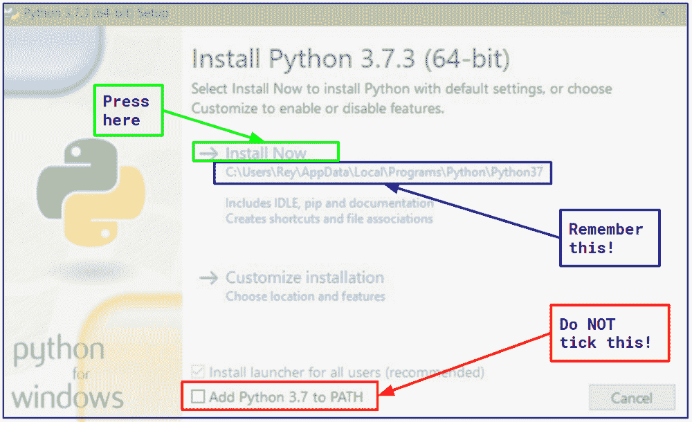
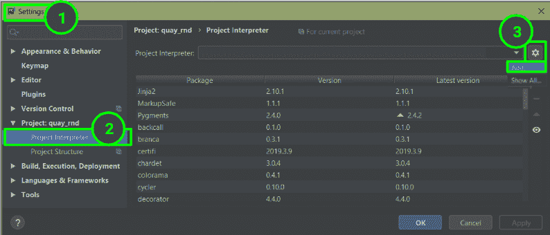
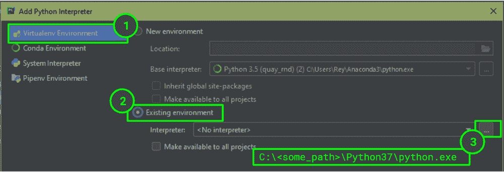
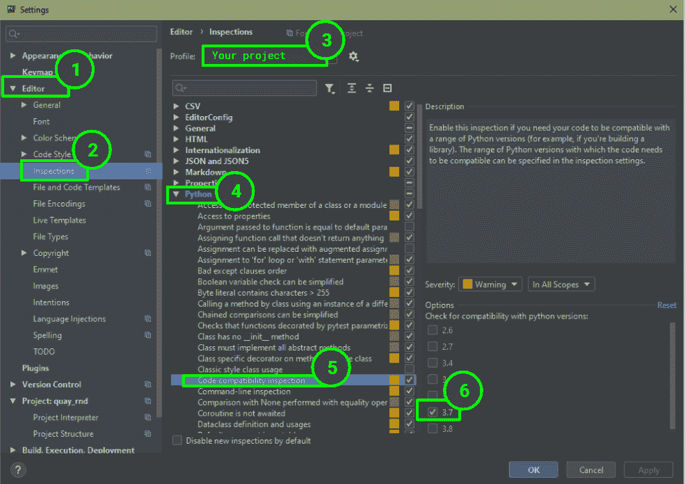

# 使用 Virtualenv 在 Windows 上安装多个 Python 版本

> 原文：<https://www.freecodecamp.org/news/installing-multiple-python-versions-on-windows-using-virtualenv/>

你在这里是因为:

1.  您使用的是 Windows 操作系统版本 10+
2.  您希望在同一台计算机上使用多个 Python 版本
3.  你已经厌倦了互联网告诉你“只用 Virtualenv”

### TL；速度三角形定位法(dead reckoning)

1.  打开`Command Prompt`并输入`pip install virtualenv`
2.  下载所需的`python`版本(不要添加到 PATH！)，并记住新安装版本的`path\to\new_python.exe`
3.  要创建一个虚拟人，打开`Command Prompt`并输入
    T1
4.  如果使用`PyCharm`，更新`Project Interpreter`和`Code compatibility inspection`。
5.  要安装包:
    (I)激活 virtualenv:打开`Command Prompt`，进入`path\to\env\Scripts\activate.bat`
    (II)安装需要的包
    (III)用`deactivate`停用。

### 长篇版；务必阅读

#### 序言

如果您使用的是 Anaconda 应用程序,那么使用他们的 GUI 这个过程可能会更容易。我自己没有试过，如果你要走那条路，请让我知道效果如何:)

#### 1.安装虚拟

如果您已经有了一些虚拟环境，或者正在使用 Anaconda，请确保接下来的步骤是从所有这些环境之外的**执行的。**

#### 2.安装 Python

你可以从[官方网站](https://www.python.org/)下载 python，例如`python3.7.3`去[这里](https://www.python.org/downloads/release/python-373/)。

您应该下载的文件被称为`Windows x86–64 executable installer`，或者如果出于某种原因您使用的是 32 位 windows，则被称为`Windows x86 executable installer`。

下载完成后，打开可执行文件，会出现安装提示。

*   您不希望将新的 python 添加到您的路径中，因为我们将在同一台计算机上有多个 python 版本，并且我们希望每个应用程序只知道一个 python 版本。
*   使用新 python 的默认建议位置，或者提供您选择的位置。不管怎样，记住这个位置，让我们从现在开始用`C:\<some_path>\Python37`来表示它。

#### 3.创建虚拟环境

打开`Command Prompt`，或者如果你正在使用 Anaconda，打开`Anaconda Prompt`。

决定你希望你的 virtualenv 在哪里，比如
`C:\Users\<your_username>\Anaconda3\envs\<env_name>`。

输入:

`virtualenv C:\Users\<your_username>\Anaconda3\envs\<env_name> -p C:\<some_path>\Python37\python.exe`

#### 4.更新 PyCharm 解释器

如果您正在使用 PyCharm，请打开您想要处理的项目(即/将用新的 python 版本编写的项目)，并转到`File -> Settings -> Project -> Project Interpreter`按下齿轮图标，然后按下`Add..`。

这将打开一个提示窗口，允许您定义一个新的解释器:

假设您正在使用代码检查，您可能需要告诉 PyCharm 要检查哪个 python 版本。转到`File -> Settings-> Editor -> Inspections -> Python -> Code compatibility Inspection`，确保顶部的方框指示您正在进行的具体项目，并勾选您的 python 版本的方框。

If you don’t see your python version on the Options list, this might also be the time to update PyCharm… yup, happened to me too… 

#### 5.安装软件包

目前，你的`virtualenv`只包含关键的包，`pip`和`setuptools`。要安装更多软件包:

1.  打开`Command Prompt`或`Anaconda Prompt`，输入
    `C:\Users\<your_username>\Anaconda3\envs\<env_name>\activate.bat`**激活**你的虚拟人
2.  像平常一样使用`pip`来安装包。
3.  **输入`deactivate`关闭**你的虚拟。

### 收场白

今天早上，当我决定用不同的 python 版本打开一个新项目时，我想，“是的，我就用一个 virtualenv”，因为互联网上说我可以“就这么做”。

好吧，它现在工作了，所以亲爱的互联网没有恶意，但说真的，“只是”真的有道理吗？重新安装-py charm-only-因为我想进行正确的代码检查属于“公正”的范畴吗？？

不管怎样，一路上我偶然发现了几个有用的指南，但每个都带我“只是”走了一步，所以我决定把它们都放在一个地方。

我希望我的旅程对你有所帮助，并希望我们都享受快乐的编码，尽可能少的 IT 摩擦:D

