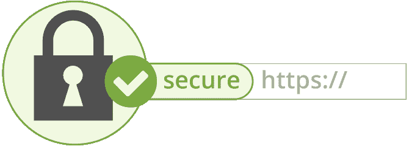

# 如何使用？htaccess

> 原文：<https://www.freecodecamp.org/news/how-to-redirect-http-to-https-using-htaccess/>

Chrome 和 Firefox 已经开始在没有 SSL 证书的网站上显示不安全警告。没有 SSL，你的网站对访问者来说会显得不安全。因此，出于安全性、可访问性或 PCI 合规性的原因，使用 SSL 加密的连接是必要的。从 HTTP 重定向到 HTTPS 变得非常重要。


### 什么是 SSL？

SSL(安全套接字层)是一种标准安全协议，用于在在线通信中在 web 服务器和浏览器之间建立加密链接。

SSL 技术的使用确保了在 web 服务器和浏览器之间传输的所有数据都保持加密。

创建 SSL 连接需要一个 **SSL 证书**。当您选择在您的 web 服务器上激活 SSL 时，您需要提供关于您的网站和您的公司的身份的所有详细信息。接下来，创建两个加密密钥——一个私钥和一个公钥。

[*了解更多:为什么 SSL 至关重要？*](https://www.sslrenewals.com/blog/why-is-ssl-important-benefits-of-using-ssl-certificate)

为了强制你的网络流量使用 HTTPS，编辑**中的代码。htaccess 文件。**

在我们开始将 HTTP 重定向到 HTTPS 之前，这里是您可以编辑的方式。htaccess 文件。如果您已经知道，请跳到重定向步骤。

### 编辑。htaccess 文件

中有说明/指令。htaccess 文件，告诉服务器在某些情况下如何操作，并直接影响网站的功能。中的通用指令。htaccess 文件:

*   重新寄送
*   重写 URL

**编辑 an 的方法。htaccess 文件:**

1.  在您的计算机上编辑文件，并使用 FTP 将其上传到服务器。
2.  在 FTP 程序中使用“编辑”模式，可以远程编辑文件。
3.  使用文本编辑器和 SSH 来编辑文件。
4.  使用 **cPanel** 中的文件管理器编辑文件。

### 编辑。cPanel 文件管理器中的 htaccess

**注意:**备份你的网站，以防出错。

1.  登录 cPanel
2.  文件>文件管理器>文档根目录:
3.  现在选择您想要访问的域名
4.  选中“显示隐藏文件(点文件)”
5.  点击“开始”
6.  新选项卡或窗口打开后，查找。htaccess 文件。
7.  右键单击。htaccess 文件，然后单击菜单上的“代码编辑”。
8.  可能会弹出一个对话框询问编码。单击“编辑”按钮继续。
9.  编辑文件
10.  完成后“保存更改”。
11.  测试你的网站，以确保它是正确的。如果出现错误，请恢复到以前的版本，然后重试。
12.  完成后，单击“关闭”关闭窗口。

### 将 HTTP 重定向到 HTTPS

#### 1.重定向所有 Web 流量

如果您的。htaccess，添加以下内容:

```
RewriteEngine On
RewriteCond %{SERVER_PORT} 80
RewriteRule ^(.*)$ https://www.yourdomain.com/$1 [R,L]
```

#### 2.仅重定向特定的域

要重定向特定域以使用 HTTPS，请添加以下内容:

```
RewriteEngine On
RewriteCond %{HTTP_HOST} ^yourdomain\.com [NC]
RewriteCond %{SERVER_PORT} 80
RewriteRule ^(.*)$ https://www.yourdomain.com/$1 [R,L]
```

#### 3.仅重定向特定的文件夹

重定向到特定文件夹上的 HTTPS，添加以下内容:

```
RewriteEngine On
RewriteCond %{SERVER_PORT} 80
RewriteCond %{REQUEST_URI} folder
RewriteRule ^(.*)$ https://www.yourdomain.com/folder/$1 [R,L]
```

注意:在需要的地方用你的实际域名替换 *`“yourdomain”`* 。同样，对于文件夹，用实际的文件夹名称替换 *`/folder`* 。

觉得有帮助吗？分享这篇文章，以帮助其他人来 HTTPS。

