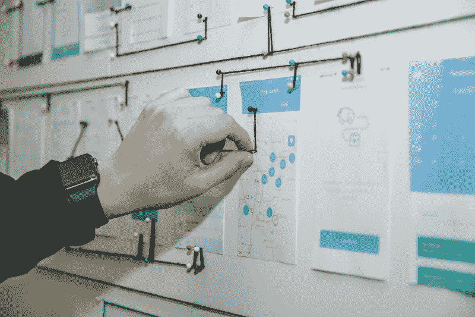

# 大设计的利与弊——以及我所做的

> 原文：<https://www.freecodecamp.org/news/the-pros-and-cons-of-big-design-up-front-and-what-i-do-instead-375f00542dec/>

贝内克·李塞夫斯基

# 大设计的利与弊——以及我所做的

#### 瀑布能冲刺吗？灰狗能减速吗？

Photo by [Alvaro Reyes](https://unsplash.com/photos/qWwpHwip31M?utm_source=unsplash&utm_medium=referral&utm_content=creditCopyText) on [Unsplash](https://unsplash.com/?utm_source=unsplash&utm_medium=referral&utm_content=creditCopyText)

我经营自己的独立设计业务已经有 18 年了。从瀑布式开发开始，然后过渡到极度敏捷，以及其间的所有变化。

作为一名自由职业者，我为各种各样的客户工作——大的和小的——使用各种各样的数字产品:从简单的宣传册网站到复杂的网络和移动应用程序。当 BDUF 瀑布过程适合项目时，我仍然使用它。其他时候，环境需要高度迭代和敏捷的方法。

当我将焦点从一个项目转移到另一个项目时，我经常每天在这些截然相反的设计方法之间切换。它帮助我适应了这两个过程，并认识到每个过程的优点和缺点。定期练习这两种方法使我能够独特地理解什么时候一种方法比另一种更有效。这让我开始思考 BDUF 在现代设计和开发领域是否还有一席之地。

在我们讨论 BDUF 和敏捷之前，让我们从几个定义开始:

#### 瀑布

一种相对线性的顺序设计方法，在研究、构思、设计、建造、测试、部署和维护阶段，进展主要向一个方向流动(像瀑布一样“向下”)。

#### 放大或缩小

在设计中，缩小意味着关注设计系统的整体性，评估其有效性，并确保其协调一致地工作。

放大是聚焦于整体的一小部分——功能、页面、用户流等。—动手设计工作，制作个人设计解决方案。

#### 循环

对产品或流程进行原型设计、测试、分析和改进的循环过程。根据利益相关者的反馈或测试结果，进行变更和改进。

#### 综合

结合成一个整体的行为。

#### 成本，便宜，贵

在这种情况下，它是指花在设计或开发上的时间和精力，不一定与金钱成本直接相关。

#### 工程、开发、编码

在某种程度上可以互换使用——在设计停止和技术实施开始之间划一条线。

### 什么是 BDUF？

大设计是一种在网站、应用程序或软件开始实施之前，预先完成并完善其设计的方法。这需要一个瀑布过程，并且依赖于*预测*。在敏捷出现之前，这是流行了几十年的方法。过去，网站和软件的建设非常昂贵，所以在昂贵的工程发生之前，有必要消除尽可能多的缺陷。

把它想象成绘制一艘船的航线。如果你已经知道路线、天气、水流和潮汐，你可以在下水前计划行程。一旦你离开港口，你就不必浪费时间去确定方位。

已经存在超过十年的设计师——或者在硅谷“产品”泡沫之外工作的设计师——可能使用 BDUF 磨练他们的工艺。这是他们的设计舒适区。

#### BDUF 假设

*   我们可以预先完全了解设计的目标、需求和范围——这些不太可能经历重大的变化。
*   在代码编写完成后，修改设计通常会更加困难和昂贵。效率是通过在设计中尽可能多的整理出来获得的。
*   在一个设计方案完全发挥作用之前，我们可以也必须判断它是好的还是有效的。
*   工程师可以在设计阶段就查明开发挑战，因此我们可以在编写代码之前找到替代的设计解决方案。
*   如果任其发展，工程师们会把事情搞得一团糟。设计需要引领潮流，否则 UX 和美学会受到影响。

#### BDUF 优势

*   如果你确切地知道你想要什么，这是达到目的最有效的方法。
*   因为所有的设计都是一次完成的，所以有足够的机会缩小，经常集成，整体设计。
*   用户体验是由设计师设计和提炼的，设计文档决定了工程师要开发的功能。每个角色都发挥了自己的优势。
*   易于成本和进度设计，因为它从一开始就是一个已知的数量。

#### BDUF 弱点

*   不容易适应范围的变化或目的的改变。如果目标或要求改变了，你可能不得不游回瀑布，重新开始。
*   设计不那么容易测试和验证，因为直到线性过程接近尾声时，它的任何部分才完全发挥作用。
*   没有利用瀑布流程后期可能出现的新知识或更好的解决方案。

### 敏捷和紧急设计

敏捷开发方法是为复杂的、不确定的、非线性的项目而设计的。它优先考虑的是适应性的 T1，而不是预测性的 T3，减少了在获得证据之前需要的信心跳跃。

敏捷的目标是将一个项目分解成更小的块。跨职能团队然后使用短时间框架的 sprint 来完成整个瀑布过程的加速版本——目标是在每个 sprint 中设计、生产和测试一些东西。他们的学习然后被整合到项目的发展范围中，并帮助塑造下一个冲刺和迭代的方向。

如果 BDUF 是一次事先计划好的记录良好的旅行，那么敏捷就是让你的船离开港口，对你要去哪里只有一个模糊的概念，然后在水中探索、计划和适应。这是一系列的小赌注，而不是单个精心计算的赌注。

敏捷软件开发的宣言基于 12 条原则(通过 T2 维基百科，T3):

1.  通过早期和持续交付有价值的软件来满足客户。
2.  欢迎不断变化的需求，即使是在开发后期。
3.  经常交付工作软件(几周而不是几个月)
4.  业务人员和开发人员之间密切的日常合作
5.  项目是围绕有积极性的个人建立的，他们应该被信任
6.  面对面的交谈是最好的沟通方式(共处一地)
7.  工作软件是进步的主要衡量标准
8.  可持续发展，能够保持不变的速度
9.  持续关注技术优势和优秀设计
10.  简单——最大化未完成工作量的艺术——至关重要
11.  最好的架构、需求和设计来自自组织团队
12.  团队定期反思如何变得更有效，并相应地进行调整

#### 紧急设计

敏捷方法需要一种新的思维方式，这种方式被描述为*紧急设计*。紧急设计的目标是做与 BDUF 相反的事情——预先最小化或不做设计，这样我们可以尽可能快地进行运输、测试和验证。

#### 紧急设计假设

*   没有大量的测试和学习，我们无法完全理解问题或其理想的解决方案。需求和设计必须由*推出*，所以最好尽快开始构建测试。
*   代码中的改变比设计中的更便宜。(或者至少同样贵)。
*   设计只有在真实世界中构建和使用后才能被评判或验证。
*   如果他们的工作没有经常被集成和测试，设计师可能会创造出技术上不可能或昂贵的解决方案。
*   过多的预先设计(以及*任何*文档)都是白费力气，因为在设计实现之前，需求将会改变或者新的解决方案将会出现。

#### 紧急设计优势

*   设计随着时间的推移而发展，可以利用新的知识。
*   设计是一个合作的努力，而不是一个单独的，封闭的过程。正如曼努埃尔·达姆(Manuel Dahm)所说:“这需要设计师从创意天才的孤独象牙塔中走出来，进入团队思维的共享公寓。”
*   设计和开发是并行进行的，这有助于跨团队协作和快速解决问题。一有烟的迹象，火就能被扑灭。
*   几乎没有留给假设或直觉。设计只有在被数据证明是成功的情况下才能实施。消除了设计有效性的不确定性。

#### 紧急设计弱点

*   敏捷可能过于关注输出，并鼓励特性工厂。
*   具有讽刺意味的是，sprints 的环境允许在宏观层面上进行更频繁的集成，但却很少有机会进行深入的、整体的设计思考。过于狭窄的焦点和不够宽广的视野意味着在设计系统层面上整合的机会较少。这可能导致平庸、不一致的设计，缺乏光泽和整体性。
*   设计很难计算成本，因为它是一个由利益相关者反馈和冲刺周期决定的移动目标。直到项目进行到一半(或更远)时，设计的全部范围才显现出来。
*   当“足够好”的设计出现时,*冲刺和重复*周期通常会结束。那么它就没有太多的机会来提升设计，超越平庸。当决策仅仅由数据决定时，设计师就失去了质量控制的优先权。

### 预先设计就够了

> "预先的大设计是愚蠢的，但是不预先做设计更愚蠢."

> 迪夫·托马斯

我曾经认为敏捷是好设计的敌人，但后来我意识到这只是因为*坏*敏捷没有给好设计留下空间。我拒绝拥抱敏捷的方式或工作，因为我的许多经历凸显了紧急设计的弱点，而没有用它们的优点来弥补它们。

在 [*中敏捷是(好设计的)敌人吗？*](https://hackernoon.com/is-agile-the-enemy-of-good-design-14a35806cde7) ，约翰·卡特勒说**【好】瀑布随时击败被滥用的敏捷。**

我不得不同意。

任何产品开发方法都是在最便宜的时候试图回答设计问题。敏捷的支持者坚信，在短距离冲刺阶段，小增量是最便宜的。BDUF 在最便宜的时候工作，并且被认为是一个整体。但是当他们不能产生好的设计结果时，他们都不能为设计师工作*。*

我认为 BDUF 和敏捷都没有找到合适的平衡点。介于两者之间。因此，我的首选设计方法是“预先设计就够了”(JEDUF)。

#### 杰迪夫来救援了

JEDUF 认识到，为了能够进行更详细的工作，需要一些总体设计。我们不能总是用“牛仔式发展”来信口开河。首先，我们需要几个球门柱。我们需要建筑和设计来为我们的冲刺创造基础。

*   早期的设计工作可能会很粗糙，但根据当时可用的信息，应该总是尽可能的好。是的，更多的设计工作将不得不出现在后面，但我们不想重做任何设计，如果我们可以第一次就把它做好。
*   前期设计应该被认为是一个项目或产品最基本的方面，因此它告知在早期冲刺阶段构建和测试的优先级。换句话说，识别最高的风险，然后首先针对它们进行设计。这为设计系统奠定了基础，并在早期进行了压力测试，通常由价值最高的开发部分进行测试。有人称这种必要的预先设计为“原始整体”。

#### 超越杰杜夫

我自己版本的 JEDUF 包含了在项目的不同阶段进行设计解压缩和集成的机会。我称之为**刚刚好的前期设计&中间**。

JEDUF&M 从广阔的角度平衡了小冲刺(放大的焦点)和整体设计集成的机会。当功能的临界质量出现时，sprint 周期可以暂停，以便考虑更深层次的设计。

把它想象成另一个预先设计会议，只是它的目标是关于*内聚*而不是*探索*。一旦设计系统感觉到整体性和可控性——整合和协调之前冲刺和学习的修订——下一轮冲刺就开始了。设计师需要认识到什么时候需要“中间”的设计突破，不要让项目过于纠缠于细枝末节。

我发现 JEDUF&M 是终极设计方法。它平衡了适应性、快速迭代和对验证的关注，这使敏捷变得如此强大——同时也允许休息、集成和整体设计系统思考的时间，这可能会在冲刺和特性交付中丢失。

如果，即使在这种方法的理想平衡下，你发现自己对不确定性的数量感到焦虑，那么可以这样想:拥抱不确定性。现在*你能够塑造那些约束成为什么*，而不是让它们被预先决定和支配。这是更多的责任，也是更多的灵活性。如果你沉着地处理好这个角色，你会无怨无悔地交付一个结果，即使这个过程更具挑战性。

### BDUF 还有很大的空间

你不能完全忽视这种恐龙。当用于正确的项目时，预先大设计是一个非常有效和高效的模型。

随着系统复杂性的降低，预先设计的好处也在增加。

并不是所有的设计师都在开发复杂的企业应用程序，有可变的利益相关者目标和不确定的解决方案。不是每个项目都需要大量的探索、测试和客户验证。

我无法想象采用敏捷方法来设计和构建一个简单的宣传册或作品集网站。我的客户会认为我疯了。在这些情况下，BDUF 仍然生机勃勃。

BDUF 和敏捷是一个光谱的两端。确定在构建之前、之中和之后需要验证的内容，然后定制您的过程，以便在正确的时间进行正确的设计。大多数项目将落在光谱的中间，而不是激进的边缘。

我们不要忘记，瀑布过程不必像批评者所说的那样严格和线性。BDUF 仍然可以“尽早且经常地交付”，收集涉众的反馈，快速迭代，并随时间演进。只是这种进化完全发生在设计领域。

我们可以在我们的大瀑布里制作小瀑布。有很多有用的方法可以实现小的验证并向前推进，而不需要整个跨职能团队直接将其推入代码并匆忙发布。

BDUF 并不意味着没有能力通过反馈和迭代来学习、适应和改进设计。如果你认为 BDUF 是这样的，也许这些年来你一直做错了？

*请*？ *c **圈**如果你发现这个很值钱，还有呢？允许我写更多这样的文章，展现我 18 年的自由设计知识？*

#### [订阅](https://solowork.co/subscribe)在你的收件箱里获得我最好的文章。

这个故事也可以在[solowork.co](https://solowork.co/story/r-i-p-big-design-up-front)上找到