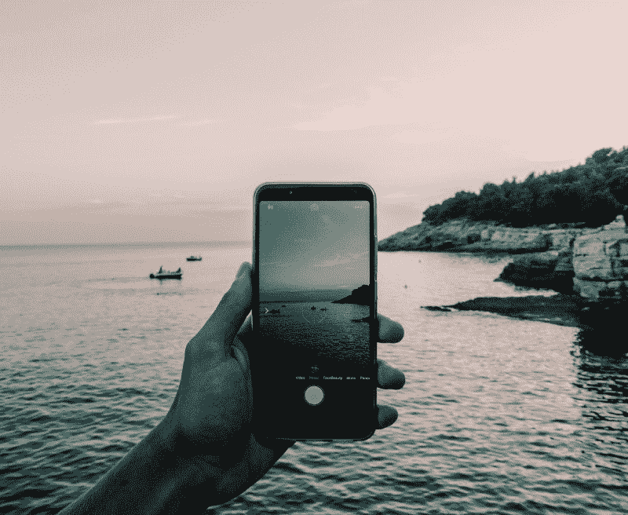

# 如何在 React Native 中使用视频作为背景

> 原文：<https://www.freecodecamp.org/news/how-to-create-a-background-video-in-react-native-cb53304ee4f6/>

在本帖中，我们将在 React Native 中创建一个`**backgroundVideo**`。如果您刚刚开始使用 React Native，请查看我的文章[开始使用 React Native](https://medium.freecodecamp.org/what-you-need-to-know-to-start-building-mobile-apps-in-react-native-dded951277b7)e 构建移动应用需要知道的内容


Demo: Peleton Home Screen

背景视频可以给应用程序的用户界面增加一个很好的效果。如果你想显示广告或向用户发送消息，它们可能会有所帮助，就像我们在这里要做的那样。

你需要一些基本的要求。要开始，您必须有 react-native 环境设置。这意味着您拥有:

*   已安装 react-native-cli
*   Android SDK 如果你有一台苹果电脑，你不需要它，只需要 Xcode

### 入门指南

首先，让我们启动一个新的 React 原生应用。在我的例子中，我使用的是 react-native-cli。因此，在您的终端运行中:

```
react-native init myapp
```

这应该会安装所有的依赖项和包来运行 React 本机应用程序。

下一步是在模拟器上运行和安装应用程序。

对于 iOS:

```
react-native run-ios
```

这将打开 iOS 模拟器。

在 Android 上:

```
react-native run-android 
```

你可能会遇到一些 Android 的问题。我建议你使用 [Genymotion](https://www.genymotion.com/) 和 Android 模拟器或者查看[这本友好的指南](https://medium.com/@sunilk/react-native-development-getting-started-with-android-and-ios-ada22e3d00b1)来设置环境。

首先，我们要做的是克隆 Peleton 应用程序的主屏幕。我们使用`[**react-native-video**](https://github.com/react-native-community/react-native-video)`进行视频流，使用`[**styled-component**](https://www.styled-components.com/docs/basics#react-native)`进行造型。所以你必须安装它们:

*   纱线:

```
yarn add react-native-video styled-components
```

*   NPM

```
npm -i react-native-video styled-components --save
```

然后你需要链接 react-native-video，因为它包含本地代码——对于`**styled-components**`我们不需要它。所以只需运行:

```
react-native link
```

你不用担心其他的事情，只需要专注于`Video`组件。首先从 react-native-video 导入视频，开始使用。

```
import import Video from "react-native-video";
  <Video
source={require("./../assets/video1.mp4")}
style={styles.backgroundVideo}
muted={true}
repeat={true}
resizeMode={"cover"}
rate={1.0}
ignoreSilentSwitch={"obey"}
/>
```

让我们来分解一下:

*   **源**:源视频的路径。您可以改用 URL:

```
source={{uri:"https://youronlineVideo.mp4"}}
```

*   **风格:**我们要赋予视频的服装风格，也是制作背景视频的关键
*   resizeMode:在我们的例子中是`cover`；你也可以尝试`contain or stretch`，但这不会给我们想要的

而其他道具是可选的。

让我们转到重要的部分:将视频放在背景位置。让我们定义风格。

```
// We use StyleSheet from react-native so don't forget to import it
//import {StyleSheet} from "react-native";
const { height } = Dimensions.get("window");
const styles = StyleSheet.create({
backgroundVideo: {
height: height,
position: "absolute",
top: 0,
left: 0,
alignItems: "stretch",
bottom: 0,
right: 0
}
});
```

我们在这里做了什么？

我们给视频一个`position :absolute`，给它设备的窗口`height`。我们使用 React Native 的`Dimensions`来确保视频占据整个高度——`top:0, left:0,bottom:0,right:0`——这样视频就占据了所有的空间！

整个代码:

```
import React, { Component, Fragment } from "react";
import {
  Text,
  View,
  StyleSheet,
  Dimensions,
  TouchableHighlight
} from "react-native";
import styled from "styled-components/native";
import Video from "react-native-video";
const { width, height } = Dimensions.get("window");
export default class BackgroundVideo extends Component {
  render() {
    return (
      <View>
        <Video
          source={require("./../assets/video1.mp4")}
          style={styles.backgroundVideo}
          muted={true}
          repeat={true}
          resizeMode={"cover"}
          rate={1.0}
          ignoreSilentSwitch={"obey"}
        />

        <Wrapper>
          <Logo
            source={require("./../assets/cadence-logo.png")}
            width={50}
            height={50}
            resizeMode="contain"
          />
          <Title>Join Live And on-demand classes</Title>
          <TextDescription>
            With world-class instructions right here, right now
          </TextDescription>
          <ButtonWrapper>
            <Fragment>
              <Button title="Create Account" />
              <Button transparent title="Login" />
            </Fragment>
          </ButtonWrapper>
        </Wrapper>
      </View>
    );
  }
}

const styles = StyleSheet.create({
  backgroundVideo: {
    height: height,
    position: "absolute",
    top: 0,
    left: 0,
    alignItems: "stretch",
    bottom: 0,
    right: 0
  }
});

// styled-component

export const Wrapper = styled.View`
  justify-content: space-between;
  padding: 20px;
  align-items: center;
  flex-direction: column;
`;
export const Logo = styled.Image`
  max-width: 100px;
  width: 100px;
  height: 100px;
`;
export const TextDescription = styled.Text`
  letter-spacing: 3;
  color: #f4f4f4;
  text-align: center;
  text-transform: uppercase;
`;
export const ButtonWrapper = styled.View`
  justify-content: center;
  flex-direction: column;
  align-items: center;
  margin-top: 100px;
`;
export const Title = styled.Text`
  color: #f4f4f4;
  margin: 50% 0px 20px;
  font-size: 30;
  text-align: center;
  font-weight: bold;
  text-transform: uppercase;
  letter-spacing: 3;
`;
const StyledButton = styled.TouchableHighlight`
 width:250px;
 background-color:${props => (props.transparent ? "transparent" : "#f3f8ff")};
 padding:15px;
border:${props => (props.transparent ? "1px solid #f3f8ff " : 0)}
 justify-content:center;
 margin-bottom:20px;
 border-radius:24px
`;
StyledTitle = styled.Text`
  text-transform: uppercase;
  text-align: center;
  font-weight: bold;
  letter-spacing: 3;
  color: ${props => (props.transparent ? "#f3f8ff " : "#666")};
`;

export const Button = ({ onPress, color, ...props }) => {
  return (
    <StyledButton {...props}>
      <StyledTitle {...props}>{props.title}</StyledTitle>
    </StyledButton>
  );
};
```


此外，您可以通过执行以下操作来使该组件可重用:

```
<View>
<Video
source={require("./../assets/video1.mp4")}
style={styles.backgroundVideo}
muted={true}
repeat={true}
resizeMode={"cover"}
rate={1.0}
ignoreSilentSwitch={"obey"}
/>
{this.props.children}
</View>
```

您可以将它与其他组件一起使用:

差不多就是这样。感谢您的阅读！



Photo by [David Boca](https://unsplash.com/photos/wQZSl60DGDM?utm_source=unsplash&utm_medium=referral&utm_content=creditCopyText) on [Unsplash](https://unsplash.com/search/photos/app?utm_source=unsplash&utm_medium=referral&utm_content=creditCopyText)

#### 了解有关 React Native 的更多信息:

*   [开始在 React Native 中构建移动应用需要了解的内容](https://medium.freecodecamp.org/what-you-need-to-know-to-start-building-mobile-apps-in-react-native-dded951277b7)
*   [React Native 中的造型](https://blog.bitsrc.io/styling-in-react-native-c48caddfbe47)

#### 其他职位:

*   [JavaScript ES6，少写—多做](https://medium.freecodecamp.org/write-less-do-more-with-javascript-es6-5fd4a8e50ee2)
*   [如何使用 Vue.js 中的路由创建更好的用户体验](https://medium.freecodecamp.org/how-to-use-routing-in-vue-js-to-create-a-better-user-experience-98d225bbcdd9)
*   下面是用 JavaScript 发出 HTTP 请求的最流行的方法

> 你可以在推特上找到我[？](https://twitter.com/SaidHYN)

#### 订阅我的邮件列表，关注即将发布的文章。