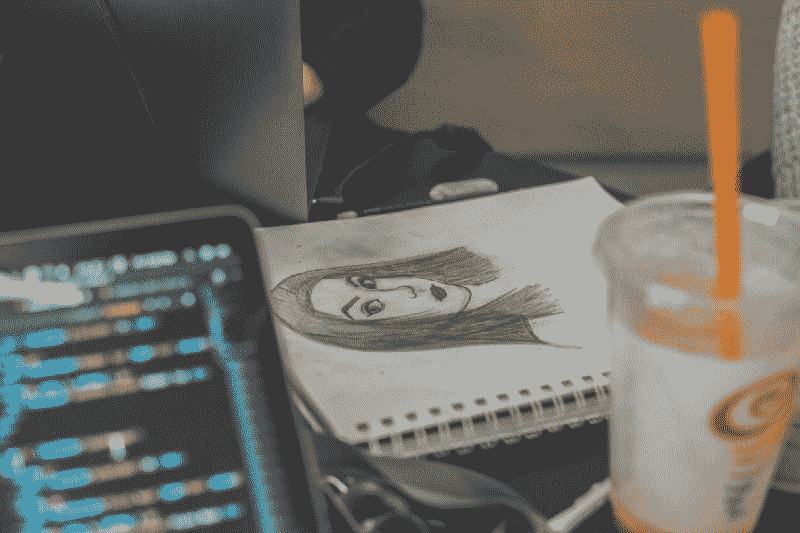

# 如何在 Draft.js 中将图像直接粘贴到文章中

> 原文：<https://www.freecodecamp.org/news/how-to-paste-images-directly-into-an-article-in-draft-js-e23ed3e0c834/>

安德烈·塞明

# 如何在 Draft.js 中将图像直接粘贴到文章中

Photo by [Max Nelson](https://unsplash.com/photos/Y9w872CNIyI?utm_source=unsplash&utm_medium=referral&utm_content=creditCopyText) on [Unsplash](https://unsplash.com/?utm_source=unsplash&utm_medium=referral&utm_content=creditCopyText)

### 问题是

对于你们中的一些人来说，这可能是一个惊喜，但是 Draft.js 不支持开箱即用的图像。为了能够在编辑器中显示图像，您需要安装和配置`[draft-js-image-plugin](https://www.draft-js-plugins.com/plugin/image)`(我们不会在这里讨论这个主题，因为它的文档相当全面)。这也意味着不支持像将图像(或任何其他文件)粘贴到编辑器中这样的常见功能。这篇文章的目的是展示如何添加对粘贴文件的基本支持(我们将重点关注图像)。

### 解决办法

让我们从阅读 [Draft.js 文档](https://draftjs.org/docs/getting-started)开始。原来编辑器里有个道具叫`[handlePastedFiles](https://draftjs.org/docs/api-reference-editor#handlepastedfiles)`。它接收一个文件数组，并为您提供在粘贴操作中操作文件的选项。然而，事情并非完全如此。

> 有一个问题:当你试图将多个文件粘贴到编辑器中时，你会收到一个只包含其中一个文件的数组。这是一个已知的问题，在 2018 年 12 月 11 日的 [Draft.js repo](https://github.com/facebook/draft-js) 中有一个[问题](https://github.com/facebook/draft-js/issues/1955)。也就是说它很年轻但还是很烦人。

现在我们需要定义我们将要处理的文件类型。对于图像，它们是`image/png`、`image/jpeg`和`image/gif`。

现在，当我们知道我们将只处理图像时，是时候从文件中实际读取数据了。为此，我们将实现一个名为`readImageAsDataUrl`的函数，并特别使用`[FileReader](https://developer.mozilla.org/en-US/docs/Web/API/FileReader)` API 和`[readAsDataUrl](https://developer.mozilla.org/en-US/docs/Web/API/FileReader/readAsDataURL)`方法。这些步骤的组合允许我们读取 base64 编码的文件及其内容，这些内容稍后可以用作`img` 元素的`src`属性的值。

现在，当我们有了 base64 编码的图像后，我们需要做的就是创建一个 Draft.js 实体，并更新编辑器的状态以包含这个实体。

我们可以从使用作为 Draft.js 一部分的`Entity`模块的`[create](https://draftjs.org/docs/api-reference-entity#create)`方法开始。(不过要记住，文档中说`Entity.create`已经过时，开发人员应该使用`contentState.createEntity`。在写这篇文章的时候，最后一个还没有工作。所以我们将继续使用`Entity`，但会跟踪这一变化)。

我们需要在这里提供 3 个参数:

*   首先是我们将要创建的实体的类型(在我们的例子中是`image`)
*   第二个是实体的可变性(`IMMUTABLE`意味着我们不能编辑包含这个实体的文本的内容。如果我们试图从中删除某些内容，整个文本范围都将被删除)
*   第三个是一个可选对象，包含您想要存储在实体中的任何数据(在我们的例子中，它是`draft-js-image-plugin`所需要的`src`)。

作为回报，我们得到一个密钥，通过它我们可以在编辑器状态下处理这个实体。现在我们需要使用这个键将一个块插入到编辑器中，并将这个实体附加到这个块上。我们将使用 Draft.js 中的`AtomicBlockUtils`模块的`insertAtomicBlock`函数。我们需要传递当前编辑器状态、实体键和一个字符(不应该是空字符串——这就是我们使用单空格的原因),我们将获得一个新的编辑器状态！

现在，一切都设置好了，让我们把所有的东西结合在一起，看看我们的`handlePastedFiles`函数:

瞧啊。现在，我们可以通过简单地按 CTRL+V 将图像粘贴到 Draft.js 编辑器中。您可以按照我们想要的任何方式扩展此功能！例如，我们可以允许我们的用户用一些漂亮的用户界面来改变图像的大小。

如果你已经通读了这篇文章，你可能也想看看[我之前关于 Draft.js 结界的文章](https://hackernoon.com/draft-js-how-to-remove-formatting-of-the-text-cd191866d9ad)。您可能也想将它应用到您的项目中。