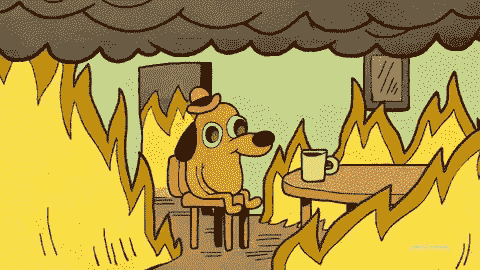

# 高尔定律——以及它与创业的关系

> 原文：<https://www.freecodecamp.org/news/galls-law-and-what-it-has-to-do-with-startups-fd85dfbd6703/>

作者约翰·萨丁顿(请勿出版)

前几天，我意识到一件令人着迷的事情:我意识到，作为一个创业企业家和创始人，我是一个系统的建设者。

换句话说，作为一名创始人，我的全部工作就是构建和连接相互依赖的系统，这些系统(希望)能够非常好地协同工作。

而且，如果我能以一种足够简单和平易近人的方式来构建这些系统，让其他人能够理解和兴奋，那么，这就足以说服独立的、有创造力的和有动力的人加入到我的努力中来，设计出更多的系统(以及这些系统之间更多的关系)，这些系统最终将结合成一个世界级的组织。

我的意思是，如果不是一个系统的集合，以最大化吞吐量、优化性能和产生超出规模的结果(即利润)的方式组织，那么什么是企业？

这也是初创公司相对于更老、规模更大的公司有着难以置信的优势的地方:初创公司有机会自己决定，不仅是基本和主要的系统是什么以及它们将如何运作，还有组织决定建立什么样的**系统*以及*它们将如何集成*并添加到现有的、更大的元系统的方式。*

*“元系统”仅仅是信念和由此产生的行为的集合，这些信念和行为在整个有机体中被概括和规范化。有人可能称之为组织文化；希望这是一个建立在信任上的[。](https://john.do/org-trust/)*

**

*高尔定律对新公司来说尤其适用和重要——他们需要花必要的时间来有意地、明确地思考他们使用的系统，这样他们才有机会将他们改变世界的想法变成人们真正想要的真正的服务和产品。*

*你看， [John Gall 的工作](https://en.wikipedia.org/wiki/John_Gall_(author)#Gall's_law)已经成为系统设计的经验法则，并被用作非特定化的有力论据(这是所有创业公司的起点):*

> *一个有效的复杂系统总是被发现是从一个有效的简单系统进化而来的。从零开始设计的复杂系统永远不会起作用，也无法通过修补使其起作用。你必须从一个简单的工作系统开始。*

*在这一点上，初创公司必须保持高度警惕，有足够的情感意识和成熟度，知道如果他们有意或无意地脱离使他们独特的洞察力实际可用的基础系统，他们可能会对他们的成功机会造成不可挽回的永久伤害。*

*我知道这一点，因为我过去也这样做过:我构建了过于复杂和过度工程化的系统，并将它们介绍给我的团队，却发现它们弊大于利！*

*此外，一些企业将这些原则和原始系统编纂成使命或愿景声明，或者将其作为企业价值声明的一部分，而其他企业则不会。甚至编纂一个被理解和使用的系统的行为也是创始团队和领导层有意做出的决定！*

*以及过度设计某物的诱惑(任何东西！)已经相当大了；增加一点商业动力，几个新雇员，一点点(或很多)风险资本，以及一个看起来*有效的产品，你会在某天早上突然醒来，意识到你和你的团队已经完全臃肿不堪，充斥着几十个很少使用的 SaaS web 服务和一大堆(虚构的)流程，老实说，这些流程似乎是为了它们自己而存在的。**

*干得好，初创公司创始人——你只是扮演了自己。*

**

*我们过得很好！你开始时很简单，一切都很好，似乎一夜之间，你就把自己变成了一个复杂的系统网络，它“无法修补以使其工作”——你将不得不放弃一些东西，以回到基线和正在工作的基础“宝石”。*

*这就是为什么大多数大型公司无法与更小、更敏捷的初创公司竞争——逆向工程或解构和拆除一个功能失调的复杂系统的成本往往太大、破坏性太强，不值得付出努力！*

*因此，功能失调的系统对大多数人和更大的组织来说是“足够好的”,很少有人有动机“举起白旗”并倡导真正需要的东西:从一个工作的、简单的系统开始。*

*显然，那些有意建立一种内省文化并无情地检讨他们过时和过时的系统的创业公司将会比他们的同行，当然还有他们更大的企业竞争对手好得多。*

*创业公司从简单的系统开始，并自然地扩展和发展新系统，这些新系统通常是以一种大多数人会认为是随机和大杂烩的方式附加的。简单系统的集合形成复杂系统，其中一些工作了很长时间，而另一些很快就崩溃了。*

*认识到新旧系统之间成功和不成功集成的差异的组织将比那些故意忽略功能障碍或天真地认为它会自动解决的组织成功(并生存)得更久。*

*这些组织不仅能够迅速意识到并有意识地积极合作解决问题，而且如果情况需要采取极端行动，他们还愿意拆除整个系统，以建立新的、更简单的系统来支持一个全新的、完全不同的组织的重量(创业公司可能每 6 个月就会发生根本性的变化！).*

*不用说，随着组织规模的扩大，明智而有目的地增加系统的同时，在战略和战术上保持系统的简单是非常困难的。*

*

This is fine.* 

*这并不是说我是专家；更确切地说，我有足够的情感意识知道(并有经验证据)如果没有一个稳定一致的回顾，组织倾向于混乱和熵，不仅是正在做什么，而且是如何做的。*

*如果我更诚实的话，我知道如果我不小心的话，我会把熵引入系统！事实上，我知道即使我尽了最大努力，每一步都将是一场艰苦的战斗。*

*执行以下部分(如果不是全部的话)符合团队的最佳利益:*

1.  *及时安排按团队和/或组织部门(如运营、工程、营销、销售等)审查您的系统。).*
2.  *尽你所能，识别出最终成为复杂系统的原理(原始)简单系统，并清楚地阐明(预期)输出和应该涉及的人员。*
3.  *概述并识别被评审系统的相互依赖性；也就是说，与审查中的系统有直接相互作用的其他系统。*
4.  *无情地评判这个系统，调整、修剪或彻底摧毁它，然后建立一个新的、更简单的版本(或者回到创世纪的版本)。*
5.  *共识可能是必需的，也可能不是，但是，不管你的团队如何决策，确保每个人都同意新的(和改进的！)系统，每个人都坚定地承担责任。*
6.  *对实验进行时间限制，并设定一个时间来回顾新改变的系统。回顾展中的日历。*
7.  *冲洗并重复。*

*这对我和我的公司来说是一件大事，尤其是因为我们正在 T2 发展我们的团队。这也是相关的，因为我已经意识到，现在是我们回顾我们已经建立的系统的时候了，用细齿梳子，花时间优化和(重新)建立我们公司的基础。*

*我们还能怎样登上月球？？？？*

*[*约翰*](http://beta.yen.io/john/) *是 [**日元**](http://yen.io) 的软件工程师，这是一个结合了社交网络和多种加密货币交易所力量的社交平台。**