# 如何用 React 和 Redux 前端创建一个 Rails 项目

> 原文：<https://www.freecodecamp.org/news/how-to-create-a-rails-project-with-a-react-and-redux-front-end-8b01e17a1db/>

马克·霍普森

# 如何用 React 和 Redux 前端创建一个 Rails 项目(加上 Typescript！)

#### 在 Rails 项目中使用 React 和 Redux 设置单页 Javascript 应用程序的完整指南。

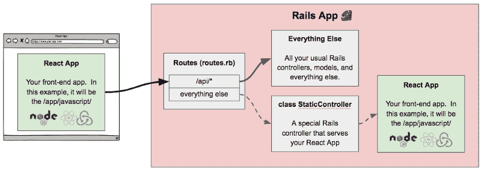

*更新(2019 . 3 . 17):本项目最后一步增加[打字稿](https://github.com/Microsoft/TypeScript)。*

本教程将向你展示如何在一个 Rails 项目中创建一个带有 React 的[单页面应用](https://www.bloomreach.com/en/blog/2018/07/what-is-a-single-page-application.html)(以及 [Redux](https://redux.js.org/) 和[语义 UI](https://react.semantic-ui.com/) )。

本教程还将包括:

*   [还原](https://redux.js.org/)
*   [反应路由器](https://github.com/ReactTraining/react-router)
*   [重新选择](https://github.com/reduxjs/reselect)
*   [Redux 认为](https://github.com/reduxjs/redux-thunk)
*   [语义界面](https://react.semantic-ui.com/)

*边注#1。最近我看到了这个[精彩的指南](https://medium.freecodecamp.org/how-to-make-create-react-app-work-with-a-node-backend-api-7c5c48acb1b0)，它启发我为 Rails 写一个。*

*边注#2。下面是[完成教程](https://github.com/markhopson/rails-react-tutorial)。[提交历史](https://github.com/markhopson/rails-react-tutorial/commits/master)与本指南中的步骤相对应。*

### 概观

为了让你对我们将要构建的内容和工作方式有个概念，请看下面的两个图表。

#### 图 1:处理第一个 HTTP 请求(即从浏览器到我们的 Rails 应用程序的请求)

下图展示了 Rails 项目中的 React 应用程序，以及第一个请求将 **React 应用程序**返回到客户端(浏览器)的路径(黑色实线)。

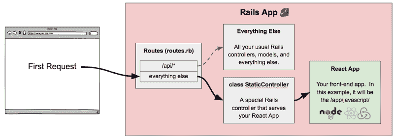

Diagram 1: How our project handles the first request from the client (i.e. browser)

#### 图 2:处理后续的 HTTP 请求(即从 React 应用程序到 Rails 应用程序的请求)

React 应用程序加载到用户浏览器后，React 应用程序将负责向您的 Rails 应用程序发送请求(黑色实线)。换句话说，一旦加载了 React，对 Rails 的请求将来自 Javascript 代码，而不是浏览器。


Diagram 2: How React interacts with Rails (HTTP requests will come from in the React App and not the browser itself)

#### 开始编码前的其他重要注意事项

*   把你的 React 应用和你的 Rails 应用分开。React 应用程序严格用于前端，在用户的浏览器中运行。Rails 部分严格来说是后端的，在服务器上运行。除了何时返回其静态资产(Webpack 编译的 HTML、JS 和 CSS)之外，Rails 应用程序对 React 应用程序一无所知。
*   一旦您的 React 应用程序被浏览器加载，所有进行 HTTP 请求的逻辑(检索数据，并将数据转化为视图)都在前端(即浏览器)完成。
*   除了为 React 应用程序服务的视图之外，Rails 应用程序实际上不提供任何视图。在本教程中，唯一的 Rails 视图是`/app/views/static/index.html.erb`
*   所有的`/api/*`路径都由 Rails 应用程序处理，而所有其他路径都由浏览器内部的 React 处理(在浏览器加载第一个请求之后)。比如`[http://your-app.com/something](http://your-app.com/something)`会被发送到 Rails App，然后返回到你的 React App(浏览器中已经加载的 HTML/JS/CSS)，它会决定屏幕上显示什么。
*   [构建单页面 app 的考虑事项](https://medium.freecodecamp.org/why-i-hate-your-single-page-app-f08bb4ff9134)。对于本教程来说不是必需的，但是很有用。
*   [反应组件设计模式](https://medium.com/teamsubchannel/react-component-patterns-e7fb75be7bb0)。同样，不是必须的，但很有用。

### 系统需求

仅供参考，这是我的系统配置。不是说你需要这个，而是类似的东西会让这个教程体验更流畅。

*   macOS 10.13.6(高塞拉)
*   Ruby 2.5.1
*   轨道 5.2.1(和捆扎机 1.16.6)
*   - gem install bundler -v 1.16.6
*   节点 9.8.0

最后，关于代码！

### 步骤 1:用 Webpack 创建一个新的 Rails 项目，并做出反应

创建新的 Rails 应用程序。我给我的取名为`rails-react-tutorial`。

```
rails new rails-react-tutorial --webpack=react
```

关于 Rails 5.1 中引入的`--webpack=react`标志的更多信息，请参见[这里的](https://guides.rubyonrails.org/5_1_release_notes.html#optional-webpack-support)。

### 步骤 2:确保安装了 Webpacker 和 React-Rails gems

检查[](https://github.com/rails/webpacker)**和 [**React-Rails**](https://github.com/reactjs/react-rails) 宝石是否在你的`Gemfile`里。如果宝石不在那里，那么添加它:**

**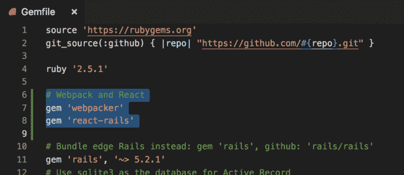

*Sometimes only Webpacker is added, and not React-Rails; not sure why …*** 

**现在运行这些命令来安装所有东西。**

```
`bundle install`
```

```
`# This command might not be necessary.# If already installed, then it will# ask you to override some files.rails webpacker:install`
```

```
`rails webpacker:install:react  rails generate react:installyarn install` 
```

**现在运行`rails server -p 3000` 并访问`[http://localhost:3000](http://localhost:3000)`以确保我们的项目正在运行。**

****专业提示#1** :编码时在一个单独的窗口中运行`./bin/webpack-dev-server`，让任何更改自动构建并重新加载浏览器。**

****专业提示#2** :如果你得到这个错误`can’t activate sqlite3 (~> 1.3.6), already activated sqlite3–1.` 4.0 然后一个`dd gem ‘sqlite3’, ‘~>` 1 . 3 . 6’到 Gemfile。更多信息见 [thi](https://stackoverflow.com/a/54529016/1176788) s 链接。**

### **步骤 3:向我们的 Rails 应用程序添加一个控制器类和路由**

**向我们的 Rails 应用程序添加新路线。对于本例，我们将把`GET /v1/things`端点添加到`config/routes.rb`中。**

**

Our `config/routes.rb` file** 

**这条新路线需要一个东西控制器。创建一个新的`app/controllers/v1/things_controller.rb`文件。记住，它应该在`v1`文件夹中，因为它属于我们的 Rails API。**

**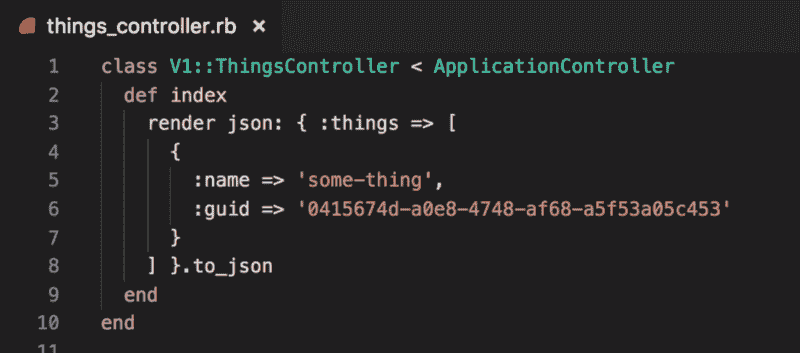

Our /app/controllers/v1/things_controller.rb file** 

**我们的事物控制器将为`GET /v1/things`返回一个硬编码的响应。**

**此时，您应该能够重新运行`rails server -p 3000`并访问`[http://localhost:3000/v1/things](http://localhost:3000/v1/things)`。**

**

Success!** 

**接下来，我们将创建一个新的 React 组件。**

### **步骤 4:生成新的 React 组件**

**通过运行以下命令，创建一个接受名为`greeting`的字符串参数的 HelloWorld React 组件:**

```
`rails generate react:component HelloWorld greeting:string`
```

**应该创建一个文件:`app/javascript/components/HelloWorld.js`。**

**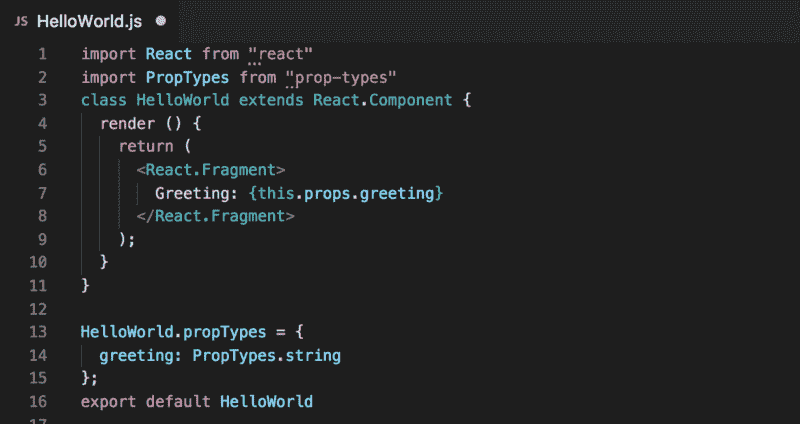

Our `app/javascript/components/HelloWorld.js file`** 

### **步骤 5:使用我们的 HelloWorld 组件**

**要使用和查看我们新的 HelloWorld 组件，我们需要做两件事:创建一个嵌入该组件的视图，并添加一个指向该视图的路径。**

**要创建视图，创建文件`app/views/static/index.html.erb`并添加以下内容:**

**

“Hello” is being passed in as the “greeting” param for HelloWorld** 

**对于我们的新路由，将下面一行添加到我们的`routes.rb`文件中，并添加一个空的 StaticController 来支持它。**

**

Adding a route to serve our new view that contains the HelloWorld component** 

**将此添加到`app/controllers/static_controller.rb`:**

**

An empty controller** 

**现在，您应该能够重新运行`rails server -p 3000`并访问`[http://localhost:3000/](http://localhost:3000/v1/things)`来查看您的新 React 组件(记得在一个单独的窗口中运行`./bin/webpack-dev-server`，让 webpack 自动打包 Javascript 更改)。**

**

Success! Our first rendered component.** 

**现在我们有了一个在视图中呈现的 React 组件，让我们用`react-router`扩展我们的应用程序以支持多个视图。**

### **步骤 6:添加 React-Router**

**首先，运行这个命令来添加`react-router-dom`，它包含并导出所有的`react-router`和一些用于 web 浏览的辅助组件。更多信息[在这里](https://github.com/ReactTraining/react-router/issues/4648)。**

```
`npm install --save react-router-domyarn install`
```

**这个命令应该将下面一行添加到您的`package.json`文件中。注意，这里使用的是 4.2.2，但是您的版本可能会有所不同。**

**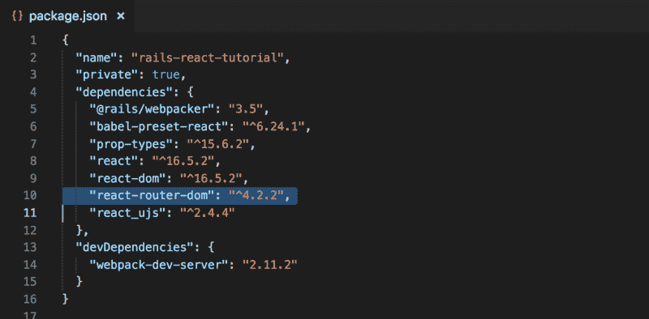**

**现在，让我们使用 React 路由器为 React 前端创建一些路由。**

### **步骤 6:使用 React-Router**

**允许我们用 Javascript 严格管理我们所有的 UI 路径。这意味着我们需要一个单一的“App”组件来封装我们的整个应用程序。“App”还将使用 React-Router 为所请求的 URL 呈现正确的“页面”组件。**

**首先，运行这个命令来添加一个代表我们整个前端应用程序的应用程序组件。**

```
`rails generate react:component App`
```

**接下来，打开新创建的 React 组件的文件`app/javascript/components/App.js`，并添加以下内容…**

**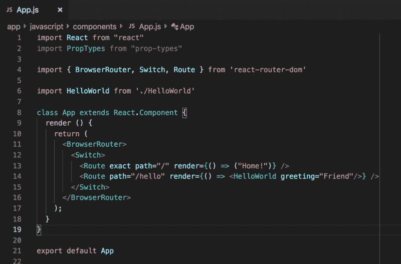

Our React App with 2 routes** 

**现在将`index.html.erb`改为指向我们新的应用组件。**

**

The App component will encapsulate our entire front-end.** 

**最后，编辑您的`routes.rb`，让 Rails 将所有不是针对 API 的请求发送到我们的 App 组件(通过`StaticController#index`)。**

**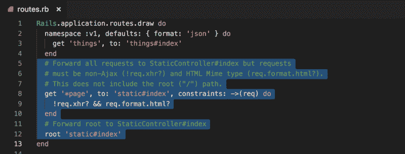

Our routes.rb now forwards all non-API and non-Ajax requests to our React App** 

**我们现在可以运行`rails server -p 3000`并访问`[http://localhost/](http://localhost/)`和`[http://localhost/](http://localhost/)hello`来查看 React-Router 的工作情况(记住`./bin/webpack-dev-server`支持自动网络打包)。**

**接下来，在将 React 前端连接到 Rails API 之前，我们需要安装一些额外的依赖项。**

### **步骤 7:添加 Redux、Sagas、Babel Polyfill 和 Axios**

**现在让我们为我们的前端添加以下 Javascript 库。**

*   **[Redux](https://redux.js.org/) 管理我们应用程序的全局状态。**
*   **Babel-Polyfill 可以实现老式 web 浏览器上可能没有的奇特 Javascript 特性。**
*   **[重新选择](https://github.com/reduxjs/reselect)和 [React-Redux](https://github.com/reduxjs/react-redux) 使 Redux 的工作更容易。**

**要安装所有内容，请运行以下命令:**

```
`npm install --save redux babel-polyfill reselect react-reduxyarn install`
```

**现在我们将使用这些工具来建立一个 Redux 状态存储，然后添加一些动作和 Reducers 来使用它。**

### **步骤 8:设置 Redux 状态存储**

**在这一步中，我们将使用以下模板为我们的应用程序设置 Redux 状态存储(我们将在接下来的步骤中添加和删除“东西”)。**

```
`{  "things": [    {      "name": "...",      "guid": "..."    }  ]}`
```

**首先，创建一个`configureStore.js`文件。这将初始化我们的 Redux 存储。**

**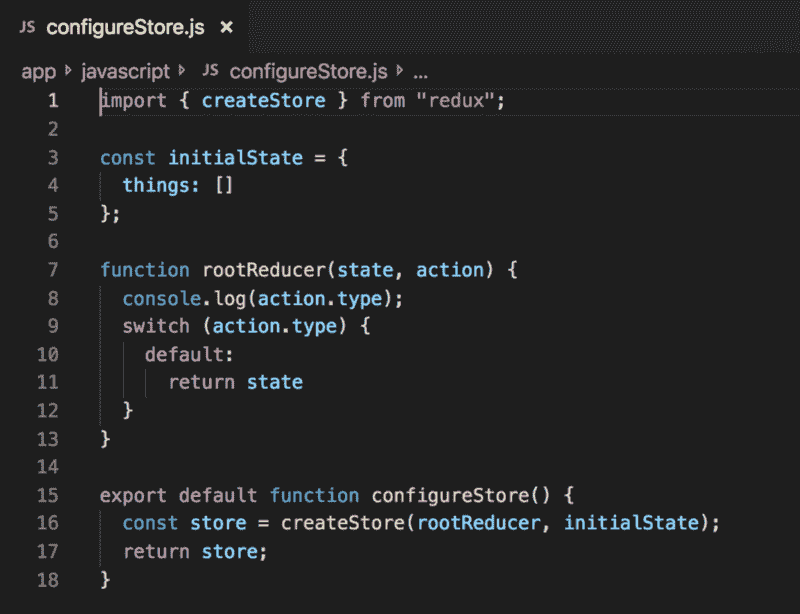

Code to initialize our Redux State, and our first Reducer!** 

**现在导入并使用 App 组件中的`configureStore()`来创建一个 Redux 状态，并将其连接到我们的应用程序。**

**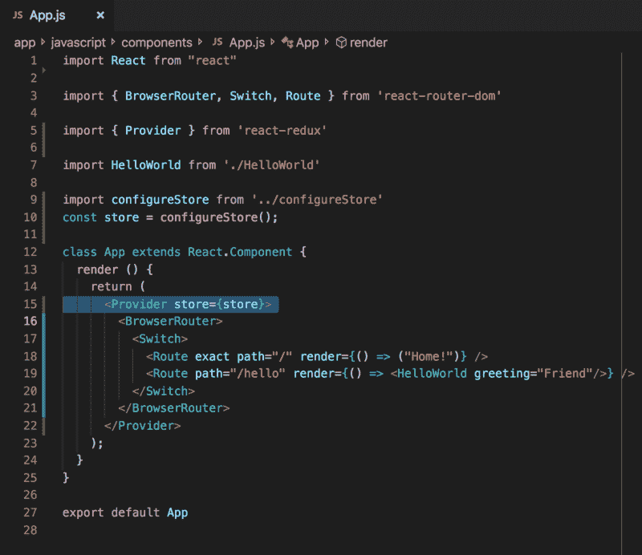

Initializing the Redux State for our App** 

**现在你的应用程序中已经安装了 Redux！接下来，我们将创建一个 Action 和一个 Reducer，并从我们的 Redux 状态开始写和读。**

### **步骤 9:添加一个动作和一个缩减器**

**现在应用程序有了一个 Redux 状态，我们将在>上添加一个`<butt`到 HelloWorld，它将调度一个动作(我们将在这里定义)，这个动作将由`y the rootRed` ucer()接收。**

**首先，添加`getThings()`动作定义，并将`createStructuredSelector()`和`connect()`导入到 HelloWorld 组件中。这将部分 Redux 状态和动作(即调度`getThings()`)映射到 HelloWorld 的道具。**

**接下来，在向 HelloWorld 发送`hes a getTh` ings()动作的>上添加一个`<butt`(来自。/actions/index.js)。**

**

HelloWorld component with all some new Redux helper code** 

**所有东西都添加到 HelloWorld 后，转到`[http://localhost:3000/hello](http://localhost:3000/hello)`，打开控制台，点击“getThings”按钮，查看你的动作和 Reducer 函数被调用。**

**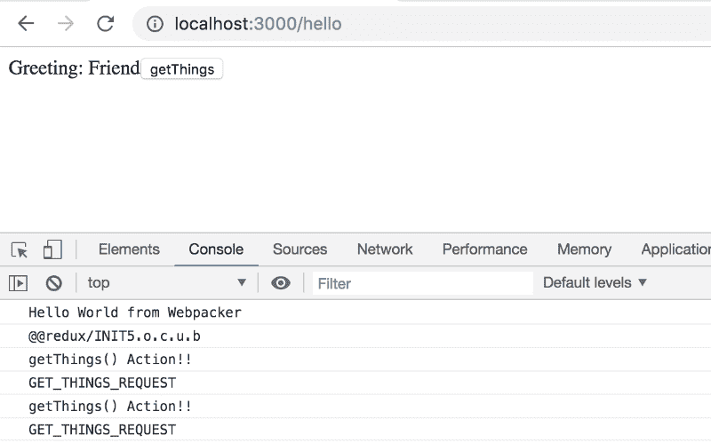

Look at the console.log() output to see our Action being dispatched** 

**现在您可以发送一个可以被 Reducer 接收的动作，让 Reducer 改变 Redux 状态。**

### **步骤 10:让 HelloWorld 读取反应状态并显示“事物”**

**在 HelloWorld 中插入一个列表`<` ul >，并用 Redux 状态中的“东西”填充它。**

**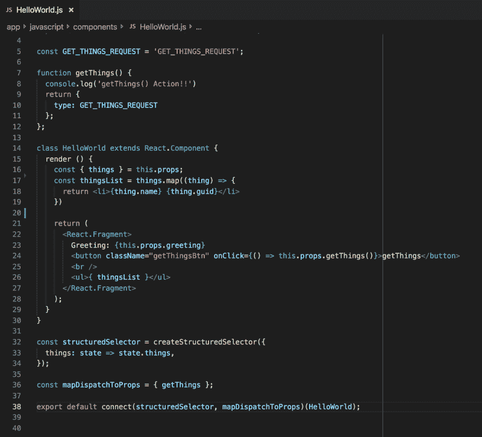

HelloWorld with <ul> that reads “things” from our Redux State** 

**为了测试这是否真的有效，我们可以用一些“东西”数据进行初始化。完成后，我们可以刷新页面并在列表中看到它。**

**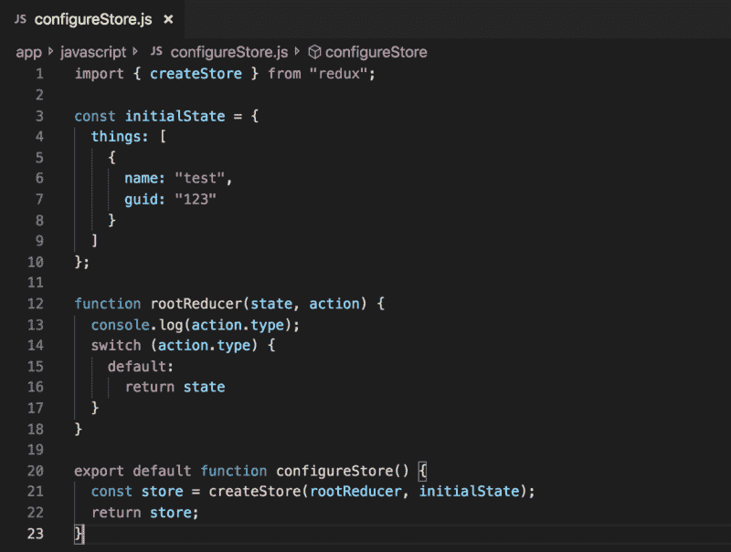

Initialize our Redux State with some “things” to see if the front-end <ul> is reading it properly** 

**现在我们有了一个简单的动作和工作的 Reducer，我们将扩展它，使动作查询我们的 Rails API，Reducer 用 API 响应设置“事物”的内容。**

### **步骤 11:安装 Redux-Thunk**

**我们将需要 [Redux-Thunk](https://github.com/reduxjs/redux-thunk) 来允许异步工作流(像 HTTP 请求)分派动作。**

**通过运行以下命令安装`redux-thunk`:**

```
`npm install --save redux-thunkyarn install`
```

**现在，让我们在行动中使用 Thunk！**

### **第 12 步:使用 redux-thunk 和 fetch()查询 API，并用结果设置 React 状态**

**首先，让我们将`redux-thunk`导入到`configureStore.js`中，并将其安装到我们的 Redux Store 中，这样我们的应用程序就可以处理“Thunk”动作。**

**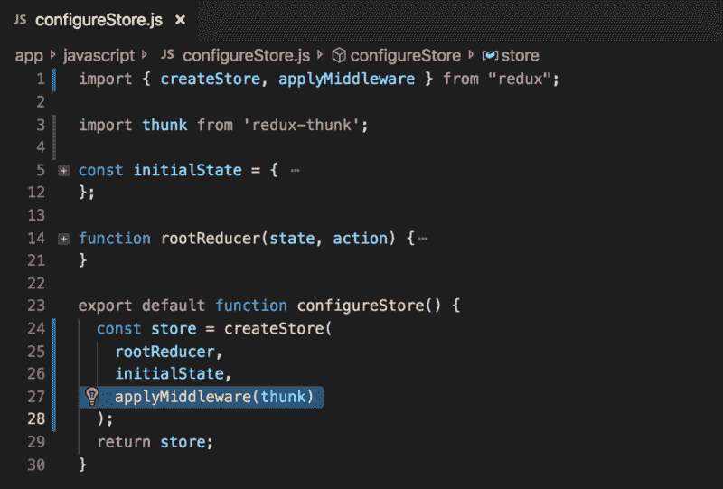

Need to install Redux Thunk as a Redux middleware in our App.** 

**现在，通过启动应用程序并加载页面来测试一切是否正常。**

**接下来，让我们将`getThings()`动作改为返回一个执行以下操作的函数(而不是返回动作对象):**

1.  **分派原始操作对象**
2.  **调用我们的 Rails API。**
3.  **当调用成功时，调度一个新的动作`getThingsSuccess(json)`。**

**对于这一步，我们还需要添加`getThingsSuccess(json)`动作。**

**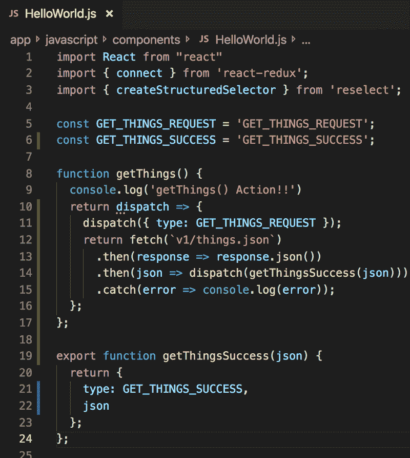

Our new getThings() Action function that does a lot more than returning a simple object — thanks to Redux Thunk!** 

**当然，这对 Redux 状态没有任何影响，因为我们的 Reducer 没有做出任何改变。要解决这个问题，需要更改 Reducer 来处理`GET_THINGS_SUCCESS`动作并返回新的状态(带有来自 Rails API 的响应)。**

**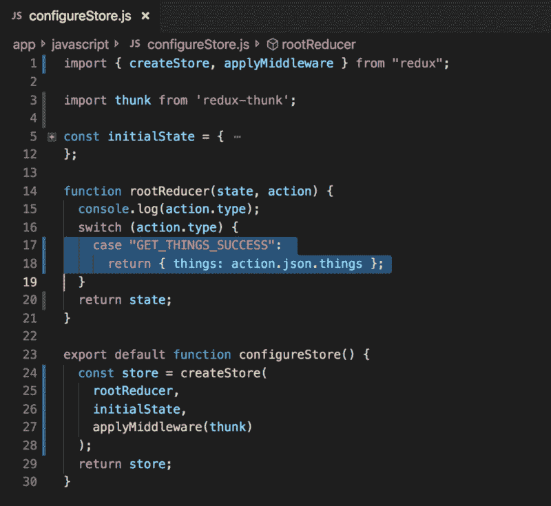

Have our Reducer change the Redux State when GET_THINGS_SUCCESS is dispatched** 

**现在，如果你启动你的应用程序，导航到`localhost:3000/hello`并点击按钮，你的列表应该会改变！**

****

**这就是了。一个挂在 React+Redux 应用上的 Rails API。**

### **(奖励)步骤 13:安装 Redux 开发工具**

**也许我应该把这一步放得更早，但是 [Redux Dev Tools](https://github.com/zalmoxisus/redux-devtools-extension) 对于调试你的应用程序正在发送的动作，以及这些动作如何改变你的状态是必不可少的。**

**这是你如何安装它。首先，为你的浏览器安装合适的扩展( [Chrome](https://chrome.google.com/webstore/detail/redux-devtools/lmhkpmbekcpmknklioeibfkpmmfibljd) ，Firefox)。**

**接下来，运行以下命令来安装库。**

```
`npm install --save-dev redux-devtools-extensionyarn install`
```

**现在，用它来初始化 Redux 状态存储。**

**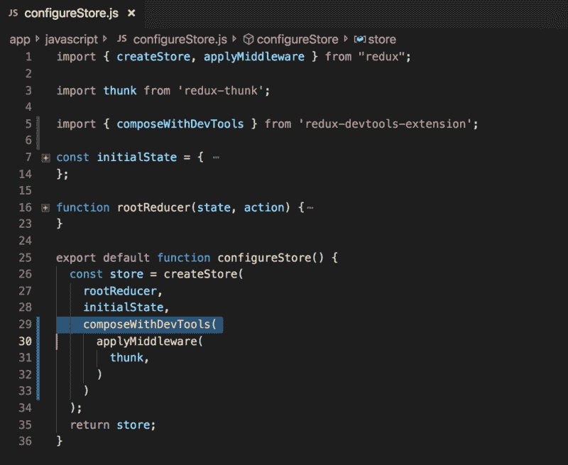

Install Redux Dev Tools in your App. You will need to do some extra modifications to turn this off in production mode.** 

**完成所有这些后，您应该能够在 Chrome(或 Firefox)开发工具中看到一个新的选项卡 Redux，它让您看到哪些操作被调度，以及每个操作如何改变应用程序的状态。React 选项卡还将显示所有组件及其属性和状态。**

**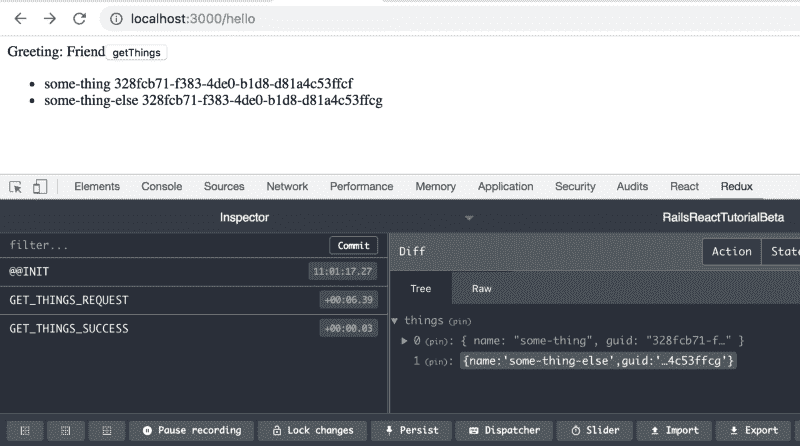

Debugging React Components and Redux State/Actions gets 100x easier with this** 

**调试愉快！**

### **(加分)第十四步:语义 UI**

**Semantic 是一个很棒的 UI 组件库，让快速构建好看的网站变得非常容易。**

**要安装该库，请运行以下命令。**

```
`npm install --save semantic-ui-css semantic-ui-reactyarn install`
```

**将此添加到`app/javascript/packs/application.js`:**

```
`import 'semantic-ui-css/semantic.min.css';`
```

**并将此添加到`app/views/static/index.html.erb`:**

```
`<%= stylesheet_pack_tag "application", :media => 'all' %`
```

**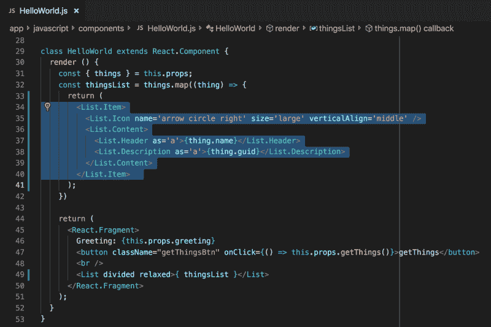****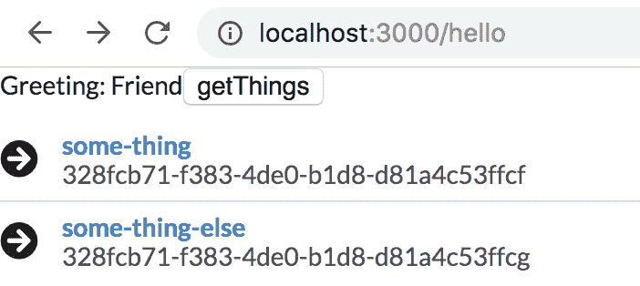

Nice UI made easy!** 

### **(加分)第十五步:使用合理的目录结构**

**这一步完全是可选的，与 App 的功能无关。只是我对你应该如何组织你的文件的看法。**

**正如你可能猜到的，把你的动作和你的组件放在同一个文件里，并且你的整个应用只有一个缩减器，当你的应用增长的时候，这个缩减器不能很好的伸缩。以下是我建议的文件结构:**

```
`app|-- javascript   |-- actions      |-- index.js      |-- things.js   |-- components   |-- packs   |-- reducers      |-- index.js      |-- things.js`
```

### **(奖金—2019 年 3 月 17 日更新)第十六步:安装 Typescript！**

**Typescript 就像 Javascript 一样，但是有类型！它被描述为 Javascript 的一个“[严格语法超集”，这意味着 Javascript 被认为是有效的类型脚本，“类型特性”都是可选的。](https://en.wikipedia.org/wiki/TypeScript)**

**IMO Typescript 非常适合大型 Javscript 项目，比如大型 React 前端。下面是如何安装它的说明，以及它在我们项目中的一个小演示。**

**首先，运行以下命令(摘自 [Webpacker 自述文件](https://github.com/rails/webpacker/blob/master/docs/typescript.md)):**

```
`bundle exec rails webpacker:install:typescriptyarn add @types/react @types/react-dom`
```

**现在，为了查看它的运行情况，让我们将`app/javascript/reducers/things.js`重命名为`things.tsx`，并在文件顶部添加以下几行:**

**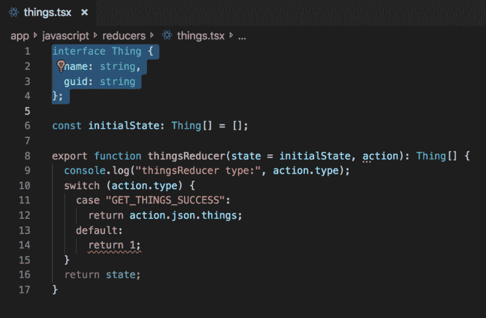

Lets add an interface to tell Typescript what “Thing” should be** 

**添加完`interface Thing`后，让`const initialState`使用该类型(见上面的截图)，并指定`thingsReducer`返回一个类型为`Thing`的数组(也见截图)。**

**一切都应该还能工作，但是要看到 Typescript 的运行，让我们给`thingsReducer`添加一个`default` case，并添加`return 1`。由于`1`不是`Thing`类型，我们将看到`./bin/webpack-dev-server`的输出失败，如下所示:**

**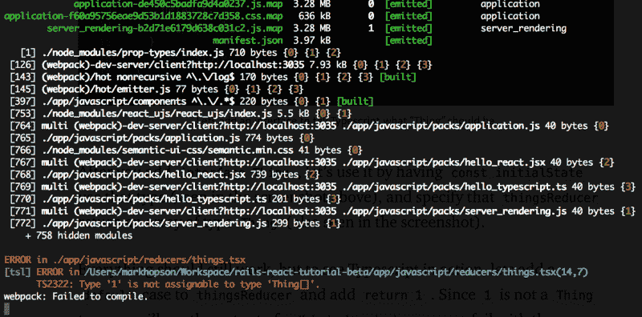

Type Thing being enforced in our code** 

**就是这样！现在可以将 Typescript `.tsx`文件添加到项目中，并开始在项目中使用类型。**

**[这里有一个关于 Typescript 以及为什么应该使用它的很好的概述](https://stackoverflow.com/a/35048303/1176788)。**

### **结束了**

**你成功了！你做了一个使用 React 和 Redux 的 Rails 应用。教程到此为止。我希望你玩得开心，并且在这个过程中学到了一些东西。**

**如果你用 React 和 Rails 构建了一些东西，请在下面的评论中分享——以及你对我的任何问题或评论。**

**感谢阅读！**