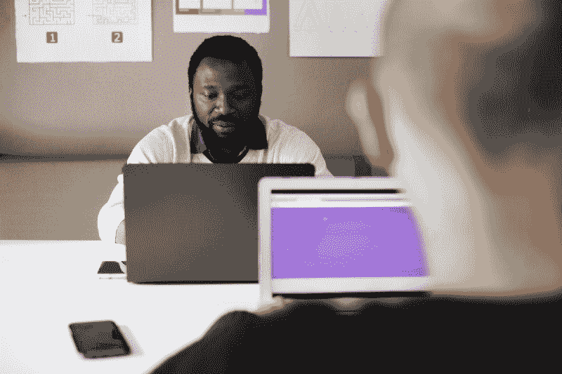

# 如何在多台设备上同步您的游戏应用

> 原文：<https://www.freecodecamp.org/news/how-to-synchronize-your-game-app-across-multiple-devices-88794d4c95a9/>

舒坎特·帕尔

# 如何在多台设备上同步您的游戏应用

如果你有在线游戏同步的问题，你来对地方了！



Photo by [rawpixel](https://unsplash.com/@rawpixel?utm_source=medium&utm_medium=referral) on [Unsplash](https://unsplash.com?utm_source=medium&utm_medium=referral)

在最低水平上，典型的游戏可以被分解成每个玩家采取的简单步骤——它们被称为回合，在每个回合中都有一步棋。玩家没有必要一次只有一次机会，或者一次只能走一步。要在多个在线设备上同步你的游戏应用，你需要能够将你的游戏分成这些小步骤。

### 我们的模型

在本文中，我们以一个简单的普通双人棋盘游戏为例。在做任何事情之前，我们需要两个玩家，对吗？

为此，您需要实现一个名为 matchmaking 的功能，在这个功能中，您的 firebase 数据库中有一个公共节点，每个玩家都可以在这里发布他们的挑战。发布的挑战包含挑战者的 UID 和另一个对将发布移动的移动节点的引用。如果你还没有这样做，或者在实施时遇到了问题，请阅读这篇关于[matching](https://medium.com/@sukantk3.4/match-making-with-firebase-hashnode-de9161e2b6a7)的文章。

一旦两个玩家都获得了移动节点，其中一个玩家必须发布他们的第一个移动，然后第二个，然后第一个，以此类推。我们将使用 Firebase 的`ChildEventListener`接收对手发布的招式。

### 深入研究代码

基本上，我们有两件事要做:发送移动和接收移动。我们的`FirebaseGameSynchronizer`组件会这样做，但是**对移动的解释将由您实现的`Modulator`来完成。**

**移动者**使用`sendMoveMsg`发送他们的移动。你可以用多种方式编码你的动作。例如，如果一个棋子从(a，b)移动到(c，d)，那么将该移动编码为数字`abcd`。如果你的样本大小(或者如果是棋盘游戏，棋盘大小)小于 10，我肯定会推荐这个方法。

`sendMoveMsg`基本上将移动上传到移动节点`mMovesRecordList`并期望其他玩家听到它。

一旦移动被公布，双方球员都收到移动。等一下…你不想让移动者接受移动——因为你可能已经在他们那端完成了移动，不想做第二次。

所以，我还添加了一个很酷的特性(如果你想让两个玩家都接受移动，只需删除所有对`mSelfMoveSoph`的引用):自移动信号量。每次调用`sendMoveMsg`时，它都会增加到`mSelfMoveSoph`。我们知道用这个旗语我们已经上传了多少步棋。

每当火基增加一个招式时，就会调用`onChildAdded`。如果信号量有值，它忽略移动；否则，调用`mMessageModulator`来解释移动并显示给用户。`Modulator`是一个功能接口，是对你的移动到字符串编码器的补充。它将该字符串上传到 Firebase，并将其转换为 move。

### **等等，如果用户接到电话**那就不行了

是的，如果用户接到一个电话，你的应用程序被杀了…用户将如何恢复游戏？

还是那句话，让我们做一个这样的`Modulator`:

```
public class GenericGameFragment implements FirebaseGameSynchronizer.Modulator {
```

```
 public void onMoveReceived(boolean isSyncingPast, String encodedMsg) {       // ... do move, show it on UI .....
```

```
 }
```

```
}
```

现在会发生两件坏事:

1.  如果用户离开，`FirebaseGameSynchronizer`将被留在监听它的节点上。这是内存+ CPU 使用泄漏。
2.  `FirebaseGameSynchronizer`将引用您的片段——只要看到它，调制器必须更新 UI 并引用`GenericGameFragment`。

### 与移动节点同步和不同步

我用了一个相对简单的方法来解决这个问题。这是两件事的结合:

1.  **同步标志:**当您设置同步属性时，`FirebaseGameSynchronizer`将调用调制器，否则，它将把移动存储在缓冲区中。再次设置同步标志时，它首先释放其缓冲区中的移动。
2.  **附件:**每当片段的`onStop`方法被移除，并且在片段的`onStart`上被再次设置。

在使用这个“新”同步器之前，记得调用`startSync()`。在`onStop`呼叫`stopSync`，在`onResume`再次呼叫`startSync`。现在，你应该调用`onDestroy`中的`detachModulator`和`flush`。

查看此链接了解完整实现:[FirebaseGameSynchronization Gist](https://gist.github.com/SukantPal/bf90b4aa7b6859cf54b0133a0abd2594)。

延伸阅读:

*   Firebase Match Maker——如何使用 Firebase 构建多人 Android 游戏？
*   [棋盘游戏的自定义布局——棋盘布局！！！](https://medium.com/@sukantk3.4/custom-layout-for-board-games-in-android-ab6d1a321ff6)